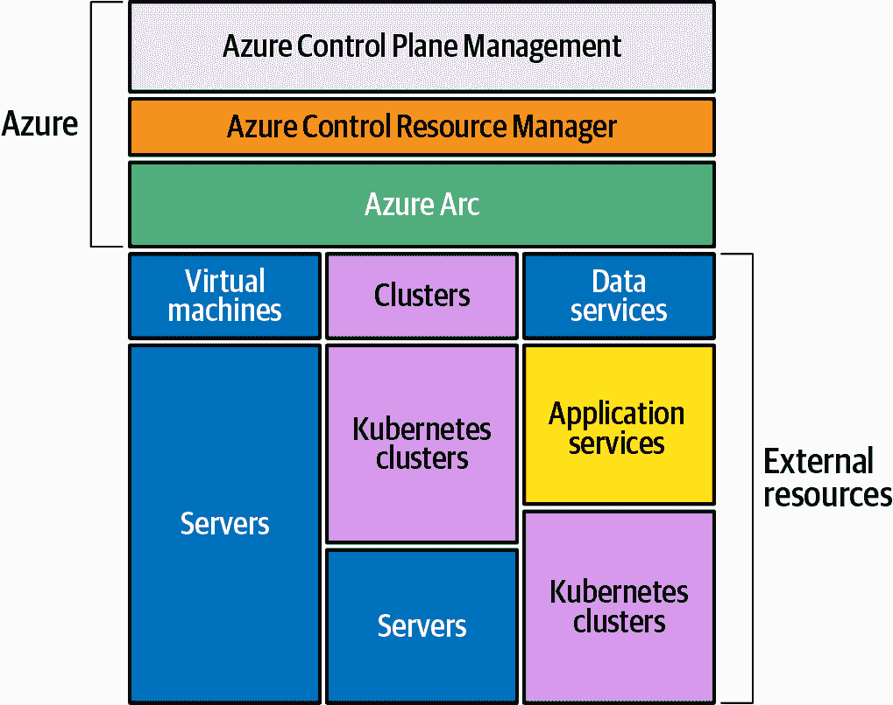

# 第一章：Azure Arc 跨多云的一致性

在本章中，您将踏上一段多云之旅，并了解整个 Azure Arc 服务所提供的概述。

# 什么是 Azure Arc？

在当今的科技世界中，许多大大小小的组织都已经接受了云计算。组织通常选择混合和多云策略，他们经常有一些工作负载在本地运行，而其他工作负载则在多个云提供商之间运行。

组织采用混合和多云策略有很多原因：它帮助他们实现本地投资的好处，避免供应商锁定，并最小化来自单个云提供商的停机风险，同时使他们能够利用他们选择的任何云提供商的技术创新。

随之而来的是新的部署和管理挑战。其中一个首要挑战是处理每个云提供商之间的差异以及用于管理和治理的本地工具的差异。这可能会导致运行成本高昂且难以跟上。

另一个挑战是技能水平——让您的 IT 团队掌握单个云平台已经具有挑战性，但掌握两个或三个不同的云平台则更加困难。能够在单个工具集或云上进行培训降低了团队管理多云的门槛。有解决这一挑战的解决方案，Azure Arc 就是其中之一。

Azure Arc 是一种基于软件的云解决方案，直接响应本地和多云管理需求。微软在 2019 年的年度 Ignite 大会上宣布了 Azure Arc，这引起了人们的兴奋和关注，因为它改变了云计算的世界。

Azure Arc 通过将其扩展到多云，扩展了微软混合云产品。Azure Arc 旨在通过将 Azure 平面及其管理工具带到本地、边缘和多云环境中，简化复杂和分布式环境。Azure Arc 使 IT 团队能够部署工作负载和管理资源，无论它们存在于何处。

Azure Arc 将 Azure 资源管理（ARM）平台和 Azure 本地管理服务扩展到资源，无论这些资源是否存在于 Azure 中。这意味着资源可以从 Azure 中的任何环境中进行管理，无论它们是：

+   本地

+   非 Azure 云（例如，AWS，GCP 等）

+   微软混合云（例如，Azure Stack Hub，Azure Stack HCI，Azure Stack Edge）

图 1-1 展示了 Azure 控制平面、Azure 资源管理器和 Azure Arc 与 Azure Arc 管理下的外部资源之间的关系。

您还可以使用 Azure Arc 将工作负载部署到任何环境。例如，您可以将容器化工作负载部署到运行在 Azure 或非 Azure 环境中的 Kubernetes 集群，或者将 SQL 或 PostgreSQL 数据库部署到非 Azure 基础环境。通过 Azure Arc，您实质上是将资源从其他环境投影到 ARM 中。一旦将资源投影到 Azure Arc 中，您可以开始使用 Azure 原生工具进行治理、管理和部署。

###### 图 1-1\. Azure 通过 Azure Arc 连接外部资源的图示

此时此刻，Azure Arc 能够管理以下托管在 Azure 外部的资源类型：

服务器

支持 Linux 和 Windows，裸金属服务器，本地服务器，AWS EC2 虚拟机，GCP 计算引擎虚拟机，VMWare 虚拟机和 Hyper-V 虚拟机。

Kubernetes

支持本地 Kubernetes 集群，Rancher K3s，AWS EKS 集群和 GCP GKE 集群。

数据服务

支持 SQL 数据库和 PostgreSQL。

一些可以扩展的 Azure 服务包括：

+   基于角色的访问控制（RBAC）

+   订阅

+   管理组

+   资源组

+   标记

+   安全中心

+   Azure Defender

+   Azure Sentinel

+   Azure 策略

+   Azure 策略客户端配置

+   更新管理

+   变更跟踪

+   库存

+   Azure 自动化

+   Azure 监视器

+   GitOps

除了那些 Azure 服务之外，通过将非 Azure 资源纳入 Azure Arc 管理，您还可以启用以下 Azure 功能、服务和工具：

+   在 Azure 门户中查看和访问

+   Azure SDK

+   ARM 模板

+   Azure CLI

+   Azure PowerShell 模块

+   Azure Terraform 提供程序

让我们花点时间来解读此时此刻的 Azure Arc 定价。Azure Arc 启用的 Kubernetes 和 Azure Arc 启用的数据服务目前处于预览阶段，并且不需要额外费用。

Azure Arc 启用的服务器目前免费管理 Azure Arc 投影服务器。Azure VM 使用许多本地 Azure 管理服务，例如库存、变更跟踪、更新管理、Azure 策略和 Azure Arc 控制平面功能。请注意，对于每个额外的 Azure 管理服务（例如 Azure 监视器、Azure 策略客户端配置、安全中心、Azure Defender、Azure Sentinel 和 Azure 自动化），都会收取费用。您可以查看 Azure Arc [定价页面](https://oreil.ly/HZOrV) 获取最新的定价更新。

Azure Arc 控制平面功能免费提供。被视为 Azure Arc 控制平面的服务包括：

+   通过 Azure 管理组和标记进行资源组织

+   通过资源图进行搜索和索引

+   通过 Azure RBAC 和 Azure 订阅进行访问和安全管理

+   环境和自动化通过 ARM 模板和 Azure 扩展

已经在使用 Azure Arc 的一些公司包括西门子、毕马威、Avanade 和 Ferguson。

# Azure Arc 实现了“单一管理视图”的承诺。

长期以来，信息技术专业人员一直梦寐以求的“单一管理视图”：一个单一的仪表板或集中的位置，可用于管理资源和工作负载。许多产品承诺提供这种单一管理视图，但未能兑现承诺。

显然，市场正在需求多云；根据 [Flexera's 2020 State Of The Cloud Report](https://oreil.ly/K-t9W)，93% 的企业采用了多云战略。多云推动了对单一管理视图的需求进一步增加，因为多云架构更为复杂和具有挑战性。有必要拥有工具，能够在多个云之间强化治理和安全管理资源和工作负载。微软已经响应了这一需求，与市场上的竞争对手以及 Azure Arc 的同类产品相比，它因其独特的设计和方法脱颖而出，允许您将工作负载留在希望的位置，并将 Azure 工具扩展到这些工作负载上。

当然，还有其他可用的技术。例如，Google 提供了 Anthos，这是一个托管的应用平台，将 GCP 服务扩展到任何环境。使用 Anthos，方法是将工作负载迁移到运行在 Google Kubernetes Engine（GKE）上的容器中。相比之下，Azure Arc 的方法是提供灵活性，允许用户选择将资源保留在本地、其他云中，或者在 Azure 中运行。与 Anthos 相比，Azure Arc 允许客户在虚拟机或容器上运行；Arc 将控制平面扩展到两者，并作为这些资源的总体管理层。Arc 可用于协助涵盖虚拟机、数据库实例和 Kubernetes 集群的资源生命周期，而其竞争对手则专注于容器。

通过 Arc，客户可以将应用程序部署到虚拟机或 Kubernetes 集群，无论它们位于何处，都可以投影到 Azure Arc 中，为 Azure 内的信息技术专业人员提供真正的单一管理视图的圣杯。

这使我们结束了对 Azure Arc 的概述。在本报告中，我们不会深入探讨 Azure Arc 启用的服务器或数据服务，因为重点是 Azure Arc 启用的 Kubernetes。接下来的章节将进一步探讨 Azure Arc 启用的 Kubernetes。
