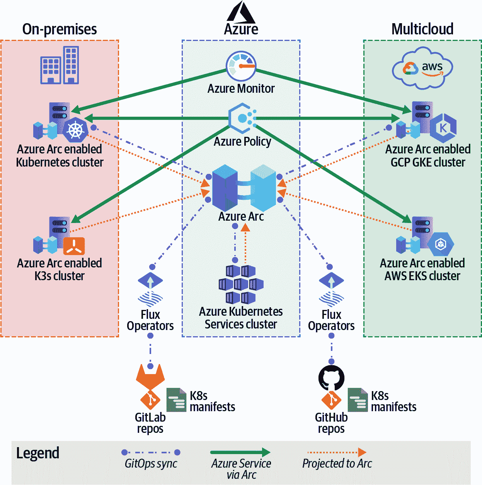

# 第二章：扩展 Azure 控制平面用于 Kubernetes

在本章中，我们将扩展讨论 Azure Arc，专注于如何在多个云环境中使用它来管理 Kubernetes。

# 什么是 Azure Kubernetes 服务？

容器和 Kubernetes 在技术上的爆炸已经不是秘密。随着公司内容器的增长继续增加，公司需要管理的容器数量也在增加。

许多公司到达一定阶段需要一种有效管理和编排容器的方式。Google 将 Kubernetes 作为容器的开源编排系统发布，公司以惊人的速度采纳，它已成为容器编排的首选。随着 Kubernetes 在企业中的普及，各大云提供商在其云平台上创建了托管的 Kubernetes 服务。Microsoft 在 Azure 云平台上创建了 Azure Kubernetes 服务（AKS）。

在我们讨论 Azure Arc 可启用的 Kubernetes 之前，谈论 AKS 和它的重要性是很重要的。当 Kubernetes 集群投影到 Azure Arc 中时，它们与 AKS 有一些类似的功能，例如监视、Azure 策略等。这意味着从 Kubernetes 获取信息和管理变得更加简单。

AKS 是 Microsoft 在 Azure 云平台上推出的托管 Kubernetes 服务，于 2018 年发布。它减少了管理自己的 Kubernetes 集群实例的管理开销。使用 AKS，您只需管理代理节点，Microsoft 为您管理控制平面。您可以与许多原生 Azure 服务集成，例如：

+   Azure 网络

+   Azure Active Directory 用于 RBAC

+   Azure 策略

+   Azure 监视器用于 Kubernetes 和容器监视

+   Azure 容器注册表

+   Azure 安全中心

+   Azure Defender

+   Azure 存储

+   Azure 容器实例

使用 AKS，Microsoft 已经并且持续以超快速度交付创新。Microsoft 添加到 AKS 中的一些功能，使 Kubernetes 的体验更加简单和增强，包括 Kubernetes 资源，可以在 Azure 门户中查看/管理 Kubernetes API 对象（例如 pods、services、namespaces 等），用于开发人员在 Kubernetes 集群上更轻松地与 Visual Studio 和 VS Code 进行客户端集成的 Dev Spaces，以及使用托管身份验证标识实现更安全、更无缝的服务账户方法。

# Azure Arc 可启用的 Kubernetes

正如我们之前讨论过的，许多组织已经转向多云环境。我们还讨论了如何跨多个环境和云管理资源和工作负载是一个挑战。Kubernetes 经常被称为一种可以帮助公司避免供应商锁定并提供在云之间移动灵活性的技术。

尽管运行在 Kubernetes 上的容器工作负载是可移植的，从而更容易在本地或云端运行，但对于组织及其 IT 团队来说，跨多个云环境管理特定配置和工作负载仍然是一项艰巨的挑战。

通过 Azure Arc 启用的 Kubernetes，Microsoft 旨在简化管理多个 Kubernetes 集群的挑战——无论它们在何处运行——并简化流程。Azure Arc 不仅可以混合匹配云和虚拟机，还允许您混合匹配 Kubernetes 集群。截至撰写本文时，Azure Arc 启用的 Kubernetes 处于公共预览阶段，仅支持东部美国和西欧地区。发布一般可用时将支持更多地区。

简言之，Azure Arc 启用的 Kubernetes 允许客户将运行在本地或其他云提供商上的 Kubernetes 集群与 Azure 连接，实现在 Azure 云平台内的统一管理体验。它支持大多数开箱即用的 Cloud Native Computing Foundation (CNCF) 认证 Kubernetes 发行版。图 2-1 展示了可以使用 Azure Arc 启用的 Kubernetes 管理的各种托管 Kubernetes 云服务提供。

###### 图 2-1\. 使用 Azure Arc 启用的 Kubernetes 管理的多云 Kubernetes 集群

通过 Azure Arc 启用的 Kubernetes，我们可以实现以下功能：

+   利用 Azure Active Directory RBAC 访问 Kubernetes 集群。

+   对在 Azure 或非 Azure 环境和云中运行的 Kubernetes 集群进行清单编制、分组和标记。

+   利用 Azure Monitor 监控 Kubernetes 集群和容器。

+   利用 Azure Policies 通过应用 Azure Policies 对 Kubernetes 集群进行治理。

+   使用 Kubernetes 清单或 Helm Charts 部署应用程序，并通过 GitOps 进行配置。

图 2-2 展示了 Azure Arc 启用的 Kubernetes 和 GitOps 架构的示例，包括如何在 Azure Arc 中映射 Kubernetes 集群。

###### 图 2-2\. Azure Arc 扩展集群管理图示
