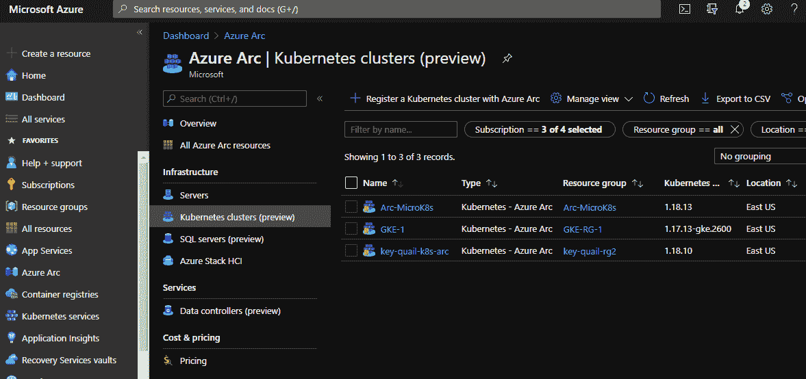
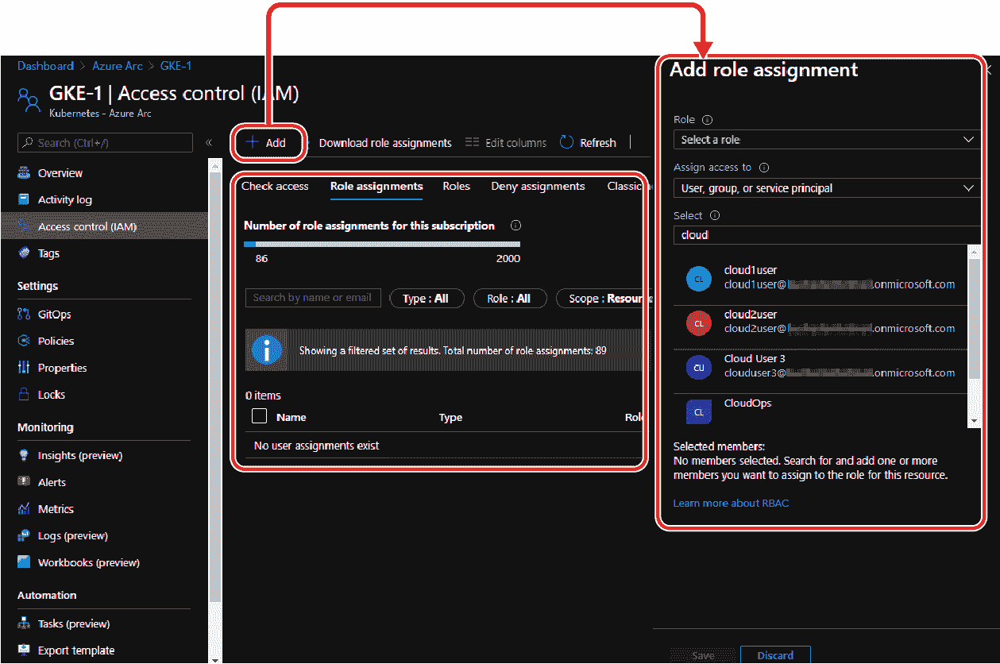
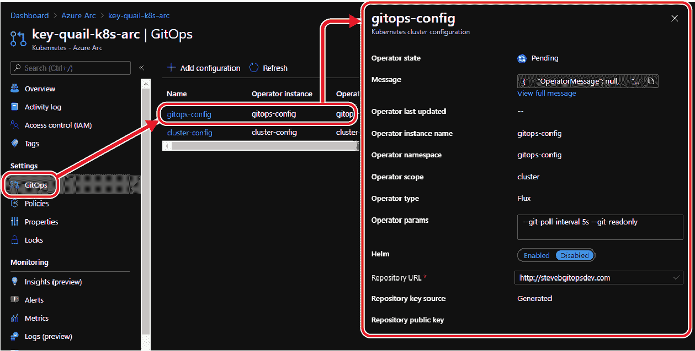
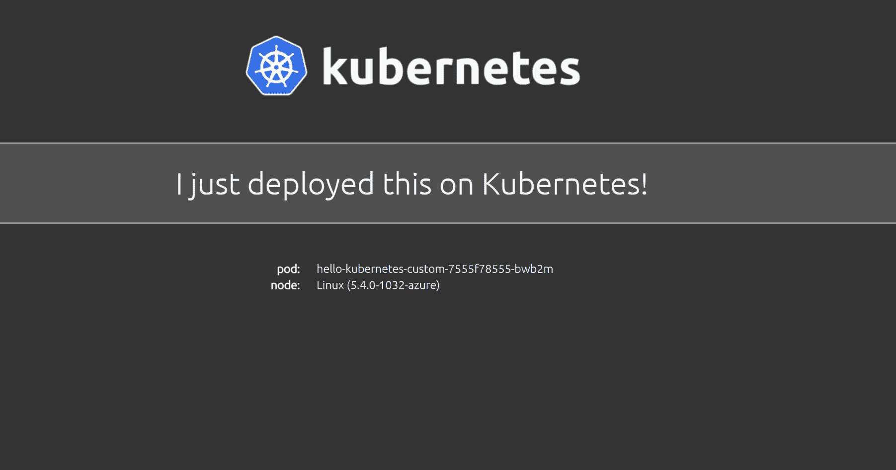
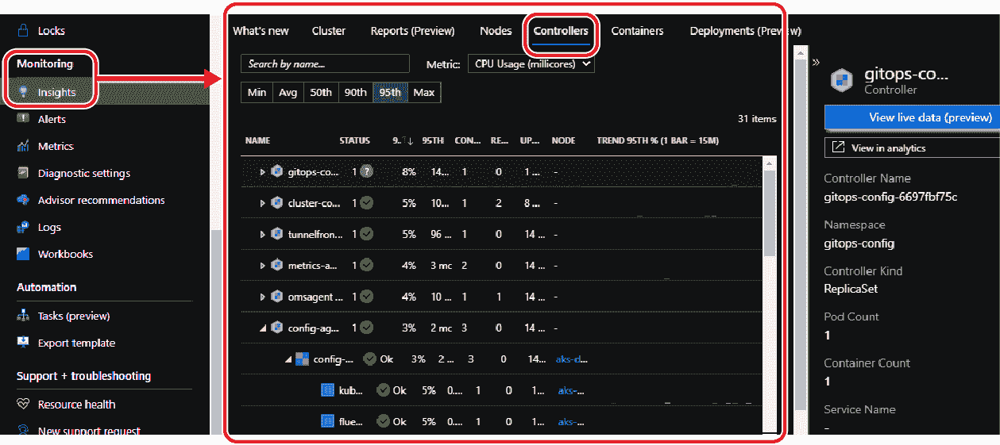

# 第四章：使用 Azure Arc 启用的 Kubernetes

在这最后一章中，让我们开始探讨与 Azure Arc 启用的 Kubernetes 相关的架构及如何启动、监控和使用 RBAC 在 Azure Arc 预期 Kubernetes 集群中。我们还将深入了解如何使用 GitOps 将应用程序部署到 Azure Arc 预期 Kubernetes 集群。

# Azure Arc 启用的 Kubernetes 架构和代理

Azure Arc 启用的 Kubernetes 本质上是在 Azure 中运行的 PaaS。服务本身的架构被抽象化了。 Azure Arc 启用的 Kubernetes 架构通常包括一些 Azure 服务、资源、工具和代理，以及在预期 Kubernetes 集群上运行的一些部署和 Pod。让我们详细解析一下架构和代理的内容。

首先，您需要在 Azure 或 Azure 之外运行的 Kubernetes 集群。这可以是 AKS；GKE；EKS；在 Azure、AWS、GCP、本地或边缘设备上运行的 VM 中的 Kubernetes；Rancher K3s；甚至是在边缘设备上运行的 Kubernetes。这将成为您在启用 Azure Arc 的 Kubernetes 中的预期 Kubernetes 集群。

您需要*kubeconfig*文件以访问集群，并在预期 Kubernetes 集群上具有 cluster-admin 角色。这将为部署 Arc 代理所需的访问权限。

您需要 Azure 命令行界面（Azure CLI）版本 2.3 或更高版本。这是安装 Azure Arc 启用的 Kubernetes 接口扩展和执行预期 Kubernetes 集群的注册任务所需的。

您需要在 Azure 中创建一个服务主体名称（SPN）。这个 SPN 必须具有对*Microsoft.Kubernetes/connectedClusters*资源类型的读写权限。此 SPN 还将与`az login`和`az connectedk8s connect`命令一起使用。

您需要在运行 Azure Arc 启用的 Kubernetes 的 Azure 订阅中启用以下 Azure Arc 提供程序：

+   `Microsoft.Kubernetes`

+   `Microsoft.KubernetesConfiguration`

您需要加载`connectedk8s`扩展和 Arc 启用的 Kubernetes CLI 扩展。此外，您需要 Helm 3，因为在使用`az connectedk8s`扩展将预期 Kubernetes 集群连接到 Arc 时会用到它。

您将在预期 Kubernetes 集群上运行 Azure Arc 启用的 Kubernetes 代理。为了使代理工作，以下网络协议/端口和出站 URL 需要在预期 Kubernetes 集群网络上允许：

协议/端口

+   TCP on port 443

+   TCP on port 9418

允许从预期 Kubernetes 集群出站的终点（DNS）

+   [`management.azure.com`](https://management.azure.com)

+   [`eastus.dp.kubernetesconfiguration.azure.com`](https://eastus.dp.kubernetesconfiguration.azure.com)

+   [`westeurope.dp.kubernetesconfiguration.azure.com`](https://westeurope.dp.kubernetesconfiguration.azure.com)

+   [`login.microsoftonline.com`](https://login.microsoftonline.com)

+   [`mcr.microsoft.com`](https://mcr.microsoft.com)

+   [`eus.his.arc.azure.com`](https://eus.his.arc.azure.com)

+   [`weu.his.arc.azure.com`](https://weu.his.arc.azure.com)

一旦代理加载并且预计的集群已经加入到 Arc 中，将在预计的 Kubernetes 集群上运行一个命名空间`azure-arc`。

在`azure-arc`命名空间中，还将作为 Deployments（即`deployment.apps`）运行在预计的 Kubernetes 集群上的运算符。它们是：

`config-agent`

当在预计的集群上应用`sourceControlConfiguration`资源时，监视预计的 Kubernetes 集群以更新合规状态。

`controller-manager`

协调 Azure Arc 组件之间的交互。它是一个用于操作其他运算符的运算符。

`metrics-agent`

收集其他 Arc 代理的指标以衡量性能并确保其优化。

`cluster-metadata-operator`

收集集群和 Azure Arc 代理的版本、集群元数据和节点计数。

`resource-sync-agent`

将集群-metadata-operator 收集的元数据与 Azure Arc 同步。

`clusteridentityoperator`

持有一个被其他运算符用来与 Azure 通信的托管服务身份（MSI）证书。

`flux-logs-agent`

作为`sourceControlConfiguration`的一部分，flux 运算符被部署到预计的 Kubernetes 集群(s)，并且该代理从它们那里收集日志。

在 azure-arc 命名空间中，将有一些运行在预计的 Kubernetes 集群上的 Pods：

+   `cluster-metadata-operator-b88f6695d-rf998`

+   `clusteridentityoperator-6459fd778c-4wx66`

+   `config-agent-6cc967f5-kd8b8`

+   `controller-manager-557d758b9f-f69vw`

+   `flux-logs-agent-5db8bff9d4-gktl4`

+   `metrics-agent-997cf95d5-h96gd`

+   `resource-sync-agent-587b999567-4kz64`

这总结了 Azure Arc 启用的 Kubernetes 涉及的组件，包括 Azure 服务、资源、工具、代理和涉及架构中的一些部署和 Pods。接下来，我们将探讨如何设置和使用 Azure Arc 启用的 Kubernetes。

# 创建一个服务主体名称

正如前面提到的，您将需要在 Azure 订阅中创建一个服务主体名称。此 SPN 将需要在订阅中的*Microsoft.Kubernetes/connectedClusters*资源类型上具有读写权限。

您还将使用此 SPN 执行`az login`命令以及`az connectedk8s connect`命令。您可以通过在 Azure Cloud Shell 中运行一行语法来创建此 SPN。您可以使用以下语法为 SPN 创建一个名称，并将其分配给特定的订阅：

```
az ad sp create-for-rbac --name <SPNNAMEHERE> --role contributor \
  --scope /subscriptions/<SUBSCRIPTIONIDHERE>
```

您将希望将输出复制到安全的地方，因为您将需要使用它。它将看起来类似于以下内容：

```
{
  "appId": "058t8611-j9k3-4f90-80d9-ag6524c823b7",
  "displayName": " SPNNAME ",
  "name": "http:// SPNNAME",
  "password": "1a2c85hc-43qa-61f0-o4c6-rbg2c5av472r",
  "tenant": "1qr3gg34-q032-4f6h-h19r-6o34b22v530l"
}
```

# 连接 Kubernetes 集群到 Azure Arc

现在让我们准备在 Azure 中配置 Azure Arc 启用 Kubernetes 所需的内容，并将其连接到现有的 Kubernetes 集群。这个现有的 Kubernetes 集群可以是 AKS、GKE、EKS 或您自己部署的集群。您可以在 Azure Cloud Shell 中执行这一节中的操作，或者在本地使用类似 VS Code 的工具。建议您从 Bash 中执行以下操作。

请注意，由于我们要连接现有的 Kubernetes 集群，我们需要确保我们的 `KUBECONFIG` 已配置，并且我们正在针对我们计划连接到 Azure Arc 的 Kubernetes 集群的正确上下文进行操作。

首先，我们需要通过运行以下命令安装 `connectedk8s` 扩展：

```
az extension add --name connectedk8s
az extension add --name k8sconfiguration
```

接下来，我们将使用以下命令注册 Azure Arc 启用 Kubernetes 所需的 Kubernetes 提供程序：

```
az provider register --namespace Microsoft.Kubernetes
az provider register --namespace Microsoft.KubernetesConfiguration
```

在这里，我们可以使用 SPN 登录订阅，以便使用 SPN 执行剩余的任务。以下是使用 `az login` 与 SPN 的语法：

```
az login --service-principal -u SPNID -p SPNPASSWORD \
  --tenant TENANTID
```

现在我们将创建用于我们预计的 Kubernetes 集群的资源组。您应为每个计划注册到 Azure Arc 的预计 Kubernetes 集群创建一个新的资源组。作为提醒，我们必须在支持 Azure Arc 启用 Kubernetes 的两个区域之一中创建此资源组。使用以下语法创建资源组：

```
az group create -l EastUS -n PROJECTEDK8SRESOURCEGROUP
```

接下来，让我们为我们的 SPN 设置 Bash 环境变量，如下所示：

```
export appId=SPNID
export password=SPNPASSWORD
export tenantId=TENANTID
export resourceGroup=PROJECTEDK8SRESOURCEGROUP
export arcClusterName= PROJECTEDK8SCLUSTERNAME
```

现在我们可以将我们的 Kubernetes 集群连接到 Azure Arc 启用 Kubernetes。此操作将部署 Azure Arc 启用 Kubernetes 代理和运算符：

```
az connectedk8s connect -n PROJECTEDK8SCLUSTERNAME \
  -g PROJECTEDK8SRESOURCEGROUP
```

完成后，我们的 Kubernetes 集群将连接到 Azure Arc，并将作为 Azure Arc 启用 Kubernetes 中的预计 Kubernetes 集群显示。Figure 4-1 显示了 Azure 门户中 Azure Arc 中预计的 Kubernetes 集群的外观。



###### 图 4-1\. Azure 门户中的 Azure Arc 启用 Kubernetes 集群视图

一旦我们的 Kubernetes 集群连接到 Azure Arc，我们可以单击预计的 Kubernetes 集群，并通过访问控制（IAM）为其分配 RBAC，分配标签，锁定集群，查看其属性，为其配置 GitOps 配置，并将 Azure 策略应用于其上。

# 使用 Azure Active Directory RBAC 与 Azure Arc 预计的 Kubernetes 集群

可以使用 Azure 门户中 Azure Arc 领域的预计集群资源的访问控制（IAM）刀片来为预计的 Kubernetes 集群分配角色分配，如图 Figure 4-2 所示。



###### 图 4-2\. Azure 门户中的 Azure Arc 启用 Kubernetes RBAC 角色

请注意，RBAC 仅适用于通过 Azure 访问预投影集群。这不适用于直接访问托管平台上的集群（例如 GCP、AWS、本地等）。

# 将应用程序部署到启用 GitOps 的 Azure Arc 预投影 Kubernetes 集群

现在我们将详细介绍如何利用 GitOps 将一个简单的应用程序和其他 API 对象部署到我们在 Azure Arc 启用 Kubernetes 中的预投影 Kubernetes 集群中。

你应该首先创建你自己的公共 GitHub 仓库。在仓库中创建一个名为 *hello-kubernetes-arc-demo.yaml* 的 YAML 文件，并包含以下内容：

```
apiVersion: v1
kind: Service
metadata:
  name: hello-kubernetes-custom
spec:
  type: LoadBalancer
  ports:
  - port: 80
    targetPort: 8080
  selector:
    app: hello-kubernetes-custom
---
apiVersion: apps/v1
kind: Deployment
metadata:
  name: hello-kubernetes-custom
spec:
  replicas: 3
  selector:
    matchLabels:
      app: hello-kubernetes-custom
  template:
    metadata:
      labels:
        app: hello-kubernetes-custom
    spec:
      containers:
      - name: hello-kubernetes
        image: paulbouwer/hello-kubernetes:1.8
        ports:
        - containerPort: 8080
        env:
        - name: MESSAGE
          value: I just deployed this on Kubernetes!
```

这个 YAML 文件来自 [Paul Bouwer 的一个仓库](https://oreil.ly/CkzqI)。通常用于演示在 Kubernetes 集群中部署小型工作负载。请注意，在启用 Azure Arc 的 Kubernetes 中使用 GitOps 可以与公共和私有 Git 仓库一起工作。为了使用 GitOps 和 Git 私有仓库，你需要使用 SSH，并提供 Flux 创建的或用户提供的密钥。

接下来，我们需要创建 GitOps 配置。这将在预投影的 Kubernetes 集群上部署 Flux 操作符和 Memcached。我们将使用 `az k8sconfiguration` 命令来执行此操作。以下是运行的语法：

```
az k8sconfiguration create --name gitops-config \
  --cluster-name PROJECTEDK8SCLUSTERNAME \
  --resource-group PROJECTEDK8SRESOURCEGROUP \
  --operator-instance-name gitops-config \
  --operator-namespace gitops-config \
  --repository-url URLOFYOURPUBLICREPOHERE \
  --scope cluster --cluster-type connectedClusters \
  --operator-params="--git-poll-interval 5s --git-readonly"
```

完成后，我们可以验证新的 GitOps 配置是否已在 “Azure 门户上的 Azure Arc” > “Azure Arc | Kubernetes 集群” > [预投影 Kubernetes 集群名称] > GitOps 中创建（参见 图 4-3）。



###### 图 4-3\. 在 Azure 门户中显示的 GitOps

GitOps 已部署了运行示例应用程序所需的所有内容。它有效地部署了一个服务类型 `LoadBalancer`、一个具有三个副本的部署以及在预投影 Kubernetes 集群中运行 Web 应用程序的 Pod。你可以使用 `kubectl` 在你的预投影 Kubernetes 集群中查看新的 API 对象。

通过运行以下命令，你将能够在你的 Kubernetes 集群中看到正在运行的 Pod：

```
kubectl get pods
```

通过运行以下命令，你可以看到服务并获取负载均衡器的外部 IP：

```
kubectl get services 
```

当你在网页浏览器中访问这个 IP 地址时，你应该能看到 图 4-4 中显示的输出。



###### 图 4-4\. 通过 GitOps 在网页浏览器中部署的应用程序

现在，如果你想确保 GitOps 可以确保应用程序的期望状态，可以继续运行以下命令删除部署：

```
kubectl delete deployment hello-kubernetes-custom
```

大约五秒钟后，Flux 将会同步并重新应用 YAML 文件，将部署恢复到原来的状态。

# 使用 Azure Monitor 监控 Azure Arc 预投影 Kubernetes 集群

监控您的 Kubernetes 集群及其上运行的容器对于操作环境至关重要。您可以在 Azure Arc 启用的 Kubernetes 中使用 Azure Monitor for containers 来查看投影的 Kubernetes 集群的性能，并收集容器日志以监控工作负载。在撰写本文时，Azure Monitor for Containers 不支持 LiveData。在启用此监控之前，您需要满足以下先决条件。这些先决条件可以设置在您创建的 SPN 帐户上：

+   您需要配置一个带有 Azure Monitor for containers 的 Log Analytics 工作区。

+   至少，您需要成为 Azure 订阅中的 Azure Contributor 角色成员。

+   您需要成为配置了 Azure Monitor for containers 的 Log Analytics 工作区的 Log Analytics Contributor 角色成员。

+   您需要成为 Azure Arc 集群资源的 Contributor 角色成员。

+   您需要拥有 Log Analytics 读取者角色权限的成员身份。

+   您需要一个 HELM 客户端来为指定的 Kubernetes 集群启用 Azure Monitor for containers 图表。

让我们来设置一下。请注意，我们将要讲解的所有内容仍然在 Bash 中运行。

首先，让我们使用以下命令下载启用监视（也称为 OMS）脚本：

```
curl -o enable-monitoring.sh \
  -L https://aka.ms/enable-monitoring-bash-script
```

接下来，我们需要使用以下命令获取 Azure Arc 连接的集群 Azure 资源 ID：

```
export azureArcClusterResourceId=$(az resource show \
  --resource-group PROJECTEDK8SRESOURCEGROUP \
  --name PROJECTEDK8SCLUSTERNAME \
  --resource-type "Microsoft.Kubernetes/connectedClusters" \
  --query id -o tsv)
```

使用以下命令从当前的 `KubeContext` 检索预期的 Kubernetes 集群凭据：

```
export kubeContext="$(kubectl config current-context)"
```

使用以下语法运行 *enable-monitoring.sh* 脚本：

```
bash enable-monitoring.sh --resource-id $azureArcClusterResourceId \
  --client-id SPNID --client-secret SPNPASSWORD \
  --tenant-id TENANTID --kube-context $kubeContext
```

当 *enable-monitoring.sh* 完成后，您可以在 Azure 门户中进入“Azure Arc” > “Azure Arc | Kubernetes clusters” > [投影 Kubernetes 集群名称] > “监视 - 洞察”，查看您的投影 Kubernetes 集群的监视情况（见 Figure 4-5）。请注意，数据开始填充可能需要长达 15 分钟的时间。



###### 图 4-5\. 在 Azure Arc 启用的 Kubernetes 中查看监视的投影 Kubernetes 集群视图

# 总结

这就是我们一起的旅程的结束。让我们回顾一下我们所涵盖的内容。在本报告中，我们首先触及了多云市场需求及其如何推动在多个云上管理 Kubernetes 的需求。然后，我们简要介绍了 Azure Arc 的历史，并概述了整体服务。我们以 Azure Arc 如何实现“单一窗口”承诺来结束这一部分。

我们进入了 Azure Arc 启用的 Kubernetes 的另一条路线，首先概述了 Azure Kubernetes Service。然后，我们解释了 Azure Arc 启用的 Kubernetes 是什么以及其影响。我们深入了解了 GitOps 的定义、功能以及如何使用它，最后讨论了 Azure Arc 如何利用 GitOps。

我们随后深入探讨了 Azure Arc 的架构和组件，如何将 Kubernetes 集群连接到其中，以及如何使用 RBAC 和 Azure Monitor 来管理启用 Azure Arc 的 Kubernetes。我们还介绍了如何设置 GitOps 并将应用程序和配置部署到预期的 Kubernetes 集群。

希望您从本报告中对 Azure Arc 和 GitOps 有所收获。如果您的组织在不同环境中运行多个 Kubernetes 集群，我建议进一步了解 Azure Arc，作为简化多环境中 Kubernetes 管理需求的方法。

# 作者简介

**Steve Buchanan**（[@buchatech](https://twitter.com/buchatech)）是一家大型咨询公司云转型团队的总监和中西部容器服务负责人。他是九次获得微软 MVP 奖项的获得者，Pluralsight 的作者，撰写了六本技术书籍。作为国际演讲者，他曾在包括中西部管理峰会（MMS）、Microsoft Ignite、BITCon、Experts Live Europe、OSCON、Inside Azure management 和用户组等技术活动上发表演讲。Steve 目前专注于通过 ITSM、DevOps 和 CloudOps 将 IT 的角色转变为业务的战略合作伙伴和数字转型的推动者。他活跃于技术社区，并喜欢在他的 IT 世界冒险博客[www.buchatech.com](http://www.buchatech.com)上发布博文。
