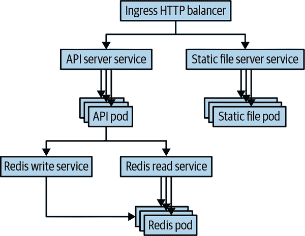

# 第一章：设置基本服务

本章描述了在 Kubernetes 中设置简单多层应用程序的步骤。我们将详细介绍的示例由两个层组成：一个简单的 Web 应用程序和一个数据库。尽管这可能不是最复杂的应用程序，但这是学习在 Kubernetes 中管理应用程序时的一个很好的起点。

# 应用程序概述

我们示例中将使用的应用程序非常简单直接。它是一个带有以下细节的简单日志服务：

+   它使用 NGINX 运行一个独立的静态文件服务器。

+   它在*/api*路径上有一个 RESTful 应用程序编程接口（API）https://some-host-name.io/api。

+   它在主 URL 上有一个文件服务器，https://some-host-name.io。

+   它使用[Let’s Encrypt 服务](https://oreil.ly/7XN3G)来管理安全套接字层（SSL）。

图 1-1 展示了该应用程序的图表。如果您一时不理解所有部件，不要担心；它们将在本章节中详细解释。我们将逐步构建这个应用程序，首先使用 YAML 配置文件，然后使用 Helm 图表。



###### 图 1-1\. 作为部署在 Kubernetes 中的日志服务的图表

# 管理配置文件

在深入研究如何在 Kubernetes 中构建此应用程序的细节之前，讨论如何管理配置本身是值得的。在 Kubernetes 中，一切都是*声明性*的。这意味着您在集群中编写应用程序的期望状态（通常是 YAML 或 JSON 文件），这些声明的期望状态定义了应用程序的所有部分。这种声明性方法远比*命令式*方法更可取，后者的集群状态是对集群一系列更改的总和。如果集群以命令式方式配置，那么理解和复制集群如何达到该状态是困难的，这使得理解或解决应用程序问题变得具有挑战性。

在声明应用程序状态时，人们通常更喜欢 YAML 而不是 JSON，尽管 Kubernetes 支持两者。这是因为 YAML 比 JSON 略微不那么冗长，更适合人类编辑。然而，值得注意的是，YAML 对缩进很敏感；在 Kubernetes 配置中经常会出现由于 YAML 中不正确的缩进而导致的错误。如果应用程序的行为不如预期，检查缩进是开始故障排除的一个好方法。大多数编辑器都支持 JSON 和 YAML 的语法高亮显示。在处理这些文件时，安装这样的工具以便更容易找到配置中的作者和文件错误是一个好主意。还有一个优秀的 Visual Studio Code 扩展，支持 Kubernetes 文件的更丰富的错误检查。

由于这些 YAML 文件中包含的声明性状态作为应用程序的真相来源，正确管理这种状态对应用程序的成功至关重要。在修改应用程序的期望状态时，您希望能够管理更改，验证其正确性，审计谁进行了更改，并在失败时可能回滚。幸运的是，在软件工程的背景下，我们已经开发了管理声明性状态以及审计和回滚所需工具。换句话说，围绕版本控制和代码审查的最佳实践直接适用于管理应用程序的声明性状态的任务。

如今，大多数人将他们的 Kubernetes 配置存储在 Git 中。尽管版本控制系统的具体细节并不重要，但 Kubernetes 生态系统中的许多工具都期望在 Git 存储库中找到文件。对于代码审查，存在更多的异构性；尽管显然 GitHub 非常受欢迎，但其他人使用本地代码审查工具或服务。无论您如何为应用程序配置实施代码审查，都应该像对待源代码控制一样认真和专注。

在为应用程序布置文件系统时，值得使用文件系统提供的目录组织来组织您的组件。通常，一个单独的目录用于包含一个*应用服务*。构成应用服务的定义在团队之间的大小可能有所不同，但通常是由 8-12 人团队开发的服务。在该目录中，子目录用于应用程序的子组件。

对于我们的应用程序，我们将文件布置如下：

```
journal/
  frontend/
  redis/
  fileserver/
```

在每个目录中都有定义服务所需的具体 YAML 文件。随着我们开始将应用程序部署到多个不同的区域或集群时，您将看到这种文件布局会变得更加复杂。

# 使用部署创建复制服务

要描述我们的应用程序，我们将从前端开始向下工作。期刊的前端应用程序是一个使用 TypeScript 实现的 Node.js 应用程序。[完整的应用程序](https://oreil.ly/70kFT)太大，无法包含在书中，因此我们将其托管在我们的 GitHub 上。您也可以在那里找到未来示例的代码，因此值得收藏。该应用程序在端口 8080 上公开一个 HTTP 服务，用于服务 */api/** 路径的请求，并使用 Redis 后端来添加、删除或返回当前的期刊条目。如果您计划在本地计算机上使用后续的 YAML 示例，请使用 Dockerfile 将此应用程序构建为容器映像，并将其推送到您自己的映像存储库。然后，您将需要在代码中包含您的容器映像名称，而不是使用我们的示例文件名。

## 图像管理的最佳实践

虽然总体上，构建和维护容器镜像超出了本书的范围，但确定一些通用的最佳实践以进行镜像构建和命名仍然是值得的。总体上，镜像构建过程可能容易受到“供应链攻击”的影响。在这种攻击中，恶意用户将代码或二进制文件注入到来自受信任源的某个依赖项中，然后构建到您的应用程序中。因为存在这种攻击的风险，因此在构建镜像时，基于仅知名和可信的镜像提供者是至关重要的。或者，您可以从头开始构建所有镜像。对于某些语言（例如 Go），构建静态二进制文件很容易，但对于像 Python、JavaScript 或 Ruby 这样的解释性语言来说，则复杂得多。

关于镜像的其他最佳实践与命名有关。尽管镜像注册表中容器镜像的版本理论上是可变的，但应将版本标签视为不可变。特别是，使用语义版本和构建镜像的提交的 SHA 散列的组合作为命名镜像的良好实践（例如，*v1.0.1-bfeda01f*）。如果不指定镜像版本，则默认使用 `latest`。尽管这在开发中可能很方便，但在生产环境中使用 `latest` 是一个不好的做法，因为每次构建新镜像时 `latest` 明显在变化。

## 创建一个复制的应用程序

我们的前端应用程序是*无状态*的；它完全依赖于 Redis 后端来维护其状态。因此，我们可以随意复制它，而不会影响流量。虽然我们的应用程序不太可能支持大规模使用，但最好仍然至少运行两个副本，以便能够处理意外崩溃或无需停机即可推出新版本的应用程序。

在 Kubernetes 中，ReplicaSet 资源直接管理复制容器化应用程序的特定版本。由于随着代码修改，所有应用程序的版本都会随时间变化，直接使用 ReplicaSet 并不是最佳实践。相反，应使用 Deployment 资源。Deployment 结合了 ReplicaSet 的复制功能与版本控制以及执行分阶段部署的能力。通过使用 Deployment，您可以利用 Kubernetes 的内置工具从一个应用程序版本迁移到下一个版本。

我们应用程序的 Kubernetes Deployment 资源如下所示：

```
apiVersion: apps/v1
kind: Deployment
metadata:
  labels:
    # All pods in the Deployment will have this label
    app: frontend
  name: frontend
  namespace: default
spec:
  # We should always have at least two replicas for reliability
  replicas: 2
  selector:
    matchLabels:
      app: frontend
  template:
    metadata:
      labels:
        app: frontend
    spec:
      containers:
      - image: my-repo/journal-server:v1-abcde
        imagePullPolicy: IfNotPresent
        name: frontend
        # TODO: Figure out what the actual resource needs are
        resources:
          request:
            cpu: "1.0"
            memory: "1G"
          limits:
            cpu: "1.0"
            memory: "1G"
```

在这个 Deployment 中需要注意的几个事项。首先是我们使用 Labels 来标识 Deployment、ReplicaSets 和 Deployment 创建的 pod。我们为所有这些资源添加了 `app: frontend` 标签，以便可以在单个请求中检查特定层的所有资源。随着我们添加其他资源，您将看到我们将遵循同样的实践。

另外，我们在 YAML 中的许多地方添加了注释。虽然这些注释不会出现在存储在服务器上的 Kubernetes 资源中，就像代码中的注释一样，它们用于指导第一次查看此配置的人员。

你还应该注意，在我们的 Deployment 中为容器指定了请求和限制资源请求，我们已将请求设置为限制。在运行应用程序时，请求是保证在运行的主机机器上的预留。限制是容器被允许的最大资源使用量。当您刚开始时，将请求设置为限制将导致应用程序的行为最可预测。这种可预测性是以资源利用率为代价的。因为将请求设置为限制会防止您的应用程序过度调度或消耗过多的空闲资源，所以除非您非常仔细地调整请求和限制，否则您将无法实现最大利用率。随着您对 Kubernetes 资源模型的理解越来越深入，您可能会考虑独立地修改应用程序的请求和限制，但总体而言，大多数用户发现从可预测性中获得的稳定性值得降低利用率。

通常情况下，正如我们的评论所示，很难知道这些资源限制的正确值。首先高估估计值，然后使用监控来调整到正确的值是一个相当不错的方法。然而，如果您正在启动一个新的服务，请记住，第一次看到大规模流量时，您的资源需求可能会显著增加。此外，有些语言，特别是垃圾回收语言，会愉快地消耗所有可用内存，这可能会使确定内存正确最小值变得困难。在这种情况下，可能需要进行某种形式的二分搜索，但请记住要在测试环境中执行此操作，以免影响生产环境！

现在我们已经定义了 Deployment 资源，我们将其提交到版本控制，并将其部署到 Kubernetes 中。

```
git add frontend/deployment.yaml
git commit -m "Added deployment" frontend/deployment.yaml
kubectl apply -f frontend/deployment.yaml
```

确保您的集群内容与源控件的内容完全匹配也是最佳实践。确保这一点的最佳模式是采用 GitOps 方法，并仅从源控件的特定分支中部署到生产环境，使用持续集成/持续交付（CI/CD）自动化。通过这种方式，您可以确保源控件和生产环境匹配。尽管对于一个简单的应用程序来说，完整的 CI/CD 管道可能看起来过于复杂，但自动化本身独立于它提供的可靠性，通常都是花时间设置的值得。而将 CI/CD 管道应用于现有的命令式部署的应用程序则非常困难。

我们将在后续章节回顾此应用程序描述的 YAML，以检查其他元素，如 ConfigMap 和 secret 卷，以及 Pod 的服务质量。

# 设置用于 HTTP 流量的外部 Ingress

现在我们的应用程序容器已经部署，但目前任何人都无法访问该应用程序。默认情况下，集群资源仅在集群内部可用。为了将我们的应用程序暴露给外部世界，我们需要创建一个服务和负载均衡器，以提供外部 IP 地址并将流量引导到我们的容器。为了进行外部暴露，我们将使用两个 Kubernetes 资源。第一个是负载均衡传输控制协议（TCP）或用户数据报协议（UDP）流量的服务。在我们的情况下，我们使用的是 TCP 协议。第二个是 Ingress 资源，它提供基于 HTTP 路径和主机的 HTTP（S）负载均衡请求智能路由。对于像这样简单的应用程序，您可能会想知道为什么选择使用更复杂的 Ingress，但正如您将在后续章节中看到的，即使是这样简单的应用程序也将为来自两个不同服务的 HTTP 请求提供服务。此外，在边缘部署 Ingress 使得未来扩展我们的服务变得更加灵活。

###### 注意

Ingress 资源是 Kubernetes 中较早的资源之一，多年来已经提出了许多关于它如何模拟对微服务的 HTTP 访问的问题。这导致开发了适用于 Kubernetes 的 Gateway API。Gateway API 被设计为 Kubernetes 的扩展，需要在您的集群中安装额外的组件。如果发现 Ingress 不能满足您的需求，请考虑转向 Gateway API。

在定义 Ingress 资源之前，需要为 Ingress 指向的 Kubernetes 服务创建一个 Kubernetes 服务。我们将使用标签来将服务指向我们在上一节中创建的 Pod。与部署相比，服务的定义要简单得多，如下所示：

```
apiVersion: v1
kind: Service
metadata:
  labels:
    app: frontend
  name: frontend
  namespace: default
spec:
  ports:
  - port: 8080
    protocol: TCP
    targetPort: 8080
  selector:
    app: frontend
  type: ClusterIP
```

在定义了服务之后，您可以定义一个 Ingress 资源。与服务资源不同，Ingress 需要在集群中运行一个 Ingress 控制器容器。您可以选择多种不同的实现方式，可以是您的云提供商提供的，也可以使用开源服务器来实现。如果选择安装开源 Ingress 提供程序，建议使用[Helm 软件包管理器](https://helm.sh)来安装和维护它。流行的选择有`nginx`或`haproxy` Ingress 提供程序：

```
apiVersion: networking.k8s.io/v1
kind: Ingress
metadata:
  name: frontend-ingress
spec:
  rules:
  - http:
      paths:
      - path: /testpath
        pathType: Prefix
        backend:
          service:
            name: test
            port:
              number: 8080
```

有了我们创建的 Ingress 资源，我们的应用程序已经准备好为全球的 Web 浏览器提供流量服务。接下来，我们将看看如何设置应用程序以便进行简单的配置和定制。

# 使用 ConfigMaps 配置应用程序

每个应用程序都需要一定程度的配置。这可能包括每页显示的日志条目数、特定背景的颜色、特殊假期显示，或者其他类型的配置。通常，将这些配置信息与应用程序本身分开是一种最佳实践。

有几个原因需要进行这种分离。首先，你可能希望根据不同的设置配置相同的应用程序二进制文件。在欧洲，你可能希望推出复活节特别活动，而在中国，你可能希望展示中国新年的特别活动。除了这种环境专业化外，分离还有敏捷性的原因。通常一个二进制发布包含多个不同的新功能；如果通过代码打开这些功能，修改活动功能的唯一方法是构建和发布新的二进制文件，这可能是一个昂贵和缓慢的过程。

使用配置来激活一组功能意味着你可以快速（甚至动态地）根据用户需求或应用程序代码失败来激活和停用功能。功能可以按功能单元进行推出和回滚。这种灵活性确保你即使需要回滚以解决性能或正确性问题，也能持续推进大多数功能。

在 Kubernetes 中，这种配置被称为 ConfigMap 资源。ConfigMap 包含多个键值对，表示配置信息或文件。这些配置信息可以通过文件或环境变量的方式提供给 Pod 中的容器。假设你想要配置你的在线日志应用程序，以显示每页可配置的日志条目数量。为了实现这一点，你可以定义一个如下的 ConfigMap：

```
kubectl create configmap frontend-config --from-literal=journalEntries=10
```

要配置你的应用程序，你需要在应用程序本身中将配置信息公开为一个环境变量。为了实现这一点，你可以将以下内容添加到之前定义的 Deployment 的 `container` 资源中：

```
...
# The containers array in the PodTemplate inside the Deployment
containers:
  - name: frontend
    ...
    env:
    - name: JOURNAL_ENTRIES
      valueFrom:
        configMapKeyRef:
          name: frontend-config
          key: journalEntries
...
```

尽管这演示了如何使用 ConfigMap 配置你的应用程序，但在实际的部署环境中，你至少每周需要对这些配置进行定期更改。可能会诱惑你简单地通过改变 ConfigMap 自身来进行这些更改，但这并不是一个最佳实践，原因如下：首先，改变配置实际上并不会触发对现有 Pod 的更新。配置只有在 Pod 重新启动时才会应用。因此，部署并不是基于健康状况进行的，可能是临时或随机的。另一个原因是，ConfigMap 的唯一版本控制在你的版本控制中，而执行回滚可能非常困难。

更好的方法是在 ConfigMap 的名称中放入版本号。不要称其为`frontend-config`，而是称其为`frontend-config-v1`。当您想要进行更改时，不要直接更新 ConfigMap，而是创建一个新的`v2` ConfigMap，然后更新 Deployment 资源以使用该配置。当您执行此操作时，将自动触发 Deployment 的滚动升级，使用适当的健康检查和更改之间的暂停。此外，如果您需要回滚，`v1`配置仍然保存在集群中，回滚只需再次更新 Deployment 即可。

# 使用秘密管理身份验证

到目前为止，我们并没有真正讨论我们的前端连接的 Redis 服务。但在任何实际应用程序中，我们需要保护服务之间的连接。部分原因是确保用户及其数据的安全，此外，防止诸如将开发前端与生产数据库连接的错误也是至关重要的。

Redis 数据库使用简单密码进行身份验证。或许方便的想法是将此密码存储在应用程序的源代码中，或者在镜像的文件中，但这些都是因为各种原因不好的做法。首先，您已经泄露了您的秘密（密码），使其进入了一个您并没有考虑访问控制的环境。如果您将密码放入源代码控制中，您就是将源代码访问权限与所有秘密的访问权限对齐。这不是最佳行动，因为可以访问您的源代码的用户群体可能比真正应该访问您的 Redis 实例的用户群体要广泛。同样，能够访问您的容器镜像的人不一定应该访问您的生产数据库。

除了访问控制的考虑之外，避免将秘密绑定到源代码和/或镜像的另一个原因是参数化。您希望能够在各种环境（例如开发、金丝雀和生产）中使用相同的源代码和镜像。如果秘密紧密绑定在源代码或镜像中，则需要为每个环境使用不同的镜像（或不同的代码）。

在前一节看到 ConfigMaps 后，您可能立即认为密码可以存储为配置，然后作为特定于应用程序的配置填充到应用程序中。您绝对正确，认为配置与应用程序的分离与秘密与应用程序的分离是相同的。但事实是，秘密本身是一个重要的概念。您可能希望以不同于配置的方式处理秘密的访问控制、处理和更新。更重要的是，您希望您的开发人员在访问秘密时与访问配置时有不同的思考方式。因此，Kubernetes 为管理秘密数据提供了内置的 Secret 资源。

你可以如下创建 Redis 数据库的秘密密码：

```
kubectl create secret generic redis-passwd --from-literal=passwd=${RANDOM}
```

显然，你可能希望为你的密码使用比随机数更复杂的内容。此外，你可能想要使用秘密/密钥管理服务，可以是你的云提供商如 Microsoft Azure Key Vault，也可以是开源项目如 HashiCorp 的 Vault。当使用密钥管理服务时，它们通常与 Kubernetes Secrets 有更紧密的集成。

在 Kubernetes 中将 Redis 密码存储为一个 Secret 后，你需要在将应用程序部署到 Kubernetes 后，将该 Secret *绑定* 到运行中的应用程序。为此，可以使用 Kubernetes Volume。Volume 实际上是一个文件或目录，可以挂载到运行容器中的用户指定位置。对于 Secrets，Volume 被创建为 tmpfs 内存支持的文件系统，然后挂载到容器中。这样即使机器被物理攻击（在云中不太可能，但在数据中心可能），对攻击者来说获取 Secrets 将更加困难。

###### 注意

Kubernetes 中的 Secrets 默认以明文形式存储。如果你希望以加密方式存储 Secrets，可以集成密钥提供者，以获取一个由 Kubernetes 使用的密钥，用于加密集群中的所有 Secrets。请注意，虽然这样可以保护密钥免受对 `etcd` 数据库的直接攻击，但仍需确保通过 Kubernetes API 服务器的访问得到适当的安全保护。

要将秘密 Volume 添加到部署中，你需要在部署的 YAML 文件中指定两个新条目。第一个是为 Pod 添加 Volume 的 `volume` 条目：

```
...
  volumes:
  - name: passwd-volume
    secret:
    secretName: redis-passwd
```

Container Storage Interface (CSI) 驱动程序使你能够使用位于 Kubernetes 集群外部的密钥管理系统（KMS）。这通常是大型或受管制组织内部合规性和安全性的要求。如果使用这些 CSI 驱动程序之一，你的 Volume 将会如下所示：

```
...
  volumes:
  - name: passwd-volume
    csi:
      driver: secrets-store.csi.k8s.io
      readOnly: true
      volumeAttributes:
        secretProviderClass: "azure-sync"
...
```

无论你使用哪种方法，在 Pod 中定义了 Volume 后，你需要将其挂载到特定的容器中。你可以通过容器描述中的 `volumeMounts` 字段来实现这一点：

```
...
  volumeMounts:
  - name: passwd-volume
    readOnly: true
    mountPath: "/etc/redis-passwd"
...
```

这将秘密 Volume 挂载到 `redis-passwd` 目录，以便客户端代码访问。将这一切组合起来，你将得到完整的部署如下所示：

```
apiVersion: apps/v1
kind: Deployment
metadata:
  labels:
    app: frontend
  name: frontend
  namespace: default
spec:
  replicas: 2
  selector:
    matchLabels:
      app: frontend
  template:
    metadata:
      labels:
        app: frontend
    spec:
      containers:
      - image: my-repo/journal-server:v1-abcde
        imagePullPolicy: IfNotPresent
        name: frontend
        volumeMounts:
        - name: passwd-volume
          readOnly: true
          mountPath: "/etc/redis-passwd"
        resources:
          requests:
            cpu: "1.0"
            memory: "1G"
          limits:
            cpu: "1.0"
            memory: "1G"
      volumes:
        - name: passwd-volume
          secret:
            secretName: redis-passwd
```

到目前为止，我们已经配置了客户端应用程序，使其可以使用秘密进行身份验证以连接到 Redis 服务。配置 Redis 使用这个密码类似；我们将其挂载到 Redis Pod 并从文件中加载密码。

# 部署一个简单的有状态数据库

尽管在概念上部署有状态应用类似于部署像我们的前端这样的客户端，但状态带来了更多的复杂性。首先，在 Kubernetes 中，Pod 可能因为节点健康问题、升级或重新平衡等原因而重新调度。当发生这种情况时，Pod 可能会迁移到另一台机器上。如果 Redis 实例的数据位于任何特定的机器上或容器内部，那么当容器迁移或重新启动时，该数据将会丢失。为了防止这种情况发生，在 Kubernetes 中运行有状态工作负载时，使用远程 *PersistentVolume* 管理应用程序关联的状态非常重要。

在 Kubernetes 中，有各种实现持久卷（PersistentVolumes），但它们都有共同的特点。像前面描述的密钥卷一样，它们与一个 Pod 相关联，并被挂载到容器的特定位置。与密钥不同的是，持久卷通常是通过某种网络协议挂载的远程存储，可以是基于文件的，例如网络文件系统（NFS）或服务器消息块（SMB），也可以是基于块的（iSCSI、云磁盘等）。一般来说，对于像数据库这样的应用，基于块的磁盘更可取，因为它们提供更好的性能，但如果性能不是首要考虑因素，有时基于文件的磁盘提供了更大的灵活性。

###### 注意

管理一般状态是复杂的，Kubernetes 也不例外。如果在支持有状态服务的环境中运行（例如 MySQL 作为服务、Redis 作为服务），通常最好使用这些有状态服务。最初，有状态软件即服务（SaaS）的成本溢价可能看起来很高，但考虑到状态的所有操作要求（备份、数据本地性、冗余等）以及在 Kubernetes 集群中存在状态会使应用程序难以在集群之间移动，大多数情况下，存储 SaaS 是值得额外花费的。在本地环境中，如果没有存储 SaaS 可用，那么有一个专门的团队为整个组织提供存储作为服务绝对比允许每个团队自行构建要好。

要部署我们的 Redis 服务，我们使用 StatefulSet 资源。StatefulSet 在初始 Kubernetes 发布后作为 ReplicaSet 资源的补充添加，它提供了稍微更强的保证，如一致的名称（没有随机哈希！）和定义的扩展和缩减顺序。当部署单实例时，这些可能不太重要，但当您想要部署复制状态时，这些属性非常方便。

要为我们的 Redis 获取一个 PersistentVolume，我们使用 PersistentVolumeClaim。您可以将声明视为“资源请求”。我们的 Redis 抽象地声明它需要 50 GB 的存储空间，Kubernetes 集群决定如何提供适当的 PersistentVolume。有两个原因。第一个是为了我们可以编写一个在不同云和本地部署之间可移植的 StatefulSet，磁盘细节可能不同。另一个原因是，虽然许多 PersistentVolume 类型只能挂载到单个 pod，我们可以使用 Volume claim 编写一个模板，可以复制，并且每个 pod 仍然分配有自己特定的 PersistentVolume。

以下示例显示了一个具有 PersistentVolumes 的 Redis StatefulSet：

```
apiVersion: apps/v1
kind: StatefulSet
metadata:
  name: redis
spec:
  serviceName: "redis"
  replicas: 1
  selector:
    matchLabels:
      app: redis
  template:
    metadata:
      labels:
        app: redis
    spec:
      containers:
      - name: redis
        image: redis:5-alpine
        ports:
        - containerPort: 6379
          name: redis
        volumeMounts:
        - name: data
          mountPath: /data
  volumeClaimTemplates:
  - metadata:
      name: data
    spec:
      accessModes: [ "ReadWriteOnce" ]
      resources:
        requests:
          storage: 10Gi
```

这部署了您的 Redis 服务的单个实例，但假设您想要复制 Redis 集群以扩展读取和提高故障恢复能力。为此，您显然需要将副本数增加到三个，但您还需要确保两个新的副本连接到 Redis 的写主。我们将在下一节中看到如何进行此连接。

当您为 Redis StatefulSet 创建无头服务时，它会创建一个 DNS 条目`redis-0.redis`；这是第一个副本的 IP 地址。您可以使用此条目在所有容器中启动一个简单的脚本：

```
#!/bin/sh

PASSWORD=$(cat /etc/redis-passwd/passwd)

if [[ "${HOSTNAME}" == "redis-0" ]]; then
  redis-server --requirepass ${PASSWORD}
else
  redis-server --slaveof redis-0.redis 6379 --masterauth ${PASSWORD}
    --requirepass ${PASSWORD}
fi
```

您可以将此脚本创建为 ConfigMap：

```
kubectl create configmap redis-config --from-file=./launch.sh
```

然后，您将此 ConfigMap 添加到您的 StatefulSet，并将其用作容器的命令。让我们还添加章节前面创建的用于身份验证的密码。

完整的三副本 Redis 如下所示：

```
apiVersion: apps/v1
kind: StatefulSet
metadata:
  name: redis
spec:
  serviceName: "redis"
  replicas: 3
  selector:
    matchLabels:
      app: redis
  template:
    metadata:
      labels:
        app: redis
    spec:
      containers:
      - name: redis
        image: redis:5-alpine
        ports:
        - containerPort: 6379
          name: redis
        volumeMounts:
        - name: data
          mountPath: /data
        - name: script
          mountPath: /script/launch.sh
          subPath: launch.sh
        - name: passwd-volume
          mountPath: /etc/redis-passwd
        command:
        - sh
        - -c
        - /script/launch.sh
      volumes:
      - name: script
        configMap:
          name: redis-config
          defaultMode: 0777
      - name: passwd-volume
        secret:
          secretName: redis-passwd
  volumeClaimTemplates:
  - metadata:
      name: data
    spec:
      accessModes: [ "ReadWriteOnce" ]
      resources:
        requests:
          storage: 10Gi
```

现在您的 Redis 已经集群化以实现容错。如果任何一个三个 Redis 副本因任何原因失败，您的应用程序可以继续运行，直到第三个副本被恢复。

# 使用服务创建 TCP 负载均衡器

现在我们已经部署了有状态的 Redis 服务，我们需要将其提供给我们的前端。为此，我们创建了两个不同的 Kubernetes 服务。第一个是用于从 Redis 读取数据的服务。因为 Redis 将数据复制到 StatefulSet 的所有三个成员中，我们不关心我们的请求去哪里读取。因此，我们使用了一个基本的读取服务：

```
apiVersion: v1
kind: Service
metadata:
  labels:
    app: redis
  name: redis
  namespace: default
spec:
  ports:
  - port: 6379
    protocol: TCP
    targetPort: 6379
  selector:
    app: redis
  sessionAffinity: None
  type: ClusterIP
```

要启用写入，您需要定位 Redis 主（副本＃0）。为此，创建一个*headless*服务。无头服务没有集群 IP 地址；相反，它为 StatefulSet 中的每个 pod 编程了一个 DNS 条目。这意味着我们可以通过`redis-0.redis` DNS 名称访问我们的主节点：

```
apiVersion: v1
kind: Service
metadata:
  labels:
    app: redis-write
  name: redis-write
spec:
  clusterIP: None
  ports:
  - port: 6379
  selector:
    app: redis
```

因此，当我们希望连接 Redis 进行写入或事务读/写对时，我们可以构建一个单独的写客户端，连接到`redis-0.redis-write`服务器。

# 使用 Ingress 将流量路由到静态文件服务器

我们应用的最后一个组件是*静态文件服务器*。静态文件服务器负责提供 HTML、CSS、JavaScript 和图像文件。将静态文件服务与之前描述的 API 服务前端分离，既更高效又更专注。我们可以轻松地使用像 NGINX 这样的高性能静态文件服务器来提供文件，同时允许我们的开发团队专注于实现 API 所需的代码。

幸运的是，Ingress 资源使得这种微型微服务架构变得非常简单。就像前端一样，我们可以使用一个 Deployment 资源来描述一个复制的 NGINX 服务器。让我们将静态图像构建到 NGINX 容器中，并将它们部署到每个副本中。Deployment 资源如下所示：

```
apiVersion: apps/v1
kind: Deployment
metadata:
  labels:
    app: fileserver
  name: fileserver
  namespace: default
spec:
  replicas: 2
  selector:
    matchLabels:
      app: fileserver
  template:
    metadata:
      labels:
        app: fileserver
    spec:
      containers:
      # This image is intended as an example, replace it with your own
      # static files image.
      - image: my-repo/static-files:v1-abcde
        imagePullPolicy: Always
        name: fileserver
        terminationMessagePath: /dev/termination-log
        terminationMessagePolicy: File
        resources:
          requests:
            cpu: "1.0"
            memory: "1G"
          limits:
            cpu: "1.0"
            memory: "1G"
      dnsPolicy: ClusterFirst
      restartPolicy: Always
```

现在已经有一个复制的静态网页服务器正在运行，你也将创建一个服务资源作为负载均衡器：

```
apiVersion: v1
kind: Service
metadata:
  labels:
    app: fileserver
  name: fileserver
  namespace: default
spec:
  ports:
  - port: 80
    protocol: TCP
    targetPort: 80
  selector:
    app: fileserver
  sessionAffinity: None
  type: ClusterIP
```

现在你已经为静态文件服务器创建了一个服务，扩展 Ingress 资源以包含新路径。重要的是要注意，必须将`/`路径放在`/api`路径*之后*，否则它将包含`/api`并将 API 请求指向静态文件服务器。新的 Ingress 如下所示：

```
apiVersion: networking.k8s.io/v1
kind: Ingress
metadata:
  name: frontend-ingress
spec:
  rules:
  - http:
      paths:
      - path: /api
        pathType: Prefix
        backend:
          service:
            name: fileserver
            port:
              number: 8080
      # NOTE: this should come after /api or else it will hijack requests
      - path: /
        pathType: Prefix
        backend:
          service:
            name: fileserver
            port:
              number: 80
```

现在你已经为文件服务器设置了一个 Ingress 资源，除了之前设置的 API 的 Ingress 之外，应用的用户界面已经准备好使用了。大多数现代应用程序将静态文件（通常是 HTML 和 JavaScript）与使用 Java、.NET 或 Go 等服务器端编程语言实现的动态 API 服务器结合在一起，更加高效。

# 使用 Helm 通过参数化你的应用

到目前为止，我们讨论的一切都集中在将服务的单个实例部署到单个集群上。然而，在现实中，几乎每个服务和每个服务团队都需要部署到多个环境（即使它们共享一个集群）。即使你是一个单独开发者，只工作于一个应用程序，你可能也想要至少有一个开发版本和一个生产版本的应用程序，以便你可以迭代和开发而不会影响生产用户。考虑到集成测试和 CI/CD，即使是一个服务和一小撮开发人员，你可能也想要部署至少三种不同的环境，如果考虑处理数据中心级别的故障，可能还会更多。让我们探讨一些部署选项。

对于许多团队来说，最初的失败模式是简单地将文件从一个集群复制到另一个集群。不要只有一个*frontend/*目录，而是有一个*frontend-production/*和*frontend-development/*的目录对。虽然这是一个可行的选择，但也是危险的，因为现在你需要确保这些文件保持彼此同步。如果它们本来就应该完全相同，那么这可能很容易，但由于你将开发新功能，开发和生产之间可能会有一些偏差是预期的。关键是这种偏差既是有意的，又容易管理。

另一个实现这一点的选项是使用分支和版本控制，生产和开发分支从一个中央仓库分开，并且分支之间的差异清晰可见。对一些团队来说，这可能是一个可行的选择，但当你想要同时将软件部署到不同环境（例如，一个部署到多个不同云区域的 CI/CD 系统）时，分支之间的移动机制是具有挑战性的。

因此，大多数人最终会使用一个*模板系统*。模板系统结合了模板，这些模板形成了应用程序配置的中心骨干，以及*专门化*模板以特定环境配置。通过这种方式，你可以拥有一个通常共享的配置，同时根据需要进行有意义（和易于理解）的定制。对于 Kubernetes，有各种模板系统，但迄今为止最流行的是[Helm](https://helm.sh)。

在 Helm 中，一个应用程序被打包成一组称为*chart*的文件（在容器和 Kubernetes 的世界中充满了航海笑话）。

一个 chart 以*chart.yaml*文件开始，该文件定义了 chart 本身的元数据：

```
apiVersion: v1
appVersion: "1.0"
description: A Helm chart for our frontend journal server.
name: frontend
version: 0.1.0
```

这个文件放在图表目录的根目录下（例如*frontend/*）。在这个目录中，有一个*templates*目录，其中放置了模板。模板基本上是前面示例中的一个 YAML 文件，其中一些值在文件中被替换为参数引用。例如，想象一下，你想要对前端的副本数量进行参数化。以前，部署中有这样的内容：

```
...
spec:
  replicas: 2
...
```

在模板文件（*frontend-deployment.tmpl*）中，它看起来像这样：

```
...
spec:
  replicas: {{ .replicaCount }}
...
```

这意味着当你部署 chart 时，你将用适当的参数替换副本的值。这些参数本身在一个*values.yaml*文件中定义。每个应用程序应该部署的环境都会有一个 values 文件。对于这个简单的 chart 来说，values 文件看起来像这样：

```
replicaCount: 2
```

把这些全部结合起来，你可以使用`helm`工具来部署这个图表，如下所示：

```
helm install path/to/chart --values path/to/environment/values.yaml
```

这将使你的应用程序参数化并部署到 Kubernetes 中。随着时间的推移，这些参数化将增长，涵盖应用程序的各种环境。

# 部署服务最佳实践

Kubernetes 是一个功能强大的系统，看起来可能很复杂。但如果您遵循以下最佳实践，为应用程序的成功设置基本环境可能会很简单：

+   大多数服务应该部署为部署资源。部署可以创建相同的副本以实现冗余和扩展。

+   可以使用服务来暴露部署，服务实际上是一个负载均衡器。服务可以在集群内（默认）或外部公开。如果要公开一个 HTTP 应用程序，可以使用 Ingress 控制器来添加诸如请求路由和 SSL 等功能。

+   最终，您将希望参数化您的应用程序，以使其在不同环境中的配置更具重用性。像[Helm](https://helm.sh)这样的打包工具是进行这种参数化的最佳选择。

# 摘要

本章构建的应用程序很简单，但几乎包含了构建更大更复杂应用所需的所有概念。理解各部分如何组合以及如何使用基础的 Kubernetes 组件是成功使用 Kubernetes 的关键。

通过版本控制、代码审查和持续交付你的服务来奠定正确的基础，确保无论构建什么，都能够稳固地构建起来。当我们在接下来的章节中深入讨论更高级的主题时，请记住这些基础信息。
