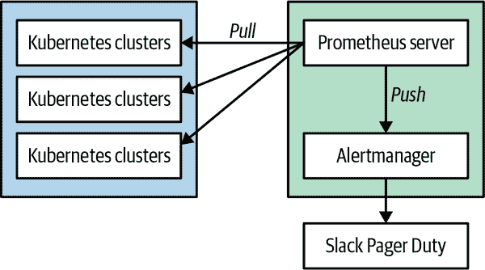
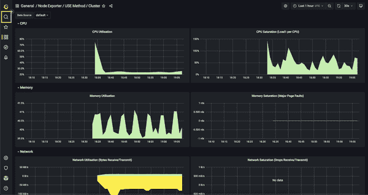
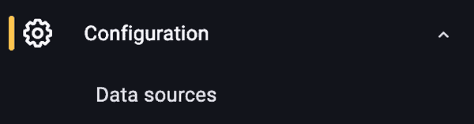
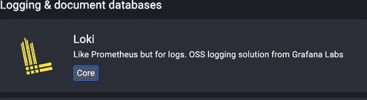
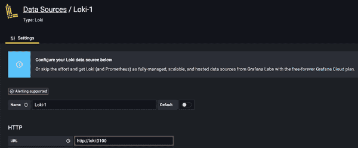
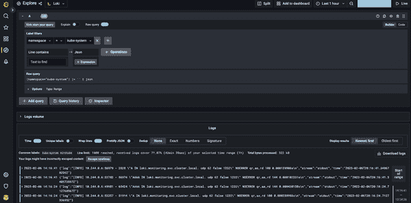

# 第三章：Kubernetes 中的监控和日志记录

在本章中，我们将讨论在 Kubernetes 中监控和日志记录的最佳实践。我们将深入探讨不同监控模式的细节，收集重要的度量指标，并从这些原始度量指标构建仪表板。然后，我们以实现 Kubernetes 集群监控的示例结束。

# 度量与日志

您首先需要理解日志收集和度量收集之间的区别。它们是互补的，但提供不同的用途：

度量

一系列在一段时间内测量的数字。

日志

日志记录了程序运行时发生的所有事件，包括任何错误、警告或显著事件。

在应用性能不佳时，您可能需要同时使用度量和日志记录的示例是，我们第一次发现问题可能是由于托管应用程序的 Pod 上高延迟的警报，但度量可能无法明确问题。然后我们可以查看日志以调查应用程序发出的错误。

# 监控技术

封闭盒监控侧重于从应用程序外部进行监控，传统上用于监控诸如 CPU、内存、存储等组件的系统。封闭盒监控仍然可以用于基础设施级别的监控，但缺乏对应用程序操作方式的洞察和上下文。例如，为了测试集群是否健康，我们可以调度一个 Pod，如果成功，我们知道调度器和服务发现在我们集群内部是健康的，因此可以假设集群组件是健康的。

开放盒监控侧重于在应用程序状态上下文中的详细信息，例如总 HTTP 请求、500 错误的数量、请求的延迟等。通过开放盒监控，我们可以开始理解系统状态的原因。它允许我们提出问题：“为什么磁盘填满了？”而不仅仅是陈述：“磁盘填满了。”

# 监控模式

您可能会审视监控并说：“这有多难？我们一直在监控我们的系统。”监控的概念并不新鲜，我们有许多工具可以帮助我们了解系统的运行情况。但像 Kubernetes 这样的平台更具动态性和短暂性，因此您需要改变对如何监控这些环境的思考方式。例如，当监控虚拟机（VM）时，您期望该 VM 在线 24/7，并且其所有状态得到保留。在 Kubernetes 中，Pod 可能非常动态和短暂，因此您需要有能够处理这种动态和瞬态性质的监控系统。

在监控分布式系统时，有两种监控模式值得关注。由 Brendan Gregg 推广的*USE*方法，关注以下内容：

+   U—利用率

+   S—饱和度

+   E—错误

该方法侧重于基础设施监控，因为在应用级监控中使用它存在限制。USE 方法被描述为“对于每个资源，检查利用率、饱和度和错误率”。该方法可以帮助您快速识别系统的资源约束和错误率。例如，要检查集群中节点的网络健康状况，您将希望监控利用率、饱和度和错误率，以便轻松识别任何网络瓶颈或网络堆栈中的错误。USE 方法是更大工具箱中的一种工具，不是您监控系统时唯一使用的方法。

另一种监控方法称为*RED*方法，由 Tom Wilkie 推广。RED 方法专注于以下内容：

+   R—Rate

+   E—错误

+   D—持续时间

这一理念源于 Google 的*四个黄金信号*：

延迟

提供请求所需的时间

流量

您的系统承受了多少需求

错误

请求失败的速率

饱和度

您的服务被多少程度利用

例如，您可以使用此方法来监控在 Kubernetes 中运行的前端服务，以计算以下内容：

+   我的前端服务正在处理多少个请求？

+   服务用户收到多少个 500 错误？

+   服务是否被请求过度利用？

正如您从上一个例子中看到的，这种方法更关注用户对服务的体验。

USE 和 RED 方法是互补的，因为 USE 方法侧重于基础设施组件，而 RED 方法侧重于监控应用程序的最终用户体验。

# Kubernetes 指标概述

现在我们知道了不同的监控技术和模式，让我们看看您应该在 Kubernetes 集群中监控哪些组件。Kubernetes 集群包括控制平面组件和节点组件。控制平面组件包括 API 服务器、etcd、调度器和控制器管理器。节点包括 kubelet、容器运行时、kube-proxy、kube-dns 和 pods。您需要监控所有这些组件，以确保集群和应用程序的健康。

Kubernetes 通过多种方式公开这些指标，因此让我们看看您可以用来收集集群内指标的不同组件。

## cAdvisor

容器监视器，或者说 cAdvisor，是一个收集运行在节点上容器资源和指标的开源项目。cAdvisor 内置于运行在集群每个节点上的 Kubernetes kubelet 中。它通过 Linux 控制组（cgroup）树收集内存和 CPU 指标。如果您对 cgroups 不熟悉，它是 Linux 内核的一个功能，允许隔离 CPU、磁盘 I/O 或网络 I/O 资源。cAdvisor 还将通过 Linux 内核内置的 statfs 收集磁盘指标。这些是您不必过于担心的实现细节，但您应了解这些指标如何公开以及您可以收集的信息类型。您应将 cAdvisor 视为所有容器指标的真实来源。

## Metrics Server

Kubernetes metrics server 和 Metrics Server API 取代了已弃用的 Heapster。Heapster 在实现数据汇聚方面存在一些架构上的劣势，导致核心 Heapster 代码库中出现了许多供应商解决方案。通过在 Kubernetes 中实现资源和自定义指标 API 作为聚合 API，解决了这个问题，允许在不改变 API 的情况下切换实现。

在 Metrics Server API 和 metrics server 中有两个方面需要理解。

首先，资源指标 API 的典范实现是 metrics server。metrics server 收集诸如 CPU 和内存之类的资源指标。它从 kubelet 的 API 收集这些指标，然后将它们存储在内存中。Kubernetes 在调度器、水平 Pod 自动伸缩器（HPA）和垂直 Pod 自动伸缩器（VPA）中使用这些资源指标。

第二，自定义指标 API 允许监控系统收集任意指标。这使得监控解决方案可以构建自定义适配器，从而允许扩展核心资源指标之外的功能。例如，Prometheus 构建了第一个自定义指标适配器，允许您基于自定义指标使用 HPA。这打开了基于您的使用情况进行更好扩展的可能性，因为现在您可以引入队列大小等指标，并根据可能是 Kubernetes 外部的指标进行扩展。

现在有了标准化的 Metrics API，这开启了许多超越传统 CPU 和内存指标的可能性。

## kube-state-metrics

kube-state-metrics 是一个 Kubernetes 插件，用于监控存储在 Kubernetes 中的对象。在 cAdvisor 和 Metrics Server 用于提供详细的资源使用情况指标时，kube-state-metrics 专注于识别部署到集群的 Kubernetes 对象的条件。

下面是 kube-state-metrics 可以为您解答的一些问题：

+   Pod

    +   集群部署了多少个 Pod？

    +   有多少个 Pod 处于挂起状态？

    +   是否有足够的资源来处理 Pod 的请求？

+   部署

    +   有多少个 Pod 处于运行状态与期望状态？

    +   有多少个副本可用？

    +   哪些部署已更新？

+   节点

    +   我的节点状态如何？

    +   我的集群中可分配的 CPU 核心有哪些？

    +   是否有任何不可调度的节点？

+   任务

    +   一个任务何时开始？

    +   一个任务何时完成？

    +   多少个任务失败了？

截至本文撰写时，kube-state-metrics 跟踪许多对象类型。这些类型始终在扩展，您可以在 [GitHub 仓库](https://oreil.ly/bdTp2) 中找到文档。

# 我应该监控哪些指标？

简单的答案是“一切”，但如果您尝试监视过多，可能会产生噪音，过滤掉您需要洞察的真实信号。当我们考虑 Kubernetes 中的监控时，我们希望采用一种分层方法，考虑以下内容：

+   物理或虚拟节点

+   集群组件

+   集群附加组件

+   最终用户应用程序

使用这种分层监控方法可以更轻松地识别监控系统中的正确信号。它使您能够更有针对性地解决问题。例如，如果您的 Pod 进入挂起状态，您可以从节点资源利用开始，如果一切正常，您可以针对集群级组件。

下面是您系统中希望关注的指标：

+   节点

    +   CPU 利用率

    +   内存利用率

    +   网络利用率

    +   磁盘利用率

+   集群组件

    +   etcd 延迟

+   集群附加组件

    +   集群自动缩放器

    +   Ingress 控制器

+   应用程序

    +   容器内存利用率和饱和度

    +   容器 CPU 利用率

    +   容器网络利用率和错误率

    +   特定应用程序框架的指标

# 监控工具

许多监控工具可以与 Kubernetes 集成，并且每天都有更多工具加入，扩展其功能集以更好地与 Kubernetes 集成。以下是几个流行的与 Kubernetes 集成的工具：

Prometheus

Prometheus 是一个最初在 SoundCloud 构建的开源系统监控和警报工具包。自 2012 年成立以来，许多公司和组织都采用了 Prometheus，并且该项目拥有非常活跃的开发者和用户社区。现在它是一个独立的开源项目，独立于任何公司的维护。为了强调这一点，并澄清项目的治理结构，Prometheus 在 2016 年作为第二个托管项目加入了云原生计算基金会（CNCF），紧随 Kubernetes 之后。

InfluxDB

InfluxDB 是一个设计用于处理高写入和查询负载的时间序列数据库。它是 TICK（Telegraf、InfluxDB、Chronograf 和 Kapacitor）堆栈的重要组成部分。InfluxDB 旨在作为任何涉及大量时间戳数据的用例的后端存储使用，包括 DevOps 监控、应用程序指标、IoT 传感器数据和实时分析。

Datadog

Datadog 提供云规模应用程序的监控服务，通过基于 SaaS 的数据分析平台监控服务器、数据库、工具和服务。

Sysdig

Sysdig 监控是一个商业工具，为容器本地应用程序提供 Docker 监控和 Kubernetes 监控。Sysdig 还允许您收集、关联和查询具有直接 Kubernetes 集成的 Prometheus 指标。

云提供商工具

所有主要的云提供商都为其不同的解决方案提供监控工具。这些工具通常集成到云提供商的生态系统中，并为监控您的 Kubernetes 集群提供一个良好的起点。以下是一些云提供商工具的例子：

GCP Stackdriver

Stackdriver Kubernetes 引擎监视旨在监视 Google Kubernetes 引擎（GKE）集群。它管理监视和日志服务，并且其界面提供了专为 GKE 集群定制的仪表板。Stackdriver 监视提供了对云驱动应用程序性能、可用性和总体健康的可见性。它从 Google 云平台（GCP）、亚马逊网络服务（AWS）、托管的正常运行时间探针和应用程序仪表化中收集指标、事件和元数据。

Microsoft Azure 容器监视器

Azure 容器监视器是一个旨在监视部署到 Azure 容器实例或托管在 Azure Kubernetes 服务上的托管 Kubernetes 集群的性能的功能。在运行生产集群时，特别是在规模化和多应用程序情况下，监视您的容器至关重要。Azure 容器监视器通过从控制器、节点和 Kubernetes 中通过 Metrics API 可用的容器收集内存和处理器指标来提供性能可见性。还收集容器日志。在从 Kubernetes 集群启用监视后，指标和日志将通过 Linux 版本的 Log Analytics 代理自动收集。

AWS 容器洞察

如果您使用亚马逊弹性容器服务（ECS）、亚马逊弹性 Kubernetes 服务或其他基于亚马逊 EC2 的 Kubernetes 平台，您可以使用 CloudWatch 容器洞察收集、聚合和总结容器化应用程序和微服务的指标和日志。这些指标包括 CPU、内存、磁盘和网络等资源的利用率。容器洞察还提供诊断信息，例如容器重启失败，帮助您隔离问题并快速解决。

在考虑实施监控指标工具时，一个重要的方面是查看指标存储方式。提供带有键/值对的时间序列数据库的工具将为您的指标提供更高程度的属性。

###### 提示

始终评估您已经拥有的监控工具，因为采用新的监控工具会有学习曲线和操作实施成本。许多监控工具现在已经集成到 Kubernetes 中，因此评估您今天拥有的工具及其是否能满足您的要求是非常重要的。

# 使用 Prometheus 监视 Kubernetes

在本节中，我们关注使用 Prometheus 监控指标，它与 Kubernetes 标签、服务发现和元数据有很好的集成。本章节实施的高级概念也适用于其他监控系统。

Prometheus 是由 CNCF 托管的开源项目。它最初在 SoundCloud 开发，其许多概念基于 Google 的内部监控系统 Borgmon。它实现了一个多维数据模型，使用键值对的方式工作，类似于 Kubernetes 的标签系统。Prometheus 以人类可读的格式暴露指标，如下面的例子所示：

```
# HELP node_cpu_seconds_total Seconds the CPU is spent in each mode.
# TYPE node_cpu_seconds_total counter
node_cpu_seconds_total{cpu="0",mode="idle"} 5144.64
node_cpu_seconds_total{cpu="0",mode="iowait"} 117.98
```

Prometheus 使用拉模型来收集指标，在这种模型中，它会获取一个指标端点以收集和摄取指标到 Prometheus 服务器中。像 Kubernetes 这样的系统已经以 Prometheus 格式暴露了它们的指标，使得收集指标变得简单。许多其他的 Kubernetes 生态系统项目（如 NGINX、Traefik、Istio、Linkerd 等）也以 Prometheus 格式暴露它们的指标。Prometheus 还可以使用导出器，允许您获取服务发出的指标并将其转换为 Prometheus 格式的指标。

Prometheus 具有非常简化的架构，如图 3-1 所示。



###### 图 3-1\. Prometheus 架构

###### 提示

您可以在集群内部或集群外部安装 Prometheus。从“实用集群”监控您的集群是一个好的实践，以避免生产问题也影响您的监控系统。像[Thanos](https://oreil.ly/7e6Wf)这样的工具为 Prometheus 提供了高可用性，并允许将指标导出到外部存储系统。

对 Prometheus 架构的深入讨论超出了本书的范围，您应参考专门的图书。[*Prometheus: Up & Running*](https://oreil.ly/NewNE)（O'Reilly）是一个很好的深入学习的起点。

因此，让我们深入了解并在我们的 Kubernetes 集群上设置 Prometheus。有许多不同的部署方式可以部署 Prometheus，部署方式将取决于您的具体实现。我们将使用 Helm 安装 Prometheus Operator：

Prometheus 服务器

拉取和存储从系统收集的指标。

Prometheus Operator

使 Prometheus 配置与 Kubernetes 原生化，并管理和操作 Prometheus 和 Alertmanager 集群。允许您通过本机 Kubernetes 资源定义创建、销毁和配置 Prometheus 资源。

Node Exporter

从 Kubernetes 集群中的节点导出主机指标。

kube-state-metrics

收集特定于 Kubernetes 的指标。

Alertmanager

允许您配置并将警报转发到外部系统。

Grafana

为 Prometheus 提供仪表板能力的可视化。

首先，我们将开始设置 minikube 以部署 Prometheus。我们使用 Mac，所以我们将使用`brew`来安装 minikube。你也可以从[minikube 网站](https://oreil.ly/BgFFL)安装 minikube。

```
brew install minikube
```

现在我们将安装 kube-prometheus-stack（前身为 Prometheus Operator），并准备好我们的集群以开始监控 Kubernetes API 服务器的变化。

创建一个用于监控的命名空间：

```
kubectl create ns monitoring
```

添加 prometheus-community Helm chart 仓库：

```
helm repo add prometheus-community
    https://prometheus-community.github.io/helm-charts
```

添加 Helm Stable chart 仓库：

```
helm repo add stable https://charts.helm.sh/stable
```

更新 chart 仓库：

```
helm repo update
```

安装 kube-prometheus-stack chart：

```
helm install --namespace monitoring prometheus
    prometheus-community/kube-prometheus-stack
```

让我们检查确保所有的 Pod 都在运行：

```
kubectl get pods -n monitoring
```

如果安装正确，您应该看到以下 Pod：

```
kubectl get pods -n monitoring
```

```
NAME                                               READY  STATUS   RESTARTS  AGE
alertmanager-prometheus-kube-prometheus-alertm...  2/2    Running  1         79s
prometheus-grafana-6f7cf9b968-xtnzj                3/3    Running  0         97s
prometheus-kube-prometheus-operator-7bdb94567b...  1/1    Running  0         97s
prometheus-kube-state-metrics-6bdd65d76-s5r5j      1/1    Running  0         97s
prometheus-prometheus-kube-prometheus-promethe...  2/2    Running  0         78s
prometheus-prometheus-node-exporter-dgrlf          1/1    Running  0         98s
```

现在我们将创建一个到包含在 kube-prometheus-stack 中的 Grafana 实例的隧道。这将允许我们从本地机器连接到 Grafana：

这将在我们的本地主机上创建到端口 3000 的隧道。现在我们可以打开 Web 浏览器，并连接到[*http://127.0.0.1:3000*](http://127.0.0.1:3000)上的 Grafana。

在本章前面我们已经讨论了使用 USE 方法，所以让我们收集一些有关 CPU 利用率和饱和度的节点指标。Kube-prometheus-stack 提供了这些我们想要追踪的常见 USE 方法指标的可视化。你安装的 kube-prometheus-stack 的一个很棒的功能是它带有预构建的 Grafana 仪表板，你可以使用它们。

现在我们将创建一个到包含在 kube-prometheus-stack 中的 Grafana 实例的隧道。这将允许我们从本地机器连接到 Grafana：

```
kubectl port-forward -n monitoring svc/prometheus-grafana 3000:80
```

将您的 Web 浏览器指向[*http://localhost:3000*](http://localhost:3000)，并使用以下凭据登录：

+   用户名：admin

+   密码：prom-operator

在 Grafana 仪表板下，你会找到一个名为 Kubernetes / USE Method / Cluster 的仪表板。这个仪表板为你提供了对 Kubernetes 集群利用率和饱和度的良好概述，这是 USE 方法的核心。Figure 3-2 展示了仪表板的一个示例。



###### 图 3-2. 一个 Grafana 仪表板

接下来花点时间探索不同的仪表板和可以在 Grafana 中可视化的指标。

###### 提示

避免创建太多的仪表板（即“图形墙”），因为这可能会让工程师在故障排除情况下难以理解。你可能认为在仪表板中有更多信息意味着更好的监控，但大多数情况下，这会让用户在看仪表板时更加困惑。将你的仪表板设计重点放在结果和解决时间上。

# 日志概述

到目前为止，我们已经讨论了很多关于指标和 Kubernetes 的内容，但为了全面了解您的环境，您还需要从部署到集群的 Kubernetes 和应用程序中收集和集中日志。在日志记录方面，可能很容易说，“让我们记录所有事情”，但这会导致两个问题：

+   噪音太大，无法快速找到问题。

+   日志可能消耗大量资源，并且成本高昂。

对于应该记录的具体内容并没有明确的答案，因为调试日志变成了一种必要的恶。随着时间的推移，您将开始更好地了解您的环境，并学会从日志系统中消除噪音。此外，为了解决不断增加的日志存储量，您需要实施保留和归档策略。从最终用户的体验来看，保留 30 到 45 天的历史日志是一个不错的选择。这样可以用于调查长时间内出现的问题，同时减少存储日志所需的资源量。如果出于合规原因需要长期存储，您将需要将日志存档到成本更低的资源上。

在 Kubernetes 集群中，有多个组件需要记录日志。以下是应收集指标的组件列表：

+   节点日志

+   Kubernetes 控制平面日志

    +   API 服务器

    +   控制管理器

    +   调度器

+   Kubernetes 审计日志

+   应用程序容器日志

对于节点日志，您希望收集发生在关键节点服务上的事件。例如，您将希望收集运行在节点上的 Docker 守护程序的日志。健康的 Docker 守护程序对于在节点上运行容器至关重要。收集这些日志将帮助您诊断可能遇到的任何 Docker 守护程序问题，并为您提供有关守护程序底层问题的信息。此外，还有其他关键服务的日志，您也会希望从底层节点记录。

Kubernetes 控制平面由多个组件组成，您需要收集这些日志以深入了解其中的潜在问题。Kubernetes 控制平面对于集群的健康至关重要，您将希望聚合它存储在主机上的日志，包括 */var/log/kube-APIserver.log*、*/var/log/kube-scheduler.log* 和 */var/log/kube-controller-manager.log*。控制管理器负责创建用户定义的对象。例如，作为用户，您使用类型为 LoadBalancer 的 Kubernetes 服务，它仅处于待定状态；Kubernetes 事件可能不会提供足够的细节来诊断问题。如果您将日志收集到集中系统中，将更详细地了解底层问题，并更快地进行调查。

您可以将 Kubernetes 审计日志视为安全监控，因为它们可以帮助您了解系统内谁做了什么。这些日志可能会非常嘈杂，因此您需要为您的环境进行调整。在初始化时，这些日志可能会在日志系统中造成巨大的峰值，因此请确保遵循 Kubernetes 文档中关于审计日志监控的指导。

应用程序容器日志能让你深入了解应用程序实际发出的日志。你可以通过多种方式将这些日志转发到中央存储库。第一种推荐的方式是将所有应用程序日志发送到 STDOUT，因为这样可以统一应用程序日志记录的方式，监控的守护程序集可以直接从 Docker 守护程序中获取这些日志。另一种方式是使用 sidecar 模式，在 Kubernetes Pod 中应用程序容器旁边运行一个日志转发容器。如果你的应用程序将日志记录到文件系统，可能需要使用这种模式。

###### 注意

对于管理 Kubernetes 审计日志，有许多选项和配置。这些审计日志可能非常嘈杂，并且记录所有操作可能很昂贵。你应该考虑查看 [审计日志文档](https://oreil.ly/L84dM)，以便为你的环境调整这些日志。

# 日志工具

与收集度量指标一样，有许多工具用于从运行在集群中的 Kubernetes 和应用程序中收集日志。你可能已经为此拥有工具，但要注意工具如何实现日志记录。该工具应具有作为 Kubernetes DaemonSet 运行的能力，并且对于不将日志发送到 STDOUT 的应用程序，应该有一个作为 sidecar 运行的解决方案。使用现有工具的一个优势是你已经对该工具的操作有了一定的了解。

一些与 Kubernetes 集成比较流行的工具包括：

+   Loki

+   Elastic Stack

+   Datadog

+   Sumo Logic

+   Sysdig

+   云服务提供商的服务（如 GCP Stackdriver、Azure Monitor for containers 和 Amazon CloudWatch）

在寻找集中日志工具时，托管解决方案可以提供很多价值，因为它们可以减少很多运营成本。在第 *N* 天使用自己托管的日志解决方案看起来很不错，但随着环境的增长，维护这个解决方案可能会非常耗时。

# 使用 Loki-Stack 进行日志记录

为了本书的目的，我们在集群中使用 Loki-Stack 和 prom-tail 进行日志记录。实施 Loki-Stack 可以是一个很好的起步方式，但是在某个时候，你可能会问自己，“管理自己的日志平台真的值得吗？”通常情况下，这并不值得，因为自托管的日志解决方案一开始很棒，但随着时间推移变得过于复杂。随着环境的扩展，自托管的日志解决方案变得操作上更加复杂。并没有一个正确答案，所以要评估你的业务需求是否需要你托管自己的解决方案。此外，还有一个由 Grafana 提供的托管 Loki 解决方案，所以如果你选择不自己托管，你总是可以轻松地转移。

我们将使用以下内容进行日志堆栈：

+   Loki

+   prom-tail

+   Grafana

使用以下步骤将 Loki-Stack 通过 Helm 部署到你的 Kubernetes 集群。

添加 Loki-Stack Helm 仓库：

```
helm repo add grafana https://grafana.github.io/helm-charts
```

更新 Helm 仓库：

```
helm repo update
```

```
helm upgrade --install loki --namespace=monitoring grafana/loki-stack
```

这将部署 Loki 与 prom-tail，使我们能够将日志转发到 Loki 并使用 Grafana 可视化日志。

您应该看到以下 Pod 部署到您的集群中：

```
kubectl get pods -n monitoring
```

```
NAME                 READY  STATUS   RESTARTS  AGE
loki-0               1/1    Running  0         93s
loki-promtail-x7nw8  1/1    Running  0         93s
```

当所有 Pod 都处于“Running”状态后，请通过端口转发连接到我们的本地 Grafana：

```
kubectl port-forward -n monitoring svc/prometheus-grafana 3000:80
```

现在，请将您的 Web 浏览器指向 [*http://localhost:3000*](http://localhost:3000)，并使用以下凭据登录：

+   用户名：admin

+   密码：prom-operator

在 Grafana 配置下，您会找到数据源，如 图 3-3 所示。然后，我们将 Loki 添加为一个 `数据源`。



###### 图 3-3\. Grafana 数据源

然后，我们将添加一个新的数据源，并将 Loki 添加为数据源（见图 3-4）。



###### 图 3-4\. Loki 数据源

在 Loki 设置页面（见图 3-5），用 http://loki:3100 填写 URL，然后点击保存并测试按钮。



###### 图 3-5\. Loki 配置

在 Grafana 中，您可以对日志执行即席查询，并可以构建仪表板，以便为您提供环境概述。

要探索 Loki-Stack 收集的日志，我们可以在 Grafana 中使用 *Explore* 功能，如 图 3-6 所示。这将允许我们对已收集的日志运行查询。



###### 图 3-6\. 探索 Loki 日志

对于标签过滤器，您将需要以下过滤器：

```
namespace = kube-system
```

前往 Loki 和 Grafana 中可视化的不同日志，花些时间进行探索。

# 警报

警报是一把双刃剑，您需要在应该报警的事件与仅需监控的事件之间保持平衡。过多的报警会导致警报疲劳，重要事件将会在所有噪音中丢失。一个例子是每当 Pod 失败时生成一个警报。您可能会问：“为什么我不想监视 Pod 失败？”好吧，Kubernetes 的美妙之处在于它提供了功能来自动检查容器的健康状态并自动重启容器。您真正想要关注的是影响您的服务级别目标（SLO）的事件。SLO 是一些具体可测的特性，例如可用性、吞吐量、频率和响应时间，这些特性是您与服务最终用户协商达成的。设定 SLO 可以为最终用户明确系统行为的期望。没有 SLO，用户可能会形成他们对服务的不切实际期望。在像 Kubernetes 这样的系统中，警报需要一种全新的方法，需要专注于最终用户如何体验服务。例如，如果您前端服务的 SLO 是 20 毫秒的响应时间，而您看到的延迟高于平均水平，您应该对此问题进行警报。

你需要决定哪些警报是有效的，并需要干预。在典型的监控中，你可能习惯于对高 CPU 使用率、内存使用率或无响应的进程发出警报。这些看起来可能是好的警报，但它们可能并不表示需要立即采取行动并通知值班工程师的问题。需要通知值班工程师的警报应该是需要立即人工关注，并且影响应用程序用户体验的问题。如果你曾经经历过“问题自行解决”的情况，那么这很可能是警报无需联系值班工程师的一个很好的指示。

处理不需要立即行动的警报的一种方法是专注于自动化处理原因的修复。例如，当磁盘空间不足时，你可以自动删除日志以释放磁盘空间。此外，在应用部署中利用 Kubernetes 的*liveness probes*可以帮助自动处理应用程序中无响应的进程问题。

在建立警报时，你还需要考虑*警报阈值*；如果设置的阈值太短，那么警报可能会产生很多误报。通常建议至少设置一个五分钟的阈值，以帮助消除误报。制定标准阈值可以帮助定义一个标准，并避免管理许多不同的阈值。例如，你可能想要遵循一个特定的模式，如 5 分钟、10 分钟、30 分钟、1 小时等。

在建立用于警报的通知时，你需要确保通知中提供相关信息。例如，你可以提供一个指南链接，该指南提供解决问题的故障排除或其他有用信息。你还应该在通知中包含有关数据中心、区域、应用程序所有者和受影响系统的信息。提供所有这些信息将使工程师能够快速形成关于问题的理论。

你还需要建立通知渠道来路由触发的警报。在思考“触发警报时应该通知谁？”时，你应确保通知不仅仅发送到分发列表或团队邮箱。如果警报发送到较大的群组，通常会因为用户认为这些是噪音而被过滤掉。你应将通知路由到将负责问题的用户。

在警报中，你永远无法在第一天就做到完美，甚至可以说可能永远不会完美。你只需要确保逐步改进警报以预防警报疲劳，这可能会导致员工疲劳和系统问题的多种问题。

###### 注意

若要进一步了解如何处理警报和管理系统，请阅读基于 Rob Ewaschuk 作为 Google 站点可靠性工程师（SRE）的观察所著的[《关于警报的我的哲学》](https://oreil.ly/YPxju)。

# 监控、日志记录和警报的最佳实践

以下是关于监控、日志记录和警报您应该采纳的最佳实践。

## 监控

+   监控节点和所有 Kubernetes 组件的利用率、饱和度和错误率，监控应用程序的速率、错误和持续时间。

+   使用封闭箱监控来监控系统的症状，而不是系统的预测健康状态。

+   使用开箱即用的监控工具来检查系统及其内部情况，并进行仪表化。

+   实施基于时间序列的指标以获得高精度的度量，同时还能洞察您应用程序行为。

+   利用像 Prometheus 这样提供高维度关键标签的监控系统；这将更好地显示受影响问题的信号。

+   使用平均指标来可视化小计和基于事实数据的指标。利用总计指标来可视化特定指标的分布。

## 日志记录

+   您应该结合使用日志记录和指标监控来全面了解环境运行情况。

+   要谨慎存储超过 30 至 45 天的日志；如果需要，使用更便宜的资源进行长期存档。

+   限制在 Sidecar 模式中使用日志转发器的使用，因为它们会消耗更多资源。建议使用 DaemonSet 来进行日志转发，并将日志发送到 STDOUT。

## 警报

+   要小心警报疲劳，因为它可能导致人员和流程产生不良行为。

+   始终努力改进警报功能，并接受它不会始终完美。

+   警报用于影响您的 SLO 和客户的症状，而不是不需要立即人工干预的短暂问题。

# 总结

在本章中，我们讨论了用于通过度量和日志收集监控系统的模式、技术和工具。从本章中最重要的部分可以得出的结论是，您需要重新考虑如何进行监控，并从一开始就这样做。我们经常看到这种实施是事后进行的，这可能会导致对系统理解上的非常不利影响。监控的目的在于更好地了解系统，并能够提供更好的弹性，从而为应用程序提供更好的最终用户体验。监控分布式应用程序和像 Kubernetes 这样的分布式系统需要大量工作，因此您必须在旅程的开始时做好准备。
