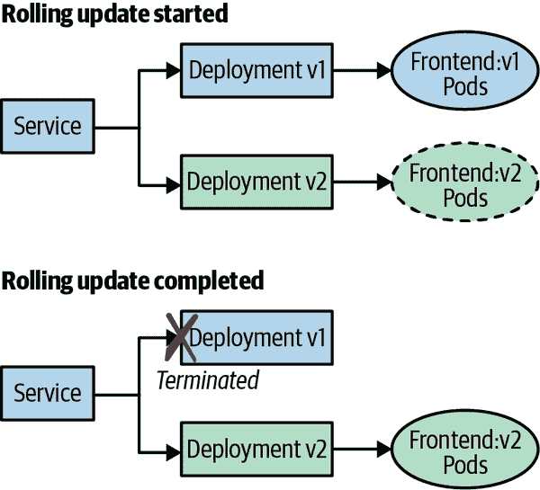
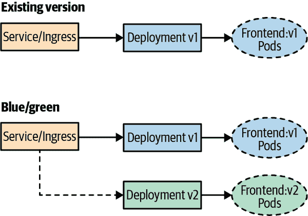
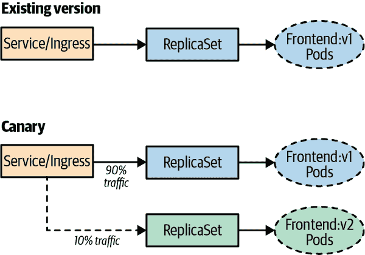
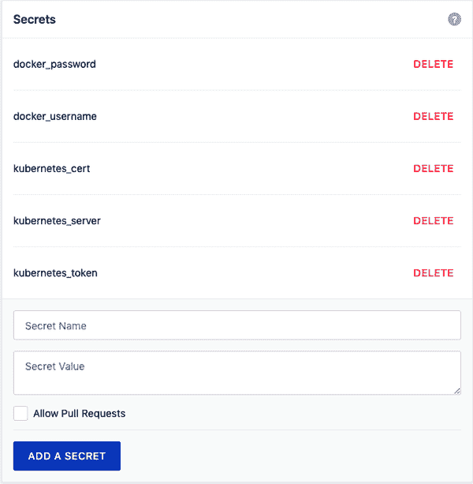

# 第五章：持续集成、测试和部署

本章中，我们将看看如何将持续集成/持续部署（CI/CD）流水线集成到 Kubernetes 中以交付应用程序的关键概念。构建一个良好集成的流水线将使您能够自信地将应用程序交付到生产环境，因此在这里我们将探讨在您的环境中实现 CI/CD 所需的方法、工具和流程。CI/CD 的目标是实现全自动化的流程，从开发者提交代码到将新代码推送到生产环境中去。您希望避免在部署到 Kubernetes 的应用程序中手动进行更新，因为这样很容易出错。在 Kubernetes 中手动管理应用程序更新会导致配置漂移和脆弱的部署更新，整体而言会失去交付应用程序的灵活性。

本章我们将涵盖以下主题：

+   版本控制

+   持续集成

+   测试

+   容器构建

+   容器镜像标记

+   持续部署

+   部署策略

+   在生产环境中进行测试

+   混乱测试

我们还通过一个示例的 CI/CD 流水线，其中包括以下任务：

+   将代码更改推送到 Git 仓库

+   运行应用程序代码的构建

+   对代码运行测试

+   在成功测试后构建容器镜像

+   将容器镜像推送到容器注册表

+   将应用程序部署到 Kubernetes

+   对已部署应用程序运行测试

+   对部署进行滚动升级

# 版本控制

每个 CI/CD 流水线都从版本控制开始，这维护应用程序和配置代码更改的运行历史记录。Git 已成为行业标准的源代码管理平台，每个 Git 仓库都将包含一个*主分支*。主分支包含您的生产代码。您将有其他用于功能和开发工作的分支，最终将合并到主分支。有许多设置分支策略的方法，设置将非常依赖于组织结构和职责分离。我们发现，包含应用程序代码和配置代码（如 Kubernetes 清单或 Helm 图表）有助于促进良好的 DevOps 沟通和协作原则。在单一仓库中让应用程序开发人员和运维工程师共同合作建立了团队交付应用程序到生产环境的信心。

# 持续集成

CI 是将代码更改持续集成到版本控制存储库的过程。与较少频繁地提交大型更改不同，您会更频繁地提交较小的更改。每次向存储库提交代码更改时，都会启动一次构建。这使您能够更快地反馈可能导致应用程序出现问题的原因。许多解决方案提供 CI，其中 Jenkins 是更受欢迎的工具之一。此时，您可能会问：“为什么我需要了解应用程序的构建过程；难道这不是应用程序开发人员的角色吗？” 传统上可能是这样，但随着公司向 DevOps 文化的转变，运维团队更接近应用程序代码和软件开发工作流。

# 测试

在流水线中运行测试的目标是快速提供针对破坏构建的代码更改的反馈循环。您使用的编程语言将决定您使用的测试框架。例如，Go 应用程序可以使用`go test`来运行一套针对您的代码库的单元测试。拥有广泛的测试套件有助于避免将糟糕的代码交付到生产环境。您将希望确保如果流水线中的测试失败，则在测试套件运行后构建失败。如果您的代码库存在失败的测试，则不应构建容器镜像并将其推送到注册表中。

也许你会问：“创建测试不是开发人员的工作吗？” 当你开始自动化基础设施和应用程序的交付到生产环境时，你需要考虑对代码库中所有部分运行自动化测试。例如，在第二章中，我们讨论了使用 Helm 为 Kubernetes 打包应用程序。Helm 包括一个名为`helm lint`的工具，它针对图表运行一系列测试，以检查提供的图表是否存在潜在问题。在端到端的流水线中需要运行许多不同的测试。有些是开发人员的责任，比如应用程序的单元测试，但其他测试如烟雾测试则是团队共同努力的结果。测试代码库及其交付到生产环境是团队的工作，需要端到端实施。

# 容器构建

在构建图像时，应优化图像的大小。图像越小，拉取和部署图像的时间就越短，同时也增加了图像的安全性。优化图像大小有多种方法，但某些方法确实存在权衡。以下策略将帮助您构建应用程序可能的最小图像：

多阶段构建

这些允许您移除不需要的依赖项，以使您的应用程序运行。例如，对于 Golang，我们不需要用于构建静态二进制文件的所有构建工具，因此多阶段构建允许您在单个 Dockerfile 中运行构建步骤，并且最终镜像仅包含运行应用程序所需的静态二进制文件。

Distroless 基础镜像

这些从镜像中移除所有不必要的二进制文件和 shell。这样做可以减小镜像的大小并增加安全性。Distroless 镜像的权衡在于没有 shell，因此无法附加调试器到镜像上。您可能认为这很好，但调试应用程序可能会很麻烦。Distroless 镜像不包含包管理器、shell 或其他典型的操作系统包，因此可能无法访问您在典型操作系统中习惯使用的调试工具。

优化基础镜像

这些镜像专注于清理操作系统层中的垃圾，并提供精简的镜像。例如，Alpine 提供一个从仅 10 MB 开始的基础镜像，并允许您在本地开发时附加本地调试器。其他发行版通常也提供优化的基础镜像，例如 Debian 的 Slim 镜像。这可能对您是一个不错的选择，因为其优化的镜像既提供了您在开发中期望的功能，同时又优化了镜像大小并降低了安全风险。

优化您的镜像非常重要，但用户常常忽视。您可能因公司对企业中可用操作系统的标准存在障碍，但应对此进行抗拒，以便最大化容器的价值。

我们发现刚开始使用 Kubernetes 的公司通常通过使用当前的操作系统获得成功，然后选择更优化的镜像，如 Debian Slim。在操作化和针对容器环境进行开发成熟之后，您将会对 Distroless 镜像感到满意。

# 容器镜像标记

CI 流水线中的另一步是构建容器镜像，以便您拥有一个部署到环境中的镜像工件。拥有一个镜像标记策略非常重要，这样您可以轻松识别已部署到环境中的版本化镜像。我们强调一件最重要的事情：不要使用“latest”作为镜像标记。将其用作镜像标记不是一个*版本*，将导致无法识别哪个代码更改属于已部署的镜像。在 CI 流水线中构建的每个镜像都应具有唯一的标记。

我们发现在 CI 流水线中标记镜像时有多种有效策略。以下策略可帮助您轻松识别代码更改及其关联的构建：

构建 ID

当 CI 构建启动时，它会关联一个构建 ID。使用标签的这一部分可让您引用哪个构建组装了该镜像。

构建系统-构建 ID

此标签与 BuildID 相同，但为那些使用多个构建系统的用户添加了构建系统。

Git 哈希

在新代码提交时，将生成一个 Git 哈希，并使用该哈希作为标签，以便轻松地引用生成图像的提交。

githash-buildID

这使您能够引用生成图像的代码提交和 BuildID。唯一需要注意的是，标签可能会有点长。

# 持续部署

CD 是指通过已成功通过 CI 流水线的变更无需人工干预即可部署到生产环境的过程。容器为将变更部署到生产环境提供了巨大的优势。容器映像变成了一个不可变的对象，可以通过开发、暂存和生产环境推广使用。例如，我们一直面临的一个主要问题是如何保持一致的环境。几乎每个人都曾经经历过在暂存环境中运行正常的部署，在推广到生产环境时却出现了问题。这是由于存在*配置漂移*，每个环境中的库和组件版本不同。Kubernetes 为我们提供了一种声明性的方式来描述我们的部署对象，从而可以进行版本控制并进行一致的部署。

需要记住的一件事是，在专注于 CD 之前，您需要建立一个可靠的 CI 流水线。如果在流水线的早期没有强大的测试套件来及早发现问题，您最终将向所有环境部署糟糕的代码。

# 部署策略

现在我们已经了解了 CD 的原理，让我们看看可以使用的不同部署策略。Kubernetes 提供多种策略来部署应用程序的新版本。虽然它具有内置机制来提供滚动更新，但您还可以利用更高级的策略。在这里，我们将研究以下策略来提供应用程序的更新：

+   滚动更新

+   蓝/绿部署

+   金丝雀部署

*滚动更新*内建于 Kubernetes 中，允许您触发当前运行的应用程序的更新，而无需停机。例如，如果您有一个当前正在运行 frontend:v1 的前端应用，并将部署更新为 frontend:v2，Kubernetes 将以滚动方式更新副本到 frontend:v2。图 5-1 展示了一个滚动更新。



###### 图 5-1\. 一个 Kubernetes 滚动更新

一个 Deployment 对象还允许您配置要更新的最大副本数以及在部署过程中不可用的最大 Pod 数。以下清单是指定滚动更新策略的示例：

```
kind: Deployment
apiVersion: apps/v1
metadata:
  name: frontend
  labels:
    app: frontend
spec:
  replicas: 3
  selector:
    matchLabels:
      app: frontend
  template:
    metadata:
      labels:
        app: frontend
    spec:
      containers:
      - name: frontend
        image: brendanburns/frontend:v1
  strategy:
    type: RollingUpdate
    rollingUpdate:
      maxSurge: 1 # Maximum amount of replicas to update at one time
      maxUnavailable: 1 # Maximum amount of replicas unavailable during rollout
```

使用此策略时需要注意滚动更新，因为可能会导致连接丢失。为了解决此问题，可以使用 *就绪探针* 和 *preStop* 生命周期钩子。就绪探针确保部署的新版本已准备好接受流量，而 preStop 钩子可以确保当前部署的应用程序上的连接已经被排空。生命周期钩子在容器退出之前被调用，是同步的，因此必须在最终终止信号给出之前完成。以下示例实现了就绪探针和生命周期钩子：

```
kind: Deployment
apiVersion: apps/v1
metadata:
  name: frontend
  labels:
    app: frontend
spec:
  replicas: 3
  selector:
    matchLabels:
      app: frontend
  template:
    metadata:
      labels:
        app: frontend
    spec:
      containers:
      - name: frontend
        image: brendanburns/frontend:v1
        livenessProbe:
          # ...
        readinessProbe:
          httpGet:
            path: /readiness # probe endpoint
            port: 8888
        lifecycle:
          preStop:
            exec:
              command: ["/usr/sbin/nginx","-s","quit"]
  strategy:
    # ...
```

在此示例中，preStop 生命周期钩子将优雅地退出 NGINX，而 SIGTERM 则进行不优雅且快速的退出。

滚动更新的另一个问题是在转换期间同时运行两个应用程序版本。您的数据库架构需要支持应用程序的两个版本。您还可以使用特性标志策略，其中您的架构指示新应用程序版本创建的新列。完成滚动更新后，可以移除旧列。

我们还在我们的部署清单中定义了就绪性探针和活性探针。就绪性探针将确保您的应用程序在成为服务端点之前已准备好提供流量。活性探针确保您的应用程序健康运行，并在其失败活性探针时重新启动 Pod。只有在 Pod 因错误退出时，Kubernetes 才会自动重新启动失败的 Pod。例如，活性探针可以检查其端点，如果我们从中无法退出的死锁，则重新启动它。

*蓝/绿部署* 允许您可预测地发布应用程序。通过蓝/绿部署，您可以控制何时将流量转移到新环境，因此可以很好地控制应用程序新版本的发布。使用蓝/绿部署，您需要具备同时部署现有和新环境的能力。这些类型的部署具有许多优势，例如轻松切换回先前的应用程序版本。然而，使用此部署策略时需要考虑一些事项：

+   使用此部署选项可能使数据库迁移变得困难，因为您需要考虑飞行中的事务和架构更新兼容性。

+   存在意外删除两个环境的风险。

+   您需要为两个环境提供额外的容量。

+   混合部署存在协调问题，其中旧版应用程序无法处理部署。

图 5-2 描述了一个蓝/绿部署。



###### 图 5-2\. 蓝/绿部署

*金丝雀部署*与蓝绿部署非常相似，但它可以更好地控制将流量转移到新版本。大多数现代化的入口实现都允许您将一定比例的流量释放到新版本，但您也可以实现服务网格技术，比如 Istio、Linkerd 或 HashiCorp Consul，这些技术提供了多种功能，有助于实施这种部署策略。

金丝雀部署允许您仅针对用户的一部分测试新功能。例如，您可能要推出应用程序的新版本，并且只想针对您用户群的 10%进行部署测试。这样可以大大减少坏部署或功能中断对用户的影响。如果部署或新功能没有错误，您可以开始将更大比例的流量转移到新版本的应用程序上。还有更高级的技术可以与金丝雀部署结合使用，比如只向特定用户区域发布或只针对具有特定配置文件的用户发布。这些类型的发布通常称为 A/B 或暗发布，因为用户并不知道他们正在测试新功能的部署。

使用金丝雀部署时，您会遇到与蓝绿部署相同的一些考虑因素，但也有一些额外的考虑因素。您必须具备以下能力：

+   将流量转移到一部分用户的能力

+   对稳态有坚实的理解，以便与新版本进行比较

+   用于理解新版本是否处于“良好”或“不良”状态的指标

图 5-3 提供了金丝雀部署的示例。



###### 图 5-3\. 金丝雀部署

###### 注意

金丝雀发布也面临着同时运行多个应用程序版本的问题。您的数据库架构需要同时支持这两个版本的应用程序。在使用这些策略时，您需要关注如何处理依赖服务以及同时运行多个版本的问题。这包括具有强大的 API 契约，并确保您的数据服务支持同时部署的多个版本。

# 在生产环境中进行测试

在生产环境中进行测试有助于建立对应用程序弹性、可扩展性和用户体验的信心。这带来了一个警告：*在生产环境中测试*并不是没有挑战和风险，但为了确保系统的可靠性，这是值得付出的努力。在实施时，您需要首先处理一些重要方面。您需要确保有一套深入的可观察策略，以便能够识别在生产环境中测试的影响。如果无法观察影响应用程序最终用户体验的指标，您将无法清楚地了解在努力提高系统弹性时应专注于什么。此外，您还需要实施高度自动化，以能够自动从注入到系统中的故障中恢复。

当您在生产环境中运行实验时，需要实施许多工具来减少风险并有效地测试您的系统。我们在本章中讨论了一些工具，但还有一些新工具，如分布式跟踪、仪器化、混沌工程和流量阴影。总结一下，这些是我们已经提到的工具：

+   金丝雀部署

+   蓝/绿部署

+   流量转移

+   功能标志

混沌工程是由 Netflix 开发的。它是将实验部署到实时生产系统中，以发现这些系统中的弱点的实践。混沌工程允许您通过观察在控制实验期间的系统行为来了解其行为。以下是在进行“游戏日”实验之前要实施的步骤：

1.  建立假设并了解您的稳态。

1.  具有可能影响系统的各种真实事件的不同程度。

1.  建立一个对照组和实验组，以与稳态进行比较。

1.  进行实验以测试假设。

在运行实验时，极为重要的是要最小化“影响范围”，以确保可能出现的问题最小化。此外，当您建立实验时，还需确保专注于自动化，因为运行实验可能会很费力。

到这一点，你可能会问，“为什么我不只是在测试阶段测试呢？”我们发现在测试阶段会有一些固有问题，比如以下问题：

+   资源的非相同部署。

+   来自生产环境的配置漂移。

+   流量和用户行为倾向于是合成生成的。

+   生成的请求数量不模仿真实工作负载。

+   在测试阶段没有实施监控。

+   部署的数据服务包含与生产环境不同的数据和负载。

我们无法过分强调这一点：确保您对生产环境的监控有足够的信心，因为这种做法往往会使没有足够可观察性的用户失败。此外，从较小的实验开始首先了解您的实验及其影响将有助于建立信心。

# 设置管道并执行混沌实验

进程的第一步是分叉一个 GitHub 存储库，以便您可以拥有自己的存储库在整章中使用。您将需要使用 GitHub 界面分叉[示例应用程序存储库](https://oreil.ly/TtJfd)。

## 设置 CI

现在您已经了解了 CI，您将设置代码的构建，我们之前克隆的。

例如，我们使用托管的*drone.io*。您需要[注册一个免费帐户](https://cloud.drone.io)。使用 GitHub 凭据登录（这将注册您的存储库在 Drone 中并允许您同步存储库）。登录到 Drone 后，在您的分支存储库上选择激活。您需要做的第一件事是将一些机密添加到设置中，以便您可以将应用程序推送到您的 Docker Hub 注册表，并将其部署到您的 Kubernetes 集群。

在 Drone 中的存储库下，单击“设置”，然后添加以下机密（见图 5-4）：

+   `docker_username`

+   `docker_password`

+   `kubernetes_server`

+   `kubernetes_cert`

+   `kubernetes_token`



###### 图 5-4\. Drone 机密配置

Docker 用户名和密码将是您注册在 Docker Hub 上使用的内容。以下步骤展示了如何创建 Kubernetes 服务账户和证书以及检索令牌。

对于 Kubernetes 服务器，您将需要一个公开可用的 Kubernetes API 端点。

###### 注意

您需要在您的 Kubernetes 集群上拥有 cluster-admin 特权才能执行本节中的步骤。

您可以通过以下命令检索您的 API 端点：

```
kubectl cluster-info
```

您应该看到类似以下的内容：Kubernetes 主服务器正在运行于 https://kbp.centralus.azmk8s.io:443。您将把这个存储在`kubernetes_server`秘密中。

现在让我们创建一个服务账户，Drone 将用其连接到集群。使用以下命令创建`serviceaccount`：

```
kubectl create serviceaccount drone
```

接下来，请使用以下命令为`service​ac⁠count`创建`clusterrolebinding`：

```
kubectl create clusterrolebinding drone-admin \
  --clusterrole=cluster-admin \
  --serviceaccount=default:drone
```

现在检索您的`serviceaccount`令牌：

```
TOKENNAME=`kubectl -n default get serviceaccount/drone
    -o jsonpath='{.secrets[0].name}'`
TOKEN=`kubectl -n default get secret $TOKENNAME -o jsonpath='{.data.token}' |
    base64 -d`
echo $TOKEN
```

要将令牌的输出存储在`kubernetes_token`秘密中。

您还需要用户证书以进行集群身份验证，因此请使用以下命令并粘贴`ca.crt`作为`kubernetes_cert`秘密：

```
kubectl get secret $TOKENNAME -o yaml | grep 'ca.crt:'
```

现在，在 Drone 管道中构建您的应用程序，然后将其推送到 Docker Hub。

第一步是 *构建步骤*，它将构建你的 Node.js 前端。Drone 利用容器镜像来运行其步骤，这为你提供了很大的灵活性。在构建步骤中，使用 Docker Hub 上的 Node.js 镜像：

```
pipeline:
  build:
    image: node
    commands:
      - cd frontend
      - npm i redis --save
```

当构建完成后，你将希望对其进行测试，因此我们包含了一个 *测试步骤*，它将针对新构建的应用程序运行 `npm`：

```
test:
    image: node
    commands:
      - cd frontend
      - npm i redis --save
      - npm test
```

现在你已经成功构建并测试了你的应用程序，接下来将进行 *发布步骤*，创建一个应用程序的容器镜像并将其推送到 Docker Hub。

在 *.drone.yml* 文件中，进行以下代码更改：

```
repo: <your-registry>/frontend
```

```
publish:
    image: plugins/docker
    dockerfile: ./frontend/Dockerfile
    context: ./frontend
    repo: dstrebel/frontend
    tags: [latest, v2]
    secrets: [ docker_username, docker_password ]
```

Docker 构建步骤完成后，它将把镜像推送到你的 Docker 注册表。

## 设置 CD

对于管道中的部署步骤，你将会将应用程序推送到你的 Kubernetes 集群。你将使用存储库中前端应用文件夹下的部署清单：

```
kubectl:
    image: dstrebel/drone-kubectl-helm
    secrets: [ kubernetes_server, kubernetes_cert, kubernetes_token ]
    kubectl: "apply -f ./frontend/deployment.yaml"
```

在管道完成部署后，你将看到在你的集群中运行的 pod。运行以下命令以确认 pod 是否在运行：

```
kubectl get pods
```

你还可以添加一个测试步骤，通过在你的 Drone 管道中添加以下步骤来检索部署的状态：

```
  test-deployment:
    image: dstrebel/drone-kubectl-helm
    secrets: [ kubernetes_server, kubernetes_cert, kubernetes_token ]
    kubectl: "get deployment frontend"
```

## 执行滚动升级

让我们通过更改前端代码中的一行来演示滚动升级。在 *server.js* 文件中更改以下行，然后提交更改：

```
console.log('api server is running.');
```

你将看到部署正在进行中，并且现有 pod 正在进行滚动更新。在滚动更新完成后，你将部署应用程序的新版本。

## 一个简单的混沌实验

Kubernetes 生态系统中的各种工具可以帮助你在环境中执行混沌实验。它们从复杂的托管混沌服务解决方案到简单的混沌实验工具，用于杀死你环境中的 pod。以下是一些成功的工具：

Gremlin

提供运行混沌实验的先进特性的托管混沌服务

PowerfulSeal

提供高级混沌场景的开源项目

Chaos Toolkit

旨在为各种形式的混沌工程工具提供免费、开放和社区驱动的工具包和 API 的开源项目

KubeMonkey

提供基本的容错测试以测试集群中的 pod 的开源工具

让我们设置一个快速的混沌实验，通过自动终止 pod 来测试你的应用程序的弹性。对于这个实验，我们将使用 Chaos Toolkit：

```
pip install -U chaostoolkit
```

```
pip install chaostoolkit-kubernetes
```

```
export FRONTEND_URL="http://$(kubectl get svc frontend
    -o jsonpath="{.status.loadBalancer.ingress[*].ip}"):8080/api/"
```

```
chaos run experiment.json
```

# CI/CD 的最佳实践

你的 CI/CD 管道在第一天可能不会完美无缺，但考虑以下一些最佳实践来逐步改进管道：

+   在 CI 中，专注于自动化和提供快速构建。优化构建速度将为开发人员提供快速反馈，以判断他们的更改是否导致构建失败。

+   焦点放在管道中提供可靠的测试上。这将为开发人员快速反馈他们代码中的问题。开发人员的反馈循环越快，他们在工作流程中的生产力就会越高。

+   在选择 CI/CD 工具时，请确保这些工具允许您将流水线定义为代码。这将使您能够将流水线与应用程序代码一同进行版本控制。

+   确保优化您的镜像，以减小镜像的大小，并在生产环境中运行镜像时减少攻击面。多阶段 Docker 构建允许您移除应用程序运行时不需要的软件包。例如，您可能需要 Maven 来构建应用程序，但在实际运行镜像时不需要它。

+   避免使用“latest”作为镜像标签，而是使用可以引用到 buildID 或 Git 提交的 *tag*。

+   如果您对持续交付（CD）不熟悉，请从使用 Kubernetes 的滚动更新开始。它们易于使用，并将帮助您逐步熟悉部署过程。随着您对持续交付更加熟悉和自信，可以考虑使用蓝绿部署和金丝雀部署策略。

+   在持续交付过程中，请确保测试客户端连接和数据库架构升级在您的应用程序中的处理方式。

+   在生产环境中进行测试将帮助您在应用程序中建立可靠性，并确保您具备良好的监控能力。在生产环境测试时，也要从小规模开始，并限制实验的影响范围。

# 概要

在本章中，我们讨论了为应用程序构建 CI/CD 流水线的各个阶段，这将帮助您以可靠的方式交付软件并增强信心。CI/CD 流水线有助于减少风险，并增加将应用程序交付到 Kubernetes 的吞吐量。我们还讨论了可用于应用程序交付的不同部署策略。
