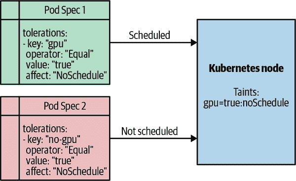
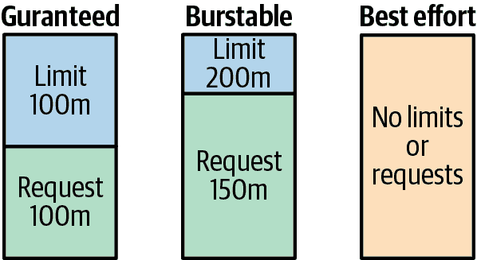

# 第八章：资源管理

在本章中，我们专注于管理和优化 Kubernetes 资源的最佳实践。我们讨论工作负载调度、集群管理、Pod 资源管理、命名空间管理和应用程序扩展。我们还深入探讨了 Kubernetes 通过亲和性、反亲和性、污点、容忍度和节点选择器提供的一些高级调度技术。

我们将向您展示如何实施资源限制、资源请求、Pod 服务质量、`PodDisruptionBudget`、`LimitRanger` 和反亲和性策略。

# Kubernetes 调度器

Kubernetes 调度器是托管在控制平面中的主要组件之一。调度器允许 Kubernetes 对部署到集群中的 Pod 进行放置决策。它处理基于集群约束和用户指定约束的资源优化。它使用基于谓词和优先级的评分算法。

## 谓词

Kubernetes 用于进行调度决策的第一个函数是谓词函数，它确定可以在哪些节点上调度 Pod。它意味着一个硬约束，因此返回一个 true 或 false 的值。例如，当一个 Pod 请求 4 GB 的内存，而一个节点无法满足此要求时。该节点将返回一个 false 值，并将从可用节点中移除以供 Pod 调度。另一个例子是，如果节点设置为不可调度，则将从调度决策中移除。

调度器根据限制性和复杂性的顺序检查谓词。截至目前，调度器检查以下谓词：

```
    CheckNodeConditionPred,
    CheckNodeUnschedulablePred,
    GeneralPred,
    HostNamePred,
    PodFitsHostPortsPred,
    MatchNodeSelectorPred,
    PodFitsResourcesPred,
    NoDiskConflictPred,
    PodToleratesNodeTaintsPred,
    PodToleratesNodeNoExecuteTaintsPred,
    CheckNodeLabelPresencePred,
    CheckServiceAffinityPred,
    MaxEBSVolumeCountPred,
    MaxGCEPDVolumeCountPred,
    MaxCSIVolumeCountPred,
    MaxAzureDiskVolumeCountPred,
    MaxCinderVolumeCountPred,
    CheckVolumeBindingPred,
    NoVolumeZoneConflictPred,
    CheckNodeMemoryPressurePred,
    CheckNodePIDPressurePred,
    CheckNodeDiskPressurePred,
    MatchInterPodAffinityPred
```

## 优先级

而谓词指示一个 true 或 false 的值并且排除一个节点进行调度，优先级值根据相对值对所有有效节点进行排名。以下优先级为节点评分：

```
    EqualPriority
    MostRequestedPriority
    RequestedToCapacityRatioPriority
    SelectorSpreadPriority
    ServiceSpreadingPriority
    InterPodAffinityPriority
    LeastRequestedPriority
    BalancedResourceAllocation
    NodePreferAvoidPodsPriority
    NodeAffinityPriority
    TaintTolerationPriority
    ImageLocalityPriority
    ResourceLimitsPriority
```

分数将被相加，然后节点将被赋予最终分数以指示其优先级。例如，如果一个 Pod 需要 600 毫核，而有两个节点，一个可用 900 毫核，另一个可用 1,800 毫核，那么可用 1,800 毫核的节点将具有更高的优先级。

如果节点返回相同的优先级，则调度器将使用 `selectHost()` 函数，以轮询方式选择一个节点。

# 高级调度技术

对于大多数情况，Kubernetes 会为您优化地安排 Pod 的调度。它考虑的因素包括仅将 Pod 放置在具有足够资源的节点上。它还试图将来自同一 ReplicaSet 的 Pod 分散到不同的节点以增加可用性，并平衡资源利用率。当这不够好时，Kubernetes 为您提供了影响资源调度的灵活性。例如，您可能希望跨可用性区域安排 Pod 以减少因区域性故障而导致应用程序停机时间。您还可能希望将 Pod 放置在特定主机以获得性能优势。

## Pod 亲和性和反亲和性

Pod 亲和性和反亲和性允许您设置规则以相对于其他 Pod 放置 Pod。这些规则允许您修改调度行为并覆盖调度器的放置决策。

例如，反亲和性规则允许您跨多个数据中心区域分散来自 ReplicaSet 的 Pod。它通过利用设置在 Pod 上的键标签来实现这一点。设置键/值对指示调度器在同一节点上调度 Pod（亲和性）或防止 Pod 在同一节点上调度（反亲和性）。

以下是设置 Pod 反亲和性规则的示例：

```
apiVersion: apps/v1
kind: Deployment
metadata:
  name: nginx
spec:
  selector:
    matchLabels:
      app: frontend
  replicas: 4
  template:
    metadata:
      labels:
        app: frontend
    spec:
      affinity:
        podAntiAffinity:
          requiredDuringSchedulingIgnoredDuringExecution:
          - labelSelector:
              matchExpressions:
              - key: app
                operator: In
                values:
                - frontend
            topologyKey: "kubernetes.io/hostname"
      containers:
      - name: nginx
        image: nginx:alpine
```

这个 NGINX 部署清单有四个副本，并且选择标签为`app=frontend`。部署中配置了一个 PodAntiAffinity 段，确保调度器不会在同一节点上放置副本。这样做可以确保如果一个节点故障，仍然有足够的 NGINX 副本从其缓存中提供数据。

## nodeSelector

nodeSelector 是将 Pod 调度到特定节点的最简单方法。它使用带有键/值对的标签选择器来做出调度决策。例如，您可能希望将 Pod 调度到具有专用硬件（例如 GPU）的特定节点。您可能会问，“我不能用节点污点做到这一点吗？”答案是，是的，您可以。区别在于，当您希望*请求*一个启用 GPU 的节点时，您使用 nodeSelector，而污点则*保留*节点仅用于 GPU 工作负载。您可以同时使用节点污点和 nodeSelector 来仅将节点保留给 GPU 工作负载，并使用 nodeSelector 自动选择具有 GPU 的节点。

以下是标记节点和在 Pod 规范中使用 nodeSelector 的示例：

```
kubectl label node <node_name> disktype=ssd
```

现在，让我们创建一个带有`disktype: ssd`节点选择器键/值的 Pod 规范：

```
apiVersion: v1
kind: Pod
metadata:
  name: redis
  labels:
    env: prod
spec:
  containers:
  - name: frontend
    image: nginx:alpine
    imagePullPolicy: IfNotPresent
  nodeSelector:
    disktype: ssd
```

使用 nodeSelector 将 Pod 调度到只有标签`disktype=ssd`的节点上：

## 污点和容忍

*污点*用于节点上排斥调度 pod。但这不是反亲和性的作用吗？是的，但污点采用了与 pod 反亲和性不同的方法，并且用于不同的用例。例如，您可能有需要特定性能配置文件的 pod，并且不希望将任何其他 pod 调度到特定节点上。污点与*容忍*结合使用，允许您覆盖带有污点的节点。这两者的结合为您提供了对反亲和性规则的精细控制。

通常情况下，您将使用污点和容忍来处理以下用例：

+   专用节点硬件

+   专用节点资源

+   避免降级节点

多种污点类型影响调度和运行容器：

NoSchedule

阻止在节点上进行调度的硬污点

PreferNoSchedule

仅在无法在其他节点上调度 pod 时才进行调度

NoExecute

驱逐已在节点上运行的 pod

NodeCondition

如果满足特定条件，则对节点进行污点处理

图 8-1 展示了一个被`taint`为`gpu=true:NoSchedule`的节点的示例。Pod Spec 1 具有一个`gpu`的容忍键，因此将被调度到带污点的节点上。Pod Spec 2 具有一个`no-gpu`的容忍键，因此不会被调度到该节点上。



###### 图 8-1\. Kubernetes 污点和容忍

当由于带污点的节点而无法调度 pod 时，您将看到以下类似的错误消息：

```
Warning:  FailedScheduling  10s (x10 over 2m)  default-scheduler
0/2 nodes are available: 2 node(s) had taints that the pod did not tolerate.
```

现在我们已经看到如何手动添加污点以影响调度，还有一个强大的概念是*taint-based eviction*，它允许驱逐正在运行的 pod。例如，如果由于坏的磁盘驱动器而使节点变得不健康，基于污点的驱逐可以将 pod 重新调度到集群中的另一个健康节点上。

# Pod 资源管理

在 Kubernetes 中管理应用程序的一个最重要方面是适当管理 pod 资源。管理 pod 资源包括管理 CPU 和内存，以优化您的 Kubernetes 集群的整体利用率。您可以在容器级别和命名空间级别管理这些资源。还有其他资源，如网络和存储，但 Kubernetes 尚无法设置这些资源的请求和限制。

为了调度程序能够优化资源并做出智能的放置决策，它需要了解应用程序的需求。例如，如果一个容器（应用程序）需要至少 2 GB 的内存来运行，我们需要在 pod 规范中定义这一点，以便调度程序知道该容器在所调度的主机上需要 2 GB 的内存。

## 资源请求

Kubernetes 资源*请求*定义了一个容器需要调度*X*数量的 CPU 或内存。如果您在 pod 规范中指定容器需要 8 GB 的资源请求，而所有节点都有 7.5 GB 的内存，那么该 pod 将无法调度。如果 pod 无法调度，它将进入*挂起*状态，直到所需资源可用。所以让我们看看在我们的集群中是如何工作的。

要确定集群中可用的空闲资源，请使用 `kubectl top`：

```
kubectl top nodes
```

输出应该像这样（您的集群的内存大小可能不同）：

```
NAME                       CPU(cores)   CPU%   MEMORY(bytes)   MEMORY%
aks-nodepool1-14849087-0   524m         27%    7500Mi          33%
aks-nodepool1-14849087-1   468m         24%    3505Mi          27%
aks-nodepool1-14849087-2   406m         21%    3051Mi          24%
aks-nodepool1-14849087-3   441m         22%    2812Mi          22%
```

正如这个例子所示，主机可用的最大内存量是 7,500 Mi，所以让我们安排一个请求 8,000 Mi 内存的 pod：

```
apiVersion: v1
kind: Pod
metadata:
  name: memory-request
spec:
  containers:
  - name: memory-request
    image: polinux/stress
    resources:
      requests:
        memory: "8000Mi"
```

注意，pod 将保持挂起状态，如果查看 pod 的事件，您会看到没有可用的节点来调度 pod：

```
kubectl describe pods memory-request
```

事件的输出应该像这样：

```
Events:
  Type     Reason        Age                From              Message
  Warning  FailedSch...  27s (x2 over 27s)  default-sched...  0/3 nodes are
                                                              available: 3
                                                              Insufficient memory
```

## 资源限制和 pod 服务质量

Kubernetes 资源*限制*定义了 pod 可以获得的最大 CPU 或内存。当您为 CPU 和内存指定限制时，每个达到指定限制时都会采取不同的操作。对于 CPU 限制，容器会被限制使用超过指定限制的资源。对于内存限制，如果 pod 达到其限制，它将被重新启动。该 pod 可能会在集群中的同一主机或不同主机上重新启动。

为容器指定限制是一种最佳实践，以确保应用程序在集群中分配到公平的资源份额：

```
apiVersion: v1
kind: Pod
metadata:
  name: cpu-demo
  namespace: cpu-example
spec:
  containers:
  - name: frontend
    image: nginx:alpine
    resources:
      limits:
        cpu: "1"
      requests:
        cpu: "0.5"
```

```
apiVersion: v1
kind: Pod
metadata:
  name: qos-demo
  namespace: qos-example
spec:
  containers:
  - name: qos-demo-ctr
    image: nginx:alpine
    resources:
      limits:
        memory: "200Mi"
        cpu: "700m"
      requests:
        memory: "200Mi"
        cpu: "700m"
```

当一个 pod 被创建时，它被分配以下其中之一的服务质量 (QoS) 类：

+   保证

+   突发

+   最佳努力

当 CPU 和内存都有匹配的请求和限制时，pod 被分配*保证*的 QoS。当限制设置高于请求时，即被分配*突发*的 QoS，这意味着容器保证了其请求，但也可以突发到容器设置的限制。当 pod 中的容器没有设置请求或限制时，被分配*最佳努力*的 QoS。

图 8-2 描述了如何为 pod 分配 QoS。



###### 图 8-2\. Kubernetes QoS

###### 注意

使用保证的 QoS，如果您的 pod 中有多个容器，您将需要为每个容器设置内存请求和限制，同时还需要为每个容器设置 CPU 请求和限制。如果所有容器的请求和限制都没有设置，它们将不会被分配保证的 QoS。

## PodDisruptionBudgets

Kubernetes 在某个时间点可能需要从主机中*驱逐* pod。有两种类型的驱逐：*自愿*和*非自愿*中断。非自愿中断可能由硬件故障、网络分区、内核崩溃或节点资源不足引起。自愿驱逐可能由于对集群执行维护、集群自动缩放器释放节点或更新 pod 模板而引起。为了最小化对应用程序的影响，您可以设置`PodDisruptionBudget`以确保 pod 需要被驱逐时应用程序的正常运行时间。`PodDisruptionBudget`允许您在自愿驱逐事件中设置最小可用和最大不可用 pod 的策略。例如，当在节点上执行维护时，自愿驱逐的一个示例就是排空节点。

例如，您可以指定您的应用程序中最多有 20% 的 pod 可以在任何给定时间内处于停机状态。您还可以根据*X*个必须始终可用的副本来指定此策略。

### 最小可用

在下面的示例中，我们设置了一个`PodDisruptionBudget`来处理应用程序前端的最小可用为 5：

```
apiVersion: policy/v1
kind: PodDisruptionBudget
metadata:
  name: frontend-pdb
spec:
  minAvailable: 5
  selector:
    matchLabels:
      app: frontend
```

在此示例中，`PodDisruptionBudget`指定前端应用程序始终必须有五个复制 pod 在任何时候可用。在这种情况下，可以驱逐尽可能多的 pod，只要五个 pod 可用即可。

### 最大不可用

在下一个示例中，我们设置了一个`PodDisruptionBudget`来处理前端应用程序的最大不可用为 20%：

```
apiVersion: policy/v1
kind: PodDisruptionBudget
metadata:
  name: frontend-pdb
spec:
  maxUnavailable: 20%
  selector:
    matchLabels:
      app: frontend
```

在此示例中，`PodDisruptionBudget`指定在任何给定时间内不得超过 20% 的复制 pod 不可用。在这种情况下，驱逐期间可以驱逐多达 20% 的 pod。

在设计 Kubernetes 集群时，重要的是要考虑集群资源的大小，以便能够处理一定数量的失败节点。例如，如果您有一个四节点集群，并且一个节点失败了，那么您将失去四分之一的集群容量。

###### 注意

当将`PodDisruptionBudget`指定为百分比时，可能无法与特定数量的 pod 相关联。例如，如果您的应用程序有七个 pod，并且您将`maxAvailable`指定为`50%`，那么不清楚是三个还是四个 pod。在这种情况下，Kubernetes 会四舍五入到最接近的整数，因此`maxAvailable`将是四个 pod。

## 通过使用命名空间管理资源

*命名空间*在 Kubernetes 中为您提供了资源的良好逻辑分离。这允许您为每个命名空间设置资源配额、基于角色的访问控制（RBAC）和命名空间的网络策略。它为您提供了软多租户功能，可以在集群中分隔工作负载，而无需为团队或应用程序专用特定的基础设施。这使您可以在保持逻辑分离的同时充分利用集群资源。

例如，你可以为每个团队创建一个命名空间，并为每个团队分配资源配额，例如 CPU 和内存。

在设计如何配置命名空间时，应考虑如何控制对特定应用程序集的访问。如果有多个团队将使用单个集群，则通常最好为每个团队分配一个命名空间。如果集群专用于单个团队，则为部署到集群的每个服务分配一个命名空间可能是有意义的。没有单一的解决方案；你的团队组织和责任将驱动设计。

部署 Kubernetes 集群后，你会在集群中看到以下命名空间：

`kube-system`

Kubernetes 内部组件已部署在这里，例如 `coredns`、`kube-proxy` 和 `metrics-server`。

`default`

这是在资源对象中未指定命名空间时使用的默认命名空间。

`kube-public`

用于匿名和未认证内容，保留用于系统使用。

你应避免使用默认命名空间，因为用户不必在特定资源约束内部署应用程序，这可能导致资源争用。你还应避免将 `kube-system` 命名空间用于你的应用程序，因为它用于 Kubernetes 内部组件。

在使用命名空间时，使用 `kubectl` 时需要使用 `--namespace` 标志，或者简写为 `-n`：

```
kubectl create ns team-1
```

```
kubectl get pods --namespace team-1
```

你还可以将 `kubectl` 上下文设置为特定的命名空间，这样你就不需要在每个命令中添加 `--namespace` 标志了。你可以使用以下命令设置你的命名空间上下文：

```
kubectl config set-context my-context --namespace=team-1
```

###### 提示

当处理多个命名空间和集群时，设置不同的命名空间和集群上下文可能会很麻烦。我们发现使用 [kubens](https://oreil.ly/ryavL) 和 [kubectx](https://oreil.ly/kVBiL) 可以帮助轻松切换这些不同的命名空间和上下文。

## ResourceQuota

当多个团队或应用共享单个集群时，设置 `ResourceQuota` 对你的命名空间非常重要。`ResourceQuota` 允许你将集群分割成逻辑单元，以确保没有单个命名空间能在集群中占用超过其份额的资源。以下资源可以为它们设置配额：

+   计算资源：

    +   `requests.cpu`: CPU 请求的总和不得超过此数量。

    +   `limits.cpu`: CPU 限制的总和不得超过此数量。

    +   `requests.memory`: 内存请求的总和不得超过此数量。

    +   `limit.memory`: 内存限制的总和不得超过此数量。

+   存储资源：

    +   `requests.storage`: 存储请求的总和不得超过此值。

    +   `persistentvolumeclaims`: 命名空间中可以存在的 PersistentVolume claim 的总数。

    +   `storageclass.request`: 与指定存储类相关联的卷声明不得超过此值。

    +   `storageclass.pvc`：命名空间中可以存在的持久卷声明的总数

+   对象计数配额（仅作为示例设置）：

    +   计数/pvc

    +   计数/services

    +   计数/deployments

    +   计数/replicasets

从这个列表中可以看出，Kubernetes 允许您对每个命名空间的资源配额进行精细化控制。这使您能够更有效地管理多租户集群中的资源使用。

现在让我们看看这些配额是如何通过在命名空间上设置一个配额来实际工作的。将以下 YAML 文件应用到`team-1`命名空间：

```
apiVersion: v1
kind: ResourceQuota
metadata:
  name: mem-cpu-demo
  namespace: team-1
spec:
  hard:
    requests.cpu: "1"
    requests.memory: 1Gi
    limits.cpu: "2"
    limits.memory: 2Gi
    persistentvolumeclaims: "5"
    requests.storage: "10Gi
```

```
kubectl apply quota.yaml -n team-1
```

此示例为`team-1`命名空间设置了 CPU、内存和存储的配额。

现在让我们尝试部署一个应用程序，看看资源配额如何影响部署：

```
kubectl run nginx-quotatest --image=nginx --restart=Never --replicas=1 --port=80
    --requests='cpu=500m,memory=4Gi' --limits='cpu=500m,memory=4Gi' -n team-1
```

由于内存配额超过了 2 Gi 内存，此部署将失败并显示以下错误：

```
Error from server (Forbidden): pods "nginx-quotatest" is forbidden:
    exceeded quota: mem-cpu-demo
```

正如这个示例展示的那样，设置资源配额可以根据你为命名空间设置的策略拒绝资源的部署。

## LimitRange

我们已经讨论过在容器级别设置`request`和`limits`，但是如果用户忘记在 pod 规范中设置这些内容会发生什么？Kubernetes 提供了一个准入控制器，允许在规范中没有指定这些内容时自动设置它们。

首先，创建一个用于配额和`LimitRange`工作的命名空间：

```
kubectl create ns team-1
```

在命名空间中应用`LimitRange`以应用`limits`中的`defaultRequest`：

```
apiVersion: v1
kind: LimitRange
metadata:
  name: team-1-limit-range
spec:
  limits:
  - default:
      memory: 512Mi
    defaultRequest:
      memory: 256Mi
    type: Container
```

将此保存为*limitranger.yaml*，然后运行`kubectl apply`：

```
kubectl apply -f limitranger.yaml -n team-1
```

验证`LimitRange`是否应用了默认的限制和请求：

```
 kubectl run team-1-pod --image=nginx -n team-1
```

接下来，让我们描述一下 pod，看看在其上设置了什么请求和限制：

```
kubectl describe pod team-1-pod -n team-1
```

您应该看到在 pod 规范上设置了以下请求和限制：

```
Limits:
      memory:  512Mi
    Requests:
      memory:  256Mi
```

当使用`ResourceQuota`时，使用`LimitRange`非常重要，因为如果在规范中未设置请求或限制，部署将被拒绝。

## 集群扩展

在部署集群时，您需要做的第一个决定之一是确定您将在集群中使用的实例大小。这在将工作负载混合在单个集群中时尤为重要，更多地是一门艺术而非科学。您首先需要确定集群的良好起点；追求 CPU 和内存的良好平衡是一个选项。在确定了集群的合理大小后，您可以使用几个 Kubernetes 核心原语来管理集群的扩展。

### 手动扩展

Kubernetes 使得扩展您的集群变得简单，特别是如果您正在使用像 Kops 或托管的 Kubernetes 服务这样的工具。手动扩展您的集群通常只需选择一个新的节点数，服务将会将新节点添加到您的集群中。

这些工具还允许您创建节点池，这使得您可以向已运行的集群添加新的实例类型。在单个集群中运行混合工作负载时，这变得非常有用。例如，一个工作负载可能更多地依赖于 CPU，而其他工作负载可能是内存驱动的应用程序。节点池允许您在单个集群中混合多个实例类型。

但也许您不想手动执行此操作，希望它自动扩展。在集群自动扩展时，您需要考虑一些事项，我们发现大多数用户最好是在需要资源时主动手动扩展其节点。如果您的工作负载高度可变，集群自动扩展将非常有用。

### 集群自动扩展

Kubernetes 提供了一个 Cluster Autoscaler 插件，允许您设置集群的最小可用节点数，以及集群可以扩展到的最大节点数。Cluster Autoscaler 根据 pod 进入挂起状态时做出扩展决策。例如，如果 Kubernetes 调度器尝试调度一个需要 4,000 Mib 内存的 pod，而集群只有 2,000 Mib 可用，那么该 pod 将进入挂起状态。在 pod 挂起后，Cluster Autoscaler 将向集群添加一个节点。一旦新节点添加到集群中，挂起的 pod 就会被调度到该节点。Cluster Autoscaler 的缺点在于，只有在 pod 进入挂起状态之前才会添加新节点，因此当调度时，您的工作负载可能需要等待新节点上线。截至 Kubernetes v1.15，Cluster Autoscaler 不支持基于自定义指标的扩展。

当不再需要资源时，Cluster Autoscaler 还可以减少集群的大小。当资源不再需要时，它将排空节点并将 pod 重新调度到集群中的新节点。您将需要使用 `PodDisruptionBudget` 来确保在执行排空操作以从集群中移除节点时不会对应用程序产生负面影响。

## 应用程序扩展

Kubernetes 提供了多种方式来扩展集群中的应用程序。您可以通过手动更改部署中的副本数量来扩展应用程序。您也可以更改 ReplicaSet 或复制控制器，但我们不建议通过这些实现来管理您的应用程序。对于静态的工作负载或者您知道工作负载峰值时段的情况，手动扩展是完全可以接受的，但对于经历突发峰值或不是静态的工作负载，手动扩展并不理想。幸运的是，Kubernetes 还提供了 Horizontal Pod Autoscaler（HPA），可以自动为您扩展工作负载。

让我们首先看看如何通过应用以下部署清单来手动扩展部署：

```
apiVersion: apps/v1
kind: Deployment
metadata:
  name: frontend
spec:
  replicas: 3
  selector:
    matchlables:
      app: frontend
  template:
    metadata:
      name: frontend
      labels:
        app: frontend
    spec:
      containers:
      - image: nginx:alpine
        name: frontend
        resources:
          requests:
            cpu: 100m
```

本示例部署了我们的前端服务的三个副本。然后，我们可以使用 `kubectl scale` 命令来扩展此部署：

```
kubectl scale deployment frontend --replicas 5
```

这导致我们的前端服务产生了五个副本。这很棒，但让我们看看如何根据指标添加一些智能化，并自动扩展应用程序。

## 使用 HPA 进行扩展

Kubernetes HPA 允许根据 CPU、内存或自定义指标扩展您的部署。它对部署执行监视，并从 Kubernetes `metrics-server` 中拉取指标。它还允许您设置可用的最小和最大 pod 数量。例如，您可以定义一个 HPA 策略，将最小 pod 数量设置为 3，最大 pod 数量设置为 10，并且在部署达到 80% CPU 使用率时进行扩展。设置最小和最大值非常关键，因为您不希望由于应用程序错误或问题，HPA 将副本无限扩展。

HPA 具有以下同步指标、升级和降级副本的默认设置：

`horizontal-pod-autoscaler-sync-period`

指标同步的默认设置为 30 秒

`horizontal-pod-autoscaler-upscale-delay`

两次扩展操作之间的默认间隔为三分钟

`horizontal-pod-autoscaler-downscale-delay`

两次降级操作之间的默认间隔为五分钟

您可以通过使用它们的相关标志来更改默认值，但在这样做时需要小心。如果您的工作负载非常变化，值得尝试不同的设置以优化特定用例。

接下来，让我们为你在上一个练习中部署的前端应用设置一个 HPA 策略。

首先，在端口 80 上公开部署：

```
 kubectl expose deployment frontend --port 80
```

然后，设置自动缩放策略：

```
kubectl autoscale deployment frontend --cpu-percent=50 --min=1 --max=10
```

这将策略设置为从最小 1 个副本扩展到最多 10 个副本，并且在 CPU 负载达到 50% 时会触发扩展操作。

让我们生成一些负载，以便我们可以看到部署的自动扩展：

```
kubectl run -i --tty load-generator --image=busybox /bin/sh
```

```
Hit enter for command prompt
while true; do wget -q -O- http://frontend.default.svc.cluster.local; done
```

```
kubectl get hpa
```

您可能需要等待几分钟以便看到副本自动扩展。

## HPA 与自定义指标

在第四章中，我们介绍了在 Kubernetes 中监视我们系统的指标服务器扮演的角色。使用指标服务器 API，我们还可以支持使用自定义指标扩展我们的应用程序。自定义指标 API 和指标聚合器允许第三方提供商插入和扩展这些指标，而 HPA 则可以根据这些外部指标进行扩展。例如，您可以基于外部存储队列上收集的指标，而不仅仅是基本的 CPU 和内存指标进行扩展。通过利用自定义指标进行自动缩放，您可以根据应用程序特定的指标或外部服务指标进行扩展。

## 垂直 Pod 自动缩放器

垂直 Pod 自动缩放器（VPA）与 HPA 不同，它不会扩展副本；相反，它会自动扩展请求。在本章前面，我们讨论了在我们的 Pod 上设置请求以及如何保证给定容器的 *X* 资源量。VPA 使您无需手动调整这些请求，并为您自动缩放 Pod 请求。对于不能因其架构而进行扩展的工作负载，这对于自动缩放资源非常有效。例如，MySQL 数据库与无状态 Web 前端的扩展方式不同。对于 MySQL，您可能希望根据工作负载自动扩展主节点。

VPA 比 HPA 更复杂，由三个组件组成：

`推荐者`

监控当前和过去的资源消耗，并为容器的 CPU 和内存请求提供推荐值。

`更新者`

检查哪些 Pod 设置了正确的资源，如果没有，则杀死它们，以便它们可以由其控制器重新创建并更新请求。

`准入插件`

在新的 Pod 上设置正确的资源请求。

垂直扩展有两个目标：

+   通过自动化配置资源需求来降低维护成本。

+   提高集群资源的利用率，同时最大限度地减少容器内存耗尽或 CPU 被饥饿的风险。

# 资源管理最佳实践

+   利用 Pod 反亲和性来在多个可用性区域间分布工作负载，确保应用程序的高可用性。

+   如果使用了专用硬件（如支持 GPU 的节点），请通过使用污点，仅安排需要 GPU 的工作负载到这些节点。

+   使用 `NodeCondition` 的污点来主动避免节点的故障或降级。

+   将 nodeSelectors 应用于您的 Pod 规范，以便将 Pod 调度到集群中部署的专用硬件。

+   在进入生产环境之前，尝试不同的节点大小以找到成本和性能的良好平衡。

+   如果您部署了具有不同性能特征的混合工作负载，请利用节点池在单个集群中拥有混合节点类型。

+   确保为部署到集群中的所有 Pod 设置内存和 CPU 限制。

+   使用 `ResourceQuota` 来确保集群中多个团队或应用程序得到公平分配的资源份额。

+   实施 `LimitRange` 来为未设置限制或请求的 Pod 规范设置默认限制和请求。

+   在了解 Kubernetes 上的工作负载配置文件之前，从手动集群扩展开始。您可以使用自动缩放，但需要考虑节点启动时间和集群缩减的其他问题。

+   对于变量且具有意外使用量高峰的工作负载，使用 HPA。

# 摘要

在本章中，我们讨论了如何优化管理 Kubernetes 和应用资源。Kubernetes 提供了许多内置功能来管理资源，您可以利用这些功能来维护可靠、高效利用的集群。最初可能会对集群和 Pod 的大小感到困惑，但通过在生产环境中监控应用程序，您可以发现优化资源的方法。
