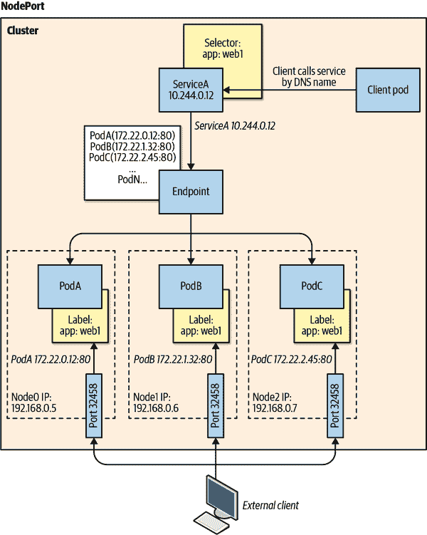

# 第九章：网络、网络安全和服务网格

Kubernetes 有效地是跨连接系统集群的分布式系统管理器。这立即将系统连接的方式如何与其它系统通信置于至关重要的位置，而网络是这一切的关键。了解 Kubernetes 如何促进其管理的分布式服务之间的通信对于有效地应用服务间通信非常重要。

本章重点介绍 Kubernetes 在网络上的原则，并围绕在不同情况下应用这些概念的最佳实践展开讨论。任何关于网络的讨论通常都会带来安全性的讨论。传统的网络安全边界模型在 Kubernetes 中的分布式系统的新世界中并未消失，但它们的实施方式和提供的功能略有变化。Kubernetes 带来了一种原生的网络安全策略 API，听起来令人毛骨悚然地类似于旧时防火墙规则。

本章的最后一节深入探讨了服务网格的新世界，术语“恐怖”是开玩笑用的，但在 Kubernetes 的服务网格技术中确实是相当不可预测的领域。

# Kubernetes 网络原则

理解 Kubernetes 如何利用底层网络来促进服务之间的通信对于有效规划应用程序架构至关重要。通常，网络主题开始让大多数人头痛起来。我们将保持简单，因为这更多是最佳实践指导，而不是容器网络的课程。幸运的是，Kubernetes 已经为网络制定了一些规则，为我们提供了一个起点。这些规则概述了不同组件之间预期的通信行为。让我们更详细地看看每个规则：

同一 Pod 中容器之间的通信

同一 Pod 中的所有容器共享相同的网络空间。这有效地允许容器之间通过 localhost 进行通信。这也意味着同一 Pod 中的容器需要暴露不同的端口。通过 Linux 命名空间和 Docker 网络的能力，通过在每个 Pod 中运行一个什么也不做的暂停容器来托管 Pod 的网络，从而使这些容器可以位于相同的本地网络。图 9-1 展示了容器 A 如何直接使用 localhost 和容器正在监听的端口号与容器 B 进行通信。


###### 图 9-1 两个容器之间的 Pod 内通信

Pod 与 Pod 的通信

所有的 pod 都需要在没有任何网络地址转换（NAT）的情况下相互通信。这意味着接收 pod 看到的 pod IP 地址就是发送 pod 的实际 IP 地址。这是通过使用不同的网络插件来处理的，具体在本章后面会详细讨论。这条规则适用于同一节点上的 pod，以及同一集群中不同节点上的 pod。这也扩展到节点能够直接与 pod 进行通信，无需涉及 NAT。这允许基于主机的代理或系统守护程序根据需要与 pod 进行通信。图 9-2 是表示同一节点内 pod 和集群中不同节点上 pod 之间通信过程的图示。


###### 图 9-2\. Pod 对 pod 的节点内和节点间通信

服务对 pod 的通信

Kubernetes 中的服务代表了在每个节点上找到的持久 IP 地址和端口，将所有流量转发到映射到服务的端点。在 Kubernetes 的不同迭代中，启用这一功能的方法有所改变，但主要方法有通过使用 iptables 或更新的 IP Virtual Server（IPVS）。一些云提供商和更高级的实现允许基于新的 eBPF 数据平面。今天大多数实现使用 iptables 实现在每个节点上启用伪 Layer 4 负载均衡器。图 9-3 是显示服务如何通过标签选择器与 pod 关联的视觉表示。


###### 图 9-3\. 服务对 pod 的通信

# 网络插件

早期，特别兴趣组（SIG）引导网络标准向更具可插拔架构的方向发展，为 Kubernetes 工作负载打开了许多第三方网络项目的大门，在许多情况下，这些项目为 Kubernetes 工作负载注入了增值能力。这些网络插件分为两种类型。最基本的称为 Kubenet，是 Kubernetes 本地提供的默认插件。第二种类型的插件遵循容器网络接口（CNI）规范，这是容器的通用插件网络解决方案。

## Kubenet

Kubenet 是 Kubernetes 中随箱即出的最基本的网络插件。它是最简单的插件，为连接到其上的 pod 提供了一个 Linux 桥接器 `cbr0`，这是一个虚拟以太网对。然后，pod 从分布在集群节点上的无类域间路由（CIDR）范围获取 IP 地址。还有一个 IP 伪装标志，应设置为允许发送到 pod CIDR 范围外 IP 的流量进行伪装。这遵守了 pod 对 pod 通信的规则，因为只有发送到 pod CIDR 范围外的流量才会经过网络地址转换（NAT）。当数据包离开一个节点去往另一个节点时，会放置某种路由来促进将流量正确转发到相应的节点的过程。

## Kubenet 最佳实践

+   Kubenet 允许简单的网络堆栈，并且不会在已经拥挤的网络上消耗宝贵的 IP 地址。这对扩展到本地数据中心的云网络尤其重要。

+   确保 Pod CIDR 范围足够大，以处理集群的潜在大小和每个集群中的 Pod。kubelet 中设置的默认每节点 Pod 数为 110，但您可以进行调整。

+   确保根据路由规则进行适当的规划，以便流量能够正确找到节点中的 Pod。在云提供商中，这通常是自动化的，但在本地或边缘情况下将需要自动化和可靠的网络管理。

## CNI 插件

CNI 插件通过规范设定了基本要求。这些规范规定了 CNI 提供的接口和最低 API 操作，以及它如何与集群中使用的容器运行时接口。网络管理组件由 CNI 定义，但它们都必须包括某种类型的 IP 地址管理，并最少允许将容器添加到网络并删除容器。最初源自`rkt`网络提案的完整原始规范可在[GitHub 上获得](https://oreil.ly/wGvF7)。

核心 CNI 项目提供了库，您可以使用这些库编写插件，提供基本要求，并调用其他插件执行各种功能。这种适应性导致了许多 CNI 插件，您可以在云提供商的容器网络中使用，如微软 Azure 本机 CNI 和亚马逊 Web 服务（AWS）VPC CNI 插件，以及来自传统网络提供商的插件，如 Nuage CNI、Juniper Networks Contrail/Tunsten Fabric 和 VMware NSX。

## CNI 最佳实践

网络是运行良好的 Kubernetes 环境的关键组成部分。Kubernetes 内的虚拟组件与物理网络环境之间的交互应经过精心设计，以确保可靠的应用程序通信：

1.  评估完成基础设施的整体网络目标所需的功能集。一些 CNI 插件提供本地高可用性、多云连接、Kubernetes 网络策略支持以及其他各种功能。

1.  如果通过公共云提供商运行集群，请验证是否支持云提供商的 SDN 中不是本地的任何 CNI 插件。

1.  验证任何网络安全工具、网络可观察性工具和管理工具是否与所选 CNI 插件兼容。如果不兼容，研究可以替换现有工具的替代工具。当转移到诸如 Kubernetes 之类的大规模分布式系统时，不要失去可观察性或安全性能力是非常重要的。您可以将 Weaveworks Weave Scope、Dynatrace 和 Sysdig 等工具添加到任何 Kubernetes 环境中，每个工具都提供其独特的优势。如果您在云提供商的托管服务中运行，例如 Azure AKS、Google GCE 或 AWS EKS，请寻找像 Azure Container Insights 和 Network Watcher、Google Logging 和 Monitoring、以及 AWS CloudWatch 等本地工具。无论您使用哪种工具，它都应提供对网络堆栈和由 Google SRE 团队和 Rob Ewashuck 流行的四个黄金信号（延迟、流量、错误和饱和度）的洞察。

1.  如果您正在使用不提供与 SDN 空间分开的覆盖网络的 CNI，请确保您有适当的网络地址空间来处理节点 IP、Pod IP、内部负载均衡器以及集群升级和扩展过程中的开销。

# Kubernetes 中的服务

当 Pod 部署到 Kubernetes 集群中时，由于 Kubernetes 网络的基本规则及用于促进这些规则的网络插件，Pod 只能直接与同一集群中的其他 Pod 进行通信。某些 CNI 插件在与节点相同的网络空间上为 Pod 提供 IP，因此技术上，一旦知道了 Pod 的 IP，就可以直接从集群外访问它。然而，由于 Kubernetes 中 Pod 的瞬时性质，这并不是访问由 Pod 提供的服务的有效方式。想象一下，您有一个需要访问运行在 Kubernetes Pod 中的 API 的函数或系统。一段时间内，这可能会毫无问题地运行，但在某个时刻可能会出现自愿或非自愿的中断，导致该 Pod 消失。Kubernetes 可能会创建一个新的 Pod 来替换原来的 Pod，并分配新的名称和 IP 地址，因此自然需要某种机制来找到替换的 Pod。这就是服务 API 出马的地方。

服务 API 允许在 Kubernetes 集群内分配持久的 IP 和端口，并自动映射到服务的正确 Pod 端点。这一魔法通过 Linux 节点上的 iptables 或 IPVS 实现，以创建将分配的服务 IP 和端口映射到端点或 Pod 实际 IP 的映射。负责管理这一过程的控制器称为`kube-proxy`服务，它实际上在集群中的每个节点上运行。它负责在每个节点上操作 iptables 规则。

当定义服务对象时，需要定义服务的类型。服务类型将决定端点是仅在集群内部暴露还是在集群外部暴露。我们将在以下部分简要讨论四种基本的服务类型。

## ClusterIP 服务类型

如果在规范中未声明服务类型，则 ClusterIP 是默认的服务类型。ClusterIP 意味着服务将被分配一个指定服务 CIDR 范围内的 IP。此 IP 与服务对象一样持久，因此它为后端 Pod 提供 IP、端口和协议映射，使用选择器字段；然而，正如我们将看到的，有时您可以没有选择器的情况。服务的声明还为服务提供了一个域名系统（DNS）名称。这在集群内部促进了服务发现，并允许工作负载通过基于服务名称的 DNS 查找轻松与集群中的其他服务通信。例如，如果您有如下示例中所示的服务定义，并且需要通过 HTTP 调用从集群内的另一个 Pod 访问该服务，则调用可以简单地使用 http://web1-svc（如果客户端与服务在同一命名空间中）：

```
apiVersion: v1
kind: Service
metadata:
  name: web1-svc
spec:
  selector:
    app: web1
  ports:
  - port: 80
    targetPort: 8081
```

如果需要在其他命名空间中查找服务，则 DNS 模式将是 `*<service_name>.<namespace_name>*.svc.cluster.local`。

如果在服务定义中没有给出选择器，则可以通过使用端点 API 定义为服务显式定义服务的端点，而不是依赖于选择器属性从符合选择器匹配的 Pod 中自动更新端点。在某些场景中，这可能非常有用，例如您有一个特定的数据库用于测试，而不是集群中的数据库，但稍后将该服务更改为 Kubernetes 部署的数据库。这有时被称为 *无头服务*，因为它不像其他服务一样由 `kube-proxy` 管理，但您可以直接管理端点，如 图 9-4 所示。


###### 图 9-4\. ClusterIP-Pod 和服务可视化

## NodePort 服务类型

NodePort 服务类型为集群中每个节点分配一个高级端口到每个节点的服务 IP 和端口。高级 NodePort 位于 30,000 到 32,767 范围内，并且可以静态分配或在服务规范中明确定义。NodePorts 通常用于本地集群或不提供自动负载均衡配置的定制解决方案。要从集群外部直接访问服务，请使用 NodeIP:NodePort，如 图 9-5 所示。



###### 图 9-5\. NodePort-Pod、服务和主机网络可视化

## 外部名称服务类型

ExternalName 服务类型在实践中很少使用，但对于将集群持久性 DNS 名称传递给外部 DNS 命名服务可能有所帮助。一个常见的例子是来自云提供商的外部数据库服务，云提供商提供唯一 DNS，例如 `mymongodb.documents.azure.com`。从技术上讲，可以非常容易地通过在 Pod 规范中使用 `Environment` 变量来添加它，如 第六章 中所讨论的那样。然而，使用更通用的集群名称，如 `prod-mongodb`，可能更有利，因为这样只需更改服务规范即可改变它指向的实际数据库，而无需因为 `Environment` 变量的更改而重新启动 Pod：

```
kind: Service
apiVersion: v1
metadata:
  name: prod-mongodb
  namespace: prod
spec:
  type: ExternalName
  externalName: mymongodb.documents.azure.com
```

## Service Type LoadBalancer

LoadBalancer 是一个非常特殊的服务类型，因为它可以与云提供商和其他可编程云基础设施服务自动化集成。`LoadBalancer` 类型是确保部署由 Kubernetes 集群的基础设施提供商提供的负载均衡机制的单一方法。这意味着在大多数情况下，`LoadBalancer` 在 AWS、Azure、GCE、OpenStack 等环境中的工作方式大致相同。这个入口通常会创建一个公共面向外部的负载均衡服务；然而，每个云提供商都有一些特定的注释，以启用其他功能，如仅内部的负载均衡器、AWS ELB 配置参数等。您还可以定义要使用的实际负载均衡器 IP 和在服务规范中允许的源范围，如接下来的代码示例和在 图 9-6 中的可视化表示：

```
kind: Service
apiVersion: v1
metadata:
  name: web-svc
spec:
  type: LoadBalancer
  selector:
    app: web
  ports:
  - protocol: TCP
    port: 80
    targetPort: 8081
  loadBalancerIP: 13.12.21.31
  loadBalancerSourceRanges:
  - "142.43.0.0/16"
```


###### 图 9-6\. 负载均衡器- Pod、服务、节点和云提供商网络可视化

## Ingress 和 Ingress 控制器

尽管在 Kubernetes 中技术上不是一个服务类型，但 Ingress 规范对于 Kubernetes 中的工作负载入口非常重要。服务根据服务 API 的定义，允许基本的第 3/4 层负载均衡。事实上，许多部署在 Kubernetes 中的无状态服务需要高级别的流量管理，并且通常需要应用级别的控制，尤其是 HTTP 协议管理。

入口 API 基本上是一个 HTTP 级别的路由器，允许基于主机和路径的规则将请求定向到特定的后端服务。想象一个托管在 www.evillgenius.com 上的网站，并且该站点上托管有两个不同路径，*/registration* 和 */labaccess*，由 Kubernetes 中托管的两个不同服务 `reg-svc` 和 `labaccess-svc` 提供。您可以定义一个入口规则，以确保将对 www.evillgenius.com/registration 的请求转发到 `reg-svc` 服务和正确的端点 pod，同样地，将对 www.evillgenius.com/labaccess 的请求转发到 `labaccess-svc` 服务的正确端点。入口 API 还允许基于主机的路由，以允许在单个入口上使用不同的主机。另一个功能是声明一个 Kubernetes 密钥，其中包含用于在端口 443 上终止传输层安全性（TLS）的证书信息。当未指定路径时，通常会有一个默认后端可以用于提供比标准 404 错误更好的用户体验。

关于特定的 TLS 和默认后端配置的详细信息实际上由称为入口控制器的东西处理。入口控制器与入口 API 解耦，允许运维人员部署他们选择的入口控制器，如 NGINX、Traefik、HAProxy 等。入口控制器就像任何 Kubernetes 控制器一样，但它不是系统的一部分，而是一个理解 Kubernetes 入口 API 的第三方控制器，用于动态配置。入口控制器的最常见实现是 NGINX，因为它部分由 Kubernetes 项目维护；然而，也有许多开源和商业入口控制器的例子：

```
apiVersion: networking.k8s.io/v1
kind: Ingress
metadata:
  name: labs-ingress
  annotations:
    nginx.ingress.kubernetes.io/rewrite-target: /
spec:
  tls:
  - hosts:
    - www.evillgenius.com
    secretName: secret-tls
  rules:
  - host: www.evillgenius.com
    http:
      paths:
      - path: /registration
        pathType: ImplementationSpecific
        backend:
          service:
            name: reg-svc
            port:
              number: 8088
      - path: /labaccess
        pathType: ImplementationSpecific
        backend:
          service:
            name: labaccess-svc
            port:
              number: 8089
```

## 网关 API

入口 API 在它处于 beta 阶段和升级到 v1 之后的几年里遇到了一些挑战。这些挑战导致了其他网络服务通过使用自定义资源定义和控制器来创建自己的 API，填补了入口 API 存在的一些空白。入口 API 遇到的一些最常见挑战包括：

+   定义的表达能力不足，因为它代表特定入口实现的能力的最低公分母。

+   架构中普遍存在的扩展性不足。供应商已经使用了无数的注解来暴露特定的实现能力；然而，这也有一些局限性。

+   使用特定供应商的注解删除了 API 所承诺的部分可移植性。用于在基于 NGINX 的入口控制器中公开功能的注解可能与基于 Kong 的控制器实现有所不同或表达不同。

+   当前的入口 API 没有正式的多租户处理方式，DevOps 团队必须创建非常严格的控制措施，以防止入口定义之间的路径冲突，这可能会影响同一集群中的其他租户。

网关 API 自 2019 年推出以来，目前由 Kubernetes 项目下的 SIG Network 团队管理。网关 API 并不打算取代 Ingress API，因为它主要用于以声明性语法暴露 HTTP 应用程序。此 API 提供了一个更通用的代理多种协议的 API，并适合更加基于角色的管理流程，因为它更紧密地模拟环境中的基础设施组件。

基于角色的范式，如图 9-7 所示，对于解决现有入口 API 的一些缺陷非常重要。独立的组件允许基础设施提供者（例如云提供商和代理 ISV）定义基础设施，平台操作员通过策略定义可以使用什么基础设施。开发人员可以根据所给的约束条件考虑如何公开他们的服务。图 9-8 展示了网关 API 结构如何将基础设施服务和功能抽象出来，使开发人员可以专注于其特定的服务需求。


###### 图 9-7\. 网关 API 结构


###### 图 9-8\. 网关 API 结构，续

这一规范非常有前景，许多主要的代理和服务网格提供商，以及云提供商，已经开始将网关 API 集成到其堆栈中。Google 的 GKE、Acnodeal EPIC、Contour、Apache APISIX 等已经开始提供有限的预览或 alpha 支持。截至目前，API 本身在 GatewayClass、Gateway 和 HTTPRoute 资源上处于 beta 阶段，其他资源则处于 alpha 支持阶段。与 Ingress API 不同，这是一个自定义资源，可以添加到任何集群中，因此不遵循 Kubernetes 的 alpha 或 beta 发布流程。

## 服务和入口控制器的最佳实践

创建一个复杂的虚拟网络环境，其中应用程序彼此相互连接，需要仔细规划。有效地管理应用程序不同服务之间以及与外部世界的通信方式，需要随着应用程序变化而持续关注。以下是一些管理最佳实践：

+   限制需要从集群外部访问的服务数量。理想情况下，大多数服务将是 ClusterIP，只有外部服务才会暴露给集群外部。

+   如果需要暴露的服务主要是基于 HTTP/HTTPS 的服务，最好使用 Ingress API 和 Ingress 控制器来路由流量到支持 TLS 终止的后端服务。根据使用的 Ingress 控制器类型，诸如速率限制、头部重写、OAuth 认证、可观察性以及其他服务等功能可以提供，而无需将它们构建到应用程序中。

+   选择一个具有所需安全入口功能的 Ingress 控制器来服务您的基于 Web 的工作负载。在企业中标准化一个控制器并在全企业范围内使用它，因为许多特定的配置注解在不同实现之间会有所不同，并阻止部署代码在企业 Kubernetes 实施之间的可移植性。

+   评估特定云服务提供商的 Ingress 控制器选项，以将入口的基础设施管理和负载移出集群，但仍允许通过 Kubernetes API 进行配置。

+   当主要外部提供 API 时，评估特定于 API 的 Ingress 控制器，如 Kong 或 Ambassador，这些控制器对于基于 API 的工作负载具有更精细的调优能力。尽管 NGINX、Traefik 等可能提供了一些 API 调优，但不如专用的 API 代理系统精细。

+   在 Kubernetes 中将 Ingress 控制器部署为基于 Pod 的工作负载时，确保部署设计具有高可用性和聚合性能吞吐量。使用指标观测性来正确地调整 Ingress 的规模，但要包括足够的余量以防止工作负载扩展时客户端中断。

# 网络安全策略

Kubernetes 内置的 NetworkPolicy API 允许定义与工作负载相关的网络级入口和出口访问控制。网络策略允许您控制一组 Pod 如何与彼此以及其他端点通信。如果您希望深入了解 NetworkPolicy 规范，可能会感到困惑，特别是因为它被定义为 Kubernetes API，但需要一个支持 NetworkPolicy API 的网络插件。

网络策略具有简单的 YAML 结构，看起来可能复杂，但如果将其视为简单的东西流量防火墙，可能会帮助您更好地理解。每个策略规范都有 `podSelector`、`ingress`、`egress` 和 `policyType` 字段。唯一必需的字段是 `podSelector`，其遵循与任何 Kubernetes 选择器相同的约定，并具有 `matchLabels`。您可以创建多个 NetworkPolicy 定义，这些定义可以针对相同的 pods，其效果是累加的。因为 NetworkPolicy 对象是命名空间对象，如果没有为 `podSelector` 给出选择器，那么命名空间中的所有 pods 都属于策略的范围。如果定义了任何 ingress 或 egress 规则，则这会创建一个允许列表，指定可以从 pod 进入或离开的内容。这里有一个重要的区别：如果一个 pod 因为选择器匹配而落入策略的范围内，所有流量（除非在 ingress 或 egress 规则中明确定义）都会被阻止。这个微小而微妙的细节意味着，如果一个 pod 因为选择器匹配而不落入任何策略，那么所有的 ingress 和 egress 都允许到该 pod。这是有意为之，以便在 Kubernetes 中轻松部署新的工作负载而无需任何阻碍。

`ingress` 和 `egress` 字段基本上是基于源或目的地的规则列表，可以是特定的 CIDR 范围，`podSelector` 或 `namespaceSelector`。如果将 ingress 字段留空，则等同于拒绝所有入站流量。类似地，如果将 egress 字段留空，则等同于拒绝所有出站流量。还支持端口和协议列表，以进一步限制允许的通信类型。

`policyTypes` 字段指定策略对象关联的网络策略规则类型。如果该字段不存在，则只会查看 `ingress` 和 `egress` 列表字段。再次区分的是，您必须在 `policyTypes` 中明确调用出 egress，并且还必须为此策略定义一个 egress 规则列表才能使其工作。Ingress 是默认的，不需要显式定义。

让我们以部署到单个命名空间的三层应用程序的原型示例为例，其中各层被标记为 `tier: "web"`、`tier: "db"` 和 `tier: "api"`。如果您希望确保流量正确限制到每个层级，请创建如下的 NetworkPolicy 清单。

默认拒绝规则：

```
apiVersion: networking.k8s.io/v1
kind: NetworkPolicy
metadata:
  name: default-deny-all
spec:
  podSelector: {}
  policyTypes:
  - Ingress
```

Web 层网络策略：

```
apiVersion: networking.k8s.io/v1
kind: NetworkPolicy
metadata:
  name: webaccess
spec:
  podSelector:
    matchLabels:
      tier: "web"
  policyTypes:
  - Ingress
  ingress:
  - {}
```

API 层网络策略：

```
apiVersion: networking.k8s.io/v1
kind: NetworkPolicy
metadata:
  name: allow-api-access
spec:
  podSelector:
    matchLabels:
      tier: "api"
  policyTypes:
  - Ingress
  ingress:
  - from:
    - podSelector:
        matchLabels:
          tier: "web"
```

数据库层网络策略：

```
apiVersion: networking.k8s.io/v1
kind: NetworkPolicy
metadata:
  name: allow-db-access
spec:
  podSelector:
    matchLabels:
      tier: "db"
  policyTypes:
  - Ingress
  ingress:
  - from:
    - podSelector:
        matchLabels:
          tier: "api"
```

# 网络策略最佳实践

在企业系统中保护网络流量曾经是复杂网络规则集的物理硬件设备的领域。现在，通过 Kubernetes 网络策略，可以采用更具应用中心化的方法来分段和控制托管在 Kubernetes 中的应用程序的流量。一些常见的最佳实践适用于任何使用的策略插件：

+   从流量入口到 pod 开始缓慢进行，并侧重于此。使用入口和出口规则会使网络跟踪变得非常复杂。一旦流量按预期流动，可以开始查看出口规则，以进一步控制流向敏感工作负载。规范也偏向于入口，因为即使在入口规则列表中没有输入任何内容，也会默认许多选项。

+   确保所使用的网络插件要么具有自己的接口与 NetworkPolicy API 连接，要么支持其他众所周知的插件。例如插件包括 Calico、Cilium、Kube-router、Romana 和 Weave Net。

+   如果网络团队习惯于使用“默认拒绝”策略，请为集群中每个包含要保护的工作负载的命名空间创建以下网络策略。这样即使删除了另一个网络策略，也不会意外“暴露”任何 pod：

```
apiVersion: networking.k8s.io/v1
kind: NetworkPolicy
metadata:
  name: default-deny-all
spec:
  podSelector: {}
  policyTypes:
  - Ingress
```

+   如果需要从互联网访问 pod，请使用标签明确应用允许入口的网络策略。在实际 IP 不是来自互联网而是负载均衡器、防火墙或其他网络设备的内部 IP 的情况下，要注意整个流程。例如，为允许所有（包括外部）来源的 pod 执行`allow-internet=true`标签的流量，执行以下操作：

```
apiVersion: networking.k8s.io/v1
kind: NetworkPolicy
metadata:
  name: internet-access
spec:
  podSelector:
    matchLabels:
      allow-internet: "true"
  policyTypes:
  - Ingress
  ingress:
  - {}
```

+   尽量将应用工作负载对齐到单个命名空间，以便更容易创建规则，因为规则本身是命名空间特定的。如果需要跨命名空间通信，请尽可能明确，并可能使用特定标签来识别流模式：

```
apiVersion: networking.k8s.io/v1
kind: NetworkPolicy
metadata:
  name: namespace-foo-2-namespace-bar
  namespace: bar
spec:
  podSelector:
    matchLabels:
      app: bar-app
  policyTypes:
  - Ingress
  ingress:
  - from:
    -  namespaceSelector:
        matchLabels:
          networking/namespace: foo
       podSelector:
        matchLabels:
          app: foo-app
```

+   在测试命名空间中设置较少限制的策略（如果有的话），以便有时间调查所需的正确流量模式。

# 服务网格

很容易想象一个单一集群托管数百个服务，这些服务在数千个端点之间进行负载平衡，彼此通信，访问外部资源，并且可能被外部来源访问。在试图管理、安全地保护、观察和跟踪所有这些服务之间的连接时，这可能非常令人畏惧，特别是由于端点在整个系统中的动态性质。*服务网格*的概念（不仅限于 Kubernetes）允许控制这些服务如何通过专用数据平面和控制平面连接和安全保护。服务网格通常具有不同的功能，但通常都提供以下一些功能：

+   使用可能是细粒度流量整形策略的负载均衡，这些策略分布在整个网格中。

+   发现网格成员服务，这可能包括集群内或另一个集群中的服务，或者是网格成员的外部系统。

+   观察流量和服务的可观察性，包括使用像 Jaeger 或 Zipkin 这样遵循 OpenTracing 标准的跨分布式服务的追踪系统。

+   网格中流量的安全性使用相互认证来保障。在某些情况下，不仅仅是 Pod 与 Pod 或东西向流量被保护，还提供了一个 Ingress 控制器，提供南北向的安全性和控制。

+   提供弹性、健康和故障预防能力，允许诸如熔断器、重试、期限等模式。

这里的关键是所有这些功能都集成到参与网格的应用程序中，几乎不需要或根本不需要应用程序更改。所有这些令人惊叹的功能如何免费获得？通常是通过 Sidecar 代理完成的。今天大多数可用的服务网格在每个成员 pod 中注入一个数据平面的代理，以便由控制平面组件在整个网格中同步策略和安全性。这隐藏了容纳工作负载的容器的网络细节，并将其留给代理处理分布式网络的复杂性。从应用程序的角度来看，它仅通过 localhost 与其代理进行通信。在许多情况下，控制平面和数据平面可能是不同的技术，但彼此互补。

在许多情况下，首先想到的服务网格是 Istio，这是一个由 Google、Lyft 和 IBM 合作的项目，使用 Envoy 作为其数据平面代理，并使用专有的控制平面组件 Mixer、Pilot、Galley 和 Citadel。其他服务网格提供不同级别的功能，比如使用 Rust 构建自己的数据平面代理的 Linkerd2。HashiCorp 最近在 Consul 中增加了更多面向 Kubernetes 的服务网格能力，允许您选择 Consul 自己的代理或 Envoy，并为其服务网格提供商业支持。

Kubernetes 中的服务网格主题是一个流动的话题，如果不是在许多社交媒体技术圈中过于情绪化，那么详细解释每个网格在这里没有价值。如果不提到由 Microsoft、Linkerd、HashiCorp、Solo.io、Kinvolk 和 Weaveworks 领导的有希望的努力，我们将不会尽责。服务网格接口（SMI）希望为所有服务网格期望的基本功能集设定一个标准接口。截至本文撰写时，该规范涵盖流量策略，如身份和传输级加密、捕获网格内服务之间关键指标的流量遥测以及允许在不同服务之间进行流量转移和加权的流量管理。该项目希望消除服务网格的某些变化性，同时允许服务网格供应商扩展和构建增值功能以区分自己的产品。

# 服务网格最佳实践

服务网格社区每天都在不断增长，随着更多企业帮助定义他们的需求，服务网格生态系统将发生显著变化。本文所述的最佳实践基于服务网格今天试图解决的常见问题：

+   评估服务网格提供的关键功能的重要性，并确定哪些当前提供的方案在人力技术债务和基础设施资源债务方面提供了最重要的功能。如果确实需要的只是某些 Pod 之间的互联 TLS，也许找到一个集成了这种功能的 CNI 插件会更容易。

+   跨系统网格的需求，如多云或混合场景，是否是一个关键需求？并非所有服务网格都提供此功能，即使提供，也往往会在环境中引入脆弱性。

+   许多服务网格方案都是基于开源社区的项目，如果管理环境的团队对服务网格还不熟悉，商业支持的方案可能是一个更好的选择。一些公司开始提供基于 Istio 的商业支持和托管服务网格，这可能非常有帮助，因为几乎普遍认为 Istio 是一个复杂的系统需要管理。

# 总结

除了应用程序管理外，Kubernetes 提供的最重要的功能之一是能够链接应用程序的不同部分。在本章中，我们详细介绍了 Kubernetes 的工作原理，包括如何通过 CNI 插件为 Pod 分配 IP 地址，如何将这些 IP 地址分组形成服务，以及如何通过 Ingress 资源实现更多的应用程序或第 7 层路由（这些资源反过来使用服务）。您还看到了如何使用网络策略限制流量和保护网络安全，最后，看到了服务网格技术如何改变人们连接和监控服务之间连接方式的方式。除了设置应用程序以可靠地运行和部署外，为应用程序设置网络是成功使用 Kubernetes 的关键部分。了解 Kubernetes 如何处理网络以及这如何与您的应用程序最佳交集是其最终成功的关键。
