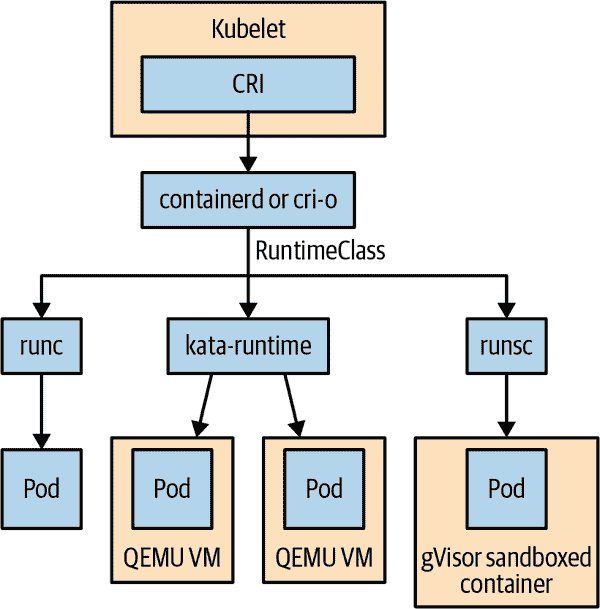

# 第十章：Pod 和容器安全

当涉及通过 Kubernetes API 实现 Pod 安全时，您有两个主要选项可供选择：Pod 安全准入和 RuntimeClass。在本章中，我们将审查每个 API 的目的和用途，并提供其最佳实践。

# Pod 安全准入控制器

此全集群资源创建一个统一的地方，用于定义和管理 Pod 规范中的所有安全敏感字段。在创建 Pod 安全准入资源之前，集群管理员和/或用户使用的是 PodSecurityPolicy，这是一个复杂的设置，可能难以正确设置。在 PodSecurityPolicy 之前，用户需要独立地为其工作负载中的每个 Pod 或部署定义个别的 `SecurityContext` 设置，或者在集群上启用定制的准入控制器来强制执行一些 Pod 安全性方面的规则。

###### 注意

Pod 安全准入控制器从 Kubernetes 1.22 开始取代了 Beta 版 PodSecurityPolicy API。PodSecurityPolicy 在 Kubernetes 1.25 中被移除。Pod 安全准入提供了一个简化的 API 来保护 Pod，但它不提供与 PodSecurityPolicy 的完全功能对等。要实现完全的策略功能对等，您需要安装一个更完整的策略解决方案，如 [Gatekeeper](https://oreil.ly/0lVJP) 项目。

Pod 安全准入是为了解决这种复杂性，并且让集群管理员能够相对轻松地保护其集群上的 Pod。虽然比其他解决方案复杂度低，但 Pod 安全准入也有显著的局限性，即它具有在命名空间级别应用的粗粒度权限。尽管您可以豁免特定用户或运行时类别免受策略强制执行，但您无法在命名空间内为不同的 Pod 或用户启用不同级别的安全性。

由于这些限制，许多企业或运行多租户集群的管理员可能需要实施类似 [Gatekeeper](https://oreil.ly/0lVJP) 项目的策略解决方案。但对于许多较小的单租户集群来说，Pod 安全准入控制可能更为合适。

## 启用 Pod 安全准入

如果您的集群是 Kubernetes 1.22 或更新版本，那么可能已经启用了 Pod 安全准入。您可以使用 `kubectl version` 命令检查集群的版本。如果您正在运行较旧版本的 Kubernetes，我们建议更新，因为这些较旧版本已不再由 Kubernetes 项目积极支持，这将使您面临未修补的安全漏洞风险。

###### 警告

在现有集群上启用 Pod 安全准入控制时需要谨慎，因为如果一开始没有充分的准备，它有可能会阻塞工作负载。考虑从 `warn` 和 `audit` 强制模式开始，以确保您的策略按预期工作。

## Pod 安全级别

Pod 安全准入控制器通过实施三种不同的策略级别简化了安全配置，供管理员选择。每个安全级别包含一组不同的规则，用于限制 Pod 配置。安全级别的详细信息可以在[Kubernetes 文档](https://oreil.ly/3bKXr)中找到。

三种 Pod 安全标准级别为：

`privileged`

事实上没有任何限制。它与未启用 Pod 安全的 Kubernetes 集群的默认行为相匹配。

`baseline`

防止已知的特权升级和其他安全问题。

`restricted`

Pod 安全的当前社区最佳实践。

在开始使用策略时，可能会急于立即对所有命名空间强制执行`restricted`级别，但需要注意，集群中的现有配置可能会中断，并且社区解决方案或其他第三方提供的软件可能无法正常工作。

除了安全级别外，Pod 安全准入控制器还提供了三种策略激活级别。`enforce`级别会主动阻止不符合安全级别的 Pod 创建。`warn`级别会向用户发出警告，指出其 Pod 违反了策略，但不会阻止创建。`audit`级别记录策略违规情况，但不会向用户提供反馈。

最后，每个安全级别都与特定的 Kubernetes 版本（例如，`v1.25`）相对应。需要注意的是，虽然安全级别与 Kubernetes 版本关联，但在其他 Kubernetes 版本中也可用：你可以在 Kubernetes 1.26 集群中使用`v1.25`安全级别。这些版本遵循与任何其他 Kubernetes 组件相同的三版本弃用策略。还有一个`latest`版本，跟踪最新的策略。但是，与使用容器镜像中的`latest`相同，这是不鼓励的，因为当集群升级时，你的安全策略将发生变化，这意味着通过意外采用新策略可能会破坏集群。相反，在集群升级后逐步升级安全策略是最佳实践。

###### 注意

需要注意的是，`warn`级别仅在支持警告的工具（如`kubectl`）中提供警告。如果使用其他工具进行部署，特别是 CI/CD 自动化工具，则可能不会向用户显示警告。在这种情况下，你可能需要结合某种检查配置的 linter，以及 Pod 安全审计。

## 使用命名空间标签激活 Pod 安全时

Pod 安全的激活是通过为命名空间添加标签来完成的。你可以在命名空间的 YAML 中添加标签，如下例所示。我们将从一个简单的配置开始，仅在基线安全级别下审核现有用法：

```
...
  metadata:
    labels:
      # Start with enforce and warn unrestricted so as not to
      # interfere with existing users
      pod-security.kubernetes.io/enforce: privileged
      pod-security.kubernetes.io/enforce-version: v1.25
      pod-security.kubernetes.io/warn: privileged
      pod-security.kubernetes.io/warn-version: v1.25

      # Turn on baseline auditing
      pod-security.kubernetes.io/audit: baseline
      pod-security.kubernetes.io/audit-version: v1.25
```

应用此配置到所有命名空间后，您将开始在集群审计日志中看到审计信息。这将让您了解集群的合规水平。如果您的集群严重不合规，您可能需要识别各种工作负载的所有者，并与他们合作，使其工作负载达到合规性。由于执行是按命名空间进行的，您可以逐个团队进行工作，并在其工作负载符合合规性时转向执行。

最终，您的最终安全姿态取决于您的团队及其工作负载，因此很难确定单一的最佳 Pod 安全配置实践。然而，对于大多数用户来说，将`audit`设置为`restricted`，`warn`设置为`enforce`是一个不错的起点。这将使您能够查看潜在的漏洞配置，同时启用执行以防止最严重的违规行为。

# 工作负载隔离和 RuntimeClass

容器运行时仍然被普遍认为是一个不安全的工作负载隔离边界。目前最常见的运行时是否会被认为是安全的，尚无明确的路径。行业内对 Kubernetes 的动力和兴趣促使了不同容器运行时的发展，它们提供不同级别的隔离。有些基于熟悉和值得信赖的技术堆栈，而另一些则是解决问题的全新尝试。像 Kata 容器、gVisor 和 Firecracker 这样的开源项目宣称具有更强的工作负载隔离能力。这些特定项目要么基于嵌套虚拟化（在虚拟机内运行超轻量级虚拟机），要么基于系统调用过滤和服务。最近还对 WebAssembly 虚拟机提供的沙箱产生了兴趣，它最初是为浏览器而构建的，但在服务器端的使用越来越多。其中，`containerd` 项目，作为最受欢迎的容器运行时之一，现在支持基于 WebAssembly（WASM）的容器。此外，可能需要 RuntimeClass 来选择基于特定硬件能力的容器运行时，例如与 GPU 交互用于人工智能和机器学习工作负载。

引入这些提供不同工作负载隔离的容器运行时允许用户在同一集群中根据其隔离保证选择不同的运行时。例如，您可以在同一集群中使用不同的容器运行时运行可信和不可信的工作负载。

RuntimeClass 被引入 Kubernetes 作为一个 API，允许选择容器运行时。当集群由集群管理员配置时，它用于表示集群上支持的容器运行时之一。作为 Kubernetes 用户，您可以通过在 Pod 规范中使用 RuntimeClassName 来为您的工作负载定义特定的运行时类别。在底层实现方式是，RuntimeClass 指定了一个`RuntimeHandler`，该 Handler 被传递给容器运行时接口（CRI）来实现。然后可以使用节点标签或节点污点与节点选择器或容忍性结合使用，以确保工作负载落在能够支持所需 RuntimeClass 的节点上。Figure 10-1 演示了 kubelet 在启动 Pod 时如何使用 RuntimeClass。



###### 图 10-1。`RuntimeClass`流程图

## 使用 RuntimeClass

如果集群管理员设置了不同的 RuntimeClasses，则可以通过在 Pod 规范中指定`runtimeClassName`来使用它们；例如：

```
apiVersion: v1
kind: Pod
metadata:
  name: nginx
spec:
  runtimeClassName: firecracker
```

## 运行时实现

以下是一些开源容器运行时实现，它们提供不同级别的安全性和隔离性供您参考。此列表旨在作为指南，并非详尽无遗：

[CRI containerd](https://oreil.ly/1wxU1)

一个 API 外观，专注于简单性，健壮性和可移植性的容器运行时。

[cri-o](https://oreil.ly/OiXpP)

一个基于 Open Container Initiative（OCI）的轻量级容器运行时的专用实现，用于 Kubernetes。

[Firecracker](https://oreil.ly/on3Ge)

基于基于内核的虚拟机（KVM）构建，这种虚拟化技术允许您在非虚拟化环境中非常快速地启动微型 VM，同时利用传统 VM 的安全性和隔离性。

[gVisor](https://oreil.ly/ZZt3n)

一个兼容 OCI 的沙箱运行时，使用新的用户空间内核来运行容器，提供低开销和安全、隔离的容器运行时。

[Kata Containers](https://oreil.ly/giOxk)

通过运行轻量级 VM 感觉和操作像容器的轻量级 VM 来提供类似 VM 的安全性和隔离性的安全容器运行时。

## 工作负载隔离和 RuntimeClass 最佳实践

以下最佳实践将帮助您避免常见的工作负载隔离和 RuntimeClass 陷阱：

+   通过 RuntimeClass 实现不同的工作负载隔离环境会使您的操作环境变得复杂。这意味着鉴于它们提供的隔离性质，工作负载可能在不同的容器运行时之间不可移植。理解不同运行时支持功能矩阵可能很复杂，并且会导致用户体验不佳。如果可能的话，我们建议使用单一运行时的单独集群，以避免混淆。

+   工作负载隔离并不意味着安全的多租户。即使您可能已经实施了安全的容器运行时，这并不意味着 Kubernetes 集群和 API 以相同方式已经得到保护。您必须考虑 Kubernetes 端到端的总表面积。仅仅因为您有一个隔离的工作负载，并不意味着它不能通过 Kubernetes API 被不良行为者修改。

+   不同运行时的工具集不一致。您可能有用户依赖于容器运行时的工具进行调试和内省。拥有不同的运行时意味着您可能无法再运行`docker ps`来列出运行中的容器。这会在故障排除时导致混淆和复杂化。

# 其他 Pod 和容器安全考虑

除了 Pod 安全准入控制和工作负载隔离之外，以下是一些处理 Pod 和容器安全性时您可能考虑的其他工具。

## 准入控制器

之前讨论的 Pod 安全准入控制是由 Pod 安全准入控制器提供支持的，但在云原生生态系统中还有许多其他准入控制器可供选择。如果您认为 Pod 安全准入控制器过于限制，许多其他选项提供了更复杂的策略解决方案。有关准入控制的更多信息，请参阅第十七章。

## 入侵和异常检测工具集

我们已经涵盖了安全策略和容器运行时，但当您希望在容器运行时内部检查和执行策略时会发生什么？有一些开源工具可以实现这一点及更多功能。它们通过监听和过滤 Linux 系统调用或利用伯克利数据包过滤器（BPF）来运行。其中一个工具是[Falco](https://oreil.ly/9KOeg)，这是一个云原生计算基金会（CNCF）项目，作为 DaemonSet 安装，允许您在执行过程中配置和执行策略。Falco 只是一种方法。我们鼓励您探索这个领域的工具，看看哪种适合您。

# 概要

在本章中，我们深入探讨了 Pod 安全准入控制和 RuntimeClass API，您可以使用这些工具为您的工作负载配置粒度级别的安全性。我们还查看了一些开源生态系统工具，可以用于监视和执行容器运行时内的策略。我们为您提供了详尽的概述，以便您做出关于提供最适合您工作负载需求的安全级别的知情决策。
