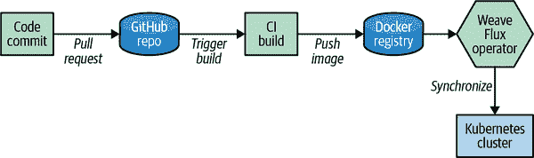

# 第十二章：管理多个集群

在本章中，我们讨论了管理多个 Kubernetes 集群的最佳实践。我们深入探讨了多集群管理与联邦之间的区别、管理多个集群的工具以及管理多个集群的操作模式的细节。

你可能会想为什么需要多个 Kubernetes 集群。Kubernetes 被设计为将许多工作负载整合到一个单一集群中，是吗？这是正确的，但有些场景可能需要多个集群，比如跨区域的工作负载、爆炸半径的考虑、合规性和特定的工作负载。

我们讨论了这些场景，并探讨了在 Kubernetes 中管理多个集群的工具和技术。

# **为什么需要多个集群？**

当采用 Kubernetes 时，你可能会拥有多个集群，甚至可能从一开始就分别部署生产环境、暂存环境、用户验收测试（UAT）或开发环境。Kubernetes 提供了一些多租户特性，如命名空间，这是将集群分割成较小逻辑结构的一种方式。命名空间允许你定义基于角色的访问控制（RBAC）、配额、Pod 安全策略和网络策略，以实现工作负载的分离。这是分隔多个团队和项目的好方法，但在决定使用多集群架构还是单一集群架构时，需要考虑其他问题：

+   **爆炸半径**

+   **合规性**

+   **安全性**

+   **硬多租户**

+   **基于区域的工作负载**

+   **特定的工作负载**

在思考架构时，*爆炸半径*应当置于首位。这是我们在设计多集群架构时看到的主要问题之一。在微服务架构中，我们采用断路器、重试、隔舱和速率限制来限制系统的损害范围。你应当在基础架构层面设计相同的机制，多集群可以帮助防止由软件问题导致的级联故障影响。例如，如果你有一个集群为 500 个应用提供服务，而且遇到平台问题，将会导致这 500 个应用全部受到影响。如果这些 500 个应用分布在五个集群中，当你遇到平台层面的问题时，只会影响到 20%的应用。然而，这样做的不利之处在于你需要管理五个集群，而且聚合比率不如单一集群好。Dan Woods 撰写了一篇出色的[文章](https://oreil.ly/YnGUD)，详细描述了在生产 Kubernetes 环境中的实际级联故障。这是一个很好的例子，说明为什么你应当考虑在较大的环境中采用多集群架构。

*合规性*是多集群设计的另一个关注点，因为对于 PCI（付款卡行业）、HIPAA（健康保险便携性和责任）和其他工作负载，有特殊的考虑因素。 Kubernetes 确实提供了一些多租户功能，但这些工作负载如果与通用目的工作负载隔离，可能更容易管理。这些符合规定的工作负载可能具有关于安全加固、非共享组件或专用工作负载需求的具体要求。与将集群视为如此专业化的处理相比，将这些工作负载分开要容易得多。

在大型 Kubernetes 集群中，*安全性*可能变得难以管理。当您开始将更多团队引入 Kubernetes 集群时，每个团队可能具有不同的安全需求，满足这些需求在大型多租户集群中可能变得非常困难。即使在单个集群中管理 RBAC、网络策略和 Pod 安全策略也可能在规模化时变得困难。对网络策略的小改动可能会无意中为集群的其他用户打开安全风险。通过多个集群，您可以限制由于配置错误而带来的安全影响。如果您决定较大的 Kubernetes 集群符合您的要求，那么请确保您有非常好的操作过程来进行安全更改，并且了解对 RBAC、网络策略和 Pod 安全策略进行更改的影响范围。

Kubernetes 并不提供*硬多租户*，因为它与集群中所有工作负载共享相同的 API 边界。使用命名空间可以实现良好的软多租户，但不足以保护集群内的恶意工作负载。对于许多用户来说，硬多租户并不是必需的；他们信任将在集群内运行的工作负载。如果您是云提供商、托管基于软件即服务（SaaS）的软件或托管不受信任的工作负载和不受信任的用户控制，则通常需要硬多租户。

###### 注意

Kubernetes 项目确实通过虚拟集群来解决硬多租户问题，超出了本书的范围。在[项目的 GitHub 页面](https://oreil.ly/KlFlK)上可以找到更多信息。

当运行需要从区域端点提供流量的工作负载时，您的设计将包括基于每个区域的多个集群。当您拥有全球分布的应用程序时，在那时运行多个集群就成为必要条件。当您有需要*区域分布*的工作负载时，使用多个集群的集群联合是一个非常好的用例，我们将在本章后面进一步探讨此问题。

*专业工作负载*，例如高性能计算（HPC）、机器学习（ML）和网格计算，也需要在多集群架构中加以考虑。这些类型的专业工作负载可能需要特定类型的硬件，具有独特的性能配置文件，并且集群的用户也可能是专业化的。我们发现这种用例在设计决策中不太常见，因为拥有多个 Kubernetes 节点池可以帮助解决专用硬件和性能配置文件问题。当您需要一个非常大的集群用于 HPC 或机器学习工作负载时，您应该考虑专门为这些工作负载分配集群。

使用多集群，您可以免费获得隔离，但也有设计方面的问题需要在开始时解决。

# 多集群设计的关注点

在选择多集群设计时，会遇到一些挑战。其中一些挑战可能会阻止您尝试多集群设计，因为这种设计可能会使架构过于复杂化。我们发现用户常遇到的一些常见挑战包括：

+   数据复制

+   服务发现

+   网络路由

+   运营管理

+   持续部署

*数据复制*和一致性一直是在跨地理区域和多个集群部署工作负载的关键。在运行这些服务时，您需要决定何处运行以及开发复制策略。大多数数据库都有内置工具来执行复制，但您需要设计应用程序以处理复制策略。对于 NoSQL 类型的数据库服务来说，这可能更容易，因为它们可以处理跨多个实例的扩展，但您仍然需要确保您的应用程序可以处理跨地理区域的最终一致性，或者至少处理区域之间的延迟。一些云服务，例如 Google Cloud Spanner 和 Microsoft Azure CosmosDB，提供了建立在多个地理区域处理数据复杂性的数据库服务。

每个 Kubernetes 集群都部署自己的*服务发现*注册表，并且注册表在多个集群之间不同步。这使得应用程序难以轻松识别和发现彼此。诸如 HashiCorp 的 Consul 之类的工具可以透明地同步来自多个集群甚至在 Kubernetes 之外的服务。其他工具如 Istio、Linkerd 和 Cilium 正在构建多集群架构，以扩展集群之间的服务发现。

Kubernetes 使得在集群内部进行网络工作变得非常简单，因为它是一个扁平网络，并且避免使用网络地址转换（NAT）。如果需要在集群内外路由流量，则这变得更加复杂。对集群的入口实施为将入口与集群的 1:1 映射，因为它不支持具有 Ingress 资源的多集群拓扑。您还需要考虑集群间出口流量的路由。当应用程序位于单个集群内时，这很容易，但在引入多集群时，您需要考虑服务的额外跳跃的延迟。对于具有紧密耦合依赖关系的应用程序，应考虑在同一集群内运行这些服务，以消除延迟和额外的复杂性。

管理多集群的最大开销之一是*运营管理*。不再是管理和保持一两个一致的集群，你可能需要在你的环境中管理多个集群。管理多集群的最重要的方面之一是确保你有良好的自动化实践，因为这将有助于减少运营负担。在自动化你的集群时，你需要考虑基础设施部署和管理集群的附加功能。对于管理基础设施来说，使用像 HashiCorp 的 Terraform 这样的工具可以帮助部署和管理跨多个集群的一致状态。

使用像 Terraform 这样的*基础设施即代码*（IaC）工具将使您获得部署集群的可重复方法的好处。另一方面，您还需要能够一致地管理集群的附加功能，例如监视、日志记录、入口、安全性和其他工具。安全性是运营管理的另一个重要方面，您必须能够在集群间维护安全策略、RBAC 和网络策略。本章后面我们将更深入地探讨使用自动化来维护一致的集群。

随着多个集群和持续交付（CD），现在您需要处理多个 Kubernetes API 端点与单个 API 端点之间的差异。这可能会在应用程序分发中带来挑战。您可以轻松地管理多个流水线，但假设您有一百个不同的流水线需要管理，则应用程序分发将变得非常困难。考虑到这一点，您需要考虑不同的方法来管理这种情况。我们稍后在本章中会探讨帮助管理此问题的解决方案。

# 管理多集群部署

在管理多集群部署时，您希望采取的第一步之一是使用像 Terraform 这样的 IaC 工具设置部署。其他部署工具，如 kubespray、kops 或其他特定于云提供商的工具，都是有效的选择，但更重要的是使用一个允许您为可重复性进行源代码控制的工具。

自动化是成功管理环境中多个集群的关键。您可能无法在第一天就自动化所有内容，但您应该优先考虑自动化集群部署和操作的所有方面。

一个有趣的项目是[Kubernetes Cluster API](https://oreil.ly/edzIa)，这是一个将声明式、Kubernetes 风格的 API 引入集群创建、配置和管理的 Kubernetes 项目。它在核心 Kubernetes 之上提供了可选的附加功能。Cluster API 通过一个共同的 API 提供了集群级配置，这将使您能够轻松自动化和构建围绕集群自动化的工具。Cluster API 目前仍处于早期阶段，但这是一个值得关注的项目。

# 部署和管理模式

Kubernetes 操作员作为*基础设施即代码*概念的实现引入。使用它们允许您在 Kubernetes 集群中抽象应用程序和服务的部署。例如，假设您想要在监视 Kubernetes 集群时标准化为 Prometheus。您需要为每个集群和团队创建和管理各种对象（部署、服务、入口等）。您还需要维护 Prometheus 的基本配置，如版本、持久性、保留策略和副本。可以想象，在大量集群和团队中维护这样的解决方案可能会很困难。

您可以安装`prometheus-operator`而不是处理如此多的对象和配置。这扩展了 Kubernetes API，暴露了多个名为`Prometheus`、`ServiceMonitor`、`PrometheusRule`和`AlertManager`的新对象种类，允许您仅使用几个对象指定 Prometheus 部署的所有细节。您可以使用`kubectl`工具管理这些对象，就像管理任何其他 Kubernetes API 对象一样。

图 12-1 展示了`prometheus-operator`的架构。


###### 图 12-1\. `prometheus-operator` 架构

利用*Operator*模式来自动化关键操作任务可以帮助提高整体集群管理能力。Operator 模式由 CoreOS 团队在 2016 年引入，使用 etcd 操作员和`prometheus-operator`。Operator 模式建立在两个概念之上：

+   自定义资源定义

+   自定义控制器

*自定义资源定义*（CRDs）是允许您根据您定义的自己的 API 扩展 Kubernetes API 的对象。

*自定义控制器*基于核心 Kubernetes 资源和控制器的概念构建。自定义控制器允许您通过监视来自 Kubernetes API 对象（如命名空间、部署、Pod 或您自己的 CRD）的事件来构建自己的逻辑。通过自定义控制器，您可以以声明性方式构建您的 CRD。如果考虑到 Kubernetes 部署控制器如何在协调循环中始终维护部署对象的状态来维护其声明状态，这也为您的 CRD 带来了控制器的同样优势。

在使用操作员模式时，您可以将操作工具中需要执行的操作自动化到多集群中。让我们以[Elasticsearch 操作员](https://oreil.ly/9WvJQ)为例。Elasticsearch 操作员可以执行以下操作：

+   主、客户端和数据节点的副本

+   高可用部署的区域

+   主节点和数据节点的卷大小

+   调整集群大小

+   Elasticsearch 集群备份的快照

如您所见，操作员为您管理 Elasticsearch 时提供了自动化，例如自动快照备份和调整集群大小。这种方法的美妙之处在于您通过熟悉的 Kubernetes 对象来管理一切。

考虑如何在您的环境中利用不同的操作员，如`prometheus-operator`，以及如何构建您自己的自定义操作员来卸载常见的运维任务。

# 管理集群的 GitOps 方法

*GitOps*被 Weaveworks 团队推广开来，其理念和基础是基于他们在生产中运行 Kubernetes 的经验。GitOps 将软件开发生命周期的概念应用到运维中。通过 GitOps，您的 Git 仓库成为了事实来源，而您的集群则与配置好的 Git 仓库同步。例如，如果您更新了一个 Kubernetes 部署清单，这些配置变更会自动反映在集群状态中。

通过使用这种方法，您可以更容易地维护一致的多集群，并避免整个设备组中的配置漂移。GitOps 允许您声明性地描述多个环境的集群，并努力维护集群的状态。GitOps 的实践可以应用于应用程序交付和运维，但在本章中，我们专注于使用它来管理集群和运维工具。

Weaveworks Flux 是最早支持 GitOps 方法的工具之一，也是我们在本章剩余部分将使用的工具。在云原生生态系统中发布了许多新工具值得关注，例如来自 Intuit 团队的 Argo CD，它也被广泛采用了 GitOps 方法。

我们将深入探讨在第十八章中利用 GitOps 模型的方法，但以下内容快速概述了利用 GitOps 管理集群的好处。

图 12-2 呈现了 GitOps 工作流程的表示。



###### 图 12-2\. GitOps 工作流程

因此，让我们在您的集群中设置 Flux，并将一个存储库同步到集群中：

```
git clone https://github.com/weaveworks/flux
cd flux
```

现在您需要更改部署清单，以配置它使用您从第五章分叉的存储库。 修改部署文件中的以下行以匹配您的分叉 GitHub 存储库：

```
vim deploy/flux-deployment.yaml
```

使用您的 Git 存储库修改以下行：

```
--git-url=git@github.com:weaveworks/flux-get-started
  (ex. --git-url=git@github.com:your_repo/kbp )
```

现在，继续在您的集群中部署 Flux：

```
kubectl apply -f deploy
```

当 Flux 安装时，它会创建一个 SSH 密钥，以便可以使用 Git 存储库进行身份验证。 使用 Flux 命令行工具检索 SSH 密钥，以便您可以配置访问您的分叉存储库； 首先，您需要安装`fluxctl`。

对于 macOS：

```
brew install fluxctl
```

对于 Linux Snap 软件包：

```
snap install fluxctl
```

对于所有其他软件包，您可以在[这里找到最新的二进制文件](https://oreil.ly/4TAx5)：

```
fluxctl identity
```

打开 GitHub，导航到您的分叉版本，转到“设置”>“部署密钥”，点击“添加部署密钥”，给它一个标题，选择“允许写访问”复选框，粘贴 Flux 公钥，然后点击“添加密钥”。 更多关于如何管理部署密钥的信息，请参见[GitHub 文档](https://oreil.ly/Oet57)。

现在，如果您查看 Flux 日志，您应该会看到它正在与您的 GitHub 存储库同步：

```
kubectl -n default logs deployment/flux -f
```

在您看到它与您的 GitHub 存储库同步后，您应该会看到创建了 Elasticsearch、Prometheus、Redis 和前端 Pods：

```
kubectl get pods -w
```

通过这个例子完成后，您应该能够看到如何轻松地将您的 GitHub 存储库状态与 Kubernetes 集群同步。 这使得管理集群中的多个操作工具变得更加容易，因为多个集群可以与单个存储库同步，并且您避免了拥有雪花集群的情况。

# 多集群管理工具

在处理多个集群时，使用`kubectl`可能会立即变得令人困惑，因为您需要设置不同的上下文来管理不同的集群。 处理多个集群时，您需要立即安装的两个工具是*kubectx*和*kubens*，它们允许您轻松在多个上下文和命名空间之间切换。

当您需要一个完整的多集群管理工具时，Kubernetes 生态系统中有一些工具可以用来管理多个集群。 以下是一些较受欢迎工具的摘要：

[牧场主](https://oreil.ly/8qGNh)

Rancher 在一个集中管理的用户界面中集中管理多个 Kubernetes 集群。它监控、管理、备份和恢复跨本地、云和托管 Kubernetes 设置中的 Kubernetes 集群。它还提供了控制跨多个集群部署的应用程序和运维工具。

[开放集群管理](https://oreil.ly/HUv5k) (OCM)

OCM 是一个专注于 Kubernetes 应用程序的多集群和多云场景的社区驱动项目。它提供集群注册、工作负载分发以及策略和工作负载的动态放置。

[Gardener](https://oreil.ly/fElD5)

Gardener 采用了不同的多集群管理方法，它利用 Kubernetes 原语为最终用户提供 Kubernetes 即服务。它支持所有主要的云供应商，并由 SAP 的工作人员开发。该解决方案面向构建 Kubernetes 即服务的用户。

# Kubernetes 联邦

Kubernetes 在 Kubernetes 1.3 中首次引入了 Federation v1，后来由于 Federation v2 的出现而被弃用。Federation v1 的初衷是帮助将应用程序分发到多个集群。Federation v1 是利用 Kubernetes API 构建的，并且在设计中大量依赖于 Kubernetes 注解，这在设计上带来了一些问题。设计紧密耦合于核心 Kubernetes API，使得 Federation v1 相当单片化。当时的设计决策可能不是坏选择，但它们是基于当时可用的原语构建的。Kubernetes CRD 的引入允许以不同的方式思考 Federation 的设计。

# 管理多个集群的最佳实践

在管理多个 Kubernetes 集群时，请考虑以下最佳实践：

+   限制您的集群爆炸半径，以确保级联故障不会对应用程序造成更大的影响。

+   如果您拥有 PCI、HIPPA 或 HiTrust 等监管问题，请考虑利用多集群来简化将这些工作负载与普通工作负载混合的复杂性。

+   如果硬多租户是业务需求，则应将工作负载部署到专用集群。

+   如果您的应用程序需要多个区域，请利用全局负载均衡器来管理集群之间的流量。

+   您可以将专业的工作负载（例如 HPC）拆分为其自己的独立集群，以确保满足工作负载的专门需求。

+   如果您部署的工作负载将分布在多个区域数据中心，请首先确保有工作负载的数据复制策略。跨区域的多个集群可以很容易，但是跨区域复制数据可能会很复杂，因此确保有处理异步和同步工作负载的可靠策略。

+   利用 Kubernetes 操作者，如`prometheus-operator`或 Elasticsearch 操作者来处理自动化运维任务。

+   当设计您的多集群策略时，还需考虑如何在集群之间实现服务发现和网络互联。像 HashiCorp 的 Consul 或 Istio 这样的服务网格工具可以帮助跨集群进行网络互联。

+   确保您的持续交付策略能够处理区域或多集群之间的多次部署。

+   调查利用 GitOps 方法来管理多个集群操作组件，以确保所有集群在整个集群中保持一致性。GitOps 方法并不适用于每个环境，但您至少应该调查一下，以减轻多集群环境的操作负担。

# 摘要

在本章中，我们讨论了管理多个 Kubernetes 集群的不同策略。在开始时考虑您的需求及这些需求是否符合多集群拓扑结构是非常重要的。首先要考虑的情况是，您是否真正需要*硬*多租户性能，因为这将自动要求采用多集群策略。如果不需要，考虑您的合规需求以及是否有操作能力来承担多集群架构的额外开销。最后，如果您选择更多、更小的集群，请确保自动化它们的交付和管理，以减少操作负担。
