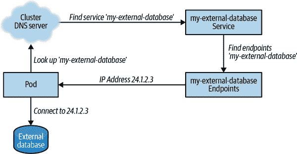
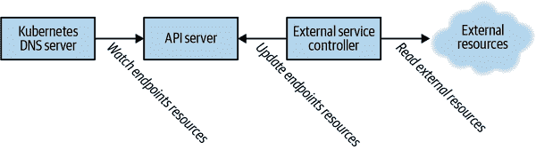
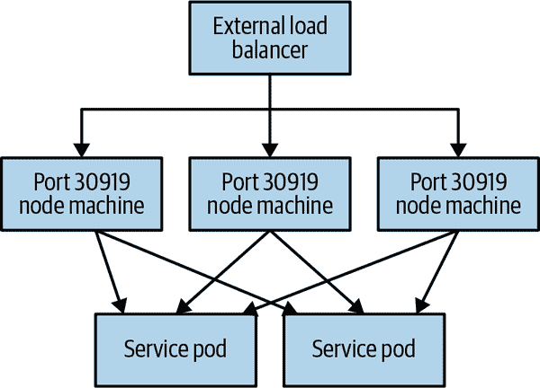

# 第十三章：将外部服务与 Kubernetes 集成

在本书的许多章节中，我们讨论了如何在 Kubernetes 中构建、部署和管理服务。然而，事实是系统并不孤立存在，我们构建的大多数服务都需要与 Kubernetes 集群之外的系统和服务进行交互。这可能是因为我们正在构建新服务，这些服务由运行在虚拟或物理机器上的遗留基础设施访问。此外，这也可能是因为我们构建的服务需要访问运行在本地数据中心物理基础设施上的现有数据库或其他服务。最后，您可能有多个 Kubernetes 集群，这些服务需要互联互通。因此，能够公开、共享并构建跨越 Kubernetes 集群边界的服务是构建现实应用程序的重要组成部分。

# 将服务导入 Kubernetes

将 Kubernetes 与外部服务连接的最常见模式是通过 Kubernetes 服务来消费存在于 Kubernetes 集群外部的服务。通常情况下，这是因为 Kubernetes 被用于新应用开发或作为与传统资源（如本地数据库）接口的服务。在许多现有应用程序中，应用程序的某些部分比其他部分更容易移动。例如，出于数据治理、合规性或业务连续性的原因，具有关键数据的数据库可能需要保留在本地。同时，在 Kubernetes 中为这些传统数据库构建新接口也有显著的好处。如果每次迁移到 Kubernetes 都需要整个应用程序的搬迁，那么许多应用程序可能会永远停留在其传统实现上。相反，本章展示了如何将新应用程序的云原生开发与现有服务（如可能运行在传统虚拟机、裸机服务器甚至大型机上的数据库）集成。

当我们考虑将外部服务从 Kubernetes 中访问时，第一个挑战就是确保网络能够正常工作。使网络操作起来的具体细节与数据库的位置以及 Kubernetes 集群的位置有关。因此，它们超出了本书的范围，但通常情况下，基于云的 Kubernetes 提供商可以将集群部署到用户提供的虚拟网络（VNET）中，然后这些虚拟网络可以与本地网络进行互联。

当您在 Kubernetes 集群中的 Pod 与本地资源之间建立了网络连接之后，下一个挑战是使外部服务看起来和感觉像是 Kubernetes 服务的一部分。在 Kubernetes 中，服务发现通过域名系统（DNS）查找进行，因此，要使我们的外部数据库感觉像是 Kubernetes 的一个本地部分，我们需要在相同的 DNS 中使数据库可发现。接下来我们将详细讨论如何做到这一点。

## 用于稳定 IP 地址的无选择器服务

实现这一点的第一种方法是使用*无选择器*的 Kubernetes 服务。当您创建一个没有选择器的 Kubernetes 服务时，不存在与虚构服务选择器匹配的 Pod，因此不会执行负载平衡。相反，您可以将这种无选择器服务编程为具有您想要添加到 Kubernetes 集群的外部资源的特定 IP 地址的端点。这样，当 Kubernetes Pod 查找 `your-database` 时，内置的 Kubernetes DNS 服务器将把它翻译为您外部服务的服务 IP 地址。以下是一个用于外部数据库的无选择器服务示例：

```
apiVersion: v1
kind: Service
metadata:
  name: my-external-database
spec:
  ports:
  - protocol: TCP
    port: 3306
    targetPort: 3306
```

当服务存在时，您需要更新其端点以包含提供 `24.1.2.3` 的数据库 IP 地址。

```
apiVersion: v1
kind: Endpoints
metadata:
  # Important! This name has to match the Service.
  name: my-external-database
subsets:
  - addresses:
      - ip: 24.1.2.3
    ports:
      - port: 3306
```

图 13-1 描述了如何在 Kubernetes 中集成服务。正如您所见，Pod 会像对待任何其他 Kubernetes 服务一样在集群 DNS 服务器中查找服务。但是，与其给出 Kubernetes 集群中另一个 Pod 的 IP 地址不同，它会给出一个对应于 Kubernetes 集群外部资源的 IP 地址。通过这种方式，开发人员甚至可能不知道服务是在集群外部实现的。



###### 图 13-1\. 服务集成

## 用于稳定 DNS 名称的基于 CNAME 的服务

前面的例子假定您试图将外部资源集成到 Kubernetes 集群中，并具有稳定的 IP 地址。尽管物理本地资源通常如此，这在网络拓扑结构可能不总是正确。在虚拟机（VM）IP 地址更动态的云环境中，这通常不是真的。或者，服务可能有多个副本坐落在单一基于 DNS 的负载均衡器后面。在这些情况下，您尝试桥接到集群中的外部服务没有稳定 IP 地址，但它确实有一个稳定的 DNS 名称。

对于这些情况，您可以定义基于 CNAME 的 Kubernetes 服务。如果您对 DNS 记录不熟悉，CNAME 或 *规范名称* 记录指示特定的 DNS 地址应翻译为不同的 *规范* DNS 名称。例如，对于包含 *bar.com* 的 *foo.com* 的 CNAME 记录表示，任何查询 *foo.com* 的人应执行递归查找 *bar.com* 以获取正确的 IP 地址。您可以使用 Kubernetes 服务在 Kubernetes DNS 服务器中定义 CNAME 记录。例如，如果您有一个外部数据库，其 DNS 名称为 *database.myco.com*，您可以创建一个名为 `myco-database` 的 CNAME *服务*。这样的服务如下所示：

```
kind: Service
apiVersion: v1
metadata:
  name: myco-database
spec:
  type: ExternalName
  externalName: database.myco.com
```

使用这种方式定义的服务，任何对 `myco-database` 的查询都将递归解析为 *database.myco.com*。当然，为使此功能生效，您的外部资源的 DNS 名称 *也* 需要能够从 Kubernetes DNS 服务器解析。如果 DNS 名称是全球可访问的（例如来自知名的 DNS 服务提供商），这将自动生效。然而，如果外部服务的 DNS 位于公司内部的 DNS 服务器中（例如仅服务内部流量的 DNS 服务器），Kubernetes 集群可能默认不知道如何解析对此公司 DNS 服务器的查询。

要将集群的 DNS 服务器设置为与备用 DNS 解析器通信，您需要调整其配置。这可以通过更新 Kubernetes ConfigMap 中的 DNS 服务器配置文件来完成。

CNAME 记录是一种有用的方式，可将具有稳定 DNS 名称的外部服务映射到在集群内可发现的名称。一开始，将一个众所周知的 DNS 地址重新映射到集群本地 DNS 地址似乎有些违反直觉，但是所有服务看起来和感觉相同的一致性通常值得增加的少量复杂性。此外，因为 CNAME 服务与所有 Kubernetes 服务一样，是按命名空间定义的，您可以使用命名空间将相同的服务名称（例如`database`）映射到不同的外部服务（例如`canary`或`production`）。

## 基于活动控制器的方法

在一组有限的情况下，以上两种在 Kubernetes 内部暴露外部服务的方法都不可行。一般情况下，这是因为要暴露到 Kubernetes 集群内部的服务既没有稳定的 DNS 地址，也没有单一的稳定 IP 地址。在这种情况下，将外部服务暴露到 Kubernetes 集群内部变得更加复杂，但并非不可能。

要实现这一点，您需要对 Kubernetes 服务在底层如何工作有一定的了解。Kubernetes 服务由两种不同的资源组成：您无疑熟悉的 Service 资源以及代表组成服务的 IP 地址的 Endpoints 资源。在正常操作中，Kubernetes 控制器管理器根据服务中的选择器填充服务的端点。但是，如果创建一个无选择器的服务，就像第一个稳定 IP 方法一样，服务的 Endpoints 资源将不会被填充，因为没有选择 pod。在这种情况下，您需要提供控制循环来创建和填充正确的 Endpoints 资源。您需要动态查询基础设施，获取要集成到 Kubernetes 之外的服务的 IP 地址，然后使用这些 IP 地址填充您的服务端点。完成这些步骤后，Kubernetes 的机制将接管并正确地配置 DNS 服务器和 `kube-proxy`，以实现对外部服务的负载均衡。图 13-2 展示了这在实践中的完整工作方式。



###### 图 13-2\. 一个外部服务

# 从 Kubernetes 导出服务

在前一节中，我们探讨了如何将现有服务导入到 Kubernetes 中，但您可能还需要将服务从 Kubernetes 导出到现有环境。这可能是因为您有一个需要访问您正在开发的云原生基础设施中的新 API 的传统内部客户管理的遗留应用程序。或者，您可能正在构建基于微服务的新 API，但由于内部政策或监管要求，您需要与现有的传统 Web 应用程序防火墙（WAF）进行接口。无论原因是什么，能够将 Kubernetes 集群中的服务暴露给其他内部应用程序是许多应用程序的关键设计要求。

这可能是一个挑战，因为在许多 Kubernetes 安装中，pod 的 IP 地址在集群外部通常不是可路由的地址。通过像 flannel 这样的工具或其他网络提供者，建立了 Kubernetes 集群内的路由，以便在 pod 之间以及节点与 pod 之间进行通信，但是通常不会将同样的路由扩展到同一网络中的任意机器。在许多情况下，分配给 pod 的 IP 范围与企业网络的 IP 空间不同，并且路由是不可能的。此外，在云对本地连接的情况下，pod 的 IP 地址并不总是通过 VPN 或网络对等关系广告返回到本地网络。因此，设置传统应用程序与 Kubernetes pod 之间的路由是实现基于 Kubernetes 的服务导出的关键任务。

## 使用内部负载均衡器导出服务

从 Kubernetes 导出的最简单方法是使用内置的`Service`对象。如果您之前有 Kubernetes 的使用经验，毫无疑问您已经看到过如何连接云基础负载均衡器以将外部流量引导到集群中的一组 pod。但是，您可能没有意识到大多数云服务提供的是 *内部* 负载均衡器。内部负载均衡器提供了相同的功能，将虚拟 IP 地址映射到一组 pod，但该虚拟 IP 地址来自内部 IP 地址空间（例如`10.0.0.0/24`），因此仅从虚拟网络内可路由。您可以通过向服务负载均衡器的元数据字段添加特定于云的注释来激活内部负载均衡器。例如，在 Microsoft Azure 中，您需要添加`service.beta.kubernetes.io/azure-load-balancer-internal: "true"`注释。在 Amazon Web Services (AWS) 中，注释为`service.beta.kubernetes.io/aws-load-balancer-internal: 0.0.0.0/0`。您可以按照以下方式将注释放置在服务资源的`metadata`字段中：

```
apiVersion: v1
kind: Service
metadata:
  name: my-service
  annotations:
    # Replace this as needed in other environments
    service.beta.kubernetes.io/azure-load-balancer-internal: "true"
...
```

当您通过内部负载均衡器导出服务时，您会获得一个稳定的、可路由的 IP 地址，该地址在集群外的虚拟网络上可见。然后，您可以直接使用该 IP 地址或设置内部 DNS 解析来为导出的服务提供发现功能。

## 在 NodePorts 上导出服务

不幸的是，在本地安装中，无法使用基于云的内部负载均衡器。在这种情况下，使用基于 NodePort 的服务通常是一个不错的解决方案。类型为 NodePort 的服务在集群中的每个节点上导出一个监听器，该监听器将流量从节点的 IP 地址和选定的端口转发到您定义的服务中，如图 13-3 所示。



###### 图 13-3\. 基于 NodePort 的服务

下面是一个 NodePort 服务的 YAML 文件示例：

```
apiVersion: v1
kind: Service
metadata:
  name: my-node-port-service
spec:
  type: NodePort
...
```

在创建了类型为 NodePort 的服务之后，Kubernetes 会自动为该服务选择一个端口；您可以从服务中查看`spec.ports[*].nodePort`字段获取该端口。如果您希望自己选择端口，可以在创建服务时指定，但是 NodePort 必须在集群配置的范围内。该范围的默认值为端口在`30000`到`30999`之间。

当服务在此端口上暴露时，Kubernetes 的工作就完成了。要将其导出到集群外的现有应用程序中，你（或你的网络管理员）需要使其可发现。根据应用程序的配置方式，你可能能够为应用程序提供 `${node}:${port}` 对的列表，并且应用程序将执行客户端负载平衡。或者，你可能需要在网络中配置一个物理或虚拟负载均衡器，以将流量从虚拟 IP 地址引导到这些 `${node}:${port}` 后端列表。此配置的具体细节将根据你的环境而有所不同。

## 集成外部机器和 Kubernetes

如果前面的解决方案对你都不合适，可能是因为你希望更紧密地集成动态服务发现，那么将 Kubernetes 服务暴露给外部应用程序的最终选择是直接将运行应用程序的机器集成到 Kubernetes 集群的服务发现和网络机制中。这比前面的任何方法都要更具侵入性和复杂性，你应该只在应用程序必要时使用它（这应该是很少的情况）。在某些托管的 Kubernetes 环境中，甚至可能不可行。

当将外部机器集成到集群中用于网络时，你需要确保 pod 网络路由和基于 DNS 的服务发现都能正常工作。做到这一点的最简单方法是在要加入集群的机器上运行 kubelet，但在集群中禁用调度。将 kubelet 节点加入集群超出了本书的范围，但有许多其他书籍或在线资源描述了如何实现这一点。加入节点后，你需要立即使用 `kubectl cordon ...` 命令将其标记为不可调度，以防止在其上调度任何额外的工作。这种遮挡不会阻止 DaemonSet 将 pod 定位到节点上，因此 KubeProxy 和网络路由的 pod 将定位在该机器上，并使基于 Kubernetes 的服务可被运行在该机器上的任何应用程序发现。

我们刚刚描述的方法对节点的侵入性很大，因为它需要安装 Docker 或其他容器运行时。因此，在许多环境中可能不可行。一个更轻量但更复杂的方法是在机器上仅作为进程运行 `kube-proxy`，并调整机器的 DNS 服务器。假设你可以设置 pod 路由以正确工作，运行 `kube-proxy` 将建立机器级网络，使 Kubernetes 服务的虚拟 IP 地址重新映射到组成该服务的 pod 上。如果还将机器的 DNS 更改为指向 Kubernetes 集群 DNS 服务器，那么你将有效地在不属于 Kubernetes 集群的机器上启用 Kubernetes 发现。

这两种方法都很复杂和先进，您不应该轻易采用。如果您发现自己在考虑这种服务发现集成的水平，不妨问问自己是否将要连接到集群的服务实际上可能更容易直接将服务带入集群中。我们在第十六章中有所涉及。

# 在 Kubernetes 之间共享服务

前面的章节已经描述了如何将 Kubernetes 应用连接到外部服务，以及如何连接外部服务到 Kubernetes 应用，但另一个重要的用例是连接 Kubernetes 集群**之间的**服务。这可能是为了在不同区域的 Kubernetes 集群之间实现东西向故障转移，或者可能是为了将不同团队运行的服务链接在一起。实现这种交互的过程实际上是前面章节描述的设计的结合体。

首先，您需要暴露第一个 Kubernetes 集群中的服务以启用网络流量。假设您在支持内部负载均衡器的云环境中，并且收到了内部负载均衡器的虚拟 IP 地址为 10.1.10.1\. 接下来，您需要将此虚拟 IP 地址集成到第二个 Kubernetes 集群中以启用服务发现。您可以通过与将外部应用程序导入 Kubernetes 相同的方式实现此目的（我们在“将服务导入 Kubernetes”中已经讨论过这一点）。您创建一个无选择器服务，并将其 IP 地址设置为 10.1.10.1\. 通过这两个步骤，您已经实现了在两个 Kubernetes 集群内的服务发现和连接集成。

这些步骤相当手动化，虽然对于一小部分静态服务集合来说可能可以接受，但如果你希望在集群之间实现更紧密或自动的服务集成，编写一个在两个集群中都运行的集群守护程序以执行集成操作就是合理的。该守护程序将监视第一个集群中带有特定注解的服务，比如`myco.com/exported-service`；所有带有此注解的服务将通过无选择器服务导入到第二个集群中。同样，该守护程序还会进行垃圾回收并删除已导出到第二个集群但在第一个集群中不再存在的任何服务。如果在您的每个区域集群中设置了这样的守护程序，您就可以在环境中的所有集群之间实现动态的东西向连接。

Kubernetes 项目中最近还进行了多集群服务 API 的定义工作。这项工作是实验性的，可以在 GitHub 上的 [Multi-Cluster Service](https://oreil.ly/ZXZi4) 项目中找到。在撰写本文时，该项目的实验性质意味着它可能不适合生产用例，但它展示了 Kubernetes 生态系统中多集群服务管理的未来方向。随着它从 alpha 版本到 beta 版本再到一般可用版本的推进，这种服务共享的实现将使构建跨集群微服务应用程序变得更加容易。即使在今天，像 Microsoft Azure 中的 Fleet 集群管理器等工具也开始根据用户需求实现这些多集群服务 API。

# 第三方工具

到目前为止，本章已经描述了各种导入、导出和连接 Kubernetes 集群及某些外部资源的方法。如果您之前有服务网格技术的经验，这些概念可能会非常熟悉。事实上，有许多第三方工具和项目可以用来将服务与 Kubernetes 以及任意应用程序和机器进行互联。通常，这些工具提供了很多功能，但在操作上也比之前描述的方法复杂得多。然而，如果您发现自己越来越多地构建网络互联性，应该探索服务网格的领域，这个领域正在快速迭代和发展。几乎所有这些第三方工具都有开源组件，但它们也提供商业支持，可以减少运行额外基础设施的操作开销。

# 集群与外部服务连接的最佳实践

+   在集群和本地环境之间建立网络连接。网络配置可能因不同的站点、云和集群配置而有所不同，但首先确保 Pod 能够与本地环境中的机器进行通信，反之亦然。

+   要访问集群外的服务，您可以使用无选择器服务，并直接编程输入您想要通信的机器（例如数据库）的 IP 地址。如果您没有固定的 IP 地址，您可以使用 CNAME 服务重定向到 DNS 名称。如果既没有 DNS 名称也没有固定服务，您可能需要编写一个动态操作程序，定期将外部服务 IP 地址与 Kubernetes 服务端点同步。

+   要从 Kubernetes 导出服务，请使用内部负载均衡器或 NodePort 服务。内部负载均衡器通常更易于在公共云环境中使用，可以绑定到 Kubernetes 服务本身。当这些负载均衡器不可用时，NodePort 服务可以在集群中的所有机器上公开服务。

+   通过这两种方法的组合，您可以在 Kubernetes 集群之间建立连接，将服务暴露给外部，然后在另一个 Kubernetes 集群中作为无选择器服务消费。

# 摘要

在现实世界中，并非每个应用都是云原生的。构建生产就绪的应用程序通常涉及将现有系统与新应用程序连接起来。本章描述了如何将 Kubernetes 与传统应用程序集成，以及如何集成跨多个不同 Kubernetes 集群运行的不同服务。除非您有幸能够构建全新的东西，云原生开发始终需要遗留集成。本章介绍的技术将帮助您实现这一点。
