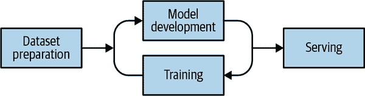
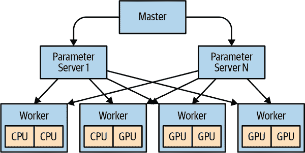

# 第十四章：在 Kubernetes 中运行机器学习

微服务时代、分布式系统和云计算为机器学习模型和工具的民主化提供了完美的环境条件。规模化基础设施现在已经成为商品化，围绕机器学习生态系统的工具正在成熟。Kubernetes 是其中之一，作为一个平台，它在开发者、数据科学家和更广泛的开源社区中变得越来越流行，成为促进机器学习工作流和生命周期的理想环境。像[GPT-4](https://oreil.ly/sGzRc)和[DALL·E](https://oreil.ly/zTWNx)这样的大型机器学习模型已经将机器学习推上了舞台，而像[OpenAI](https://oreil.ly/bCXwF)这样的组织也公开表明它们使用 Kubernetes 来支持这些模型。在本章中，我们将探讨为什么 Kubernetes 是一个优秀的机器学习平台，并为集群管理员和数据科学家提供关于在 Kubernetes 上运行机器学习工作负载时如何获取最大收益的最佳实践。具体而言，我们专注于深度学习而不是传统机器学习，因为深度学习已经迅速成为像 Kubernetes 这样平台上创新的领域。

# Kubernetes 为什么是机器学习的绝佳选择？

Kubernetes 快速成为深度学习的创新之地。工具和库（如[TensorFlow](https://oreil.ly/nzHaG)）的结合使得这项技术更加易于大众使用。那么，是什么让 Kubernetes 成为运行深度学习工作负载的绝佳选择呢？让我们看看 Kubernetes 提供了哪些功能：

普遍存在

Kubernetes 无处不在。所有主要的公共云都支持它，还有专门为私有云和基础设施提供的发行版。将生态系统工具基于 Kubernetes 这样的平台，让用户可以在任何地方运行他们的深度学习工作负载。

可扩展

深度学习工作流通常需要大量的计算资源来高效训练机器学习模型。Kubernetes 自带本地自动缩放功能，使得数据科学家能够轻松实现和微调他们需要的规模级别来训练模型。

可扩展

高效地训练机器学习模型通常需要访问专门的硬件。Kubernetes 允许集群管理员快速简便地向调度器公开新类型的硬件，而无需修改 Kubernetes 源代码。它还允许自定义资源和控制器无缝集成到 Kubernetes API 中，以支持特定的工作流程，如超参数调整。

自助式

数据科学家可以利用 Kubernetes 实现按需自助式的机器学习工作流程，无需专门了解 Kubernetes 本身。

可移植

机器学习模型可以在任何地方运行，只要工具基于 Kubernetes API。这使得机器学习工作负载可以跨 Kubernetes 提供者可移植。

# 机器学习工作流程

要有效地理解深度学习的需求，您必须了解完整的机器学习工作流程。图 14-1 表示了一个简化的工作流程。



###### 图 14-1\. 机器学习开发工作流程

如您所见，工作流程包括以下阶段：

数据集准备

此阶段包括用于训练模型的数据集的存储、索引、编目和元数据。对于本书的目的，我们只考虑存储方面。数据集的大小各不相同，从几百兆字节到数百 TB，甚至 PB 不等，并且需要将其提供给模型以进行训练。您必须考虑提供适当属性以满足这些需求的存储。通常需要大规模的块和对象存储，并且必须通过 Kubernetes 本地存储抽象或直接可访问的 API 进行访问。

模型开发

在这个阶段，数据科学家编写、分享并协作机器学习算法。像 JupyterHub 这样的开源工具易于在 Kubernetes 上安装，因为它们通常像任何其他工作负载一样运行。

训练

要使模型使用数据集学习执行其设计的任务，必须对其进行训练。训练过程的结果通常是训练模型状态的检查点。训练过程是利用 Kubernetes 所有功能的部分。调度、访问专用硬件、数据集卷管理、扩展和网络将同时运行以完成此任务。我们将在下一节中详细介绍训练阶段的具体内容。

服务

这是将训练好的模型对客户端的服务请求进行访问，以便根据客户端提供的数据进行推断的过程。例如，如果您有一个经过训练以检测狗和猫的图像识别模型，客户端可能会提交一张狗的图片，模型应该能够以一定的准确性确定它是否是一只狗。

# Kubernetes 集群管理员的机器学习

在运行机器学习工作负载之前，有几个主题需要考虑。本节专门针对集群管理员。作为负责数据科学家团队的集群管理员，您将面临的最大挑战是理解术语。随着时间的推移，您必须熟悉许多新术语，但请放心，您可以做到。让我们看看准备集群以运行机器学习工作负载时需要解决的主要问题领域。

## 在 Kubernetes 上训练模型

在 Kubernetes 上训练机器学习模型需要常规的 CPU 和图形处理单元（GPU）。通常情况下，你应用的资源越多，训练完成的速度就越快。在大多数情况下，可以在具备所需资源的单台机器上完成模型训练。许多云服务提供商提供多 GPU 虚拟机（VM）类型，因此我们建议在考虑分布式训练之前，将 VM 垂直扩展到四到八个 GPU。数据科学家在训练模型时使用一种称为 *超参数调整* 的技术。超参数是在训练过程开始之前就设定好的参数。超参数调整是寻找模型训练的最佳超参数组合的过程。该技术涉及使用不同的超参数集合运行多个相同的训练作业。

### 在 Kubernetes 上训练你的第一个模型

在这个示例中，你将使用 MNIST 数据集来训练一个图像分类模型。MNIST 数据集是公开可用的，常用于图像分类。

要训练模型，你需要 GPU。让我们确认你的 Kubernetes 集群中是否有可用的 GPU。以下命令显示了 Kubernetes 集群中有多少个 GPU 可用。从输出中可以看出，这个集群有四个 GPU 可用：

```
$ kubectl get nodes -o yaml | grep -i nvidia.com/gpu
      nvidia.com/gpu: "1"
      nvidia.com/gpu: "1"
      nvidia.com/gpu: "1"
      nvidia.com/gpu: "1"
```

鉴于训练是批量工作负载，你将会在 Kubernetes 中使用 `Job` 类型来运行你的训练。你将进行 500 步的训练，并使用单个 GPU。创建一个名为 *mnist-demo.yaml* 的文件，使用以下清单，并将其保存到你的文件系统中：

```
apiVersion: batch/v1
kind: Job
metadata:
  labels:
    app: mnist-demo
  name: mnist-demo
spec:
  template:
    metadata:
      labels:
        app: mnist-demo
    spec:
      containers:
      - name: mnist-demo
        image: lachlanevenson/tf-mnist:gpu
        args: ["--max_steps", "500"]
        imagePullPolicy: IfNotPresent
        resources:
          limits:
           nvidia.com/gpu: 1
      restartPolicy: OnFailure
```

现在，在你的 Kubernetes 集群上创建这个资源：

```
$ kubectl create -f mnist-demo.yaml
job.batch/mnist-demo created
```

检查刚刚创建的作业的状态：

```
$ kubectl get jobs
NAME         COMPLETIONS   DURATION   AGE
mnist-demo   1/1           31s        49s
```

如果查看 Pods，你应该可以看到训练作业正在运行：

```
$ kubectl get pods
NAME               READY   STATUS    RESTARTS   AGE
mnist-demo-8lqrn   1/1     Running   0          63s
```

查看 Pod 日志，你可以看到训练正在进行：

```
$ $ kubectl logs mnist-demo-8lqrn
2023-02-10 23:14:42.007518: I
  tensorflow/core/platform/cpu_feature_guard.cc:137] Your CPU supports
    instructions that this TensorFlow binary was not compiled to
      use: SSE4.1 SSE4.2 AVX AVX2 FMA
2023-02-10 23:14:42.205555: I
  tensorflow/core/common_runtime/gpu/gpu_device.cc:1030] Found device 0 with
         properties:
name: Tesla K80 major: 3 minor: 7 memoryClockRate(GHz): 0.8235
pciBusID: 0001:00:00.0
totalMemory: 11.17GiB freeMemory: 11.12GiB
2023-02-10 23:14:42.205596: I
  tensorflow/core/common_runtime/gpu/gpu_device.cc:1120] Creating TensorFlow
        device (/device:GPU:0) -> (device: 0, name: Tesla K80, pci bus
          id: 0001:00:00.0, compute capability: 3.7)
2023-02-10 23:14:46.848342: I
  tensorflow/stream_executor/dso_loader.cc:139] successfully opened CUDA library
        libcupti.so.8.0 locally
Successfully downloaded train-images-idx3-ubyte.gz 9912422 bytes.
Extracting /tmp/tensorflow/input_data/train-images-idx3-ubyte.gz
Successfully downloaded train-labels-idx1-ubyte.gz 28881 bytes.
Extracting /tmp/tensorflow/input_data/train-labels-idx1-ubyte.gz
Successfully downloaded t10k-images-idx3-ubyte.gz 1648877 bytes.
Extracting /tmp/tensorflow/input_data/t10k-images-idx3-ubyte.gz
Successfully downloaded t10k-labels-idx1-ubyte.gz 4542 bytes.
Extracting /tmp/tensorflow/input_data/t10k-labels-idx1-ubyte.gz
Accuracy at step 0: 0.0886
Accuracy at step 10: 0.7094
Accuracy at step 20: 0.8354
Accuracy at step 30: 0.8667
Accuracy at step 40: 0.8833
Accuracy at step 50: 0.8902
Accuracy at step 60: 0.897
Accuracy at step 70: 0.9062
Accuracy at step 80: 0.9057
Accuracy at step 90: 0.906
Adding run metadata for 99
Accuracy at step 100: 0.9163
Accuracy at step 110: 0.9203
Accuracy at step 120: 0.9168
Accuracy at step 130: 0.9215
Accuracy at step 140: 0.9241
Accuracy at step 150: 0.9251
Accuracy at step 160: 0.9286
Accuracy at step 170: 0.9288
Accuracy at step 180: 0.9274
Accuracy at step 190: 0.9337
Adding run metadata for 199
Accuracy at step 200: 0.9361
Accuracy at step 210: 0.9369
Accuracy at step 220: 0.9365
Accuracy at step 230: 0.9328
Accuracy at step 240: 0.9409
Accuracy at step 250: 0.9428
Accuracy at step 260: 0.9408
Accuracy at step 270: 0.9432
Accuracy at step 280: 0.9438
Accuracy at step 290: 0.9433
Adding run metadata for 299
Accuracy at step 300: 0.9446
Accuracy at step 310: 0.9466
Accuracy at step 320: 0.9468
Accuracy at step 330: 0.9463
Accuracy at step 340: 0.9464
Accuracy at step 350: 0.9489
Accuracy at step 360: 0.9506
Accuracy at step 370: 0.9489
Accuracy at step 380: 0.9484
Accuracy at step 390: 0.9494
Adding run metadata for 399
Accuracy at step 400: 0.9513
Accuracy at step 410: 0.9474
Accuracy at step 420: 0.9499
Accuracy at step 430: 0.9462
Accuracy at step 440: 0.952
Accuracy at step 450: 0.952
Accuracy at step 460: 0.9487
Accuracy at step 470: 0.9569
Accuracy at step 480: 0.9547
Accuracy at step 490: 0.9516
Adding run metadata for 499
```

最后，通过查看作业状态，你可以看到训练已经完成：

```
$ kubectl get jobs
NAME         COMPLETIONS   DURATION   AGE
mnist-demo   1/1           31s        2m19s
```

要清理训练作业，只需运行以下命令：

```
$ kubectl delete -f mnist-demo.yaml
job.batch "mnist-demo" deleted
```

恭喜！你刚刚在 Kubernetes 上运行了你的第一个模型训练作业。

## Kubernetes 上的分布式训练

分布式训练目前还处于初期阶段，优化起来相当困难。如果运行一个需要八个 GPU 的训练作业，与每台有四个 GPU 的两台机器相比，几乎总是在单台有八个 GPU 的机器上进行训练速度更快。唯一应当采用分布式训练的时候是当模型无法适应当前最大的单台机器时。如果确实需要运行分布式训练，理解架构是非常重要的。图 14-2 展示了分布式 TensorFlow 的架构，你可以看到模型和参数是如何分布的。



###### 图 14-2\. 分布式 TensorFlow 架构

## 资源约束

机器学习工作负载在集群的所有方面都需求非常具体的配置。训练阶段肯定是最资源密集的。还值得注意的是，正如我们刚提到的，机器学习算法的训练几乎总是批量式工作负载。具体来说，它将有一个开始时间和一个完成时间。训练运行的完成时间取决于您能多快满足模型训练的资源需求。这意味着扩展几乎肯定是更快完成训练工作的一种方式，但扩展也有其自身的一系列瓶颈。

## 专用硬件

训练和服务模型几乎总是在专用硬件上更为高效。这类专用硬件的典型示例包括通用 GPU。Kubernetes 允许您通过设备插件访问 GPU，这些插件使 GPU 资源对 Kubernetes 调度器可见，从而可以进行调度。设备插件框架促进了这一能力，这意味着厂商无需修改核心 Kubernetes 代码来实现他们的特定设备。这些设备插件通常作为 DaemonSets 在每个节点上运行，负责向 Kubernetes API 广告这些特定资源。让我们看看用于 Kubernetes 的[NVIDIA 设备插件](https://oreil.ly/RgKuz)，它使得访问 NVIDIA GPU 成为可能。一旦它们运行起来，您可以创建一个 Pod 如下，Kubernetes 将确保它被调度到拥有这些资源的节点上：

```
apiVersion: v1
kind: Pod
metadata:
  name: gpu-pod
spec:
  containers:
    - name: digits-container
      image: nvidia/digits:6.0
      resources:
        limits:
          nvidia.com/gpu: 2 # requesting 2 GPUs
```

设备插件不仅限于 GPU；您可以在需要专用硬件的任何地方使用它们，例如可编程门阵列（FPGA）或 InfiniBand。

### 调度的特殊性

需要注意的是，Kubernetes 无法对其没有知识的资源做出决策。在训练时，您可能会注意到 GPU 的利用率未达到最大。因此，您没有达到希望看到的利用率水平。让我们考虑之前的例子；它仅公开了 GPU 核心的数量，但省略了每个核心可运行的线程数量。它也没有公开 GPU 核心所在的总线，因此需要访问彼此或相同内存的作业可能会共同放置在相同的 Kubernetes 节点上。所有这些考虑可能会在未来由设备插件解决，但目前可能会让您想知道为什么无法在刚购买的强大 GPU 上获得 100% 的利用率。还值得一提的是，您无法请求 GPU 的分数（例如 0.1），这意味着即使特定的 GPU 支持同时运行多个线程，您也无法利用该容量。

## 库、驱动程序和内核模块

要访问专用硬件，通常需要专为其设计的库、驱动程序和内核模块。您需要确保这些内容被挂载到容器运行时中，以便工具能够在容器中运行时使用。您可能会问：“为什么不直接将这些内容添加到容器映像本身？”答案很简单：这些工具需要与底层主机上的版本匹配，并且必须针对特定系统进行适当配置。像[NVIDIA Docker](https://oreil.ly/Re0Ef)这样的容器运行时消除了将主机卷映射到每个容器中的负担。如果没有专为其设计的容器运行时，您可能可以构建一个准入 Webhook，提供相同的功能。还要考虑的重要因素是，您可能需要特权容器才能访问某些专用硬件，这会影响集群安全配置文件。安装相关库、驱动程序和内核模块也可能通过 Kubernetes 设备插件来实现。许多设备插件在每台机器上运行检查，以确认所有安装已完成，然后将可调度的 GPU 资源广告到 Kubernetes 调度程序。

## 存储

存储是机器学习工作流程中最关键的方面之一。您需要考虑存储，因为它直接影响机器学习工作流程的以下部分：

+   训练期间数据集的存储和在节点之间的分发

+   检查点和模型保存

### 训练期间数据集的存储和在节点之间的分发

在训练过程中，每个节点必须能够检索数据集。存储需求是只读的，通常来说，磁盘越快越好。提供存储的磁盘类型几乎完全取决于数据集的大小。数百兆或几千兆字节大小的数据集可能非常适合块存储，但几百至几千兆字节大小的数据集可能更适合对象存储。根据存放数据集的磁盘的大小和位置，可能会对网络性能造成影响。

### 检查点和模型保存

当模型正在训练时会创建检查点，并且保存模型使您可以将其用于服务。在这两种情况下，您需要每个节点连接的存储来存储这些数据。数据通常存储在单个目录下，每个节点都在向特定的检查点或保存文件写入。大多数工具期望检查点和保存数据位于单个位置，并且需要`ReadWriteMany`。`ReadWriteMany`简单地意味着该卷可以被多个节点挂载为读写。在使用 Kubernetes PersistentVolumes 时，您需要确定适合您需求的最佳存储平台。Kubernetes 文档保留了一个[列表](https://oreil.ly/aMjGd)，列出支持`ReadWriteMany`的卷插件。

## 网络

机器学习工作流的训练阶段对网络有很大影响（特别是在运行分布式训练时）。如果我们考虑 TensorFlow 的分布式架构，两个离散阶段会产生大量网络流量：从每个参数服务器到每个节点的变量分布，以及从每个节点到参数服务器的梯度应用（参见图 14-2）。这种交换所需的时间直接影响模型训练所需的时间。所以，这是一个简单的游戏：越快越好（当然，合理范围内）。如今大多数公共云和服务器支持 1-Gbps、10-Gbps 甚至 40-Gbps 的网络接口卡，通常网络带宽只在较低带宽下成为问题。如果需要高网络带宽，可以考虑 InfiniBand。

虽然原始网络带宽往往是限制因素，但在某些情况下，问题是如何将数据首先从内核传输到线上。一些开源项目利用远程直接内存访问（RDMA）进一步加速网络流量，而无需修改节点或应用程序代码。RDMA 允许网络中的计算机在不使用任何计算机的处理器、缓存或操作系统的情况下在主内存中交换数据。

## 专用协议

当在 Kubernetes 上使用机器学习时，您可以考虑其他专用协议，这些协议通常是特定供应商的，但它们都致力于通过消除架构中快速成为瓶颈的区域来解决分布式训练扩展问题。例如，参数服务器。这些协议通常允许多节点上的 GPU 直接交换信息，而无需涉及节点 CPU 和操作系统。以下是您可能希望了解的一些协议，以更有效地扩展您的分布式训练：

消息传递接口（MPI）

用于在分布式进程之间传输数据的标准便携式 API

NVIDIA 集体通信库（NCCL）

一个具有拓扑感知的多 GPU 通信基元库

# 数据科学家的关注点

在本章的前面，我们分享了您需要考虑的一些内容，以便能够在 Kubernetes 集群上运行机器学习工作负载。但数据科学家如何？在这里，我们涵盖了一些流行工具，这些工具使数据科学家能够在不必成为 Kubernetes 专家的情况下利用 Kubernetes 进行机器学习：

[Kubeflow](https://oreil.ly/UVxjM)

一个针对 Kubernetes 的机器学习工具包，它是 Kubernetes 原生的，并配备了完成机器学习工作流所需的几个工具。诸如 Jupyter Notebooks、流水线和 Kubernetes 本地控制器等工具，使数据科学家能够简单轻松地充分利用 Kubernetes 作为机器学习平台。

[Polyaxon](https://oreil.ly/NZ7Nj)

一种管理机器学习工作流程的工具，支持许多流行的库，并在任何 Kubernetes 集群上运行。Polyaxon 提供商业和开源版本。

[Pachyderm](https://oreil.ly/CivM_)

一个成熟的企业级数据科学平台，具备丰富的数据集准备、生命周期管理和版本控制工具，以及构建机器学习管道的能力。Pachyderm 提供一种商业解决方案，您可以部署到任何 Kubernetes 集群上。

# Kubernetes 上的机器学习最佳实践

要实现机器学习工作负载的最佳性能，考虑以下最佳实践：

智能调度和自动缩放

考虑到机器学习工作流程的大多数阶段本质上是批处理的，我们建议您使用集群自动缩放器。启用 GPU 的硬件成本高昂，当它们不被使用时，您肯定不希望为其付费。我们建议通过特定时间批量运行作业，使用 taints 和 tolerations 或特定时间的集群自动缩放器。这样，集群可以根据机器学习工作负载的需求进行伸缩，而不是早了一步。关于 taints 和 tolerations，上游约定是将带有扩展资源的节点 taint。例如，具有 NVIDIA GPU 的节点应按以下方式 tainted：`Key: nvidia.com/gpu, Effect: NoSchedule`。使用此方法意味着您还可以利用 `ExtendedResourceToleration` Admission Controller，该控制器将为请求扩展资源的 Pod 自动添加适当的 tolerations，从而用户无需手动添加它们。

实际上，模型训练是一个微妙的平衡

允许某个区域运行更快通常会导致其他区域的瓶颈。这是一个持续观察和调整的努力。作为一个通用规则，我们建议您尝试让 GPU 成为瓶颈，因为它是最昂贵的资源。保持 GPU 的饱和。要时刻准备好寻找瓶颈，并设置监控以跟踪 GPU、CPU、网络和存储的利用率。

混合工作负载集群

用于日常业务服务的集群也可能用于机器学习。考虑到机器学习工作负载的高性能要求，我们建议使用一个专用的节点池，专门用于接受机器学习工作负载。这将有助于保护集群的其他部分免受运行在机器学习节点池上的机器学习工作负载的任何影响。此外，您应考虑多个支持 GPU 的节点池，每个节点池具有不同的性能特征以适应不同的工作负载类型。我们还建议在机器学习节点池上启用节点自动缩放。仅在您充分了解机器学习工作负载对集群性能影响之后，才使用混合模式集群。

实现分布式训练的线性扩展

这是分布式模型训练的圣杯。不幸的是，大多数库在分布式环境下并不呈线性扩展。虽然有很多工作正在进行中以改善扩展性，但理解成本是非常重要的，因为这不是简单地投入更多硬件来解决问题。根据我们的经验，几乎总是模型本身而不是支持它的基础设施成为瓶颈的源头。然而，在指责模型之前，审查 GPU、CPU、网络和存储的利用率是非常重要的。开源工具如[Horovod](https://oreil.ly/3NMtg)致力于改进分布式训练框架，并提供更好的模型扩展能力。

# 总结

在本章中，我们涵盖了大量内容，希望能够深入理解为什么 Kubernetes 是一个出色的机器学习平台，特别是深度学习，并且在部署首个机器学习工作负载之前需要考虑的因素。如果您按照本章的建议去实施，您将能够为这些特殊工作负载构建和维护一个良好的 Kubernetes 集群。
