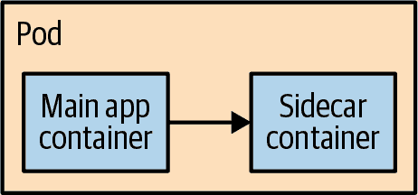
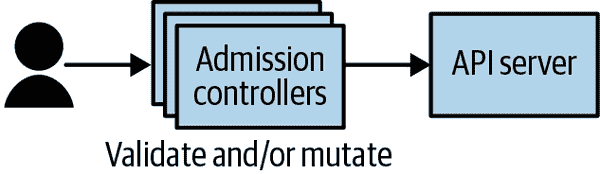

# 第十五章：在 Kubernetes 之上构建更高级别的应用模式

Kubernetes 是一个复杂的系统并不是秘密。尽管它简化了分布式应用的部署和操作，但它并没有简化这些系统的开发。事实上，当为开发者添加新的概念和工件时，它增加了一层复杂性，以简化操作为代价。因此，在许多环境中，开发更高级别的抽象以提供更多开发者友好的原语是有意义的。此外，在许多大公司中，标准化应用配置和部署方式也是有意义的，以便每个人都遵循相同的运维最佳实践。通过开发更高级别的抽象，开发者可以自动遵守这些原则。然而，开发这些抽象可能会隐藏开发者需要了解的重要细节，并可能引入封闭的园区。这限制或复杂化了某些应用程序的开发或现有解决方案的集成。在云端的发展过程中，基础设施的灵活性和平台的功能之间的张力一直是不断存在的。设计适当的高级别抽象使我们能够在这个分歧中走出理想的路径。

# 开发更高级别抽象的方法

当考虑如何在 Kubernetes 之上开发更高级别的原语时，有两种基本方法。第一种是将 Kubernetes 包装为一个实现细节。采用这种方法时，消费您平台的开发者应该大部分时间意识不到他们正在运行在 Kubernetes 之上；相反，他们应该将自己视为您提供的平台的消费者，因此 Kubernetes 是一个实现细节。

第二个选择是利用 Kubernetes 本身构建的可扩展性能力。Kubernetes 服务器 API 非常灵活，您可以动态地向 Kubernetes API 添加任意新资源。采用这种方法，您的新的高级别资源与内置的 Kubernetes 对象并存，并且用户可以使用内置工具与所有 Kubernetes 资源（包括内置的和扩展的资源）进行交互。这种扩展模型使得 Kubernetes 仍然是开发者的核心，但通过添加降低了复杂性并使其更易于使用。

如何选择适当的方法？这取决于您正在构建的抽象层的目标。如果您正在构建一个完全隔离的集成环境，您有强烈信心用户不需要“打破玻璃”逃脱，并且易用性是一个重要特征，第一个选项是一个很好的选择。构建机器学习流水线就是一个很好的例子。该领域相对来说是被理解的。您的用户可能不熟悉 Kubernetes。让这些数据科学家能够快速完成工作并专注于他们的领域而不是分布式系统是主要目标。因此，在 Kubernetes 顶部构建完整的抽象层是最合理的选择。

另一方面，当构建更高级别的开发者抽象时——例如，一个简化的部署 Java 应用程序的方法——扩展 Kubernetes 而不是包装它是一个更好的选择，有两个原因。首先，应用开发的领域非常广泛。对于您来说，难以预测开发人员的所有需求和用例，特别是随着应用程序和业务随时间的迭代和变化。另一个原因是确保您能继续利用 Kubernetes 生态系统中的工具。有无数的云原生工具用于监控、持续交付等等。扩展而不是替换 Kubernetes API 确保您可以继续使用这些工具和新开发的工具。此外，当选择扩展而不是混淆 Kubernetes API 时，相对容易找到具有 Kubernetes 行业经验的人。在只存在于您环境中的定制应用程序平台上构建应用程序的经验在定义上是罕见的。

# 扩展 Kubernetes

因为您可能在 Kubernetes 之上构建的每个层都是独特的，描述如何构建这样一个层级以扩展 Kubernetes 超出了本书的范围。但是，扩展 Kubernetes 的工具和技术对于您可能在 Kubernetes 之上进行的任何构建都是通用的，因此我们将花时间来覆盖它们。

## 扩展 Kubernetes 集群

完整的如何扩展 Kubernetes 集群的操作指南是一个庞大的主题，更详尽的内容可以在其他书籍中找到，比如 [*管理 Kubernetes*](https://oreil.ly/6kUUX) 和 [*Kubernetes: Up and Running*](https://oreil.ly/fdRA3)（O’Reilly）。与在此重复相同材料不同，本节专注于提供如何使用 Kubernetes 的扩展性的理解。

扩展 Kubernetes 集群涉及理解 Kubernetes 资源的接触点。有三种相关的技术解决方案。首先是*sidecar*。Sidecar 容器（显示在图 15-1 中）在服务网格的背景下得到了推广。这些容器与主应用容器并行运行，提供与主应用分离并经常由独立团队维护的额外功能。例如，在服务网格中，sidecar 可以为容器化应用提供透明的互相认证的传输层安全性（mTLS）。你可以使用 sidecar 来为用户定义的应用程序添加功能。

###### 图 15-1\. sidecar 设计

在行业内，sidecar 方法变得越来越流行，并且许多项目使用它来在开发者的容器旁提供服务。一个很好的例子是[Dapr](https://dapr.io)（分布式应用运行时）项目。Dapr 是 CNCF 内的一个开源项目，为应用程序实现了一个 sidecar，提供诸如加密、键/值存储、发布/订阅队列等许多功能，具有非常简单一致的 API。像 Dapr 这样的 sidecar 可以作为你在 Kubernetes 之上开发的平台的模块化构建块使用。

当然，这项工作的整体目标是使开发者的生活更轻松，但如果我们要求他们学习并知道如何使用 sidecar，实际上会使问题变得更糟。幸运的是，用于扩展 Kubernetes 的额外工具简化了事务。特别是，Kubernetes 具有*admission controllers*。Admission controllers 是拦截器，它们在将 Kubernetes API 请求存储（或“接受”）到集群的后备存储之前读取这些请求。你可以使用这些 admission controllers 来验证或修改 API 对象。在 sidecar 的上下文中，你可以使用它们自动向集群中创建的所有 pod 添加 sidecar，以便开发者无需了解 sidecar 即可获得其好处。图 15-2 展示了 admission controllers 如何与 Kubernetes API 交互。

###### 图 15-2\. Admission controllers

准入控制器的效用不仅限于添加 sidecar。您还可以使用它们验证开发人员提交给 Kubernetes 的对象。例如，您可以实现一个 Kubernetes 的 *linter*（分析代码的工具），确保开发人员提交符合 Kubernetes 最佳实践的 pod 和其他资源。开发人员常见的一个错误是未为其应用程序保留资源。对于这些情况，基于准入控制器的 linter 可以拦截此类请求并将其拒绝。当然，您还应该留下一种逃生方式（例如，特殊的注释），以便高级用户可以选择退出适当的 lint 规则。我们将在本章后面讨论逃生通道的重要性。

到目前为止，我们只讨论了增强现有应用程序的方法以及确保开发人员遵循最佳实践的方式，但我们并没有真正涉及如何添加更高级别的抽象。这就是自定义资源定义（CRDs）发挥作用的地方。CRDs 是一种动态向现有 Kubernetes 集群添加新资源的方式。例如，使用 CRDs，您可以向 Kubernetes 集群添加一个新的 ReplicatedService 资源。当开发人员创建 ReplicatedService 的实例时，它会转到 Kubernetes 并创建相应的 Deployment 和 Service 资源。因此，ReplicatedService 是一个常见模式的方便开发者抽象。通常，CRDs 由部署到集群本身的控制循环来实现对这些新资源类型的管理。

## 扩展 Kubernetes 用户体验

向集群添加新资源是提供新功能的好方法，但要真正利用它们，通常需要扩展 Kubernetes 用户体验（UX）。默认情况下，Kubernetes 工具不了解自定义资源和其他扩展，因此对待它们的方式非常普遍且不够用户友好。扩展 Kubernetes 命令行可以提供增强的用户体验。

通常用于访问 Kubernetes 的工具是 `kubectl` 命令行工具。幸运的是，它也被构建为可扩展的。`kubectl` 插件是具有像 `kubectl-foo` 这样的名称的二进制文件，其中 `foo` 是插件的名称。当您在命令行上调用 `kubectl foo ...` 时，该调用将路由到插件二进制文件的调用。使用 `kubectl` 插件，您可以定义深度理解您已添加到集群的新资源的新体验。您可以自由实现适合的体验，同时利用 `kubectl` 工具的熟悉性。这尤其宝贵，因为这意味着您无需教开发人员使用新的工具集。同样，您可以逐步引入 Kubernetes 本地概念，随着开发人员增加其 Kubernetes 知识。

如果您希望为基于 Kubernetes 的平台构建图形界面，有几种工具可以帮助。特别是开源项目[Headlamp 项目](https://oreil.ly/2-4fB)，它是一个库，可轻松构建基于 Web、移动或桌面的应用程序，用于与 Kubernetes 基础设施交互。使用类似 Headlamp 的工具可以快速创建定制的开发者体验，完全符合您的平台及其需求。

## 使容器化开发更加简单

在开发人员甚至能够将应用程序部署到 Kubernetes 之前，必须首先将该应用程序打包为容器。虽然对于熟悉云原生生态系统的人来说构建容器已经是信手拈来，但对于许多人来说，这是一个艰巨的任务，甚至阻碍了现代应用程序开发的开始。

幸运的是，有几种开源工具可以帮助加快您的开发。像[Draft](https://draft.sh)和[Skaffold](https://oreil.ly/H4DzY)这样的工具将为特定语言或开发环境自动生成 Dockerfile。

如果开发人员熟悉来自 Cloud Foundry 或其他平台的构建包概念，还有像[Paketo](https://paketo.io)这样的工具，提供易于使用和经过验证的容器镜像，用于构建流行语言的应用程序以及命令行工具，以便轻松入门。

## 开发“推送即部署”体验

许多 PaaS 产品最受欢迎的功能之一是“推送即部署”，这意味着将代码推送到 Git 存储库只需一次，即可将应用程序部署到云环境中。尽管这以前是大规模托管 PaaS 解决方案的领域，但现在可以使用 GitHub Actions、Azure DevOps 或其他持续构建工具轻松构建类似的体验。

通过正确设计的流水线，一旦开发人员将代码推送到其 Git 存储库中，就会自动进行测试、构建、打包成容器镜像并推送到容器注册表中。

一旦容器镜像的新版本出现在容器注册表中，只需使用另一个 Git 提交结合 GitOps 就可以将该镜像推送到正在运行的应用程序。

结合 GitHub Actions 和 GitOps 可以使您的开发人员实现快速部署，同时也保持云原生生态系统以及基础设施即代码（IaC）等理念的真实性。

# 构建平台时的设计考虑

无数的平台已被建立，以提高开发人员的生产力。有机会观察这些平台成功与失败的各个方面，您可以开发出一套共同的模式和考虑事项，从他人的经验中汲取教训。遵循这些设计指南可以帮助确保您构建的平台成功，而不是成为一个必须最终放弃的“遗留”死胡同。

## 支持导出到容器镜像

当你建立一个平台时，许多设计通过允许用户仅提供代码（例如，Function as a Service [FaaS] 中的一个函数）或本地包（例如 Java 中的一个 JAR 文件），而不是完整的容器镜像，来提供简单性。这种方法非常吸引人，因为它让用户可以在他们熟悉的工具和开发经验范围内操作。平台会为他们处理应用程序的容器化。

然而，这种方法的问题出现在开发者遇到所提供的编程环境的限制时。也许是因为他们需要特定版本的语言运行时来解决 bug。或者可能是因为他们需要打包额外的资源或可执行文件，这些不在你自动容器化应用程序的结构中。

无论原因是什么，碰到这个障碍对开发者来说都是一个令人沮丧的时刻，因为这时他们突然需要学习如何打包他们的应用程序，而他们真正想做的只是稍微扩展它以修复 bug 或交付新功能。

然而，情况不一定非得如此。如果你支持将你的平台的编程环境导出到一个通用容器中，使用你平台的开发者就不需要从头学习关于容器的所有知识。相反，他们有一个完整的工作容器镜像，代表了他们当前的应用程序（即包含他们的函数和节点运行时的容器镜像）。有了这个起点，他们可以进行必要的微调，使容器镜像适应他们的需求。这种逐步降级和增量学习显著地平滑了从高级平台到更低级基础设施的过渡路径。它还增加了平台的通用效用，因为使用它不会为开发者引入陡峭的学习曲线。

## 支持现有的服务和服务发现机制

另一个平台的常见情况是它们会发展并与其他系统互联。许多开发者可能对你的平台非常满意和高效，但是任何真实世界的应用程序都会涉及到你构建的平台、更低级别的 Kubernetes 应用程序以及其他平台。与传统数据库或为 Kubernetes 构建的开源应用程序的连接始终是足够大的应用程序的一部分。

由于这种互联的需求，任何你构建的平台都必须使用并公开核心 Kubernetes 的服务和服务发现基元。不要为了改善平台体验而重复造轮子，因为这样做会创建一个无法与更广泛世界互动的封闭环境。

如果将平台中定义的应用程序公开为 Kubernetes 服务，集群中的任何位置的应用程序都可以使用您的应用程序，无论它们是否在您的更高级平台中运行。同样，如果使用 Kubernetes DNS 服务器进行服务发现，您将能够从您的高级应用程序平台连接到集群中运行的其他应用程序，即使它们未在您的更高级平台中定义。也许建立更好或更易于使用的东西是很诱人的，但跨不同平台的互联性是任何足够年龄和复杂性的应用程序的常见设计模式。您将始终后悔决定建立一个封闭的园地。

# 构建应用平台的最佳实践

尽管 Kubernetes 提供了强大的工具来操作软件，但它在帮助开发人员构建应用程序方面的功能较少。通常需要在 Kubernetes 之上构建平台，以提高开发效率和/或使 Kubernetes 更易于使用。在构建这些平台时，应牢记以下最佳实践：

+   使用准入控制器来限制和修改对集群的 API 调用。准入控制器可以验证（并拒绝无效的）Kubernetes 资源。变异准入控制器可以自动修改 API 资源，以添加新的 sidecar 或其他用户甚至不需要知道的变更。

+   使用 `kubectl` 插件来扩展 Kubernetes 用户体验，通过向现有命令行工具添加新工具。在极少数情况下，可能需要使用专门构建的工具。

+   在构建基于 Kubernetes 的平台时，仔细考虑平台的用户及其需求的演变。使事情简单易用显然是一个良好的目标，但如果这也导致用户陷入困境，无法成功地在您的平台之外重写所有内容，最终将是令人沮丧（和失败的）经历。

# 摘要

Kubernetes 是简化软件部署和操作的绝佳工具；不幸的是，它并非总是最友好或最高效的开发环境。因此，一个常见的任务是在 Kubernetes 之上构建一个更高级的平台，使其更易接近和被普通开发者使用。本章描述了设计这样一个更高级系统的几种方法，并提供了 Kubernetes 中可用的核心可扩展性基础设施的摘要。它总结了从我们观察到的其他构建在 Kubernetes 之上的平台中得出的教训和设计原则，希望它们能指导您平台的设计。
