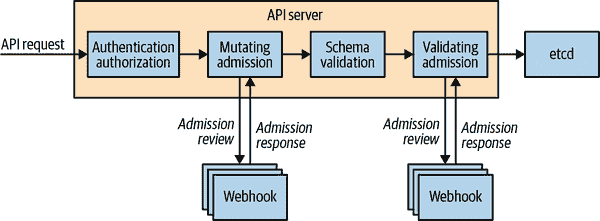
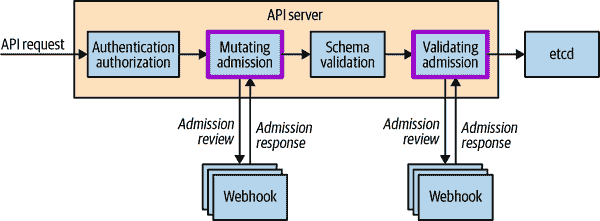
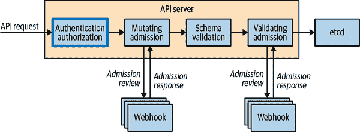

# 第十七章：准入控制和授权

控制访问 Kubernetes API 对于确保您的集群不仅安全，还可以用作向所有用户、工作负载和集群组件传达策略和治理的手段至关重要。在本章中，我们分享如何使用准入控制器和授权模块来启用特定功能，以及如何定制它们以满足您的特定需求。

在我们深入讨论准入控制和授权之前，让我们回顾一下 API 请求通过 API 服务器的流程。图 17-1 提供了关于准入控制和授权在该流程中发生位置和方式的见解。它描述了通过 Kubernetes API 服务器的端到端请求流程，直到接受对象保存到存储为止。按照 API 请求从左到右通过 API 服务器，特别注意准入控制和授权的顺序。我们将在本章介绍这些的最佳实践。



###### 图 17-1。Kubernetes API 请求流程

# 准入控制

您是否曾想过在定义一个不存在的命名空间中的资源时如何自动创建命名空间？也许您想知道如何选择默认的存储类？这些变更由名为*准入控制器*的功能支持。在本节中，我们将探讨如何使用准入控制器代表用户在服务器端实现 Kubernetes 最佳实践，并如何利用准入控制来管理 Kubernetes 集群的使用方式。

## 它们是什么？

准入控制器位于 Kubernetes API 服务器请求流程的路径中，并在认证和授权阶段后接收请求。它们用于在将请求对象保存到存储之前验证或变更（或两者兼有）请求对象。验证和变更准入控制器的区别在于，变更准入控制器可以修改它们接受的请求对象，而验证准入控制器则不能。

## 为什么它们很重要？

鉴于准入控制器位于所有 API 服务器请求的路径上，您可以以多种不同的方式使用它们。最常见的是，准入控制器的使用可以分为以下三类：

策略和治理

准入控制器允许执行策略以满足业务需求；例如：

+   仅当在`dev`命名空间中时，才能使用内部云负载均衡器。

+   Pod 中的所有容器必须具有资源限制。

+   向所有资源添加预定义的标准标签或注释，使它们可以被现有工具发现。

+   所有 Ingress 资源只能使用 HTTPS。有关如何在此上下文中使用准入 Web 钩子的详细信息，请参阅第十一章。

安全性

您可以使用准入控制器强制执行整个集群中的一致安全姿态。一个典型的例子是 Pod 安全准入控制器，它根据 pod 规范中定义的安全敏感字段的配置确定是否应该允许 pod。例如，它可以拒绝特权容器或从主机文件系统使用特定路径。您可以使用准入 Webhook 强制执行更精细或自定义的安全规则。

资源管理

准入控制器允许您为您的集群用户验证并提供最佳实践，例如：

+   确保所有入口完全限定域名（FQDN）位于特定后缀内。

+   确保入口 FQDN 不重叠。

+   Pod 中的所有容器必须具有资源限制。

## 准入控制器类型

准入控制器分为两类：*标准* 和 *动态*。标准准入控制器已编译到 API 服务器中，并随每个 Kubernetes 发布作为插件提供；它们在启动 API 服务器时需要配置。另一方面，动态控制器可以在运行时配置，并且是在核心 Kubernetes 代码库之外开发的。唯一类型的动态准入控制是准入 Webhook，它通过 HTTP 回调接收准入请求。

默认情况下，推荐启用准入控制器。您可以使用以下标志在 Kubernetes API 服务器上启用额外的准入控制器：

```
--enable-admission-plugins
```

在当前版本的 Kubernetes 中，默认启用以下准入控制器：

```
CertificateApproval, CertificateSigning, CertificateSubjectRestriction,
DefaultIngressClass, DefaultStorageClass, DefaultTolerationSeconds,
LimitRanger, MutatingAdmissionWebhook, NamespaceLifecycle,
PersistentVolumeClaimResize, PodSecurity, Priority, ResourceQuota,
RuntimeClass, ServiceAccount, StorageObjectInUseProtection,
TaintNodesByCondition,
ValidatingAdmissionWebhook
```

您可以在 [Kubernetes 文档](https://oreil.ly/APrUE) 中找到 Kubernetes 准入控制器及其功能的列表。

您可能已经注意到建议启用的准入控制器列表中包含以下内容：“MutatingAdmissionWebhook, ValidatingAdmissionWebhook”。这些标准准入控制器本身不实施任何准入逻辑；而是用于配置在集群中运行的 Webhook 端点以转发准入请求对象。

## 配置准入 Webhook

如前所述，准入 Webhook 的主要优势之一是它们是动态可配置的。重要的是，您理解如何有效地配置准入 Webhook，因为在一致性和失败模式方面存在重要的影响和权衡。

接下来的代码片段是一个 ValidatingWebhookConfiguration 资源清单。此清单用于定义一个验证准入 Webhook。代码片段提供了每个字段功能的详细描述：

```
apiVersion: admissionregistration.k8s.io/v1
  kind: ValidatingWebhookConfiguration
  metadata:
    name: ## Resource name
  webhooks:
  - name: ## Admission webhook name, which will be shown to the user when
          ## any admission reviews are denied
    clientConfig:
      service:
        namespace: ## The namespace where the admission
                   ## webhook pod resides
        name: ## The service name that is used to connect to the admission
              ## webhook
        path: ## The webhook URL
      caBundle: ## The PEM encoded CA bundle which will be used to validate the
                ## webhook's server certificate
    rules: ## Describes what operations on what resources/subresources the API
           ## server must send to this webhook
    - operations:
      - ## The specific operation that triggers the API server to send to this
        ## webhook (e.g., create, update, delete, connect)
      apiGroups:
      - ""
      apiVersions:
      - "*"
      resources:
      - ## Specific resources by name (e.g., deployments, services, ingresses)
    failurePolicy: ## Defines how to handle access issues or unrecognized errors,
                   ## and must be Ignore or Fail
    admissionReviewVersions: ["v1"] ## Specify what versions of AdmissionReview
                                    ## objects are accepted
    sideEffects: ## Signal whether the webhook may out-of-band changes that need
                 ## to be handled
    timeoutSeconds: 5 ## How long the API server should wait for a response
                      ## before treating the request as a failure
```

为了完整起见，让我们看一下一个 MutatingWebhookConfiguration 资源清单。此清单定义了一个变更准入 Webhook。代码片段提供了每个字段功能的详细描述：

```
apiVersion: admissionregistration.k8s.io/v1
  kind: MutatingWebhookConfiguration
  metadata:
    name: ## Resource name
  webhooks:
  - name: ## Admission webhook name, which will be shown to the user when any
          ## admission reviews are denied
    clientConfig:
      service:
        namespace: ## The namespace where the admission webhook pod resides
        name: ## The service name that is used to connect to the admission
              ## webhook
        path: ## The webhook URL
      caBundle: ## The PEM encoded CA bundle which will be used to validate the
                ## webhook's server certificate
    rules: ## Describes what operations on what resources/subresources the API
           ## server must send to this webhook
    - operations:
      - ## The specific operation that triggers the API server to send to this
        ## webhook (e.g., create, update, delete, connect)
      apiGroups:
      - ""
      apiVersions:
      - "*"
      resources:
      - ## Specific resources by name (e.g., deployments, services, ingresses)
    failurePolicy: ## Defines how to handle access issues or unrecognized errors,
                   ## and must be Ignore or Fail
    admissionReviewVersions: ["v1"] ## Specify what versions of AdmissionReview
                   ## objects are accepted
    sideEffects: ## Signal whether the webhook may out-of-band changes that need
                 ## to be handled
    reinvocationPolicy: ## Control whether mutating webhooks are reinvoked if
                        ## another mutation to an object occurs
    timeoutSeconds: 5 ## How long the API server should wait for a response
                      ## before treating the request as a failure
```

你可能已经注意到这两个资源是相同的，除了`kind`和`reinvocationPolicy`字段之外。然而，在后端有一个区别：MutatingWebhookConfiguration 允许准入 Webhook 返回修改后的请求对象，而 ValidatingWebhookConfiguration 不允许。不过，定义一个 MutatingWebhookConfiguration 并简单验证是可以接受的；这里涉及到安全考虑，你应该考虑遵循*最小权限原则*。

###### 注意

你可能会想：“如果我定义一个 ValidatingWebhookConfiguration 或 MutatingWebhookConfiguration，并且在规则对象下的资源字段为 ValidatingWebhookConfiguration 或 MutatingWebhookConfiguration，会发生什么？” 好消息是，对于 ValidatingWebhookConfiguration 和 MutatingWebhookConfiguration 对象的准入请求，永远不会调用 ValidatingAdmissionWebhooks 或 MutatingAdmissionWebhooks。这有其充分的理由：你不希望意外地使集群处于不可恢复的状态。

## 准入控制最佳实践

现在我们已经介绍了准入控制器的强大功能，以下是我们的最佳实践，帮助你充分利用它们。

### 准入插件的顺序无关紧要

在 Kubernetes 的早期版本中，准入插件的顺序对处理顺序具有特定的影响，因此很重要。在当前支持的 Kubernetes 版本中，通过 `--enable-admission-plugins` 作为 API 服务器标志指定的准入插件顺序不再重要。然而，在准入 Webhook 的情况下，顺序确实发挥了一定作用，因此了解请求流程非常重要。请求的准入或拒绝操作采用逻辑与运算，这意味着如果任何一个准入 Webhook 拒绝请求，整个请求将被拒绝，并向用户返回错误。还需注意的是，变更准入控制器始终在验证准入控制器之前运行。如果仔细思考一下，这是合理的：你可能不希望验证随后将要修改的对象。图 17-2 展示了通过准入 Webhook 的请求流程；你将看到变更准入控制器在验证准入控制器之前运行的情况。



###### 图 17-2\. 通过准入 Webhook 的 API 请求流程

### 不要修改相同的字段

配置多个变异入场网钩也带来了挑战。没有办法通过多个变异入场网钩来排序请求流程，因此重要的是不要让变异入场控制器修改相同的字段，因为这可能导致行为不一致。在您拥有多个变异入场网钩的情况下，我们通常建议配置验证入场网钩来确认最终的资源清单在变异后是否符合您的预期，因为它确保在变异网钩之后运行。

### 变异入场网钩必须是幂等的

这意味着它们必须能够处理和接纳已经被处理过并且可能已经被修改过的对象。

### 失败开/失败关闭

您可能会记得在变异和验证网钩配置资源中看到`failurePolicy`字段。该字段定义了在入场网钩遇到访问问题或遇到未识别错误时，API 服务器应该如何处理。您可以将此字段设置为`Ignore`或`Fail`。`Ignore`本质上是失败打开，意味着请求的处理将继续，而`Fail`则拒绝整个请求。这看起来可能很明显，但两种情况的影响都需要考虑。忽略关键的入场网钩可能导致业务依赖的策略未应用到用户不知情的资源上。

保护措施之一是在 API 服务器记录无法访问特定入场网钩时发出警报。如果入场网钩遇到问题，`Fail`可能会更加破坏性，因为它将拒绝所有请求。为了防止这种情况发生，您可以限定规则以确保只有特定的资源请求设置为入场网钩。作为一个原则，您不应该有适用于集群中所有资源的任何规则。

### 入场网钩必须快速响应

如果您编写了自己的入场网钩，重要的是要记住用户/系统请求可能直接受到您的入场网钩做出决策并响应的时间影响。所有入场网钩调用都配置有 30 秒的超时时间，超时后将采取`failurePolicy`。即使您的入场网钩需要几秒钟来做出批准/拒绝的决定，也可能严重影响与集群的用户体验。避免使用复杂的逻辑或依赖外部系统（如数据库）来处理批准/拒绝逻辑。

### 验证入场网钩

一个可选字段允许您通过`NamespaceSelector`字段来限定入场网钩操作的命名空间。此字段默认为空，匹配所有内容，但可以通过`matchLabels`字段匹配命名空间标签。我们建议您始终使用此字段，因为它允许对每个命名空间进行显式选择。

### 始终使用 NamespaceSelector 在单独的命名空间部署

当自托管 Webhook 入场控制器时，部署 Webhook 入场控制器到单独的命名空间，并使用 `NamespaceSelector` 字段排除部署到该命名空间的资源的处理。

### 不要触碰 kube-system 命名空间

`kube-system` 命名空间是所有 Kubernetes 集群中共有的保留命名空间。所有系统级服务都在这里运行。我们建议绝对不要针对此命名空间中的资源运行入场 Webhook，并且可以通过使用 `NamespaceSelector` 字段并简单地不匹配 `kube-system` 命名空间来实现此目的。您还应考虑对于任何对集群操作必需的系统级命名空间执行此操作。

### 使用 RBAC 严格限制入场 Webhook 配置

现在您已经了解了入场 Webhook 配置中的所有字段，您可能已经想到了一种非常简单的方式来破坏对集群的访问。毫无疑问，创建 MutatingWebhookConfiguration 和 ValidatingWebhookConfiguration 都是集群的根级操作，并且必须适当地使用 RBAC 进行锁定。如果未这样做，可能会导致集群故障，甚至更糟糕的是，对您的应用工作负载进行注入攻击。

### 不要发送敏感数据

入场 Webhook 本质上是接受 AdmissionRequests 并输出 AdmissionResponses 的不透明盒子。它们如何存储和操作请求对用户来说是不透明的。重要的是要考虑发送到入场 Webhook 的请求有效负载。在 Kubernetes Secrets 或 ConfigMaps 的情况下，它们可能包含敏感信息，并且需要对存储和共享这些信息的方式提供强有力的保证。与入场 Webhook 共享这些资源可能会泄露敏感信息，因此应将资源规则限定于验证和/或变异所需的最小资源。

# 授权

我们经常在以下问题的背景下考虑授权：“此用户是否能够对这些资源执行这些操作？”在 Kubernetes 中，每个请求的授权在认证之后但入场之前执行。在本节中，我们探讨了如何配置不同的授权模块，并更好地了解如何创建适当的策略以满足集群的需求。图 17-3 展示了授权在请求流程中的位置。



###### 图 17-3\. API 请求流经授权模块

## 授权模块

授权模块负责授予或拒绝访问权限。它们根据必须明确定义的策略决定是否授予访问权限；否则，所有请求将被隐式拒绝。

Kubernetes 默认提供以下授权模块：

基于属性的访问控制（ABAC）

允许通过本地文件配置授权策略

RBAC

允许通过 Kubernetes API 配置授权策略（更多细节请参阅第四章）

Webhook

允许通过远程 REST 端点处理请求的授权

Node

专门的授权模块，用于授权来自 kubelet 的请求

这些模块由集群管理员通过 API 服务器上的`--authorization-mode`标志进行配置。可以配置多个模块，并按顺序检查。与准入控制器不同，如果单个授权模块允许请求，则请求可以继续进行。只有在所有模块拒绝请求的情况下，才会向用户返回错误。

### ABAC

让我们在使用 ABAC 授权模块的情况下看一个策略定义的例子。以下内容授予用户 Mary 对`kube-system`命名空间中一个 Pod 的只读访问权限：

```
apiVersion: abac.authorization.kubernetes.io/v1beta1
kind: Policy
spec:
  user: mary
  resource: pods
  readonly: true
  namespace: kube-system
```

如果 Mary 尝试发起以下请求，则会被拒绝，因为 Mary 没有权限获取`demo-app`命名空间中的 Pod：

```
apiVersion: authorization.k8s.io/v1
kind: SubjectAccessReview
spec:
  resourceAttributes:
    verb: get
    resource: pods
    namespace: demo-app
```

此示例引入了一个新的 API 组`authorization.k8s.io`。这一系列 API 公开了 API 服务器的授权给外部服务，并包括以下用于调试的 API：

SelfSubjectAccessReview

当前用户的访问审查

SubjectAccessReview

Like SelfSubjectAccessReview but for any user

LocalSubjectAccessReview

类似于 SubjectAccessReview，但特定于命名空间

SelfSubjectRulesReview

返回用户在给定命名空间中可以执行的操作列表

这一点很酷，您可以按照通常的方式创建资源来查询这些 API。让我们以前面的例子为例，并使用 SelfSubjectAccessReview 来测试这一点。输出中的状态字段指示此请求被允许：

```
$ cat << EOF | kubectl create -f - -o yaml
apiVersion: authorization.k8s.io/v1
kind: SelfSubjectAccessReview
spec:
 resourceAttributes:
 verb: get
 resource: pods
 namespace: demo-app
EOF
apiVersion: authorization.k8s.io/v1
kind: SelfSubjectAccessReview
metadata:
  creationTimestamp: null
spec:
  resourceAttributes:
    namespace: kube-system
    resource: pods
    verb: get
status:
  allowed: true
```

实际上，Kubernetes 提供了内置于`kubectl`中的工具，使这一过程更加简单。`kubectl auth can-i`命令通过查询与前述示例相同的 API 来运行：

```
$ kubectl auth can-i get pods --namespace demo-app
yes
```

使用管理员凭据，您也可以以其他用户身份运行相同的命令来检查操作：

```
$ kubectl auth can-i get pods --namespace demo-app --as mary
yes
```

### RBAC

Kubernetes 基于角色的访问控制在第四章中有详细介绍。

### Webhook

使用 Webhook 授权模块允许集群管理员配置外部 REST 端点以委托授权流程。这将在集群外运行，并通过 URL 访问。REST 端点的配置信息存储在控制平面主机文件系统中的文件中，并通过`--authorization-webhook-config-file=SOME_FILENAME`选项配置到 API 服务器上。配置完成后，API 服务器将 SubjectAccessReview 对象作为请求体的一部分发送到授权 Webhook 应用程序，后者会处理并返回带有完成状态字段的对象。

## 授权最佳实践

在更改配置在集群上配置的授权模块之前，请考虑以下最佳实践：

### 不要在多个控制平面集群上使用 ABAC

考虑到 ABAC 策略需要放置在每个控制平面主机的文件系统上，并保持同步，我们通常建议*不要*在多个控制平面集群中使用 ABAC。同样的情况也适用于 webhook 模块，因为配置是基于文件和相应的标志的存在。此外，对这些文件中的策略进行更改需要重启 API 服务器才能生效，这实际上是单个控制平面集群中的控制平面故障，或多个控制平面集群中不一致的配置。鉴于这些细节，我们建议仅针对用户授权使用 RBAC 模块，因为规则是在 Kubernetes 自身中配置和存储的。

### 不要使用 webhook 模块

Webhook 模块虽然功能强大，但潜在风险很高。考虑到每个请求都要经过授权过程，如果 webhook 服务出现故障，对集群将是灾难性的。因此，我们通常建议不使用外部授权模块，除非您完全审核并对集群在 webhook 服务不可达或不可用时的故障模式感到满意和放心。

# 总结

在本章中，我们涵盖了准入和授权的基础主题，并介绍了最佳实践。通过确定最佳准入和授权配置，您可以自定义所需的控制和策略，以维护您集群的生命周期。
