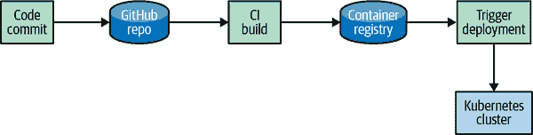

# 第十八章：GitOps 与部署

在本章中，我们将讨论 GitOps 以及如何使用它来在 Kubernetes 上部署和管理应用程序。我们将深入探讨设置 GitOps 工作流程的最佳实践以及如何利用不同的工具来实现这一目标。

GitOps 是一种用于进行 Kubernetes 应用部署的方法。它通过利用 Git 作为 Kubernetes 资源的唯一真实来源来实现。将 Git 置于部署流水线的中心，开发人员和运维人员可以发起拉取请求，加速并简化 Kubernetes 应用的部署和操作任务。这样一来，您可以利用相同的实践来管理 Kubernetes 资源，就像管理应用代码一样。开发人员会非常熟悉这种工作流程，因为他们可以利用处理应用代码时使用的相同工具。

在本章中，我们涵盖以下主题：

+   什么是 GitOps？

+   为什么要使用 GitOps？

+   比较 GitOps 与其他部署方法

+   模式和最佳实践

+   GitOps 工具链

我们还会经历一个示例 GitOps 工作流程，包括以下任务：

+   使用 Flux 设置 GitOps 代理

+   将 Flux 代理连接到 Git 仓库

+   同步资源到 Kubernetes 集群

+   将应用程序部署到集群

# 什么是 GitOps？

GitOps 由 Weaveworks 的人员推广，并基于他们在生产中运行 Kubernetes 的经验构建了这些思想和基础。GitOps 将软件开发生命周期的概念应用到运维中。通过 GitOps，您的 Git 仓库成为了真实来源，而您的集群则与配置的 Git 仓库同步。例如，如果您更新了一个 Kubernetes 部署清单，这些配置更改会自动反映在 Git 中的集群状态中。

使用这种方法，您可以更轻松地维护一致的多集群，并避免在整个集群中出现配置漂移。GitOps 允许您以声明方式描述多个环境的集群，并驱动维护该集群的状态。GitOps 的实践可以适用于应用交付和操作，并为开发人员提供了一个共同的工具链。

Weaveworks Flux 是最早支持 GitOps 方法的工具之一，也是我们在本章中将使用的工具。许多新的工具已经发布到云原生生态系统中，如 Intuit 公司的 Argo CD，也被广泛应用于 GitOps 方法。稍后我们将更深入地探讨 GitOps 可用的工具。

Figure 18-1 提供了一个 GitOps 工作流程的表示。我们有一个 Git 仓库，其中包含我们应用程序的应用代码和 Kubernetes 清单。Flux 代理已配置为监视该仓库的任何更改。当开发人员提交代码更改时，Flux 代理将同步任何新变更到 Kubernetes 集群中。


###### 图 18-1\. GitOps 工作流程

在构建您的 GitOps 工作流程时，您应考虑 [OpenGitOps 项目](https://oreil.ly/3Rz55) 定义的四个核心原则：

声明性配置

所有配置都存储在 Git 中，以声明性的 YAML 文件形式。这样可以为集群配置提供一个唯一的真实数据来源。

配置版本化

所有配置都存储在 Git 中，并跟踪和版本化所有更改。这允许轻松审计更改和回滚。

不可变的配置

所有配置都是不可变的。这意味着一旦进行更改，就无法修改。这允许集群保持一致的状态。

持续状态对比

集群状态与 Git 中定义的状态持续对比。这允许集群保持一致的状态。

# 为什么选择 GitOps？

GitOps 是管理您的 Kubernetes 集群的一种优秀方式，它可以用于部署应用程序到您的集群以及管理集群和应用程序配置。在我们讨论所有这些好处之前，让我们首先看一下我们如何传统地在 Kubernetes 上部署和配置应用程序。

图 18-2 展示了传统的部署工作流程。我们有一个开发人员正在为一个应用程序开发新功能。开发人员将会对应用程序代码进行更改，然后构建一个新的容器映像。接下来，开发人员将新的容器映像推送到容器注册表。然后，开发人员将更新 Kubernetes 清单以使用新的容器映像，并将更改应用到集群中。这是一个非常手动的过程，可能非常耗时。某些步骤可以通过工具自动化，但随着应用程序和集群数量的增长，这可能变得复杂。



###### 图 18-2\. 传统部署工作流程

这种工作流程可能非常容易出错，并且很难追踪问题的源头。回滚更改也可能很困难，因为您需要手动恢复 Kubernetes 清单的更改。这也可能导致配置漂移，因为用户可能直接对 Kubernetes 中的资源进行更改。管理环境的安全访问也可能变得复杂，因为需要多个流水线和用户访问权限。审计从更改到部署的每一次互动也可能会因为多个流水线而变得困难。

我们可以通过 GitOps 提供的以下好处解决这些问题：

声明性配置

所有配置都以声明性 YAML 文件形式存储在 Git 中。这不仅允许有一个真实数据来源，还能通过 Git 历史轻松审计更改。开发人员习惯于使用 Git 进行工作，因此他们对这种工作流程非常熟悉。

版本控制

Git 仓库支持不可变性和版本历史。例如，使用 Git 管理前述配置将为你提供一个单一的源，从中驱动应用程序的一切。这使你能够轻松追踪任何时间的更改。它允许你查看 Git 历史中找到的所有更改并比较这些更改。

持续对比

集群状态持续与 Git 中定义的状态对比。它还允许简单的回滚，因为你可以简单地在 Git 中恢复更改。系统可以自动同步 Git 中的相同状态到你的集群中。这使得集群能够保持一致的状态。

安全性

当你使用 Git 管理部署到 Kubernetes 的应用程序时，你获得了集群所有更改的完整审计日志。所有更改都在 Git 仓库中进行，GitOps 代理可以自动调解对 Kubernetes 资源的任何直接更改。这提供了更改记录的完整追踪，可以了解到是谁做了什么更改。它支持一致的操作，并增强了环境的安全性。

尽管你可能有一个非常自动化的 CI/CD 管道，但你的工作流程可能仍有一些手动步骤。GitOps 旨在通过自动化工作流并提供开发者中心的工作流来解决这些挑战。

# GitOps 仓库结构

关于 GitOps 的首要问题之一是如何结构化你的 Git 仓库。有许多不同的方法来结构化你的 Git 仓库，但每种方法都有其利弊。

结构化 Git 仓库的四种常见策略是：

单一的 monorepo

所有的 Kubernetes 清单和应用程序代码都存储在单个仓库中。这是简单的方法，但随着公司规模的扩大，变得更加困难。这种方法也不允许关注点分离，因为所有团队的源代码和 Kubernetes 清单都存放在同一个仓库中。对于小公司来说可能效果不错，但随着公司的扩展，你很快就会发现这种方法不再适用。以下是此类仓库布局结构的示例：

```
├── app-x
│   ├── common
│   └── deploy
│       └── manifest
├── app-y
│   ├── prod
│   └── staging
├── app-z
└── ops-team
    ├── flux
    ├── ingress
    └── prometheus
```

每个团队一个仓库

每个团队有自己的仓库，并且 Kubernetes 清单存储在同一个仓库中。这种方法允许更好地组织和关注点分离，但随着应用程序组合随时间增长，管理起来会变得更加困难。以下是此类仓库布局结构的示例：

```
├── ops-team
│   ├── elk
│   ├── flux
│   └── prometheus
├── team-x
│   └── app-x
│       └── deploy
│           └── manifest
└── team-y
    ├── prod
    └── staging
```

每个应用程序一个仓库

每个应用程序都有自己的仓库，并且 Kubernetes 清单存储在同一个仓库中。这种方法允许更好地组织和关注点分离，因为可以将其锁定为团队的只读访问权限。使用这种结构的缺点是无法在一个地方看到所有内容。以下是此类仓库布局结构的示例：

```
── ops-team-repo
│   ├── elk
│   ├── flux
│   └── prometheus
```

```
── team-x-repo
│   └── app-x
│       └── deploy
│           └── manifest
```

每个环境一个分支

每个环境在同一存储库中有自己的分支。这种方法允许您通过简单的 Git 合并来推广环境。通过简单的 Git 合并推广可能会导致环境之间的意外更改和合并冲突。这种方法的缺点是通常会有大量分支，而且难以管理。这种方法也不适合使用 Kustomize 和 Helm 等模板工具。以下是这种类型的存储库布局结构的示例：

```
-- main
-- staging
-- QA
-- dev
```

通常，您会希望评估您的组织和团队布局，以决定哪种结构最适合您。从每个团队的存储库开始是一个很好的起点，因为它是一个良好的折中点，提供了明确的关注点分离和简单的存储库管理。

# 管理秘密

在实施 GitOps 工作流程时，秘密管理是一个常见的挑战。有许多不同的方法来管理秘密，最佳方法将取决于您的组织。接下来我们将深入探讨在 GitOps 方式下管理秘密的五种常见方法：

直接在 Git 中存储秘密

这种方法是最简单的，但不推荐使用。这种方法的问题在于，您正在将纯文本秘密存储在可能是公共的存储库中。即使您的存储库是内部和私有的，您仍然在以纯文本形式存储秘密。多个用户可能有权访问此存储库，然后将访问权限扩展到秘密。

将秘密嵌入容器映像

这种方法比在 Git 中以纯文本存储秘密稍好一些。这种方法的问题在于，将秘密嵌入映像将要求您每次旋转秘密时重新构建映像。它也无法解决安全问题，因为多个用户可能能够拉取并运行映像。由于安全问题，这种方法也不推荐使用。

使用 Kubernetes Secrets

这种方法直接在 Kubernetes 中可用，提供了一个简单的入门方式。这种方法的问题在于 Kubernetes Secrets 并不真正保密。这里的意思是 Kubernetes Secrets 看起来被加密了，但实际上只是 base64 编码。由于安全问题，这种方法也不推荐使用。

使用 Sealed Secrets

Sealed Secrets 是 Bitnami 的一个项目。它有两个组件：一个集群控制器和一个客户端工具称为 kubeseal。kubeseal 实用程序使用非对称加密来加密只有控制器可以解密的秘密。这些秘密然后可以加密存储在 Git 中，只能由您集群中的控制器解密。这是在 GitOps 方式下管理秘密的推荐方法。

将秘密存储在秘密管理工具中

这种方法允许您将密钥存储在安全位置，并从您的集群访问它们。这些密钥可以存储在像 HashiCorp Vault、Azure Keyvault、Google KMS 等外部密钥管理解决方案中。这种方法允许您使用可能已经存在的现有解决方案，并继续使用相同的工作流程。这也是以 GitOps 方式管理密钥的推荐方法之一。

虽然有许多不同的方法来管理密钥，但最佳方法将取决于您的组织。正如我们讨论的那样，Sealed Secrets 和外部密钥管理是管理密钥的推荐方法。

# 设置 Flux

Flux 是一个 Kubernetes 运算符，它监视您的 Git 仓库的变化，并自动将这些变化应用到您的集群中。Flux 是在您的集群中实施 GitOps 的成熟工具，并且它是我们将在本章的其余部分中使用的工具。

首先，我们将开始配置 minikube 以部署 Flux。您可以从 [minikube 网站](https://oreil.ly/GMPMl) 安装 minikube。我们正在使用 Mac，所以我们将使用 `brew` 安装 minikube：

```
brew install minikube
```

现在我们将安装 Flux 并准备我们的集群以同步到 Git 仓库。我们将使用 `flux` CLI 安装 Flux。你可以从 [flux 网站](https://oreil.ly/h2_hQ) 安装 `flux` CLI。

安装 Flux CLI：

```
brew install fluxcd/tap/flux
```

导出您的 GitHub 令牌：

```
export GITHUB_TOKEN=<your-token>
export GITHUB_USER=<your-username>
```

检查您的集群是否可以安装 Flux：

```
flux check --pre
```

引导 Flux：

```
flux bootstrap github \
  --owner=$GITHUB_USER \
  --repository=kbp-flux \
  --branch=main \
  --path=./clusters/prod \
  --personal
```

前面的 `bootstrap` 命令将在您的 GitHub 账户中创建一个名为 kbp-flux 的 Git 仓库。它还将创建一个 `main` 分支和一个 *clusters/prod* 目录。*clusters/prod* 目录将包含将部署到您的集群中的 Flux 组件。*clusters/prod* 目录还将包含一个 *gotk-components.yaml* 文件，该文件将用于将 Flux 组件部署到您的集群中。这还将把 Flux 组件安装到 `flux-system` 命名空间中。

现在让我们检查 `flux-system` 命名空间，看看 Flux 组件是否已部署：

```
kubectl get pods -n flux-system
```

您应该看到以下输出：

```
NAME                                      READY   STATUS    RESTARTS   AGE
helm-controller-8664d9dcfc-4gd2h          1/1     Running   0          6m30s
kustomize-controller-9888f965-ld5g6       1/1     Running   0          6m30s
notification-controller-b6d8458c7-vjb86   1/1     Running   0          6m30s
source-controller-5b68b64c65-pj2tn        1/1     Running   0          6m30s
```

现在让我们将它创建的仓库克隆到我们的本地机器上：

```
git clone https://github.com/$GITHUB_USER/kbp-flux
```

接下来，我们将向我们的仓库添加一个 Flux 配置，并在 GitHub 上使用一个公共仓库。我们将使用 Weaveworks 的 Stefan Prodan 创建的示例应用程序。

让我们创建一个指向应用程序仓库主分支的 Git 仓库清单：

```
flux create source git podinfo \
  --url=https://github.com/stefanprodan/podinfo \
  --branch=master \
  --interval=30s \
  --export > ./clusters/prod/podinfo-source.yaml
```

然后我们将配置 Flux 来部署该应用程序，并向应用程序应用 Kustomize 配置：

```
flux create kustomization podinfo \
  --target-namespace=default \
  --source=podinfo \
  --path="./kustomize" \
  --prune=true \
  --interval=5m \
  --export > ./clusters/prod/podinfo-kustomization.yaml
```

现在我们将推送更改到我们的仓库：

```
    git add -A && git commit -m "Add podinfo Kustomization"

    git push
```

我们可以使用 Flux CLI 看到这些变化正在应用中：

```
flux get kustomizations
```

您应该看到以下输出：

```
flux get kustomizations --watch
NAME         REVISION              SUSPENDED  READY  MESSAGE
flux-system  main@sha1:9c3fb6f1    False      True   Applied revision: main@sh...
podinfo      master@sha1:1abc44f0  False      True   Applied revision: master@...
```

我们可以看到资源已经部署到我们的集群中：

```
kubectl get pods -n default
```

主分支中对 podinfo Kubernetes 清单所做的任何更改现在都会自动反映在您的集群中。

我们现在在我们的集群中设置了 Flux，并将其引导到一个 Git 仓库，并配置 Flux 来部署一个应用程序。现在我们可以开始使用 Flux 来管理我们的集群。

这是如何设置 Flux 的一个非常基本的示例，如果您想深入了解 Flux，请查阅 [Flux 文档](https://oreil.ly/F5D2p)。

# GitOps 工具

许多不同的工具可以用来在您的集群中实施 GitOps。在本节中，我们将介绍一些最受欢迎的工具。

在评估用于 GitOps 的工具时，您应考虑易用性、企业特性和可扩展性。以下是可用于在您的集群中实施 GitOps 的开源和商业工具：

Flux

Flux 是一个 Kubernetes 操作器，用于监视您的 Git 仓库的变更，并自动将这些变更应用到您的集群中。Flux 是在您的集群中实施 GitOps 的成熟工具。Weaveworks 也提供了 Flux 的托管版本。Flux 目前是 CNCF 的毕业项目。

ArgoCD

Argo CD 是一个开源的 GitOps 连续交付工具。它监控您的集群和存储在 Git 仓库中声明性定义的基础设施，并解决两者之间的差异，从而自动化应用部署。ArgoCD 目前是 CNCF 的毕业项目。

Codefresh

Codefresh 是一个可以用于在您的集群中实施 GitOps 的 CI/CD 平台。Codefresh 提供了一个托管平台，提供 ArgoCD 作为服务。

Harness

Harness 是一个可以用于在您的集群中实施 GitOps 的 CI/CD 平台。Harness 是一个成熟的工具，适用于在您的集群中实施 GitOps，并提供托管版本。Harness 面向企业客户，提供了完整的持续交付功能套件。

# GitOps 最佳实践

使用 Kubernetes 进行 GitOps 时，请考虑以下最佳实践：

+   从一个小应用开始，然后扩展您的努力来管理所有东西的 GitOps 模型。这将使您对 GitOps 实现建立信心。

+   评估符合您需求的工具，或者从像 Flux 或 ArgoCD 这样经过验证的 OSS 工具开始。

+   避免为您的仓库布局使用分支，因为这是最复杂和容易出错的仓库布局。

+   从每个环境一个文件夹开始，这提供了灵活性，并允许您使用 Kustomize 或 Helm 等模板工具。

+   利用 Sealed Secrets 或外部机密提供者来管理集群中的机密信息。

+   记住，GitOps 是一种过程，而不是一种工具，您现有的工具集可能已经满足您的需求。

# 总结

在本章中，我们介绍了什么是 GitOps，以及如何使用它来管理您的 Kubernetes 集群。我们还介绍了一些可以用来在您的集群中实施 GitOps 的工具。当您考虑是否适合使用 GitOps 时，应考虑您试图解决的问题和您的需求。如果 GitOps 能够帮助您解决这些问题，那么从 Flux 或 ArgoCD 这样的工具开始是个不错的选择。
