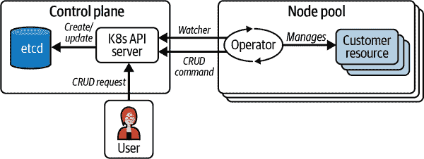
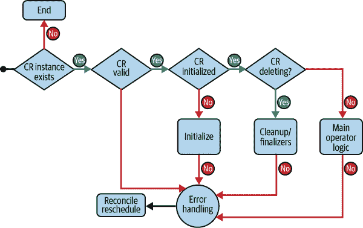

# 第二十一章：实施操作员

Kubernetes 的一个关键原则是它能够通过系统的操作员扩展到核心 API 之外。许多人（包括本作者）认为这种可扩展性是 Kubernetes 在市场上占主导地位的推动因素。随着开发人员开始创建能够在 Kubernetes 上运行的应用程序，操作员开发了辅助应用程序，这些应用程序知道如何调用 Kubernetes API 并自动化大部分维持应用程序稳定所需的常规工作。许多这些应用程序是 bash 脚本或在集群中运行的辅助容器。

2016 年，由 CoreOS（现为 Red Hat）领导的关键 Kubernetes 贡献者小组提出了操作员模式，以便更轻松地开发和实施 Kubernetes 应用程序。操作员模式概述了一种打包、部署和维护与 Kubernetes API 和客户端工具（如`kubectl`）集成的应用程序的方式。通过操作员，应用程序开发人员可以本地创建能够在 Kubernetes 中运行的应用程序，与现有的 Kubernetes 流程集成，并嵌入机构知识。这种知识不仅限于部署应用程序，还允许在复杂系统中实现平滑升级、跨不同服务的对账、自定义缩放过程以及嵌入可观察性，这推动了框架在 Kubernetes 生态系统中的接受。

本章的目标不是教你如何编写操作员。关于这个主题有许多资源可供参考，涵盖比单独一章更深入的内容。这里的目标是介绍概念，并解释何时以及为何将操作员实施到你的环境中，同时分享一些需要计划的关键考虑因素。

# 操作员的关键组成部分

[操作员框架](https://oreil.ly/YG0gU)本身是一个开源工具包，具有明确定义的软件开发工具包（SDK）、生命周期管理和发布工具。一些项目围绕操作员模式的概念构建，使社区开发更加简便。Kubernetes 社区的 API Machinery SIG 成员赞助开发了 kubebuilder，提供了与操作员的两个主要组件（自定义资源定义（CRDs）和控制器）配合使用的基础 SDK。作为社区的一部分，由 Google 赞助，kubebuilder 正被定位为所有操作员和其他项目（如 KUDO、KubeOps 和 Kopf）的基础 SDK。本章的示例将基于 kubebuilder 语法进行讨论，但在现有的许多操作员 SDK 中，概念非常相似。

# 自定义资源定义

在实际操作中，仅使用本机 Kubernetes 资源定义复杂应用程序依赖和资源通常具有挑战性。平台工程师通常必须构建复杂的 yaml 模板，并使用渲染流水线和额外的资源如 jobs 和 init containers 来管理运行大型应用程序所需的大部分定制。但是，自定义资源定义允许开发人员扩展 Kubernetes API 以提供新的资源类型，从而更好地声明应用程序的资源需求。

Kubernetes 允许使用 `CustomResourceDefinition` 接口动态注册新资源，并将根据您指定的版本自动注册新的 RESTful 资源路径。与许多内置于 Kubernetes 中的资源不同，CRD 可以独立维护并根据需要进行更新。CRD 将在 `spec` 字段下定义资源的规范，并将使用 `spec.scope` 定义从 CRD 创建的自定义资源是命名空间范围的还是集群范围的。在我们看到 CRD 及其自定义资源实现之前，了解 Kubernetes API 的命名规范是很重要的。

### Kubernetes API 对象、资源、版本、组和类型

Kubernetes 中的对象是在系统中持久保存以表示集群状态的实际实体。对象本身是集群内标准 CRUD 操作的操作对象。实质上，对象将是在状态中的整个资源定义，如 Pod 或 PersistentVolume。

Kubernetes 资源是 API 中表示特定类型对象集合的端点。因此，一个 Pod 资源将包含一组 Pod 对象。可以在集群中轻松看到这一点：

```
kubectl api-versions
NAME              SHORTNAMES  APIVERSION                NAMESPACED  KIND
bindings                      v1                        true        Binding
componentstatu... cs          v1                        false       ComponentS...
configmaps        cm          v1                        true        ConfigMap
edited for space
mutatingwebhoo...             admissionregistration...  false       MutatingWe...
validatingwebh...             admissionregistration...  false       Validating...
customresource... crd,crds    apiextensions.k8s.io/...  false       CustomReso...
apiservices                   apiregistration.k8s.i...  false       APIService
controllerrevi...             apps/v1                   true        Controller...
daemonsets        ds          apps/v1                   true        DaemonSet
deployments       deploy      apps/v1                   true        Deployment
replicasets       rs          apps/v1                   true        ReplicaSet
statefulsets      sts         apps/v1                   true        StatefulSet
```

组将具有类似关注点的对象聚合在一起。此组合结合版本控制允许单独管理同一组内的对象并根据需要进行更新。该组在对象的 `apiVersion` 字段中以 RESTful 路径表示。在 Kubernetes 中，核心组（也称为遗留组）将位于 */api/REST* 路径下。通常在 Pod 规范或 Deployment yaml 中的 `apiVersion` 字段中可以看到基本路径被移除，例如：

```
kind: Deployment
apiVersion: apps/v1
metadata:
  name: sample
spec:
  selector:
    matchLabels:
```

就像任何良好的 API 一样，Kubernetes 的 API 是经过版本化处理的，并支持使用不同的 API 路径来支持多个版本。在 Kubernetes 版本控制方面有指导原则，自定义资源的版本化应使用相同的指导原则。API 也可以根据其支持或稳定性划分为不同级别，因此您通常会看到 Alpha、Beta 或 Stable API。例如，在集群中，您可能会看到相同组的 `v1` 和 `v1beta1` 版本：

```
kubectl api-versions
---- excerpt
autoscaling/v1
autoscaling/v2
autoscaling/v2beta1
autoscaling/v2beta2
```

通常，Kind 和 Resource 在同一语境中使用；然而，资源是 Kind 的具体实现。通常存在直接的 Kind 到 Resource 的关系，例如在定义`kind: Pod`规范时，将在集群中创建一个 Pod 资源。偶尔也会有一对多的关系，例如`Scale` kind，可以由不同的资源如`Deployment`或`ReplicaSet`返回。这称为子资源。

将这些原则结合起来，我们可以开始为客户资源建模我们的 API。在本章的其余部分，将使用 kubebuilder 生成的片段，但实际代码并不重要，只是部分表述。重点将放在讨论的概念及其与实现 Operator 时的最佳实践之间的关系。

# 创建我们的 API

可以手动创建 YAML 格式的客户资源定义；然而，kubebuilder 和其他 Operator SDK 会根据提供的代码自动为您生成 API 定义。在 kubebuilder 中，您可以在项目初始化后创建 API 的脚手架和所需的 Go 代码。要初始化项目，一旦满足 kubebuilder 及其先决条件，您可以从新目录运行`init`命令，其中将包含您的项目文件：

```
$ kubebuilder init --domain platform.evillgenius.com
    --repo platform.evillgenius.com/platformapp --project-name=pe-app
Writing kustomize manifests for you to edit...
Writing scaffold for you to edit...
Get controller runtime:
$ go get sigs.k8s.io/controller-runtime@v0.14.1
go: downloading sigs.k8s.io/controller-runtime v0.14.1
go: downloading k8s.io/apimachinery v0.26.0
....................................................... removed for brevity ...
Update dependencies:
$ go mod tidy
go: downloading github.com/go-logr/zapr v1.2.3
go: downloading go.uber.org/zap v1.24.0
go: downloading github.com/onsi/ginkgo/v2 v2.6.0
go: downloading github.com/onsi/gomega v1.24.1
go: downloading gopkg.in/check.v1 v1.0.0-20200227125254-8fa46927fb4f
go: downloading github.com/niemeyer/pretty v0.0.0-20200227124842-a10e7caefd8e
Next: define a resource with:
$ kubebuilder create api
```

这将创建一些基本文件和占位符样板代码：

```
$ tree
.
├── config
│   ├── default
│   │   ├── kustomization.yaml
│   │   ├── manager_auth_proxy_patch.yaml
│   │   └── manager_config_patch.yaml
│   ├── manager
│   │   ├── kustomization.yaml
│   │   └── manager.yaml
│   ├── prometheus
│   │   ├── kustomization.yaml
│   │   └── monitor.yaml
│   └── rbac
│       ├── auth_proxy_client_clusterrole.yaml
│       ├── auth_proxy_role_binding.yaml
│       ├── auth_proxy_role.yaml
│       ├── auth_proxy_service.yaml
│       ├── kustomization.yaml
│       ├── leader_election_role_binding.yaml
│       ├── leader_election_role.yaml
│       ├── role_binding.yaml
│       └── service_account.yaml
├── Dockerfile
├── go.mod
├── go.sum
├── hack
│   └── boilerplate.go.txt
├── main.go
├── Makefile
├── PROJECT
└── README.md
```

完成后，您可以通过运行以下命令创建 API 定义的脚手架：

```
$ kubebuilder create api --group egplatform --version v1alpha1 --kind EGApp
Create Resource [y/n]
y
Create Controller [y/n]
y
Writing kustomize manifests for you to edit...
Writing scaffold for you to edit...
api/v1alpha1/egapp_types.go
controllers/egapp_controller.go
Update dependencies:
$ go mod tidy
Running make:
$ make generate
mkdir -p /home/eddiejv/dev/projects/operators/platformapp/bin
test -s /home/eddiejv/dev/projects/operators/platformapp/bin/controller-gen
  && /home/eddiejv/dev/projects/operators/platformapp/bin/controller-gen
  --version | grep -q v0.11.1 || \
GOBIN=/home/eddiejv/dev/projects/operators/platformapp/bin
  go install sigs.k8s.io/controller-tools/cmd/controller-gen@v0.11.1
go: downloading sigs.k8s.io/controller-tools v0.11.1
go: downloading github.com/spf13/cobra v1.6.1
go: downloading github.com/gobuffalo/flect v0.3.0
go: downloading golang.org/x/tools v0.4.0
go: downloading k8s.io/utils v0.0.0-20221107191617-1a15be271d1d
go: downloading github.com/mattn/go-colorable v0.1.9
/home/eddiejv/dev/projects/operators/platformapp/bin/controller-gen
  object:headerFile="hack/boilerplate.go.txt" paths="./..."
Next: implement your new API and generate the manifests (e.g. CRDs,CRs) with:
$ make manifests
```

这将添加一个 API、bin 和 controllers 目录，并更新其他目录以包含更多样板代码。主要工作的两个文件是 *api/<version>/<kind>_types.go* 和 *controllers/<kind>_controller.go*。

要开始修改您的 API 以映射到您在 CRD 中希望表达的资源，您需要在 *api/<version>/<kind>_types.go* 文件中为新对象创建的结构体添加新字段。因此，在我们的示例中，我们添加以下内容：

```
type EGAppSpec struct {
    // INSERT ADDITIONAL SPEC FIELDS - desired state of cluster
    // Important: Run "make" to regenerate code after modifying this file

    // Foo is an example field of EGApp. Edit egapp_types.go to remove/update
    Foo string `json:"foo,omitempty"`

}

// EGAppStatus defines the observed state of EGApp
// +kubebuilder:subresource:status
type EGAppStatus struct {
    // INSERT ADDITIONAL STATUS FIELD - define observed state of cluster
    // Important: Run "make" to regenerate code after modifying this file

}
```

> ###### 注意
> ###### 
> 如果您不是 Go 程序员，不用担心，因为还有其他项目如 Java Operator SDK 和 Kopf，可以帮助您用 Java 或 Python 构建 Operator。Operator Framework SDK 还支持从 Ansible 或 Helm 创建 Operator。

继续上面的示例，我们希望向规范添加特定字段，并且还有一个状态。要更新规范，可以添加如下信息：

```
type EGAppSpec struct {
    // INSERT ADDITIONAL SPEC FIELDS - desired state of cluster
    // Important: Run "make" to regenerate code after modifying this file

    // AppId is the unique AppId match to internal catalog systems
    AppId string `json:"appId,omitempty"`

    // +kubebuilder:validation:Enum=java;python;go
    Framework string `json:"framework"`

    // +kubebuilder:validation:Optional
    // +kubebuilder:validation:Enum=lowMem;highMem;highCPU;balanced
    // +kubebuilder:default="lowMem"
    InstanceType string `json:"instanceType"`

    // +kubebuilder:validation:Enum=dev;stage;prod
    Environment string `json:"environment"`

    // +kubebuilder:validation:Optional
    // +kubebuilder:default:=1
    ReplicaCount int32 `json:"replicaCount"`
}

// EGAppStatus defines the observed state of EGApp
// +kubebuilder:subresource:status
type EGAppStatus struct {
    // INSERT ADDITIONAL STATUS FIELD - define observed state of cluster
    // Important: Run "make" to regenerate code after modifying this file

    Pods []string `json:"pods"`
}
```

这里重要的是，我们将定义应用程序中的信息映射到数据类型中，并给它们提供 JSON 表示。看起来像是注释的 `// +kubebuilder:` 行是 kubebuilder 使用的标记注释，根据提供的信息生成代码。例如，我们声明给 kubebuilder 生成所有必要的代码，以确保 `Framework` 字段根据 Java、Python 或 Go 的三个可能字符串进行验证。这就是为什么在 `kubebuilder create api` 命令的末尾指出，对 API 所做的任何更改都需要 `make generate` 来更新所有其他所需的生成代码，以及 `make manifests` 来更新所有 yaml 清单的样板代码。这将为您提供一个起始的 CRD，看起来类似于这样：

```
apiVersion: apiextensions.k8s.io/v1
kind: CustomResourceDefinition
metadata:
  annotations:
    controller-gen.kubebuilder.io/version: v0.11.1
  creationTimestamp: null
  name: egapps.egplatform.platform.evillgenius.com
spec:
  group: egplatform.platform.evillgenius.com
  names:
    kind: EGApp
    listKind: EGAppList
    plural: egapps
    singular: egapp
  scope: Namespaced
  versions:
  - name: v1alpha1
    schema:
      openAPIV3Schema:
        description: EGApp is the Schema for the egapps API
        properties:
          apiVersion:
            description: 'APIVersion defines the versioned schema of this
              representation of an object. Servers should convert recognized
              schemas to the latest internal value, and may reject unrecognized
              values. More info: https://git.k8s.io/community/contributors/
              devel/sig-architecture/api-conventions.md#resources'
            type: string
          kind:
            description: 'Kind is a string value representing the REST resource
              this object represents. Servers may infer this from the endpoint
              the client submits requests to. Cannot be updated. In CamelCase.
              More info: https://git.k8s.io/community/contributors/devel/
              sig-architecture/api-conventions.md#types-kinds'
            type: string
          metadata:
            type: object
          spec:
            description: EGAppSpec defines the desired state of EGApp
            properties:
              appId:
                description: Foo is an example field of EGApp. Edit
                  egapp_types.go to remove/update
                type: string
              environment:
                enum:
                - dev
                - stage
                - prod
                type: string
              framework:
                enum:
                - java
                - python
                - go
                type: string
              instanceType:
                default: lowMem
                enum:
                - lowMem
                - highMem
                - highCPU
                - balanced
                type: string
              replicaCount:
                default: 1
                format: int32
                type: integer
            required:
            - environment
            - framework
            type: object
          status:
            description: EGAppStatus defines the observed state of EGApp
            properties:
              pods:
                items:
                  type: string
                type: array
            required:
            - pods
            type: object
        type: object
    served: true
    storage: true
    subresources:
      status: {}
```

你会注意到，kubebuilder 还添加了 OpenAPI 验证信息，因此 CR 可以根据 CRD 的要求进行验证。 Kubebuilder 还允许通过 webhook 使用逻辑创建额外的验证器。通过实现 Defaulter 和/或 Validator 接口，kubebuilder 提供了代码生成来创建 webhook 服务器，并将其注册到控制器管理器中。使用 kubebuilder CLI 可以轻松地再次生成此脚手架：

```
$ kubebuilder create webhook --group egplatform --version v1alpha1 --kind EGApp
    --defaulting --programmatic-validation
```

我们可以使用 kubebuilder 轻松部署这个自定义资源：

```
$ make install
test -s /home/eddiejv/dev/projects/operators/platformapp/bin/controller-gen &&
/home/eddiejv/dev/projects/operators/platformapp/bin/controller-gen --version |
grep -q v0.11.1 || \
GOBIN=/home/eddiejv/dev/projects/operators/platformapp/bin go install
sigs.k8s.io/controller-tools/cmd/controller-gen@v0.11.1/home/eddiejv/dev/
projects/operators/platformapp/bin/controller-gen rbac:roleName=manager-role
crd webhook paths="./..." output:crd:artifacts:config=config/crd/bases
/home/eddiejv/dev/projects/operators/platformapp/bin/kustomize build config/crd
| kubectl apply -f -
customresourcedefinition.apiextensions.k8s.io/
egapps.egplatform.platform.evillgenius.com created
```

然后我们可以从 `kubectl` 命令中看到，egapp 资源现在已安装在集群中，并且我们可以看到资源本身的结构：

```
$ kubectl explain egapp --recursive
KIND:     EGApp
VERSION:  egplatform.platform.evillgenius.com/v1alpha1

DESCRIPTION:
     EGApp is the Schema for the egapps API

FIELDS:
   apiVersion   <string>
   kind <string>
   metadata     <Object>
      annotations       <map[string]string>
      creationTimestamp <string>
      deletionGracePeriodSeconds        <integer>
      deletionTimestamp <string>
      finalizers        <[]string>
      generateName      <string>
      generation        <integer>
      labels    <map[string]string>
      managedFields     <[]Object>
         apiVersion     <string>
         fieldsType     <string>
         fieldsV1       <map[string]>
         manager        <string>
         operation      <string>
         subresource    <string>
         time   <string>
      name      <string>
      namespace <string>
      ownerReferences   <[]Object>
         apiVersion     <string>
         blockOwnerDeletion     <boolean>
         controller     <boolean>
         kind   <string>
         name   <string>
         uid    <string>
      resourceVersion   <string>
      selfLink  <string>
      uid       <string>
   spec <Object>
      appId     <string>
      environment      <string>
      framework <string>
      instanceType      <string>
      replicaCount      <integer>
   status       <Object>
      pods      <[]string>
```

现在 API 已经在集群中创建并安装了，但它实际上什么也做不了。在这个阶段，如果我们创建一个 yaml 文件并将其部署到命名空间中，它将在 etcd 中创建一个条目，并按照 yaml 中指定的信息进行设置，但在创建控制器之前，什么也不会发生。现在让我们探索一下控制器是如何工作的。

# Controller Reconciliation

当创建 API 时，控制器代码也会一并创建，并具有开始构建所需的调和逻辑所需的大部分样板代码。请注意，这里代码本身并不重要，但理解幕后发生的事情对于理解 Operator 能够做什么至关重要。控制器代码位于 *controllers/<kind>_controller.go* 文件中。`Reconcile` 方法是应该添加逻辑的地方。在我们深入了解之前，需要制定一个调和计划，并理解各个阶段。这在 Figure 21-1 中展示。



###### Figure 21-1\. 操作员概览

Operator 是监视与 Operator 模式关注的资源类型相关事件的服务。当事件满足条件（在 Operator 模式中称为谓词）时，Operator 开始将期望状态调和到运行状态的过程。在调和过程中，实现任何决定如何处理状态更改的逻辑；无论具体发生了什么变化，调和周期都会处理。这被称为基于级别的触发，虽然效率较低，但非常适合像 Kubernetes 这样的复杂分布式系统。

在 Operator 中，开发者将会在`Reconcile`方法中编写 图 21-2 中所代表的逻辑：

1.  是否存在自定义资源的实例？

1.  如果需要，进行一些验证。

1.  如果有效，则检查状态是否需要更改并进行更改。

如果正在删除资源，则在此处还实现了处理清理的逻辑。

如果您的 CR 实现了其他资源，而这些资源并非直接属于它，您应该实现一个`Finalizer`来处理这些资源的清理工作，并阻止 CR 在最终器完成其处理之前被删除。例如，这经常用于在云服务提供商上创建资源的 CR 或具有某些回收策略的 PersistentVolumes，在 PV 被视为已删除之前需要执行该策略。



###### 图 21-2\. 调和逻辑

# 资源验证

设计高效 Operator 的一个重要方面是验证所请求资源的有效性。正如前述的，有几种方法可以根据 API 规范验证资源；然而，重要的是在流程中构建冗余，以确保一致的行为。验证的第一层应该是在 CRD 规范中定义的 OpenAPI 验证。该验证将阻止 CR 作为资源传递到 etcd 服务器，并导致有害的后果。第二层验证应该是一个验证接入控制器实现，通过 webhook 请求检查资源是否符合 API 规范。这再次阻止资源传递到 API 服务器。在调和循环代码中添加一些验证逻辑也是一种有效的策略，但重要的是要理解，这将是针对集群状态中已存在的资源进行验证，因此需要适当的错误处理。通常，这作为一个`IsValid`方法来实现，该方法调用与验证 Webhook 实现相同的验证逻辑。

# 控制器实现

如果我们继续使用到目前为止的示例，我们的控制器的逻辑将如下所示：

```
// +kubebuilder:rbac:groups=egplatform.platform.evillgenius.com,
  resources=egapps,verbs=get;list;watch;create;update;patch;delete
// +kubebuilder:rbac:groups=egplatform.platform.evillgenius.com,
  resources=egapps/status,verbs=get;update;patch
// +kubebuilder:rbac:groups=egplatform.platform.evillgenius.com,
  resources=egapps/finalizers,verbs=update

// Reconcile is part of the main Kubernetes reconciliation loop which aims to
// move the current state of the cluster closer to the desired state.
// TODO(user): Modify the Reconcile function to compare the state specified by
// the EGApp object against the actual cluster state, and then
// perform operations to make the cluster state reflect the state specified by
// the user.
//
// For more details, check Reconcile and its Result here:
// - https://pkg.go.dev/sigs.k8s.io/controller-runtime@v0.14.1/pkg/reconcile
func (r *EGAppReconciler) Reconcile(ctx context.Context, req ctrl.Request)
  (ctrl.Result, error) {
    _ = log.FromContext(ctx)

    // TODO(user): your logic here
    logger := log.Log.WithValues("EGApp", req.NamespacedName)
    logger.Info("EGApp Reconcile started...")

    // fetch the EGApp CR instance
    egApp := &egplatformv1alpha1.EGApp{}

    err := r.Get(ctx, req.NamespacedName, egApp)
    if err != nil {
        if errors.IsNotFound(err) {
            logger.Info("EGApp resource not found. Object must be deleted")
            return ctrl.Result{}, nil
        }
        logger.Error(err, "Failed to get EGApp")
        return ctrl.Result{}, nil
    }
    // check if the deployment already exists, if not create a new one
    found := &appsv1.Deployment{}
    err = r.Get(ctx, types.NamespacedName{Name: egApp.Name, Namespace:
      egApp.Namespace}, found)
    if err != nil {
        dep := r.deploymentForEGApp(egApp)
        logger.Info("Creating a  new deployment", "Deployment.Namespace",
          dep.Namespace, "Deployment.Name", dep.Name)
        err = r.Create(ctx, dep)
        if err != nil {
            logger.Error(err, "Failed to create new deployment",
              "Deployment.Namespace", dep.Namespace, "Deployment.Name", dep.Name)
            return ctrl.Result{}, err
        }
        return ctrl.Result{}, nil
    } else if err != nil {
        logger.Error(err, "Failed to get deployment")
        return ctrl.Result{}, nil
    }
    // This point, we have the deployment object created
    // Ensure the deployment size is same as the spec
    replicas := egApp.Spec.ReplicaCount
    if *found.Spec.Replicas != replicas {
        found.Spec.Replicas = &replicas
        err = r.Update(ctx, found)
        if err != nil {
            logger.Error(err, "Failed to update Deployment",
              "Deployment.Namespace", found.Namespace, "Deployment.Name",
              found.Name)
            return ctrl.Result{}, err
        }
        // Spec updated return and requeue
        // Requeue for any reason other than an error
        return ctrl.Result{Requeue: true}, nil
    }

    // Update the egApp status with pod names
    // List the pods for this egApp's deployment
    podList := &corev1.PodList{}
    listOpts := []client.ListOption{
        client.InNamespace(egApp.Namespace),
        client.MatchingLabels(egApp.GetLabels()),
    }

    if err = r.List(ctx, podList, listOpts...); err != nil {
        logger.Error(err, "Failed to list pods", "egApp.Namespace",
          egApp.Namespace, "egApp.Name", egApp.Name)
        return ctrl.Result{}, err
    }
    podNames := getPodNames(podList.Items)

    // Update status.Pods if needed
    if !reflect.DeepEqual(podNames, egApp.Status.Pods) {
        egApp.Status.Pods = podNames
        err := r.Status().Update(ctx, egApp)
        if err != nil {
            logger.Error(err, "Failed to update egApp status")
            return ctrl.Result{}, err
        }
    }

    return ctrl.Result{}, nil
}

func (r *EGAppReconciler) deploymentForEGApp(m *egplatformv1alpha1.EGApp)
  *appsv1.Deployment {
    ls := m.GetLabels()
    replicas := m.Spec.ReplicaCount

    deploy := &appsv1.Deployment{
        ObjectMeta: metav1.ObjectMeta{
            Name:      m.Name,
            Namespace: m.Namespace,
        },
        Spec: appsv1.DeploymentSpec{
            Replicas: &replicas,
            Selector: &metav1.LabelSelector{
                MatchLabels: ls,
            },
            Template: corev1.PodTemplateSpec{
                ObjectMeta: metav1.ObjectMeta{
                    Labels: ls,
                },
                Spec: corev1.PodSpec{
                    Containers: []corev1.Container{{
                        Image: "gcr.io/kuar-demo/kuard-amd64:1",  // hard-coded
                          here, make this dynamic
                        Name:  m.Spec.AppId,
                        Ports: []corev1.ContainerPort{{
                            ContainerPort: 8080,
                            Name:          "http",
                        }},
                    }},
                },
            },
        },
    }
    ctrl.SetControllerReference(m, deploy, r.Scheme)
    return deploy
}

// Utility function to iterate over pods and return the names slice
func getPodNames(pods []corev1.Pod) []string {
    var podNames []string
    for _, pod := range pods {
        podNames = append(podNames, pod.Name)
    }
    return podNames
}

// SetupWithManager sets up the controller with the Manager.
func (r *EGAppReconciler) SetupWithManager(mgr ctrl.Manager) error {
    return ctrl.NewControllerManagedBy(mgr).
        For(&egplatformv1alpha1.EGApp{}).
        Complete(r)
}
```

这些主要步骤通过协调进程实现。参考的两个重要点是：

+   自定义资源实际上创建了部署。如果未找到特定实例，则使用 CR 规范中的值创建部署所需的数据。`ctrl.SetControllerReference(m, deploy, r.scheme)` 是在此处通过 CR 获取部署所有权的位置。这允许资源在被删除时清理其所有权下的任何部署。

+   更新资源的状态，并列出与部署相关联的一组 pod。此更新通过在代码行 `err := r.Status().Update(ctx, egApp)` 上创建的 CR 子资源 `status.pods` 完成。这非常重要，因为它将不会在未增加 `ResourceGeneration` 元数据字段的事件上更新我们的资源状态。通过在观察期间实现一个谓词，可以确保在无操作情况下不会重复整个循环。

一旦实现了控制器逻辑，可以使用 kubebuilder 在本地运行代码以测试其是否与先前部署到集群的 CR 规范匹配，并且在准备好投入运行时，还可以将其打包为容器并部署到集群中。

具体内容如下：

```
$ make run
test -s /home/eddiejv/dev/projects/operators/platformapp/bin/controller-gen &&
/home/eddiejv/dev/projects/operators/platformapp/bin/controller-gen --version
| grep -q v0.11.1 || \
GOBIN=/home/eddiejv/dev/projects/operators/platformapp/bin go install
sigs.k8s.io/controller-tools/cmd/controller-gen@v0.11.1
/home/eddiejv/dev/projects/operators/platformapp/bin/controller-gen
rbac:roleName=manager-role crd webhook paths="./..."
output:crd:artifacts:config=config/crd/bases
/home/eddiejv/dev/projects/operators/platformapp/bin/controller-gen
object:headerFile="hack/boilerplate.go.txt" paths="./..."
go fmt ./...
go vet ./...
go run ./main.go
2023-02-24T11:07:21-06:00 INFO controller-runtime.metrics Metrics server is
  starting to listen {"addr": ":8080"}
2023-02-24T11:07:21-06:00 INFO setup starting manager
2023-02-24T11:07:21-06:00 INFO Starting server {"path": "/metrics", "kind":
  "metrics", "addr": "[::]:8080"}
2023-02-24T11:07:21-06:00 INFO Starting server {"kind": "health probe",
  "addr": "[::]:8081"}
2023-02-24T11:07:21-06:00 INFO Starting EventSource {"controller": "egapp",
  "controllerGroup": "egplatform.platform.evillgenius.com", "controllerKind":
  "EGApp", "source": "kind source: *v1alpha1.EGApp"}
2023-02-24T11:07:21-06:00 INFO Starting Controller {"controller": "egapp",
  "controllerGroup": "egplatform.platform.evillgenius.com", "controllerKind":
  "EGApp"}
2023-02-24T11:07:21-06:00 INFO Starting workers {"controller": "egapp",
  "controllerGroup": "egplatform.platform.evillgenius.com", "controllerKind":
  "EGApp", "worker count": 1}
```

日志显示控制器已启动并正在侦听事件。然后使用以下命令将 CR 部署到集群中：

```
apiVersion: egplatform.platform.evillgenius.com/v1alpha1
kind: EGApp
metadata:
  labels:
    app.Kubernetes.io/name: egapp
    app.Kubernetes.io/instance: egapp-sample
    app.Kubernetes.io/part-of: pe-app
    app.Kubernetes.io/managed-by: kustomize
    app.Kubernetes.io/created-by: pe-app
  name: egapp-sample
spec:
  appId: egapp-sample
  framework: go
  instanceType: lowMem
  environment: dev
  replicaCount: 2
```

控制器日志显示协调循环开始，并因为部署不存在而创建了部署：

```
2023-02-24T11:12:46-06:00 INFO EGApp Reconcile started... {"EGApp":
  "default/egapp-sample"}
2023-02-24T11:12:46-06:00 INFO Creating a  new deployment {"EGApp":
  "default/egapp-sample", "Deployment.Namespace": "default", "Deployment.Name":
  "egapp-sample"}
```

然后在实例上调用 `kubectl delete`，控制器开始另一个协调循环并删除对象：

```
2023-02-24T11:21:39-06:00 INFO EGApp Reconcile started... {"EGApp":
  "default/egapp-sample"}
2023-02-24T11:21:39-06:00 INFO EGApp resource not found. Object must
  be deleted {"EGApp": "default/egapp-sample"}
```

在控制器和 API 本身的上下文中可以完成更多工作，例如实现围绕清理的复杂逻辑，如调用备份、在节点之间重新平衡工作负载、使用自定义逻辑进行扩展等。这是工程师对系统行为、部署方式以及在问题发生时如何响应的深入了解的体现。运算符模式的好处就在于这个代码示例中。

# 运算符生命周期

开发运算符并非易事，但不必回答应用程序的所有运行问题。开发应侧重解决重要障碍，然后通过版本迭代以逐步增强运算符的能力。CoreOS 和 RedHat 团队合作制定了称为[运算符能力级别](https://oreil.ly/X_Lun)的完整能力谱，概述了运算符在不同级别成熟时应解决的主要问题。这些问题包括：

基本安装

自动应用程序供应和配置管理

无缝升级

支持补丁和次要版本升级

完整生命周期

应用程序生命周期、存储生命周期（备份、故障恢复）

深入洞察

指标、警报、日志处理和工作负载分析

自动驾驶

横向/纵向扩展、自动配置调优、异常检测、调度调优

这是规划运算符生命周期的坚实框架。重点是，运算符应像任何软件一样具有定义的生命周期、产品管理、弃用策略和清晰一致的版本控制。

## 版本升级

在我们的示例中，我们从`v1alphav1`作为 CRD 支持的声明版本开始。在运算符的生命周期中，可能需要支持多个版本，这取决于 API 的阶段和稳定性。

引入新版本时，应谨慎遵循一套流程，以确保现有资源不会出现问题。自定义资源对象将需要能够由 CRD 的所有定义版本提供服务。这意味着服务的版本与状态中存储的版本可能不匹配。应在自定义资源对象上实施转换过程，以便在存储的版本和提供的版本之间进行转换。当转换涉及模式更改或自定义逻辑时，可以使用转换 Webhook 来执行所需的更新。当不需要模式或自定义逻辑时，默认使用 None 转换策略，因为只会更改 apiVersion 字段。

您将在 CRD 中添加一个转换策略字段，并将其指向监听特定资源的 Webhook。这看起来像这样：

```
apiVersion: apiextensions.k8s.io/v1
kind: CustomResourceDefinition
...
spec:
  ...
  conversion:
    strategy: Webhook
    webhook:
      clientConfig:
        service:
          namespace: egapp-conversion
          name: egapp
          path: /egapp-conversion
          port: 8081
        caBundle: "Hf8j0Kw...<base64-encoded PEM bundle>...tLS0K"
...
```

## 运算符最佳实践

开发和持续维护运算符并不是一件小事，应该非常谨慎地考虑和规划。许多时候，使用简单的范式（如 Helm 图表、Kustomize 存储库或 Terraform 模块）来打包应用程序更容易。当需要包含特殊的调和逻辑来维护应用程序或减轻用户的负担时，运算符模式可能是有意义的。如果决定构建一个运算符，则应遵循最佳实践指南：

+   不要过载运算符来管理多个应用程序，每个控制它控制的 CRD。

+   如果您的运算符管理多个 CRD，则运算符也应具有多个控制器。保持简单：每个 CRD 一个控制器。

+   运算符不应特定于它们监视资源的命名空间，也不应特定于它们将部署的命名空间。

+   运算符应使用[语义化版本](https://semver.org)，作为 Kubernetes API 的扩展，它们还应遵循与版本更改相关的[Kubernetes API 版本控制指南](https://oreil.ly/O-5lH)。

+   CRD 应遵循 OpenAPI 规范以允许使用已知模式。大多数基于 Operator SDK 的工具将提供一种基于 OpenAPI 规范创建样板 CRD 的方法，以便更容易开发它们。

+   与任何 Kubernetes 服务一样，操作者本身应遵循良好的安全指南，如以非 root 用户运行，最小权限 RBAC 和可观察性。指标和日志应该是系统外部的。操作者应该被仪表化，以便能够看到操作者的健康状态和任何已知的服务水平指标（SLIs）。可以利用诸如 Prometheus、DataDog、Cloud Operations 和 OpenTelemetry 的度量输出。

+   操作者不会安装其他操作者，也不应注册自己的 CRD，因为这些资源对集群是全局的，并且需要为操作者提升的特权。

+   在接受请求之前，检查所有 CRD 的有效性。可以根据已知的模式（如 OpenAPI 验证模式）或通过可以验证 CRD 的准入控制器来验证 CRD。这些方法将防止资源浪费空间在 etcd 上，因为它将不会被提交到 API。还应该在对账循环中增加一些验证逻辑，作为最后一次努力来验证和清理资源。

+   当操作者不再需要时，应自动清理。删除后正确清理资源非常重要，不仅适用于操作者直接创建的资源，还适用于可能已为操作者的应用程序需求创建的任何外部资源（例如，用于与 pod 上附加的存储相关的 PV、集群外的外部资源等）。

+   仔细考虑操作者的生命周期以及在向现有版本的用户升级路径引入破坏性更改时的时机。实施转换 Webhook，允许转换到特定版本和从特定版本转换，以确保在将资源从 vX 转换为 vY 并再次转换回 vX 时不会丢失信息。

+   在由操作者管理的资源上写入状态信息时需要慎重。客户资源是用户了解资源状态的唯一接口。通过控制器向资源写入清晰简明的状态，用户可以轻松使用现有的 Kubernetes 客户端工具查询和操作状态。状态应作为子资源实现，并应使用谓词，以免在更新后未增加主资源的 `ResourceGeneration` 元数据字段后触发对账循环。

# 摘要

自动化部署和应用的“第二天”运维的承诺，已经使得运算符市场不再仅仅是实验性质，而成为 Kubernetes 生态系统中的关键特性。当组织需要支持复杂应用时，应使用运算符，但在存在更简单机制时要小心创建它们。利用软件供应商创建的现有运算符来帮助支持和维护它们，许多可以在 [operatorhub.io](https://oreil.ly/wMLSA) 找到。虽然运算符模式可以是一个非常强大的工具，但需要承诺，以确保它不会制造更多问题而非解决问题。所有警告都不在话下，如果您正在基于 Kubernetes 构建大型应用平台，那么运算符模式应该是减少运维工作的重要工具。
