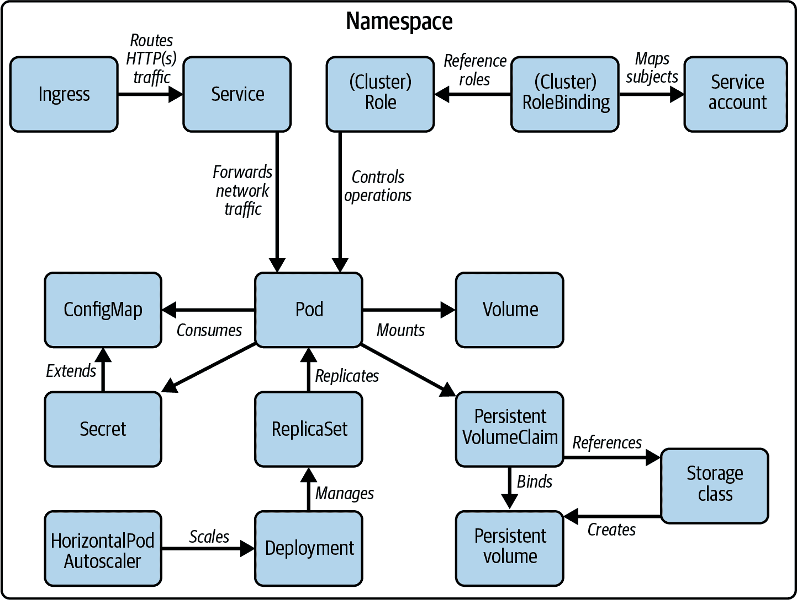

# 第一章：考试详细信息和资源

本介绍章节解答了考生在准备 [Certified Kubernetes Administrator (CKA)](https://oreil.ly/7G8Jm) 考试时常问的最紧迫的问题。我们将讨论认证的目标受众、课程内容、考试环境以及技巧和额外的学习资源。如果您已熟悉认证项目，可以直接跳到任何涵盖技术概念的章节。

# 考试目标

Kubernetes 集群需要由熟练的专业人士安装、配置和维护。这就是 Kubernetes 管理员的工作。CKA 认证项目验证了对工作中遇到的典型管理任务的深入理解，特别是 Kubernetes 集群的维护、网络、存储解决方案以及故障排除应用程序和集群节点。

# 考试中使用的 Kubernetes 版本

在撰写本文时，考试基于 Kubernetes 1.23 版本。本书中的所有内容都将遵循该特定版本的特性、API 和命令行支持。未来版本可能会破坏向后兼容性。在准备认证时，请查阅 [Kubernetes 发行说明](https://oreil.ly/DUGrM)，并使用考试中使用的 Kubernetes 版本进行实践，以避免不愉快的意外。

# 课程

以下概述列出了 CKA 的高级部分及其分数权重：

+   25%: 集群架构、安装和配置

+   15%: 工作负载和调度

+   20%: 服务和网络

+   10%: 存储

+   30%: 故障排除

CKA 课程在 2020 年 9 月经历了重大的 [改革](https://oreil.ly/WYnzL)。重新组织和优化考试领域的原因之一是新的 [Certified Kubernetes Security Specialist (CKS) 认证](https://oreil.ly/Oxpg9)。大部分与安全相关的主题已经转移到 CKS，而 CKA 则继续关注典型的管理活动和特性。

###### 注意

本书的大纲完全按照 CKA 课程的要求进行编写。尽管学习 Kubernetes 通常会有更自然、更教学化的组织结构，但课程大纲将帮助考生通过专注于特定主题来准备考试。因此，根据您的现有知识水平，您可能会发现自己需要交叉参考本书的其他章节。

让我们在接下来的章节中详细分解每个领域。

## 集群架构、安装和配置

课程的这一部分涉及与 Kubernetes 集群相关的各种内容。这包括理解 Kubernetes 集群的基本架构，如控制平面与工作节点、高可用设置以及安装、升级和维护集群的工具。您需要演示从头开始安装集群、升级集群版本以及备份/恢复 etcd 数据库的过程。Cloud Native Computing Foundation（CNCF）还决定在本节中添加一个不太相关的主题：管理基于角色的访问控制（RBAC）。RBAC 是每个管理员都应该理解如何设置和应用的重要概念。

## 工作负载和调度

管理员需要深入了解用于操作云原生应用的 Kubernetes 概念。章节“工作负载和调度”满足了这一需求。您需要熟悉部署（Deployments）、副本集（ReplicaSets）以及由 ConfigMaps 和 Secrets 指定的配置数据。创建新的 Pod 时，Kubernetes 调度器将对象放置在可用节点上。节点亲和性和污点/容忍度等调度规则控制并优化行为。在考试中，您只需要理解 Pod 资源限制对调度的影响。此外，您需要熟悉命令式和声明式清单管理，以及像 Kustomize、`yq`和 Helm 等常见模板工具。

## 服务和网络

云原生微服务很少独立运行。在大多数情况下，它需要与其他微服务或外部系统进行交互。理解 Pod 间通信、将应用程序暴露到集群外部以及配置集群网络对管理员来说至关重要，以确保系统正常运行。在考试的这一部分，您需要展示对 Kubernetes 基元服务（Service）和入口（Ingress）的知识。

## 存储

本节涵盖了用于读写数据的不同类型卷。作为管理员，您需要知道如何创建和配置它们。持久卷确保即使在集群节点重新启动后数据也能永久保留。您需要了解其运作机制，并演示如何将持久卷挂载到容器中的路径上。确保您理解静态绑定和动态绑定之间的区别。

## 故障排除

当然，在生产 Kubernetes 集群中可能会出现问题。有时，应用程序可能会运行不正常，变得无响应，甚至无法访问。其他时候，集群节点可能会崩溃或遇到配置问题。开发有效的故障排除策略非常重要，以便尽快解决这些情况。考试的这一部分分数权重最高。您将面对典型场景，需要通过采取适当措施来解决问题。

# 涉及的 Kubernetes 基元

考试的主要目的是测试你对 Kubernetes 原语的实际知识。考试预计会将多个概念结合到一个问题中。参考图 1-1 作为适用的 Kubernetes 资源及其关系的大致指南。



###### 图 1-1\. 与考试相关的 Kubernetes 原语

# 考试环境和提示

要参加 CKA 考试，你必须购买一张凭证作为注册。凭证可以在[CNCF 培训和认证网页](https://oreil.ly/tkBY1)上获取。偶尔，CNCF 会在美国感恩节左右提供凭证折扣。这些折扣信息通常会在 Twitter 账号[@LF_Training](https://oreil.ly/TDBVP)上公布。

拿着凭证，你可以安排考试时间。在预定考试的当天，你会收到一封电子邮件，里面有一个提供给你的 URL，要求你登录测试平台。你需要打开你的电脑音视频设备以防作弊。监考员将通过音视频监控你的行为，如果认为你没有遵守规则，将会终止考试。

# 考试尝试

你购买的凭证允许你有两次尝试通过 CKA 考试的机会。我建议你在第一次尝试考试之前做出合理的准备。这将给你通过考试的公平机会，同时也会给你一个对考试环境和问题复杂性的良好印象。如果第一次未能通过考试，不要担心，你还有第二次机会。

CKA 考试限时两小时。在这段时间内，你需要在一个真实的、预定义的 Kubernetes 集群上解决实际问题。每个问题都会说明你需要在哪个集群上工作。通过实际方法来评估候选人的技能集要比多项选择题的测试更为优越，因为你可以直接将知识转化为工作中执行的任务。

你可以打开额外的浏览器标签来浏览官方 Kubernetes 文档资料。这些页面包括[*https://oreil.ly/w0vib*](https://oreil.ly/w0vib)，[*https://oreil.ly/XLYLj*](https://oreil.ly/XLYLj)，和[*https://oreil.ly/1sr3B*](https://oreil.ly/1sr3B)及其子域。你可以创建书签并在考试期间打开它们，只要它们属于上述 URL 范围内。

尽管随手拿到 Kubernetes 文档页面非常有价值，确保你知道*在*哪里找到这些页面中的相关信息。在考试准备过程中，至少要彻底阅读一次所有文档页面。不要错过官方文档页面的搜索功能。

# 使用文档的高效方法

使用搜索术语可能会比浏览菜单项更快地找到正确的文档页面。从文档复制粘贴代码片段到考试环境的控制台中通常效果不错。有时，您可能需要手动调整 YAML 缩进，因为在这个过程中可能会丢失正确的格式。

我强烈建议阅读[CKA 考试常见问题解答](https://oreil.ly/xJeV8)。您将在那里找到大多数紧迫问题的答案，包括计算机系统要求、评分、认证更新和重考要求。

# 候选人技能

该认证假定您已经具备 Kubernetes 的基本理解。您应熟悉 Kubernetes 的内部机制、核心概念以及命令行工具 `kubectl`。CNCF 为 Kubernetes 初学者提供免费的[“介绍 Kubernetes”课程](https://oreil.ly/U48YJ)，以及更高级主题的培训课程。

CKA 考试假定您在管理员角色中工作，并且每天都面临典型的维护任务。除了命令行工具 `kubectl`，您还需要熟悉其他与操作 Kubernetes 集群相关的工具。以下内容概述了工具的使用情况。

Kubernetes 架构和概念

考试可能要求您从零开始安装 Kubernetes 集群。了解 Kubernetes 的基础知识及其架构组件是必要的。在考试中不要期望遇到任何多项选择题。

`kubectl` 命令行工具

考试中，您将主要使用 `kubectl` 命令行工具与 Kubernetes 集群进行交互。即使您只有很少的时间来准备考试，练习如何操作 `kubectl` 以及其命令及相关选项也是必不可少的。在考试期间将无法访问[Web 仪表板 UI](https://oreil.ly/Fizsg)。

Kubernetes 集群维护工具

从零开始安装 Kubernetes 集群和升级现有集群的 Kubernetes 版本，使用工具 `kubeadm` 完成。了解其使用方法和相关流程对于顺利进行操作非常重要。此外，还需深入了解工具 `etcdctl`，包括其用于备份和恢复 etcd 数据库的命令行选项。

其他相关工具

Kubernetes 对象由 YAML 或 JSON 表示。本书的内容只会使用 YAML 示例，因为在 Kubernetes 的世界中，它比 JSON 更常用。在考试中，您将需要编辑 YAML 以声明性地创建新对象或在修改现有对象的配置时。确保您对基本的 YAML 语法、数据类型和符合规范的缩进有很好的掌握。您可能会问如何编辑 YAML 定义？当然是从终端。考试终端环境预装了 `vi` 和 `vim` 工具。练习常见操作的键盘快捷键（特别是如何退出编辑器）。我想提到的最后一个工具是 GNU Bash。您必须理解脚本语言的基本语法和运算符。当与集群节点交互时，具有良好的 Linux 和 shell 命令行工作知识将非常有帮助。

# 时间管理

考生有两个小时的时间完成考试。至少需要有 66%的问题答案是正确的。许多问题由多个步骤组成。虽然 Linux Foundation 没有提供分数细分，但我认为部分正确的答案仍然可以得到部分分数。

在参加考试时，您会注意到规定的时间限制会给您带来很大压力。这是有意的。Linux Foundation 希望 Kubernetes 从业者能够通过及时找到解决问题的方法来将其知识应用于实际场景。

CKA 考试将向您呈现各种问题。有些问题简短且易解决；另一些则需要更多背景信息和时间。就个人而言，我尝试首先解决简单的问题，以尽可能多地获得分数，而不会陷入更难的问题中。我在考试环境中集成的记事本功能中记下了任何我无法立即解决的问题。在第二轮中，重新访问您跳过的问题，并尝试解决它们。在最理想的情况下，您将能够在规定的时间内解决所有问题。

# 命令行技巧与窍门

考虑到命令行将成为您与 Kubernetes 集群的唯一接口，因此您必须非常熟悉 `kubectl`、`kubeadm`、`etcdctl` 及其可用选项。本节涉及一些使它们的使用更高效和生产力更强的窍门和技巧。

## 设置上下文和命名空间

CKA 考试环境为您预先设置了六个 Kubernetes 集群。请查看[说明](https://oreil.ly/SM8d6)，以了解这些集群的高级技术概述。每个考试题目都需要在指定的集群上解决，详细描述如下。此外，说明还会要求您在除了`default`之外的命名空间中工作。在处理问题之前，确保首先设置上下文和命名空间是必要的操作。以下命令一次性设置上下文和命名空间：

```
$ kubectl config set-context *<context-of-question>* \
  --namespace=*<namespace-of-question>*
$ kubectl config use-context *<context-of-question>*
```

## 使用 kubectl 的别名

在考试过程中，您将不得不执行`kubectl`命令数十甚至数百次。您可能是一个极快的键盘打字员，但是反复完整拼写可执行文件并无意义。设置`kubectl`命令的别名要高效得多。以下`alias`命令将字母`k`映射到完整的`kubectl`命令：

```
$ alias k=kubectl
$ k version
```

您可以重复相同的过程，为其他命令行工具如`kubeadm`和`etcdctl`设置别名，以进一步减少输入量。考试环境已为`kubectl`命令设置了别名。

## 使用 kubectl 命令自动补全

熟记`kubectl`命令和命令行选项需要大量实践。在考试期间，您可以配置 bash 自动补全。具体指南在 Kubernetes 文档的“Linux 上的 bash 自动补全”部分中有详细说明。确保理解在设置自动补全所需时间与手动输入命令和选项之间的权衡。

## 内化资源简称

许多`kubectl`命令可能非常冗长。例如，管理持久卷索赔的命令是`persistentvolumeclaims`。必须完整拼写命令可能会出错且耗时。幸运的是，某些较长的命令具有简略形式的用法。命令`api-resources`列出所有可用命令及其简称：

```
$ kubectl api-resources
NAME                    SHORTNAMES  APIGROUP  NAMESPACED  KIND
...
persistentvolumeclaims  pvc                   true        PersistentVolumeClaim
...
```

在这里使用`pvc`而不是`persistentvolumeclaims`会导致更简洁和更具表现力的命令执行：

```
$ kubectl describe pvc my-claim
```

## 删除 Kubernetes 对象

某些情况需要您删除现有的 Kubernetes 对象。例如，在考试期间，您可能希望从头开始进行任务，因为您可能出现配置错误，或者您可能需要更改需要重新创建而不是修改现有对象的运行时配置。执行`delete`命令时，Kubernetes 尝试优雅地删除目标对象，以尽量减少对最终用户的影响。如果对象无法在默认的优雅期限（30 秒）内删除，则 kubelet 会尝试强制终止该对象。

在 CKA 考试期间，不必考虑最终用户的影响。最重要的目标是在候选人授予的时间内完成所有任务。因此，等待对象被优雅删除是浪费时间的。您可以使用 `--force` 选项立即强制删除对象。以下命令使用 `SIGKILL` 信号杀死名为 `nginx` 的 Pod：

```
$ kubectl delete pod nginx --force
```

## 查找对象信息

作为管理员，您经常会面临需要调查 Kubernetes 集群中失败情况的情况。该集群可能已经运行由一组不同对象类型组成的工作负载。CKA 考试将模拟故障场景，以测试您的故障排除技能。

列出特定类型的对象有助于识别问题的根本原因；但是，您需要确保搜索相关信息。您可以结合 `describe` 和 `get` 命令与 Unix 命令 `grep`，通过搜索词过滤对象。`grep` 命令的 `-C` 命令行选项在搜索词之前和之后呈现上下文配置。

以下命令展示了它们的用法。第一个命令查找所有具有注解键值对 `author=John Doe` 的 Pod，并显示周围 10 行。第二个命令搜索所有 Pod 的 YAML 表示形式，以查找其标签，并显示输出的前后五行：

```
$ kubectl describe pods | grep -C 10 "author=John Doe"
$ kubectl get pods -o yaml | grep -C 5 labels:
```

## 发现命令选项

Kubernetes 文档内容广泛，涵盖了生态系统的最重要方面，包括 Kubernetes 资源的 API 参考。虽然搜索功能大大缩短了通过搜索词查找相关信息的时间，但您可能需要进一步浏览结果页面。

另一条路线是使用 `kubectl` 内置的帮助功能，使用命令行选项 `--help`。该选项呈现命令和子命令的详细信息，包括选项和示例。以下命令演示了 `--help` 选项用于 `create` 命令的用法：

```
$ kubectl create --help
Create a resource from a file or from stdin.

JSON and YAML formats are accepted.

Examples:
  ...

Available Commands:
  ...

Options:
  ...
```

此外，您可以使用 `explain` 命令探索每个 Kubernetes 资源的可用字段。作为参数，提供您想要呈现详细信息的对象的 [JSONPath](https://oreil.ly/34Op9)。以下示例列出了 Pod 的 `spec` 的所有字段：

```
$ kubectl explain pods.spec
KIND:     Pod
VERSION:  v1

RESOURCE: spec <Object>

DESCRIPTION:
  ...

FIELDS:
  ...
```

# 练习和练习考试

在通过考试时，动手实践是非常重要的。为此，您需要一个正常运行的 Kubernetes 集群环境。以下选项显著突出：

+   确定您的雇主是否已设置了 Kubernetes 集群，并且是否允许您使用它进行练习。

+   对于练习 Kubernetes 集群节点的安装或升级过程，我发现使用 [Vagrant](https://oreil.ly/2jLJS) 和 [VirtualBox](https://oreil.ly/3BhDj) 运行一个或多个虚拟机非常有用。这些工具帮助创建一个隔离的 Kubernetes 环境，可以根据需要快速启动和丢弃。本书中的一些练习就是从这种设置开始的。

+   在你的开发者机器上安装 Kubernetes 是一个快速简便的设置方法。Kubernetes 文档根据你的操作系统提供了各种 [安装选项](https://oreil.ly/JrBUh)。当涉及到像 Ingress 或存储类这样的更高级功能时，Minikube 尤其有用。

+   如果你是 [O’Reilly 学习平台](https://oreil.ly/xOtTT) 的订阅用户，你可以无限制地访问在 [Katacoda 中运行 Kubernetes 环境的场景](https://oreil.ly/gYiVj)。

你可能还想尝试以下付费学习和实践资源：

+   [*认证 Kubernetes 应用开发者（CKAD）学习指南*](https://oreil.ly/QBcho)（O’Reilly）涵盖了 CKAD 认证的课程内容；然而，考虑到 CKAD 和 CKA 的课题重叠，你会在其中找到有用的信息。

+   [认证 Kubernetes 管理员（CKA）认证准备：基础知识](https://oreil.ly/oqnRq) 是 LinkedIn Learning 上的视频课程，专注于学习技巧。

+   [Killer Shell](https://killer.sh) 是一个模拟器，提供所有 Kubernetes 认证的示例练习。

+   [带实践测试的认证 Kubernetes 管理员（CKA）](https://oreil.ly/QWQFP) 提供了涵盖考试相关主题的视频，以及一个集成的实践环境。你需要购买订阅才能访问内容，但内容非常全面、解释详细且具有操作性。

+   [Study4Exam 的 CKA 实践考试](https://oreil.ly/uIwU9) 提供了一个商业化的基于网络的测试环境，用于评估你的知识水平。

# 概要

CKA 考试验证你在安装、维护、升级和故障排除 Kubernetes 集群方面的实际操作知识。此外，你还需要理解在 Kubernetes 环境中典型用于运行、暴露和扩展云原生应用的 Kubernetes 资源类型。考试课程将这些主题分组，分配不同的权重。你将面对一项具有挑战性的实际操作测试，需要在真实的 Kubernetes 环境中解决实际问题。Linux Foundation 没有公布特定问题解决方案如何评分的信息。可以肯定的是，部分解决方案会被计入评分。

在本章中，我们讨论了你需要了解的关于考试的一切，以便开始准备。我们涉及了考试环境、时间管理的技巧和窍门、考生需要熟悉的工具，以及额外的学习和实践资源。

以下章节与考试大纲对齐，因此您可以将内容映射到学习目标。在每章末尾，您将找到样例练习，以提升您的知识水平。
