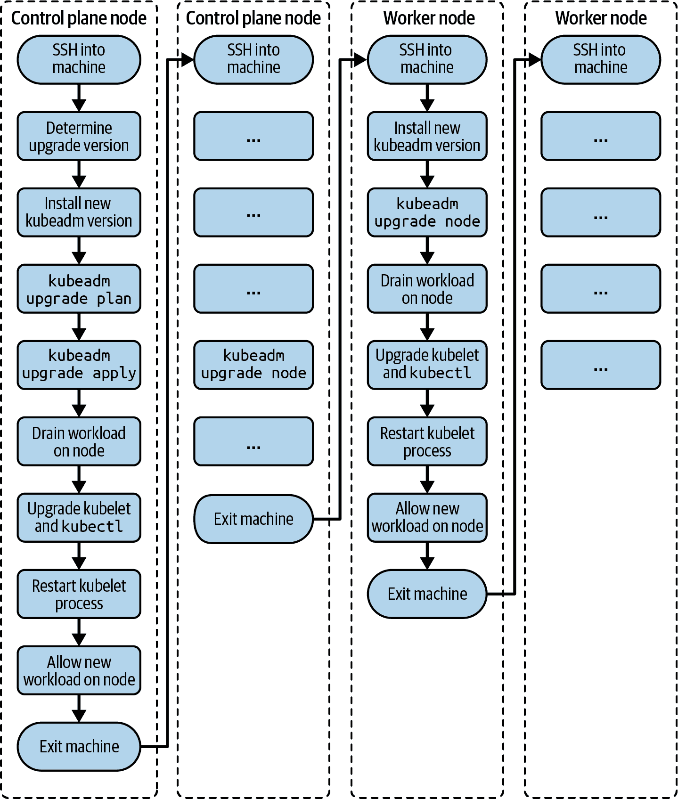

# 第二章：集群架构、安装和配置

根据章节名称，课程的第一部分涉及您对 Kubernetes 管理员预期的典型任务。这些任务包括理解 Kubernetes 集群的架构组件、从头开始设置集群以及在之后维护集群。

有趣的是，本节还涵盖了集群的安全方面，特别是基于角色的访问控制（RBAC）。您需要了解如何将操作的权限映射到一组用户或进程的 API 资源。

在本章末尾，您将了解安装和维护 Kubernetes 集群的工具和流程。此外，您还将了解如何针对典型的实际用例配置 RBAC。

高级别来看，本章涵盖以下概念：

+   理解 RBAC

+   使用`kubeadm`安装集群

+   使用`kubeadm`升级 Kubernetes 集群版本

+   使用`etcdctl`备份和恢复 etcd

+   理解高可用性的 Kubernetes 集群

# 基于角色的访问控制

在 Kubernetes 中，在允许对 API 资源进行请求之前，您需要经过身份验证。集群管理员通常可以访问所有资源和操作。操作集群的最简单方式是提供每个人一个管理员帐户。尽管“每个人都有管理员访问权限”听起来很棒，但随着业务的发展，这带来了相当大的风险。用户可能会意外删除一个 Secret Kubernetes 对象，这可能会破坏一个或多个应用程序，因此对最终用户造成巨大影响。可以想象，这种方法对运行关键应用程序的生产环境并不是一个好主意。

与其他生产系统一样，只有特定用户应该拥有完全访问权限，而大多数用户根据角色仅具有只读访问权限（并可能访问以改变系统）。例如，应用程序开发人员不需要管理集群节点。他们只需要管理运行和配置其应用程序所需的对象。

RBAC 通过允许或禁止访问管理 API 资源来定义用户、组和进程的策略。对于安全重视的任何组织而言，启用和配置 RBAC 都是必需的。考试中，您需要理解涉及的 RBAC API 资源类型以及如何在不同场景下创建和配置它们。

## RBAC 高级概述

RBAC 有助于实现多种用例：

+   建立一个允许具有不同角色的用户访问一组 Kubernetes 资源的系统

+   通过 Kubernetes API 控制运行在 Pod 中的进程及其操作

+   限制每个命名空间中某些资源的可见性

RBAC 由三个关键构建块组成，如图 2-1 所示。它们将 API 原语及其允许的操作与所谓的主体（用户、组或 ServiceAccount）连接起来。

以下列表按术语分解了职责：

主体

想要访问资源的用户或进程

资源

Kubernetes API 资源类型（例如 Deployment 或节点）

动词

可对资源执行的操作（例如创建 Pod 或删除 Service）


###### 图 2-1\. RBAC 的关键构建块

## 创建主体

在 RBAC 的上下文中，您可以使用用户帐户、服务帐户或组作为主体。用户和组不存储在 etcd、Kubernetes 数据库中，而是用于运行在集群外的进程。服务帐户作为 Kubernetes 中的对象存在，并由运行在集群内的进程使用。本节将教您如何创建它们。

### 用户帐户和组

Kubernetes 不像 API 资源那样表示用户。用户由 Kubernetes 集群的管理员管理，然后将帐户的凭据分发给真实人员或供外部进程使用。

需要对使用用户的 API 请求进行身份验证。Kubernetes 为这些 API 请求提供了多种身份验证方法。表 2-1（#authentication_strategies_for_managing_rbac_subjects）显示了管理 RBAC 主体的不同身份验证方式。

表 2-1\. 用于管理 RBAC 主体的认证策略

| 认证策略 | 描述 |
| --- | --- |
| X.509 客户端证书 | 使用 OpenSSL 客户端证书进行身份验证 |
| 基本身份验证 | 使用用户名和密码进行身份验证 |
| Bearer 令牌 | 使用 OpenID（OAuth2 的一种变体）或 Webhook 进行身份验证 |

为简化操作，以下步骤演示了使用 OpenSSL 客户端证书创建用户的过程。这些操作必须使用 cluster-admin 角色对象执行。在考试期间，您不需要自己创建用户。可以假设相关设置已为您执行。因此，您无需记忆以下步骤：

1.  登录到 Kubernetes 控制平面节点，并创建一个临时目录，用于保存生成的密钥。进入该目录：

    ```
    $ mkdir cert && cd cert
    ```

1.  使用 `openssl` 可执行文件创建私钥。提供一个具有表达性的文件名，例如 `<username>.key`：

    ```
    $ openssl genrsa -out johndoe.key 2048
    Generating RSA private key, 2048 bit long modulus
    ..............................+
    ..+
    e is 65537 (0x10001)
    $ ls
    johndoe.key
    ```

1.  在文件中创建证书签名请求（CSR），其扩展名为`.csr`。您需要提供上一步骤中的私钥。`-subj` 选项提供了用户名（CN）和组（O）。以下命令使用用户名 `johndoe` 和名为 `cka-study-guide` 的组。如果不想将用户分配到组中，请省略 /O 组件的赋值：

    ```
    $ openssl req -new -key johndoe.key -out johndoe.csr -subj \
      "/CN=johndoe/O=cka-study-guide"
    $ ls
    johndoe.csr johndoe.key
    ```

1.  最后，使用 Kubernetes 集群证书颁发机构（CA）对 CSR 进行签名。CA 通常位于目录`/etc/kubernetes/pki`中，并且需要包含文件`ca.crt`和`ca.key`。我们在这里将使用 minikube，它将这些文件存储在目录 pass:[<code>~/.minikube</code>] 中。以下命令对 CSR 进行签名，并使其在 364 天内有效：

    ```
    $ openssl x509 -req -in johndoe.csr -CA [/.minikube/ca.crt -CAkey] \
      /.minikube/ca.key -CAcreateserial -out johndoe.crt -days 364
    Signature ok
    subject=/CN=johndoe/O=cka-study-guide
    Getting CA Private Key

    ```

1.  通过在 kubeconfig 中为`johndoe`设置用户条目来在 Kubernetes 中创建用户。指向 CRT 和 key 文件。在 kubeconfig 中为`johndoe`设置上下文条目：

    ```
    $ kubectl config set-credentials johndoe \
      --client-certificate=johndoe.crt --client-key=johndoe.key
    User "johndoe" set.
    $ kubectl config set-context johndoe-context --cluster=minikube \
      --user=johndoe
    Context "johndoe-context" modified.
    ```

1.  要切换到名为`johndoe-context`的上下文，请使用命令`config current-context`检查当前上下文：

    ```
    $ kubectl config use-context johndoe-context
    Switched to context "johndoe-context".
    $ kubectl config current-context
    johndoe-context
    ```

### ServiceAccount

用户代表一个真实的人，通常使用`kubectl`可执行文件或 UI 仪表板与 Kubernetes 集群进行交互。某些服务应用程序（如 [Helm](https://helm.sh) 在 Pod 内运行时）需要通过 RESTful HTTP 调用向 API 服务器发出请求与 Kubernetes 集群进行交互。例如，Helm chart 将定义业务应用程序所需的多个 Kubernetes 对象。Kubernetes 使用 ServiceAccount 通过认证令牌验证 Helm 服务进程与 API 服务器的身份。此 ServiceAccount 可以分配给 Pod 并映射到 RBAC 规则。

Kubernetes 集群已经配备了一个 ServiceAccount，即`default` ServiceAccount，位于`default`命名空间中。任何未明确分配 ServiceAccount 的 Pod 都会使用`default` ServiceAccount。

要想命令式地创建自定义 ServiceAccount，请运行`create serviceaccount`命令：

```
$ kubectl create serviceaccount build-bot
serviceaccount/build-bot created
```

创建 ServiceAccount 的声明方式非常直接。只需提供适当的`kind`和名称，如示例 2-1 所示。

##### 示例 2-1\. 定义一个 ServiceAccount 的 YAML 清单

```
apiVersion: v1
kind: ServiceAccount
metadata:
  name: build-bot
```

## 列出 ServiceAccounts

可以使用`get serviceaccounts`命令列出 ServiceAccounts。正如您在以下输出中所看到的，`default`命名空间列出了`default` ServiceAccount 和我们刚刚创建的自定义 ServiceAccount：

```
$ kubectl get serviceaccounts
NAME        SECRETS   AGE
build-bot   1         78s
default     1         93d
```

## 渲染 ServiceAccount 详细信息

在对象创建时，API 服务器会创建一个包含 API 令牌的 Secret，并将其分配给 ServiceAccount。Secret 和令牌名称使用 ServiceAccount 名称作为前缀。您可以使用`describe serviceaccount`命令查看 ServiceAccount 的详细信息，如下所示：

```
$ kubectl describe serviceaccount build-bot
Name:                build-bot
Namespace:           default
Labels:              <none>
Annotations:         <none>
Image pull secrets:  <none>
Mountable secrets:   build-bot-token-rvjnz
Tokens:              build-bot-token-rvjnz
Events:              <none>
```

因此，您应该能够找到用于`default`和`build-bot` ServiceAccount 的 Secret 对象：

```
$ kubectl get secrets
NAME                    TYPE                                  DATA   AGE
build-bot-token-rvjnz   kubernetes.io/service-account-token   3      20m
default-token-qgh5n     kubernetes.io/service-account-token   3      93d
```

## 将 ServiceAccount 分配给 Pod

要使 ServiceAccount 生效，它需要分配给运行预期进行 API 调用的应用程序的 Pod。在 Pod 创建时，您可以与`run`命令一起使用命令行选项`--serviceaccount`：

```
$ kubectl run build-observer --image=alpine --restart=Never \
  --serviceaccount=build-bot
pod/build-observer created
```

或者，您可以直接在 Pod、Deployment、Job 或 CronJob 的 YAML 清单中分配 ServiceAccount，使用字段 `serviceAccountName`。示例 2-2 展示了将 ServiceAccount 定义给 Pod 的示例。

##### 示例 2-2\. 将 ServiceAccount 分配给 Pod 的 YAML 清单

```
apiVersion: v1
kind: Pod
metadata:
  name: build-observer
spec:
  serviceAccountName: build-bot
...
```

## 理解 RBAC API 基元

有了这些关键概念，让我们来看看实现 RBAC 功能的 Kubernetes API 基元：

Role

Role API 基元声明了此规则应操作的 API 资源及其操作。例如，您可能想说“允许列出和删除 Pods”，或者您可以表达“允许监视 Pods 的日志”，甚至两者同时用相同的 Role。一旦绑定到主体，任何未显式列出的操作将被禁止。

RoleBinding

RoleBinding API 基元 *绑定* 了 Role 对象到主体(s)。这是使规则生效的粘合剂。例如，您可能想说“将允许更新服务的 Role 绑定给用户 John Doe”。

图 2-2 展示了涉及的 API 基元之间的关系。请记住，该图像仅呈现了一组选定的 API 资源类型和操作。


###### 图 2-2\. RBAC 基元

下面的章节展示了 Roles 和 RoleBindings 的命名空间范围的使用方法，但是相同的操作和属性也适用于集群范围的 Roles 和 RoleBindings，详见“命名空间范围和集群范围的 RBAC”。

## 默认面向用户的 Roles

Kubernetes 定义了一组默认的 Roles。您可以通过 RoleBinding 分配它们给主体，或根据需要定义自己的自定义 Roles。表 2-2 描述了默认的面向用户的 Roles。

表 2-2\. 默认面向用户的 Roles

| 默认 ClusterRole | 描述 |
| --- | --- |
| cluster-admin | 允许跨所有命名空间对资源进行读写访问。 |
| admin | 允许在命名空间中对资源进行读写访问，包括 Roles 和 RoleBindings。 |
| edit | 允许在命名空间中对资源进行读写访问，但不包括 Roles 和 RoleBindings。提供对 Secrets 的访问权限。 |
| view | 允许在命名空间中对资源进行只读访问，但不包括 Roles、RoleBindings 和 Secrets。 |

要定义新的 Roles 和 RoleBindings，您需要使用允许创建或修改它们的上下文，即 cluster-admin 或 admin。

## 创建 Roles

可以使用 `create role` 命令来命令式地创建 Roles。命令的最重要选项是 `--verb` 用于定义动词（即操作），以及 `--resource` 用于声明一组 API 资源。以下命令创建了一个新的 Role，允许对 Pod、Deployment 和 Service 资源进行 `list`、`get` 和 `watch` 操作：

```
$ kubectl create role read-only --verb=list,get,watch \
  --resource=pods,deployments,services
role.rbac.authorization.k8s.io/read-only created
```

对于单个命令行选项的多个动词和资源，可以声明为相应命令行选项的逗号分隔列表或作为多个参数。例如，`--verb=list,get,watch` 和 `--verb=list --verb=get --verb=watch` 执行相同的指令。您还可以使用通配符“*”引用所有动词或资源。

命令行选项`--resource-name`会列出一个或多个策略规则应用的对象名称。Pod 的名称可以是`nginx`，在这里列出其名称。提供资源名称列表是可选的。如果没有提供名称，则提供的规则适用于该资源类型的所有对象。

声明式方法可能会变得有些冗长。如您在示例 2-3 中所见，`rules`部分列出了资源和动词。具有 API 组的资源，例如使用 API 版本`apps/v1`的 Deployments，需要在属性`apiGroups`下显式声明。所有其他资源（例如 Pods 和 Services）只需使用空字符串，因为它们的 API 版本不包含组。请注意，创建角色的命令会自动确定 API 组。

##### 示例 2-3\. 一个定义 Role 的 YAML 清单

```
apiVersion: rbac.authorization.k8s.io/v1
kind: Role
metadata:
  name: read-only
rules:
- apiGroups:
  - ""
  resources:
  - pods
  - services
  verbs:
  - list
  - get
  - watch
- apiGroups:
  - apps
  resources:
  - deployments
  verbs:
  - list
  - get
  - watch
```

## 列出 Roles

一旦 Role 创建完成，可以列出其对象。Roles 列表只呈现名称和创建时间戳。列出的每个角色都不透露任何详细信息：

```
$ kubectl get roles
NAME        CREATED AT
read-only   2021-06-23T19:46:48Z
```

## 渲染 Role 详细信息

您可以使用`describe`命令检查 Role 的详细信息。输出呈现了将资源映射到其允许的动词的表格。此集群尚未创建资源，因此下面控制台输出的资源名称列表为空：

```
$ kubectl describe role read-only
Name:         read-only
Labels:       <none>
Annotations:  <none>
PolicyRule:
  Resources         Non-Resource URLs  Resource Names  Verbs
  ---------         -----------------  --------------  -----
  pods              []                 []              [list get watch]
  services          []                 []              [list get watch]
  deployments.apps  []                 []              [list get watch]
```

## 创建 RoleBindings

创建 RoleBinding 对象的命令是`create rolebinding`。要将 Role 绑定到 RoleBinding，请使用`--role`命令行选项。可以通过声明选项`--user`、`--group`或`--serviceaccount`来分配主体类型。以下命令将 RoleBinding 命名为`read-only-binding`并绑定到名为`johndoe`的用户：

```
$ kubectl create rolebinding read-only-binding --role=read-only --user=johndoe
rolebinding.rbac.authorization.k8s.io/read-only-binding created
```

示例 2-4 展示了代表 RoleBinding 的 YAML 清单。您可以从结构中看到，一个角色可以映射到一个或多个主体。数据类型是由属性`subjects`下的破折号字符指示的数组。此时，只有用户`johndoe`已分配。

##### 示例 2-4\. 一个定义 RoleBinding 的 YAML 清单

```
apiVersion: rbac.authorization.k8s.io/v1
kind: RoleBinding
metadata:
  name: read-only-binding
roleRef:
  apiGroup: rbac.authorization.k8s.io
  kind: Role
  name: read-only
subjects:
- apiGroup: rbac.authorization.k8s.io
  kind: User
  name: johndoe
```

## 列出 RoleBindings

RoleBindings 列表中最重要的信息是关联的 Role。以下命令显示了 RoleBinding `read-only-binding`已映射到 Role `read-only`：

```
$ kubectl get rolebindings
NAME                ROLE             AGE
read-only-binding   Role/read-only   24h
```

输出不提供主体的指示。您需要渲染对象的详细信息以获取更多信息，如下一节所述。

## 渲染 RoleBinding 详细信息

可以使用`describe`命令检查 RoleBindings。输出呈现主体和分配角色的表格。以下示例呈现了名为`read-only-binding`的 RoleBinding 的描述表示：

```
$ kubectl describe rolebinding read-only-binding
Name:         read-only-binding
Labels:       <none>
Annotations:  <none>
Role:
  Kind:  Role
  Name:  read-only
Subjects:
  Kind  Name     Namespace
  ----  ----     ---------
  User  johndoe
```

## 查看正在生效的 RBAC 规则

让我们看看 Kubernetes 如何对我们迄今设置的场景执行 RBAC 规则。首先，我们将使用`cluster-admin`凭据创建一个新的 Deployment。在 Minikube 中，此用户分配给上下文`minikube`：

```
$ kubectl config current-context
minikube
$ kubectl create deployment myapp --image=nginx --port=80 --replicas=2
deployment.apps/myapp created
```

现在，我们将为用户`johndoe`切换上下文：

```
$ kubectl config use-context johndoe-context
Switched to context "johndoe-context".
```

请记住，用户`johndoe`被允许列出 deployments。我们将使用`get deployments`命令验证：

```
$ kubectl get deployments
NAME    READY   UP-TO-DATE   AVAILABLE   AGE
myapp   2/2     2            2           8s
```

RBAC 规则只允许列出 Deployments、Pods 和 Services。以下命令尝试列出 ReplicaSets，结果出现错误：

```
$ kubectl get replicasets
Error from server (Forbidden): replicasets.apps is forbidden: User "johndoe" \
cannot list resource "replicasets" in API group "apps" in the namespace "default"
```

尝试使用除`list`、`get`或`watch`以外的其他动词时，会观察到类似的行为。以下命令尝试删除一个 Deployment：

```
$ kubectl delete deployment myapp
Error from server (Forbidden): deployments.apps "myapp" is forbidden: User \
"johndoe" cannot delete resource "deployments" in API group "apps" in the \
namespace "default"
```

在任何时候，您可以使用`auth can-i`命令检查用户的权限。该命令为您提供列出所有权限或检查特定权限的选项：

```
$ kubectl auth can-i --list --as johndoe
Resources          Non-Resource URLs   Resource Names   Verbs
...
pods               []                  []               [list get watch]
services           []                  []               [list get watch]
deployments.apps   []                  []               [list get watch]
$ kubectl auth can-i list pods --as johndoe
yes
```

## 命名空间范围和集群范围的 RBAC

角色和 RoleBindings 适用于特定命名空间。在创建这两个对象时，您必须指定命名空间。有时，一组角色和 Rolebindings 需要应用于多个命名空间甚至整个集群。对于集群范围的定义，Kubernetes 提供了 API 资源类型 ClusterRole 和 ClusterRoleBinding。配置元素实际上是相同的。唯一的区别是`kind`属性的值：

+   要定义集群范围的 Role，请使用命令`clusterrole`或在 YAML 清单中使用`ClusterRole`种类。

+   要定义集群范围的 RoleBinding，请使用命令`clusterrolebinding`或在 YAML 清单中使用`ClusterRoleBinding`种类。

## 聚合 RBAC 规则

可以聚合现有的 ClusterRoles 以避免不必要地重新定义新的组合规则集，这可能导致指令的重复。例如，假设您想将一个面向用户的角色与自定义角色合并。聚合的 ClusterRole 可以通过标签选择合并规则，而无需将现有规则复制粘贴到一个文件中。

假设我们定义了两个示例中显示的集群角色，2-5 和 2-6。集群角色`list-pods`允许列出 Pods，而集群角色`delete-services`允许删除 Services。

##### 示例 2-5\. 定义用于列出 Pods 的 ClusterRole 的 YAML 清单

```
apiVersion: rbac.authorization.k8s.io/v1
kind: ClusterRole
metadata:
  name: list-pods
  namespace: rbac-example
  labels:
    rbac-pod-list: "true"
rules:
- apiGroups:
  - ""
  resources:
  - pods
  verbs:
  - list
```

##### 示例 2-6\. 定义用于删除 Services 的 ClusterRole 的 YAML 清单

```
apiVersion: rbac.authorization.k8s.io/v1
kind: ClusterRole
metadata:
  name: delete-services
  namespace: rbac-example
  labels:
    rbac-service-delete: "true"
rules:
- apiGroups:
  - ""
  resources:
  - services
  verbs:
  - delete
```

要聚合这些规则，ClusterRole 可以指定一个 `aggregationRule`。这个属性描述了标签选择规则。示例 2-7 展示了一个通过 `matchLabels` 条件数组定义的聚合 ClusterRole。ClusterRole 不会添加自己的规则，如 `rules:` `[]` 所示；但是，没有限制因素会阻止它。

##### 示例 2-7\. 使用聚合规则定义 ClusterRole 的 YAML 清单

```
apiVersion: rbac.authorization.k8s.io/v1
kind: ClusterRole
metadata:
  name: pods-services-aggregation-rules
  namespace: rbac-example
aggregationRule:
  clusterRoleSelectors:
  - matchLabels:
      rbac-pod-list: "true"
  - matchLabels:
      rbac-service-delete: "true"
rules: []
```

通过描述对象可以验证 ClusterRole 的正确聚合行为。您可以在以下输出中看到，`list-pods` 和 `delete-services` 这两个 ClusterRole 都已经被考虑进去了：

```
$ kubectl describe clusterroles pods-services-aggregation-rules -n rbac-example
Name:         pods-services-aggregation-rules
Labels:       <none>
Annotations:  <none>
PolicyRule:
  Resources  Non-Resource URLs  Resource Names  Verbs
  ---------  -----------------  --------------  -----
  services   []                 []              [delete]
  pods       []                 []              [list]
```

有关 ClusterRole 标签选择规则的更多信息，请参阅 [官方文档](https://oreil.ly/J6k3m)。页面还解释了如何聚合默认用户面向的 ClusterRole。

# 创建和管理 Kubernetes 集群

当考虑 Kubernetes 管理员的典型任务时，我确信以下至少一种基本活动会浮现在脑海中：

+   引导控制平面节点

+   引导工作节点并将它们加入集群

+   升级集群到较新版本

执行集群引导操作的低级命令行工具称为 `kubeadm`。它不适用于提供基础设施。这是像 Ansible 和 Terraform 这样的基础设施自动化工具的用途。要安装 `kubeadm`，请按照官方 Kubernetes 文档中的 [安装说明](https://oreil.ly/gKq4m) 进行操作。

虽然在 CKA 常见问题（FAQ）页面中没有明确说明，但可以假定 `kubeadm` 可执行文件已经预先安装好了。接下来的章节将高层次地描述创建和管理 Kubernetes 集群的流程，并且将大量使用 `kubeadm`。有关每个任务的详细信息，请参阅逐步 Kubernetes 参考文档。

## 安装集群

Kubernetes 集群的最基本拓扑结构包括一个既作为控制平面又作为工作节点的单节点。默认情况下，许多面向开发者的 Kubernetes 安装，如 minikube 或 Docker Desktop，从这种配置开始。虽然单节点集群可能是 Kubernetes 实验场的一个不错选择，但出于可扩展性和高可用性的考虑，它并不是一个良好的基础。至少，您希望创建一个带有单个控制平面和一个或多个节点处理工作负载的集群。

本节说明了如何使用单个控制平面和一个工作节点安装集群。您可以重复工作节点安装过程，以向集群添加更多工作节点。您可以在官方 Kubernetes 文档的 [安装步骤](https://oreil.ly/8visY) 中找到完整描述。图 2-3 说明了安装过程。


###### 图 2-3\. 集群安装流程图

### 初始化控制平面节点后

首先在控制平面节点上初始化控制平面。控制平面是负责托管 API 服务器、etcd 和其他重要组件以管理 Kubernetes 集群的机器。

使用 `ssh` 命令打开交互式 shell 到名为 `kube-control-plane` 的运行 Ubuntu 18.04.5 LTS 的控制平面节点：

```
$ ssh kube-control-plane
Welcome to Ubuntu 18.04.5 LTS (GNU/Linux 4.15.0-132-generic x86_64)
...
```

使用 `kubeadm init` 命令初始化控制平面。您需要添加以下两个命令行选项：使用 `--pod-network-cidr` 选项为 Pod 网络提供 IP 地址范围。使用 `--apiserver-advertise-address` 选项可以声明 API 服务器将要监听的 IP 地址。

控制台输出显示了一个 `kubeadm join` 命令。请将该命令保留以备后用。这是后续步骤中将工作节点加入集群的重要步骤。

# 获取工作节点的加入命令

如果您丢失了 `join` 命令，可以在控制平面节点上运行 `kubeadm token create --print-join-command` 来获取它。

以下命令使用 `172.18.0.0/16` 作为无类域间路由（CIDR）的地址范围，API 服务器使用 IP 地址 `10.8.8.10`：

```
$ sudo kubeadm init --pod-network-cidr 172.18.0.0/16 \
  --apiserver-advertise-address 10.8.8.10
...
To start using your cluster, you need to run the following as a regular user:

  mkdir -p $HOME/.kube
  sudo cp -i /etc/kubernetes/admin.conf $HOME/.kube/config
  sudo chown $(id -u):$(id -g) $HOME/.kube/config

You should now deploy a pod network to the cluster.
Run "kubectl apply -f [podnetwork].yaml" with one of the options listed at:
  https://kubernetes.io/docs/concepts/cluster-administration/addons/

Then you can join any number of worker nodes by running the following on \
each as root:

kubeadm join 10.8.8.10:6443 --token fi8io0.dtkzsy9kws56dmsp \
    --discovery-token-ca-cert-hash \
    sha256:cc89ea1f82d5ec460e21b69476e0c052d691d0c52cce83fbd7e403559c1ebdac
```

`init` 命令完成后，请从控制台输出中运行必要的命令以非 root 用户身份启动集群：

```
$ mkdir -p $HOME/.kube
$ sudo cp -i /etc/kubernetes/admin.conf $HOME/.kube/config
$ sudo chown $(id -u):$(id -g) $HOME/.kube/config
```

您必须部署[容器网络接口（CNI）插件](https://oreil.ly/t6eJ7)，以便 Pod 之间可以通信。您可以从 [Kubernetes 文档](https://oreil.ly/1Y7MF) 中列出的多种网络插件中进行选择。流行的插件包括 Flannel、Calico 和 Weave Net。有时文档中会出现与插件同义的术语“add-ons”。

CKA 考试很可能要求您安装特定的 add-on。大多数安装说明存储在外部网页上，在考试期间不允许使用。请确保在官方 Kubernetes 文档中搜索相关指南。例如，您可以在[这里](https://oreil.ly/86YpI)找到 Weave Net 的安装说明。以下命令安装 Weave Net 对象：

```
$ kubectl apply -f "https://cloud.weave.works/k8s/net?k8s-version= \
  $(kubectl version | base64 | tr -d '\n')"
serviceaccount/weave-net created
clusterrole.rbac.authorization.k8s.io/weave-net created
clusterrolebinding.rbac.authorization.k8s.io/weave-net created
role.rbac.authorization.k8s.io/weave-net created
rolebinding.rbac.authorization.k8s.io/weave-net created
daemonset.apps/weave-net created

```

使用命令 `kubectl get nodes` 验证控制平面节点显示为“Ready”状态。节点从“NotReady”状态转换到“Ready”状态可能需要几秒钟时间。如果状态未发生转换，则表示节点安装存在问题。参考第七章进行故障排除策略：

```
$ kubectl get nodes
NAME                 STATUS   ROLES                  AGE   VERSION
kube-control-plane   Ready    control-plane,master   24m   v1.21.2
```

使用 `exit` 命令退出控制平面节点：

```
$ exit
logout
...
```

### 加入工作节点

工作节点负责处理由控制平面调度的工作负载。工作负载的示例包括 Pods、Deployments、Jobs 和 CronJobs。要将工作节点添加到集群中以便使用，您将需要运行一些命令，如下所述。

使用 `ssh` 命令打开到运行 Ubuntu 18.04.5 LTS 的名为 `kube-worker-1` 的工作节点的交互式 shell：

```
$ ssh kube-worker-1
Welcome to Ubuntu 18.04.5 LTS (GNU/Linux 4.15.0-132-generic x86_64)
...
```

在控制平面节点的 `kubeadm init` 控制台输出提供的 `kubeadm join` 命令。以下命令显示了一个示例。请记住，对于您来说，令牌和 SHA256 哈希将不同：

```
$ sudo kubeadm join 10.8.8.10:6443 --token fi8io0.dtkzsy9kws56dmsp \
  --discovery-token-ca-cert-hash \
  sha256:cc89ea1f82d5ec460e21b69476e0c052d691d0c52cce83fbd7e403559c1ebdac
[preflight] Running pre-flight checks
[preflight] Reading configuration from the cluster...
[preflight] FYI: You can look at this config file with \
'kubectl -n kube-system get cm kubeadm-config -o yaml'
[kubelet-start] Writing kubelet configuration to file \
"/var/lib/kubelet/config.yaml"
[kubelet-start] Writing kubelet environment file with \
flags to file "/var/lib/kubelet/kubeadm-flags.env"
[kubelet-start] Starting the kubelet
[kubelet-start] Waiting for the kubelet to perform the TLS Bootstrap...

This node has joined the cluster:
* Certificate signing request was sent to apiserver and a response was received.
* The Kubelet was informed of the new secure connection details.

Run 'kubectl get nodes' on the control plane to see this node join the cluster.

```

如果不从控制平面节点复制管理员 kubeconfig 文件，您将无法从工作节点运行 `kubectl get nodes` 命令。请按照 Kubernetes 文档中的 [说明](https://oreil.ly/AIM8a) 或重新登录到控制平面节点。在这里，我们只是要重新登录到控制平面节点。您应该看到工作节点已加入集群并处于“Ready”状态：

```
$ ssh kube-control-plane
Welcome to Ubuntu 18.04.5 LTS (GNU/Linux 4.15.0-132-generic x86_64)
...
$ kubectl get nodes
NAME                 STATUS   ROLES                  AGE     VERSION
kube-control-plane   Ready    control-plane,master   5h49m   v1.21.2
kube-worker-1        Ready    <none>                 15m     v1.21.2
```

您可以为要添加到集群的任何其他工作节点重复此过程。

## 管理高可用性集群

单控制平面集群易于安装；然而，当节点丢失时会出现问题。一旦控制平面节点不可用，运行在工作节点上的任何 ReplicaSet 由于无法与运行在控制平面节点上的调度器通信，就无法重新创建 Pod。此外，集群不再可以从外部访问（例如，通过 `kubectl`），因为无法连接到 API 服务器。

高可用性（HA）集群有助于扩展性和冗余性。在考试中，您需要基本了解如何配置它们及其影响。考虑到建立 HA 集群的复杂性，不太可能在考试中要求您执行这些步骤。要了解如何设置 HA 集群，请参阅 Kubernetes 文档中的 [相关页面](https://oreil.ly/17ZDL)。

*堆叠的 etcd 拓扑* 涉及创建两个或多个 etcd 与节点共存的控制平面节点。图 2-4 显示了具有三个控制平面节点的拓扑表示。


###### 图 2-4\. 具有三个控制平面节点的堆叠 etcd 拓扑

每个控制平面节点托管 API 服务器、调度器和控制器管理器。工作节点通过负载均衡器与 API 服务器通信。建议出于冗余原因操作此集群拓扑，至少需要三个控制平面节点，因为 etcd 与控制平面节点的紧密耦合。默认情况下，`kubeadm` 在将控制平面节点加入集群时会创建一个 etcd 实例。

*外部 etcd 节点*拓扑结构通过在专用机器上运行 etcd 将其与控制平面节点分离。图 2-5 展示了一个设置，其中三个控制平面节点在不同的机器上运行 etcd。


###### 图 2-5\. 外部 etcd 节点拓扑结构

类似于堆叠的 etcd 拓扑结构，每个控制平面节点托管 API 服务器、调度器和控制器管理器。工作节点通过负载均衡器与它们通信。这里的主要区别是，etcd 实例在单独的主机上运行。这种拓扑将 etcd 与其他控制平面功能解耦，因此在控制平面节点丢失时对冗余性影响较小。正如图示所示，这种拓扑结构需要的主机数是堆叠 etcd 拓扑结构的两倍。

## 升级集群版本

随着时间的推移，您会希望将现有集群的 Kubernetes 版本升级，以获取 bug 修复和新功能。必须以受控的方式执行升级过程，以避免当前执行的工作负载中断，并防止集群节点的损坏。

建议从次要版本升级到下一个更高版本（例如，从 1.18.0 到 1.19.0），或从补丁版本升级到更高版本（例如，从 1.18.0 到 1.18.3）。避免跨越多个次要版本跳跃，以避免意外副作用。您可以在官方 Kubernetes 文档中找到关于[升级步骤](https://oreil.ly/2dCfk)的完整描述。图 2-6 展示了升级过程。



###### 图 2-6\. 集群版本升级过程

### 升级控制平面节点

如前所述，Kubernetes 集群可能使用一个或多个控制平面节点来更好地支持高可用性和可扩展性问题。在升级集群版本时，需要逐个处理控制平面节点。

选择一个包含 kubeconfig 文件（位于 `/etc/kubernetes/admin.conf`）的控制平面节点，并使用 `ssh` 命令打开控制平面节点的交互式 shell。以下命令针对名为 `kube-control-plane` 的控制平面节点，运行 Ubuntu 18.04.5 LTS：

```
$ ssh kube-control-plane
Welcome to Ubuntu 18.04.5 LTS (GNU/Linux 4.15.0-132-generic x86_64)
...
```

首先，检查节点及其 Kubernetes 版本。在此设置中，所有节点都运行在版本 1.18.0 上。我们只处理一个控制平面节点和一个工作节点：

```
$ kubectl get nodes
NAME                 STATUS   ROLES    AGE     VERSION
kube-control-plane   Ready    master   4m54s   v1.18.0
kube-worker-1        Ready    <none>   3m18s   v1.18.0
```

开始升级 `kubeadm` 版本。确定您希望升级到的版本。在 Ubuntu 机器上，您可以使用以下 `apt-get` 命令。版本格式通常包括一个补丁版本（例如 `1.20.7-00`）。如果您的机器运行不同的操作系统，请查阅 Kubernetes 文档：

```
$ sudo apt update
...
$ sudo apt-cache madison kubeadm
   kubeadm |  1.21.2-00 | http://apt.kubernetes.io kubernetes-xenial/main \
   amd64 Packages
   kubeadm |  1.21.1-00 | http://apt.kubernetes.io kubernetes-xenial/main \
   amd64 Packages
   kubeadm |  1.21.0-00 | http://apt.kubernetes.io kubernetes-xenial/main \
   amd64 Packages
   kubeadm |  1.20.8-00 | http://apt.kubernetes.io kubernetes-xenial/main \
   amd64 Packages
   kubeadm |  1.20.7-00 | http://apt.kubernetes.io kubernetes-xenial/main \
   amd64 Packages
   kubeadm |  1.20.6-00 | http://apt.kubernetes.io kubernetes-xenial/main \
   amd64 Packages
   kubeadm |  1.20.5-00 | http://apt.kubernetes.io kubernetes-xenial/main \
   amd64 Packages
   kubeadm |  1.20.4-00 | http://apt.kubernetes.io kubernetes-xenial/main \
   amd64 Packages
   kubeadm |  1.20.2-00 | http://apt.kubernetes.io kubernetes-xenial/main \
   amd64 Packages
   kubeadm |  1.20.1-00 | http://apt.kubernetes.io kubernetes-xenial/main \
   amd64 Packages
   kubeadm |  1.20.0-00 | http://apt.kubernetes.io kubernetes-xenial/main \
   amd64 Packages
...
```

将`kubeadm`升级到目标版本。比如你想升级到版本`1.19.0-00`。以下一系列命令安装具有该特定版本的`kubeadm`并检查当前安装的版本以进行验证：

```
$ sudo apt-mark unhold kubeadm && sudo apt-get update && sudo apt-get install \
  -y kubeadm=1.19.0-00 && sudo apt-mark hold kubeadm
Canceled hold on kubeadm.
...
Unpacking kubeadm (1.19.0-00) over (1.18.0-00) ...
Setting up kubeadm (1.19.0-00) ...
kubeadm set on hold.
$ sudo apt-get update && sudo apt-get install -y --allow-change-held-packages \
  kubeadm=1.19.0-00
...
kubeadm is already the newest version (1.19.0-00).
0 upgraded, 0 newly installed, 0 to remove and 7 not upgraded.
$ kubeadm version
kubeadm version: &version.Info{Major:"1", Minor:"19", GitVersion:"v1.19.0", \
GitCommit:"e19964183377d0ec2052d1f1fa930c4d7575bd50", GitTreeState:"clean", \
BuildDate:"2020-08-26T14:28:32Z", GoVersion:"go1.15", Compiler:"gc", \
Platform:"linux/amd64"}
```

检查可升级到哪些版本，并验证当前集群是否可升级。你可以在以下命令的输出中看到我们可以升级到版本`1.19.12`。现在，我们将继续使用`1.19.0`：

```
$ sudo kubeadm upgrade plan
...
[upgrade] Fetching available versions to upgrade to
[upgrade/versions] Cluster version: v1.18.20
[upgrade/versions] kubeadm version: v1.19.0
I0708 17:32:53.037895   17430 version.go:252] remote version is much newer: \
v1.21.2; falling back to: stable-1.19
[upgrade/versions] Latest stable version: v1.19.12
[upgrade/versions] Latest version in the v1.18 series: v1.18.20
...
You can now apply the upgrade by executing the following command:

	kubeadm upgrade apply v1.19.12

Note: Before you can perform this upgrade, you have to update kubeadm to v1.19.12.
...
```

正如控制台输出中所述，我们将开始控制平面的升级。此过程可能需要几分钟。您可能还需要升级 CNI 插件。请按照提供者的说明获取更多信息：

```
$ sudo kubeadm upgrade apply v1.19.0
...
[upgrade/version] You have chosen to change the cluster version to "v1.19.0"
[upgrade/versions] Cluster version: v1.18.20
[upgrade/versions] kubeadm version: v1.19.0
...
[upgrade/successful] SUCCESS! Your cluster was upgraded to "v1.19.0". Enjoy!

[upgrade/kubelet] Now that your control plane is upgraded, please proceed \
with upgrading your kubelets if you haven't already done so.
```

通过驱逐工作负载来排空控制平面节点。在取消针对该节点的调度之前，任何新的工作负载都无法被调度：

```
$ kubectl drain kube-control-plane --ignore-daemonsets
node/kube-control-plane cordoned
WARNING: ignoring DaemonSet-managed Pods: kube-system/calico-node-qndb9, \
kube-system/kube-proxy-vpvms
evicting pod kube-system/calico-kube-controllers-65f8bc95db-krp72
evicting pod kube-system/coredns-f9fd979d6-2brkq
pod/calico-kube-controllers-65f8bc95db-krp72 evicted
pod/coredns-f9fd979d6-2brkq evicted
node/kube-control-plane evicted
```

将 kubelet 和`kubectl`工具升级到相同版本：

```
$ sudo apt-mark unhold kubelet kubectl && sudo apt-get update && sudo \
  apt-get install -y kubelet=1.19.0-00 kubectl=1.19.0-00 && sudo apt-mark \
  hold kubelet kubectl
...
Setting up kubelet (1.19.0-00) ...
Setting up kubectl (1.19.0-00) ...
kubelet set on hold.
kubectl set on hold.
```

重新启动 kubelet 进程：

```
$ sudo systemctl daemon-reload
$ sudo systemctl restart kubelet
```

重新启用控制平面节点，以便新的工作负载可以被调度：

```
$ kubectl uncordon kube-control-plane
node/kube-control-plane uncordoned
```

控制平面节点现在应显示 Kubernetes 1.19.0 的使用情况：

```
$ kubectl get nodes
NAME                 STATUS   ROLES    AGE   VERSION
kube-control-plane   Ready    master   21h   v1.19.0
kube-worker-1        Ready    <none>   21h   v1.18.0
```

使用`exit`命令退出控制平面节点：

```
$ exit
logout
...
```

### 升级工作节点

选择一个工作节点，并使用`ssh`命令打开到该节点的交互式 shell。以下命令针对名为`kube-worker-1`的运行 Ubuntu 18.04.5 LTS 的工作节点：

```
$ ssh kube-worker-1
Welcome to Ubuntu 18.04.5 LTS (GNU/Linux 4.15.0-132-generic x86_64)
...
```

将`kubeadm`升级到目标版本。这与前面用于控制平面节点的相同命令一样：

```
$ sudo apt-mark unhold kubeadm && sudo apt-get update && sudo apt-get install \
  -y kubeadm=1.19.0-00 && sudo apt-mark hold kubeadm
Canceled hold on kubeadm.
...
Unpacking kubeadm (1.19.0-00) over (1.18.0-00) ...
Setting up kubeadm (1.19.0-00) ...
kubeadm set on hold.
$ kubeadm version
kubeadm version: &version.Info{Major:"1", Minor:"19", GitVersion:"v1.19.0", \
GitCommit:"e19964183377d0ec2052d1f1fa930c4d7575bd50", GitTreeState:"clean", \
BuildDate:"2020-08-26T14:28:32Z", GoVersion:"go1.15", Compiler:"gc", \
Platform:"linux/amd64"}
```

升级 kubelet 配置：

```
$ sudo kubeadm upgrade node
[upgrade] Reading configuration from the cluster...
[upgrade] FYI: You can look at this config file with 'kubectl -n kube-system \
get cm kubeadm-config -o yaml'
[preflight] Running pre-flight checks
[preflight] Skipping prepull. Not a control plane node.
[upgrade] Skipping phase. Not a control plane node.
[kubelet-start] Writing kubelet configuration to file \
"/var/lib/kubelet/config.yaml"
[upgrade] The configuration for this node was successfully updated!
[upgrade] Now you should go ahead and upgrade the kubelet package using your \
package manager.

```

通过驱逐工作负载来排空工作节点。在取消针对该节点的调度之前，任何新的工作负载都无法被调度：

```
$ kubectl drain kube-worker-1 --ignore-daemonsets
node/kube-worker-1 cordoned
WARNING: ignoring DaemonSet-managed Pods: kube-system/calico-node-2hrxg, \
kube-system/kube-proxy-qf6nl
evicting pod kube-system/calico-kube-controllers-65f8bc95db-kggbr
evicting pod kube-system/coredns-f9fd979d6-7zm4q
evicting pod kube-system/coredns-f9fd979d6-tlmhq
pod/calico-kube-controllers-65f8bc95db-kggbr evicted
pod/coredns-f9fd979d6-7zm4q evicted
pod/coredns-f9fd979d6-tlmhq evicted
node/kube-worker-1 evicted
```

使用与控制平面节点相同的命令升级 kubelet 和`kubectl`工具的版本：

```
$ sudo apt-mark unhold kubelet kubectl && sudo apt-get update && sudo apt-get \
install -y kubelet=1.19.0-00 kubectl=1.19.0-00 && sudo apt-mark hold kubelet \
kubectl
...
Setting up kubelet (1.19.0-00) ...
Setting up kubectl (1.19.0-00) ...
kubelet set on hold.
kubectl set on hold.
```

重新启动 kubelet 进程：

```
$ sudo systemctl daemon-reload
$ sudo systemctl restart kubelet
```

重新启用工作节点，以便新的工作负载可以被调度：

```
$ kubectl uncordon kube-worker-1
node/kube-worker-1 uncordoned
```

现在列出的节点应显示工作节点版本 1.19.0。你无法在工作节点上运行`kubectl get nodes`，除非从控制平面节点复制管理员 kubeconfig 文件。请按照 Kubernetes 文档中的[说明](https://oreil.ly/NGHaQ)进行操作，或重新登录到控制平面节点：

```
$ kubectl get nodes
NAME                 STATUS   ROLES    AGE   VERSION
kube-control-plane   Ready    master   24h   v1.19.0
kube-worker-1        Ready    <none>   24h   v1.19.0
```

使用`exit`命令退出工作节点：

```
$ exit
logout
...
```

# 备份和恢复 etcd

Kubernetes 将集群的声明和观察状态存储在分布式 etcd 键值存储中。重要的是要制定一个备份计划，以帮助在数据损坏时恢复数据。定期进行数据备份是很重要的，以尽可能减少历史数据的丢失。

备份过程将 etcd 数据存储在所谓的快照文件中。可以随时使用此快照文件恢复 etcd 数据。可以加密快照文件以保护敏感信息。工具`etcdctl`在备份和恢复过程中是至关重要的。

作为管理员，你需要了解如何使用该工具执行这两个操作。如果控制平面节点上尚未安装`etcdctl`，则可能需要安装它。你可以在 etcd GitHub 存储库中找到[安装说明](https://oreil.ly/CrI28)。图 2-7 展示了 etcd 备份和恢复过程。


###### 图 2-7\. etcd 备份和恢复过程

根据你的集群拓扑结构，你的集群可能包含一个或多个 etcd 实例。参考“高可用集群设置”部分，了解如何设置它。以下部分解释了单节点 etcd 集群设置。你可以在官方 Kubernetes 文档中找到有关多节点 etcd 集群备份和恢复过程的[附加说明](https://oreil.ly/PvS5u)。

## etcd 的备份

使用`ssh`命令打开托管 etcd 的机器上的交互式 shell。以下命令针对名为`kube-control-plane`的控制平面节点，运行的是 Ubuntu 18.04.5 LTS：

```
$ ssh kube-control-plane
Welcome to Ubuntu 18.04.5 LTS (GNU/Linux 4.15.0-132-generic x86_64)
...
```

检查`etcdctl`的安装版本，以验证该工具是否已安装。在此节点上，版本为 3.4.14：

```
$ etcdctl version
etcdctl version: 3.4.14
API version: 3.4
```

Etcd 作为`kube-system`命名空间中的一个 Pod 部署。通过描述 Pod 来检查其版本。在下面的输出中，你会发现版本是 3.4.13-0：

```
$ kubectl get pods -n kube-system
NAME                                       READY   STATUS    RESTARTS   AGE
...
etcd-kube-control-plane                    1/1     Running   0          33m
...
$ kubectl describe pod etcd-kube-control-plane -n kube-system
...
Containers:
  etcd:
    Container ID:  docker://28325c63233edaa94e16691e8082e8d86f5e7da58c0fb54 \
    d95d68dec6e80cf54
    Image:         k8s.gcr.io/etcd:3.4.3-0
    Image ID:      docker-pullable://k8s.gcr.io/etcd@sha256:4afb99b4690b418 \
    ffc2ceb67e1a17376457e441c1f09ab55447f0aaf992fa646
...
```

相同的`describe`命令显示了 etcd 服务的配置。查找选项`--listen-client-urls`的值，以获取端点 URL。在下面的输出中，主机是`localhost`，端口是`2379`。服务器证书位于`/etc/kubernetes/pki/etcd/server.crt`，由选项`--cert-file`定义。CA 证书位于`/etc/kubernetes/pki/etcd/ca.crt`，由选项`--trusted-ca-file`指定：

```
$ kubectl describe pod etcd-kube-control-plane -n kube-system
...
Containers:
  etcd:
    ...
    Command:
      etcd
      ...
      --cert-file=/etc/kubernetes/pki/etcd/server.crt
      --key-file=/etc/kubernetes/pki/etcd/server.key
      --listen-client-urls=/etc/kubernetes/pki/etcd/server.key
      --trusted-ca-file=/etc/kubernetes/pki/etcd/ca.crt
...
```

使用`etcdctl`命令创建版本为 3 的工具备份。作为一个良好的起点，从[官方 Kubernetes 文档](https://oreil.ly/LuM2P)复制命令。提供必需的命令行选项`--cacert`、`--cert`和`--key`。因为我们在与 etcd 相同的服务器上运行命令，所以不需要`--endpoints`选项。运行命令后，文件`/tmp/etcd-backup.db`已创建：

```
$ sudo ETCDCTL_API=3 etcdctl --cacert=/etc/kubernetes/pki/etcd/ca.crt \
  --cert=/etc/kubernetes/pki/etcd/server.crt \
  --key=/etc/kubernetes/pki/etcd/server.key \
  snapshot save /opt/etcd-backup.db
{"level":"info","ts":1625860312.3468597, \
"caller":"snapshot/v3_snapshot.go:119", \
"msg":"created temporary db file","path":"/opt/etcd-backup.db.part"}
{"level":"info","ts":"2021-07-09T19:51:52.356Z", \
"caller":"clientv3/maintenance.go:200", \
"msg":"opened snapshot stream; downloading"}
{"level":"info","ts":1625860312.358686, \
"caller":"snapshot/v3_snapshot.go:127", \
"msg":"fetching snapshot","endpoint":"127.0.0.1:2379"}
{"level":"info","ts":"2021-07-09T19:51:52.389Z", \
"caller":"clientv3/maintenance.go:208", \
"msg":"completed snapshot read; closing"}
{"level":"info","ts":1625860312.392891, \
"caller":"snapshot/v3_snapshot.go:142", \
"msg":"fetched snapshot","endpoint":"127.0.0.1:2379", \
"size":"2.3 MB","took":0.045987318}
{"level":"info","ts":1625860312.3930364, \
"caller":"snapshot/v3_snapshot.go:152", \
"msg":"saved","path":"/opt/etcd-backup.db"}
Snapshot saved at /opt/etcd-backup.db
```

使用`exit`命令退出节点：

```
$ exit
logout
...
```

## 恢复 etcd

你创建了 etcd 的备份并将其存储在安全的位置。此时无需执行其他操作。实际上，这是你的保险政策，当遭遇灾难时会变得重要。在灾难场景下，etcd 中的数据被损坏或管理 etcd 的机器遇到物理存储故障时，你就需要提取 etcd 备份进行恢复。

要从备份中恢复 etcd，请使用 `etcdctl snapshot restore` 命令。至少提供 `--data-dir` 命令行选项。在这里，我们使用数据目录 `/tmp/from-backup`。运行命令后，您应该能够在目录 `/var/lib/from-backup` 中找到恢复的备份：

```
$ sudo ETCDCTL_API=3 etcdctl --data-dir=/var/lib/from-backup snapshot restore \
  /opt/etcd-backup.db
{"level":"info","ts":1625861500.5752304, \
"caller":"snapshot/v3_snapshot.go:296", \
"msg":"restoring snapshot","path":"/opt/etcd-backup.db", \
"wal-dir":"/var/lib/from-backup/member/wal", \
"data-dir":"/var/lib/from-backup", \
"snap-dir":"/var/lib/from-backup/member/snap"}
{"level":"info","ts":1625861500.6146874, \
"caller":"membership/cluster.go:392", \
"msg":"added member","cluster-id":"cdf818194e3a8c32", \
"local-member-id":"0", \
"added-peer-id":"8e9e05c52164694d", \
"added-peer-peer-urls":["http://localhost:2380"]}
{"level":"info","ts":1625861500.6350253, \
"caller":"snapshot/v3_snapshot.go:309", \
"msg":"restored snapshot","path":"/opt/etcd-backup.db", \
"wal-dir":"/var/lib/from-backup/member/wal", \
"data-dir":"/var/lib/from-backup", \
"snap-dir":"/var/lib/from-backup/member/snap"}
$ sudo ls /var/lib/from-backup
member
```

编辑 etcd Pod 的 YAML 清单，该清单位于 `/etc/kubernetes/manifests/etcd.yaml`。将属性 `spec.volumes.hostPath` 的值从原始值 `/var/lib/etcd` 更改为 `/var/lib/from-backup`：

```
$ cd /etc/kubernetes/manifests/
$ sudo vim etcd.yaml
...
spec:
  volumes:
  ...
  - hostPath:
      path: /var/lib/from-backup
      type: DirectoryOrCreate
    name: etcd-data
...
```

`etcd-kube-control-plane` Pod 将重新创建，并指向恢复的备份目录：

```
$ kubectl get pod etcd-kube-control-plane -n kube-system
NAME                      READY   STATUS    RESTARTS   AGE
etcd-kube-control-plane   1/1     Running   0          5m1s
```

如果 Pod 不能转换为“运行”状态，请尝试使用命令 `kubectl delete pod etcd-kube-control-plane -n kube-system` 手动删除它。

使用 `exit` 命令退出节点：

```
$ exit
logout
...
```

# 摘要

生产就绪的 Kubernetes 集群应该使用安全策略来控制哪些用户和进程可以管理对象。基于角色的访问控制（RBAC）定义了这些规则。RBAC 引入了特定的 API 资源，将主体映射到特定对象允许的操作。规则可以在命名空间或集群级别使用 API 资源类型 Role、ClusterRole、RoleBinding 和 ClusterRoleBinding 来定义。为了避免规则重复，可以使用标签选择来聚合 ClusterRoles。

作为 Kubernetes 管理员，您需要熟悉涉及管理集群节点的典型任务。安装新节点和升级节点版本的主要工具是 `kubeadm`。此类集群的集群拓扑可以有所不同。为了实现冗余和可扩展性的最佳结果，请考虑配置具有三个或更多控制平面节点和专用 etcd 主机的高可用设置。

定期备份 etcd 数据库以防止节点或存储损坏时关键数据的丢失是一个必要的过程。您可以使用工具 `etcdctl` 从控制平面节点或通过 API 端点备份和还原 etcd。

# 考试要点

知道如何定义 RBAC 规则。

定义 RBAC 规则涉及几个关键部分：由用户、组和 ServiceAccounts 定义的主体；命名空间和集群级别上的 RBAC 特定 API 资源；最后是允许在 Kubernetes 对象上执行相应操作的动词。练习创建主体，并学会如何将它们结合起来形成所需的访问规则。确保使用不同的组合验证正确的行为。

知道如何创建和管理 Kubernetes 集群。

安装新的集群节点和升级现有集群节点的版本是 Kubernetes 管理员执行的典型任务。您不需要记住涉及的所有步骤。文档提供了这些操作的逐步易于遵循的手册。对于升级集群版本，建议先跳过一个单个次要版本或多个补丁版本，然后再处理下一个更高版本。高可用性集群有助于实现冗余和可扩展性。在考试中，您需要理解不同的 HA 拓扑，尽管您不太可能配置其中一个，因为这个过程涉及一套不同的主机。

练习备份和恢复 etcd。

etcd 灾难恢复过程的文档并不像你预期的那样完善。动手练习几次备份和恢复过程，以掌握操作技巧。记得将控制平面节点指向恢复的快照文件以恢复数据。

# 示例练习

这些练习的解答可在附录中找到。

1.  在名为`apps`的新命名空间中创建名为`api-access`的 ServiceAccount。

1.  创建名为`api-clusterrole`的 ClusterRole，并创建名为`api-clusterrolebinding`的 ClusterRoleBinding。将上一步骤中的 ServiceAccount 映射到 API 资源`pods`，操作为`watch`、`list`和`get`。

1.  在名为`apps`的命名空间中创建一个名为`operator`的 Pod，使用镜像`nginx:1.21.1`。暴露容器端口 80。将 ServiceAccount`api-access`分配给 Pod。在命名空间`rm`中创建另一个名为`disposable`的 Pod，使用镜像`nginx:1.21.1`。不要为 Pod 分配 ServiceAccount。

1.  打开名为`operator`的 Pod 的交互式 shell。使用命令行工具`curl`调用 API 列出命名空间`rm`中的 Pods。你期望得到什么响应？使用命令行工具`curl`调用 API 删除命名空间`rm`中的 Pod`disposable`。与第一次调用相比，响应有何不同？你可以在[参考指南](https://oreil.ly/SZls9)中找到有关通过 HTTP 与 Pod 交互的信息。

1.  转到检出的 GitHub 仓库[*bmuschko/cka-study-guide*](https://oreil.ly/jUIq8)的目录*app-a/ch02/upgrade-version*。使用命令`vagrant up`启动运行集群的虚拟机。将集群的所有节点从 Kubernetes 1.20.4 升级到 1.21.2。集群包括一个名为`k8s-control-plane`的单个控制平面节点，以及三个名为`worker-1`、`worker-2`和`worker-3`的工作节点。完成后，使用`vagrant destroy -f`关闭集群。

    *先决条件:* 此练习需要安装工具[Vagrant](https://oreil.ly/sasln)和[VirtualBox](https://oreil.ly/9Cvg9)。

1.  进入已检出的 GitHub 仓库 [*bmuschko/cka-study-guide*](https://oreil.ly/jUIq8) 的目录 *app-a/ch02/backup-restore-etcd*。使用命令 `vagrant up` 启动运行集群的虚拟机（VMs）。该集群包括一个名为 `k8s-control-plane` 的控制平面节点和两个名为 `worker-1` 和 `worker-2` 的工作节点。节点 `k8s-control-plane` 上预安装了 `etcdctl` 工具。将 etcd 备份到快照文件 `/opt/etcd.bak`。从快照文件恢复 etcd。使用数据目录 `/var/bak`。完成后，使用 `vagrant destroy -f` 停止集群。

    *先决条件:* 此练习需要安装工具 [Vagrant](https://oreil.ly/sasln) 和 [VirtualBox](https://oreil.ly/9Cvg9)。
