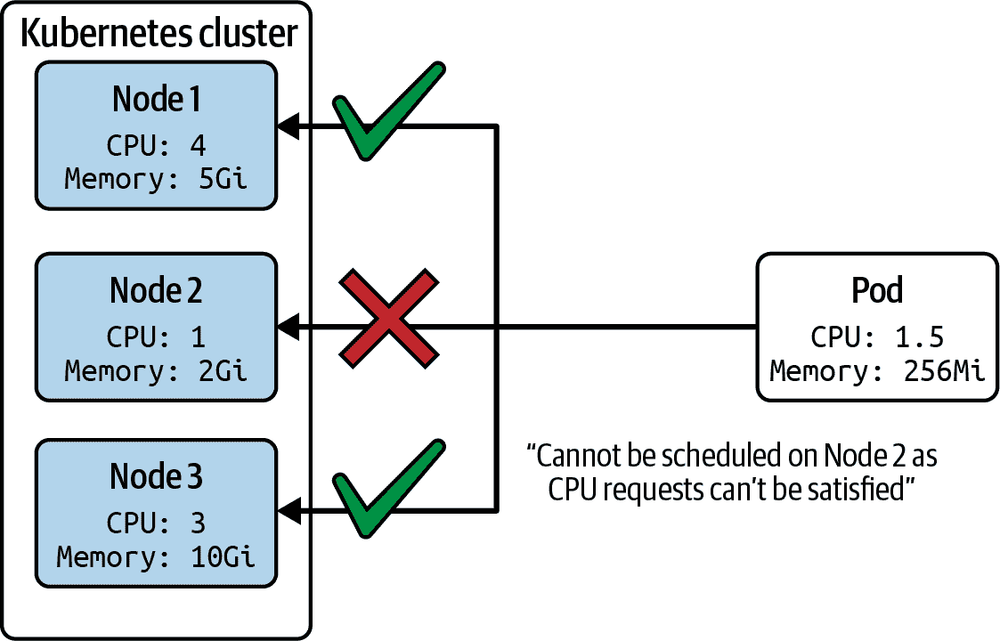

# 第四章：调度和工具

CKA 考试的调度部分关注的是在由 Kubernetes 调度程序评估时定义资源边界的影响。调度程序的默认运行行为也可以通过定义节点亲和规则以及污点和容忍度来修改。在这些概念中，你只需理解资源边界的细微差别及其在不同场景中对调度程序的影响。最后，该课程领域提到了清单管理和模板工具的高级知识。

从高层次来看，本章涵盖以下概念：

+   Pod 的资源边界

+   命令式和声明式清单管理

+   像 Kustomize、`yq`和 Helm 这样的常见模板工具

# 理解资源限制如何影响 Pod 调度

Kubernetes 集群可以由多个节点组成。根据各种规则（例如，[节点选择器](https://oreil.ly/m5eep)、[节点亲和性](https://oreil.ly/9Gf7E)、[污点和容忍度](https://oreil.ly/2SkeO)），Kubernetes 调度程序决定选择哪个节点来运行工作负载。CKA 考试并不要求你理解前述调度概念，但对它们的工作原理有个大致了解会有所帮助。

在工作负载调度中起作用的一个度量标准是由 Pod 中的容器定义的资源*请求*。常用的可以指定的资源包括 CPU 和内存。调度程序确保节点的资源容量可以满足 Pod 的资源需求。具体来说，调度程序计算 Pod 中所有容器定义的每种资源类型的资源请求总和，并将其与节点的可用资源进行比较。图 4-1 说明了基于资源请求的调度过程。



###### 图 4-1\. 基于资源请求的 Pod 调度

## 定义容器资源请求

每个 Pod 中的每个容器都可以定义自己的资源请求。表 4-1 描述了包括示例值在内的可用选项。

表格 4-1\. 资源请求选项

| YAML 属性 | 描述 | 示例值 |
| --- | --- | --- |
| `spec.containers[].resources.requests.cpu` | CPU 资源类型 | `500m`（五百毫 CPU） |
| `spec.containers[].resources.requests.memory` | 内存资源类型 | `64Mi`（2²⁶ 字节） |
| `spec.containers[].resources.requests.hugepages-<size>` | 大页面资源类型 | `hugepages-2Mi: 60Mi` |
| `spec.containers[].resources.requests.ephemeral-storage` | 临时存储资源类型 | `4Gi` |

Kubernetes 使用资源单元来管理那些不同于标准资源单位如兆字节和千兆字节的资源类型。解释所有这些单位的复杂性超出了本书的范围，但你可以在[文档](https://oreil.ly/bweuT)中详细阅读相关细节。

为了使这些资源请求的使用透明化，我们将查看一个定义示例。在示例 4-1 中显示的 Pod YAML 文件定义了两个容器，每个容器都有自己的资源请求。任何可以运行 Pod 的节点都需要支持至少 320Mi 内存容量和 1250m CPU，这是两个容器中所有资源的总和。

##### 示例 4-1\. 设置容器资源请求

```
apiVersion: v1
kind: Pod
metadata:
  name: rate-limiter
spec:
  containers:
  - name: business-app
    image: bmuschko/nodejs-business-app:1.0.0
    ports:
    - containerPort: 8080
    resources:
      requests:
        memory: "256Mi"
        cpu: "1"
  - name: ambassador
    image: bmuschko/nodejs-ambassador:1.0.0
    ports:
    - containerPort: 8081
    resources:
      requests:
        memory: "64Mi"
        cpu: "250m"
```

在这种场景中，我们正在处理一个 Minikube Kubernetes 集群，包括三个节点，一个控制平面节点和两个工作节点。以下命令列出所有节点：

```
$ kubectl get nodes
NAME           STATUS   ROLES                  AGE   VERSION
minikube       Ready    control-plane,master   12d   v1.21.2
minikube-m02   Ready    <none>                 42m   v1.21.2
minikube-m03   Ready    <none>                 41m   v1.21.2
```

在下一步中，我们将根据 YAML 文件创建 Pod。调度器会将 Pod 放置在名为`minikube-m03`的节点上：

```
$ kubectl create -f rate-limiter-pod.yaml
pod/rate-limiter created
$ kubectl get pod rate-limiter -o yaml | grep nodeName:
  nodeName: minikube-m03
```

进一步检查节点时，您可以查看其最大容量、可分配容量以及节点上调度的 Pod 的内存请求。以下命令列出了相关信息，并将输出压缩为相关的片段：

```
$ kubectl describe node minikube-m03
...
Capacity:
  cpu:                2
  ephemeral-storage:  17784752Ki
  hugepages-2Mi:      0
  memory:             2186612Ki
  pods:               110
Allocatable:
  cpu:                2
  ephemeral-storage:  17784752Ki
  hugepages-2Mi:      0
  memory:             2186612Ki
  pods:               110
...
Non-terminated Pods:          (3 in total)
  Namespace                   Name                CPU Requests  CPU Limits  \
  Memory Requests  Memory Limits  AGE
  ---------                   ----                ------------  ----------  \
  ---------------  -------------  ---
  default                     rate-limiter        1250m (62%)   0 (0%)      \
  320Mi (14%)      0 (0%)         9m
...
```

可能由于节点上可用资源不足而无法调度 Pod。在这些情况下，Pod 的事件日志将以`PodExceedsFreeCPU`或`PodExceedsFreeMemory`的原因指示此情况。有关如何排查和解决此情况的更多信息，请参阅相关[文档部分](https://oreil.ly/ZzK0B)。

## 定义容器资源限制

另一个可以为容器设置的度量标准是其资源*限制*。资源限制确保容器不会消耗超过分配的资源量。例如，您可以表达运行在容器中的应用程序应被限制在 1000m 的 CPU 和 512Mi 的内存。

根据集群使用的容器运行时，超出任何允许的资源限制会导致终止容器中运行的应用程序进程，或者系统会完全阻止分配超出限制的资源。关于 Docker 容器运行时如何处理资源限制的深入讨论，请参阅[文档](https://oreil.ly/szUaM)。

表 4-2 描述了包括示例值在内的可用选项。

表 4-2\. 资源限制选项

| YAML 属性 | 描述 | 示例值 |
| --- | --- | --- |
| `spec.containers[].resources.limits.cpu` | CPU 资源类型 | `500m` (500 毫 CPU) |
| `spec.containers[].resources.limits.memory` | 内存资源类型 | `64Mi` (2²⁶ 字节) |
| `spec.containers[].resources.limits.hugepages-<size>` | 大页面资源类型 | `hugepages-2Mi: 60Mi` |
| `spec.containers[].resources.limits.ephemeral-storage` | 临时存储资源类型 | `4Gi` |

示例 4-2 展示了限制定义的实际应用。在这里，名为 `business-app` 的容器不能使用超过 512Mi 的内存和 2000m 的 CPU。名为 `ambassador` 的容器定义了 128Mi 的内存和 500m 的 CPU 的限制。

##### 示例 4-2\. 设置容器资源限制

```
apiVersion: v1
kind: Pod
metadata:
  name: rate-limiter
spec:
  containers:
  - name: business-app
    image: bmuschko/nodejs-business-app:1.0.0
    ports:
    - containerPort: 8080
    resources:
      limits:
        memory: "512Mi"
        cpu: "2"
  - name: ambassador
    image: bmuschko/nodejs-ambassador:1.0.0
    ports:
    - containerPort: 8081
    resources:
      limits:
        memory: "128Mi"
        cpu: "500m"
```

假设 Pod 被调度到节点 `minikube-m03` 上。描述节点的详细信息显示了 CPU 和内存限制已生效。但还有更多。如果只定义了限制，Kubernetes 会自动为请求分配相同数量的资源：

```
$ kubectl describe node minikube-m03
...
Non-terminated Pods:          (3 in total)
  Namespace                   Name                CPU Requests  CPU Limits  \
   Memory Requests  Memory Limits  AGE
  ---------                   ----                ------------  ----------  \
  ---------------  -------------  ---
  default                     rate-limiter        1250m (62%)   1250m (62%) \
  320Mi (14%)      320Mi (14%)    11s
...
```

## 容器资源请求和限制的定义

建议为每个容器指定资源请求和限制。确定这些资源期望并不总是容易，特别是对于尚未在生产环境中使用过的应用程序。在开发周期的早期阶段进行负载测试可以帮助分析资源需求。将应用程序部署到集群后，通过监控应用程序的资源消耗可以进行进一步调整。示例 4-3 在单个 YAML 清单中结合了资源请求和限制。

##### 示例 4-3\. 设置容器资源请求和限制

```
apiVersion: v1
kind: Pod
metadata:
  name: rate-limiter
spec:
  containers:
  - name: business-app
    image: bmuschko/nodejs-business-app:1.0.0
    ports:
    - containerPort: 8080
    resources:
      requests:
        memory: "256Mi"
        cpu: "1"
      limits:
        memory: "512Mi"
        cpu: "2"
  - name: ambassador
    image: bmuschko/nodejs-ambassador:1.0.0
    ports:
    - containerPort: 8081
    resources:
      requests:
        memory: "64Mi"
        cpu: "250m"
      limits:
        memory: "128Mi"
        cpu: "500m"
```

因此，您可以看到不同的资源请求和限制的设置：

```
$ kubectl describe node minikube-m03
...
Non-terminated Pods:          (3 in total)
  Namespace                   Name                CPU Requests  CPU Limits   \
   Memory Requests  Memory Limits  AGE
  ---------                   ----                ------------  ----------   \
  ---------------  -------------  ---
  default                     rate-limiter        1250m (62%)   2500m (125%) \
  320Mi (14%)      640Mi (29%)    3s
...
```

# 管理对象

使用命令式的 `kubectl` 命令或者针对声明了对象期望状态的配置文件（称为清单）运行 `kubectl` 命令可以创建、修改和删除 Kubernetes 对象。清单的主要定义语言是 YAML，尽管您也可以选择 JSON，后者在 Kubernetes 社区中采用较少。建议开发团队将这些配置文件提交并推送到版本控制存储库，以便随时间跟踪和审计变更。

在 Kubernetes 中建模应用程序通常需要一组支持对象，每个对象可以有自己的清单。例如，您可能希望创建一个部署，将应用程序运行在五个 Pod 上，一个 ConfigMap 以将配置数据注入为环境变量，以及一个 Service 用于公开网络访问。

本节主要关注声明式对象管理的支持，借助清单来实现。要深入讨论命令式支持，请参阅[文档](https://oreil.ly/Slw0h)中相关部分。此外，我们将涉及类似 Kustomize 和 Helm 的工具，以让您了解它们的优势、功能和工作流程。

## 使用配置文件进行声明式对象管理

声明式对象管理需要一个或多个配置文件，格式可以是 YAML 或 JSON，描述对象的期望状态。您可以通过这种方法创建、更新和删除对象。

### 创建对象

要创建新对象，请使用`apply`命令，指向一个文件、文件目录或通过 HTTP(S) URL 引用的文件，并使用`-f`选项。如果一个或多个对象已经存在，则命令将会同步配置所做的更改与实时对象。

为了演示功能，我们假设以下目录和配置文件。以下命令从单个文件创建对象，从目录中的所有文件创建对象，以及递归目录中的所有文件创建对象：

```
.
├── app-stack
│   ├── mysql-pod.yaml
│   ├── mysql-service.yaml
│   ├── web-app-pod.yaml
│   └── web-app-service.yaml
├── nginx-deployment.yaml
└── web-app
    ├── config
    │   ├── db-configmap.yaml
    │   └── db-secret.yaml
    └── web-app-pod.yaml
```

从单个文件创建对象：

```
$ kubectl apply -f nginx-deployment.yaml
deployment.apps/nginx-deployment created
```

从目录中的多个文件创建对象：

```
$ kubectl apply -f app-stack/
pod/mysql-db created
service/mysql-service created
pod/web-app created
service/web-app-service created
```

从包含文件的递归目录树创建对象：

```
$ kubectl apply -f web-app/ -R
configmap/db-config configured
secret/db-creds created
pod/web-app created
```

从通过 HTTP(S) URL 引用的文件创建对象：

```
$ kubectl apply -f https://raw.githubusercontent.com/bmuschko/cka-study-guide/ \
  master/ch04/object-management/nginx-deployment.yaml
deployment.apps/nginx-deployment created
```

`apply`命令通过添加或修改带有键`kubectl.kubernetes.io/last-applied-configuration`的注释来跟踪更改。您可以在此处`get pod`命令的输出中找到注释的示例：

```
$ kubectl get pod web-app -o yaml
apiVersion: v1
kind: Pod
metadata:
  annotations:
    kubectl.kubernetes.io/last-applied-configuration: |
      {"apiVersion":"v1","kind":"Pod","metadata":{"annotations":{}, \
      "labels":{"app":"web-app"},"name":"web-app","namespace":"default"}, \
      "spec":{"containers":[{"envFrom":[{"configMapRef":{"name":"db-config"}}, \
      {"secretRef":{"name":"db-creds"}}],"image":"bmuschko/web-app:1.0.1", \
      "name":"web-app","ports":[{"containerPort":3000,"protocol":"TCP"}]}], \
      "restartPolicy":"Always"}}
...
```

### 更新对象

更新现有对象使用相同的`apply`命令完成。您只需更改配置文件，然后运行该命令。示例 4-4 修改了文件`nginx-deployment.yaml`中部署的现有配置。我们添加了一个新标签，键为`team`，并将副本数从 3 修改为 5。

##### 示例 4-4\. 修改后的部署配置文件

```
apiVersion: apps/v1
kind: Deployment
metadata:
  name: nginx-deployment
  labels:
    app: nginx
    team: red
spec:
  replicas: 5
...
```

以下命令应用了更改后的配置文件。结果，由底层副本集控制的 Pod 数量为 5。部署的注释`kubectl.kubernetes.io/last-applied-configuration`反映了配置的最新更改：

```
$ kubectl apply -f nginx-deployment.yaml
deployment.apps/nginx-deployment configured
$ kubectl get deployments,pods
NAME                               READY   UP-TO-DATE   AVAILABLE   AGE
deployment.apps/nginx-deployment   5/5     5            5           10m

NAME                                    READY   STATUS    RESTARTS   AGE
pod/nginx-deployment-66b6c48dd5-79j6t   1/1     Running   0          35s
pod/nginx-deployment-66b6c48dd5-bkkgb   1/1     Running   0          10m
pod/nginx-deployment-66b6c48dd5-d26c8   1/1     Running   0          10m
pod/nginx-deployment-66b6c48dd5-fcqrs   1/1     Running   0          10m
pod/nginx-deployment-66b6c48dd5-whfnn   1/1     Running   0          35s
$ kubectl get deployment nginx-deployment -o yaml
apiVersion: apps/v1
kind: Deployment
metadata:
  annotations:
    kubectl.kubernetes.io/last-applied-configuration: |
      {"apiVersion":"apps/v1","kind":"Deployment","metadata":{"annotations":{}, \
      "labels":{"app":"nginx","team":"red"},"name":"nginx-deployment", \
      "namespace":"default"},"spec":{"replicas":5,"selector":{"matchLabels": \
      {"app":"nginx"}},"template":{"metadata":{"labels":{"app":"nginx"}}, \
      "spec":{"containers":[{"image":"nginx:1.14.2","name":"nginx", \
      "ports":[{"containerPort":80}]}]}}}}
...
```

### 删除对象

虽然可以使用`apply`命令删除对象，提供选项`--prune -l <labels>`，但建议使用`delete`命令删除对象，并指向配置文件。以下命令删除一个部署及其控制的对象（副本集和 Pod）：

```
$ kubectl delete -f nginx-deployment.yaml
deployment.apps "nginx-deployment" deleted
$ kubectl get deployments,replicasets,pods
No resources found in default namespace.
```

## 使用 Kustomize 进行声明式对象管理

Kustomize 是一个引入于 Kubernetes 1.14 的工具，旨在使清单管理更加方便。它支持三种不同的使用场景：

+   从其他来源生成清单。例如，创建一个 ConfigMap，并从属性文件填充其键值对。

+   添加多个清单中的通用配置。例如，为部署和服务添加命名空间和一组标签。

+   组合和自定义一组清单。例如，为多个部署设置资源边界。

Kustomize 正常工作所需的中心文件是*kustomization 文件*。该文件的标准名称为`kustomization.yaml`，不可更改。一个 kustomization 文件定义了 Kustomize 处理的处理规则。

Kustomize 与`kubectl`完全集成，可以以两种模式执行：在控制台上呈现处理输出或创建对象。只要它们包含 kustomization 文件和引用的资源文件，这两种模式都可以操作目录、tarball、Git 存档或 URL：

呈现生成的输出

第一种模式使用`kustomize`子命令在控制台上呈现生成的结果，但不创建对象。此命令类似于您可能从`run`命令中了解的干运行选项：

```
$ kubectl kustomize <target>
```

创建对象

第二种模式使用`apply`命令与`-k`命令行选项结合使用，以应用 Kustomize 处理的资源，如前一节所述：

```
$ kubectl apply -k <target>
```

以下部分通过单个示例演示了每个用例。要全面覆盖所有可能的场景，请参阅[文档](https://oreil.ly/JUHXj)或[Kustomize GitHub 存储库](https://oreil.ly/4MirA)。

### 组合清单

Kustomize 的核心功能之一是从其他清单创建组合清单。将多个清单合并为一个可能看起来并不那么有用，但稍后描述的许多其他功能将基于这种能力构建。假设您想要从一个部署和一个服务资源文件中组合清单。您所需做的就是将资源文件放入与 kustomization 文件相同的文件夹中：

```
.
├── kustomization.yaml
├── web-app-deployment.yaml
└── web-app-service.yaml
```

kustomization 文件在`resources`部分列出了资源，如示例 4-5 所示。

##### 示例 4-5\. 结合两个清单的 kustomization 文件

```
resources:
- web-app-deployment.yaml
- web-app-service.yaml
```

因此，`kustomize`子命令呈现了包含所有资源的组合清单，这些资源由三个连字符（`---`）分隔以表示不同的对象定义：

```
$ kubectl kustomize ./
apiVersion: v1
kind: Service
metadata:
  labels:
    app: web-app-service
  name: web-app-service
spec:
  ports:
  - name: web-app-port
    port: 3000
    protocol: TCP
    targetPort: 3000
  selector:
    app: web-app
  type: NodePort
---
apiVersion: apps/v1
kind: Deployment
metadata:
  labels:
    app: web-app-deployment
  name: web-app-deployment
spec:
  replicas: 3
  selector:
    matchLabels:
      app: web-app
  template:
    metadata:
      labels:
        app: web-app
    spec:
      containers:
      - env:
        - name: DB_HOST
          value: mysql-service
        - name: DB_USER
          value: root
        - name: DB_PASSWORD
          value: password
        image: bmuschko/web-app:1.0.1
        name: web-app
        ports:
        - containerPort: 3000
```

### 从其他来源生成清单

在本章早些时候，我们了解到 ConfigMaps 和 Secrets 可以通过将它们指向包含实际配置数据的文件来创建。Kustomize 可以通过映射这些配置对象的 YAML 清单与它们的数据之间的关系来帮助处理这个过程。此外，我们还希望将创建的 ConfigMap 和 Secret 作为环境变量注入到 Pod 中。在本节中，您将学习如何借助 Kustomize 实现此目标。

下面的文件和目录结构包含了 Pod 的清单文件以及我们需要用于 ConfigMap 和 Secret 的配置数据文件。强制的 kustomization 文件位于目录树的根级别：

```
.
├── config
│   ├── db-config.properties
│   └── db-secret.properties
├── kustomization.yaml
└── web-app-pod.yaml
```

在`kustomization.yaml`中，您可以定义应以给定名称生成 ConfigMap 和 Secret 对象。ConfigMap 的名称应为`db-config`，Secret 的名称将为`db-creds`。`configMapGenerator`和`secretGenerator`的两个生成器属性引用用于输入配置数据的输入文件。可以使用`resources`属性明确指定任何其他资源。示例 4-6 显示了 kustomization 文件的内容。

##### 示例 4-6\. 使用 ConfigMap 和 Secret 生成器的 kustomization 文件

```
configMapGenerator:
- name: db-config
  files:
  - config/db-config.properties
secretGenerator:
- name: db-creds
  files:
  - config/db-secret.properties
resources:
- web-app-pod.yaml
```

Kustomize 通过向名称添加后缀来生成 ConfigMaps 和 Secrets。使用`apply`命令创建对象时可以看到此行为。Pod 清单中可以按名称引用 ConfigMap 和 Secret：

```
$ kubectl apply -k ./
configmap/db-config-t4c79h4mtt unchanged
secret/db-creds-4t9dmgtf9h unchanged
pod/web-app created
```

可以在 kustomization 文件中使用属性`generatorOptions`配置此命名策略。有关更多信息，请参阅[文档](https://oreil.ly/M7tlD)。

我们还可以尝试`kustomize`子命令。该命令不会创建对象，而是在控制台上呈现处理后的输出：

```
$ kubectl kustomize ./
apiVersion: v1
data:
  db-config.properties: |-
    DB_HOST: mysql-service
    DB_USER: root
kind: ConfigMap
metadata:
  name: db-config-t4c79h4mtt
---
apiVersion: v1
data:
  db-secret.properties: REJfUEFTU1dPUkQ6IGNHRnpjM2R2Y21RPQ==
kind: Secret
metadata:
  name: db-creds-4t9dmgtf9h
type: Opaque
---
apiVersion: v1
kind: Pod
metadata:
  labels:
    app: web-app
  name: web-app
spec:
  containers:
  - envFrom:
    - configMapRef:
        name: db-config-t4c79h4mtt
    - secretRef:
        name: db-creds-4t9dmgtf9h
    image: bmuschko/web-app:1.0.1
    name: web-app
    ports:
    - containerPort: 3000
      protocol: TCP
  restartPolicy: Always
```

### 在多个清单文件中添加常见配置

应用程序开发人员通常在由多个清单组成的应用程序堆栈集上工作。例如，应用程序堆栈可以由前端微服务、后端微服务和数据库组成。通常的做法是为每个清单使用相同的交叉配置（如命名空间、标签或注释）。Kustomize 提供了一系列支持的字段（例如命名空间、标签或注释）。请参阅[文档](https://oreil.ly/OyNbh)以了解所有支持的字段。

对于下一个示例，我们假设一个 Deployment 和一个 Service 位于同一个命名空间，并使用共同的一组标签。命名空间称为`persistence`，标签是键值对`team: helix`。示例 4-7 展示了如何在 kustomization 文件中设置这些共同字段。

##### 示例 4-7\. 使用共同字段的 kustomization 文件

```
namespace: persistence
commonLabels:
  team: helix
resources:
- web-app-deployment.yaml
- web-app-service.yaml
```

要在 kustomization 文件中创建引用的对象，请运行`apply`命令。确保预先创建`persistence`命名空间：

```
$ kubectl create namespace persistence
namespace/persistence created
$ kubectl apply -k ./
service/web-app-service created
deployment.apps/web-app-deployment created
```

处理后的文件的 YAML 表示如下：

```
$ kubectl kustomize ./
apiVersion: v1
kind: Service
metadata:
  labels:
    app: web-app-service
    team: helix
  name: web-app-service
  namespace: persistence
spec:
  ports:
  - name: web-app-port
    port: 3000
    protocol: TCP
    targetPort: 3000
  selector:
    app: web-app
    team: helix
  type: NodePort
---
apiVersion: apps/v1
kind: Deployment
metadata:
  labels:
    app: web-app-deployment
    team: helix
  name: web-app-deployment
  namespace: persistence
spec:
  replicas: 3
  selector:
    matchLabels:
      app: web-app
      team: helix
  template:
    metadata:
      labels:
        app: web-app
        team: helix
    spec:
      containers:
      - env:
        - name: DB_HOST
          value: mysql-service
        - name: DB_USER
          value: root
        - name: DB_PASSWORD
          value: password
        image: bmuschko/web-app:1.0.1
        name: web-app
        ports:
        - containerPort: 3000
```

### 定制一组清单文件

Kustomize 可以将一个 YAML 清单文件的内容与另一个 YAML 清单文件中的代码片段合并。典型用例包括向 Pod 定义中添加安全上下文配置或为 Deployment 设置资源边界。kustomization 文件允许指定不同的补丁策略，如`patchesStrategicMerge`和`patchesJson6902`。有关补丁策略之间差异的更深入讨论，请参阅文档。

示例 4-8 显示了一个 kustomization 文件的内容，该文件用文件`nginx-deployment.yaml`中的 Deployment 定义修补文件`security-context.yaml`的内容。

##### 示例 4-8\. 定义补丁的 Kustomization 文件

```
resources:
- nginx-deployment.yaml
patchesStrategicMerge:
- security-context.yaml
```

在示例 4-9 中显示的补丁文件为 Deployment 的 Pod 模板定义了安全上下文。在运行时，补丁策略尝试查找名为`nginx`的容器并增强额外的配置。

##### 示例 4-9\. 补丁 YAML 清单

```
apiVersion: apps/v1
kind: Deployment
metadata:
  name: nginx-deployment
spec:
  template:
    spec:
      containers:
      - name: nginx
        securityContext:
          runAsUser: 1000
          runAsGroup: 3000
          fsGroup: 2000
```

结果是一个已打补丁的部署定义，如下一个展示的`kustomize`子命令的输出所示。补丁机制可以应用于其他需要统一安全上下文定义的文件：

```
$ kubectl kustomize ./
apiVersion: apps/v1
kind: Deployment
metadata:
  labels:
    app: nginx
  name: nginx-deployment
spec:
  replicas: 3
  selector:
    matchLabels:
      app: nginx
  template:
    metadata:
      labels:
        app: nginx
    spec:
      containers:
      - image: nginx:1.14.2
        name: nginx
        ports:
        - containerPort: 80
        securityContext:
          fsGroup: 2000
          runAsGroup: 3000
          runAsUser: 1000
```

# 常见模板工具

如前一节所示，Kustomize 提供了模板功能。Kubernetes 生态系统提供了其他解决此问题的解决方案，我们将在这里讨论。我们将涉及 YAML 处理器`yq`和模板引擎 Helm。

## 使用 YAML 处理器 yq

工具`yq`用于读取、修改和增强 YAML 文件的内容。本节将演示这三种用法。有关详细使用示例列表，请参阅[GitHub 仓库](https://oreil.ly/ORZDV)。在 CKA 考试期间，您可能会被要求应用这些技术，尽管不必深入理解所用工具的所有复杂性。下文描述的`yq`版本是 4.2.1。

### 读取值

从现有 YAML 文件中读取值需要使用 YAML 路径表达式。路径表达式允许您深入导航 YAML 结构并提取您正在查找的属性的值。示例 4-10 显示了定义两个环境变量的 Pod 的 YAML 清单。

##### 示例 4-10\. Pod 的 YAML 清单

```
apiVersion: v1
kind: Pod
metadata:
  name: spring-boot-app
spec:
  containers:
  - image: bmuschko/spring-boot-app:1.5.3
    name: spring-boot-app
    env:
    - name: SPRING_PROFILES_ACTIVE
      value: prod
    - name: VERSION
      value: '1.5.3'
```

要读取一个值，使用命令`eval`或简写`e`，提供 YAML 路径表达式，并将其指向源文件。以下两个命令读取 Pod 的名称和单个容器定义的第二个环境变量的值。注意，路径表达式需要以必需的点字符（`.`）开头，表示 YAML 结构的根节点：

```
$ yq e *.metadata.name* pod.yaml
spring-boot-app
$ yq e *.spec.containers[0].env[1].value* pod.yaml
1.5.3
```

### 修改值

修改现有值与使用相同的命令并添加`-i`标志一样简单。通过将新值分配给路径表达式来将新值分配给属性。以下命令将 Pod YAML 文件的第二个环境变量更改为值 1.6.0：

```
$ yq e -i *.spec.containers[0].env[1].value = "1.6.0"* pod.yaml
$ cat pod.yaml
...
    env:
    - name: SPRING_PROFILES_ACTIVE
      value: prod
    - name: VERSION
      value: *1.6.0*
```

### 合并 YAML 文件

与 Kustomize 类似，`yq`可以合并多个 YAML 文件。Kustomize 显然更强大且更方便使用；但是，对于较小的项目，`yq`可能会派上用场。比如，您希望将示例 4-11 中显示的 sidecar 容器定义合并到 Pod 的 YAML 文件中。

##### 示例 4-11\. 容器定义的 YAML 清单

```
spec:
  containers:
  - image: envoyproxy/envoy:v1.19.1
    name: proxy-container
    ports:
    - containerPort: 80
```

要实现此操作的命令是 `eval-all`。鉴于此命令的多种配置选项，我们不会深入讨论。如需详细了解，请查阅 [“Multiply (Merge)” operation](https://oreil.ly/2I6ir) 在 `yq` 用户手册中的介绍。以下命令将在现有容器数组的 Pod 清单中附加 sidecar 容器：

```
$ yq eval-all 'select(fileIndex == 0) *+ select(fileIndex == 1)' pod.yaml \
  sidecar.yaml
apiVersion: v1
kind: Pod
metadata:
  name: spring-boot-app
spec:
  containers:
  - image: bmuschko/spring-boot-app:1.5.3
    name: spring-boot-app
    env:
    - name: SPRING_PROFILES_ACTIVE
      value: prod
    - name: VERSION
      value: '1.5.3'
  - image: envoyproxy/envoy:v1.19.1
    name: proxy-container
    ports:
    - containerPort: 80

```

## 使用 Helm

[Helm](https://helm.sh) 是一个用于 Kubernetes 清单的模板引擎和包管理器。在运行时，它将 YAML 模板文件中的占位符替换为实际的、用户定义的值。由 Helm 可执行文件生成的产物称为 *chart 文件*，打包了组成应用程序的 API 资源的清单。这个 chart 文件可以上传到包管理器，在部署过程中使用。Helm 生态系统在[中央图表库](https://oreil.ly/1OLIi)中提供了大量可重用的图表，例如运行 Grafana 或 PostgreSQL。

由于 Helm 提供了丰富的功能，我们仅讨论最基础的部分。CKA 考试不要求您成为 Helm 的专家，而是希望您熟悉其优势和概念。有关 Helm 的更详细信息，请参阅[用户文档](https://helm.sh/docs)。本文描述的 Helm 版本为 3.7.0。

### 标准图表结构

图表需要遵循预定义的目录结构。您可以为根目录选择任何名称。在该目录中，必须存在两个文件：`Chart.yaml` 和 `values.yaml`。文件 `Chart.yaml` 描述了图表的元信息（例如名称和版本）。文件 `values.yaml` 包含了运行时用于替换 YAML 清单中占位符的键值对。任何打包到图表归档文件中的模板文件都需要放在 `templates` 目录中。位于 `templates` 目录中的文件不需要遵循任何命名约定。

以下目录结构展示了一个图表示例。`templates` 目录包含一个 Pod 和一个 Service 的文件：

```
$ tree
.
├── Chart.yaml
├── templates
│   ├── web-app-pod-template.yaml
│   └── web-app-service-template.yaml
└── values.yaml
```

### 图表文件

文件 `Chart.yaml` 在高层次描述了图表。必填属性包括图表的 API 版本、名称和版本。此外，还可以提供可选属性。有关属性的完整列表，请参阅相关的[文档](https://oreil.ly/VUrm1)。示例 4-12 显示了图表文件的最基本内容。

##### 示例 4-12\. 一个基本的 Helm 图表文件

```
apiVersion: 1.0.0
name: web-app
version: 2.5.4
```

### 值文件

文件 `values.yaml` 定义了用于替换 YAML 模板文件中占位符的键值对。示例 4-13 指定了四组键值对。请注意，如果您不希望在运行时替换值，该文件可以为空。

##### 示例 4-13\. 一个 Helm values 文件

```
db_host: mysql-service
db_user: root
db_password: password
service_port: 3000
```

### 模板文件

模板文件需要存放在 `templates` 目录中。模板文件是一个常规的 YAML 清单，可以（可选地）使用双大括号(`{{ }}`)定义占位符。要从 `values.yaml` 文件中引用值，请使用表达式 `{{ .Values.<key> }}`。例如，要在运行时替换 `db_host` 键的值，请使用表达式 `{{ .Values.db_host }}`。 示例 4-14 定义了一个 Pod 作为模板，同时定义了三个引用 `values.yaml` 中值的占位符。

##### 示例 4-14\. Pod 的 YAML 模板清单

```
apiVersion: v1
kind: Pod
metadata:
  labels:
    app: web-app
  name: web-app
spec:
  containers:
  - image: bmuschko/web-app:1.0.1
    name: web-app
    env:
    - name: DB_HOST
      value: {{ .Values.db_host }}
    - name: DB_USER
      value: {{ .Values.db_user }}
    - name: DB_PASSWORD
      value: {{ .Values.db_password }}
    ports:
    - containerPort: 3000
      protocol: TCP
  restartPolicy: Always
```

### 执行 Helm 命令

Helm 可执行文件配备广泛的命令。我们来演示其中一些。 `template` 命令在本地渲染图表模板并在控制台显示结果。您可以在以下输出中看到操作的实际效果。所有占位符都已由 `values.yaml` 文件中的实际值替换：

```
$ helm template .
---
# Source: Web Application/templates/web-app-service-template.yaml
...
---
# Source: Web Application/templates/web-app-pod-template.yaml
apiVersion: v1
kind: Pod
metadata:
  labels:
    app: web-app
  name: web-app
spec:
  containers:
  - image: bmuschko/web-app:1.0.1
    name: web-app
    env:
    - name: DB_HOST
      value: mysql-service
    - name: DB_USER
      value: root
    - name: DB_PASSWORD
      value: password
    ports:
    - containerPort: 3000
      protocol: TCP
  restartPolicy: Always
```

一旦您满意结果，您将希望将模板文件打包成图表存档文件。图表存档文件是一个以 `.tgz` 结尾的压缩 TAR 文件。 `package` 命令评估 `Chart.yaml` 中的元数据信息以导出图表存档文件名：

```
$ helm package .
Successfully packaged chart and saved it to: /Users/bmuschko/dev/projects/ \
cka-study-guide/ch04/templating-tools/helm/web-app-2.5.4.tgz
```

欲了解所有命令和典型工作流程的完整列表，请参阅 Helm [文档页面](https://oreil.ly/Jz6eD)。

# 总结

资源边界是 kube-scheduler 算法在决定可以将 Pod 调度到哪个节点时考虑的众多因素之一。容器可以指定资源请求和限制。调度程序根据其可用的硬件容量选择节点。

声明式清单管理是在实际的云原生项目中创建、修改和删除对象的首选方法。底层的 YAML 清单应存入版本控制，并自动跟踪对对象所做的更改，包括其相应提交哈希的时间戳。 `kubectl apply` 和 `delete` 命令可以对一个或多个 YAML 清单执行这些操作。

出现了更多方便的清单管理工具。Kustomize 与 `kubectl` 工具链完全集成。它帮助生成、组合和定制清单。具有模板功能的工具如 `yq` 和 Helm 可进一步简化管理应用程序堆栈的各种工作流程所需的清单。

# 考试要点

理解资源边界对调度的影响

由 Pod 定义的容器可以指定资源请求和限制。通过定义单容器和多容器 Pod 的边界，分析能看到在节点上调度对象的效果。此外，练习如何识别节点的可用资源容量。

使用命令式和声明式方法管理对象

YAML 清单对于表达对象的期望状态至关重要。您需要了解如何使用`kubectl apply`命令创建、更新和删除对象。该命令可以指向单个清单文件或包含多个清单文件的目录。

对常见模板化工具有高级别的理解

Kustomize、`yg`和 Helm 是管理 YAML 清单的成熟工具。它们的模板功能支持像合成和合并多个清单这样的复杂场景。在考试中，深入了解这些工具、它们的功能以及它们解决的问题。

# 示例练习

这些练习的解决方案可以在附录中找到。

1.  为名为`ingress-controller`的新 Pod 编写清单，其中包含一个使用镜像`bitnami/nginx-ingress-controller:1.0.0`的容器。对于容器，将内存请求设置为 256Mi，CPU 设置为 1。将内存限制设置为 1024Mi，CPU 设置为 2.5。

1.  使用清单，在三个节点的集群上安排 Pod 的调度。创建后，确定运行 Pod 的节点。将节点名称写入文件`node.txt`。

1.  创建名为`manifests`的目录。在目录中创建两个文件：`pod.yaml`和`configmap.yaml`。`pod.yaml`文件应定义一个名为`nginx`的 Pod，使用的镜像是`nginx:1.21.1`。`configmap.yaml`文件定义了一个名为`logs-config`的 ConfigMap，具有键值对`dir=/etc/logs/traffic.log`。使用单个声明性命令创建这两个对象。

1.  修改 ConfigMap 清单，将键`dir`的值更改为`/etc/logs/traffic-log.txt`。应用更改。使用单个声明性命令删除两个对象。

1.  使用 Kustomize 为资源文件`pod.yaml`设置一个常见命名空间`t012`。文件`pod.yaml`定义了名为`nginx`的 Pod，使用的镜像是`nginx:1.21.1`，没有命名空间。运行 Kustomize 命令，在控制台上呈现转换后的清单。
