# 第五章：服务和网络

在 Kubernetes 集群中运行的应用很少是孤立的。在微服务架构的星座中，运行在相应 Pod 中的一组应用需要共同工作。Kubernetes 实现了集群内部 Pod 到 Service 的通信，并借助各种网络概念与集群外的选定服务进行通信。CKA 的这个领域专注于服务和网络方面。您需要理解服务和入口的概念，以及启用网络通信的集群配置。

在高层次上，本章涵盖以下概念：

+   Kubernetes 网络基础知识

+   Pod 之间的连通性

+   服务、服务类型及其端点

+   Ingress 控制器和 Ingress

+   使用和配置 CoreDNS

+   选择容器网络接口（CNI）插件

# Kubernetes 网络基础知识

Kubernetes 设计为管理分布式数据和计算复杂性的操作系统。工作负载可以被调度到一组节点上以分发负载。Kubernetes 网络模型实现了网络通信，并需满足以下要求：

1.  容器到容器的通信：运行在同一 Pod 中的容器通常需要彼此通信。同一 Pod 中的容器可以通过 IPC 消息发送、共享文件，并且通常直接通过环回接口使用 `localhost` 主机名进行通信。由于每个 Pod 分配了一个唯一的虚拟 IP 地址，因此同一 Pod 中的每个容器都共享该上下文和相同的端口空间。

1.  Pod 到 Pod 的通信：一个 Pod 需要能够在同一节点或不同节点上的另一个 Pod 上进行通信，而不需要进行网络地址转换（NAT）。Kubernetes 在每个 Pod 创建时从其节点的 Pod CIDR 范围内分配一个唯一的 IP 地址。该 IP 地址是临时的，因此不能长期稳定。每次 Pod 重新启动时，都会分配一个新的 IP 地址。建议使用 Pod 到 Service 的通信，而不是 Pod 到 Pod 的通信。

1.  Pod 到 Service 的通信：服务为一组 Pod 公开单一且稳定的 DNS 名称，并具有跨 Pod 的请求负载均衡能力。可以从集群内部或外部接收到对服务的流量。

1.  节点之间的通信：注册到集群的节点可以相互通信。每个节点分配一个节点 IP 地址。

Kubernetes 网络模型的规范称为容器网络接口 (CNI)。实现 CNI 规范的网络插件广泛可用，并可由管理员在 Kubernetes 集群中配置。

# 容器之间的连通性

单个 Pod 创建的容器共享相同的 IP 地址和端口空间。容器可以使用 `localhost` 相互通信。在创建需要实现多容器模式的云原生应用程序时尤其有用，如 图 5-1 所示。有关常见多容器设计模式的更多信息，请参阅《*Kubernetes Patterns*》（O’Reilly）的书籍链接 [*Kubernetes Patterns*](https://oreil.ly/RsTJw)。

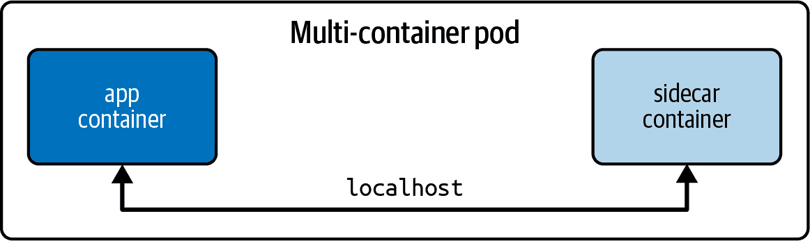

###### 图 5-1\. Pod 中的容器间通信

YAML 清单中的 示例 5-1 创建一个 sidecar 容器，通过 `localhost` 的 80 端口调用主应用容器：

##### 示例 5-1\. 多容器 Pod

```
apiVersion: v1
kind: Pod
metadata:
  name: multi-container
spec:
  containers:
  - image: nginx
    name: app
    ports:
    - containerPort: 80
  - image: curlimages/curl:7.79.1
    name: sidecar
    args:
    - /bin/sh
    - -c
    - 'while true; do curl localhost:80; sleep 5; done;'
```

检查 sidecar 容器的日志显示，与主应用程序容器的通信成功：

```
$ kubectl create -f pod.yaml
pod/multi-container created
$ kubectl logs multi-container -c sidecar
...
<!DOCTYPE html>
<html>
<head>
<title>Welcome to nginx!</title>
...
```

# Pod 间的连接

每个 Pod 在创建时分配一个 IP 地址。您可以使用 `get pods` 命令的 `-o wide` 选项或描述 Pod 来检查 Pod 的 IP 地址。以下控制台输出中的 Pod 的 IP 地址为 `172.17.0.4`：

```
$ kubectl run nginx --image=nginx --port=80
pod/nginx created
$ kubectl get pod nginx -o wide
NAME    READY   STATUS    RESTARTS   AGE   IP           NODE       \
NOMINATED NODE   READINESS GATES
nginx   1/1     Running   0          37s   172.17.0.4   minikube   \
<none>           <none>
$ kubectl get pod nginx -o yaml
...
status:
  podIP: 172.17.0.4
...
```

分配给 Pod 的 IP 地址在所有节点和命名空间中是唯一的。这通过在注册节点时为每个节点分配专用子网来实现。在节点上创建新的 Pod 时，IP 地址是从分配的子网中租借的。这由网络生命周期管理器 kube-proxy 与 DNS 服务和 CNI 共同处理。以下命令通过节点名为 `minikube` 的属性 `spec.podCIDR` 查询分配的子网：

```
$ kubectl get nodes
NAME       STATUS   ROLES                  AGE   VERSION
minikube   Ready    control-plane,master   42d   v1.21.2
$ kubectl get nodes minikube -o json | jq .spec.podCIDR
"172.17.0.0/24"
```

节点上的 Pod 可以与集群中任何其他节点上运行的所有其他 Pod 通信。图 5-2 展示了使用案例。

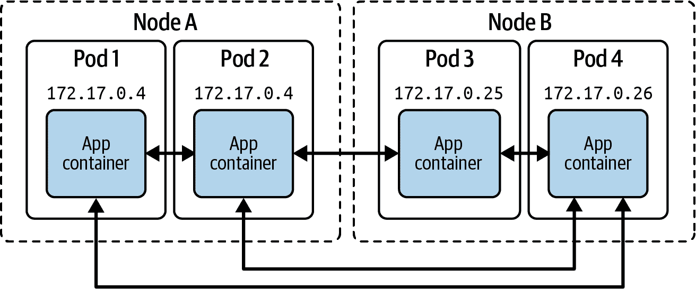

###### 图 5-2\. Pod 间通信

您可以通过创建一个临时 Pod，使用命令行工具 `curl` 或 `wget` 调用另一个 Pod 的 IP 地址来轻松验证此行为：

```
$ kubectl run busybox --image=busybox --rm -it --restart=Never \
  -- wget 172.17.0.4:80
Connecting to 172.17.0.4:80 (172.17.0.4:80)
saving to 'index.html'
index.html           100% |********************************|   615  0:00:00 ETA
'index.html' saved
pod "busybox" deleted

```

需要理解的是，IP 地址随时间不稳定。Pod 重新启动会租用新的 IP 地址。构建微服务架构时，每个应用程序在自己的 Pod 中运行，需要使用稳定的网络接口进行通信，这就需要另一个概念，即 Service。

# 理解 Services

简而言之，Services 为一组 Pods 提供可发现的名称和负载均衡。借助 Kubernetes DNS 控制平面组件，Services 和 Pods 无需关注 IP 地址。与 Deployment 类似，Service 使用标签选择确定其操作的 Pods。

图 5-3 说明了该功能。Pod 1 接收流量，因为其分配的标签与服务中定义的标签选择匹配。Pod 2 由于定义了不匹配的标签而不接收流量。请注意，可以在不常见的场景中创建没有标签选择器的服务。有关更多信息，请参阅相关的[Kubernetes 文档](https://oreil.ly/lCzAa)。

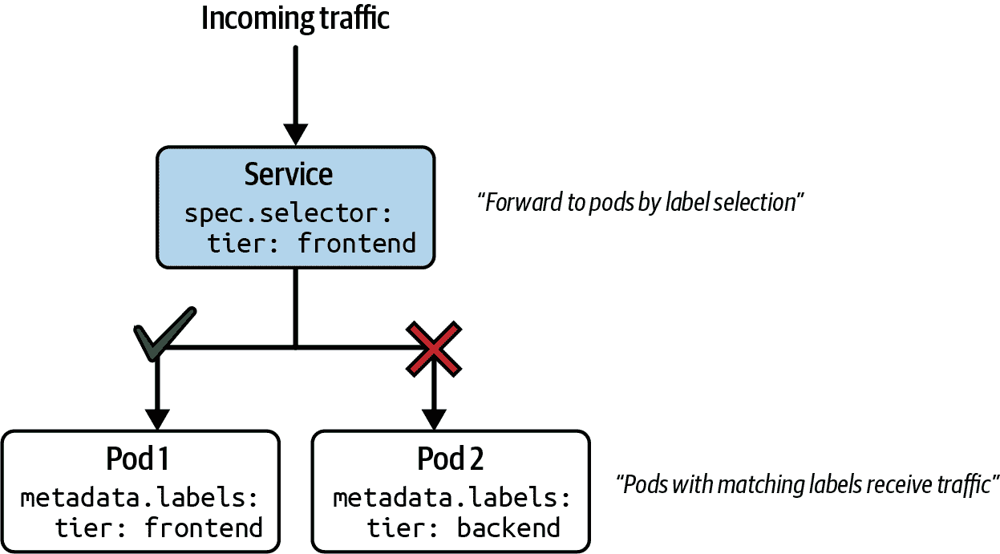

###### 图 5-3。基于标签选择的服务流量路由

服务是部署的补充概念。服务将网络流量路由到一组 Pod，而部署管理一组 Pod 副本。尽管您可以单独使用这两个概念，但建议同时使用部署和服务。主要原因是能够扩展副本数，并同时暴露端点以控制网络流量。

# 服务类型

每个服务都需要定义一个类型。表 5-1 列出了与 CKA 考试相关的服务类型。

表 5-1。服务类型

| 类型 | 描述 |
| --- | --- |
| `ClusterIP` | 在集群内部 IP 上暴露服务。只能从集群内部访问。 |
| `NodePort` | 在每个节点的 IP 地址上以静态端口暴露服务。可从集群外部访问。 |
| `LoadBalancer` | 使用云提供商的负载均衡器外部暴露服务。 |

其他服务类型可以定义；然而，在本书中我们不会涉及它们，因为它们超出了考试范围。有关更多信息，请参阅[Kubernetes 文档](https://oreil.ly/3jzod)。

# 创建服务

您可以通过多种方式创建服务，其中一些方式更有利于 CKA 考试，因为它们提供了快速的反馈。让我们首先讨论命令式方法。

服务需要通过匹配标签选择一个 Pod。以下`run`命令创建的 Pod 称为`echoserver`，它将应用程序暴露在容器端口 8080 上。在内部，它会自动为对象分配标签键值对`run: echoserver`：

```
$ kubectl run echoserver --image=k8s.gcr.io/echoserver:1.10 --restart=Never \
  --port=8080
pod/echoserver created
```

`create service`命令创建相应的服务对象。您需要将服务类型作为必需的参数提供。这里我们使用了类型`clusterip`。命令行选项`--tcp`指定了端口映射，服务使用端口 80 来接收传入的网络流量，端口 8080 用于指向 Pod 暴露的容器端口：

```
$ kubectl create service clusterip echoserver --tcp=80:8080
service/echoserver created
```

使用`run`命令的`--expose`选项可以更快地创建 Pod 和服务。以下命令在创建正确的标签选择同时创建两个对象。如果要求您创建 Pod 和服务，这个命令行选项在 CKA 考试中节省时间是一个不错的选择：

```
$ kubectl run echoserver --image=k8s.gcr.io/echoserver:1.10 --restart=Never \
  --port=8080 --expose
service/echoserver created
pod/echoserver created
```

实际上更常见的是使用一起工作的部署（Deployment）和服务（Service）。以下一组命令创建了一个带有五个副本的部署，并使用`expose deployment`命令创建了服务。端口映射可以通过`--port`和`--target-port`选项进行设置：

```
$ kubectl create deployment echoserver --image=k8s.gcr.io/echoserver:1.10 \
  --replicas=5
deployment.apps/echoserver created
$ kubectl expose deployment echoserver --port=80 --target-port=8080
service/echoserver exposed
```

示例 5-2 展示了一个以 YAML 清单形式表示的服务的表示形式。该服务声明了键值`app: echoserver`以进行标签选择，并定义了将端口 80 映射到 8080 的设置。

##### 示例 5-2\. 由 YAML 清单定义的服务

```
apiVersion: v1
kind: Service
metadata:
  name: echoserver
spec:
  type: ClusterIP
  selector:
    app: echoserver
  ports:
  - port: 80
    targetPort: 8080
```

# 列出服务

列出所有服务呈现了一个包含服务类型、集群 IP 地址和入口端口的表格视图。在这里，您可以看到我们早些时候创建的`echoserver` Pod 的输出：

```
$ kubectl get services
NAME         TYPE        CLUSTER-IP      EXTERNAL-IP   PORT(S)   AGE
echoserver   ClusterIP   10.109.241.68   <none>        80/TCP    6s
```

# 渲染服务详情

您可能希望钻取服务的详细信息以进行故障排除。如果服务的入站流量未正确路由到您期望处理工作负载的一组 Pod，则可能是这种情况。

`describe`命令提供有关服务配置的宝贵信息。与排除服务故障相关的配置包括选择器（Selector）、IP、端口（Port）、目标端口（TargetPort）和端点（Endpoints）的值。

查看以下`describe`命令的输出。这是为由部署（Deployment）控制的五个 Pod 创建的服务的详细信息。端点（Endpoints）属性列出了一系列的端点，每个对应一个 Pod：

```
$ kubectl describe service echoserver
Name:              echoserver
Namespace:         default
Labels:            app=echoserver
Annotations:       <none>
Selector:          app=echoserver
Type:              ClusterIP
IP Family Policy:  SingleStack
IP Families:       IPv4
IP:                10.109.241.68
IPs:               10.109.241.68
Port:              <unset>  80/TCP
TargetPort:        8080/TCP
Endpoints:         172.17.0.4:8080,172.17.0.5:8080,172.17.0.7:8080 + 2 more...
Session Affinity:  None
Events:            <none>
```

Kubernetes 通过一个专门的资源来表示端点，您可以查询该资源。端点对象与创建服务对象同时创建。以下命令列出了名为`echoserver`的服务的端点：

```
$ kubectl get endpoints echoserver
NAME         ENDPOINTS                                                     AGE
echoserver   172.17.0.4:8080,172.17.0.5:8080,172.17.0.7:8080 + 2 more...   8m5s
```

端点的详细信息公布了 IP 地址和端口组合的完整列表：

```
$ kubectl describe endpoint echoserver
Name:         echoserver
Namespace:    default
Labels:       app=echoserver
Annotations:  endpoints.kubernetes.io/last-change-trigger-time: \
              2021-11-15T19:09:04Z
Subsets:
  Addresses:          172.17.0.4,172.17.0.5,172.17.0.7,172.17.0.8,172.17.0.9
  NotReadyAddresses:  <none>
  Ports:
    Name     Port  Protocol
    ----     ----  --------
    <unset>  8080  TCP

Events:  <none>
```

# 端口映射

服务通过分配的标签选择一组 Pod 来转发流量。成功的网络流量路由还取决于正确的端口映射。在前面的部分中，我们创建了不同的服务并为它们分配了端口。在这里，我们将希望通过使其各个部分更加透明来重新访问端口映射。

图 5-4 显示了一个接受端口 80 入站流量的服务。这是清单中`spec.ports[].port`属性定义的端口。任何入站流量都将路由到目标端口，该端口由`spec.ports[].targetPort`表示。目标端口与标签选择的 Pod 内运行的容器定义的端口相同。在这种情况下，即端口 8080。

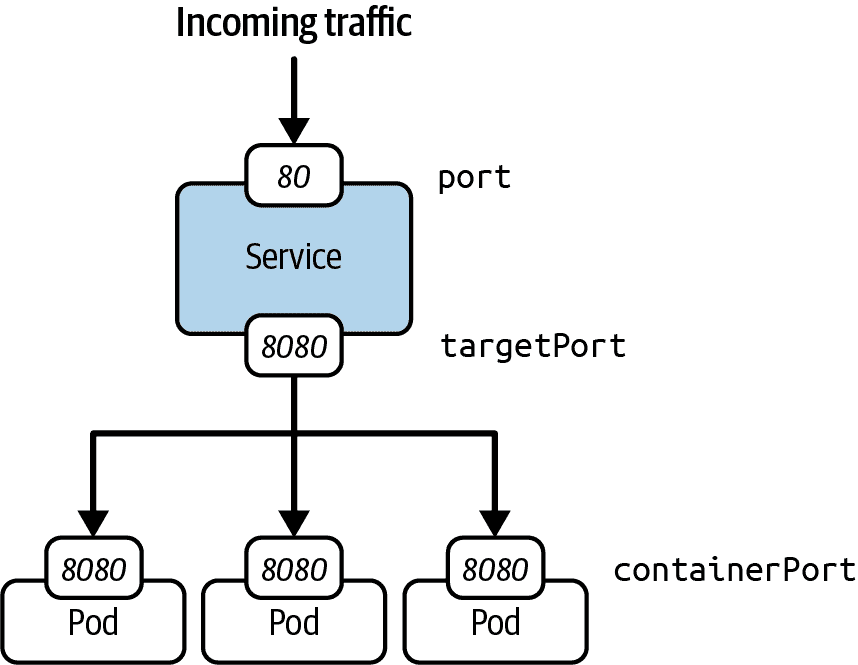

###### 图 5-4\. 服务端口映射

# 使用类型为 ClusterIP 的服务访问

`ClusterIP` 是 Service 的默认类型。它在集群内部 IP 地址上公开 Service。这意味着只能从集群内部运行的 Pod 访问 Service，而不能从集群外部访问（例如，如果您从本地计算机调用 Service）。图 5-5 说明了具有类型 `ClusterIP` 的 Service 的可访问性。

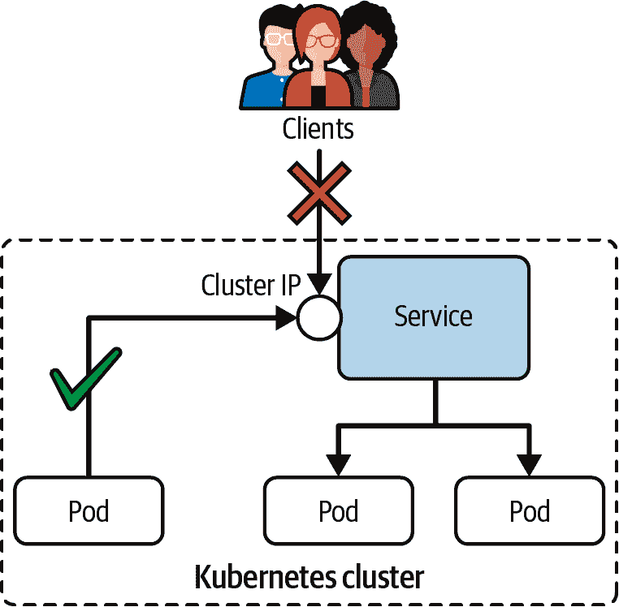

###### 图 5-5\. 具有类型 `ClusterIP` 的 Service 的可访问性

我们将创建一个 Pod 和一个相应的 Service 来演示 `ClusterIP` 的运行时行为。名为 `echoserver` 的 Pod 公开容器端口 8080，并指定标签 `app: echoserver`。Service 为传入流量定义了端口 5005，该流量被转发到所选 Pod 的端口 8080。标签选择与我们设置的 Pod 匹配：

```
$ kubectl run echoserver --image=k8s.gcr.io/echoserver:1.10 --restart=Never \
  --port=8080 -l app=echoserver
pod/echoserver created
$ kubectl create service clusterip echoserver --tcp=5005:8080
service/echoserver created
```

使 Service 可用的集群 IP 是 `10.96.254.0`。列出 Service 还会呈现用于传入流量到 Service 的端口：

```
$ kubectl get pod,service
NAME             READY   STATUS    RESTARTS   AGE
pod/echoserver   1/1     Running   0          23s

NAME                 TYPE        CLUSTER-IP    EXTERNAL-IP   PORT(S)    AGE
service/echoserver   ClusterIP   10.96.254.0   <none>        5005/TCP   8s
```

您无法使用集群 IP 和端口从本地计算机访问 Service，如下所示的 `wget` 命令：

```
$ wget 10.96.254.0:5005 --timeout=5 --tries=1
--2021-11-15 15:45:36--  http://10.96.254.0:5005/
Connecting to 10.96.254.0:5005... ]failed: Operation timed out.
Giving up.
```

从集群内的临时 Pod 访问 Service 可正确将请求路由到匹配标签选择的 Pod：

```
$ kubectl run tmp --image=busybox --restart=Never -it --rm \
  -- wget 10.96.254.0:5005
Connecting to 10.96.254.0:5005 (10.96.254.0:5005)
saving to 'index.html'
index.html           100% |********************************|   408  0:00:00 ETA
'index.html' saved
pod "tmp" deleted

```

# 使用类型为 NodePort 的 Service 访问 Service

使用类型为 `NodePort` 的 Service 声明可通过节点 IP 地址访问，并且可以从 Kubernetes 集群外部解析。节点 IP 地址可以与范围在 30000 到 32767 之间的端口号结合使用，该端口在创建 Service 时自动分配。该端口在集群中的每个节点上打开，并且其值在集群范围内是全局且唯一的。为避免端口冲突，最好不定义确切的节点端口，而是让 Kubernetes 找到一个可用端口。请记住，`NodePort`（大写 *N*）是 Service 类型，而 `nodePort`（小写 *n*）是值的键。图 5-6 说明了通过类型为 `NodePort` 的 Service 将流量路由到 Pod 的情况。

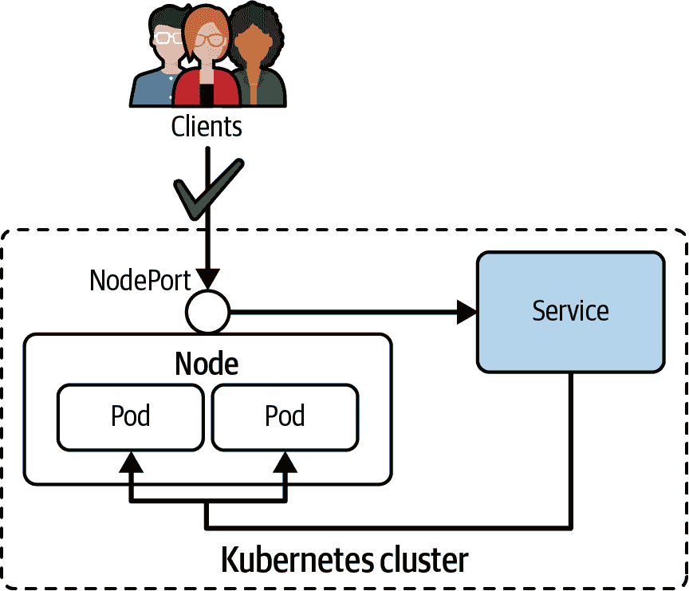

###### 图 5-6\. 具有类型 NodePort 的 Service 的可访问性

接下来的两个命令创建一个类型为 `NodePort` 的 Pod 和一个 Service。这里唯一的区别是在命令行选项中提供 `nodeport` 而不是 `clusterip`：

```
$ kubectl run echoserver --image=k8s.gcr.io/echoserver:1.10 --restart=Never \
  --port=8080 -l app=echoserver
pod/echoserver created
$ kubectl create service nodeport echoserver --tcp=5005:8080
service/echoserver created
```

创建后，您可以列出 Pod 和 Service。您会发现端口表示包含使 Service 可访问的静态分配端口。在我们的情况下，那就是端口 30158：

```
$ kubectl get pod,service
NAME             READY   STATUS    RESTARTS   AGE
pod/echoserver   1/1     Running   0          17s

NAME                 TYPE        CLUSTER-IP       EXTERNAL-IP   PORT(S)        \
AGE
service/echoserver   NodePort    10.101.184.152   <none>        5005:30158/TCP \
5s
```

从集群内部，您仍然可以使用集群 IP 地址和端口号访问 Service。这些 Service 公开的行为与其类型为 `ClusterIP` 时完全相同：

```
$ kubectl run tmp --image=busybox --restart=Never -it --rm \
  -- wget 10.101.184.152:5005
Connecting to 10.101.184.152:5005 (10.101.184.152:5005)
saving to 'index.html'
index.html           100% |********************************|   414  0:00:00 ETA
'index.html' saved
pod "tmp" deleted

```

从集群外部，您需要使用运行 Pod 的节点的 IP 地址和静态分配的端口。确定节点 IP 地址的一种方法是通过 `kubectl cluster-info` 或查询 Pod。

# 在 Minikube 中确定 Service URL

Minikube 提供了一个快捷方式，可以通过命令 `minikube service --url <service-name>` 确定服务的端点。更多信息，请参阅 [Minikube 文档](https://oreil.ly/HGYRp)。

这里的节点 IP 地址是 `192.168.64.15`。可以使用它从集群外部调用服务：

```
$ kubectl get nodes -o \
  jsonpath='{ $.items[*].status.addresses[?(@.type=="InternalIP")].address }'
192.168.64.15
$ wget 192.168.64.15:30158
--2021-11-16 14:10:16--  http://192.168.64.15:30158/
Connecting to 192.168.64.15:30158... connected.
HTTP request sent, awaiting response... 200 OK
Length: unspecified [text/plain]
Saving to: ‘index.html’
...

```

# 使用 LoadBalancer 类型访问服务

Kubernetes 云提供商支持通过类型 `LoadBalancer` 从预先存在的外部负载均衡器配置到服务的配置。此服务类型暴露一个单一 IP 地址，将传入请求分发到集群节点。负载均衡策略的实现（例如轮询）由云提供商决定。图 5-7 展示了架构概览。

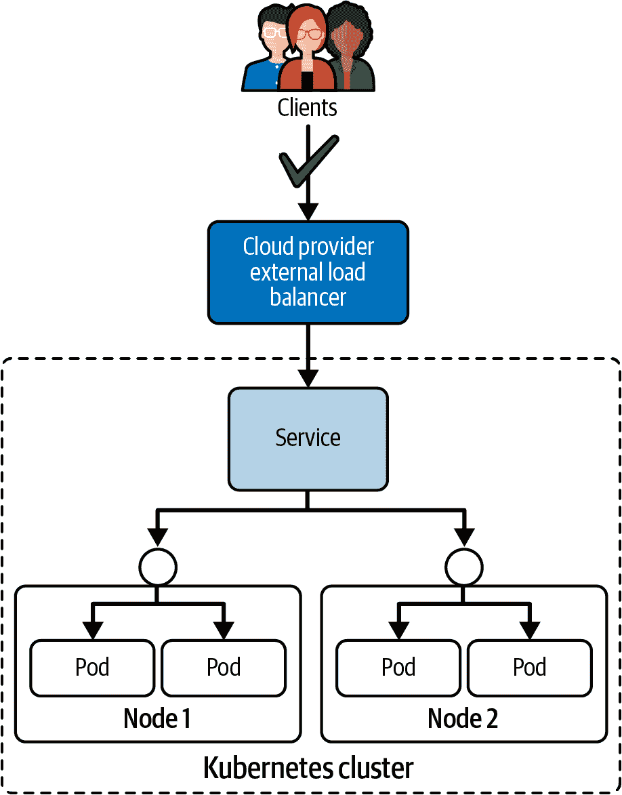

###### 图 5-7\. 使用 LoadBalancer 类型访问服务的可访问性

# 在 Minikube 中设置网络路由

Minikube 不是 Kubernetes 的云提供商实现；然而，你可以配置网络路由到服务以尝试负载均衡器功能。你只需要在单独的 shell 中运行命令 `minikube tunnel`。更多信息，请参阅 [Minikube 文档](https://oreil.ly/O37FF)。

要创建一个作为负载均衡器的服务，请在清单中将类型设置为 `LoadBalancer` 或使用 `create service loadbalancer` 命令：

```
$ kubectl run echoserver --image=k8s.gcr.io/echoserver:1.10 --restart=Never \
  --port=8080 -l app=echoserver
pod/echoserver created
 $ kubectl create service loadbalancer echoserver --tcp=5005:8080
service/echoserver created
```

你会发现，类型为 `LoadBalancer` 的服务暴露一个外部 IP 地址。列出服务以显示外部 IP 地址，在下面的输出中是 `10.109.76.157`：

```
$ kubectl get pod,service
NAME             READY   STATUS    RESTARTS   AGE
pod/echoserver   1/1     Running   0          9s

NAME                 TYPE           CLUSTER-IP      EXTERNAL-IP   \
PORT(S)          AGE
service/echoserver   LoadBalancer   10.109.76.157   10.109.76.157 \
5005:30642/TCP   5s
```

要从集群外部调用服务，请使用外部 IP 地址及其入站端口：

```
$ wget 10.109.76.157:5005
--2021-11-17 11:30:44--  http://10.109.76.157:5005/
Connecting to 10.109.76.157:5005... connected.
HTTP request sent, awaiting response... 200 OK
Length: unspecified [text/plain]
Saving to: ‘index.html’
...
```

# 理解 Ingress

标准的 Kubernetes Ingress 解决方案仅在第 7 层（HTTP 或 HTTPS 流量）提供负载均衡，并将事务从集群外部路由到集群内的服务，如 图 5-8 所示。这不是一个特定的服务类型，也不应与服务类型 `LoadBalancer` 混淆。

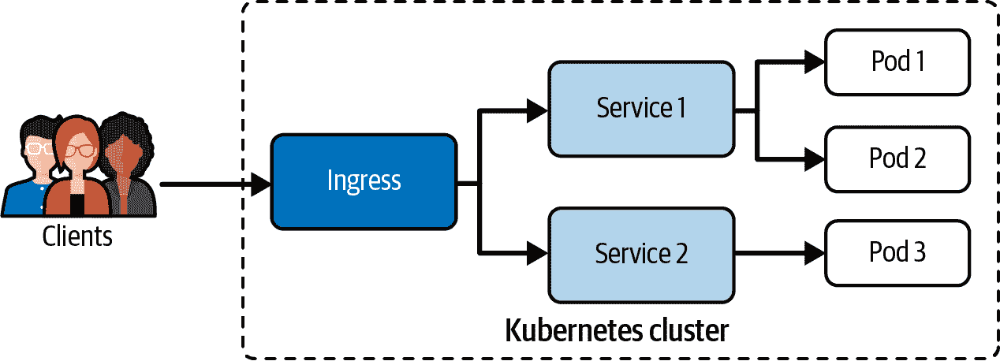

###### 图 5-8\. 通过 HTTP(S) 管理对服务的外部访问

没有 Ingress 控制器，Ingress 无法工作。Ingress 控制器评估由 Ingress 定义的规则集，确定流量路由。一个生产级别的 Ingress 控制器示例是 [F5 NGINX Ingress Controller](https://oreil.ly/owWZN) 或 [AKS Application Gateway Ingress Controller](https://oreil.ly/8hupA)。你可以在 [Kubernetes 文档](https://oreil.ly/wGHWl) 中找到其他选项。

如果你正在使用 Minikube，必须显式启用 Ingress 功能。Ingress 控制器作为 `ingress-nginx` 命名空间中的一个 Pod 运行：

```
$ minikube addons enable ingress
$ kubectl get pods -n ingress-nginx
NAME                                        READY   STATUS      RESTARTS   AGE
ingress-nginx-controller-59b45fb494-xpfzn   0/1     Running     0          14s
```

# 网络规则

Ingress 对象定义的规则遵循 表 5-2 中列出的三个标准。

表 5-2\. Ingress 规则

| 类型 | 示例 | 描述 |
| --- | --- | --- |
| 可选主机 | `mycompany.abc.com` | 如果提供了主机，则规则适用于该主机。如果未定义主机，则处理所有入站 HTTP(S)流量。 |
| 路径列表 | `/corellian/api` | 入站流量必须匹配主机和路径，以正确转发流量到 Service。 |
| 后端 | `corellian:8080` | Service 名称和端口的组合。 |

# 创建 Ingress

您可以使用`create ingress`命令创建 Ingress。您需要提供的主要命令行选项是`--rule`，它以逗号分隔的方式定义规则。每个键值对的表示法是`<host>/<path>=<service>:<port>`。如果查看`create ingress --help`命令的输出，可以指定更详细的规则：

```
$ kubectl create ingress corellian \
  --rule="star-alliance.com/corellian/api=corellian:8080"
ingress.networking.k8s.io/corellian created
```

###### 提示

对于 HTTP 流量，端口 80 是隐含的，因为我们没有指定 TLS Secret 对象的引用。如果您在规则定义中指定了`tls=mysecret`，那么端口 443 也将在此处列出。有关启用 HTTPS 流量的更多信息，请参阅[Kubernetes 文档](https://oreil.ly/d2sbY)。

作为 YAML 清单定义的相同 Ingress 在示例 5-3 中显示。

##### 示例 5-3\. 由 YAML 清单定义的 Ingress

```
apiVersion: networking.k8s.io/v1
kind: Ingress
metadata:
  name: corellian
spec:
  rules:
  - host: star-alliance.com
    http:
      paths:
      - backend:
          service:
            name: corellian
            port:
              number: 8080
        path: /corellian/api
        pathType: Exact
```

# 定义路径类型

前面的 YAML 清单演示了通过属性`spec.rules[].host[].http.paths[].pathType`指定路径类型的选项之一。路径类型定义了如何评估传入请求与声明的路径的匹配。表 5-3 应该为您提供了关于传入请求及其路径评估的指示。有关更全面的列表，请参阅[Kubernetes 文档](https://oreil.ly/4plCE)。

表 5-3\. Ingress 路径类型

| 路径类型 | 规则 | 入站请求 |
| --- | --- | --- |
| `Exact` | `/corellian/api` | 匹配`/corellian/api`但不匹配`/corellian/test`或`/corellian/api/` |
| `Prefix` | `/corellian/api` | 匹配`/corellian/api`和`/corellian/api/`但不匹配`/corellian/test` |

# 列出 Ingress

通过执行`get ingress`命令可以列出 Ingress。您将看到创建 Ingress 时指定的一些信息（例如，主机）：

```
$ kubectl get ingress
NAME        CLASS    HOSTS               ADDRESS         PORTS   AGE
corellian   <none>   star-alliance.com   192.168.64.15   80      10m
```

# 呈现 Ingress 详细信息

使用`describe ingress`命令可以呈现 Ingress 的详细信息。每个规则都在表中列出。为了故障排除，请注意额外的消息。在以下输出中，您可以看到我们在这里映射的名为`corellian`的 Service 不存在。此外，事件日志显示 Ingress 控制器通过同步活动调整规则：

```
$ kubectl describe ingress corellian
Name:             corellian
Namespace:        default
Address:
Default backend:  default-http-backend:80 (<error: endpoints \
                  "default-http-backend" not found>)
Rules:
  Host               Path  Backends
  ----               ----  --------
  star-alliance.com
                     /corellian/api   corellian:8080 (<error: \
                     endpoints "corellian" not found>)
Annotations:         <none>
Events:
  Type    Reason  Age   From                      Message
  ----    ------  ----  ----                      -------
  Normal  Sync    13s   nginx-ingress-controller  Scheduled for sync
```

使用服务和 Pod 提供请求时，这里是 Ingress 的详细信息：

```
$ kubectl run corellian --image=k8s.gcr.io/echoserver:1.10 --restart=Never \
  --port=8080 -l app=corellian
pod/corellian created
$ kubectl create service clusterip corellian --tcp=8080:8080
service/corellian created
$ kubectl describe ingress corellian
Name:             corellian
Namespace:        default
Address:          192.168.64.15
Default backend:  default-http-backend:80 (<error: \
                  endpoints "default-http-backend" not found>)
Rules:
  Host               Path  Backends
  ----               ----  --------
  star-alliance.com
                     /corellian/api   corellian:8080 (172.17.0.5:8080)
Annotations:         <none>
Events:              <none>
```

# 访问 Ingress

后端与路径路由组合，通过 Ingress 将传入的 HTTP(S) 流量传播到配置的服务。要在本地 Kubernetes 集群上测试行为，首先需要找出 Ingress 使用的负载均衡器的 IP 地址。接下来，您需要将 IP 地址添加到您的 `/etc/hosts` 文件中：

```
$ kubectl get ingress corellian \
  --output=jsonpath="{.status.loadBalancer.ingress[0][*ip*]}"
192.168.64.15
$ sudo vim /etc/hosts
...
192.168.64.15   star-alliance.com
```

您现在可以向后端发送 HTTP 请求。第一个调用匹配 `Exact` 路径规则。第二个调用因路径规则不匹配而未通过：

```
$ wget star-alliance.com/corellian/api --timeout=5 --tries=1
--2021-11-30 19:34:57--  http://star-alliance.com/corellian/api
Resolving star-alliance.com (star-alliance.com)... 192.168.64.15
Connecting to star-alliance.com (star-alliance.com)|192.168.64.15|:80... \
connected.
HTTP request sent, awaiting response... 200 OK
...
$ wget star-alliance.com/corellian/api/ --timeout=5 --tries=1
--2021-11-30 15:36:26--  http://star-alliance.com/corellian/api/
Resolving star-alliance.com (star-alliance.com)... 192.168.64.15
Connecting to star-alliance.com (star-alliance.com)|192.168.64.15|:80... \
connected.
HTTP request sent, awaiting response... 404 Not Found
2021-11-30 15:36:26 ERROR 404: Not Found.
```

# 使用和配置 CoreDNS

Kubernetes 专注于操作微服务架构。各个微服务提供独特的、自包含的功能，并相互通信以相互补充。本章前面讨论了使用服务提供稳定网络接口的用法。许多示例使用 IP 地址和端口与服务进行通信。

Kubernetes 运行名为 [CoreDNS](https://coredns.io) 的 DNS 服务器实现，将服务的名称映射到其 IP 地址。反过来，微服务可以轻松地通过服务名称相互引用。要深入了解 CoreDNS，请查阅优秀的书籍 [*Learning CoreDNS*](https://oreil.ly/06kPW)（O’Reilly）。

## 检查 CoreDNS Pod

CoreDNS 服务器在命名空间 `kube-system` 中的 Pod 中运行。以下命令为 Minikube 集群安装渲染 CoreDNS Pod：

```
$ kubectl get pods -n kube-system
NAME                               READY   STATUS    RESTARTS   AGE
coredns-558bd4d5db-s89vn           1/1     Running   2          64d
```

CoreDNS 使用所谓的 `Corefile` 配置 DNS 服务器的运行时行为。在同一命名空间设置的名为 `coredns` 的 ConfigMap 定义配置文件的内容。CoreDNS Pod 挂载 ConfigMap，如 示例 5-4 所示。

##### 示例 5-4\. CoreDNS Pod 的 YAML 清单

```
apiVersion: v1
kind: Pod
metadata:
  name: coredns-558bd4d5db-s89vn
  namespace: kube-system
...
spec:
  containers:
  - name: coredns
    image: k8s.gcr.io/coredns/coredns:v1.8.0
    volumeMounts:
    - mountPath: /etc/coredns
      name: config-volume
      readOnly: true
  volumes:
  - configMap:
      defaultMode: 420
      items:
      - key: Corefile
        path: Corefile
      name: coredns
    name: config-volume
...
```

## 检查 CoreDNS 配置

您可以使用命令 `kubectl get configmaps coredns -n kube-system -o yaml` 检查 ConfigMap。示例 5-5 显示了 `Corefile` 的内容。请查看 [CoreDNS 手册](https://oreil.ly/7AeWG) 获取有关 `Corefile` 语法和指令的更多信息。

##### 示例 5-5\. 由 ConfigMap 定义的默认 Corefile

```
apiVersion: v1
kind: ConfigMap
metadata:
  name: coredns
  namespace: kube-system
data:
  Corefile: |
    .:53 {
        errors
        health {
           lameduck 5s
        }
        ready
        kubernetes cluster.local in-addr.arpa ip6.arpa {
           pods insecure
           fallthrough in-addr.arpa ip6.arpa
           ttl 30
        }
        prometheus :9153
        hosts {
           192.168.64.1 host.minikube.internal
           fallthrough
        }
        forward . /etc/resolv.conf {
           max_concurrent 1000
        }
        cache 30
        loop
        reload
        loadbalance
    }
...
```

## 定制 CoreDNS 配置

`Corefile` 的默认配置可以进一步定制。为此，在命名空间 `kube-system` 中创建一个新的 ConfigMap，格式如 示例 5-6 所示。

##### 示例 5-6\. 由 ConfigMap 定义的自定义 Corefile

```
apiVersion: v1
kind: ConfigMap
metadata:
  name: coredns-custom
  namespace: kube-system
data:
  ...
```

创建由文件 `coredsns-custom.yaml` 指定的新 ConfigMap，并通过删除它强制重新加载 CoreDNS Pod 配置。CoreDNS 将会重新启动，因为 CoreDNS Pod 是通过 Deployment 的状态部署和管理的。Pod 的重启策略默认为 `Always`；删除 Pod 是强制其重新启动的快速方法，新的 Pod 实例将映射到 ConfigMap 中更新的信息：

```
$ kubectl apply -f coredsns-custom.yaml
$ kubectl delete pod coredns -n kube-system
```

# DNS 服务

服务与 CoreDNS 提供的 DNS 服务紧密相关。在本节中，我们将讨论几种场景，说明如何从同一或不同命名空间中的另一个 Pod 访问服务的情况。

## 从同一命名空间通过主机名解析服务的示例

如果两个对象位于同一个命名空间，一个 Pod 可以通过主机名解析服务。图 5-9 展示了一个实现 UI 前端功能的 Pod 如何通过服务调用后端微服务的示例。

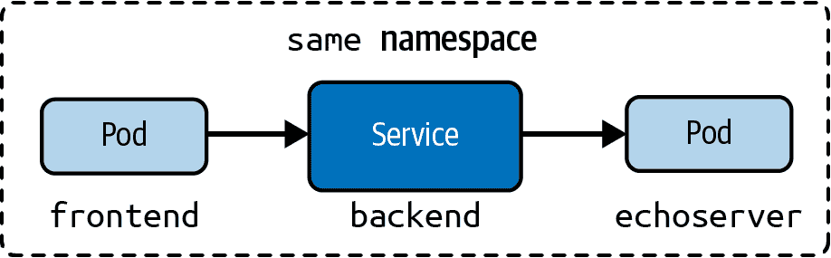

###### 图 5-9\. 从同一命名空间解析服务

使用以下命令可以轻松验证其行为。在此，我们将在名为`dns`的命名空间中创建一个服务和一个名为`echoserver`的 Pod：

```
$ kubectl create namespace dns
namespace/dns created
$ kubectl run echoserver --image=k8s.gcr.io/echoserver:1.10 --restart=Never \
  --port=8080 --expose -n dns
service/echoserver created
pod/echoserver created
$ kubectl get services,pods -n dns
NAME                 TYPE        CLUSTER-IP      EXTERNAL-IP   PORT(S)    AGE
service/echoserver   ClusterIP   10.99.124.240   <none>        8080/TCP   17m

NAME             READY   STATUS    RESTARTS   AGE
pod/echoserver   1/1     Running   0          17m
```

你可以通过在同一命名空间中运行一个 Pod，并通过其主机名和入口端口对服务发起调用来验证正确的服务发现：

```
$ kubectl run busybox --image=busybox --rm -it --restart=Never -n dns \
  -- wget echoserver:8080
Connecting to echoserver:8080 (10.99.124.240:8080)
saving to 'index.html'
index.html           100% |********************************|   406  0:00:00 ETA
'index.html' saved
pod "busybox" deleted

```

## 从不同命名空间通过主机名解析服务

在 Pod 向不同命名空间中的服务发起调用并不罕见。仅引用服务的主机名无法跨命名空间工作。你需要同时附加命名空间。

图 5-10 展示了在名为`business`的命名空间中的后端 Pod 调用了在命名空间`other`中的服务的示例。为了从`business`命名空间访问`weather-api`服务，你需要通过`weather-api.other`进行引用。位于`default`命名空间的服务需要相应地进行引用（例如，`lottery.default`）。

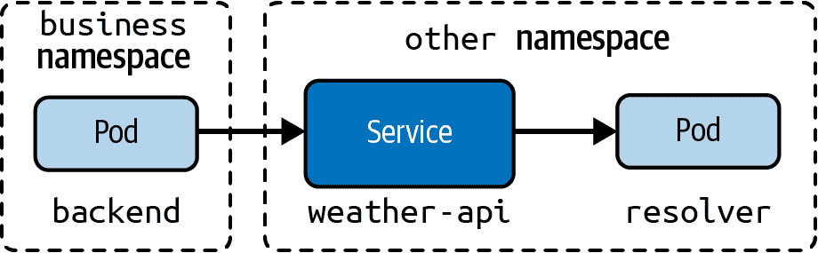

###### 图 5-10\. 从不同命名空间解析服务

```
$ kubectl create namespace other
namespace/other created
$ kubectl run echoserver --image=k8s.gcr.io/echoserver:1.10 --restart=Never \
  --port=8080 --expose -n other
service/echoserver created
pod/echoserver created
$ kubectl get services,pods -n other
NAME                 TYPE        CLUSTER-IP      EXTERNAL-IP   PORT(S)    AGE
service/echoserver   ClusterIP   10.99.124.240   <none>        8080/TCP   17m

NAME             READY   STATUS    RESTARTS   AGE
pod/echoserver   1/1     Running   0          17m
```

在不同命名空间，例如称为`business`的情况下，从临时 Pod 向命名空间`other`中的服务发起调用。如果不指定命名空间，尝试调用服务将失败连接。在下面的代码中可以看到，服务的命名空间需要明确指定为`echoserver.other`：

```
$ kubectl create namespace business
namespace/business created
$ kubectl run busybox --image=busybox --rm -it --restart=Never -n business \
  -- wget echoserver:8080
wget: bad address 'echoserver:8080'
pod "busybox" deleted
pod other/busybox terminated (Error)
$ kubectl run busybox --image=busybox --rm -it --restart=Never -n business \
  -- wget echoserver.other:8080
Connecting to echoserver.other:8080 (10.99.32.59:8080)
saving to 'index.html'
index.html           100% |********************************|   418  0:00:00 ETA
'index.html' saved
pod "busybox" deleted

```

`Corefile`定义了一个集群域。默认情况下，集群域的值是`cluster.local`。在引用服务时，你可以在主机名后附加集群域。此外，你需要使用你要通信的对象类型。字符串`svc`描述了服务类型。一个服务的完整主机名为`echoserver.other.svc.cluster.local`。你可以在以下命令中看到这些调用：

```
$ kubectl run busybox --image=busybox --rm -it --restart=Never -n business \
  -- wget echoserver.other.svc:8080
Connecting to echoserver.other.svc:8080 (10.99.32.59:8080)
saving to 'index.html'
index.html           100% |********************************|   426  0:00:00 ETA
'index.html' saved
pod "busybox" deleted
$ kubectl run busybox --image=busybox --rm -it --restart=Never -n business \
  -- wget echoserver.other.svc.cluster.local:8080
Connecting to echoserver.other.svc.cluster.local:8080 (10.99.32.59:8080)
saving to 'index.html'
index.html           100% |********************************|   454  0:00:00 ETA
'index.html' saved
pod "busybox" deleted

```

# Pods 的 DNS

Pods 可以通过 IP 地址跨命名空间进行通信。CoreDNS 在`Corefile`文件中提供了`pods insecure`的配置选项，用于为 Pods 创建 DNS 记录。要引用一个 Pod，请使用 IP 地址，但将点替换为破折号。例如，具有 IP 地址`10.0.0.85`的 Pod 具有相应的 DNS 记录`10-0-0-85`。图 5-11](#dns_pod)展示了通过它们的 DNS 记录相互引用的 Pods。


###### 图 5-11\. 通过 DNS 记录解析 Pod

## 通过主机名解析 Pod

我们将创建两个 Pod 来演示 CoreDNS 在 Pod 中的运行时行为。Pod 1 名为`echoserver1`，运行在命名空间`ns1`中，IP 地址为`172.17.0.8`。Pod 2 名为`echoserver2`，运行在命名空间`ns2`中，IP 地址为`172.17.0.9`：

```
$ kubectl create namespace ns1
namespace/ns1 created
$ kubectl create namespace ns2
namespace/ns2 created
$ kubectl run echoserver1 --image=k8s.gcr.io/echoserver:1.10 --restart=Never \
  --port=8080 -n ns1
pod/echoserver1 created
$ kubectl run echoserver2 --image=k8s.gcr.io/echoserver:1.10 --restart=Never \
  --port=8080 -n ns2
pod/echoserver2 created
$ kubectl get pod echoserver1 -n ns1 --template={{.status.podIP}}
172.17.0.8
$ kubectl get pod echoserver2 -n ns2 --template={{.status.podIP}}
172.17.0.9
```

要通过 DNS 解析 Pod，您需要在主机名中明确指定命名空间和对象类型，无论 Pod 位于何处。以下两个命令使用临时 Pod 来调用同一命名空间内和不同命名空间内的另一个 Pod。添加`cluster.local`是可选的：

```
$ kubectl run busybox --image=busybox --rm -it --restart=Never -n ns1 \
  -- wget 172-17-0-8.ns1.pod:8080
Connecting to 172-17-0-8.ns1.pod:8080 (172.17.0.8:8080)
saving to 'index.html'
index.html           100% |********************************|   424  0:00:00 ETA
'index.html' saved
pod "busybox" deleted
$ kubectl run busybox --image=busybox --rm -it --restart=Never -n ns1 \
  -- wget 172-17-0-9.ns2.pod:8080
Connecting to 172-17-0-9.ns2.pod:8080 (172.17.0.9:8080)
saving to 'index.html'
index.html           100% |********************************|   424  0:00:00 ETA
'index.html' saved
pod "busybox" deleted

```

这个选项`pods insecure`仅出于与`kube-dns`的向后兼容性原因而存在，kube-dns 是 Kubernetes DNS 服务器的原始实现。您可以通过使用`pods disabled`配置 CoreDNS 来禁用为 Pod 创建 DNS 记录。不建议依赖 Pod 的 DNS 记录。

# 选择合适的容器网络接口插件

在第二章中，我们讨论了安装容器网络接口插件的机制。CNI 是一个 Cloud Native Computing Foundation 项目，包括一个用于在 Linux 容器中配置网络接口的规范和库，以及多个插件。CNI 只关注容器的网络连接性，并在删除容器时删除分配的资源。Kubernetes 使用 CNI 作为网络提供程序与 Kubernetes Pod 网络之间的接口。

CNI 规范定义了 Pod 网络接口和能力。插件实现规范，并允许 Kubernetes 管理员选择和使用产品特定的功能集。图 5-12 展示了您可以选择的一些示例插件。有关插件列表，请参见[Kubernetes 文档](https://oreil.ly/mgnMT)。

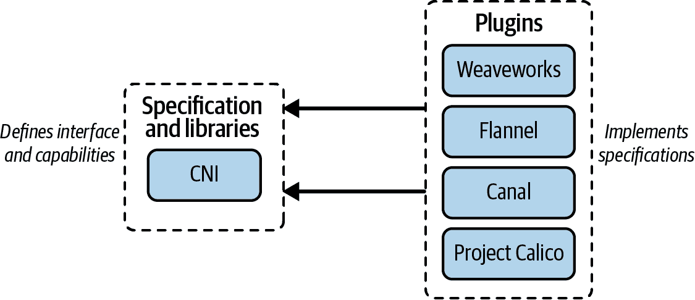

###### 图 5-12\. CNI 规范和实现

选择适合的 CNI 插件取决于您的需求。参考这篇[博客文章](https://oreil.ly/8lCIq)的决策矩阵，可以帮助您为您的 Kubernetes 集群做出正确的选择。在 CKA 考试期间，您可能会被要求安装 CNI 插件。Kubernetes 文档中提到的许多插件链接到 Kubernetes 域外的网页。请记住，在考试期间不允许访问官方 Kubernetes 文档之外的页面。在打开链接之前，请将鼠标指针悬停在链接上查看浏览器中的链接。例如，这个[Kubernetes 文档部分](https://oreil.ly/ncYMk)描述了 Weave Net 的安装说明。

# 总结

Kubernetes 为集群中的每个 Pod 分配唯一的 IP 地址。Pod 可以使用该 IP 地址相互通信；但是，您不能依赖 IP 地址随时间稳定不变。这就是为什么 Kubernetes 提供了 Service 资源类型的原因。

服务基于标签选择和端口映射将网络流量转发到一组 Pod。每个服务都需要分配一个类型，以确定服务如何在集群内部或外部可访问。在 CKA 考试中相关的服务类型有`ClusterIP`、`NodePort`和`LoadBalancer`。CoreDNS 是 Kubernetes 的 DNS 服务器，允许 Pod 通过主机名从同一及其他命名空间访问服务。

资源类型入口（Ingress）定义了将传入的、集群外的 HTTP(S)流量路由到服务的规则。入口控制器定期评估这些规则，并确保它们适用于集群。

# 考试要点

理解服务的目的

通过它们的 IP 地址进行 Pod 对 Pod 通信不能保证稳定的网络接口。服务的目的是提供稳定的网络接口，以便您可以操作在 Kubernetes 集群中运行的复杂微服务架构。在大多数情况下，Pod 通过 CoreDNS 提供的主机名调用服务。

练习如何访问每种类型的服务

CKA 考试要求您理解服务类型`ClusterIP`、`NodePort`和`LoadBalancer`之间的区别。根据分配的类型，服务可以从集群内部或外部访问。

理解服务和入口之间的区别

入口（Ingress）不应与服务混淆。入口用于基于可选主机名和必需路径将集群外 HTTP(S)流量路由到一个或多个服务。服务则将流量路由到一组 Pod。

# 示例练习

这些练习的解决方案可以在附录中找到（Appendix）。

1.  在命名空间`external`中，创建一个名为`nginx`的部署，使用`nginx`镜像，并配置三个副本。容器应该暴露端口 80。在同一命名空间内，创建一个类型为`LoadBalancer`的服务。该服务应将流量路由到部署管理的 Pod。

1.  从本地机器（集群外）使用`wget`或`curl`调用负载均衡器。通过查看日志，确认哪些 Pod 接收到了流量。

1.  将服务类型更改为`ClusterIP`。使用`wget`或`curl`调用服务，以便 Pod 接收流量。

1.  在命名空间`external`中创建一个名为`incoming`的入口（Ingress）。定义路径类型`Prefix`，将路径`/`映射到前面步骤的服务。该入口应能够处理任何传入的 HTTP 流量。

1.  从本地机器使用`wget`或`curl`调用该入口。验证 Pod 是否收到流量。

1.  在命名空间`external`中创建一个名为`echoserver`的新服务，类型为`ClusterIP`。选定和将要创建的 Pod 应使用`k8s.gcr.io/echoserver:1.10`镜像，端口 8080。向现有的入口添加一个新规则，将流量路由到`echoserver`服务，路径为`/echo`，类型为`Exact`。

1.  使用本地机器上的`wget`或`curl`来调用服务，以便可以访问`echoserver`。

1.  为 CoreDNS 配置创建一个[重写规则](https://oreil.ly/ZVYkK)，允许使用集群域名`cka.example.com`引用一个服务。确保自定义的 CoreDNS 配置生效。

1.  在名为`hello`的新命名空间中，从临时 Pod 使用`wget`或`curl`来调用`nginx`服务，并确保使用适当的主机名。
