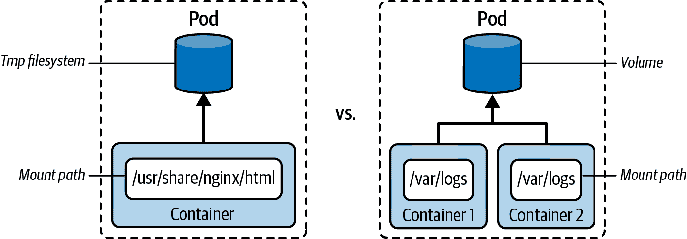
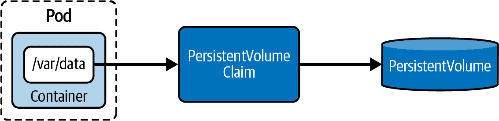

# 第六章：存储

当容器镜像实例化为容器时，容器需要上下文——CPU、内存和 I/O 资源的上下文。Pod 为其内部的容器提供网络和文件系统上下文。网络以 Pod 的虚拟 IP 地址提供，并且文件系统挂载到主机节点的文件系统上。在容器内运行的应用程序可以作为 Pod 上下文的一部分与文件系统交互。容器的临时文件系统与任何其他容器或 Pod 隔离，并且在 Pod 重新启动后不会持久化。CKA 课程的“存储”部分处理了 Kubernetes 中负责在容器或 Pod 重新启动后持久化数据的技术抽象。

卷是 Kubernetes 能力，可在 Pod 重新启动后持久化数据。本质上，卷是可以在 Pod 的多个容器之间共享的目录。您将学习不同卷类型的知识以及定义和挂载容器中卷的过程。

持久卷是卷更广泛概念中的一种特定类别。持久卷的机制稍微复杂一些。持久卷是将数据持久保存到底层物理存储的资源。持久卷声明代表着 Pod 与负责请求存储的持久卷之间的连接资源。最后，Pod 需要*声明*持久卷并将其挂载到容器内运行的目录路径上。

在高层次上，本章涵盖以下概念：

+   持久卷

+   静态与动态提供持久卷

+   存储类

+   持久卷的配置选项

+   持久卷声明

+   在 Pod 中挂载持久卷

# 理解卷

在容器中运行的应用程序可以使用临时文件系统读写文件。如果容器崩溃或集群/节点重新启动，则 kubelet 将重新启动容器。写入临时文件系统的任何数据都将丢失，无法再检索。容器实际上会再次以干净的状态启动。

有许多情况需要在容器中挂载卷。其中最突出的用例之一是[多容器 Pods](https://oreil.ly/EtTx4)，它们使用卷在主应用容器和 sidecar 之间交换数据。图 6-1 展示了容器的临时文件系统与使用卷的差异。



###### 图 6-1\. 使用临时文件系统与使用卷的容器

# 卷类型

每个卷都需要定义一个类型。类型确定支持卷的介质及其运行时行为。Kubernetes 文档提供了一个长列表的卷类型。例如，`azureDisk`、`awsElasticBlockStore` 或 `gcePersistentDisk` 等类型仅在特定云提供商的 Kubernetes 集群中可用。表 6-1 显示了我认为在考试中最相关的卷类型的简化列表。

表 6-1\. 考试相关的卷类型

| 类型 | 描述 |
| --- | --- |
| `emptyDir` | Pod 中具有读写访问权限的空目录。仅在 Pod 的生命周期内保留。用于缓存实现或容器间数据交换的良好选择。 |
| `hostPath` | 主机节点文件系统中的文件或目录。 |
| `configMap`, `secret` | 提供注入配置数据的方式。有关实际示例，请参见 “定义和使用配置数据”。 |
| `nfs` | 现有的网络文件系统（NFS）共享。在 Pod 重新启动后保留数据。 |
| `persistentVolumeClaim` | 请求持久卷。有关更多信息，请参见 “创建持久卷声明”。 |

# 创建和访问卷

为 Pod 定义卷需要两个步骤。首先，您需要使用属性 `spec.volumes[]` 声明卷本身。作为定义的一部分，您提供名称和类型。然而，仅仅声明卷是不够的。其次，需要通过 `spec.containers.volumeMounts[]` 将卷挂载到消费容器的路径上。卷和卷挂载之间的映射是通过匹配的名称完成的。

从存储在文件 `pod-with-volume.yaml` 中的 YAML 清单，并显示在 示例 6-1 中，您可以看到类型为 `emptyDir` 的卷的定义。该卷已经挂载到名为 `nginx` 的容器内部的路径 */var/logs*。

##### 示例 6-1\. 定义和挂载卷的 Pod

```
apiVersion: v1
kind: Pod
metadata:
  name: business-app
spec:
  volumes:
  - name: logs-volume
    emptyDir: {}
  containers:
  - image: nginx
    name: nginx
    volumeMounts:
    - mountPath: /var/logs
      name: logs-volume
```

让我们创建 Pod 并查看是否可以与挂载的卷交互。以下命令在 Pod 创建后打开一个交互式 shell，然后导航到挂载路径。您可以看到，卷类型 `emptyDir` 将挂载路径初始化为空目录。可以根据需要创建新文件和目录，没有限制：

```
$ kubectl create -f pod-with-volume.yaml
pod/business-app created
$ kubectl get pod business-app
NAME           READY   STATUS    RESTARTS   AGE
business-app   1/1     Running   0          43s
$ kubectl exec business-app -it -- /bin/sh
# cd /var/logs
# pwd
/var/logs
# ls
# touch app-logs.txt
# ls
app-logs.txt
```

# 理解持久卷

存储在卷上的数据会在容器重新启动后继续存在。在许多应用程序中，数据的生命周期远远超过了应用程序、容器、Pod、节点甚至集群本身的生命周期。数据持久性确保了数据的生命周期与集群资源的生命周期分离。典型的例子是由数据库持久化的数据。这是持久卷的责任。Kubernetes 使用两个基本构建块来持久化数据：持久卷（PersistentVolume）和持久卷声明（PersistentVolumeClaim）。

持久卷是 Kubernetes 集群中的存储设备。它与 Pod 完全解耦，因此具有自己的生命周期。该对象捕获存储的来源（例如，由云提供商提供的存储）。持久卷可以由 Kubernetes 管理员提供，也可以通过映射到存储类动态分配。

持久卷声明请求持久卷的资源，例如存储大小和访问类型。在 Pod 中，您将使用类型`persistentVolumeClaim`通过持久卷声明来挂载抽象的持久卷。

图 6-2 显示了 Pod、持久卷声明和持久卷之间的关系。



###### 图 6-2\. 从 Pod 中索取持久卷

# 静态 vs. 动态配置

持久卷可以静态或动态创建。如果选择静态方法，则需要首先创建存储设备，并通过显式创建`PersistentVolume`对象来引用它。动态方法不需要您创建`PersistentVolume`对象。它将通过设置存储类名称使用属性`spec.storageClassName`从`PersistentVolumeClaim`自动创建。

存储类是一个抽象概念，定义了用于不同应用程序类型的存储设备类别（例如，性能慢或快的存储）。Kubernetes 管理员的工作是设置存储类。有关存储类的更深入讨论，请参见“理解存储类”。现在，我们将专注于持久卷的静态配置。

# 创建持久卷

当您自己创建一个持久卷对象时，我们将这种方法称为静态配置。持久卷只能通过先创建清单的方法来创建。此时，`kubectl`不允许使用`create`命令创建持久卷。每个持久卷都需要使用`spec.capacity`定义存储容量，并通过`spec.accessModes`设置访问模式。有关持久卷可用配置选项的更多信息，请参见“持久卷的配置选项”。

示例 6-2 创建了一个名为`db-pv`的持久卷，存储容量为 1Gi，由单个节点具有读/写访问权限。属性`hostPath`将主机节点文件系统中的目录`/data/db`挂载到持久卷上。我们将将 YAML 清单存储在文件`db-pv.yaml`中。

##### 示例 6-2\. 定义持久卷的 YAML 清单

```
apiVersion: v1
kind: PersistentVolume
metadata:
  name: db-pv
spec:
  capacity:
    storage: 1Gi
  accessModes:
    - ReadWriteOnce
  hostPath:
    path: /data/db
```

检查创建的持久卷后，您将在清单中找到大部分提供的信息。状态`Available`表示对象已准备好被申领。回收策略决定持久卷在被释放后应该如何处理。默认情况下，对象将会被保留。以下示例使用了简写命令`pv`，避免输入`persistentvolume`：

```
$ kubectl create -f db-pv.yaml
persistentvolume/db-pv created
$ kubectl get pv db-pv
NAME    CAPACITY   ACCESS MODES   RECLAIM POLICY   STATUS    \
  CLAIM   STORAGECLASS   REASON   AGE
db-pv   1Gi        RWO            Retain           Available \
                                  10s
```

# 持久卷的配置选项

持久卷提供了多种配置选项，确定其固有的运行时行为。在考试中，重要的是理解卷模式、访问模式和回收策略配置选项。

## 卷模式

卷模式处理设备类型。设备可以是文件系统设备或由块设备支持的设备。最常见的情况是文件系统设备。您可以使用属性`spec.volumeMode`设置卷模式。表 6-2 显示了所有可用的卷模式。

表 6-2\. 持久卷卷模式

| 类型 | 描述 |
| --- | --- |
| `Filesystem` | 默认。将卷挂载到消耗 Pod 的目录中。如果卷由块设备支持且设备为空，则首先创建文件系统。 |
| `Block` | 用于作为原始块设备而不带文件系统的卷。 |

默认情况下，卷模式不会在`get pv`命令的控制台输出中显示。您需要提供`-o wide`命令行选项才能看到`VOLUMEMODE`列，如下所示：

```
$ kubectl get pv -o wide
NAME    CAPACITY   ACCESS MODES   RECLAIM POLICY   STATUS    \
CLAIM   STORAGECLASS   REASON   AGE   VOLUMEMODE
db-pv   1Gi        RWO            Retain           Available \
                                19m   Filesystem
```

## 访问模式

每个持久卷可以使用属性`spec.accessModes`表达其访问方式。例如，您可以定义卷仅由单个 Pod 挂载且为读写模式，或者卷为只读但可以同时从不同节点访问。表 6-3 提供了可用访问模式的高级概述。访问模式的简写通常在特定命令的输出中显示，例如`get pv`或`describe pv`。

表 6-3\. 持久卷访问模式

| 类型 | 简写形式 | 描述 |
| --- | --- | --- |
| `ReadWriteOnce` | RWO | 单节点读写访问 |
| `ReadOnlyMany` | ROX | 多节点只读访问 |
| `ReadWriteMany` | RWX | 多节点读写访问 |
| `ReadWriteOncePod` | RWOP | 单 Pod 挂载的读写访问 |

以下命令解析名为`db-pv`的持久卷的访问模式。如您所见，返回的值是一个数组，强调您可以一次分配多个访问模式：

```
$ kubectl get pv db-pv -o jsonpath='{.spec.accessModes}'
["ReadWriteOnce"]

```

## 回收策略

可选地，您还可以为持久卷定义回收策略。回收策略指定在绑定的持久卷索取声明被删除时持久卷对象应该发生什么变化（参见表 6-4）。对于动态创建的持久卷，可以通过存储类中的属性`.reclaimPolicy`来设置回收策略。对于静态创建的持久卷，请使用持久卷定义中的属性`spec.persistentVolumeReclaimPolicy`。

表 6-4\. 持久卷回收策略

| 类型 | 描述 |
| --- | --- |
| `Retain` | 默认选项。当持久卷索取声明被删除时，持久卷会被“释放”，可以被重新获取。 |
| `Delete` | 删除会移除持久卷及其关联存储。 |
| `Recycle` | 此值已弃用。您应该使用上述值之一。 |

以下命令检索名为`db-pv`的持久卷的分配回收策略：

```
$ kubectl get pv db-pv -o jsonpath='{.spec.persistentVolumeReclaimPolicy}'
Retain

```

# 创建持久卷索取声明

我们接下来需要创建的对象是持久卷索取声明。它的目的是将持久卷绑定到 Pod 上。让我们看一下存储在文件`db-pvc.yaml`中的 YAML 清单，如示例 6-3 所示。

##### Example 6-3\. 持久卷索取声明的定义

```
kind: PersistentVolumeClaim
apiVersion: v1
metadata:
  name: db-pvc
spec:
  accessModes:
    - ReadWriteOnce
  storageClassName: ""
  resources:
    requests:
      storage: 256Mi
```

我们在这里要表达的是，“给我一个可以满足资源请求为 256Mi 并提供访问模式`ReadWriteOnce`的持久卷。”如果不希望静态配置自动分配默认存储类，请将属性`spec.storageClassName`设置为空字符串。根据这些条件，适当的持久卷的绑定会自动发生。

创建持久卷索取声明后，状态被设置为`Bound`，这意味着成功绑定到了持久卷。一旦关联绑定发生，其他内容就不能再绑定到它。绑定关系是一对一的。一旦索取，其他内容就不能再绑定到持久卷。以下`get`命令使用了短格式`pvc`而不是`persistentvolumeclaim`：

```
$ kubectl create -f db-pvc.yaml
persistentvolumeclaim/db-pvc created
$ kubectl get pvc db-pvc
NAME     STATUS   VOLUME   CAPACITY   ACCESS MODES   STORAGECLASS   AGE
db-pvc   Bound    db-pv    1Gi        RWO                           111s
```

持久卷尚未被 Pod 挂载。因此，检查对象的详细信息显示为`<none>`。使用`describe`命令是验证持久卷索取声明是否被正确挂载的好方法：

```
$ kubectl describe pvc db-pvc
...
Used By:       <none>
...
```

# 在 Pod 中挂载持久卷索取声明

唯一剩下的是在希望使用它的 Pod 中挂载持久卷索取声明。您已经学会了如何在 Pod 中挂载卷。这里在示例 6-4 中显示的主要区别是使用了`spec.volumes[].persistentVolumeClaim`并提供了持久卷索取声明的名称。

##### 示例 6-4\. 引用持久卷索取声明的 Pod

```
apiVersion: v1
kind: Pod
metadata:
  name: app-consuming-pvc
spec:
  volumes:
    - name: app-storage
      persistentVolumeClaim:
        claimName: db-pvc
  containers:
  - image: alpine
    name: app
    command: ["/bin/sh"]
    args: ["-c", "while true; do sleep 60; done;"]
    volumeMounts:
      - mountPath: "/mnt/data"
        name: app-storage
```

假设我们将配置存储在文件 `app-consuming-pvc.yaml` 中。从清单创建 Pod 后，您应该看到 Pod 进入 `Ready` 状态。`describe` 命令将提供有关卷的额外信息：

```
$ kubectl create -f app-consuming-pvc.yaml
pod/app-consuming-pvc created
$ kubectl get pods
NAME                READY   STATUS    RESTARTS   AGE
app-consuming-pvc   1/1     Running   0          3s
$ kubectl describe pod app-consuming-pvc
...
Volumes:
  app-storage:
    Type:       PersistentVolumeClaim (a reference to a PersistentVolumeClaim \
                in the same namespace)
    ClaimName:  db-pvc
    ReadOnly:   false
...
```

PersistentVolumeClaim 现在还显示安装它的 Pod：

```
$ kubectl describe pvc db-pvc
...
Used By:       app-consuming-pvc
...
```

现在可以打开 Pod 的交互式 shell。导航到 */mnt/data* 的挂载路径，即可访问底层 PersistentVolume：

```
$ kubectl exec app-consuming-pvc -it -- /bin/sh
/ # cd /mnt/data
/mnt/data # ls -l
total 0
/mnt/data # touch test.db
/mnt/data # ls -l
total 0
-rw-r--r--    1 root     root             0 Sep 29 23:59 test.db
```

# 理解存储类

存储类是 Kubernetes 的基元，定义了特定类型或“类”存储。典型存储的特征可以是类型（例如，快速 SSD 存储与远程云存储或备份策略）。存储类用于根据其条件动态提供 PersistentVolume。实际上，这意味着您无需自己创建 PersistentVolume 对象。分配给存储类的提供者会处理它。大多数 Kubernetes 云提供商都有现有提供者列表。Minikube 已经创建了一个名为 `standard` 的默认存储类，您可以使用以下命令查询：

```
$ kubectl get storageclass
NAME                 PROVISIONER                RECLAIMPOLICY \
  VOLUMEBINDINGMODE   ALLOWVOLUMEEXPANSION   AGE
standard (default)   k8s.io/minikube-hostpath   Delete        \
  Immediate           false                  108d
```

# 创建存储类

只能通过 YAML 清单声明式地创建存储类。最低限度，您需要声明提供者。如果未在创建时提供，所有其他属性均使用默认值。大多数提供者允许您设置特定于存储类型的参数。示例 6-5 定义了一个由提供者 `kubernetes.io/gce-pd` 标识的 Google Compute Engine 存储类。

##### 示例 6-5\. 存储类的定义

```
apiVersion: storage.k8s.io/v1
kind: StorageClass
metadata:
  name: fast
provisioner: kubernetes.io/gce-pd
parameters:
  type: pd-ssd
  replication-type: regional-pd
```

假设您将 YAML 内容保存在文件 `fast-sc.yaml` 中；然后以下命令将创建对象。可以使用 `get storageclass` 命令列出存储类：

```
$ kubectl create -f fast-sc.yaml
storageclass.storage.k8s.io/fast created
$ kubectl get storageclass
NAME                 PROVISIONER                RECLAIMPOLICY \
  VOLUMEBINDINGMODE   ALLOWVOLUMEEXPANSION   AGE
fast                 kubernetes.io/gce-pd       Delete        \
  Immediate           false                  4s
...
```

# 使用存储类

在创建 PersistentVolumeClaim 时，动态配置持久卷需要分配存储类。示例 6-6 展示了使用属性 `spec.storageClassName` 来分配名为 `standard` 的存储类。

##### 示例 6-6\. 在 PersistentVolumeClaim 中使用存储类

```
kind: PersistentVolumeClaim
apiVersion: v1
metadata:
  name: db-pvc
spec:
  accessModes:
    - ReadWriteOnce
  resources:
    requests:
      storage: 512Mi
  storageClassName: standard
```

仅当存储类能够使用其提供者动态提供适当的 PersistentVolume 时，才会创建相应的 PersistentVolume 对象。重要的是要理解，如果不是这种情况，Kubernetes 不会显示错误或警告消息。

以下命令渲染已创建的 PersistentVolumeClaim 和 PersistentVolume。如您所见，动态提供的 PersistentVolume 的名称使用哈希来确保唯一命名：

```
$ kubectl get pv,pvc
NAME                                                       CAPACITY \
  ACCESS MODES  RECLAIM POLICY  STATUS  CLAIM           STORAGECLASS \
  REASON  AGE
persistentvolume/pvc-b820b919-f7f7-4c74-9212-ef259d421734   512Mi \
    RWO           Delete          Bound   default/db-pvc  standard \
                  2s

NAME                          STATUS  VOLUME                                  \
CAPACITY  ACCESS MODES  STORAGECLASS  AGE
persistentvolumeclaim/db-pvc  Bound   pvc-b820b919-f7f7-4c74-9212-ef259d421734 \
512Mi     RWO           standard      2s
```

将 PersistentVolumeClaim 从 Pod 挂载的步骤与静态和动态提供相同。有关更多信息，请参阅 “在 Pod 中挂载 PersistentVolumeClaim”。

# 总结

容器将数据存储在临时文件系统中，每次启动新的 Pod 时都会清空。应用程序开发人员需要将数据持久保存超出容器、Pod、节点和集群的生命周期。典型示例包括持久日志文件或数据库中的数据。

Kubernetes 提供了卷的概念以实现用例。一个 Pod 将一个卷挂载到容器中的路径上。写入挂载存储的任何数据将在容器重新启动后持久保存。Kubernetes 提供了广泛的卷类型以满足不同的需求。

PersistentVolumes 甚至在 Pod 或集群/节点重新启动后仍然存储数据。这些对象与 Pod 的生命周期解耦，因此由 Kubernetes 原语表示。PersistentVolumeClaim 抽象了 PersistentVolume 的底层实现细节，并充当 Pod 和 PersistentVolume 之间的中介。可以通过创建对象静态或通过分配给存储类的提供程序动态地提供 PersistentVolume。

# 考试要点

了解卷的需求和用例

许多在云原生环境中运行的生产就绪应用程序堆栈需要持久保存数据。阅读常见用例并探索描述典型场景的配方。您可以在 O’Reilly 书籍[*Kubernetes Patterns*](https://oreil.ly/mQKRj)、[*Kubernetes Best Practices*](https://oreil.ly/hcFNA)和[*Cloud Native DevOps with Kubernetes*](https://oreil.ly/G7V3W)中找到一些示例。

练习定义和使用卷

卷是考试中不同领域中应用的一个横切概念。了解在哪里找到定义卷的相关文档以及从容器消耗卷的多种方式。一定要深入阅读“定义和消耗配置数据”，详细了解如何将 ConfigMaps 和 Secrets 挂载为卷。

内化定义和消耗 PersistentVolume 的机制

创建 PersistentVolume 涉及几个移动部件。了解 PersistentVolumes 和 PersistentVolumeClaims 的配置选项及其如何协同工作。尝试模拟阻止成功绑定 PersistentVolumeClaim 的情况。然后通过采取对策来解决问题。在考试期间掌握`pv`和`pvc`的简短命令，以节省宝贵的时间。

了解静态和动态提供 PersistentVolume 的差异

可以通过使用`create`命令从 YAML 清单静态创建 PersistentVolume 对象来创建 PersistentVolume。或者，您可以让 Kubernetes 动态地为您创建 PersistentVolume，而无需直接参与。为此，将存储类分配给 PersistentVolumeClaim。存储类的提供程序负责为您创建 PersistentVolume 对象。

# 示例练习

这些练习的解决方案可以在附录中找到。

1.  创建一个名为`logs-pv`的 PersistentVolume，映射到`hostPath`为*/tmp/logs*。访问模式应为`ReadWriteOnce`和`ReadOnlyMany`。配置存储容量为 2Gi。分配回收策略为`Delete`，存储类为空字符串。确保 PersistentVolume 的状态显示为`Available`。

1.  创建一个名为`logs-pvc`的 PersistentVolumeClaim。使用的访问模式是`ReadWriteOnce`。请求容量为 1Gi。确保 PersistentVolume 的状态显示为`Bound`。

1.  将 PersistentVolumeClaim 挂载到运行`nginx`镜像的 Pod 中，挂载路径为*/var/log/nginx*。

1.  打开容器的交互式 shell，并在*/var/log/nginx*中创建一个名为*my-nginx.log*的新文件。退出 Pod。

1.  删除 Pod 和 PersistentVolumeClaim。PersistentVolume 会发生什么？

1.  列出可用的存储类，并确定默认存储类。注意提供程序。

1.  创建一个名为`custom`的新存储类，使用默认存储类的提供程序。

1.  创建一个名为`custom-pvc`的 PersistentVolumeClaim。请求容量为 500Mi，并声明访问模式为`ReadWriteOnce`。分配存储类名称为`custom`。

1.  PersistentVolume 应该是动态配置的。找出名称并将其写入名为`pv-name.txt`的文件中。

1.  删除 PersistentVolumeClaim。PersistentVolume 会发生什么？
