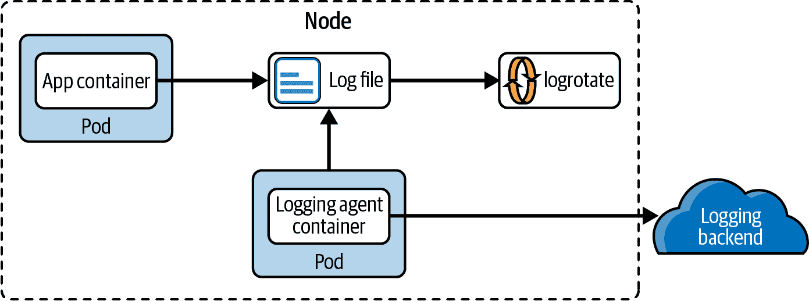
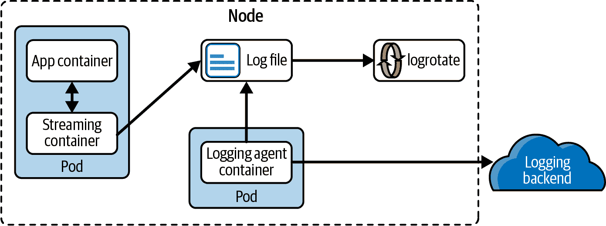
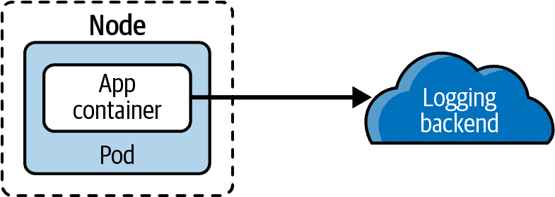
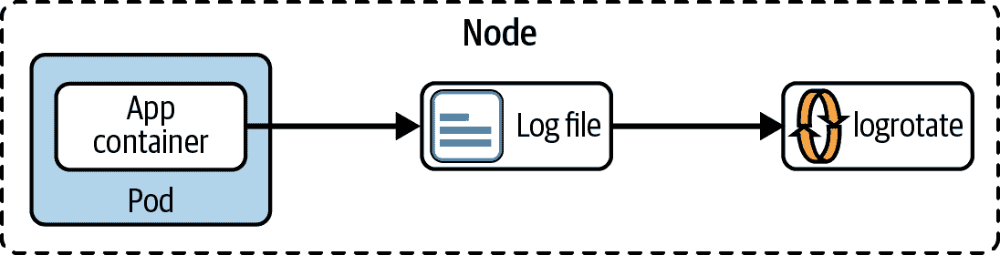
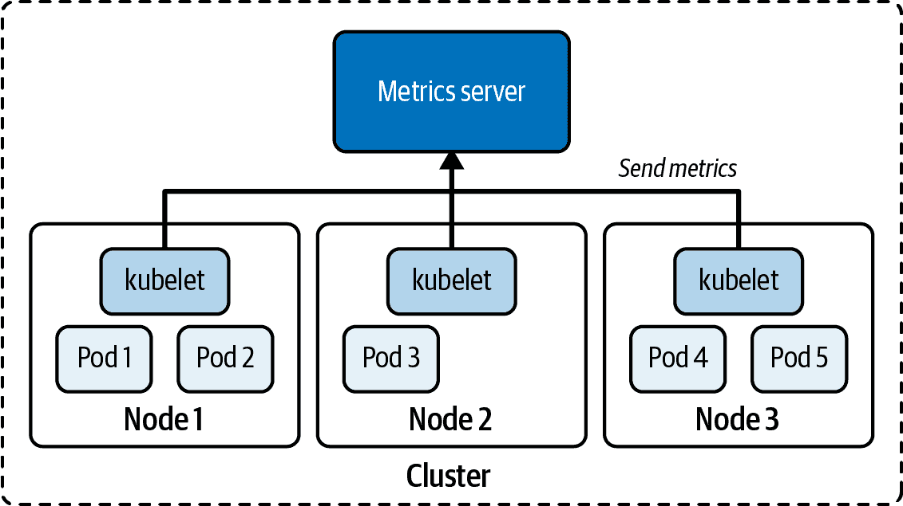

# 第七章：故障排除

建立 Kubernetes 集群是一回事。确保集群保持运行是另一回事。作为 Kubernetes 管理员，您不断面临确保集群保持功能性的挑战。因此，您的故障排除技能必须精湛，以便能够提出识别问题根本原因和修复问题的策略。

在考试涵盖的所有领域中，“故障排除”部分对总体分数的影响最大，因此理解故障场景并学会如何解决它们至关重要。本章将讨论如何在不同情况下监视和故障排除应用程序。此外，我们将讨论可能由于错误配置或错误条件而导致集群组件失败的情况。

从高层次来看，本章涵盖了以下概念：

+   评估日志记录选项

+   监控应用程序

+   访问容器日志

+   故障排除应用程序故障

+   故障排除集群故障

# 评估集群和节点日志记录

实际的 Kubernetes 集群管理着数百甚至数千个 Pod。对于每个 Pod，至少有一个运行进程的容器。每个进程可以将日志输出到标准输出或标准错误流。捕获日志输出以有效地确定应用程序错误的根本原因至关重要。此外，集群组件生成用于诊断目的的日志。

如您所见，Kubernetes 的日志记录机制对于追踪错误和监视集群组件和应用程序至关重要。可以配置 Kubernetes 在集群或节点级别上记录日志。实施方法及其潜在的权衡可能各不相同。

## 集群日志记录

Kubernetes 并没有为集群级别的日志记录提供原生解决方案，但您可以从以下三个选项中选择以满足需求：

+   实例化运行在每个集群节点上的节点级别日志代理

+   配置负责处理应用程序日志的边车容器

+   直接从应用程序逻辑推送日志到日志后端

下面的讨论解释了每种方法的优缺点。要详细讨论，请参阅[Kubernetes 文档](https://oreil.ly/rJjfV)。

### 使用节点日志代理

日志代理是一个专用工具，将日志发布到后端。后端可以是集群外的外部日志服务。图 7-1 展示了日志架构。



###### 图 7-1. 使用代理进行集群级别日志记录

这种方法的好处在于，应用程序不需要更改代码或 Pod 配置来支持收集日志。代理应作为 DaemonSet 运行。

### 使用边车容器

可以配置 Pod 来运行另一个侧车容器，与主应用程序容器并行运行。侧车容器会流式传输应用程序生成的标准输出和错误，并将流重定向到不同的位置（例如日志后端或挂载到容器的卷）。图 7-2 展示了集成流式侧车的 Pod 的日志设置。



###### 图 7-2\. 使用侧车容器进行集群级别的日志记录

这种方法的好处在于可以轻松地分离不同的流（例如，将错误日志与信息日志分开）。

### 直接推送到日志后端

这种方法将责任推给应用程序而没有添加中间人。图 7-3 展示了直接推送到后端的日志设置。



###### 图 7-3\. 通过直接推送到后端的集群级别的日志记录

虽然在架构上较少复杂，但任何对日志后端的更改都将要求修改应用程序代码，并因此需要新的部署。

## 节点日志

节点日志意味着日志文件将存储在集群节点上。容器运行时（例如 Docker Engine）通过配置的日志驱动程序将标准输出和错误流重定向到节点的存储中。

为避免填满节点存储的日志内容，应实施日志轮换。日志轮换是一种自动化过程，用于压缩、移动、删除和/或归档超过某一阈值的日志数据。Linux 工具 [logrotate](https://oreil.ly/DE7XB) 是配置 Kubernetes 集群日志轮换的一种方式。图 7-4 可视化了节点级别的架构。



###### 图 7-4\. 节点级别的日志记录

当你运行 `kubectl logs` 命令时，kubelet 收到请求后直接从节点上的日志文件读取，并将内容返回给客户端。`kubectl logs` 命令仅返回最新的日志内容，而不是已经归档的日志条目。

集群组件 kube-scheduler 和 kube-proxy 运行在容器中。因此，日志处理与任何其他应用程序容器相同。对于不在容器中运行的系统组件（例如 kubelet 和容器运行时），如果存在 systemd，则将日志写入 journald。如果没有 systemd，则系统组件将其日志文件写入目录 `/var/log`，文件扩展名为 `.log`。

# 监控集群组件和应用程序

将软件部署到 Kubernetes 集群只是长期运行应用程序的开始。开发人员和管理员都需要了解其应用程序的资源消耗模式和行为，以提供可扩展和可靠的服务。

在 Kubernetes 的世界中，像 Prometheus 和 Datadog 这样的监控工具帮助收集、处理和可视化信息。考试不要求您熟悉商业监控、日志记录、跟踪和聚合工具；但是，了解负责收集使用情况指标的底层 Kubernetes 基础设施的基本情况会有所帮助。以下列表显示了典型指标的示例：

+   集群中的节点数

+   节点的健康状态

+   节点性能指标如 CPU、内存、磁盘空间、网络

+   Pod 级别的性能指标如 CPU 和内存消耗

这一责任落在[度量服务器](https://oreil.ly/OycST)手中，它是整个集群中资源使用数据的聚合器。如图 7-5 所示，运行在节点上的 kubelet 收集指标并将其发送到度量服务器。



###### 图 7-5\. 用于度量服务器的数据收集

度量服务器将数据存储在内存中，不会持久化数据。如果您正在寻找保留历史数据的解决方案，那么您需要考虑商业选项。有关其安装过程的更多信息，请参阅文档。如果您在使用 Minikube 作为练习环境，则可以使用以下命令简单地[启用度量服务器插件](https://oreil.ly/NanXK)：

```
$ minikube addons enable metrics-server
The 'metrics-server' addon is enabled

```

您现在可以使用 `top` 命令查询集群节点和 Pod 的指标：

```
$ kubectl top nodes
NAME       CPU(cores)   CPU%   MEMORY(bytes)   MEMORY%
minikube   283m         14%    1262Mi          32%
$ kubectl top pod frontend
NAME       CPU(cores)   MEMORY(bytes)
frontend   0m           2Mi
```

# 故障排除应用程序故障

在生产 Kubernetes 集群中运行应用时，几乎不可避免地会遇到故障情况。作为管理员，您有责任（可能与应用程序开发人员密切合作）调试已部署的 Kubernetes 对象的问题。

在本节中，我们将探讨可以帮助识别问题根本原因的调试策略，以便您可以采取行动并适当地修正故障。有关更多信息，请参考[Kubernetes 文档](https://oreil.ly/4pxVS)。

## 故障排除 Pods

在大多数情况下，创建 Pod 不会出现问题。您只需使用 `run`、`create` 或 `apply` 命令来实例化 Pod。如果 YAML 文件清单格式正确，Kubernetes 将接受您的请求，因此假设一切正常运行。为了验证正确行为，您首先需要检查 Pod 的高级运行时信息。此操作可能涉及其他 Kubernetes 对象，如负责部署多个 Pod 副本的 Deployment。

### 检索高级信息

若要检索信息，请运行 `kubectl get pods` 命令来获取命名空间中正在运行的 Pods 的信息，或者运行 `kubectl get all` 命令来检索命名空间中最重要的对象类型（包括 Deployments）。你需要查看 `READY`、`STATUS` 和 `RESTARTS` 列。在最佳情况下，准备好的容器数量应该与 Pod 预期创建的容器数量匹配。对于单容器 Pod，`READY` 列应为 1/1。状态应为 `Running`，表示 Pod 进入了正确的生命周期状态。请注意，可能存在一个 Pod 处于 `Running` 状态，但实际上应用程序未能正常工作。如果重启次数大于 0，则可能需要检查存活探测器（如果定义了）的逻辑，并确定为何需要重启。

以下 Pod 观察到 `ErrImagePull` 状态，并且没有可用于入站流量的容器（0/1）。简言之，这个 Pod 存在问题：

```
$ kubectl get pods
NAME                  READY   STATUS         RESTARTS   AGE
pod/misbehaving-pod   0/1     ErrImagePull   0          2s
```

在使用 Kubernetes 一段时间后，您将自动识别常见的错误条件。表 7-1 列出了一些常见的错误状态，并解释了如何修复它们。

表 7-1\. 常见 Pod 错误状态

| 状态 | 根本原因 | 潜在修复方法 |
| --- | --- | --- |
| `ImagePullBackOff` 或 `ErrImagePull` | 无法从注册表拉取图像。 | 检查正确的图像名称，检查图像名称在注册表中是否存在，验证节点到注册表的网络访问，确保适当的身份验证。 |
| `CrashLoopBackOff` | 容器中运行的应用程序或命令崩溃。 | 检查容器中执行的命令，确保图像可以正确执行（例如，通过使用 Docker 创建容器）。 |
| `CreateContainerConfigError` | 容器引用的 ConfigMap 或 Secret 未找到。 | 检查配置对象的正确名称，在命名空间中验证配置对象的存在性。 |

### 检查事件

完全可能您不会遇到这些错误状态中的任何一个。但 Pod 仍可能存在配置问题的可能性。您可以使用 `kubectl describe pod` 命令检索有关 Pod 及其事件的详细信息。以下输出属于尝试挂载不存在的 Secret 的 Pod。而不是显示具体的错误消息，该 Pod 卡在 `ContainerCreating` 状态：

```
$ kubectl get pods
NAME         READY   STATUS              RESTARTS   AGE
secret-pod   0/1     ContainerCreating   0          4m57s
$ kubectl describe pod secret-pod
...
Events:
  Type     Reason       Age                   From               Message
  ----     ------       ----                  ----               -------
  Normal   Scheduled    <unknown>             default-scheduler \
  Successfully assigned default/secret-pod to minikube
  Warning  FailedMount  3m15s                 kubelet, minikube  Unable to \
  attach or mount volumes: unmounted volumes=[mysecret], unattached \
  volumes=[default-token-bf8rh mysecret]: timed out waiting for the condition
  Warning  FailedMount  68s (x10 over 5m18s)  kubelet, minikube  \
  MountVolume.SetUp failed for volume "mysecret" : secret "mysecret" not found
  Warning  FailedMount  61s                   kubelet, minikube  Unable to \
  attach or mount volumes: unmounted volumes=[mysecret], unattached \
  volumes=[mysecret default-token-bf8rh]: timed out waiting for the condition
```

另一个有用的命令是 `kubectl get events`。该命令的输出列出了给定命名空间中所有 Pods 的事件。您可以使用额外的命令行选项进一步过滤和排序事件：

```
$ kubectl get events
LAST SEEN   TYPE      REASON             OBJECT                MESSAGE
3m14s       Warning   BackOff            pod/custom-cmd        Back-off \
restarting failed container
2s          Warning   FailedNeedsStart   cronjob/google-ping   Cannot \
determine if job needs to be started: too many missed start time (> 100). \
Set or decrease .spec.startingDeadlineSeconds or check clock skew
```

### 检查日志

在调试 Pod 时，可以通过下载和检查其日志来获取下一级别的详细信息。您可能会找到指向行为不端 Pod 根本原因的额外信息，也可能找不到。但值得一试。在 示例 7-1 中显示的 YAML 清单定义了运行 shell 命令的 Pod。

##### 示例 7-1\. 运行失败的 shell 命令的 Pod

```
apiVersion: v1
kind: Pod
metadata:
  name: incorrect-cmd-pod
spec:
  containers:
  - name: test-container
    image: busybox
    command: ["/bin/sh", "-c", "unknown"]
```

创建对象后，Pod 的状态为 `CrashLoopBackOff`。运行 `logs` 命令显示容器中运行的命令存在问题：

```
$ kubectl create -f crash-loop-backoff.yaml
pod/incorrect-cmd-pod created
$ kubectl get pods incorrect-cmd-pod
NAME                READY   STATUS              RESTARTS   AGE
incorrect-cmd-pod   0/1     CrashLoopBackOff    5          3m20s
$ kubectl logs incorrect-cmd-pod
/bin/sh: unknown: not found
```

命令 `logs` 提供了两个有用的选项，在此我想提一下。选项 `-f` 可以实时流式传输日志，意味着您会看到新的日志条目随着其实时生成而出现。选项 `--previous` 获取容器上一次实例化的日志，如果容器已重新启动，则此选项非常有用。

## 打开交互式 Shell

如果之前的任何命令未指向故障 Pod 的根本原因，那么现在是打开容器交互式 shell 的时候了。作为应用程序开发者，您可能最了解运行时应用程序的预期行为。确保已创建正确的配置，并使用运行在容器中的 Unix 或 Windows 实用工具检查正在运行的进程。

假设您遇到一个情况，一个 Pod 表面上似乎正常工作，如 示例 7-2 所示。

##### 示例 7-2\. 一个周期性地将当前日期写入文件的 Pod

```
apiVersion: v1
kind: Pod
metadata:
  name: failing-pod
spec:
  containers:
  - args:
    - /bin/sh
    - -c
    - while true; do echo $(date) >> ~/tmp/curr-date.txt; sleep \
      5; done;
    image: busybox
    name: failing-pod
```

创建 Pod 后，检查其状态。状态显示为 `Running`；但是，在向应用程序发出请求时，端点报告错误。接下来，您检查日志。日志输出显示了指向不存在目录的错误消息。显然，目录尚未正确设置，但应用程序需要它：

```
$ kubectl create -f failing-pod.yaml
pod/failing-pod created
$ kubectl get pods failing-pod
NAME          READY   STATUS    RESTARTS   AGE
failing-pod   1/1     Running   0          5s
$ kubectl logs failing-pod
/bin/sh: can't create /root/tmp/curr-date.txt: nonexistent directory
```

命令 `exec` 打开一个交互式 shell 以进一步调查问题。下面，我们在运行中的容器内使用 Unix 工具 `mkdir`、`cd` 和 `ls` 来解决问题。显然，更好的缓解策略是从应用程序中创建目录或在 Dockerfile 中提供指令：

```
$ kubectl exec failing-pod -it -- /bin/sh
# mkdir -p ~/tmp
# cd ~/tmp
# ls -l
total 4
-rw-r--r-- 1 root root 112 May  9 23:52 curr-date.txt

```

## 故障排除服务

服务为 Pod 提供统一的网络接口。有关 Kubernetes 网络方面的全面覆盖，请参阅 第 5 章。在此，我想指出这个原始的故障排除技术。

如果无法访问应该映射到服务的 Pod，请先确保标签选择器与 Pod 的分配标签匹配。您可以通过描述服务查询信息，然后使用选项 `--show-labels` 渲染可用 Pod 的标签。以下示例没有匹配的标签，因此不适用于命名空间中运行的任何 Pod：

```
$ kubectl describe service myservice
...
Selector:          app=myapp
...
$ kubectl get pods --show-labels
NAME                     READY   STATUS    RESTARTS   AGE     LABELS
myapp-68bf896d89-qfhlv   1/1     Running   0          7m39s   app=hello
myapp-68bf896d89-tzt55   1/1     Running   0          7m37s   app=world
```

或者，您还可以查询 Service 实例的端点。假设您期望有三个 Pod 被匹配的标签选择，但只暴露了两个。您将需要查看标签选择条件：

```
$ kubectl get endpoints myservice
NAME        ENDPOINTS                     AGE
myservice   172.17.0.5:80,172.17.0.6:80   9m31s
```

一个常见的困惑来源是 Service 的类型。默认情况下，Service 类型是`ClusterIP`，这意味着只有从集群内的同一节点查询时，才能通过 Service 访问 Pod。首先检查 Service 的类型。如果您认为`ClusterIP`是您想要分配的正确类型，请从集群内的临时 Pod 打开交互式 shell，并运行`curl`或`wget`命令：

```
$ kubectl get services
NAME         TYPE        CLUSTER-IP      EXTERNAL-IP   PORT(S)   AGE
myservice    ClusterIP   10.99.155.165   <none>        80/TCP    15m
$ kubectl run tmp --image=busybox -it --rm -- wget -O- 10.99.155.165:80
...
```

最后，检查从 Service 的目标端口到 Pod 的容器端口的端口映射是否正确配置。这两个端口需要匹配，否则网络流量将无法正确路由：

```
$ kubectl get service myapp -o yaml | grep targetPort:
    targetPort: 80
$ kubectl get pods myapp-68bf896d89-qfhlv -o yaml | grep containerPort:
    - containerPort: 80
```

# 故障排除集群故障

许多影响因素可以在组件级别上导致 Kubernetes 集群出现故障。列出集群中可用的节点是一个好主意，以识别潜在问题：

```
$ kubectl get nodes
NAME           STATUS   ROLES                  AGE     VERSION
minikube       Ready    control-plane,master   3m18s   v1.22.3
minikube-m02   Ready    <none>                 2m51s   v1.22.3
minikube-m03   Ready    <none>                 2m24s   v1.22.3
```

输出将为您提供一览。您可以从`ROLES`列、使用的 Kubernetes 版本以及当前的健康状态轻松地识别每个节点的责任。

在高级别识别问题时需要注意几点：

+   节点的健康状态是否除“Ready”之外的其他状态？

+   节点的版本是否与其他节点的版本不一致？

在接下来的章节中，您可以找到关于故障排除控制平面节点与工作节点的各自部分。

## 故障排除控制平面节点

控制平面节点是保持集群运行的关键组件。如“管理高可用集群”中所述，集群可以由多个控制平面节点组成，以确保高度的可用性。检测到其中一个控制平面节点故障应被视为极端紧急，以避免损害高可用特性。有关故障排除技术和根本原因分析的更多信息，请参考[Kubernetes 文档](https://oreil.ly/KWeTt)。

### 渲染集群信息

要进一步诊断控制平面节点上的问题，请运行命令`kubectl cluster-info`。如下输出所示，该命令呈现了控制平面和其他集群服务的地址：

```
$ kubectl cluster-info
Kubernetes control plane is running at https://192.168.64.21:8443
CoreDNS is running at https://192.168.64.21:8443/api/v1/namespaces/ \
kube-system/services/kube-dns:dns/proxy

To further debug and diagnose cluster problems, use *kubectl cluster-info dump*.
```

要详细查看集群日志，请添加`dump`子命令。由于页面和页面的日志消息，我们不会在本书中渲染输出。解析消息以查找是否存在任何错误：

```
$ kubectl cluster-info dump
```

### 检查控制平面组件

在控制平面节点上[可用的组件](https://oreil.ly/IZR8Z)包括以下内容：

+   kube-apiserver：为像`kubectl`这样的客户端公开 Kubernetes API，用于管理对象。

+   etcd：用于存储集群数据的键值存储。

+   kube-scheduler：为已计划但未创建的 Pod 选择节点。

+   kube-controller-manager：运行控制器进程（例如，负责 Job 对象执行的作业控制器）。

+   cloud-controller-manager：将特定于云提供商的 API 链接到 Kubernetes 集群。在 Kubernetes 的本地集群安装中，此控制器不可用。

要查找这些组件及其状态，请列出命名空间`kube-system`中可用的 Pods。在这里，你可以找到 Minikube 上控制平面组件的列表：

```
$ kubectl get pods -n kube-system
NAME                               READY   STATUS    RESTARTS      AGE
etcd-minikube                      1/1     Running   1 (11d ago)   29d
kube-apiserver-minikube            1/1     Running   1 (11d ago)   29d
kube-controller-manager-minikube   1/1     Running   1 (11d ago)   29d
kube-scheduler-minikube            1/1     Running   1 (11d ago)   29d
...
```

任何状态不显示“Running”的情况都应进一步检查。你可以像检索其他 Pod 的日志一样，使用`logs`命令检索控制平面组件 Pod 的日志。以下命令下载 kube-apiserver 组件的日志：

```
$ kubectl logs kube-apiserver-minikube -n kube-system
```

## 故障排除工作节点

工作节点负责管理工作负载。确保有足够数量的工作节点可用以分配负载。有关如何加入工作节点到集群的更深入讨论，请参阅第二章。

集群中的任何节点都可以转入错误状态。作为 Kubernetes 管理员，你的工作是及时识别这些情况并加以修复。当列出集群节点时，你可能会看到一个工作节点不处于“Ready”状态，这表明它无法处理工作负载。在`get nodes`命令的输出中，你可以看到名为`worker-1`的节点处于“NotReady”状态：

```
$ kubectl get nodes
NAME                STATUS     ROLES                  AGE     VERSION
k8s-control-plane   Ready      control-plane,master   4d20h   v1.22.3
worker-1            NotReady   <none>                 4d20h   v1.22.3
worker-2            Ready      <none>                 4d20h   v1.22.3
```

“NotReady”状态意味着节点未使用，并将积累操作成本而未实际安排工作负载。节点进入此状态可能有各种原因。以下列表显示了最常见的原因：

+   资源不足：节点可能内存或磁盘空间不足。

+   kubelet 进程存在问题：该进程可能已崩溃或在节点上停止运行。因此，它无法再与任何控制平面节点上运行的 API 服务器进行通信。

+   kube-proxy 存在问题：运行 kube-proxy 的 Pod 负责集群内外的网络通信。该 Pod 已转入非功能状态。

SSH 登录相关工作节点并开始调查。

### 检查可用资源

确定不可用工作节点根本原因的一种好方法是查看其详细信息。`describe node`命令呈现标记为“Conditions”的部分：

```
$ kubectl describe node worker-1
....
Conditions:
  Type                 Status  LastHeartbeatTime               \
    LastTransitionTime                Reason                       Message
  ----                 ------  -----------------               \
    ------------------                ------                       -------
  NetworkUnavailable   False   Thu, 20 Jan 2022 18:12:13 +0000 \
    Thu, 20 Jan 2022 18:12:13 +0000   CalicoIsUp               \
        Calico is running on this node
  MemoryPressure       False   Tue, 25 Jan 2022 15:59:18 +0000 \
    Thu, 20 Jan 2022 18:11:47 +0000   KubeletHasSufficientMemory \
      kubelet has sufficient memory available
  DiskPressure         False   Tue, 25 Jan 2022 15:59:18 +0000 \
    Thu, 20 Jan 2022 18:11:47 +0000   KubeletHasNoDiskPressure \
        kubelet has no disk pressure
  PIDPressure          False   Tue, 25 Jan 2022 15:59:18 +0000 \
    Thu, 20 Jan 2022 18:11:47 +0000   KubeletHasSufficientPID  \
        kubelet has sufficient PID available
  Ready                True    Tue, 25 Jan 2022 15:59:18 +0000 \
    Thu, 20 Jan 2022 18:12:07 +0000   KubeletReady             \
        kubelet is posting ready status. AppArmor enabled
...
```

表格包含有关节点可用资源的信息，以及类似网络的其他服务的指示。查看是否有任何资源类型显示状态`True`或`Unknown`，这意味着特定资源存在问题。你可以进一步使用系统级命令排查不可用资源。

要检查内存使用情况和运行进程的数量，请使用`top`命令：

```
$ top
top - 18:45:09 up 1 day,  2:21,  1 user,  load average: 0.13, 0.13, 0.15
Tasks: 116 total,   3 running,  70 sleeping,   0 stopped,   0 zombie
%Cpu(s):  1.5 us,  0.8 sy,  0.0 ni, 97.7 id,  0.0 wa,  0.0 hi,  0.0 si,  0.0 st
KiB Mem :  1008552 total,   134660 free,   264604 used,   609288 buff/cache
KiB Swap:        0 total,        0 free,        0 used.   611248 avail Mem
...
```

要检查可用磁盘空间，请使用 `df` 命令：

```
$ df -h
Filesystem      Size  Used Avail Use% Mounted on
udev            480M     0  480M   0% /dev
tmpfs            99M  1.0M   98M   2% /run
/dev/sda1        39G  2.7G   37G   7% /
tmpfs           493M     0  493M   0% /dev/shm
tmpfs           5.0M     0  5.0M   0% /run/lock
tmpfs           493M     0  493M   0% /sys/fs/cgroup
vagrant         1.9T  252G  1.6T  14% /vagrant
tmpfs            99M     0   99M   0% /run/user/1000
```

### 检查 kubelet 进程

由 `describe node` 命令生成的某些条件提到了 kubelet 进程。如果查看 `Message` 列，您可能会对 kubelet 进程是否正常运行有所了解。若要排除 kubelet 进程的问题，请运行以下 `systemctl` 命令：

```
$ systemctl status kubelet
● kubelet.service - kubelet: The Kubernetes Node Agent
   Loaded: loaded (/lib/systemd/system/kubelet.service; enabled; \
   vendor preset: enabled)
  Drop-In: /etc/systemd/system/kubelet.service.d
           └─10-kubeadm.conf
   Active: active (running) since Thu 2022-01-20 18:11:41 UTC; 5 days ago
     Docs: https://kubernetes.io/docs/home/
 Main PID: 6537 (kubelet)
    Tasks: 15 (limit: 1151)
   CGroup: /system.slice/kubelet.service
           └─6537 /usr/bin/kubelet \
           --bootstrap-kubeconfig=/etc/kubernetes/bootstrap-kubelet.conf \
           --kubeconfig=/etc/kubernetes/kubelet.conf \
           --config=/var/lib/kubelet/config.yaml --network-lines 1-10/10
```

输出中最重要的信息是 `Active` 属性的值。如果除了“active (running)”之外还有其他内容，则需要深入挖掘。使用 `journalctl` 查看进程的日志文件：

```
$ journalctl -u kubelet.service
-- Logs begin at Thu 2022-01-20 18:10:41 UTC, end at
Tue 2022-01-25 18:44:05 UTC. --
Jan 20 18:11:31 worker-1 systemd[1]: Started kubelet: The Kubernetes Node Agent.
Jan 20 18:11:31 worker-1 systemd[1]: kubelet.service: Current command vanished \
from the unit file, execution of the command list won't be resumed.
Jan 20 18:11:31 worker-1 systemd[1]: Stopping kubelet: The Kubernetes
Node Agent...
Jan 20 18:11:31 worker-1 systemd[1]: Stopped kubelet: The Kubernetes Node Agent.
Jan 20 18:11:31 worker-1 systemd[1]: Started kubelet: The Kubernetes Node Agent.
....
```

一旦在日志中确定了问题并进行了修复，您将需要重新启动进程：

```
$ systemctl restart kubelet
```

### 检查证书

有时，kubelet 使用的证书可能会过期。确保 `Issuer` 和 `Not After` 属性的值是正确的：

```
$ openssl x509 -in /var/lib/kubelet/pki/kubelet.crt -text
Certificate:
    Data:
        Version: 3 (0x2)
        Serial Number: 2 (0x2)
        Signature Algorithm: sha256WithRSAEncryption
        Issuer: CN = worker-1-ca@1642702301
        Validity
            Not Before: Jan 20 17:11:41 2022 GMT
            Not After : Jan 20 17:11:41 2023 GMT
        Subject: CN = worker-1@1642702301
        ...
```

### 检查 kube-proxy Pod

kube-proxy 组件在 `kube-system` 命名空间中的一组专用 Pods 中运行。您可以通过它们的命名前缀 `kube-proxy` 和附加的哈希来清楚地识别这些 Pods。验证任何一个 kube-proxy Pod 的状态是否与“Running”不同。每个 kube-proxy Pod 都运行在专用的工作节点上。您可以添加 `-o wide` 选项，在新列中渲染 Pod 所在的节点：

```
$ kubectl get pods -n kube-system
NAME               READY   STATUS    RESTARTS   AGE
...
kube-proxy-csrww   1/1     Running   0          4d22h
kube-proxy-fjd48   1/1     Running   0          4d22h
kube-proxy-tvf52   1/1     Running   0          4d22h
```

查看似乎存在问题的 kube-proxy Pods 的事件日志。以下命令描述了名为 `kube-proxy-csrww` 的 Pod。此外，您可能会在相应 DaemonSet 的事件日志中找到更多信息：

```
$ kubectl describe pod kube-proxy-csrww -n kube-system
$ kubectl describe daemonset kube-proxy -n kube-system
```

日志也可能很有用。您只能检查在特定工作节点上运行的 kube-proxy Pod 的日志：

```
$ kubectl describe pod kube-proxy-csrww -n kube-system | grep Node:
Node:                 worker-1/10.0.2.15
$ kubectl logs kube-proxy-csrww -n kube-system
```

# 总结

作为 Kubernetes 管理员，您需要能够识别和修复应用程序和集群组件的问题。

日志记录对于追踪应用流程和捕获潜在错误消息至关重要。您可以在集群级别和节点级别配置日志记录，每种方法都有其各自的优势和潜在缺陷。根据日志捕获的方法，可能会涉及诸如日志轮换和日志后端服务等方面。在 Pod 级别，您可以直接使用 `kubectl logs` 命令请求应用程序日志。使用命令行选项 `-c` 来针对多容器设置中的特定容器。

Kubernetes 的原生监控服务，指标服务器，可以安装在集群上，用于收集和聚合 Pod 和节点资源利用率数据。节点通过 kubelet 向集中的指标服务器发送指标。最终用户可以使用 `kubectl top` 命令，将这些指标呈现出来，以识别资源使用过度的情况。

工作负载和网络对象的错误配置可能导致应用程序问题。您需要熟悉诊断根本原因的相关策略以及如何修复它们。集群也可能出现错误状态，导致各种运营问题。您需要了解控制平面节点和工作节点上运行的集群组件和进程。我们讨论了应对不同故障情况的策略。

# 考试要点

理解日志配置的理论层面。

Kubernetes 日志记录不是内置功能。您需要在集群或节点级别积极配置日志记录。比较不同的方法及其潜在的权衡。

使访问容器日志成为您的日常工作重点。

访问容器日志非常直接。只需使用`logs`命令即可。练习所有相关的命令行选项的使用。选项`-c`用于指定特定容器。对于单容器 Pod，不必显式使用该选项。选项`-f`可用于跟踪应用程序中的日志条目。如果需要查看先前容器的日志，即使容器已重启，也可以使用选项`-p`来访问日志。

安装和使用度量服务器

Kubernetes 集群默认未安装度量服务器。按照安装服务的步骤操作。在考试中，可以假设度量服务器已经可用。使用`top`命令查看 Pods 和节点的资源消耗情况。

知道如何排查应用程序问题。

运行在 Pod 中的应用程序可能因配置错误而容易出现故障。考虑可能发生的情景，并试图积极地对其进行建模，以表示故障情况。然后使用命令`get`、`logs`和`exec`，深入了解问题并修复它。尝试构想不常见的场景，以便更轻松地找到和修复不同资源类型的应用程序问题。

知道如何排查集群问题。

控制平面和工作节点可能因多种原因而变得无响应或无功能。管理员需要关注其集群的健康状况，以保持其可操作性和可扩展性。尝试模拟可能发生的错误情景，并应用讨论的故障排除技术来识别和修复潜在的根本原因。

# 样例练习

这些练习的解决方案可在附录中找到。

1.  您应该使用一个带有边车容器的集群级别日志记录。创建一个名为`multi`的多容器 Pod。主应用程序容器名为`nginx`，使用镜像`nginx:1.21.6`。边车容器名为`streaming`，使用镜像`busybox:1.35.0`和参数`/bin/sh`, `-c`, `'tail -n+1 -f /var/log/nginx/access.log'`。

1.  为 Pod 定义一个`emptyDir`类型的卷，并将其挂载到路径`/var/log/nginx`上，供两个容器使用。

1.  使用 `wget` 或 `curl` 命令多次访问 nginx 服务的端点。检查 sidecar 容器的日志。

1.  创建两个名为 `stress-1` 和 `stress-2` 的 Pod。定义一个使用镜像 `polinux/stress:1.0.4`，命令为 `stress`，参数为 `/bin/sh`, `-c` 和 `'stress --vm 1 --vm-bytes $(shuf -i 20-200 -n 1)M --vm-hang 1'` 的容器。设置容器的内存资源限制和请求为 250Mi。

1.  利用指标服务器提供的数据，确定 `stress-1` 或 `stress-2` 中哪个 Pod 消耗了最多的内存。将 Pod 的名称写入文件 `max-memory.txt`。

1.  进入检出的 GitHub 仓库 [*bmuschko/cka-study-guide*](https://oreil.ly/jUIq8) 的目录 `app-a/ch07/troubleshooting-pod`。按照文件 [`instructions.md`](https://oreil.ly/j9lTr) 中的说明来排除 Pod 安装的故障。

1.  进入检出的 GitHub 仓库 [*bmuschko/cka-study-guide*](https://oreil.ly/jUIq8) 的目录 `app-a/ch07/troubleshooting-deployment`。按照文件 `instructions.md` 中的说明来排除部署安装的故障。

1.  进入检出的 GitHub 仓库 [*bmuschko/cka-study-guide*](https://oreil.ly/jUIq8) 的目录 `app-a/ch07/troubleshooting-service`。按照文件 [`instructions.md`](https://oreil.ly/Z9kou) 中的说明来排除服务安装的故障。

1.  进入检出的 GitHub 仓库 [*bmuschko/cka-study-guide*](https://oreil.ly/jUIq8) 的目录 `app-a/ch07/troubleshooting-control-plane-node`。按照文件 [`instructions.md`](https://oreil.ly/lGygu) 中的说明来排除控制平面节点安装的故障。

    *先决条件:* 此练习需要安装工具 [Vagrant](https://oreil.ly/sasln) 和 [VirtualBox](https://oreil.ly/9Cvg9)。

1.  进入检出的 GitHub 仓库 [*bmuschko/cka-study-guide*](https://oreil.ly/jUIq8) 的目录 `app-a/ch07/troubleshooting-worker-node`。按照文件 [`instructions.md`](https://oreil.ly/Kyh58) 中的说明来排除工作节点安装的故障。

    *先决条件:* 此练习需要安装工具 [Vagrant](https://oreil.ly/sasln) 和 [VirtualBox](https://oreil.ly/9Cvg9)。
