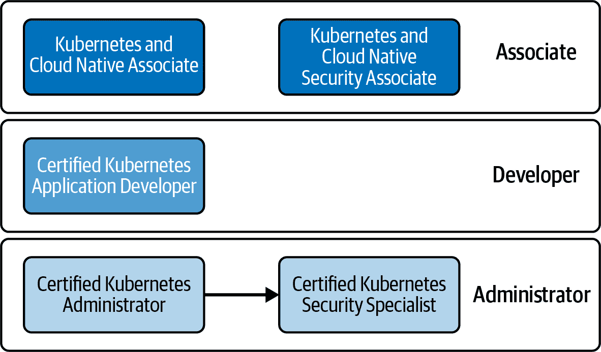
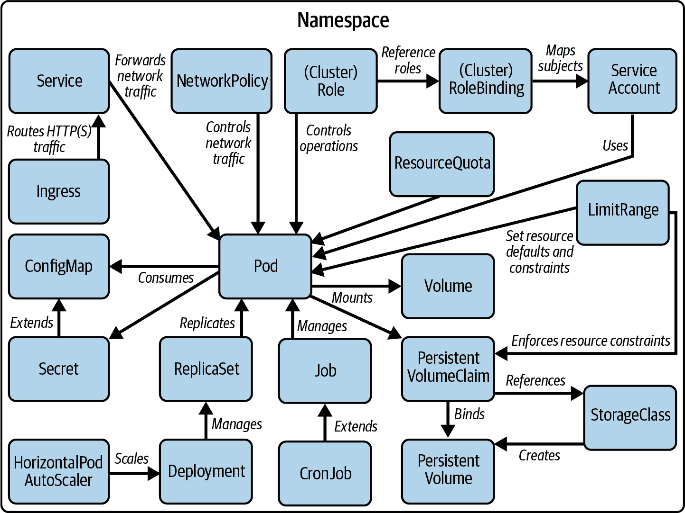

# 第一章：考试详情和资源

本章回答了准备成功通过 [Certified Kubernetes Application Developer (CKAD)](https://oreil.ly/sq-Po) 考试的候选人最常问的问题。后续章节将为您总结 Kubernetes 的优势和架构 以及如何使用 `kubectl` 与 Kubernetes 集群交互。

# Kubernetes 认证学习路径

CNCF 提供四种不同的 Kubernetes 认证。图 1-1 按目标受众对其进行分类。



###### 图 1-1。Kubernetes 认证学习路径

中级认证的目标受众是云和 Kubernetes 的初学者。中级认证考试采用多项选择题格式。您不需要在交互环境中与 Kubernetes 集群进行交互。

从业者级别认证适用于具有预先 Kubernetes 经验的开发人员和管理员。此类别中的考试要求您在多个 Kubernetes 环境中解决问题。您会发现 CKAD 面向应用程序开发人员，不需要任何其他认证作为先决条件。

让我们简要查看每个认证，看看 CKAD 是否适合您。

## Kubernetes 与云原生联合开发者（KCNA）

KCNA 是一项面向任何对云原生应用开发、运行时环境和工具感兴趣的入门级认证项目。虽然考试涵盖 Kubernetes，但不要求您亲自操作集群。此考试包括多项选择题，适合对生态系统有广泛了解的候选人。

## Kubernetes 与云原生安全联合开发者（KCSA）

该认证侧重于安全概念的基础知识及其在 Kubernetes 集群中的应用。该计划的广度、深度和格式与 KCNA 相当。

## Certified Kubernetes Application Developer（CKAD）

CKAD 考试专注于验证您构建、配置和部署基于微服务的应用程序的能力。您不必实际实现应用程序；但是，此考试适合熟悉应用架构、运行时和编程语言等主题的开发人员。

## Certified Kubernetes Administrator (CKA)

CKA 考试的目标受众是 DevOps 从业者、系统管理员和站点可靠性工程师。此考试测试您在 Kubernetes 管理员角色中执行任务的能力，包括集群、网络、存储和初级安全管理，重点放在故障排除场景上。

## Certified Kubernetes Security Specialist（CKS）

CKS 考试扩展了 CKA 考试验证的主题。通过 CKA 考试是参加 CKS 考试的先决条件。对于这一认证，您需要对 Kubernetes 安全性有更深入的了解。课程涵盖了如何应用构建容器化应用程序的最佳实践以及确保安全的 Kubernetes 运行时环境等主题。

# 考试目标

本书侧重于为你准备 CKAD 考试。在剖析考试重要主题之前，我将简要介绍 Kubernetes 对应用开发人员的重要性背景。

越来越多的应用开发人员发现自己在从单块架构模型过渡到微服务的齐整、凝聚力和容器化项目中。这两种方法都有其优缺点，但 Kubernetes 已成为部署和操作应用程序的事实标准运行平台，无需担心底层物理基础设施。

不再是管理员或发布经理独有的责任，在目标运行环境中部署和监控其应用程序。应用开发人员需要从开发到运营全程参与其应用程序。像 Netflix 这样的一些组织完全奉行这种文化，因此作为应用开发人员，您需要全权负责做出设计决策并修复生产中的问题。现在更重要的是了解 Kubernetes 的能力，如何正确应用相关概念以及如何与该平台进行交互。

这个考试专为需要在 Kubernetes 上设计、构建、配置和管理云原生应用程序的应用开发人员设计。

# 考试期间使用的 Kubernetes 版本

在撰写本文时，考试基于 Kubernetes 1.28 版本。本书所有内容都将遵循该版本的特性、API 和命令行支持。未来版本可能会破坏向后兼容性。在准备认证时，请查阅 [Kubernetes 发布说明](https://kubernetes.io/releases/) 并使用考试所使用的 Kubernetes 版本进行实践，以避免不愉快的意外。考试环境将与 Kubernetes 发布日期后的四到八周内的最新 Kubernetes 次要版本对齐。

# 课程

以下概述列出了考试的高级部分或领域及其评分权重：

+   20%: 应用设计和构建

+   20%: 应用部署

+   15%: 应用可观察性和维护

+   25%: 应用环境、配置和安全

+   20%: 服务和网络

下面的章节详细介绍了每个领域。

## 应用设计和构建

课程的第一个领域涵盖了设计和构建一个容器化应用程序，并在 Kubernetes 中操作它。您需要熟悉基本的容器概念以及如何在 Pod 内定义一个容器。此外，该领域涵盖了更高级的用例和 Kubernetes 概念：在 Pod 中使用存储、定义多个容器以及定义和执行批处理和周期性工作负载的需求。

## 应用程序部署

该领域主要侧重于 Kubernetes 原语“Deployment”。部署（Deployment）有助于使用相同定义的 Pod 进行扩展，即所谓的副本，并管理其控制的所有副本的配置。您需要理解管理部署（Deployment）的方法，包括有助于控制向副本中滚动新版本应用程序的策略。最后，您需要熟悉 Helm，这是一个用于管理部署和配置应用程序堆栈所需清单集合的开源工具。

## 应用程序可观察性和维护

将应用程序部署到 Kubernetes 只是第一步。您需要能够监视、检查并可能调试 Kubernetes 对象。探针（Probes）是该领域涵盖的重要概念：它们为运行在 Pod 中的应用程序定义健康检查。此外，您需要能够确定工作负载的运行时问题并解决它们。

## 应用程序环境、配置和安全性

Kubernetes 提供了可配置用于 Pod 的安全性和资源管理功能。这包括本领域涵盖的安全上下文和资源需求/约束。此外，您需要能够演示使用 ConfigMaps 和 Secrets 将配置数据注入到 Pod 中，以控制其运行时行为。该领域还涉及基于角色的访问控制（RBAC）和自定义资源定义（CRDs）的基本概念和功能。

## 服务和网络

课程的最后一个领域涉及为应用程序提供来自集群内部和外部的网络访问。为此，您需要展示对服务（Services）和入口（Ingress）的了解。最后，您需要对网络策略有一个大致的了解，这些策略本质上是允许或拒绝 Pod 之间通信的规则。

# 涉及的 Kubernetes 原语

一些考试目标可以通过理解相关的核心 Kubernetes 原语来实现。请注意，考试将多个概念结合到一个问题中。请参考图 1-2，作为适用的 Kubernetes 资源及其关系的指南。



###### 图 1-2\. 考试相关的 Kubernetes 原语

# 文档

在考试期间，您被允许打开一系列明确定义的网页作为参考。您可以自由浏览这些页面，并将代码复制粘贴到考试终端。

官方 Kubernetes 文档包括参考手册、GitHub 网站和博客。此外，你也可以查阅 Helm 文档。

+   参考手册：*[*https://kubernetes.io/docs*](https://kubernetes.io/docs)*

+   博客：*[*https://kubernetes.io/blog*](https://kubernetes.io/blog)*

+   Helm：*[*https://helm.sh/docs*](https://helm.sh/docs)*

随身携带 Kubernetes 文档页面非常有价值，但务必知道在这些页面中*如何*找到相关信息。在考试准备期间，至少要从头到尾阅读一次所有文档页面。不要忘记官方文档页面的搜索功能。作为参考，附录 B 将考试目标与覆盖主题的书籍章节和相关 Kubernetes 文档页面进行了映射。

# 高效使用文档

使用搜索词可能比浏览菜单项更快地找到正确的文档页面。从文档中复制粘贴代码片段到考试环境的控制台中通常效果不错。在此过程中，可能需要手动调整 YAML 的缩进格式，以确保格式正确。

# 考试环境和建议

要参加考试，你必须购买一张注册凭证，可在[CNCF 培训和认证网页](https://www.cncf.io/certification/ckad/)上获取。偶尔，CNCF 会为凭证提供折扣（例如，在美国感恩节假期前后）。这些折扣信息通常在[Linux 基金会 LinkedIn 页面](https://www.linkedin.com/company/the-linux-foundation)和 Twitter 账号[@LF_Training](https://oreil.ly/TDBVP)上公布。

购买凭证后，你可以在[PSI](https://www.psiexams.com/)（负责线上测试的公司）安排考试时间。目前没有在测试设施提供面对面的考试服务。在预定的考试日期，你将会收到一封包含测试平台登录链接的电子邮件。在你的计算机上启用音频和视频功能以防作弊。监考人员将通过音视频监控你的行动，如果发现你违反规则，将终止考试。

# 考试尝试次数

购买的凭证允许你有两次通过考试的机会。我建议在第一次尝试考试之前做好充分准备。这将为你通过考试提供公平的机会，并让你了解考试环境和问题的复杂性。如果第一次未能通过考试，不要担心，你还有一次免费的机会。

CKAD 考试时间限制为两小时。在这段时间内，你需要在一个真实预定义的 Kubernetes 集群上解决实际操作问题。每个问题都会指明你需要操作的集群。这种实际操作方式能更好地评估候选人的技能，优于多项选择题形式的测试，因为你可以直接在工作中执行任务时转化知识。

强烈建议阅读[考试常见问题解答（FAQ）](https://oreil.ly/xJeV8)。你会在那里找到大多数紧迫问题的答案，包括机器的系统要求、评分、证书更新和重新考试的要求。

# 候选人技能

该认证假定你具有 Kubernetes 的基本理解。你应该熟悉 Kubernetes 的内部结构、核心概念以及命令行工具 `kubectl`。CNCF 提供免费的[“Kubernetes 入门”课程](https://www.cncf.io/certification/training/#introduction)，适合 Kubernetes 初学者。

你的背景很可能更多偏向应用开发者，尽管你最熟悉哪种编程语言并不重要。以下是你需要增加通过考试可能性的背景知识的简要概述：

Kubernetes 架构和概念

考试不会要求你从头安装 Kubernetes 集群。先了解 Kubernetes 的基础知识和其架构组件。参考第二章快速入门 Kubernetes 的架构和概念。

`kubectl` 命令行工具

在考试中，`kubectl` 命令行工具是你与 Kubernetes 集群交互的中心工具。即使你只有很少的准备时间，练习如何操作 `kubectl` 及其命令和相关选项也是至关重要的。考试期间，你将无法访问[Web 仪表板 UI](https://oreil.ly/2tZBk)。第三章简要总结了与 Kubernetes 集群交互的最重要方式。

对容器运行时引擎的工作知识

Kubernetes 使用容器运行时引擎来管理镜像。广泛使用的容器运行时引擎是 Docker Engine。至少要了解容器文件、容器镜像、容器以及相关的命令行接口命令。第四章解释了你需要了解的有关考试的所有容器知识。

其他相关工具

Kubernetes 对象由 YAML 或 JSON 表示。本书的内容将使用 YAML 示例，因为在 Kubernetes 世界中，YAML 比 JSON 更常用。在考试中，你将需要编辑 YAML 以声明性地创建新对象或修改活动对象的配置。确保你对基本的 YAML 语法、数据类型和缩进符合规范有很好的掌握。你可能会问，如何编辑 YAML 定义？当然是从终端操作。考试终端环境预装有`vi`和`vim`工具。练习常见操作的键盘快捷键（尤其是如何退出编辑器）。我想要提到的最后一个工具是 GNU Bash。你必须理解这种脚本语言的基本语法和操作符。有可能你需要阅读、修改甚至扩展运行在容器中的多行 Bash 命令。

# 时间管理

考生有两个小时的时间完成考试，答对问题的比例需要达到 66%才能通过。许多问题由多个步骤组成。虽然 Linux Foundation 不提供详细的评分细则，但我认为部分正确的答案会得到相应的分数。

在考试时，你会注意到给定的时间限制会给你带来很大的压力。这是有意为之的。Linux Foundation 希望 Kubernetes 从业者能够在实际场景中应用他们的知识，及时找到解决问题的方法。

考试将提供一系列问题。有些问题简短且易解决；另一些需要更多的背景知识并且需要更多时间。个人建议首先解决易问题，以尽可能多地获得分数而不陷入难题。我会在考试环境集成的记事本功能中标记我无法立即解决的任何问题。在第二遍阅读时，重新审视你跳过的问题，并尝试解决它们。理想情况下，你将能够在规定的时间内解决所有问题。

# 命令行技巧和窍门

由于命令行是你与 Kubernetes 集群唯一的交互界面，所以你必须非常熟悉`kubectl`工具及其可用选项。本节提供了使其使用更高效和更有生产力的技巧和窍门。

## 设定上下文和命名空间

考试环境已为您设置了多个 Kubernetes 集群。请查看 [说明](https://oreil.ly/SM8d6) ，了解这些集群的高级技术概述。每个考试练习需要在指定的集群上解决问题，如其描述所述。此外，说明将要求您在除 `default` 之外的命名空间中工作。在开始问题之前，请确保首先设置上下文和命名空间，以下命令将上下文和命名空间设置为一次性操作：

```
$ kubectl config set-context *<context-of-question>* \
  --namespace=*<namespace-of-question>*
$ kubectl config use-context *<context-of-question>*
```

您可以在 “使用 kubectl 进行身份验证” 中找到上下文概念及其相应 `kubectl` 命令的更详细讨论。

## 使用 kubectl 的别名

在考试过程中，您将不得不执行数十甚至数百次 `kubectl` 命令。您可能是一个非常快的打字员；然而，反复完整拼写可执行文件没有意义。考试环境已经为 `kubectl` 命令设置了别名 `k`。

在准备考试时，您可以在自己的机器上设置相同的行为。以下 `alias` 命令将字母 `k` 映射到完整的 `kubectl` 命令：

```
$ alias k=kubectl
$ k version

```

## 使用 `kubectl` 命令自动完成

熟记 `kubectl` 命令和命令行选项需要大量实践。考试环境默认启用了自动完成功能。您可以在 [Kubernetes 文档](https://kubernetes.io/docs/reference/kubectl/cheatsheet/#kubectl-autocomplete) 中找到设置命令行自动完成的说明。

## 内部化资源简称

许多 `kubectl` 命令可能非常冗长。例如，管理持久卷索赔的命令是 `persistentvolumeclaims`。逐字拼写完整命令可能会出错且耗时。幸运的是，一些较长的命令具有简短的用法。`api-resources` 命令列出所有可用命令及其简称：

```
$ kubectl api-resources
NAME                    SHORTNAMES  APIGROUP  NAMESPACED  KIND
...
persistentvolumeclaims  pvc                   true        PersistentVolumeClaim
...

```

使用 `pvc` 替代 `persistentvolumeclaims` 可以使命令执行更加简洁和表达力强，如下所示：

```
$ kubectl describe pvc my-claim

```

# 练习和实践考试

在通过考试时进行实际操作练习非常重要。为此，您需要一个功能齐全的 Kubernetes 集群环境。以下选项显著：

+   我发现使用 [Vagrant](https://oreil.ly/2jLJS) 和 [VirtualBox](https://oreil.ly/3BhDj) 运行一个或多个虚拟机非常有用。这些工具有助于创建易于启动和根据需要处置的隔离 Kubernetes 环境。

+   在开发者机器上安装简单的 Kubernetes 集群相对容易。根据你的操作系统，Kubernetes 文档提供了各种[安装选项](https://oreil.ly/JrBUh)。当涉及到像 Ingress 或存储类这样的更高级功能的实验时，Minikube 非常有用，因为它提供了作为单个命令可安装的附加功能。另外，你也可以尝试使用[kind](https://kind.sigs.k8s.io/)，这是另一个用于运行本地 Kubernetes 集群的工具。

+   如果你是[O’Reilly 学习平台](https://oreil.ly/OLP)的订阅用户，你将无限制地访问到运行[Kubernetes 沙盒环境](https://oreil.ly/Uucxp)的场景。此外，你可以通过[CKAD 实践测试的交互式实验](https://learning.oreilly.com/playlists/2e9fe6dc-2a05-47fe-ae0a-34d6485287cc/)来测试你的知识。

你可能还想尝试以下一些商业学习和实践资源：

+   [Killer Shell](https://killer.sh)是一个为所有 Kubernetes 认证提供示例练习的模拟器。如果购买了考试凭证，你将获得两次免费的会话。

+   其他在线培训提供商为考试提供视频课程，其中一些包含集成的 Kubernetes 实践环境。我想提到[KodeKloud](https://oreil.ly/hHYyi)和[A Cloud Guru](https://learn.acloud.guru/course/certified-kubernetes-application-developer/)。你需要购买每门课程的订阅来访问内容。

# 概要

考试是完全的实际操作测试，要求你在多个 Kubernetes 集群中解决问题。你需要理解、使用和配置与应用开发相关的 Kubernetes 原语。考试大纲将这些重点区域细分，并对不同主题进行加权，以确定它们对总体得分的贡献。尽管重点区域被有意义地分组，但课程大纲不一定遵循自然的学习路径，因此在考试准备中跨章节参考书籍是很有帮助的。

在本章中，我们讨论了考试环境及其导航方式。要在考试中表现出色的关键是通过对`kubectl`的强化实践来解决真实场景。第一部分的接下来两章将为你提供 Kubernetes 的快速入门。

所有讨论领域细节的章节都为你提供了实践机会。每章结束时，你会找到示例练习。
