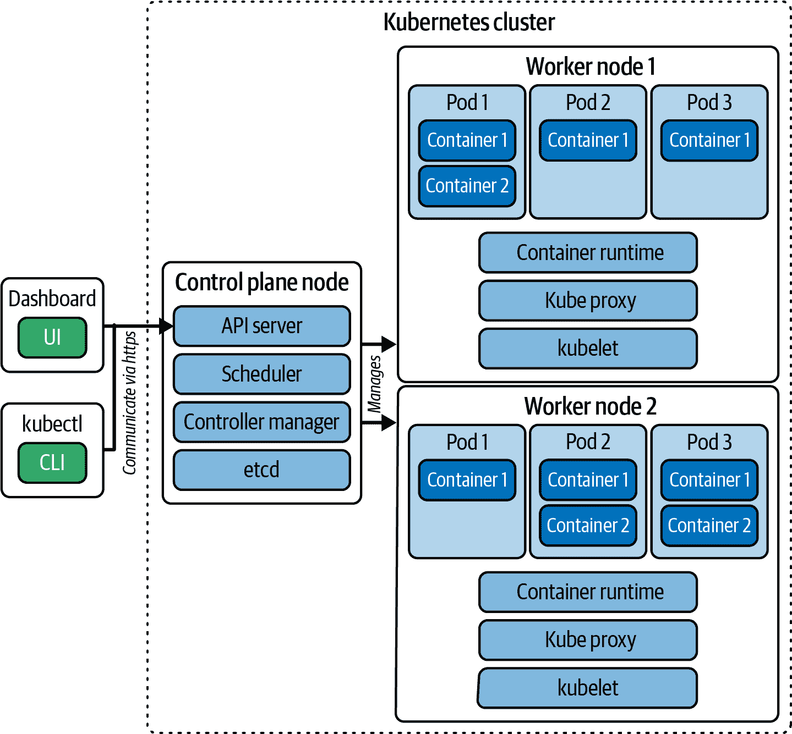

# 第二章：Kubernetes 简介

如果你是新手，快速了解 Kubernetes 是什么以及它的工作原理会很有帮助。网上有许多教程和 101 课程，但我想在本章节总结最重要的背景信息和概念。在本书的学习过程中，我们将引用集群节点组件，随时可以回顾这些信息。

# Kubernetes 是什么？

要理解 Kubernetes 是什么，首先让我们定义微服务和容器。

微服务架构要求将应用程序堆栈的各个部分作为单独的服务开发和执行，并且这些服务需要相互通信。如果决定在容器中操作这些服务，你需要管理大量的容器，同时考虑可扩展性、安全性、持久性和负载平衡等横切关注点。

像[buildkit](https://github.com/moby/buildkit)和[Podman](https://podman.io/)这样的工具将软件工件打包成容器镜像。像[Docker Engine](https://docs.docker.com/engine/)和[containerd](https://containerd.io/)这样的容器运行时引擎使用这些镜像来运行容器。这在开发者机器上用于测试或作为持续集成管道的一部分的临时执行中非常有效。有关容器的更多信息，请参阅第四章。

Kubernetes 是一个容器编排工具，可以帮助在物理机器、虚拟机器或云中操作数百甚至数千个容器。Kubernetes 还可以实现之前提到的横切关注点。容器运行时引擎与 Kubernetes 集成。每当触发容器创建时，Kubernetes 将生命周期的方面委托给容器运行时引擎。

Kubernetes 中最基本的原语是 Pod。Pod 可以运行一个或多个容器，同时添加诸如安全需求和资源消耗预期等横切关注点。请查看第五章了解这些方面。

# 特性

上一节涉及了 Kubernetes 提供的一些功能。在这里，我们将通过更详细地解释这些功能来深入探讨：

声明式模型

你不需要使用编程语言编写命令式代码来告诉 Kubernetes 如何操作应用程序。作为最终用户，你只需要声明一个期望的状态。期望的状态可以使用符合 API 架构的 YAML 或 JSON 清单定义。Kubernetes 然后维护这个状态，并在故障发生时恢复它。

自动扩展

当应用程序负载增加时，您将希望扩展资源，并在流量减少时进行缩减。在 Kubernetes 中，可以通过手动或自动缩放来实现这一点。最实用、最优化的选项是让 Kubernetes 自动缩放容器化应用程序所需的资源。

应用程序管理

应用程序的更改，例如新功能和错误修复，通常会与新标签的容器映像一起打包。您可以使用 Kubernetes 的便捷复制功能轻松地在运行它们的所有容器上部署这些更改。如果需要，在出现阻塞性错误或检测到安全漏洞的情况下，Kubernetes 还允许回滚到先前的应用程序版本。

持久存储

容器仅提供临时文件系统。在容器重新启动时，写入文件系统的所有数据都会丢失。根据应用程序的性质，您可能需要长期保留数据，例如，如果您的应用程序与数据库交互。Kubernetes 提供了挂载应用程序工作负载所需的存储的能力。

网络

要支持微服务架构，容器编排器需要允许容器之间的通信，以及从集群外的最终用户到容器的通信。Kubernetes 使用内部和外部负载平衡来路由网络流量。

# 高级架构

在架构上，一个 Kubernetes 集群由控制平面节点和工作节点组成，如 图 2-1 所示。每个节点运行在物理机器、虚拟机器或云上提供的基础设施上。要添加到集群中的节点数及其拓扑结构取决于应用程序资源的需求。

###### 图 2-1\. Kubernetes 集群节点和组件

控制平面节点和工作节点具有特定的责任：

控制平面节点

此节点通过 API 服务器公开 Kubernetes API，并管理构成集群的节点。它还响应集群事件，例如，当最终用户请求扩展 Pod 数量以分配应用程序的负载时。生产集群采用 [高可用 (HA) 架构](https://kubernetes.io/docs/setup/production-environment/tools/kubeadm/ha-topology/)，通常涉及三个或更多控制平面节点。

工作节点

工作节点执行由 Pod 管理的容器工作负载。每个工作节点需要在主机机器上安装容器运行时引擎，以便能够管理容器。

在接下来的两个部分中，我们将讨论嵌入在这些节点中以完成其任务的关键组件。像集群 DNS 这样的附加组件在此处没有明确讨论。请参阅 [Kubernetes 文档](https://kubernetes.io/docs/concepts/overview/components/) 以获取更多详细信息。

## 控制平面节点组件

控制平面节点需要特定的组件来执行其工作。以下组件列表将为您提供一个概述：

API 服务器

API 服务器公开了 API 端点，客户端可以用来与 Kubernetes 集群通信。例如，如果您执行名为`kubectl`的命令行基础的 Kubernetes 客户端工具，您将向 API 服务器公开的端点发出 RESTful API 调用，这是其实现的一部分。 API 服务器内部的 API 处理过程将确保诸如身份验证、授权和准入控制等方面。有关更多信息，请参见第十七章。

调度器

调度器是一个后台进程，负责监视新的 Kubernetes Pod，如果没有分配节点，则将其分配给工作节点以执行。

控制器管理器

控制器管理器监视集群状态并在需要时实施更改。例如，如果您对现有对象进行配置更改，则控制器管理器将尝试将对象带入所需状态。

Etcd

集群状态数据需要随时间持久化，以便在节点或整个集群重新启动时重建。这是[etcd](https://etcd.io/)的职责，它是 Kubernetes 集成的开源软件。在其核心，etcd 是一个键值存储，用于持久化与 Kubernetes 集群相关的所有数据。

## 常见节点组件

Kubernetes 使用所有节点都可以利用的组件，而不考虑它们的专门责任：

Kubelet

Kubelet 在集群中的每个节点上运行；然而，它最合理存在于工作节点上。原因在于控制平面节点通常不执行工作负载，而工作节点的主要责任是运行工作负载。 Kubelet 是一个代理程序，确保 Pod 中运行必要的容器。可以说，Kubelet 是 Kubernetes 与容器运行时引擎之间的粘合剂，并确保容器运行且健康。我们将在第十四章与 Kubelet 进行交互。

Kube 代理

Kube 代理是在集群中每个节点上运行的网络代理，用于维护网络规则并启用网络通信。部分责任是实现服务概念，这在第二十一章中有所涵盖。

容器运行时

如前所述，容器运行时是负责管理容器的软件。Kubernetes 可以配置以选择不同的容器运行时引擎。虽然可以在控制平面上安装容器运行时引擎，但通常并非必需，因为控制平面节点通常不处理工作负载。我们将在第四章使用容器运行时来创建容器镜像并运行使用该镜像创建的容器。

# 优势

本章指出了 Kubernetes 的几个优点，总结如下：

可移植性

容器运行时引擎可以独立于其运行时环境管理容器。容器镜像包含使其工作所需的一切，包括应用程序的二进制文件或代码、其依赖项和配置。Kubernetes 可以在本地和云环境中运行容器中的应用程序。作为管理员，您可以选择您认为最适合您需求的平台，而无需重写应用程序。许多云提供产品特定的、可选择的功能。虽然使用产品特定的功能有助于操作方面，但请注意，这将减弱您轻松切换平台的能力。

弹性

Kubernetes 设计为声明式状态机。控制器是协调循环，它们监视集群的状态，然后在需要时进行或请求更改，目标是将当前集群状态移向期望的状态。

可扩展性

企业以规模运行应用程序。想象一下像亚马逊、沃尔玛或 Target 这样的零售商需要运行业务所需的多少软件组件。Kubernetes 可以根据需求扩展 Pods 的数量，或根据资源消耗或历史趋势自动扩展。

基于 API

Kubernetes 通过 API 公开其功能。我们学到，每个客户端都需要与 API 服务器交互来管理对象。轻松实现一个新的客户端，可以对暴露的端点进行 RESTful API 调用。

可扩展性

API 方面的延伸更远。有时，Kubernetes 的核心功能不满足您的定制需求，但您可以实现自己的 Kubernetes 扩展。借助特定的扩展点，Kubernetes 社区可以根据其需求构建定制功能，例如监控或日志解决方案。

# 摘要

Kubernetes 是用于管理规模化容器化应用程序的软件。每个 Kubernetes 集群至少包含一个控制平面节点和一个工作节点。控制平面节点负责调度工作负载，并充当管理其功能的单一入口点。工作节点处理由控制平面节点分配给它们的工作负载。

Kubernetes 是一种成熟的运行时环境，适用于希望运行微服务架构并支持可扩展性、安全性、负载平衡和可扩展性等非功能性需求的公司。

下一章将解释如何使用命令行工具`kubectl`与 Kubernetes 集群进行交互。您将学习如何运行它来管理对象，这是通过考试的重要技能。
