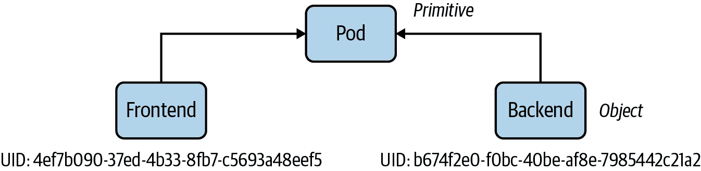
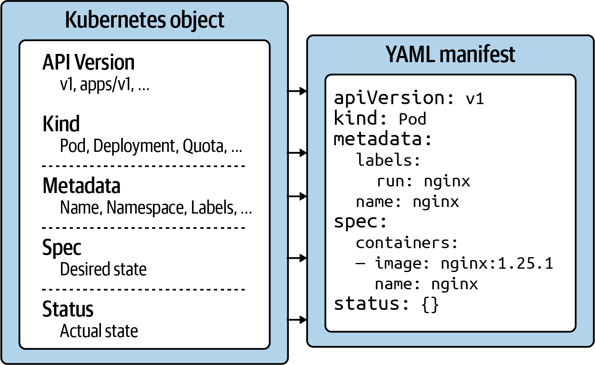
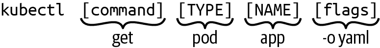

# 第三章：与 Kubernetes 交互

作为应用程序开发者，你会希望与 Kubernetes 集群交互，管理操作应用程序的对象。每次对集群的调用都由 API 服务器组件接受和处理。有多种方法可以调用 API 服务器。例如，你可以使用基于 Web 的仪表板（[web-based dashboard](https://kubernetes.io/docs/tasks/access-application-cluster/web-ui-dashboard/)）、像 [`kubectl`](https://kubernetes.io/docs/reference/kubectl/) 这样的命令行工具，或直接对 RESTful API 端点发出 HTTPS 请求。

考试不会测试使用可视用户界面与 Kubernetes 集群进行交互的能力。解答考试问题的唯一客户端是 `kubectl`。本章将涉及 Kubernetes API 原语和对象，以及使用 `kubectl` 管理对象的不同方法。

# API 原语和对象

Kubernetes 原语是 Kubernetes 架构中创建和操作平台上应用程序的基本构建块。即使是 Kubernetes 的初学者，你可能也听说过 Pod、Deployment 和 Service 这些术语，它们都是 Kubernetes 的原语。在 Kubernetes 架构中，还有许多服务专用的原语。

拿面向对象编程的概念来类比，类定义了现实世界功能的蓝图：其属性和行为。Kubernetes 的原语相当于一个类。面向对象编程语言中，类的实例是一个对象，管理自己的状态并具有与系统其他部分通信的能力。每当你创建一个 Kubernetes 对象时，你就产生了这样一个实例。

例如，Kubernetes 中的 Pod 就是一个类，可以有许多具有自己身份的实例。每个 Kubernetes 对象都有一个系统生成的唯一标识符（也称为 UID），以清晰区分系统的实体。稍后，我们将查看 Kubernetes 对象的属性。图 3-1 展示了 Kubernetes 原语与对象之间的关系。



###### 图 3-1. Kubernetes 对象身份

每个 Kubernetes 原语都遵循一个通用结构，如果你深入查看对象清单（如 图 3-2 所示），你可以观察到这一点。用于 Kubernetes 清单的主要标记语言是 YAML。



###### 图 3-2. Kubernetes 对象结构

让我们看看 Kubernetes 系统中每个部分及其相关性：

API 版本

Kubernetes API 版本定义了原语的结构，并使用它来验证数据的正确性。API 版本的作用类似于 XML 文档的 XML 模式或 JSON 文档的 JSON 模式。该版本通常经历成熟过程，例如从 alpha 到 beta 到最终版本。有时，您会看到由斜杠分隔的不同前缀（`apps`）。您可以通过运行命令`kubectl api-versions`列出与您的集群版本兼容的 API 版本。

种类

种类定义了原语的类型，例如 Pod 或 Service。它最终回答了一个问题，“我们这里正在处理哪些资源类型？”

元数据

元数据描述了关于对象的更高级信息，例如其名称、所在的命名空间，或者是否定义了标签和注释。本节还定义了 UID。

规范

规范（简称“spec”）声明了期望的状态，例如，在创建后此对象应该如何？容器中应该运行哪个镜像，或者应该设置哪些环境变量？

状态

状态描述了对象的实际状态。Kubernetes 控制器及其协调循环不断尝试将一个 Kubernetes 对象从期望状态转换为实际状态。如果 YAML 状态显示值为`{}`，则对象尚未实现。

有了这个基本结构的理解，让我们看看如何利用`kubectl`创建一个 Kubernetes 对象。

# 使用 kubectl

`kubectl`是从命令行与 Kubernetes 集群交互的主要工具。考试专门侧重于使用`kubectl`。因此，深入了解其内部工作原理并大量实践使用它非常重要。

这一部分为您提供了其典型使用模式的简要概述。让我们从查看运行命令的语法开始。一个`kubectl`执行包括一个命令、一个资源类型、一个资源名称和可选的命令行标志：

```
$ kubectl *[command] [TYPE] [NAME] [flags]*

```

命令指定您计划运行的操作。典型的命令是像`create`、`get`、`describe`或`delete`这样的动词。接下来，您需要提供您正在处理的资源类型，可以是完整的资源类型或其简写形式。例如，您可以在此处操作一个`service`或使用简写形式`svc`。

资源的名称标识用户可见的对象标识符，实际上是 YAML 表示中`metadata.name`的值。请注意，对象名称与 UID 不同。UID 是自动生成的，Kubernetes 内部对象引用，通常您无需与之交互。对象的名称必须在命名空间内同一资源类型的所有对象中是唯一的。

最后，您可以提供零到多个命令行标志来描述额外的配置行为。一个典型的命令行标志示例是`--port`标志，它公开一个 Pod 的容器端口。

图 3-3 展示了完整的`kubectl`命令的操作过程。



###### 图 3-3\. `kubectl`使用模式

在本书的过程中，我们将探讨能够在考试中提高效率的`kubectl`命令。还有许多其他命令，它们通常超出了应用程序开发人员日常使用的命令范围。接下来，我们将深入研究`create`命令，这是创建 Kubernetes 对象的命令式方式。我们还将比较命令式对象创建方法与声明式方法的区别。

# 管理对象

您可以通过两种方式在 Kubernetes 集群中创建对象：命令式或声明式。以下各节将描述每种方法，包括它们的优点、缺点和用例。

## 命令式对象管理

无需清单定义即可进行命令式对象管理。您可以使用`kubectl`通过单个命令和一个或多个命令行选项驱动对象的创建、修改和删除。有关命令式对象管理的更详细描述，请参阅[Kubernetes 文档](https://kubernetes.io/docs/tasks/manage-kubernetes-objects/imperative-command/)。

### 创建对象

使用`run`或`create`命令即可实时创建对象。运行时所需的任何配置都通过命令行选项提供。这种方法的好处是快速反馈时间，无需处理 YAML 结构。以下`run`命令创建了一个名为`frontend`的 Pod，该 Pod 在容器中执行`nginx:1.24.0`镜像，并暴露端口 80：

```
$ kubectl run frontend --image=nginx:1.24.0 --port=80
pod/frontend created

```

### 更新对象

仍然可以修改活动对象的配置。`kubectl`通过提供`edit`或`patch`命令支持此用例。

`edit`命令会打开一个编辑器，显示活动对象的原始配置。退出编辑器后，配置更改将应用于活动对象。该命令将打开由`KUBE_EDITOR`或`EDITOR`环境变量定义的编辑器，在 Linux 上会回退到`vi`，在 Windows 上会回退到`notepad`。此命令演示了对名为`frontend`的 Pod 活动对象使用`edit`命令进行编辑：

```
$ kubectl edit pod frontend

```

`patch`命令允许在属性级别对活动对象进行精细化修改，使用 JSON 合并补丁。以下示例演示了如何使用`patch`命令更新先前创建的 Pod 的容器镜像标签。`-p`标志定义了用于修改活动对象的 JSON 结构：

```
$ kubectl patch pod frontend -p '{"spec":{"containers":[{"name":"frontend",\
"image":"nginx:1.25.1"}]}}'
pod/frontend patched

```

### 删除对象

您可以随时删除 Kubernetes 对象。在考试期间，如果解决问题时出错并希望从头开始确保清洁状态，可能需要这样做。在生产环境中，您会希望删除不再需要的对象。以下`delete`命令通过其名称`frontend`删除了 Pod 对象：

```
$ kubectl delete pod frontend
pod "frontend" deleted

```

在执行`delete`命令时，Kubernetes 会尝试优雅地删除目标对象，以便最小化对最终用户的影响。如果对象在默认的优雅期限（30 秒）内无法删除，则 kubelet 尝试强制杀死对象。

在考试期间，最终用户影响并不是一个问题。最重要的目标是在分配给候选人的时间内完成所有任务。因此，等待对象优雅地被删除是浪费时间的。您可以使用`--now`选项强制立即删除对象。以下命令使用`SIGKILL`信号杀死名为`nginx`的 Pod：

```
$ kubectl delete pod nginx --now

```

## 声明性对象管理

声明性对象管理需要一个或多个清单，格式为 YAML 或 JSON，描述了对象的期望状态。您可以使用这种方法创建、更新和删除对象。

使用声明性方法的好处在于可重复性和改进的维护性，因为在大多数情况下文件被检入版本控制。声明性方法是在生产环境中创建对象的推荐方式。

更多关于声明性对象管理的信息可以在[Kubernetes 文档](https://kubernetes.io/docs/tasks/manage-kubernetes-objects/declarative-config/)中找到。

### 创建对象

声明性方法通过使用`apply`命令从一个清单（大多数情况下是 YAML 文件）创建对象。该命令通过指向一个文件、一个文件目录或一个 HTTP(S) URL 引用的文件来工作，使用`-f`选项。如果一个或多个对象已经存在，则该命令将同步对配置所做的更改与实际对象。

为了演示功能，我们假设以下目录和配置文件。以下命令从单个文件创建对象，从目录中的所有文件创建对象，并递归地从目录中的所有文件创建对象。如果您想尝试，请参考书籍的 GitHub 仓库中的文件。后续章节将解释这里使用的基元的目的：

```
.
├── app-stack
│   ├── mysql-pod.yaml
│   ├── mysql-service.yaml
│   ├── web-app-pod.yaml
│   └── web-app-service.yaml
├── nginx-deployment.yaml
└── web-app
    ├── config
    │   ├── db-configmap.yaml
    │   └── db-secret.yaml
    └── web-app-pod.yaml
```

从单个文件创建对象：

```
$ kubectl apply -f nginx-deployment.yaml
deployment.apps/nginx-deployment created

```

从目录中的多个文件创建对象：

```
$ kubectl apply -f app-stack/
pod/mysql-db created
service/mysql-service created
pod/web-app created
service/web-app-service created

```

从包含文件的递归目录树创建对象：

```
$ kubectl apply -f web-app/ -R
configmap/db-config configured
secret/db-creds created
pod/web-app created

```

从 HTTP(S) URL 引用的文件创建对象：

```
$ kubectl apply -f https://raw.githubusercontent.com/bmuschko/\
ckad-study-guide/master/ch03/object-management/nginx-deployment.yaml
deployment.apps/nginx-deployment created

```

`apply`命令通过添加或修改带有键`kubectl.kubernetes.io/last-applied-configuration`的注释来跟踪更改。以下是在`get pod`命令的输出中注释的示例：

```
$ kubectl get pod web-app -o yaml
apiVersion: v1
kind: Pod
metadata:
  annotations:
    kubectl.kubernetes.io/last-applied-configuration: |
      {"apiVersion":"v1","kind":"Pod","metadata":{"annotations":{}, \
      "labels":{"app":"web-app"},"name":"web-app","namespace":"default"}, \
      "spec":{"containers":[{"envFrom":[{"configMapRef":{"name":"db-config"}}, \
      {"secretRef":{"name":"db-creds"}}],"image":"bmuschko/web-app:1.0.1", \
      "name":"web-app","ports":[{"containerPort":3000,"protocol":"TCP"}]}], \
      "restartPolicy":"Always"}}
...

```

### 更新对象

更新现有对象与相同的`apply`命令完成。您只需修改配置文件然后对其运行该命令即可。示例 3-1 修改了文件`nginx-deployment.yaml`中部署配置的现有配置。我们添加了一个新的标签，键为 team，并将副本数从 3 改为 5。

##### 示例 3-1\. 修改后的部署配置文件

```
apiVersion: apps/v1
kind: Deployment
metadata:
  name: nginx-deployment
  labels:
    app: nginx
    team: red
spec:
  replicas: 5
...
```

下面的命令应用了更改后的配置文件。结果是，由底层 ReplicaSet 控制的 Pod 数量为 5：

```
$ kubectl apply -f nginx-deployment.yaml
deployment.apps/nginx-deployment configured

```

部署的 `kubectl.kubernetes.io/last-applied-configuration` 注解反映了配置的最新更改：

```
$ kubectl get deployment nginx-deployment -o yaml
apiVersion: apps/v1
kind: Deployment
metadata:
  annotations:
    kubectl.kubernetes.io/last-applied-configuration: |
      {"apiVersion":"apps/v1","kind":"Deployment","metadata":{"annotations":{}, \
      "labels":{"app":"nginx","team":"red"},"name":"nginx-deployment", \
      "namespace":"default"},"spec":{"replicas":5,"selector":{"matchLabels": \
      {"app":"nginx"}},"template":{"metadata":{"labels":{"app":"nginx"}}, \
      "spec":{"containers":[{"image":"nginx:1.14.2","name":"nginx", \
      "ports":[{"containerPort":80}]}]}}}}
...

```

### 删除对象

虽然您可以使用 `apply` 命令通过提供选项 `--prune -l <labels>` 删除对象，但建议使用 `delete` 命令并将其指向配置文件来删除对象。下面的命令删除了一个部署及其控制的对象（ReplicaSet 和 Pods）：

```
$ kubectl delete -f nginx-deployment.yaml
deployment.apps "nginx-deployment" deleted

```

您可以使用 `--now` 选项强制删除 Pods，如 “删除对象” 中所述。

## 混合方法

有时您可能希望采用混合方法。您可以通过使用即时方法生成一个清单文件，而无需实际创建对象。方法是使用命令行选项 `-o yaml` 和 `--dry-run=client` 执行 `run` 或 `create` 命令：

```
$ kubectl run frontend --image=nginx:1.25.1 --port=80 \
  -o yaml --dry-run=client > pod.yaml

```

您现在可以使用生成的 YAML 清单作为进一步修改对象的起点。只需用编辑器打开文件，更改内容，然后执行声明性 `apply` 命令：

```
$ vim pod.yaml
$ kubectl apply -f pod.yaml
pod/frontend created

```

## 选择使用哪种方法？

在考试期间，使用即时命令是管理对象的最高效且快速的方式。并非所有的配置选项都通过命令行标志公开，这可能迫使您使用声明性方法。混合方法在这里可以帮助。

# GitOps 和 Kubernetes

GitOps 是一种利用存储在 Git 仓库中的源代码来自动化基于 Kubernetes 的云原生环境中的基础设施管理的实践。诸如 [Argo CD](https://argo-cd.readthedocs.io/en/stable/) 和 [Flux](https://fluxcd.io/) 的工具实施了 GitOps 原则，通过声明性方法将应用部署到 Kubernetes。负责监督真实 Kubernetes 集群及其内部应用的团队很可能会采用声明性方法。

在即时创建对象能够优化周转时间的同时，在真实的 Kubernetes 环境中，您几乎肯定会希望使用声明性方法。YAML 清单文件代表了 Kubernetes 对象的最终真实状态。版本控制的文件可以进行审计和共享，并且它们存储了变更的历史记录，以便在需要时回滚到先前的版本。

# 总结

Kubernetes 通过基元的帮助来表示部署和操作云原生应用程序的功能。每个基元都遵循一个通用的结构：API 版本、种类、元数据和资源的期望状态，也称为规范。在对象创建或修改时，Kubernetes 调度程序会自动尝试确保对象的实际状态遵循定义的规范。每个活动对象都可以被检查、编辑和删除。

`Kubectl` 作为 CLI 基础的客户端用于与 Kubernetes 集群进行交互。您可以使用它的命令和标志来管理 Kubernetes 对象。命令式方法通过单个命令提供快速的管理对象的回转时间，只要您记住可用的标志。更复杂的配置需要使用 YAML 清单来定义基元。使用声明式命令从该定义实例化对象。YAML 清单通常会被检入版本控制，并提供一种跟踪配置更改的方式。
