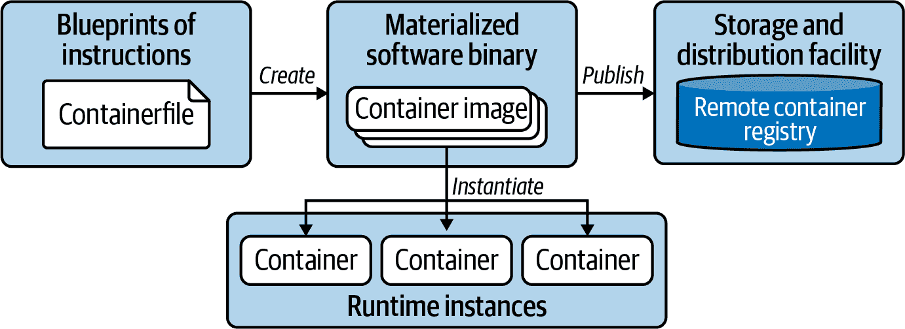
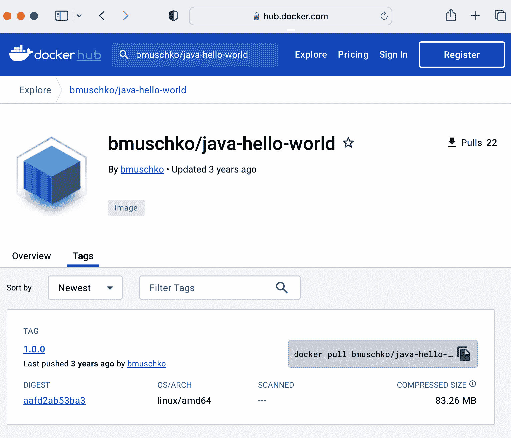

# 第四章：容器

Kubernetes 是一个容器编排器，使用容器运行时在 Pod 内实例化容器。许多使用容器运行时 [containerd](https://containerd.io/) 的 Kubernetes 集群版本为 1.24 或更高。

# 在 Kubernetes 节点上使用的容器运行时

您可以获取 Kubernetes 集群中任何节点上使用的容器运行时的信息。只需查看运行命令`kubectl get nodes -o wide`生成的`CONTAINER-RUNTIME`列的输出即可。查阅 [Kubernetes 文档](https://kubernetes.io/docs/setup/production-environment/container-runtimes/) 了解如何为集群配置容器运行时更多信息。

在考试中，您需要理解定义、构建和发布容器镜像的实际操作，本章涵盖了这些内容。我们还将介绍在容器内运行容器镜像的操作。对于所有这些操作，我们将使用 Docker Engine 作为示例容器运行时，尽管其他实现提供了类似的功能。

本书关于容器的讨论只是皮毛。如果您想全面投入，这个主题还有很多信息。我可以推荐 Sean P. Kane 和 Karl Matthias 合著的书籍 [*Docker: Up & Running*](https://learning.oreilly.com/library/view/docker-up/9781098131814/)（O’Reilly）详细解释 Docker。

# 容器术语

*容器*将应用程序及其运行环境和配置打包成单个软件单元。此软件单元通常包括操作系统、应用程序的源代码或二进制文件、其依赖项以及其他所需的系统工具。容器声明的目标是将运行环境与应用程序分离，避免“但在我的机器上可以运行”的问题。

*容器运行时引擎*是能够在主机操作系统上运行容器的软件组件。例如 [Docker Engine](https://docs.docker.com/engine/) 或 [containerd](https://containerd.io/)。*容器编排器*使用容器运行时引擎实例化容器，同时添加诸如扩展性和跨工作负载的网络功能。Kubernetes 是容器编排器的一个例子。其他工具如 [Nomad](https://www.nomadproject.io/use-cases/simple-container-orchestration) 能够调度包括容器在内的各种工作负载。

将应用程序打包成容器的过程称为*容器化*。容器化基于*容器文件*中定义的指令工作。Docker 社区将其称为 Dockerfile。Dockerfile 明确指出了软件构建时需要发生的事情。操作的结果是*容器镜像*。

容器镜像通常发布到*容器注册表*以供其他利益相关者使用。[Docker Hub](https://hub.docker.com)是主要的公共容器镜像注册表。还有其他公共注册表，如 GCR 和 Quay。图 4-1 在容器化应用程序的背景下说明了这些概念。



###### 图 4-1\. 容器化过程

总结一下，Dockerfile 是软件打包的蓝图，镜像是该过程产生的工件，容器是运行镜像的实例，提供应用程序服务。接下来我们将看一个更具体的例子。

# 将基于 Java 的应用程序容器化

假设我们要将用 Java 编写的 Web 应用程序容器化。该应用程序不是从头开始编写核心功能，而是使用[Spring Boot 框架](https://oreil.ly/Na9Vb)作为外部库。此外，我们希望通过环境变量来控制运行时行为。例如，您可能希望提供 URL 和凭据以连接到其他服务，如数据库。我们将逐步讨论这个过程，并从终端执行相关的 Docker 命令。如果您想跟着做，请从项目生成器[Spring Initializr](https://oreil.ly/bXSA4)下载示例应用程序。

## 编写 Dockerfile

在我们创建镜像之前，我们必须编写一个 Dockerfile。Dockerfile 可以放置在任何目录中，它是一个纯文本文件。接下来的指令使用 Azul JRE 分发的 Java 21 作为基础镜像。基础镜像包含操作系统和必要的工具，本例中为 Java。

此外，我们将二进制文件（一个可执行的 Java 存档文件 JAR）包含到镜像的`/app`目录中。最后，我们定义 Java 命令来执行程序，并将端口 8080 暴露出来，在容器中运行时使应用程序可访问。示例 4-1 概述了一个样例 Dockerfile。

##### 示例 4-1\. 用于构建 Java 应用程序的 Dockerfile

```
FROM azul/zulu-openjdk:21-jre                                 
WORKDIR /app 
COPY target/java-hello-world-0.0.1.jar java-hello-world.jar   
ENTRYPOINT ["java", "-jar", "/app/java-hello-world.jar"]      
EXPOSE 8080 
```


定义基础镜像。


设置容器的工作目录。任何`RUN`、`CMD`、`ADD`、`COPY`或`ENTRYPOINT`指令将在指定的工作目录中执行。


将包含编译应用程序代码的 JAR 文件复制到工作目录中。


设置从镜像启动容器时执行的默认命令。


记录容器应监听的网络端口。

对于初学者来说，编写 Dockerfile 看起来很简单，但为了实现小占地面积和安全性方面的优化容器镜像却并非易事。您可以在[Docker 文档](https://docs.docker.com/develop/develop-images/dockerfile_best-practices/)中找到更详细的 Dockerfile 最佳实践列表。

## 构建容器镜像

有了 Dockerfile，我们可以创建镜像。以下命令提供了镜像的名称和标签。最后一个参数指向上下文目录。上下文目录包含 Dockerfile 以及要包含在镜像中的任何目录和文件。这里，上下文目录是我们所在的当前目录，由“ . ”引用：

```
$ docker build -t java-hello-world:1.1.0 .
[+] Building 2.0s (9/9) FINISHED
 => [internal] load .dockerignore
 => => transferring context: 2B
 => [internal] load build definition from Dockerfile
 => => transferring dockerfile: 284B
 => [internal] load metadata for docker.io/azul/zulu-openjdk:21-jre
 => [auth] azul/zulu-openjdk:pull token for registry-1.docker.io
 => [1/3] FROM docker.io/azul/zulu-openjdk:21-jre@sha256:d1e675cac0e5...
 => => resolve docker.io/azul/zulu-openjdk:21-jre@sha256:d1e675cac0e5...
 => => sha256:d1e675cac0e5ce9604283df2a6600d3b46328d32d83927320757ca7...
 => => sha256:67aa3090031eac26c946908c33959721730e42f9195f4f70409e4ce...
 => => sha256:ba408da684370e4d8448bec68b36fadf15c3819b282729df3bc8494...
 => [internal] load build context
 => => transferring context: 19.71MB
 => [2/3] WORKDIR /app
 => [3/3] COPY target/java-hello-world-0.0.1.jar java-hello-world.jar
 => exporting to image
 => => exporting layers
 => => writing image sha256:4b676060678b63de137536da24a889fc9d2d5fe0c...
 => => naming to docker.io/library/java-hello-world:1.1.0

What's Next?
  View a summary of image vulnerabilities and recommendations → ...

```

## 列出容器镜像

如终端输出所示，镜像已创建。您可能已经注意到基础镜像已作为过程的一部分下载。通过运行以下命令，生成的镜像可以在本地 Docker 引擎缓存中找到：

```
$ docker images
REPOSITORY         TAG       IMAGE ID       CREATED          SIZE
java-hello-world   1.1.0     4b676060678b   49 seconds ago   342MB

```

## 运行容器

现在是在容器中运行应用程序的时候了。`run`命令指向一个镜像并在容器中执行其逻辑：

```
$ docker run -d -p 8080:8080 java-hello-world:1.1.0
b0ee04accf078ea7c73cfe3be0f9d1ac6a099ac4e0e903773bc6bf6258acbb66

```

我们告诉命令使用`-p`CLI 选项将本地主机上的端口 8080 转发到容器端口 8080。`-d`CLI 选项在后台运行容器，这意味着它将与容器分离并返回到终端提示符。这意味着我们现在应该能够从本地机器解析应用程序的端点。如以下命令所示，对根上下文路径的简单`curl`将呈现消息“Hello World！”：

```
$ curl localhost:8080
Hello World!

```

## 列出容器

可以列出任何正在运行的容器以显示它们的运行时属性。以下命令呈现了先前启动的容器。输出包括容器的 ID，以供稍后参考。添加标志`-a`以同时呈现已终止的容器：

```
$ docker container ls
CONTAINER ID   IMAGE                    COMMAND                  ...
b0ee04accf07   java-hello-world:1.1.0   "java -jar /app/java…"   ...

```

## 与容器交互

一旦容器启动，您可以与其交互。您只需容器 ID。使用`logs`命令检查应用程序在容器启动时产生的日志消息。检查日志对故障排除很有帮助。以下命令呈现了 Spring Boot 在容器启动时产生的日志消息：

```
$ docker logs b0ee04accf07
...
2023-06-19 21:06:27.757  INFO 1 --- [nio-8080-exec-1] \
o.a.c.c.C.[Tomcat].[localhost].[/]       : Initializing \
Spring DispatcherServlet 'dispatcherServlet'
2023-06-19 21:06:27.757  INFO 1 --- [nio-8080-exec-1] \
o.s.web.servlet.DispatcherServlet        : Initializing \
Servlet 'dispatcherServlet'
2023-06-19 21:06:27.764  INFO 1 --- [nio-8080-exec-1] \
o.s.web.servlet.DispatcherServlet        : Completed \
initialization in 7 ms

```

如果容器镜像打包有命令行 shell，您可以深入了解运行中的容器的内部。例如，您可能想要检查应用程序消耗或产生的文件。使用`exec`命令在容器中运行命令。标志`-it`允许与容器进行迭代，直到您准备好退出。以下命令打开一个迭代的 bash shell 到正在运行的容器：

```
$ docker exec -it b0ee04accf07 bash
root@b0ee04accf07:/app# pwd
/app
root@b0ee04accf07:/app# exit
exit

```

要退出交互式 bash shell，请运行`exit`命令。您将返回到主机机器上的终端提示符。

## 发布容器镜像

要将图像发布到注册表，您需要进行一些预备工作。大多数注册表要求您提供一个前缀，该前缀表示用户名或主机名作为容器映像名称的一部分，您可以使用`tag`命令来实现这一点。

例如，Docker Hub 要求您提供用户名。我的用户名是`bmuschko`，因此在推送之前我必须重新标记我的映像：

```
$ docker tag java-hello-world:1.1.0 bmuschko/java-hello-world:1.1.0

```

`tag`命令不会创建容器映像的副本。它只是向现有容器映像添加另一个标识符，如下图所示。容器映像的 ID 和大小在两个条目中都是相同的：

```
$ docker images
REPOSITORY                  TAG       IMAGE ID       CREATED         SIZE
bmuschko/java-hello-world   1.1.0     4b676060678b   6 minutes ago   342MB
java-hello-world            1.1.0     4b676060678b   6 minutes ago   342MB

```

如果注册表受保护，您还需要提供凭据。对于 Docker Hub，我们使用用户名登录：

```
$ docker login --username=bmuschko
Password: *****
Login Succeeded

```

最后，您可以使用`push`命令将映像推送到注册表：

```
$ docker push bmuschko/java-hello-world:1.1.0
The push refers to repository [docker.io/bmuschko/java-hello-world]
a7b86a39983a: Pushed
df1b2befe5f0: Pushed
e4db97f0e9ef: Mounted from azul/zulu-openjdk
8e87ff28f1b5: Mounted from azul/zulu-openjdk
1.1.0: digest: sha256:6a5069bd9396a7eded10bf8e24ab251df434c121f8f4293c2d3ef...

```

您可以通过 Docker Hub 网页发现发布的容器映像，如图 4-2 所示。 “Tags”选项卡列出了映像的所有可用标记，包括其详细信息和使用`docker`命令快速引用的内容。



###### 图 4-2\. 在 Docker Hub 上发现容器映像

现在，任何有权访问注册表的人都可以使用`pull`命令来使用容器映像。

## 保存和加载容器映像

与其将容器映像发布到容器注册表中，您可能希望将其保存到文件中。文件可以轻松存储和备份在共享驱动器上，并且不需要容器注册表。`save`命令将一个或多个映像保存到 tar 存档中。生成的存档文件包含所有父层以及所有标记和版本。以下命令将容器映像保存到文件`java-hello-world.tar`中：

```
$ docker save -o java-hello-world.tar java-hello-world:1.1.0

```

要从 tar 存档中加载容器映像，请使用`load`命令。该命令还原映像和标记。以下命令从文件`java-hello-world.tar`中加载容器映像：

```
$ docker load --input java-hello-world.tar
Loaded image: java-hello-world:1.1.0

```

现在映像已经在缓存中可用，运行`images`命令显示如下：

```
$ docker images
REPOSITORY         TAG       IMAGE ID       CREATED         SIZE
java-hello-world   1.1.0     4b676060678b   7 minutes ago   342MB

```

# 深入了解

到目前为止，您已经体验了最常见的开发者工作流程：将应用程序容器化并将映像推送到注册表。关于构建和运行容器还有很多内容需要学习，但这超出了本书的范围，我们在这里不会深入讨论。如果您想了解更多，请参阅[Docker 文档](https://docs.docker.com)。

# 总结

应用程序开发人员使用容器化将应用程序代码打包到容器映像中，以便作为可运行软件的单个单元部署到 Kubernetes 集群中。容器化过程使用容器运行时引擎定义、构建、运行和发布容器映像。在本章中，我们使用 Docker Engine 演示了基于 Java 的应用程序的过程；但是，对于使用不同编程语言编写的应用程序，涉及的步骤看起来可能类似。

# 考试要点

通过容器化过程获得实际经验

Pod 在容器内运行容器镜像。你需要了解如何定义、构建、运行和发布一个容器镜像，除了 Kubernetes 外的其他使用方式。练习使用容器运行时引擎的命令行工具来完成工作流程。

比较不同容器运行时引擎的功能

你应该熟悉 Docker Engine，特别是为了理解容器化过程。在撰写本文时，Docker Engine 仍然是最广泛使用的容器运行时引擎。通过尝试其他容器运行时引擎如 containerd 或 Podman 来扩展你的知识领域。

熟悉其他工作流程

作为应用开发者，你每天都会处理定义、构建和修改容器镜像。容器运行时引擎支持其他不太为人知的功能和工作流程。阅读容器运行时引擎的文档以获得更广泛的认识是一个不错的选择。

# 样例练习

这些练习的解决方案可在 附录 A 中找到。

1.  导航至检出的 GitHub 仓库 [*bmuschko/ckad-study-guide*](https://github.com/bmuschko/ckad-study-guide) 的目录 *app-a/ch04/containerized-java-app*。检查 *Dockerfile*。

    从 *Dockerfile* 构建容器镜像，标签为 `nodejs-hello-world:1.0.0`。

    运行一个容器，使用容器镜像。使应用程序在端口 80 上可用。

    对应用程序的端点执行 `curl` 或 `wget` 命令。

    检索容器日志。

1.  修改前一个练习中的 *Dockerfile*。将基础镜像更改为标签 `20.4-alpine`，工作目录更改为 `/node`。

    从 *Dockerfile* 构建容器镜像，标签为 `nodejs-hello-world:1.1.0`。

    确保容器镜像已创建，通过列出来验证。

1.  拉取容器镜像 `alpine:3.18.2`，可以在 [Docker Hub 上找到](https://hub.docker.com/layers/library/alpine/3.18.2/images/sha256-25fad2a32ad1f6f510e528448ae1ec69a28ef81916a004d3629874104f8a7f70?context=explore)。

    将容器镜像保存到文件 *alpine-3.18.2.tar* 中。

    删除容器镜像。验证容器镜像已不再显示在列表中。

    从文件 *alpine-3.18.2.tar* 恢复容器镜像。

    验证容器镜像能够被列出。
