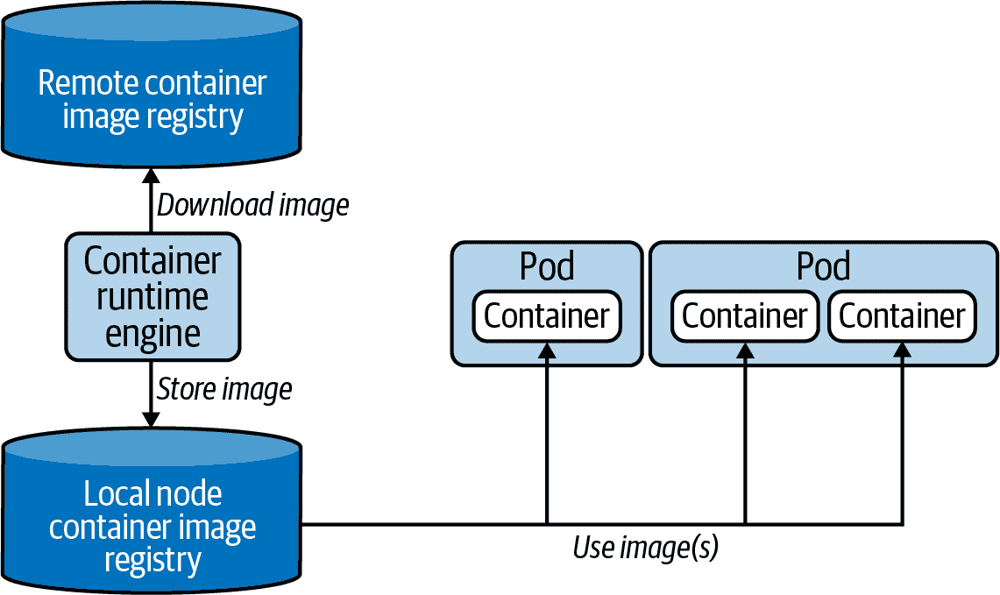

# 第五章：Pods 和命名空间

Kubernetes API 中最重要的原语是 Pod。Pod 允许您运行一个容器化的应用程序。在实践中，您通常会发现 Pod 和容器之间是一对一的映射关系；然而，在第八章讨论的用例中，声明一个 Pod 中多个容器会更有利。

除了运行容器外，Pod 还可以使用其他服务，如存储、配置数据等等。因此，将 Pod 视为运行容器的包装器，同时能够混合跨切面和特定的 Kubernetes 功能。

# 使用 Pods

在本章中，我们将讨论仅运行单个容器的 Pod 的操作。我们将讨论创建、修改、交互和删除的所有重要的 `kubectl` 命令，使用命令式和声明式方法。

## 创建 Pods

Pod 定义需要为每个容器指定一个镜像。在创建 Pod 对象时，无论是命令式还是声明式，调度器都会将 Pod 分配给一个节点，并且容器运行时引擎将检查该节点上是否已存在容器镜像。如果镜像尚不存在，则引擎将从容器镜像注册表下载。默认情况下，注册表是 Docker Hub。一旦镜像存在于节点上，容器就会被实例化并运行。图 5-1 展示了执行流程。



###### 图 5-1\. 容器运行时接口与容器镜像的交互

`run` 命令是创建 Pods 的中心入口点。让我们讨论它的用法以及您应该记住和练习的最重要的命令行选项。假设您想在 Pod 中运行一个[Hazelcast 实例](https://hazelcast.com)。容器应该使用最新的[Hazelcast 镜像](https://oreil.ly/ChxPI)，暴露端口 5701，并定义一个环境变量。此外，我们还希望为 Pod 分配两个标签。以下命令结合了这些信息，不需要进一步编辑实时对象：

```
$ kubectl run hazelcast --image=hazelcast/hazelcast:5.1.7 \
  --port=5701 --env="DNS_DOMAIN=cluster" --labels="app=hazelcast,env=prod"

```

`run` 命令提供了丰富的命令行选项。执行 `kubectl run --help` 或参考 Kubernetes 文档获取广泛的概述。在考试中，您不需要理解每一个命令。表格 5-1 列出了最常用的选项。

表格 5-1\. 重要的 `kubectl` run 命令行选项

| 选项 | 示例值 | 描述 |
| --- | --- | --- |
| `--image` | nginx:1.25.1 | 要运行的容器的镜像。 |
| `--port` | 8080 | 此容器暴露的端口。 |
| `--rm` | N/A | 在容器中的命令完成后删除 Pod。有关更多信息，请参见“创建临时 Pod”。 |
| `--env` | PROFILE=dev | 在容器中设置的环境变量。 |
| `--labels` | app=frontend | 要应用于 Pod 的标签的逗号分隔列表。第 9 章 更详细地解释了标签。 |

一些开发人员更习惯于根据 YAML 清单创建 Pods。也许您已经习惯于声明性方法，因为您在工作中使用它。您可以通过打开编辑器，从 Kubernetes 在线文档中复制 Pod YAML 代码片段，并根据需要进行修改，为 Hazelcast Pod 表达相同的配置。示例 5-1 展示了保存在文件 `pod.yaml` 中的 Pod 清单：

##### 示例 5-1\. Pod YAML 清单

```
apiVersion: v1
kind: Pod
metadata:
  name: hazelcast                      
  labels:                              
    app: hazelcast
    env: prod
spec:
  containers:
  - name: hazelcast
    image: hazelcast/hazelcast:5.1.7   
    env:                               
    - name: DNS_DOMAIN
      value: cluster
    ports:
    - containerPort: 5701              
```


为 Pod 分配名称 `hazelcast`。


指定要应用于 Pod 的标签。


声明要在 Pod 的容器中执行的容器镜像。


向容器注入一个或多个环境变量。


要在 Pod 的 IP 地址上公开的端口数量。

从清单创建 Pod 很简单。只需使用 `create` 或 `apply` 命令，如此处所示，并在 “管理对象” 中进行了解：

```
$ kubectl apply -f pod.yaml
pod/hazelcast created

```

## 列出 Pods

现在您已经创建了一个 Pod，可以进一步检查其运行时信息。`kubectl` 命令提供了一个列出集群中所有正在运行的 Pods 的命令：`get pods`。以下命令渲染了名为 `hazelcast` 的 Pod：

```
$ kubectl get pods
NAME        READY   STATUS    RESTARTS   AGE
hazelcast   1/1     Running   0          17s

```

真实的 Kubernetes 集群可以同时运行数百个 Pods。如果您知道感兴趣的 Pod 的名称，通常更容易通过名称查询。您仍然只会看到一个单独的 Pod：

```
$ kubectl get pods hazelcast
NAME        READY   STATUS    RESTARTS   AGE
hazelcast   1/1     Running   0          17s

```

## Pod 生命周期阶段

因为 Kubernetes 是一个带有异步控制循环的状态引擎，当列出 Pods 时，Pod 的状态可能不会立即显示为 `Running` 状态。通常需要几秒钟来获取镜像并启动容器。在 Pod 创建时，对象会经历几个 [生命周期阶段](https://oreil.ly/Qk5Ob)，如图 5-2 所示。


###### 图 5-2\. Pod 生命周期阶段

理解每个阶段的影响很重要，因为它可以让您了解 Pod 的操作状态。例如，在考试期间，您可能会被要求识别具有问题的 Pod 并进一步调试该对象。表 5-2 描述了所有 Pod 生命周期阶段。

表 5-2\. Pod 生命周期阶段

| 选项 | 描述 |
| --- | --- |
| `Pending` | Pod 已被 Kubernetes 系统接受，但一个或多个容器镜像尚未创建。 |
| `Running` | 至少有一个容器仍在运行或正在启动或重新启动过程中。 |
| `Succeeded` | Pod 中的所有容器均已成功终止。 |
| `Failed` | Pod 中的容器已终止；至少一个以错误状态失败。 |
| `Unknown` | 无法获取 Pod 的状态。 |

Pod 的生命周期阶段不应与 Pod 中的容器状态混淆。容器可以处于三种可能的状态之一：`Waiting`、`Running`和`Terminated`。您可以在[Kubernetes 文档](https://kubernetes.io/docs/concepts/workloads/pods/pod-lifecycle/#container-states)中详细了解容器的状态。

## 渲染 Pod 详情

`get`命令生成的表格提供了关于 Pod 的高级信息。但是，如果您需要更详细的信息，可以使用`describe`命令：

```
$ kubectl describe pods hazelcast
Name:               hazelcast
Namespace:          default
Priority:           0
PriorityClassName:  <none>
Node:               docker-desktop/192.168.65.3
Start Time:         Wed, 20 May 2020 19:35:47 -0600
Labels:             app=hazelcast
                    env=prod
Annotations:        <none>
Status:             Running
IP:                 10.1.0.41
Containers:
  ...
Events:
  ...

```

终端输出包含 Pod 的元数据信息、它运行的容器以及事件日志，例如在调度 Pod 时的失败。示例输出已经被压缩，仅显示元数据部分。您可以期望输出非常长。

您可以更具体地渲染所需的信息。如果您想要识别容器中正在运行的镜像，可以结合`describe`命令和 Unix 的`grep`命令：

```
$ kubectl describe pods hazelcast | grep Image:
    Image:          hazelcast/hazelcast:5.1.7

```

## 访问 Pod 的日志

作为应用程序开发者，我们非常了解我们实现的应用程序生成的日志文件中会出现什么。在容器中操作应用程序时可能会发生运行时故障。`logs`命令会下载容器的日志输出。以下输出表明 Hazelcast 服务器成功启动：

```
$ kubectl logs hazelcast
...
May 25, 2020 3:36:26 PM com.hazelcast.core.LifecycleService
INFO: [10.1.0.46]:5701 [dev] [4.0.1] [10.1.0.46]:5701 is STARTED

```

一旦容器接收到来自最终用户的流量，很可能会生成更多的日志条目。您可以使用命令行选项`-f`来实时流式传输日志。如果您希望实时查看日志，这个选项将非常有帮助。

Kubernetes 在某些条件下会尝试重新启动容器，例如如果在第一次尝试中无法解析镜像。在容器重新启动时，您将无法访问上一个容器的日志；`logs`命令仅会为当前容器渲染日志。然而，您仍然可以通过添加`-p`命令行选项返回到上一个容器的日志。您可能希望使用此选项来识别触发容器重新启动的根本原因。

## 在容器中执行命令

有些情况需要您进入正在运行的容器并探索文件系统。也许您想要检查应用程序的配置或调试其当前状态。您可以使用`exec`命令在容器中打开一个 shell，以交互方式进行探索，如下所示：

```
$ kubectl exec -it hazelcast -- /bin/sh
# ...

```

请注意，您无需提供资源类型。此命令仅适用于 Pod。两个破折号（`--`）将`exec`命令及其选项与要在容器内运行的命令分隔开来。

也可以在容器内执行单个命令。假设您希望渲染容器中可用的环境变量而无需登录。只需删除交互标志`-it`，并在两个破折号之后提供相关命令即可：

```
$ kubectl exec hazelcast -- env
...
DNS_DOMAIN=cluster

```

## 创建临时 Pod

在 Pod 内执行的命令（通常是实现业务逻辑的应用程序）通常意味着要无限运行。一旦创建了 Pod，它就会保持存在。在某些情况下，您需要仅为了故障排除而在 Pod 中执行命令。这种用例不要求 Pod 对象在命令执行后继续运行。这就是临时 Pod 发挥作用的地方。

`run`命令提供了`--rm`标志，这将在内部运行的命令结束后自动删除 Pod。假设您想使用`env`来查看容器内所有可用的环境变量。以下命令恰好可以做到这一点：

```
$ kubectl run busybox --image=busybox:1.36.1 --rm -it --restart=Never -- env
...
HOSTNAME=busybox
pod "busybox" deleted

```

输出中呈现的最后一条消息明确说明，在命令执行后，该 Pod 已被删除。

## 使用 Pod 的 IP 地址进行网络通信

每个 Pod 在创建时被分配一个 IP 地址。您可以使用`get pod`命令的`-o wide`命令行选项或描述 Pod 来查看 Pod 的 IP 地址。以下控制台输出中的 Pod 的 IP 地址是`10.244.0.5`：

```
$ kubectl run nginx --image=nginx:1.25.1 --port=80
pod/nginx created
$ kubectl get pod nginx -o wide
NAME    READY   STATUS    RESTARTS   AGE   IP           NODE       \
NOMINATED NODE   READINESS GATES
nginx   1/1     Running   0          37s   10.244.0.5   minikube   \
<none>           <none>
$ kubectl get pod nginx -o yaml
...
status:
  podIP: 10.244.0.5
...

```

分配给 Pod 的 IP 地址在所有节点和命名空间中是唯一的。这是通过在注册节点时为每个节点分配专用子网来实现的。在节点上创建新的 Pod 时，IP 地址是从分配的子网中租用的。这由网络生命周期管理器 kube-proxy 以及域名服务 (DNS) 和容器网络接口 (CNI) 处理。

你可以通过创建一个临时 Pod，在其中使用命令行工具`curl`或`wget`调用另一个 Pod 的 IP 地址来轻松验证其行为。

```
$ kubectl run busybox --image=busybox:1.36.1 --rm -it --restart=Never \
  -- wget 172.17.0.4:80
Connecting to 172.17.0.4:80 (172.17.0.4:80)
saving to 'index.html'
index.html           100% |********************************|   615  0:00:00 ETA
'index.html' saved
pod "busybox" deleted

```

需要理解的重点是，IP 地址随时间的推移并不稳定。Pod 重新启动会获得新的 IP 地址。因此，这个 IP 地址通常被称为*虚拟* IP 地址。构建微服务架构——其中每个应用程序在其自己的 Pod 中运行，并需要使用稳定的网络接口相互通信——需要不同的概念：服务。更多信息请参见第二十一章。

## 配置 Pods

课程希望您能够熟悉编辑 YAML 清单文件或作为实时对象表示。本节向您展示了考试期间可能遇到的一些典型配置场景。后续章节将通过触及其他配置方面来深化您的知识。

### 声明环境变量

应用程序需要暴露一种方法来使其运行时行为可配置。例如，您可能希望注入外部 Web 服务的 URL 或声明数据库连接的用户名。环境变量是提供此运行时配置的常见选项。

# 避免为每个环境创建容器镜像

或许会有诱惑说，“嘿，让我们为所需的每个目标部署环境创建一个容器镜像，包括其配置。”那是一个坏主意。[持续交付](https://oreil.ly/w4_2g)和[十二要素应用程序原则](https://12factor.net)之一的实践是为每次提交构建一个可部署的构件。在这种情况下，构件是容器镜像。通过在实例化容器时注入运行时信息，可以控制偏离的配置运行时行为。根据需要使用环境变量来控制行为。

在 Pod 的 YAML 清单中定义环境变量相对比较简单。添加或增强容器的`env`部分。每个环境变量由键值对表示，通过`name`和`value`属性表示。Kubernetes 不强制执行或清理环境变量键的典型命名约定，但建议遵循使用大写字母和下划线(`_`)来分隔单词的标准。

要了解一组环境变量的示例，请参阅示例 5-2。此代码片段描述了一个使用 Spring Boot 框架运行 Java 应用程序的 Pod。

##### 示例 5-2\. 用于定义 Pod 环境变量的 YAML 清单

```
apiVersion: v1
kind: Pod
metadata:
  name: spring-boot-app
spec:
  containers:
  - name: spring-boot-app
    image: bmuschko/spring-boot-app:1.5.3
    env:
    - name: SPRING_PROFILES_ACTIVE
      value: prod
    - name: VERSION
      value: '1.5.3'
```

第一个名为`SPRING_PROFILES_ACTIVE`的环境变量定义了指向所谓配置文件的指针。配置文件包含特定于环境的属性。在这里，我们指向配置生产环境的配置文件。环境变量`VERSION`指定了应用程序版本。其值对应于图像的标签，并且可以由运行中的应用程序公开以在用户界面中显示值。

### 定义带参数的命令

许多容器镜像已经定义了`ENTRYPOINT`或`CMD`指令。指令分配的命令将作为容器启动的一部分自动执行。例如，我们之前使用的 Hazelcast 镜像定义了指令`CMD ["/opt/hazelcast/start-hazelcast.sh"]`。

在 Pod 定义中，您可以重新定义镜像的`ENTRYPOINT`和`CMD`指令，或者为容器分配一个未被镜像指定的执行命令。您可以借助`command`和`args`属性为容器提供这些信息。`command`属性将覆盖镜像的`ENTRYPOINT`指令。`args`属性替换镜像的`CMD`指令。

假设你想要为尚未提供命令的镜像提供一个命令。通常有两种不同的方法：命令式和声明式。我们将利用 `run` 命令生成 YAML 清单。Pod 应该使用 `busybox:1.36.1` 镜像，并执行一个每 10 秒在无限循环中呈现当前日期的 shell 命令：

```
$ kubectl run mypod --image=busybox:1.36.1 -o yaml --dry-run=client \
  > pod.yaml -- /bin/sh -c "while true; do date; sleep 10; done"

```

在生成但精简的 `pod.yaml` 文件中可以看到，示例 5-3 中的命令已被转换为 `args` 属性。Kubernetes 将每个参数指定为单独的行。

##### 示例 5-3\. 包含 args 属性的 YAML 清单

```
apiVersion: v1
kind: Pod
metadata:
  name: mypod
spec:
  containers:
  - name: mypod
    image: busybox:1.36.1
    args:
    - /bin/sh
    - -c
    - while true; do date; sleep 10; done
```

如果你要手动创建 YAML 清单，可以通过`command`和`args`属性的组合实现相同的效果。示例 5-4 展示了一种不同的方法。

##### 示例 5-4\. 包含 command 和 args 属性的 YAML 清单

```
apiVersion: v1
kind: Pod
metadata:
  name: mypod
spec:
  containers:
  - name: mypod
    image: busybox:1.36.1
    command: ["/bin/sh"]
    args: ["-c", "while true; do date; sleep 10; done"]
```

你可以快速验证声明的命令是否真的有效。首先创建 Pod 实例，然后尾随日志：

```
$ kubectl apply -f pod.yaml
pod/mypod created
$ kubectl logs mypod -f
Fri May 29 00:49:06 UTC 2020
Fri May 29 00:49:16 UTC 2020
Fri May 29 00:49:26 UTC 2020
...

```

## 删除一个 Pod

迟早你会想要删除一个 Pod。在考试期间，可能会要求你删除一个 Pod。或者，你可能出现了配置错误，希望从头开始：

```
$ kubectl delete pod hazelcast
pod "hazelcast" deleted

```

请记住，Kubernetes 尝试*优雅地*删除一个 Pod。这意味着 Pod 将尝试完成对其的活动请求，以避免给最终用户带来不必要的中断。一个优雅的删除操作可能需要 5 到 30 秒的时间，这是你在考试中不想浪费的时间。更多关于如何加速这一过程的信息，请参见 第一章。

删除一个 Pod 的另一种方法是将 `delete` 命令指向你用来创建它的 YAML 清单。行为是相同的：

```
$ kubectl delete -f pod.yaml
pod "hazelcast" deleted

```

为了在考试中节省时间，你可以通过将 `delete` 命令添加 `--now` 选项来绕过优雅期限。在生产 Kubernetes 环境中避免使用 `--now` 标志。

# 处理命名空间

命名空间是避免命名冲突的 API 构造，并且它们表示对象名称的作用域。命名空间的一个很好的用例是通过团队或责任来隔离对象。

# 对象的命名空间

本章内容演示了使用命名空间管理 Pod 对象。尽管命名空间不仅适用于 Pod 的概念。大多数对象类型都可以通过命名空间进行分组。

在考试中，大多数问题都会要求你在为你设置的特定命名空间中执行命令。以下部分简要介绍了处理命名空间所需的基本操作。

## 列出命名空间

Kubernetes 集群最初会启动几个初始命名空间。你可以使用以下命令列出它们：

```
$ kubectl get namespaces
NAME              STATUS   AGE
default           Active   157d
kube-node-lease   Active   157d
kube-public       Active   157d
kube-system       Active   157d

```

`default`命名空间托管尚未分配到显式命名空间的对象。以`kube-`前缀开头的命名空间不视为最终用户命名空间。它们是由 Kubernetes 系统创建的。作为应用程序开发人员，您不必与它们交互。

## 创建和使用命名空间

要创建新的命名空间，请使用`create namespace`命令。以下命令使用名称`code-red`：

```
$ kubectl create namespace code-red
namespace/code-red created
$ kubectl get namespace code-red
NAME       STATUS   AGE
code-red   Active   16s

```

示例 5-5 显示了其作为 YAML 清单的对应表示。

##### 示例 5-5\. 命名空间 YAML 清单

```
apiVersion: v1
kind: Namespace
metadata:
  name: code-red
```

命名空间就位后，您可以在其中创建对象。您可以使用命令行选项`--namespace`或其缩写形式`-n`来执行此操作。以下命令在命名空间`code-red`中创建一个新的 Pod，然后列出该命名空间中可用的 Pod：

```
$ kubectl run pod --image=nginx:1.25.1 -n code-red
pod/pod created
$ kubectl get pods -n code-red
NAME   READY   STATUS    RESTARTS   AGE
pod    1/1     Running   0          13s

```

## 设置命名空间偏好

对每个命令提供`--namespace`或`-n`命令行选项非常繁琐且容易出错。如果您知道需要与负责的特定命名空间交互，可以设置永久命名空间偏好。第一个显示的命令设置了永久命名空间`code-red`。第二个命令显示当前设置的永久命名空间：

```
$ kubectl config set-context --current --namespace=code-red
Context "minikube" modified.
$ kubectl config view --minify | grep namespace:
    namespace: hello

```

后续的`kubectl`执行不必再次明确指定命名空间`code-red`：

```
$ kubectl get pods
NAME   READY   STATUS    RESTARTS   AGE
pod    1/1     Running   0          13s

```

您可以始终使用`config set-context`命令切换回`default`命名空间或其他自定义命名空间：

```
$ kubectl config set-context --current --namespace=default
Context "minikube" modified.

```

## 删除命名空间

删除命名空间会对其中现有的对象产生级联影响。删除命名空间将自动删除其对象：

```
$ kubectl delete namespace code-red
namespace "code-red" deleted
$ kubectl get pods -n code-red
No resources found in code-red namespace.

```

# 总结

考试强调 Pod 的概念，这是 Kubernetes 的一个原语，负责在容器中运行应用程序。一个 Pod 可以定义使用容器映像的一个或多个容器。在创建时，容器映像将被解析并用于启动应用程序。可以使用相关的 YAML 配置进一步自定义每个 Pod。

# 考试要点

知道如何与 Pod 交互

一个 Pod 在容器内运行应用程序。您可以通过检查对象并使用`kubectl get`或`kubectl describe`命令来查看 Pod 的状态和配置。熟悉 Pod 的生命周期阶段可以快速诊断错误。命令`kubectl logs`可用于下载容器日志信息，而无需进入容器壳。使用命令`kubectl exec`进一步探索容器环境，例如检查进程或检查文件。

了解高级 Pod 配置选项

有时您必须从 Pod 的 YAML 清单开始，然后声明性地创建 Pod。如果您想向容器提供环境变量或声明自定义命令，这种情况可能会发生。通过从 Kubernetes 文档中复制相关代码片段来练习不同的配置选项。

练习使用自定义命名空间

考试中的大多数问题将要求您在特定的命名空间中工作。您需要了解如何使用 `kubectl` 的选项 `--namespace` 和 `-n` 与该命名空间进行交互。为了避免意外地在错误的命名空间上工作，知道如何永久设置命名空间。

# 示例练习

解决这些练习的方案可以在 附录 A 找到。

1.  创建一个名为 `nginx` 的新 Pod，运行镜像 `nginx:1.17.10`。暴露容器端口 80。Pod 应该位于名为 `ckad` 的命名空间中。

    获取 Pod 的详细信息，包括其 IP 地址。

    创建一个临时 Pod，使用 `busybox:1.36.1` 镜像在容器内执行 `wget` 命令。`wget` 命令应该访问 `nginx` 容器暴露的端点。您应该在终端看到渲染的 HTML 响应主体。

    获取 `nginx` 容器的日志。

    向 `nginx` Pod 的容器中添加环境变量 `DB_URL=postgresql://mydb:5432` 和 `DB_USERNAME=admin`。

    打开 `nginx` 容器的 shell 并检查当前目录的内容 `ls -l`。退出容器。

1.  为名为 `loop` 的 Pod 创建一个 YAML 清单，该 Pod 在容器中运行 `busybox:1.36.1` 镜像。容器应运行以下命令：`for i in {1..10}; do echo "Welcome $i times"; done`。从 YAML 清单创建 Pod。Pod 的状态是什么？

    编辑名为 `loop` 的 Pod。将运行命令更改为无限循环。每次迭代应该 `echo` 当前日期。

    检查 `loop` Pod 的事件和状态。
