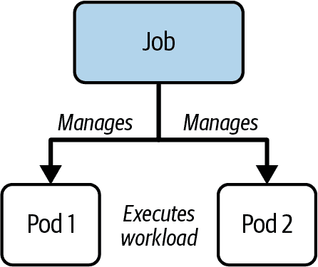
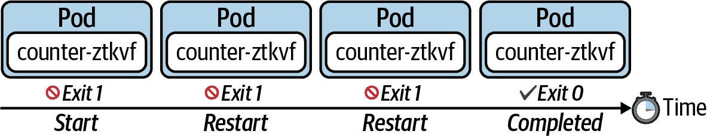
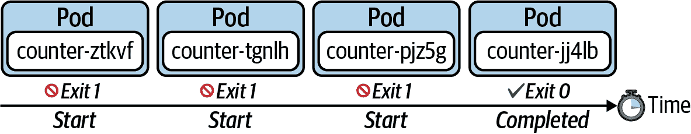
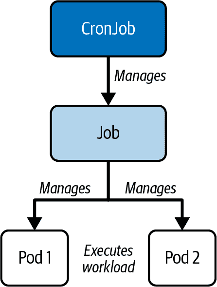
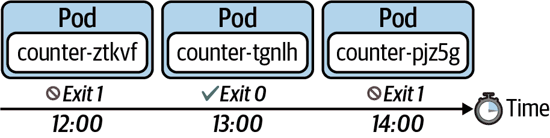

# 第六章：Jobs 和 CronJobs

Job 模型化一次性过程——例如批处理操作。当工作完成后，Pod 及其包含的容器停止运行。CronJobs 根据其定义的调度周期定期运行。CronJob 的一个好应用场景是需要定期发生的任务（例如，导出数据的进程）。在本章中，您将学习如何配置、运行和检查 Job 和 CronJob。

# 与 Jobs 一起工作

Job 是 Kubernetes 的原语，运行功能，直到达到指定的完成数为止，非常适合一次性操作，如导入/导出数据过程或有限终端的 I/O 密集型过程。由 Job 管理的实际工作仍在 Pod 内运行。因此，您可以将 Job 视为执行工作负载的更高级协调实例。Figure 6-1 显示了 Job 与其管理的 Pod(s) 之间的父子关系。

当 Job 及其 Pod 完成时，Kubernetes 不会自动删除这些对象——它们会一直保留，直到明确删除为止。保留这些对象有助于调试 Pod 内部运行的命令，并且让你有机会检查日志。



###### 图 6-1\. Job 与其 Pods 之间的关系

# Jobs 和 Pods 的自动清理

Kubernetes 支持一个 [Job 的自动清理机制](https://kubernetes.io/docs/concepts/workloads/controllers/ttlafterfinished/) 及其受控 Pod，通过指定 YAML 属性 `spec.ttlSecondsAfterFinished`。

## 创建和检查 Jobs

让我们先创建一个 Job 并观察其在实践中的行为，然后再深入细节。要即时创建一个 Job，只需使用`create job`命令。如果提供的镜像不运行任何命令，则可能需要附加要在相应 Pod 中执行的命令。

下面的命令创建一个运行迭代过程的 Job。在循环的每次迭代中，一个名为 `counter` 的变量会递增。当计数器值达到 3 时，命令执行结束：

```
$ kubectl create job counter --image=nginx:1.25.1 \
  -- /bin/sh -c 'counter=0; while [ $counter -lt 3 ]; do \
  counter=$((counter+1)); echo "$counter"; sleep 3; done;'
job.batch/counter created

```

示例 6-1 显示了 Job 的 YAML 清单等效版本，如果您更喜欢声明性方法。

##### 示例 6-1\. 执行循环命令的 Job

```
apiVersion: batch/v1
kind: Job
metadata:
  name: counter
spec:
  template:   
    spec:
      containers:
      - name: counter
        image: nginx:1.25.1
        command:
        - /bin/sh
        - -c
        - counter=0; while [ $counter -lt 3 ]; do counter=$((counter+1)); \
          echo "$counter"; sleep 3; done;
      restartPolicy: Never
```


Pod 模板使用与 Pod 定义中相同的属性。

列出 Job 的输出显示当前完成数和预期完成数。默认完成数为 1\. 这意味着如果执行命令的 Pod 成功，Job 就被视为完成。如下终端输出所示，默认情况下，一个 Job 使用单个 Pod 执行工作。相应的 Pod 可以通过名称标识——它使用 Job 名称作为其名称的前缀：

```
$ kubectl get jobs
NAME      COMPLETIONS   DURATION   AGE
counter   0/1           13s        13s
$ kubectl get jobs
NAME      COMPLETIONS   DURATION   AGE
counter   1/1           15s        19s
$ kubectl get pods
NAME            READY   STATUS      RESTARTS   AGE
counter-z6kdj   0/1     Completed   0          51s

```

若要验证 Job 的正确行为，可以下载其日志。预期地，输出会为每次迭代显示计数器：

```
$ kubectl logs counter-z6kdj
1
2
3

```

您可以进一步调整作业的运行时行为。接下来的两个部分将讨论配置作业操作类型和重启行为。

## 作业操作类型

作业的默认行为是在单个 Pod 中运行工作负载，并期望一次成功完成。这是 Kubernetes 称为*非并行*作业。这些参数在内部由属性 `spec.completions` 和 `spec.parallelism` 跟踪，每个属性的分配值均为 1\. 以下命令呈现了我们之前创建的作业的参数：

```
$ kubectl get jobs counter -o yaml | grep -C 1 "completions"
...
  completions: 1
  parallelism: 1
...

```

您可以调整任何这些参数以适应您的用例需求。例如，如果您期望工作负载成功完成多次，则可以将 `spec.completions` 的值增加至至少 2\. 有时，您可能希望通过多个 Pod 并行执行工作负载。在这些情况下，您会增加分配给 `spec.parallelism` 的值。这被称为*并行作业*。请记住，您可以使用这两个属性的分配值的任何组合。表 6-1 总结了不同的用例。

表 6-1\. 不同作业操作类型的配置

| 类型 | spec.completions | spec.parallelism | 描述 |
| --- | --- | --- | --- |
| 单次完成非并行 | 1 | 1 | 一旦其 Pod 成功终止，即完成。 |
| 固定完成计数并行 | >= 1 | >= 1 | 当指定数量的任务成功完成时完成。 |
| 工作队列并行 | 未设置 | >= 1 | 当至少一个 Pod 成功终止且所有 Pod 都终止时完成。 |

## 重启行为

`spec.backoffLimit` 属性确定作业尝试成功完成工作负载的重试次数，直到执行的命令以退出代码 0 结束。默认值为 6，这意味着作业在被认为失败之前将执行工作负载 6 次。

作业清单需要通过 `spec.tem⁠plate.spec.restartPolicy` 明确声明重启策略。Pod 的默认重启策略是 `Always`，告诉 Kubernetes 调度器即使容器以 0 的退出代码退出，也会*始终*重新启动 Pod。作业的重启策略只能是 `OnFailure` 或 `Never`。

### 在容器失败时重新启动

图 6-2 展示了使用重启策略 `OnFailure` 的作业的行为。在容器失败时，该策略将简单地重新运行容器。



###### 图 6-2\. 重启策略 *onFailure*

### 失败时启动新的 Pod

图 6-3 展示了使用重启策略 `Never` 的作业的行为。该策略在容器失败时不会重新启动容器，而是启动一个新的 Pod。



###### 图 6-3\. 重启策略 `Never`

# 使用 CronJobs

作业表示有限操作。一旦操作成功执行，作业完成并且不再创建新的 Pod。CronJob 根据计划定期创建新的作业对象。由作业控制的 Pod 处理实际工作负载。图 6-4 展示了 CronJob、它管理的作业及执行工作负载的 Pod 之间的关系。



###### 图 6-4\. CronJob、作业及其 Pod 之间的关系

可以使用类似于 Unix cron 作业的 cron 表达式定义计划。图 6-5 显示了每小时执行一次的 CronJob。每次执行时，CronJob 创建一个新的 Pod 执行任务，并以 0 或非零退出代码完成。



###### 图 6-5\. 根据计划执行作业

## 创建和检查 CronJob

您可以使用命令式的`create cronjob`命令创建新的 CronJob。以下命令安排 CronJob 每分钟运行一次。每次执行时创建的 Pod 使用 Unix 的`echo`命令将当前日期渲染到标准输出：

```
$ kubectl create cronjob current-date --schedule="* * * * *" \
  --image=nginx:1.25.1 -- /bin/sh -c 'echo "Current date: $(date)"'
cronjob.batch/current-date created

```

要从 YAML 文件创建 CronJob，请使用示例 6-2 中显示的定义。

##### 示例 6-2\. 打印当前日期的 CronJob

```
apiVersion: batch/v1
kind: CronJob
metadata:
  name: current-date
spec:
  schedule: "* * * * *"   
  jobTemplate:            
    spec:
      template:
        spec:
          containers:
          - name: current-date
            image: nginx:1.25.1
            args:
            - /bin/sh
            - -c
            - 'echo "Current date: $(date)"'
          restartPolicy: OnFailure
```


定义确定何时需要创建新的作业对象的 cron 表达式。


描述作业模板的部分。

如果您使用`get cronjobs`命令列出现有的 CronJob，则会看到计划、上次计划执行以及 CronJob 是否当前活动：

```
$ kubectl get cronjobs
NAME           SCHEDULE    SUSPEND   ACTIVE   LAST SCHEDULE   AGE
current-date   * * * * *   False     0        <none>          28s
$ kubectl get cronjobs
NAME           SCHEDULE    SUSPEND   ACTIVE   LAST SCHEDULE   AGE
current-date   * * * * *   False     1        14s             53s

```

很容易匹配由 CronJob 创建的作业和 Pod。您可以通过名称前缀简单地识别它们。在这种情况下，前缀是`current-date-`：

```
$ kubectl get jobs,pods
NAME                              COMPLETIONS   DURATION   AGE
job.batch/current-date-28473049   1/1           3s         2m23s
job.batch/current-date-28473050   1/1           3s         83s
job.batch/current-date-28473051   1/1           3s         23s

NAME                              READY   STATUS      RESTARTS   AGE
pod/current-date-28473049-l6hc7   0/1     Completed   0          2m23s
pod/current-date-28473050-csq7n   0/1     Completed   0          83s
pod/current-date-28473051-jg8st   0/1     Completed   0          23s

```

## 配置保留的作业历史记录

即使由 CronJob 控制的 Pod 中的任务完成后，它也不会自动删除。保留 Pod 的历史记录可以极大地帮助排查失败的工作负载或检查日志。默认情况下，CronJob 保留最后三个成功的 Pod 和最后一个失败的 Pod：

```
$ kubectl get cronjobs current-date -o yaml | grep successfulJobsHistoryLimit:
  successfulJobsHistoryLimit: 3
$ kubectl get cronjobs current-date -o yaml | grep failedJobsHistoryLimit:
  failedJobsHistoryLimit: 1

```

要重新配置作业保留历史记录限制，请为`spec.successfulJobsHistoryLimit`和`spec.failedJobsHistoryLimit`属性设置新值。示例 6-3 保留了最近五次成功执行和最后三次失败执行。

##### 示例 6-3\. 配置保留历史记录限制的 CronJob

```
apiVersion: batch/v1
kind: CronJob
metadata:
  name: current-date
spec:
  successfulJobsHistoryLimit: 5   
  failedJobsHistoryLimit: 3       
  schedule: "* * * * *"
  jobTemplate:
    spec:
      template:
        spec:
          containers:
          - name: current-date
            image: nginx:1.25.1
            args:
            - /bin/sh
            - -c
            - 'echo "Current date: $(date)"'
          restartPolicy: OnFailure
```


定义保留的成功作业数。


定义保留的失败作业数。

# 总结

工作很适合实施作为有限操作在一个或多个 Pod 中运行的批处理过程。作业和 Pod 这两个对象在工作完成后不会被删除，以支持检查和故障排除活动。CronJob 与作业非常相似，但是按照 Unix cron 表达式的计划执行。

# 考试要点

了解作业和 CronJob 的实际用例

作业和 CronJob 管理应至少完成一次或定期完成的 Pod。您需要理解这些对象的创建方式以及如何在运行时检查它们。确保尝试不同的配置选项以及它们如何影响运行时行为。

练习不同的作业操作模式

作业可以在三种模式下运行：非并行模式，具有固定完成计数的并行模式以及具有工作队列的并行模式。作业的默认行为是在单个 Pod 中运行工作负载并期望一次成功完成（非并行作业）。属性 `spec.completions` 控制所需的成功完成数。属性 `spec.parallelism` 允许多个 Pod 并行执行工作负载。

# 示例练习

这些练习的解决方案可以在 附录 A 中找到。

1.  使用容器镜像 `alpine:3.17.3` 创建名为 `random-hash` 的作业，该作业执行 shell 命令 `echo $RANDOM | base64 | head -c 20`。配置作业以两个 Pod 并行执行。完成次数应设置为 5。

    确定执行了 shell 命令的 Pod。您期望存在多少个 Pod？

    从其中一个 Pod 中检索生成的哈希。

    删除作业。相应的 Pod 是否会继续存在？

1.  创建一个名为 `google-ping` 的新 CronJob。执行时，作业应该运行一个 `curl` 命令访问 `google.com`。选择合适的镜像。执行应每两分钟进行一次。

    观察由 CronJob 管理的基础作业的创建。检查相关命令的命令行选项或参考 [Kubernetes 文档](https://kubernetes.io/docs/reference/kubectl)。

    重新配置 CronJob 以保留七次执行的历史记录。

    重新配置 CronJob，以防止当前执行仍在运行时禁止新执行。更多信息，请参考 [Kubernetes 文档](https://kubernetes.io/docs/concepts/workloads/controllers/cron-jobs/#concurrency-policy)。
