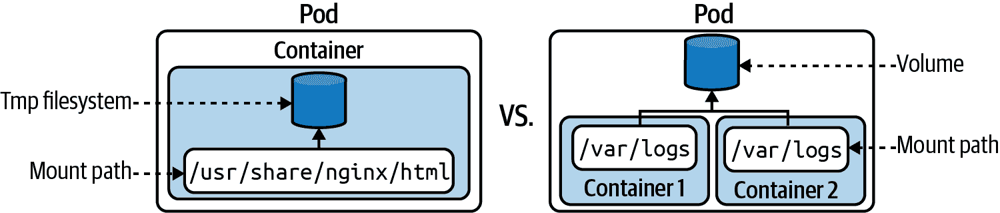
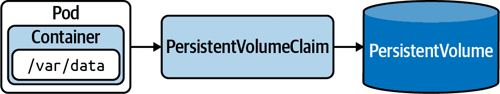

# 第七章：卷

容器的临时文件系统与任何其他容器或 Pod 隔离，并且在 Pod 重新启动后不会持久化。Pod 可以定义一个卷并将其挂载到容器上。

临时卷存在于 Pod 的生命周期内。如果您希望在运行在 Pod 中的多个容器之间共享数据，它们非常有用。持久卷则在 Pod 的生命周期外保留数据。对于需要数据长期存在的应用程序来说，它们是一个很好的选择，例如数据库驱动应用程序的存储形式。在本章中，我们将在 Pod 中练习不同类型的卷的使用。

# 使用存储

在容器中运行的应用程序可以使用临时文件系统读写文件。在容器崩溃或集群/节点重新启动时，kubelet 将重新启动容器。已写入临时文件系统的任何数据都会丢失，无法检索。容器实际上是以空白状态启动的。

有很多情况需要在容器中挂载卷。我们将在 第八章 中看到其中一个最突出的用例：使用临时卷在主应用程序容器和 sidecar 之间交换数据。图 7-1 说明了容器的临时文件系统与使用卷的差异。



###### 图 7-1\. 使用临时文件系统与卷的容器

## 卷类型

每个卷都需要定义一个类型。该类型确定支持卷的介质及其运行时行为。

临时卷

这些存在于 Pod 的生命周期内。临时卷在多个容器之间共享数据或者可以在 Pod 重新启动时轻松重建卷上的数据时非常有用。

持久卷

这些持久化数据超出了 Pod 的生命周期。持久卷是应用程序的好选择，需要数据存在更长时间，例如用于数据库驱动应用程序的存储形式。

Kubernetes 文档提供了一长串的卷类型。表 7-1 提供了我认为对考试最相关的一些卷类型的选择列表。

表 7-1\. 最相关于考试的卷类型

| 类型 | 描述 |
| --- | --- |
| `emptyDir` | Pod 中具有读写访问权限的空目录。仅在 Pod 的生命周期内持久化。用于缓存实现或者在 Pod 的容器之间交换数据是一个不错的选择。 |
| `hostPath` | 主机节点文件系统中的文件或目录。仅支持单节点集群，不适用于生产环境。 |
| `configMap`, `secret` | 提供注入配置数据的方法。有关实际示例，请参见 第十九章。 |
| `nfs` | 现有的 NFS（网络文件系统）共享。在 Pod 重新启动后保留数据。 |
| `persistentVolumeClaim` | 声明持久卷。更多信息，请参见“创建持久卷声明”。 |

## 临时卷

为 Pod 定义临时卷需要两个步骤。首先，您需要使用属性 `spec.volumes[]` 声明卷本身。在定义中，您提供名称和类型。仅仅声明卷是不够的。其次，通过 `spec.containers[].volumeMounts[]` 将卷挂载到消耗容器的路径上。卷与卷挂载之间的映射通过匹配名称完成。

### 创建并挂载临时卷

在 示例 7-1 中，存储在文件 *pod-with-volume.yaml* 中的定义了类型为 `emptyDir` 的卷。卷已挂载到名为 `nginx` 的容器内的路径 */var/log/nginx*。

##### 示例 7-1\. 定义并挂载临时卷的 Pod

```
apiVersion: v1
kind: Pod
metadata:
  name: business-app
spec:
  volumes:
  - name: logs-volume
    emptyDir: {}
  containers:
  - image: nginx:1.25.1
    name: nginx
    volumeMounts:
    - mountPath: /var/log/nginx
      name: logs-volume
```

### 与卷交互

让我们创建 Pod 并查看是否可以与挂载的卷交互。以下命令在 Pod 创建后打开一个交互式 shell，然后导航到挂载路径。您可以看到类型为 `emptyDir` 的卷将挂载路径初始化为一个空目录。可以根据需要创建新的文件和目录，没有限制：

```
$ kubectl create -f pod-with-volume.yaml
pod/business-app created
$ kubectl get pod business-app
NAME           READY   STATUS    RESTARTS   AGE
business-app   1/1     Running   0          43s
$ kubectl exec business-app -it -- /bin/sh
# cd /var/log/nginx
# pwd
/var/log/nginx
# ls
# touch app-logs.txt
# ls
app-logs.txt

```

关于多个容器挂载 `emptyDir` 卷类型的示例用例，请参见第八章。

## 持久卷

存储在卷上的数据可以在容器重新启动后持续存在。在许多应用程序中，数据的存活周期远远超出了应用程序、容器、Pod、节点甚至集群本身的生命周期。数据持久性确保数据的生命周期与集群资源的生命周期解耦。典型的例子是由数据库持久化的数据。这是持久卷的责任。Kubernetes 使用两个原语来持久化数据：持久卷和持久卷声明。

持久卷是 Kubernetes 集群中表示存储片段的原始对象。它与 Pod 完全解耦，因此具有自己的生命周期。该对象捕获存储的来源（例如，由云提供商提供的存储）。持久卷由 Kubernetes 管理员提供或通过映射到存储类动态分配。

持久卷声明请求持久卷的资源，例如存储的大小和访问类型。在 Pod 中，您将使用类型 `persistentVolumeClaim` 通过持久卷声明来挂载抽象的持久卷。

图 7-2 显示了 Pod、持久卷声明和持久卷之间的关系。



###### 图 7-2\. 从 Pod 中声明持久卷

### 静态与动态配置

持久卷可以静态或动态创建。如果选择静态方法，则首先需要创建存储设备，然后通过显式创建 `PersistentVolume` 对象来引用它。动态方法不需要您创建 `PersistentVolume` 对象。它将通过设置 `spec.storageClassName` 属性自动从 `PersistentVolumeClaim` 创建。

存储类是定义存储设备类别（例如，具有慢速或快速性能的存储）的抽象概念，用于不同的应用程序类型。设置存储类是 Kubernetes 管理员的工作。有关存储类的更深入讨论，请参见 “存储类”。现在，我们将重点放在持久卷的静态配置上。

### 创建持久卷

当您自行创建持久卷对象时，我们称这种方法为静态配置。只能使用先声明的方式创建持久卷。此时，`kubectl` 不允许使用 `create` 命令创建持久卷。每个持久卷都需要通过 `spec.capacity` 定义存储容量，并通过 `spec.accessModes` 设置访问模式。有关持久卷的配置选项的更多信息，请参见 “持久卷的配置选项”。

示例 7-2 创建一个名为 `db-pv` 的持久卷，其存储容量为 1Gi，并由单个节点具有读/写访问。属性 `hostPath` 挂载来自主机节点文件系统的目录 */data/db*。我们将把 YAML 清单存储在文件 `db-pv.yaml` 中。

##### 示例 7-2\. 定义持久卷的 YAML 清单

```
apiVersion: v1
kind: PersistentVolume
metadata:
  name: db-pv
spec:
  capacity:
    storage: 1Gi
  accessModes:
    - ReadWriteOnce
  hostPath:
    path: /data/db
```

当您检查创建的持久卷时，您将发现大部分信息都来自于清单提供的信息。状态 `Available` 表示该对象已准备好被索取。回收策略决定在持久卷被释放后应该发生什么。默认情况下，对象将被保留。下面的示例使用短格式命令 `pv` 避免输入 `persistentvolume`：

```
$ kubectl create -f db-pv.yaml
persistentvolume/db-pv created
$ kubectl get pv db-pv
NAME    CAPACITY   ACCESS MODES   RECLAIM POLICY   STATUS    \
  CLAIM   STORAGECLASS   REASON   AGE
db-pv   1Gi        RWO            Retain           Available \
                                  10s
```

### 持久卷的配置选项

持久卷提供各种配置选项，确定其固有的运行时行为。对于考试而言，理解卷模式、访问模式和回收策略的配置选项非常重要。

#### 卷模式

卷模式处理设备的类型。这是一个要么用于文件系统的设备，要么由块设备支持的设备。最常见的情况是文件系统设备。您可以使用 `spec.volumeMode` 属性设置卷模式。表 7-2 显示了所有可用的卷模式。

表 7-2\. 持久卷卷模式

| 类型 | 描述 |
| --- | --- |
| `Filesystem` | 默认。将卷挂载到消费 Pod 的目录中。如果卷由块设备支持且设备为空，则首先创建文件系统。 |
| `Block` | 用于作为原始块设备的卷，无文件系统。 |

默认情况下，`get pv` 命令的控制台输出不会显示卷模式。您需要提供 `-o wide` 命令行选项来查看 `VOLUMEMODE` 列，如下所示：

```
$ kubectl get pv -o wide
NAME    CAPACITY   ACCESS MODES   RECLAIM POLICY   STATUS    \
CLAIM   STORAGECLASS   REASON   AGE   VOLUMEMODE
db-pv   1Gi        RWO            Retain           Available \
                                19m   Filesystem
```

#### 访问模式

每个持久卷可以使用 `spec.accessModes` 属性表达其访问方式。例如，您可以定义卷仅可以由单个 Pod 以读写模式挂载，或者卷为只读但可同时从不同节点访问。表 7-3 提供了可用访问模式的概述。通常，在特定命令的输出中会渲染访问模式的短形式标注，例如 `get pv` 或 `describe pv`。

表 7-3\. 持久卷访问模式

| 类型 | 短形式 | 描述 |
| --- | --- | --- |
| `ReadWriteOnce` | RWO | 单个节点读写访问 |
| `ReadOnlyMany` | ROX | 多个节点只读访问 |
| `ReadWriteMany` | RWX | 多个节点读写访问 |
| `ReadWriteOncePod` | RWOP | 由单个 Pod 挂载的读写访问 |

下面的命令从名为 `db-pv` 的持久卷中解析访问模式。正如您所见，返回的值是一个数组，强调了您可以一次分配多个访问模式：

```
$ kubectl get pv db-pv -o jsonpath='{.spec.accessModes}'
["ReadWriteOnce"]

```

#### 回收策略

另外，您还可以为持久卷定义回收策略。回收策略指定了当绑定的持久卷索赔被删除时持久卷对象应如何处理（参见 表 7-4）。对于动态创建的持久卷，可以通过存储类别的属性 `.reclaimPolicy` 设置回收策略。对于静态创建的持久卷，请使用持久卷定义中的属性 `spec.persistentVolumeReclaimPolicy`。

表 7-4\. 持久卷回收策略

| 类型 | 描述 |
| --- | --- |
| `Retain` | 默认。当持久卷索赔被删除时，持久卷“释放”，可以重新声明。 |
| `Delete` | 删除会移除持久卷及其关联存储。 |
| `Recycle` | 此值已被弃用。您应使用其他值之一。 |

此命令检索命名为 `db-pv` 的持久卷的分配回收策略：

```
$ kubectl get pv db-pv -o jsonpath='{.spec.persistentVolumeReclaimPolicy}'
Retain

```

### 创建持久卷索赔

接下来我们需要创建的对象是持久卷索赔。其目的是将持久卷绑定到 Pod。让我们看一下存储在文件 *db-pvc.yaml* 中的 YAML 清单，如 示例 7-3 所示。

##### 示例 7-3\. 持久卷索赔的定义

```
kind: PersistentVolumeClaim
apiVersion: v1
metadata:
  name: db-pvc
spec:
  accessModes:
    - ReadWriteOnce
  storageClassName: ""
  resources:
    requests:
      storage: 256Mi
```

我们所说的是：“给我一个能够满足 256Mi 资源请求并提供 `ReadWriteOnce` 访问模式的 `PersistentVolume`。” 如果不希望自动分配默认存储类，静态配置应该使用空字符串作为 `spec.storageClassName` 属性的值。基于这些条件，自动选择适当的 `PersistentVolume` 进行绑定。

创建 `PersistentVolumeClaim` 后，状态设置为 `Bound`，这意味着与 `PersistentVolume` 的绑定成功。一旦关联绑定发生，其他任何东西都不能绑定它。绑定关系是一对一的。基于这些条件，使用简短形式 `pvc` 而不是 `persistentvolumeclaim` 的以下 `get` 命令：

```
$ kubectl create -f db-pvc.yaml
persistentvolumeclaim/db-pvc created
$ kubectl get pvc db-pvc
NAME     STATUS   VOLUME   CAPACITY   ACCESS MODES   STORAGECLASS   AGE
db-pvc   Bound    db-pv    1Gi        RWO                           111s
```

`PersistentVolume` 尚未被 `Pod` 挂载。因此，检查对象的详细信息显示 `<none>`。使用 `describe` 命令是验证 `PersistentVolumeClaim` 是否已正确挂载的好方法：

```
$ kubectl describe pvc db-pvc
...
Used By:       <none>
...
```

### 在 `Pod` 中挂载 `PersistentVolumeClaim`

剩下的工作就是在要使用它的 `Pod` 中挂载 `PersistentVolumeClaim`。您已经学会了如何在 `Pod` 中挂载卷。这里的主要区别，在 示例 7-4 中展示，是使用 `spec.volumes[].persistentVolumeClaim` 并提供 `PersistentVolumeClaim` 的名称。

##### 示例 7-4\. 引用 `PersistentVolumeClaim` 的 `Pod`

```
apiVersion: v1
kind: Pod
metadata:
  name: app-consuming-pvc
spec:
  volumes:
  - name: app-storage
    persistentVolumeClaim:
      claimName: db-pvc
  containers:
  - image: alpine:3.18.2
    name: app
    command: ["/bin/sh"]
    args: ["-c", "while true; do sleep 60; done;"]
    volumeMounts:
      - mountPath: "/mnt/data"
        name: app-storage
```

假设我们将配置存储在名为 *app-consuming-pvc.yaml* 的文件中。从清单创建 `Pod` 后，您应该看到 `Pod` 进入 `Ready` 状态。 `describe` 命令将提供有关卷的附加信息：

```
$ kubectl create -f app-consuming-pvc.yaml
pod/app-consuming-pvc created
$ kubectl get pods
NAME                READY   STATUS    RESTARTS   AGE
app-consuming-pvc   1/1     Running   0          3s
$ kubectl describe pod app-consuming-pvc
...
Volumes:
  app-storage:
    Type:       PersistentVolumeClaim (a reference to a PersistentVolumeClaim \
                in the same namespace)
    ClaimName:  db-pvc
    ReadOnly:   false
...
```

`PersistentVolumeClaim` 现在还显示已经挂载的 `Pod`：

```
$ kubectl describe pvc db-pvc
...
Used By:       app-consuming-pvc
...
```

您现在可以继续并打开一个交互式 Shell 到 `Pod`。导航到挂载路径 `/mnt/data` 可以让您访问底层的 `PersistentVolume`：

```
$ kubectl exec app-consuming-pvc -it -- /bin/sh
/ # cd /mnt/data
/mnt/data # ls -l
total 0
/mnt/data # touch test.db
/mnt/data # ls -l
total 0
-rw-r--r--    1 root     root             0 Sep 29 23:59 test.db
```

## 存储类

存储类是 Kubernetes 的一个基本概念，定义了特定类型或“类”的存储。典型的存储特性可以是类型（例如，快速 SSD 存储与远程云存储或存储的备份策略）。存储类用于根据其条件动态地提供 `PersistentVolume`。实际上，这意味着您不必自己创建 `PersistentVolume` 对象。分配给存储类的提供程序会处理这一切。大多数 Kubernetes 云提供商都配备了一组现有的提供程序。Minikube 已经创建了一个名为 `standard` 的默认存储类，您可以使用以下命令查询它：

```
$ kubectl get storageclass
NAME                 PROVISIONER                RECLAIMPOLICY \
  VOLUMEBINDINGMODE   ALLOWVOLUMEEXPANSION   AGE
standard (default)   k8s.io/minikube-hostpath   Delete        \
  Immediate           false                  108d
```

### 创建存储类

存储类只能在有 YAML 清单的帮助下声明。至少需要声明供应商。如果在创建时未提供其他属性，则使用默认值。大多数供应商允许您设置特定于存储类型的参数。示例 7-5 定义了一个由供应商 `kubernetes.io/gce-pd` 表示的 Google Compute Engine 上的存储类。

##### 示例 7-5\. 存储类的定义

```
apiVersion: storage.k8s.io/v1
kind: StorageClass
metadata:
  name: fast
provisioner: kubernetes.io/gce-pd
parameters:
  type: pd-ssd
  replication-type: regional-pd
```

如果您将 YAML 内容保存在文件 *fast-sc.yaml* 中，则以下命令将创建该对象。可以使用 `get storageclass` 命令列出存储类：

```
$ kubectl create -f fast-sc.yaml
storageclass.storage.k8s.io/fast created
$ kubectl get storageclass
NAME                 PROVISIONER                RECLAIMPOLICY \
  VOLUMEBINDINGMODE   ALLOWVOLUMEEXPANSION   AGE
fast                 kubernetes.io/gce-pd       Delete        \
  Immediate           false                  4s
...
```

### 使用存储类

动态配置 PersistentVolume 需要在创建 PersistentVolumeClaim 时分配存储类。示例 7-6 展示了使用属性 `spec.storageClassName` 分配名为 `standard` 的存储类的用法。

##### 示例 7-6\. 在 PersistentVolumeClaim 中使用存储类

```
kind: PersistentVolumeClaim
apiVersion: v1
metadata:
  name: db-pvc
spec:
  accessModes:
    - ReadWriteOnce
  resources:
    requests:
      storage: 512Mi
  storageClassName: standard
```

只有在存储类能够使用其供应商动态提供合适的 PersistentVolume 时，才会创建相应的 PersistentVolume 对象。重要的是要理解，如果情况不是这样，Kubernetes 不会显示错误或警告消息。

以下命令呈现了创建的 PersistentVolumeClaim 和 PersistentVolume。正如您所见，动态配置的 PersistentVolume 的名称使用哈希确保唯一命名：

```
$ kubectl get pv,pvc
NAME                                                       CAPACITY \
  ACCESS MODES  RECLAIM POLICY  STATUS  CLAIM           STORAGECLASS \
  REASON  AGE
persistentvolume/pvc-b820b919-f7f7-4c74-9212-ef259d421734   512Mi \
    RWO           Delete          Bound   default/db-pvc  standard \
                  2s

NAME                          STATUS  VOLUME                                  \
CAPACITY  ACCESS MODES  STORAGECLASS  AGE
persistentvolumeclaim/db-pvc  Bound   pvc-b820b919-f7f7-4c74-9212-ef259d421734 \
512Mi     RWO           standard      2s
```

从 Pod 挂载 PersistentVolumeClaim 的步骤与静态和动态配置相同。有关更多信息，请参阅“在 Pod 中挂载 PersistentVolumeClaim”。

# 摘要

Kubernetes 提供了 Volume 的概念来实现使用场景。Pod 将 Volume 挂载到容器中的路径。Kubernetes 提供了广泛的 Volume 类型以满足不同的需求。

PersistentVolumes 可以在 Pod 或集群/节点重新启动后存储数据。这些对象与 Pod 的生命周期分离，因此由 Kubernetes 原语表示。PersistentVolumeClaim 抽象了 PersistentVolume 的底层实现细节，并充当 Pod 和 PersistentVolume 之间的中介。

# 考试要点

实践定义和使用临时 Volume

Volume 是考试中应用于不同领域的横向概念。了解在哪里找到定义 Volume 的相关文档以及从容器中消耗 Volume 的多种方式。一定要阅读第十九章，深入了解如何将 ConfigMaps 和 Secrets 挂载为 Volume，以及第八章，了解在两个容器之间共享 Volume 的方式。

深入理解定义和使用 PersistentVolume 的机制

创建 PersistentVolume 涉及几个关键步骤。了解 PersistentVolumes 和 PersistentVolumeClaims 的配置选项及其如何协同工作。尝试模拟导致 PersistentVolumeClaim 成功绑定的情况。然后通过采取反应措施来修复情况。掌握`pv`和`pvc`的简短命令，以在考试中节省宝贵的时间。

# 示例练习

这些练习的解决方案可以在附录 A 中找到。

1.  创建一个 Pod 的 YAML 清单，其中包含两个使用镜像`alpine:3.12.0`的容器。为两个容器提供一个命令，以使它们永远运行。

    为 Pod 定义一个类型为`emptyDir`的 Volume。容器 1 应将 Volume 挂载到路径*/etc/a*，容器 2 应将 Volume 挂载到路径*/etc/b*。

    打开容器 1 的交互式 shell，并在挂载路径中创建名为*data*的目录。导航到该目录并创建包含内容“Hello World.”的文件*hello.txt*。退出容器。

    打开容器 2 的交互式 shell，并导航到目录*/etc/b/data*。检查文件*hello.txt*的内容。退出容器。

1.  创建名为`logs-pv`的 PersistentVolume，映射到`hostPath`为*/var/logs*。访问模式应为`ReadWriteOnce`和`ReadOnlyMany`。预配存储容量为 5Gi。确保 PersistentVolume 的状态显示为`Available`。

    创建名为`logs-pvc`的 PersistentVolumeClaim。它使用`ReadWriteOnce`访问。请求容量为 2Gi。确保 PersistentVolume 的状态显示为`Bound`。

    在运行`nginx`镜像的 Pod 中挂载 PersistentVolumeClaim，挂载路径为*/var/log/nginx*。

    打开容器的交互式 shell，并在*/var/log/nginx*中创建名为*my-nginx.log*的新文件。退出 Pod。

    删除 Pod，并使用相同的 YAML 清单重新创建 Pod。打开 Pod 的交互式 shell，导航到目录*/var/log/nginx*，并找到之前创建的文件。
