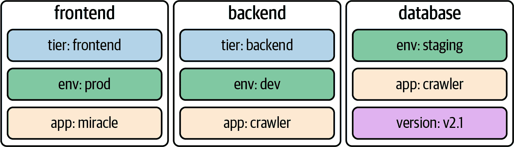

# 第九章：标签和注释

考试课程大纲并未明确提到标签的概念；但是，它对于理解某些 Kubernetes 原语在内部如何运行至关重要。为了避免将标签与注释混淆，我们还将讨论这些概念之间的共同点和区别。

标签是查询、过滤和排序 Kubernetes 对象的重要工具。注释代表 Kubernetes 对象的描述性元数据，但不能用于查询。在本章中，您将学习如何分配和使用这两个概念。

# 处理标签

Kubernetes 允许您为对象分配键值对，以便稍后在搜索查询中使用它们。这些键值对称为*标签*。为了类比，您可以将标签视为博客文章的标签。

标签以不同的术语描述 Kubernetes 对象（例如“frontend”或“backend”类别），但并不意味着它们用于功能的详细、多词描述。作为规范的一部分，Kubernetes 将标签的长度限制为最多 63 个字符，并允许使用字母数字字符和分隔符字符的范围。

图 9-1 显示了名为`frontend`、`backend`和`database`的 Pod。每个 Pod 声明了一组独特的标签。



###### 图 9-1\. 带有标签的 Pod

在创建对象时，通常会分配一个或多个标签；但是，您可以根据需要修改活动对象的标签。当您第一次看到标签时，它们可能看似微不足道，但它们的重要性不可忽视。它们对于理解像部署和服务这样的更高级 Kubernetes 对象的运行时行为至关重要。在本章的后面，我们将详细了解标签在实践中的重要性，特别是在学习部署更多细节时。

## 声明标签

您可以使用`run`命令或在 YAML 清单的`metadata.labels`部分声明性地声明标签。在创建 Pod 时，命令行选项`--labels`（或其简写形式`-l`）在命令行上定义了一个逗号分隔的标签列表。以下命令在命令行上创建一个带有两个标签的新 Pod：

```
$ kubectl run labeled-pod --image=nginx:1.25.1 \
  --labels=tier=backend,env=dev
pod/labeled-pod created

```

通过编辑清单将标签分配给 Kubernetes 对象需要更改`metadata`部分。如果我们从 YAML 清单开始，示例 9-1 显示了上一个命令的 Pod 定义。

##### 示例 9-1\. 定义了两个标签的 Pod

```
apiVersion: v1
kind: Pod
metadata:
  name: labeled-pod
  labels:
    env: dev
    tier: backend
spec:
  containers:
  - image: nginx:1.25.1
    name: nginx
```

## 检查标签

您可以从不同角度检查分配给 Kubernetes 对象的标签。在这里，我们将讨论查看 Pod 标签的最常见方法。与任何其他运行时信息一样，您可以使用`describe`或`get`命令检索标签：

```
$ kubectl describe pod labeled-pod | grep -C 2 Labels:
...
Labels:       env=dev
              tier=backend
...
$ kubectl get pod labeled-pod -o yaml | grep -C 1 labels:
metadata:
  labels:
    env: dev
    tier: backend
...

```

如果您想要列出所有对象类型或特定对象类型的标签，请使用`--show-labels`命令行选项。如果您需要筛选更长的对象列表，此选项非常方便。输出会自动添加一个名为`LABELS`的新列：

```
$ kubectl get pods --show-labels
NAME          READY   STATUS    RESTARTS   AGE   LABELS
labeled-pod   1/1     Running   0          38m   env=dev,tier=backend

```

## 对活动对象进行标签修改

您可以随时向现有的 Kubernetes 对象添加或删除标签，或者简单地修改现有的标签。实现这一目标的一种方法是编辑活动对象，并在`metadata.labels`部分更改标签定义。另一个选项，提供稍快的周转时间，是`label`命令。以下命令添加一个新标签，更改标签的值，然后用减号移除标签：

```
$ kubectl label pod labeled-pod region=eu
pod/labeled-pod labeled
$ kubectl get pod labeled-pod --show-labels
NAME          READY   STATUS    RESTARTS   AGE   LABELS
labeled-pod   1/1     Running   0          22h   env=dev,region=eu,tier=backend
$ kubectl label pod labeled-pod region=us --overwrite
pod/labeled-pod labeled
$ kubectl get pod labeled-pod --show-labels
NAME          READY   STATUS    RESTARTS   AGE   LABELS
labeled-pod   1/1     Running   0          22h   env=dev,region=us,tier=backend
$ kubectl label pod labeled-pod region-
pod/labeled-pod labeled
$ kubectl get pod labeled-pod --show-labels
NAME          READY   STATUS    RESTARTS   AGE   LABELS
labeled-pod   1/1     Running   0          22h   env=dev,tier=backend

```

## 使用标签选择器

仅当与选择功能结合使用时，标签才变得有意义。标签选择器使用一组条件查询 Kubernetes 对象。例如，您可以使用标签选择器表达“选择所有具有标签赋值`env=dev`、`tier=frontend`且具有具有键`version`的标签（其分配值独立于指定的值）的 Pod”，如图 9-2 所示。


###### 图 9-2。按标签条件选择 Pod 的操作

Kubernetes 提供两种通过标签选择对象的方法：从命令行和在清单中。让我们讨论这两个选项。

### 命令行中的标签选择

在命令行上，您可以使用`--selector`选项（简写为`-l`）按标签选择对象。您可以通过提供基于相等性的要求或基于集合的要求来表达过滤。两种要求类型可以在单个查询中组合使用。

*基于相等性的要求*可以使用运算符`=`、`==`或`!=`。您可以用逗号分隔多个过滤条件，然后用布尔`AND`组合它们。此时，基于相等性的标签选择不能表示布尔`OR`操作。一个典型的表达式可以说：“选择所有具有标签赋值`env=prod`的 Pod。”

*基于集合的要求*可以根据一组值来过滤对象，使用运算符`in`、`notin`和`exists`。`in`和`notin`运算符基于布尔`OR`工作。一个典型的表达式可以说：“选择所有具有标签键`env`且值为`prod`或`dev`的 Pod。”

为了演示功能，我们将设置三个具有不同标签的 Pod。所有`kubectl`命令都使用`--show-labels`命令行选项，以便与我们的期望进行比较。不需要`--show-labels`选项来进行标签选择：

```
$ kubectl run frontend --image=nginx:1.25.1 --labels=env=prod,team=shiny
pod/frontend created
$ kubectl run backend --image=nginx:1.25.1 --labels=env=prod,team=legacy,\
app=v1.2.4
pod/backend created
$ kubectl run database --image=nginx:1.25.1 --labels=env=prod,team=storage
pod/database created
$ kubectl get pods --show-labels
NAME       READY   STATUS    RESTARTS   AGE   LABELS
backend    1/1     Running   0          37s   app=v1.2.4,env=prod,team=legacy
database   1/1     Running   0          32s   env=prod,team=storage
frontend   1/1     Running   0          42s   env=prod,team=shiny

```

我们将从基于相等性的要求开始过滤 Pod。在这里，我们正在寻找所有具有标签赋值`env=prod`的 Pod。结果返回了所有三个 Pod：

```
$ kubectl get pods -l env=prod --show-labels
NAME       READY   STATUS    RESTARTS   AGE   LABELS
backend    1/1     Running   0          37s   app=v1.2.4,env=prod,team=legacy
database   1/1     Running   0          32s   env=prod,team=storage
frontend   1/1     Running   0          42s   env=prod,team=shiny

```

下一个过滤操作使用基于集合的要求。我们正在寻找所有具有标签键`team`且值为`storage`或`shiny`的 Pod。结果仅返回名称为`backend`和`frontend`的 Pod：

```
$ kubectl get pods -l 'team in (shiny, legacy)' --show-labels
NAME       READY   STATUS    RESTARTS   AGE   LABELS
backend    1/1     Running   0          19m   app=v1.2.4,env=prod,team=legacy
frontend   1/1     Running   0          20m   env=prod,team=shiny

```

最后，我们将结合基于相等性的需求与基于集合的需求。结果仅返回`backend` Pod：

```
$ kubectl get pods -l 'team in (shiny, legacy)',app=v1.2.4 --show-labels
NAME      READY   STATUS    RESTARTS   AGE   LABELS
backend   1/1     Running   0          29m   app=v1.2.4,env=prod,team=legacy

```

### 在清单中进行标签选择

一些高级 Kubernetes 对象（例如 Deployments、Services 或网络策略）充当 Pod 的配置代理。它们通常通过标签选择一组 Pod，并提供附加值。例如，网络策略控制与一组 Pod 之间和之间的网络流量。仅具有匹配标签的 Pod 将应用网络规则。示例 9-2 将网络策略应用于具有基于相等性的需求`tier=frontend`的 Pod。有关网络策略的更多详细信息，请参阅第二十三章。

##### 示例 9-2\. 作为网络策略 API 的一部分的标签选择

```
apiVersion: networking.k8s.io/v1
kind: NetworkPolicy
metadata:
  name: frontend-network-policy
spec:
  podSelector:
    matchLabels:
      tier: frontend
...
```

在清单中定义标签选择的方式基于 Kubernetes 资源的 API 版本，不同类型可能有所不同。后续章节中的内容将大量使用标签选择。

## 推荐的标签

在继续使用标签时，您可能会发现希望为对象分配的常见键值对。其中许多标签围绕应用程序的元数据，例如，您正在部署的 Pod 的组件名称或其版本。

Kubernetes 提议一组[推荐标签](https://kubernetes.io/docs/concepts/overview/working-with-objects/common-labels/)，所有这些标签都以键前缀`app.kubernetes.io`开头。示例 9-3 显示了在 Pod 定义中分配版本和组件标签。

##### 示例 9-3\. 使用推荐标签的 Pod

```
apiVersion: v1
kind: Pod
metadata:
  name: nginx
  labels:
    app.kubernetes.io/version: "1.25.1"
    app.kubernetes.io/component: server
spec:
  containers:
  - name: nginx
    image: nginx:1.25.1
```

熟悉这些推荐标签，以便您可以在管理的所有对象中使用它们。这样做的好处是使得 Kubernetes 生态系统中的工具能够使用相同的术语，并使开发人员在引用应用程序元信息时使用相同的“语言”。

# 使用注解

注解的声明方式与标签类似，但它们有不同的用途。它们代表提供描述性元数据的键值对。最重要的区别是注解不能用于查询或选择对象。注解的典型示例可能包括 SCM 提交哈希 ID、发布信息或操作对象的团队的联系方式。如果注解的值包含特殊字符或空格，请确保将其放入单引号或双引号中。图 9-3 说明了一个具有三个注解的 Pod。


###### 图 9-3\. 带有注解的 Pod

Kubernetes 定义了一组保留的注解，在运行时将评估这些注解以控制对象的运行时行为。您可以在“保留注解”找到更多信息。

## 声明注解

`kubectl run` 命令没有像标签那样用于定义注释的命令行选项。您需要从头开始编写 YAML 清单，并在 `metadata.annotations` 下添加所需的注释，如示例 9-4 所示。

##### 示例 9-4\. 定义三个注释的 Pod

```
apiVersion: v1
kind: Pod
metadata:
  name: annotated-pod
  annotations:
    commit: 866a8dc
    author: 'Benjamin Muschko'
    branch: 'bm/bugfix'
spec:
  containers:
  - image: nginx:1.25.1
    name: nginx
```

## 检查注释

类似于标签，您可以使用 `describe` 或 `get` 命令来检索分配的注释：

```
$ kubectl describe pod annotated-pod | grep -C 2 Annotations:
...
Annotations:  author: Benjamin Muschko
              branch: bm/bugfix
              commit: 866a8dc
...
$ kubectl get pod annotated-pod -o yaml | grep -C 3 annotations:
metadata:
  annotations:
    author: Benjamin Muschko
    branch: bm/bugfix
    commit: 866a8dc
...

```

## 修改活动对象的注释

`annotate` 命令是 `labels` 命令的对应物，但用于注释。正如下面的示例所示，使用模式相同：

```
$ kubectl annotate pod annotated-pod oncall='800-555-1212'
pod/annotated-pod annotated
$ kubectl annotate pod annotated-pod oncall='800-555-2000' --overwrite
pod/annotated-pod annotated
$ kubectl annotate pod annotated-pod oncall-
pod/annotated-pod annotated

```

## 保留注释

Kubernetes 本身及其 Kubernetes 的扩展使用注释的概念来配置对象的运行时行为。例如，您可以将保留注释 `pod-security.kubernetes.io/enforce: "baseline"` 分配给命名空间对象以强制执行[安全标准](https://kubernetes.io/docs/concepts/security/pod-security-standards/)，该命名空间中所有 Pod 均适用。示例 9-5 展示了分配该注释的命名空间定义。

##### 示例 9-5\. 使用保留注释的 Pod

```
apiVersion: v1
kind: Namespace
metadata:
  name: secured
  annotations:
    pod-security.kubernetes.io/enforce: "baseline"
```

查看[Kubernetes 文档](https://kubernetes.io/docs/reference/labels-annotations-taints/)，了解 Kubernetes 中保留的注释的完整列表。

# 摘要

标签是控制更高级 Kubernetes 对象运行时行为的核心概念。例如，在 Deployment 的上下文中，Kubernetes 要求您使用标签选择来*选择*Deployment 管理的 Pod。您可以使用标签来基于命令行查询或者在支持原语 API 的清单中选择对象。Kubernetes 建议为常用应用程序元数据使用标签键。

注释具有不同的目的；它们提供人类可读的信息性元数据。您不能使用注释来查询对象。Kubernetes 引入了保留注释作为一种标记对象以进行特殊运行时处理的方法。

# 考试要点

练习标签声明和选择

标签在 Kubernetes 中是一个极其重要的概念，因为许多其他原语都使用标签选择。练习如何为不同对象声明标签，并使用 `-l` 命令行选项基于基于相等性和集合的要求查询它们。在 YAML 清单中，基于 API 规范的标签选择可能会稍有不同。广泛练习使用对标签选择的原语。

理解标签和注释之间的区别。

关于注释，您只需了解如何从命令行和 YAML 清单中声明它们。请注意，注释仅用于为对象分配元数据，并且无法进行查询。

# 样例练习

这些练习的解决方案可以在附录 A 中找到。

1.  创建三个使用镜像`nginx:1.25.1`的 Pod。Pod 的名称应为`pod-1`、`pod-2`和`pod-3`。

    将标签`tier=frontend`分配给`pod-1`，将标签`tier=backend`分配给`pod-2`和`pod-3`。所有 Pod 还应分配标签`team=artemidis`。

    将键为`deployer`的注释分配给`pod-1`和`pod-3`。将你自己的名字用作值。

    从命令行使用标签选择来查找所有属于团队`artemidis`或`aircontrol`的后端服务的 Pod。

1.  创建一个使用镜像`nginx:1.25.1`的 Pod，并分配两个推荐的标签：一个用于定义应用程序名称，其值为`F5-nginx`，另一个用于定义用于管理名为`helm`的应用程序的工具。

    渲染 Pod 对象的分配标签。
