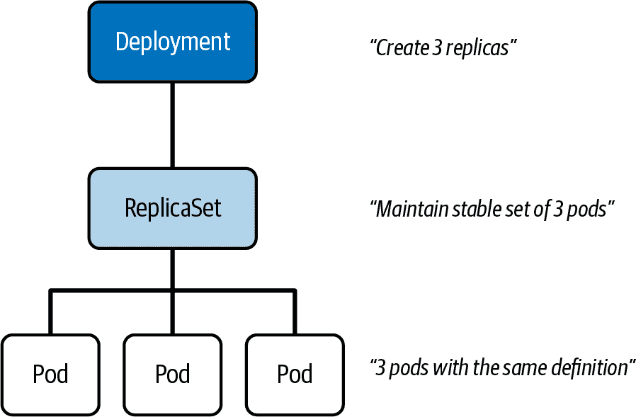
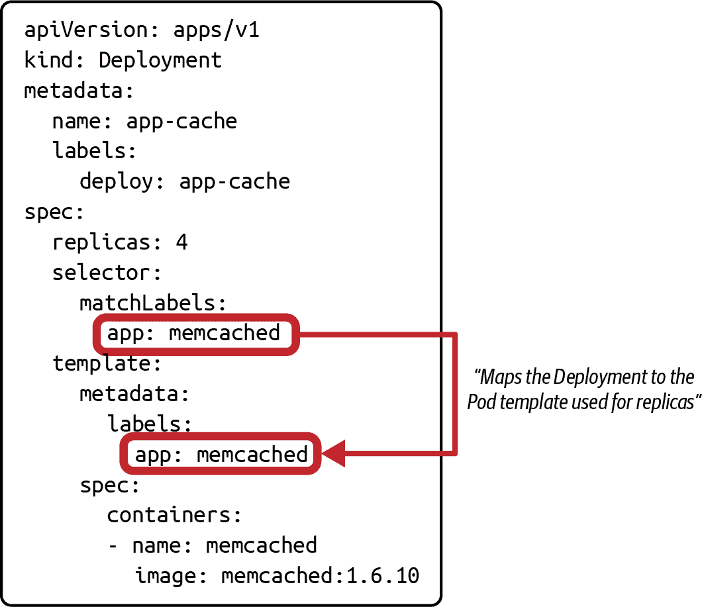
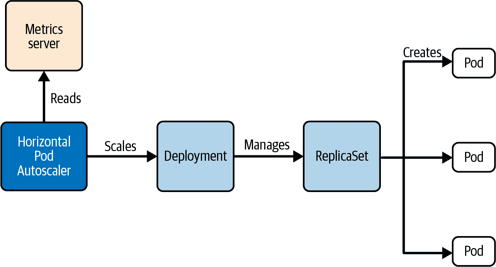
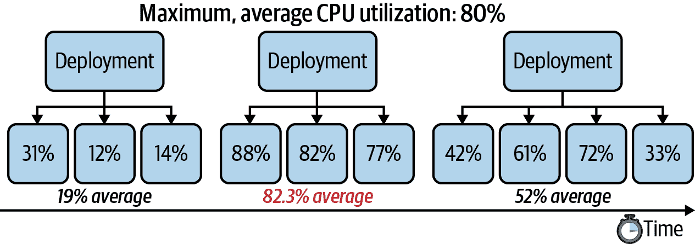

# 第十章：部署

Kubernetes 的一个重要卖点是其可伸缩性和复制功能。为支持这些功能，Kubernetes 提供了部署原语。在本章中，我们将展示如何创建部署以多个副本进行扩展，如何推出应用程序的修订版本，如何回滚到以前的修订版本，以及如何使用自动扩展器根据当前工作负载自动处理扩展问题。

# 处理部署

在容器中运行应用程序的基本单位是 Pod。使用单个 Pod 实例来运行应用程序存在缺陷——它代表了一个单点故障，因为所有针对应用程序的流量都会汇集到这个 Pod。当负载增加时，这种行为特别有问题（例如，在电子商务应用程序的高峰购物季节期间，或者当越来越多的微服务与集中的微服务功能（例如认证提供程序）进行通信时）。

在 Pod 中运行应用程序的另一个重要方面是容错性。调度器集群组件不会在节点故障的情况下重新调度 Pod，这可能会导致终端用户的系统中断。在本章中，我们将讨论支持应用程序可伸缩性和容错性的 Kubernetes 机制。

*复本集* 是 Kubernetes API 资源，控制运行应用程序的多个相同 Pod 实例，即所谓的副本。它具有根据需求增加或减少副本数量的能力。此外，它还知道如何在所有副本中推出应用程序的新版本。

*部署* 抽象了复本集的功能并在内部进行管理。在实践中，这意味着您不必自己创建、修改或删除复本集对象。部署保留应用程序版本的历史记录，并可以回滚到旧版本以应对生产问题的阻塞或潜在成本问题。此外，它还能够扩展副本的数量。

图 10-1 描述了部署、复本集及其控制副本之间的关系。



###### 图 10-1\. 部署和复本集之间的关系

接下来的几节将解释如何管理部署，包括扩展和推出功能。

## 创建部署

您可以使用命令 `create deployment` 创建部署。该命令提供一系列选项，其中一些是强制性的。至少，您需要提供部署的名称和容器镜像。部署将此信息传递给复本集，复本集使用它来管理副本。创建的默认副本数量为 1；但是，您可以使用选项 `--replicas` 定义更高数量的副本。

让我们观察该命令的执行。以下命令创建名为`app-cache`的 Deployment，在其中运行容器内的对象缓存[Memcached](https://memcached.org)的四个副本：

```
$ kubectl create deployment app-cache --image=memcached:1.6.8 --replicas=4
deployment.apps/app-cache created

```

Deployment 与其控制的副本之间的映射通过标签选择发生。当您运行命令时，`kubectl`会为您设置映射关系。示例 10-1 显示了 YAML 清单中的标签选择。该 YAML 清单可用于声明性地创建部署或通过检查由先前命令创建的实时对象来使用。

##### 示例 10-1\. Deployment 的 YAML 清单

```
apiVersion: apps/v1
kind: Deployment
metadata:
  name: app-cache
  labels:
    app: app-cache
spec:
  replicas: 4
  selector:
    matchLabels:
      app: app-cache
  template:
    metadata:
      labels:
        app: app-cache
    spec:
      containers:
      - name: memcached
        image: memcached:1.6.8
```

在由命令创建时，`app`是 Deployment 默认使用的标签键。您可以在 YAML 输出的三个不同位置找到此键：

1.  `metadata.labels`

1.  `spec.selector.matchLabels`

1.  `spec.template.metadata.labels`

为了使标签选择正常工作，`spec.selector.matchLabels`和`spec.template.metadata`的分配需要匹配，如图 10-2 所示。

`metadata.labels`的值对于将 Deployment 映射到 Pod 模板是不相关的。如图所示，将`metadata.labels`的标签分配更改为`deploy: app-cache`是有意的，以突出显示对 Deployment 到 Pod 模板选择的重要性。



###### 图 10-2\. Deployment 标签选择

## 列出 Deployments 及其 Pods

您可以通过使用`get deployments`命令检查部署后的部署。命令的输出显示了其副本的重要细节，如下所示：

```
$ kubectl get deployments
NAME        READY   UP-TO-DATE   AVAILABLE   AGE
app-cache   4/4     4            4           125m

```

与由 Deployment 控制的副本相关的列标题显示在表格 10-1 中。

表 10-1\. 列出部署时的运行时副本信息

| Column Title | Description |
| --- | --- |
| READY | 以<ready>/<desired>格式列出最终用户可用的副本数。期望副本数对应于`spec.replicas`的值。 |
| UP-TO-DATE | 列出已更新以实现期望状态的副本数。 |
| AVAILABLE | 列出最终用户可用的副本数。 |

您可以通过它们的命名前缀识别由 Deployment 控制的 Pods。在先前创建的 Deployment 中，Pods 的名称以`app-cache-`开头。在创建时，生成的哈希会自动附加到名称后面：

```
$ kubectl get pods
NAME                         READY   STATUS    RESTARTS   AGE
app-cache-596bc5586d-84dkv   1/1     Running   0          6h5m
app-cache-596bc5586d-8bzfs   1/1     Running   0          6h5m
app-cache-596bc5586d-rc257   1/1     Running   0          6h5m
app-cache-596bc5586d-tvm4d   1/1     Running   0          6h5m

```

## 渲染 Deployment 详细信息

您可以渲染 Deployment 的详细信息。这些详细信息包括标签选择标准，在排除部署配置错误时可能非常有价值。以下输出提供了完整的要点：

```
$ kubectl describe deployment app-cache
Name:                   app-cache
Namespace:              default
CreationTimestamp:      Sat, 07 Aug 2021 09:44:18 -0600
Labels:                 app=app-cache
Annotations:            deployment.kubernetes.io/revision: 1
Selector:               app=app-cache
Replicas:               4 desired | 4 updated | 4 total | 4 available | \
                        0 unavailable
StrategyType:           RollingUpdate
MinReadySeconds:        0
RollingUpdateStrategy:  25% max unavailable, 25% max surge
Pod Template:
  Labels:  app=app-cache
  Containers:
   memcached:
    Image:        memcached:1.6.10
    Port:         <none>
    Host Port:    <none>
    Environment:  <none>
    Mounts:       <none>
  Volumes:        <none>
Conditions:
  Type           Status  Reason
  ----           ------  ------
  Progressing    True    NewReplicaSetAvailable
  Available      True    MinimumReplicasAvailable
OldReplicaSets:  <none>
NewReplicaSet:   app-cache-596bc5586d (4/4 replicas created)
Events:          <none>
```

您可能已经注意到输出中包含对 ReplicaSet 的引用。ReplicaSet 的目的是*复制*一组相同的 Pod。您无需深入了解 ReplicaSet 的核心功能即可参加考试。只需知道部署会自动创建 ReplicaSet，并使用部署的名称作为 ReplicaSet 的前缀，类似于它控制的 Pods。对于名为 `app-cache` 的前一个部署，ReplicaSet 的名称为 `app-cache-596bc5586d`。

## 删除部署

部署完全负责创建和删除它控制的对象：Pod 和 ReplicaSet。当您删除一个部署时，相应的对象也会被删除。假设您正在处理输出中显示的以下一组对象：

```
$ kubectl get deployments,pods,replicasets
NAME                        READY   UP-TO-DATE   AVAILABLE   AGE
deployment.apps/app-cache   4/4     4            4           6h47m

NAME                             READY   STATUS    RESTARTS   AGE
pod/app-cache-596bc5586d-84dkv   1/1     Running   0          6h47m
pod/app-cache-596bc5586d-8bzfs   1/1     Running   0          6h47m
pod/app-cache-596bc5586d-rc257   1/1     Running   0          6h47m
pod/app-cache-596bc5586d-tvm4d   1/1     Running   0          6h47m

NAME                                   DESIRED   CURRENT   READY   AGE
replicaset.apps/app-cache-596bc5586d   4         4         4       6h47m

```

运行 `delete deployment` 命令以级联删除其管理的对象：

```
$ kubectl delete deployment app-cache
deployment.apps "app-cache" deleted
$ kubectl get deployments,pods,replicasets
No resources found in default namespace.

```

# 执行滚动更新和回滚

部署通过委托给它管理的 ReplicaSet(s) 来完全抽象滚动更新和回滚功能。一旦用户更改了部署中 Pod 模板的定义，它将创建一个新的 ReplicaSet，将更改应用于它控制的副本，然后关闭之前的 ReplicaSet。在这一部分，我们将讨论两种情况：部署应用程序的新版本和回滚到旧版本的应用程序。

## 更新部署的 Pod 模板

您可以从多种选项中选择，以更新由部署控制的副本的定义。这些选项都是有效的，但在使用和操作环境上有所不同。

在实际项目中，您应该将清单文件检入版本控制。然后，可以通过直接编辑文件来进行定义更改。`kubectl apply` 可以通过指向更改后的清单更新 live 对象：

```
$ kubectl apply -f deployment.yaml

```

命令 `kubectl edit` 允许您通过在编辑器中修改 live 对象的清单来交互式地更改 Pod 模板。要编辑名为 `web-server` 的部署 live 对象，请使用以下命令：

```
$ kubectl edit deployment web-server

```

命令 `kubectl set image` 只更改分配给 Pod 模板的容器映像，选择容器的名称。例如，您可以使用此命令将映像 `nginx:1.25.2` 分配给名为 `web-server` 的部署中名为 `nginx` 的容器：

```
$ kubectl set image deployment web-server nginx=nginx:1.25.2

```

`kubectl replace` 命令允许您使用包含对清单更改的新定义替换现有的部署。可选的 `--force` 标志首先删除现有对象，然后从头开始创建。以下命令假定您在 `deployment.yaml` 中更改了容器映像分配：

```
$ kubectl replace -f deployment.yaml

```

命令 `kubectl patch` 要求您以补丁的形式提供合并，以更新部署。以下命令展示了操作的过程。在这里，您以 JSON 结构的形式发送要进行的更改：

```
$ kubectl patch deployment web-server -p '{"spec":{"template":{"spec":\
{"containers":[{"name":"nginx","image":"nginx:1.25.2"}]}}}}'

```

## 推出新版本

Deployment 使得向其控制的所有副本部署新版本的应用程序变得容易。假设您希望将 Memcached 的版本从 1.6.8 升级到 1.6.10 以获得最新功能和错误修复。您只需通过更新 Pod 模板更改对象的期望状态。Deployment 逐个将所有副本更新到新版本。这个过程称为 *滚动更新* 策略。

命令 `set image` 提供了一个快速、方便的方法来更改 Deployment 的图像，如下所示的命令：

```
$ kubectl set image deployment app-cache memcached=memcached:1.6.10
deployment.apps/app-cache image updated

```

您可以使用命令 `rollout status` 检查正在进行中的滚动更新的当前状态。输出指示自发出命令以来已更新的副本数量：

```
$ kubectl rollout status deployment app-cache
Waiting for rollout to finish: 2 out of 4 new replicas have been updated...
deployment "app-cache" successfully rolled out

```

Kubernetes 会在滚动历史中跟踪您对 Deployment 所做的更改。每个更改由一个 *修订版* 表示。当更改 Deployment 的 Pod 模板（例如通过更新图像）时，Deployment 会触发新的 ReplicaSet 的创建。Deployment 将逐步将 Pods 从旧 ReplicaSet 迁移到新 ReplicaSet。您可以通过运行以下命令来检查滚动历史记录。您将看到列出的两个修订版：

```
$ kubectl rollout history deployment app-cache
deployment.apps/app-cache
REVISION  CHANGE-CAUSE
1         <none>
2         <none>
```

第一个修订版记录了创建对象时 Deployment 的原始状态。第二个修订版是为更改图像标签而添加的。

###### 注意

默认情况下，Deployment 在其历史记录中持续保留最多 10 个修订版。您可以通过为 `spec.revisionHistoryLimit` 分配不同的值来更改此限制。

要获取修订版的更详细视图，请运行以下命令。您可以看到图像使用值 `memcached:1.6.10`：

```
$ kubectl rollout history deployments app-cache --revision=2
deployment.apps/app-cache with revision #2
Pod Template:
  Labels:	app=app-cache
	pod-template-hash=596bc5586d
  Containers:
   memcached:
    Image:	memcached:1.6.10
    Port:	<none>
    Host Port:	<none>
    Environment:	<none>
    Mounts:	<none>
  Volumes:	<none>
```

滚动更新策略确保应用程序始终对最终用户可用。此方法意味着在更新过程中会有两个版本的同一应用程序可用。作为应用程序开发者，您必须意识到便利并非没有潜在的副作用。如果您碰巧对应用程序的公共 API 引入了破坏性更改，可能会暂时破坏消费者，因为他们可能会访问应用程序的修订版 1 或 2。

您可以通过为属性 `spec.strategy.type` 提供不同的值来更改 Deployment 的默认更新策略；然而，请考虑其中的权衡。例如，值 `Recreate` 首先终止所有 Pods，然后创建具有最新修订版的新 Pods，可能会导致消费者的潜在停机时间。请参阅 第十一章 以获取常见部署策略的更详细描述。

## 为修订版添加更改原因

滚动历史显示列 `CHANGE-CAUSE`。您可以填写修订版的信息来记录 *为什么* 您引入了新更改或者 *使用了* 哪个 `kubectl` 命令来进行更改。

默认情况下，更改 Pod 模板不会自动记录变更原因。要为当前版本添加变更原因，请向 Deployment 对象添加具有保留键 `kubernetes.io/change-cause` 的注释。以下命令使用 `annotate` 命令分配变更原因“Image updated to 1.6.10”：

```
$ kubectl annotate deployment app-cache kubernetes.io/change-cause=\
"Image updated to 1.6.10"
deployment.apps/app-cache annotated

```

现在回滚历史记录会显示当前版本的变更原因值：

```
$ kubectl rollout history deployment app-cache
deployment.apps/app-cache
REVISION  CHANGE-CAUSE
1         <none>
2         Image updated to 1.6.10
```

## 回滚到以前的版本

在生产环境中可能会出现需要快速处理的问题。例如，您刚刚发布的容器镜像包含一个关键的 bug。Kubernetes 允许您在发布历史中回滚到以前的某个版本。您可以使用 `rollout undo` 命令来实现这一点。要选择特定版本，请提供命令行选项 `--to-revision`。如果不提供选项，该命令将回滚到上一个版本。在这里，我们正在回滚到版本 1：

```
$ kubectl rollout undo deployment app-cache --to-revision=1
deployment.apps/app-cache rolled back

```

因此，Kubernetes 对具有版本 1 的所有副本执行滚动更新。

# 回滚和持久数据

`rollout undo` 命令不会恢复与应用程序关联的任何持久数据。相反，它只是恢复到 ReplicaSet 的先前声明状态的新实例。

现在回滚历史记录显示版本 3。鉴于我们已经回滚到版本 1，没有必要保留该条目作为重复项。Kubernetes 简单地将版本 1 变为 3 并从列表中删除 1：

```
$ kubectl rollout history deployment app-cache
deployment.apps/app-cache
REVISION  CHANGE-CAUSE
2         Image updated to 1.16.10
3         <none>
```

# 扩展工作负载

扩展性是 Kubernetes 内置的能力之一。我们将学习如何在应用程序负载增加时手动扩展副本数量。此外，我们将讨论 API 资源 Horizontal Pod Autoscaler，它允许您根据 CPU 和内存等资源阈值自动扩展管理的 Pod 集。

## 手动扩展部署

扩展（增加或减少）由 Deployment 控制的副本数量是一个简单的过程。您可以使用 `edit deployment` 命令手动编辑活动对象，并更改 `spec.replicas` 属性的值，也可以使用命令式的 `scale deployment` 命令。在现实世界的生产环境中，您希望编辑 Deployment YAML 清单，将其检入版本控制，并应用更改。以下命令将副本数量从四个增加到六个：

```
$ kubectl scale deployment app-cache --replicas=6
deployment.apps/app-cache scaled

```

您可以使用 `-w` 命令行标志实时观察副本的创建过程。您将看到新创建的 Pod 的状态从 `ContainerCreating` 变为 `Running` 的变化：

```
$ kubectl get pods -w
NAME                         READY   STATUS              RESTARTS   AGE
app-cache-5d6748d8b9-6cc4j   1/1     ContainerCreating   0          11s
app-cache-5d6748d8b9-6rmlj   1/1     Running             0          28m
app-cache-5d6748d8b9-6z7g5   1/1     ContainerCreating   0          11s
app-cache-5d6748d8b9-96dzf   1/1     Running             0          28m
app-cache-5d6748d8b9-jkjsv   1/1     Running             0          28m
app-cache-5d6748d8b9-svrxw   1/1     Running             0          28m

```

手动扩展副本数量需要一些猜测工作。您仍然需要监视系统的负载，以查看您的副本数量是否足以处理传入的流量。

## 自动扩展部署

另一种缩放部署的方法是借助水平 Pod 自动伸缩器（HPA）。HPA 是一个 API 原语，定义了在特定条件下自动调整副本数量的规则。常见的缩放条件包括目标值、平均值或特定指标（例如 CPU 和/或内存）的平均利用率。更多信息请参阅 [MetricTarget API](https://kubernetes.io/docs/reference/generated/kubernetes-api/v1.28/#metrictarget-v2-autoscaling)。

假设您想定义 CPU 利用率的平均 CPU 作为缩放条件。在运行时，HPA 检查由 [metrics server](https://oreil.ly/Lmamb) 收集的指标，以确定部署的所有副本的平均最大 CPU 或内存使用是否低于或高于定义的阈值。确保在集群中安装了 metrics server。安装组件后，收集指标可能需要几分钟时间。有关更多信息，请参阅 “Inspecting Resource Metrics”。

图 10-3 展示了涉及 HPA 的概述架构图。



###### 图 10-3\. 自动缩放部署

## 创建水平 Pod 自动伸缩器

图 10-4 显示了一个 HPA 的使用情况，如果所有由部署控制的可用 Pod 的平均 CPU 利用率达到 80%，将扩展副本数量。



###### 图 10-4\. 自动缩放部署的水平扩展

您可以使用`autoscale deployment`命令为现有部署创建一个 HPA。选项`--cpu-percent`定义了平均最大 CPU 使用阈值。在撰写本文时，该命令并未提供用于定义平均最大内存利用率阈值的选项。选项`--min`和`--max`分别提供了要缩减到的最小副本数量以及 HPA 可以创建以处理增加负载的最大副本数量：

```
$ kubectl autoscale deployment app-cache --cpu-percent=80 --min=3 --max=5
horizontalpodautoscaler.autoscaling/app-cache autoscaled

```

这个命令是创建部署的 HPA 的一个很好的快捷方式。HPA 对象的 YAML 清单表示看起来像是 示例 10-2。

##### 示例 10-2\. HPA 的 YAML 清单

```
apiVersion: autoscaling/v2
kind: HorizontalPodAutoscaler
metadata:
  name: app-cache
spec:
  scaleTargetRef:
    apiVersion: apps/v1
    kind: Deployment
    name: app-cache
  minReplicas: 3
  maxReplicas: 5
  metrics:
  - resource:
      name: cpu
      target:
        averageUtilization: 80
        type: Utilization
    type: Resource
```

## 列出水平 Pod 自动伸缩器

水平 Pod 自动伸缩器的简写命令是 `hpa`。透明列出所有 HPA 对象描述了它们当前的状态：此时的 CPU 利用率和副本数量：

```
$ kubectl get hpa
NAME        REFERENCE              TARGETS         MINPODS   MAXPODS   REPLICAS \
  AGE
app-cache   Deployment/app-cache   <unknown>/80%   3         5         4        \
  58s
```

如果部署的 Pod 模板未定义 CPU 资源要求，或者无法从指标服务器检索 CPU 指标，则“目标”列的左侧值显示为 <unknown>。示例 10-3 设置了 Pod 模板的资源要求，以便 HPA 可正常工作。您可以在 “使用资源要求” 中了解更多有关定义资源要求的信息。

##### 示例 10-3\. 为 Pod 模板设置 CPU 资源要求

```
# ...
spec:
  # ...
  template:
    # ...
    spec:
      containers:
      - name: memcached
        # ...
        resources:
          requests:
            cpu: 250m
          limits:
            cpu: 500m
```

一旦流量到达副本，当前的 CPU 使用率将显示为百分比。这里的平均最大 CPU 利用率为 15%：

```
$ kubectl get hpa
NAME        REFERENCE              TARGETS   MINPODS   MAXPODS   REPLICAS   AGE
app-cache   Deployment/app-cache   15%/80%   3         5         4          58s
```

## 渲染水平 Pod 自动扩展器详细信息

HPA 的事件日志可以提供有关重新调整活动的额外见解。渲染 HPA 详细信息可以是监控何时扩展副本数以及其扩展条件的强大工具：

```
$ kubectl describe hpa app-cache
Name:                                                  app-cache
Namespace:                                             default
Labels:                                                <none>
Annotations:                                           <none>
CreationTimestamp:                                     Sun, 15 Aug 2021 \
                                                       15:54:11 -0600
Reference:                                             Deployment/app-cache
Metrics:                                               ( current / target )
  resource cpu on pods  (as a percentage of request):  0% (1m) / 80%
Min replicas:                                          3
Max replicas:                                          5
Deployment pods:                                       3 current / 3 desired
Conditions:
  Type            Status  Reason            Message
  ----            ------  ------            -------
  AbleToScale     True    ReadyForNewScale  recommended size matches current size
  ScalingActive   True    ValidMetricFound  the HPA was able to successfully \
  calculate a replica count from cpu resource utilization (percentage of request)
  ScalingLimited  True    TooFewReplicas    the desired replica count is less \
  than the minimum replica count
Events:
  Type    Reason             Age   From                       Message
  ----    ------             ----  ----                       -------
  Normal  SuccessfulRescale  13m   horizontal-pod-autoscaler  New size: 3; \
  reason: All metrics below target
```

## 定义多个扩展度量

您可以将多个资源类型定义为扩展度量。如 示例 10-4 所示，我们正在检查 CPU 和内存利用率，以确定是否需要扩展或缩小部署的副本。

##### 示例 10-4\. 具有多个指标的 HPA 的 YAML 清单

```
apiVersion: autoscaling/v2
kind: HorizontalPodAutoscaler
metadata:
  name: app-cache
spec:
  scaleTargetRef:
    apiVersion: apps/v1
    kind: Deployment
    name: app-cache
  minReplicas: 3
  maxReplicas: 5
  metrics:
  - type: Resource
    resource:
      name: cpu
      target:
        type: Utilization
        averageUtilization: 80
  - type: Resource
    resource:
      name: memory
      target:
        type: AverageValue
        averageValue: 500Mi
```

为了确保 HPA 确定当前使用的资源，我们还将为 Pod 模板设置内存资源要求，如 示例 10-5 所示。

##### 示例 10-5\. 为 Pod 模板设置内存资源要求

```
...
spec:
  ...
  template:
    ...
    spec:
      containers:
      - name: memcached
        ...
        resources:
          requests:
            cpu: 250m
            memory: 100Mi
          limits:
            cpu: 500m
            memory: 500Mi
```

列出 HPA 时会显示“目标”列中的两个指标，如此处显示的 `get` 命令的输出：

```
$ kubectl get hpa
NAME        REFERENCE              TARGETS                 MINPODS   MAXPODS \
  REPLICAS   AGE
app-cache   Deployment/app-cache   1994752/500Mi, 0%/80%   3         5       \
  3          2m14s
```

# 摘要

部署是 Kubernetes 提供声明性更新和 Pod 生命周期管理的基本原语。ReplicaSet 执行管理这些 Pod（通常称为副本）的繁重工作。应用程序开发人员无需直接与 ReplicaSet 交互；部署在幕后管理 ReplicaSet。

部署可以轻松地推出和回滚由容器中运行的镜像表示的应用程序的修订版。在本章中，您学习了控制修订历史及其操作的命令。手动扩展部署需要深入了解应用程序的需求和负载。水平 Pod 自动扩展器可以根据运行时观察到的 CPU 和内存阈值自动扩展副本的数量。

# 考试要点

详细了解部署的各个方面

考虑到部署在 Kubernetes 中是一个如此核心的原语，您可以期待考试将在此方面对您进行测试。了解如何创建部署并学习如何扩展到多个副本。部署的一个卓越特性是其新修订的推出功能。练习如何推出新的修订版，检查推出历史记录，并回滚到先前的修订版。

理解使用水平 Pod Autoscaler 的影响

由 Deployment 控制的副本数量可以使用 Horizontal Pod Autoscaler（HPA）进行缩放。HPA 定义资源（如 CPU 和内存）的阈值，告诉对象需要进行缩放事件。重要的是要了解，只有在安装度量服务器组件并为容器定义资源请求和限制时，HPA 才能正常工作。

# 示例练习

这些练习的解决方案在附录 A 中提供。

1.  创建名为`nginx`的 Deployment，有 3 个副本。Pod 应使用`nginx:1.23.0`镜像，名称为`nginx`。Deployment 使用标签`tier=backend`。Pod 模板应使用标签`app=v1`。

    列出 Deployment 并确保正在运行正确数量的副本。

    将镜像更新为`nginx:1.23.4`。

    验证变更已部署到所有副本。

    将变更原因“拾取补丁版本”分配给修订版本。

    将 Deployment 缩放到 5 个副本。

    查看 Deployment 的部署历史。将 Deployment 回滚到修订版本 1。

    确保 Pod 使用镜像`nginx:1.23.0`。

1.  创建名为`nginx`的 Deployment，有 1 个副本。Deployment 的 Pod 模板应使用容器镜像`nginx:1.23.4`；将 CPU 资源请求设置为 0.5，内存资源请求/限制设置为 500Mi。

    为名为`nginx-hpa`的 Deployment 创建 HorizontalPodAutoscaler，其最小缩放到 3 个副本，最大缩放到 8 个副本。缩放应基于平均 CPU 利用率 75%和平均内存利用率 60%。

    检查 HorizontalPodAutoscaler 对象并确定当前使用的资源。您期望存在多少副本？
