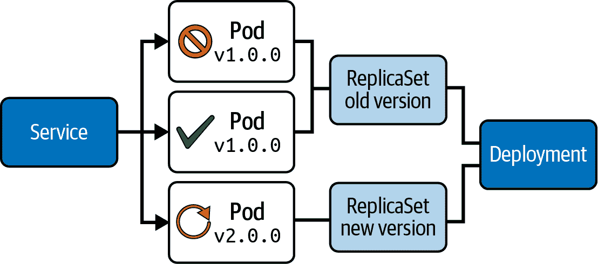
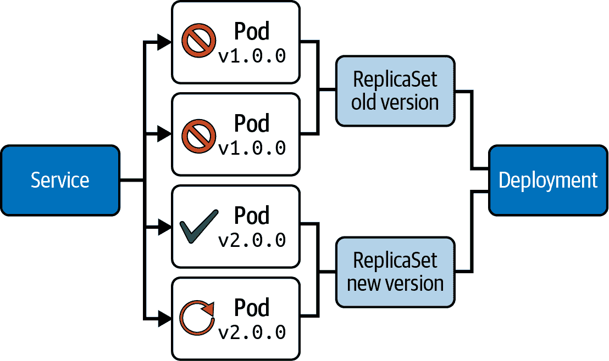
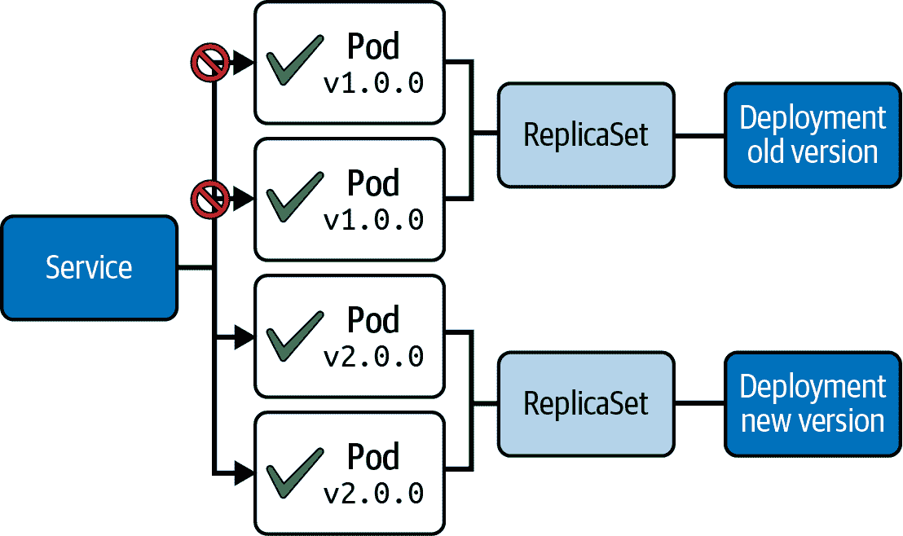
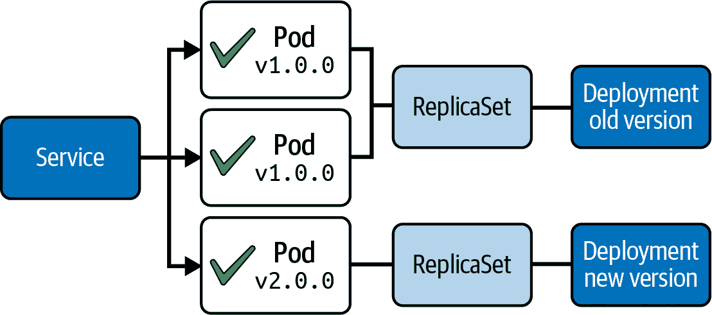

# 第十一章：部署策略

将一个应用程序（打包到容器镜像中）部署到一个或多个 Pods 中只是其在 Kubernetes 集群中生命周期的开始。开发人员会定期生成和发布新的容器镜像标签，以发布 bug 修复和新功能。逐一手动更新 Pods 到新的容器镜像标签将是极其繁琐的。Kubernetes 提供了部署原语来简化这一过程。

第十章 解释了如何使用部署原语自动推出新版本。在本章中，我们将讨论原语支持的内置部署策略。我们还将讨论其他需要刻意人为决策的部署策略。每种部署策略都配有一个示例，展示其优点和可能的权衡。还存在更多部署策略，但本书不涉及这些内容。

###### 注意

某些部署策略需要使用尚未讨论的概念。跳转至 第十四章 了解容器探测的覆盖范围。参考 第二十一章 以获取有关服务目的的更多信息。

# 滚动部署策略

部署原语默认采用滚动部署策略，也称为逐步部署。称之为“逐步”，是因为部署逐渐将副本从旧版本过渡到新版本的批次中。用户更新 Pod 模板后，部署会自动为所需更改创建新的 ReplicaSet。

图 11-1 显示了在部署过程中时间点的快照。



###### 图 11-1 滚动部署策略

在这种情况下，用户启动了从版本 1.0.0 到 2.0.0 的应用程序版本更新。因此，部署创建了一个新的 ReplicaSet，并启动运行新应用程序版本的 Pods，同时缩减旧版本。服务将网络流量路由到应用程序的旧版或新版。

## 实施

默认情况下，部署使用滚动更新策略。属性 `spec.strategy.type` 的运行时值为 `RollingUpdate`。用户可以微调此策略。您可以使用属性 `spec.strategy.rollingUpdate.maxUnavailable` 和 `spec.strategy.rollingUpdate.maxSurge` 来改变发布速率。这两个属性可以使用固定整数（例如，3）或分配所需 Pods 总数的百分比（例如，33%）。`maxUnavailable` 和 `maxSurge` 的默认值为 25%。

属性 `maxUnavailable` 指定在更新过程中可以不可用的最大 Pods 数量。例如，如果将值设置为 40%，则旧 ReplicaSet 在滚动更新开始时可以立即缩减到 60%。

属性 `maxSurge` 指定了可以在所需 Pods 的最大数量之上创建的 Pods 的最大数量。例如，如果设置为 10%，则新旧 Pods 的总数在新 ReplicaSet 创建后不能超过 110%。

无论为属性 `maxUnavailable` 和 `maxSurge` 分配了什么值，由旧 ReplicaSet 控制的所有副本都将逐渐关闭到 0，直到由新 ReplicaSet 控制的所有副本等于 `spec.replicas` 的值。

建议为 Pod 模板定义就绪探测器，以确保副本能够处理传入请求。属性 `spec.minReadySeconds` 指定了副本在可以处理传入请求之前需要处于可用状态的秒数。

示例 11-1 展示了在 *deployment-rolling-update.yaml* 文件中存储的完整 Deployment YAML 清单的使用情况。

##### 示例 11-1\. 使用滚动更新策略配置的 Deployment

```
apiVersion: apps/v1
kind: Deployment
metadata:
  name: web-server
spec:
  replicas: 4
  strategy:
    type: RollingUpdate
    rollingUpdate:
      maxUnavailable: 40%   
      maxSurge: 10%         
  minReadySeconds: 60       
  selector:
    matchLabels:
      app: httpd
  template:
    metadata:
      labels:
        app: httpd
    spec:
      containers:
      - name: httpd
        image: httpd:2.4.23-alpine
        ports:
        - containerPort: 80
          protocol: TCP
        readinessProbe:     
          httpGet:
            path: /
            port: 80
```


在更新期间可以不可用的 Pod 的百分比。


可以暂时超出总副本数的 Pods 的百分比。


Pod 中的就绪探测器必须在健康状态下运行多少秒，以便继续执行部署过程。


所有副本的就绪探测与 `spec.minReadySeconds` 相关。

分配给 `maxUnavailable` 和 `maxSurge` 的值的组合决定了部署的运行时行为和速度。您可以调整这些参数，以找到最适合您的应用程序的组合。

## 用例和权衡

滚动部署是一个适合零停机时间推出新应用版本的部署策略。根据 Deployment 管理的副本数量不同，这个过程可能相对较慢，因为旧版本的应用逐步关闭，而新版本的应用则分批逐步启动。

需要注意的是，这种部署策略存在潜在的风险。旧版本和新版本的应用并行运行。如果新版本引入了破坏性变更，消费者如果未能将客户端软件适应最新更改，可能会遇到意外且难以调试的错误。推荐以向后兼容的方式推出新应用版本，例如通过使用有版本的 API，以避免出现这种情况。

# 固定部署策略

固定部署策略会立即终止旧应用版本的副本，然后创建另一个控制新应用版本副本的 ReplicaSet。

Figure 11-2 描述了从应用程序版本 1.0.0 更新 Pod 模板到 2.0.0 的发布过程。所有旧 ReplicaSet 的副本将同时关闭。然后，由新 ReplicaSet 控制的副本将启动。在此过程中，服务可能无法访问任何副本，这可能会导致消费者的不必要停机时间。



###### 图 11-2\. 固定的部署策略

## 实现

要为 Deployment 配置固定的部署策略，将属性 `spec.strategy.type` 设置为 `Recreate`。在内部，这种策略类型会自动将总副本数分配给属性 `maxUnavailable`。不需要提供其他配置选项。

Example 11-2 展示了在 *deployment-fixed.yaml* 文件中存储的完整 Deployment YAML 清单上下文中的 `Recreate` 策略类型。

##### 示例 11-2\. 使用固定部署策略配置的 Deployment

```
apiVersion: apps/v1
kind: Deployment
metadata:
  name: web-server
spec:
  replicas: 4
  strategy:
    type: Recreate   
  selector:
    matchLabels:
      app: httpd
  template:
    metadata:
      labels:
        app: httpd
    spec:
      containers:
      - name: httpd
        image: httpd:2.4.23-alpine
        ports:
        - containerPort: 80
          protocol: TCP
```


配置固定部署的策略类型。

为 Pod 模板定义的容器分配一个就绪探针并不是绝对必要的，因为所有旧应用版本的副本将同时关闭。尽管如此，在传入流量到达容器之前验证应用程序是否正常运行仍然是有意义的。

## 使用案例和权衡

固定的部署策略适用于可以接受应用程序停机时间的情况。例如，如果要将新应用程序部署到开发环境进行测试，这种策略非常适合。对于生产环境，如果向客户宣布了停机时间窗口，这种部署策略可能会起作用。

# 蓝绿部署策略

蓝绿部署策略（有时称为红黑部署策略）在象征上使用蓝色来表示旧应用程序版本，绿色来表示新应用程序版本。两个应用程序版本将同时运行，具有相同数量的副本。

Kubernetes 将流量路由到蓝部署，而开发或测试团队则部署和测试绿部署。一旦绿部署被认为达到了生产就绪状态，流量就会切换到绿部署。在这一点上，管理应用程序的团队可以停用蓝部署。

Figure 11-3 展示了管理具有不同应用程序版本副本的两个 Deployment。服务可以通过更改标签选择来将网络流量从旧应用程序版本切换到新应用程序版本。



###### 图 11-3\. 蓝绿部署策略

## 实现

蓝绿部署不是您可以在部署资源中配置的内置策略。您将需要为两个应用程序版本创建一个部署对象。该服务将流量路由到由蓝色或绿色部署管理的副本。

示例 11-3 展示了存储在文件 *deployment-blue.yaml* 中的蓝色部署 YAML 清单，指定 Pod 模板中的容器镜像 `httpd:2.4.23-alpine`。

##### 示例 11-3\. 蓝色部署

```
apiVersion: apps/v1
kind: Deployment
metadata:
  name: web-server-blue
spec:
  replicas: 4
  selector:
    matchLabels:
      type: blue
  template:
    metadata:
      labels:
        type: blue                   
    spec:
      containers:
      - name: httpd
        image: httpd:2.4.23-alpine   
        ports:
        - containerPort: 80
          protocol: TCP
```


使用标签分配 `type: blue` 到由相应 ReplicaSet 管理的任何副本。


旧的应用程序版本 `2.4.23-alpine`。

要设置一个运行较新容器镜像 `httpd:2.4.57-alpine` 的绿色部署，只需创建另一个部署对象。请注意，用于 Pod 模板的标签与蓝色部署不同。示例 11-4 展示了文件 *deployment-green.yaml* 中绿色部署的定义。

##### 示例 11-4\. 绿色部署

```
apiVersion: apps/v1
kind: Deployment
metadata:
  name: web-server-green
spec:
  replicas: 4
  selector:
    matchLabels:
      type: green
  template:
    metadata:
      labels:
        type: green                  
    spec:
      containers:
      - name: httpd
        image: httpd:2.4.57-alpine   
        ports:
        - containerPort: 80
          protocol: TCP
```


使用标签分配 `type: green` 到由相应 ReplicaSet 管理的任何副本。


新的应用程序版本 `2.4.57-alpine`。

如前所述，服务是负责将网络流量路由到旧或新应用程序版本的 Kubernetes 对象。示例 11-5 展示了一个服务对象。

##### 示例 11-5\. 将流量路由到蓝色部署的服务

```
apiVersion: v1
kind: Service
metadata:
  name: web-server
spec:
  selector:
    type: blue   
  ports:
    - protocol: TCP
      port: 80
      targetPort: 80
```


指向由蓝色部署管理的副本的标签选择器。

当前的资源声明指向蓝色部署；要切换到绿色，只需将标签选择从 `type: blue` 更改为 `type: green`。在那时，您可以删除蓝色部署。

## 使用情况和权衡

蓝绿部署策略适用于需要在不影响消费者的情况下执行复杂升级的部署场景。如果升级需要数据迁移或者需要同时更改多个依赖软件组件，则可能出现这种情况。如果需要回滚到旧应用程序版本，则只需在服务中更改标签选择即可。

在这方面，值得一提的是，与其他部署策略相比，您将需要更多的硬件资源。如果您需要五个副本来运行旧的应用程序版本，那么对于新的应用程序版本，假设资源需求不会有所不同，您将需要相同数量的资源。

# 金丝雀部署策略

金丝雀部署策略类似于蓝绿部署；但是，您只会将新的应用程序版本提供给一部分消费者。通过这种方法，您可以实施新功能的 A/B 测试，或者需要收集消费者行为指标。根据定义的成功标准集，可以逐渐增加对新应用程序版本的流量。目标是完全关闭旧的应用程序版本。

图 11-4 显示服务如何将流量发送到两个应用程序版本。



###### 图 11-4\. 金丝雀部署策略

部署 1 控制应用程序版本 v1.0.0\. 部署 2 控制应用程序版本 v2.0.0\. 部署 1 和 2 在其 Pod 模板中使用相同的标签分配。服务选择由两个部署定义的标签键值对。

## 实施

在 Kubernetes 集群中，您可以使用部署对象来表示每个应用程序版本。通过将 `spec.replicas` 属性的值分配为比当前应用程序版本少的副本数，您可以推出新的应用程序版本。

下面的代码片段显示了控制旧应用程序版本的部署的截断定义：

```
kind: Deployment
spec:
  replicas: 4
  selector:
    matchLabels:
      app: httpd
```

对于新的应用程序版本，分配较少数量的副本：

```
kind: Deployment
spec:
  replicas: 1
  selector:
    matchLabels:
      app: httpd
```

确保旧版和新版应用程序版本的副本接收来自消费者的请求，需要在两个部署对象的分配的 Pod 模板标签上保持相同。确保服务选择这些标签，如此截断的服务定义中所示：

```
kind: Service
spec:
  selector:
    app: httpd   
```


选择分配给两个部署的标签。

## 用例和权衡

组织通常使用金丝雀部署策略来推出可能对系统性能产生影响的实验性功能或更改。您可以在仅向部分消费者提供新功能的同时评估成功标准。实施金丝雀部署通常需要的硬件资源比蓝绿部署少得多，因为具有新应用程序版本的副本数量要低得多。

# 摘要

部署是将软件更改提供给最终用户或程序的过程。您需要考虑两个方面：如何部署更改的过程和将网络流量路由到应用程序。根据用例、应用程序类型和权衡选择合适的部署策略。

使用部署原语，Kubernetes 本地支持两种部署策略：滚动部署和固定部署。由 `RollingUpdate` 策略指定的滚动部署逐步批量推出更改。通过 `Recreate` 策略配置的固定部署首先关闭旧的应用程序版本，然后启动新的应用程序版本。

可以通过创建第二个部署对象来设置蓝绿和金丝雀部署策略，该对象与旧版本并行管理新应用程序版本。然后，服务将网络流量路由到两个应用程序版本的副本（蓝绿），或者随着时间推移将消费者过渡到新应用程序版本（金丝雀）。

# 考试要点

了解如何配置部署原语本地的策略

考试可能会用不同的部署策略面对您。您需要了解如何实施最常见的策略以及如何修改现有的部署场景。学习如何配置部署原语中的内置策略及其用于调整运行时行为的选项。

练习多阶段部署策略

您可以使用部署和服务原语实施更复杂的部署场景。例如，蓝绿和金丝雀部署策略需要多阶段的部署过程。暴露您自己到实施技术和部署过程中的技巧。由 Kubernetes 社区提供的运营商，例如 [Argo Rollouts](https://argo-rollouts.readthedocs.io/en/stable/)，提供更复杂的部署策略的高级抽象。考试不要求您了解外部工具以实施部署策略。

# 样本练习

这些练习的解决方案可在 附录 A 中找到。

1.  您的一个队友创建了一个部署 YAML 文件清单，用于操作容器镜像 `grafana/grafana:9.5.9`。从 YAML 文件 `deployment-grafana.yaml` 创建部署对象：

    ```
    apiVersion: apps/v1
    kind: Deployment
    metadata:
      name: grafana
    spec:
      replicas: 6
      selector:
        matchLabels:
          app: grafana
      template:
        metadata:
          labels:
            app: grafana
        spec:
          containers:
          - image: grafana/grafana:9.5.9
            name: grafana
            ports:
            - containerPort: 3000
    ```

    您需要更新所有副本，使用容器镜像 `grafana/grafana:10.1.2`。确保批量每次两个副本进行滚动更新。确保定义了就绪探针。

1.  在这个练习中，您将设置蓝绿部署场景。首先创建初始（蓝色）部署，并通过服务公开它。稍后，您将创建第二个（绿色）部署，并切换流量。

    创建名为 `nginx-blue` 的部署，有 3 个副本。部署的 Pod 模板应使用容器镜像 `nginx:1.23.0` 并分配标签 `version=blue`。

    使用类型为 ClusterIP 的服务将部署暴露出来，命名为 `nginx`。将入口和出口端口映射到 80。选择标签为 `version=blue` 的 Pod。

    运行一个临时的 Pod，使用容器镜像 `alpine/curl:3.14`，使用 `curl` 调用服务。

    创建名为 `nginx-green` 的第二个部署，有 3 个副本。部署的 Pod 模板应使用容器镜像 `nginx:1.23.4` 并分配标签 `version=green`。

    更改服务的标签选择，以便将流量路由到由部署 `nginx-green` 控制的 Pod。

    删除名为 `nginx-blue` 的部署。

    运行一个临时 Pod，使用容器镜像 `alpine/curl:3.14` 对该服务进行调用。
