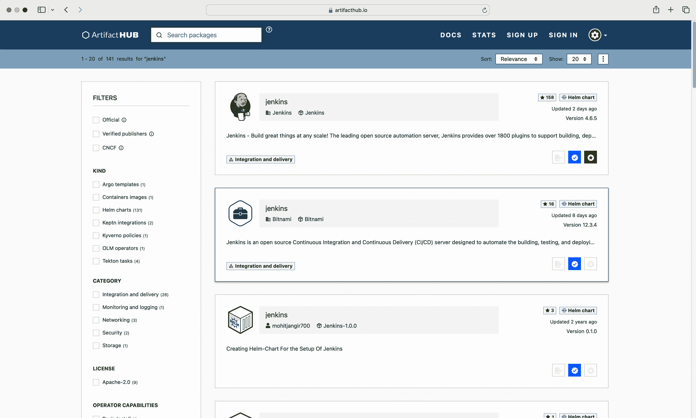
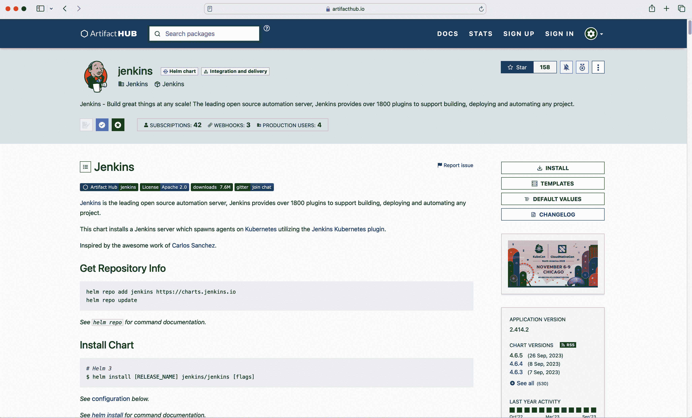
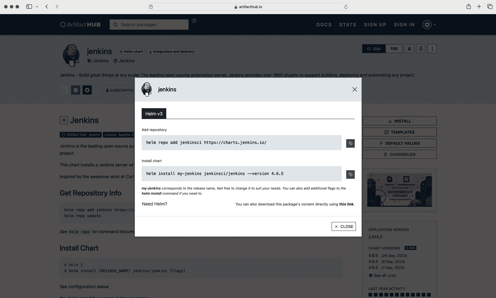
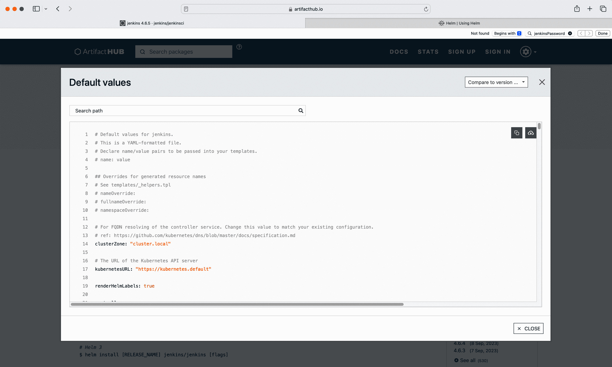

# 第十二章：Helm

[Helm](https://helm.sh) 是一种用于一组 Kubernetes 清单的模板引擎和包管理器。运行时，它将 YAML 模板文件中的占位符替换为实际的、最终用户定义的值。Helm 可执行文件生成的工件称为 *chart 文件*，打包了组成应用程序 API 资源的清单。您可以将 chart 文件上传到 *chart 仓库*，以便其他团队可以使用它来部署捆绑的清单。Helm 生态系统提供了广泛的可重用图表，用于常见用例，可以在 [Artifact Hub](https://artifacthub.io/) 上搜索（例如用于运行 Grafana 或 PostgreSQL）。

由于 Helm 提供了丰富的功能，我们仅讨论基础知识。考试不要求您成为 Helm 专家；相反，它希望您熟悉使用 Helm 安装现有包的工作流程。构建和发布自己的图表超出了考试范围。有关 Helm 的更详细信息，请参阅 [用户文档](https://helm.sh/docs)。本文档描述的 Helm 功能版本为 3.13.0。

# 管理现有的图表

作为开发人员，您希望重用现有的功能，而不是花时间定义和配置它。例如，您可能希望在集群上安装开源监控服务 Prometheus。

Prometheus 需要安装多个 Kubernetes 原语。幸运的是，Kubernetes 社区提供了一个 Helm 图表，使得安装和配置所有组件变得非常简单，形成了一个 [Kubernetes operator](https://kubernetes.io/docs/concepts/extend-kubernetes/operator/)。

以下列表显示了消费和管理 Helm 图表的典型工作流程。大多数步骤需要使用 `helm` 可执行文件：

1.  确定您想要安装的图表

1.  添加包含图表的仓库

1.  从仓库安装图表

1.  验证已安装的 Kubernetes 对象。

1.  渲染已安装图表的列表

1.  升级已安装的图表

1.  如果不再需要其功能，可以卸载图表。

以下各节将解释每个步骤。

## 确定图表

多年来，Kubernetes 社区实施并发布了成千上万个 Helm 图表。Artifact Hub 提供了基于关键字搜索的网络搜索功能，用于发现图表。

假设您想要查找一个安装持续集成解决方案 Jenkins 的图表。您只需在搜索框中输入术语“jenkins”并按回车键即可。Figure 12-1 显示了 Artifact Hub 中的结果列表。



###### 图 12-1。在 Artifact Hub 上搜索 Jenkins 图表

在撰写本文时，搜索条件匹配了 141 项结果。你将能够通过点击搜索结果中的任一项来查看有关图表的详细信息，包括高层描述和包含图表文件的仓库。此外，你还可以检查与图表文件捆绑在一起的模板，显示安装后将创建的对象及其配置选项。图 12-2 显示了官方 Jenkins 图表的页面。



###### 图 12-2\. Jenkins 图表详情

你不能直接从 Artifact Hub 安装图表。你必须从托管图表文件的仓库安装它。

## 添加图表仓库

图表描述可能会提及托管图表文件的仓库。或者，你也可以点击“安装”按钮以渲染仓库详情及添加它的命令。图 12-3 显示了点击“安装”按钮后出现的上下文弹出窗口。

默认情况下，Helm 安装不定义任何外部仓库。以下命令显示如何列出所有注册的仓库。当前尚未注册任何仓库：

```
$ helm repo list
Error: no repositories to show

```



###### 图 12-3\. Jenkins 图表安装说明

正如你从截图中所见，图表文件存储在带有网址 [*https://charts.jenkins.io*](https://charts.jenkins.io) 的仓库中。我们需要添加这个仓库。这是一次性的操作。你可以从该仓库安装其他图表，或者使用我们将在后面讨论的命令更新源自该仓库的图表。

当注册一个仓库时，需要为其提供一个名称。尽可能使仓库名称描述性强。以下命令使用名称 `jenkinsci` 注册了该仓库：

```
$ helm repo add jenkinsci https://charts.jenkins.io/
"jenkinsci" has been added to your repositories

```

现在列出的仓库显示了名称和 URL 之间的映射关系：

```
$ helm repo list
NAME        URL
jenkinsci   https://charts.jenkins.io/

```

你已经将仓库永久性地添加到了 Helm 安装中。

## 在仓库中搜索图表

“安装”弹出窗口已经提供了安装图表的命令。如果你不知道图表的名称或最新版本，也可以在该仓库中搜索可用的图表。添加 `--versions` 标志以列出所有可用版本：

```
$ helm search repo jenkinsci
NAME                CHART VERSION   APP VERSION   DESCRIPTION
jenkinsci/jenkins   4.6.5           2.414.2       ...

```

当前可用的最新版本是 4.6.5\. 如果你在自己的机器上运行该命令，可能会得到不同的版本，因为 Jenkins 项目可能已发布了更新版本。

## 安装图表

假设最新版本的 Helm 图表存在安全漏洞。因此，我们决定安装 Jenkins 图表的前一个版本，即 4.6.4\. 你需要分配一个名称以便识别已安装的图表。这里我们将使用 `my-jenkins` 作为名称：

```
$ helm install my-jenkins jenkinsci/jenkins --version 4.6.4
NAME: my-jenkins
LAST DEPLOYED: Thu Sep 28 09:47:21 2023
NAMESPACE: default
STATUS: deployed
REVISION: 1
NOTES:
...

```

该图表会自动在 `default` 命名空间中创建 Kubernetes 对象。你可以使用以下命令发现最重要的资源类型：

```
$ kubectl get all
NAME               READY   STATUS    RESTARTS   AGE
pod/my-jenkins-0   2/2     Running   0          12m

NAME                       TYPE        CLUSTER-IP       EXTERNAL-IP    ...
service/my-jenkins         ClusterIP   10.99.166.189    <none>         ...
service/my-jenkins-agent   ClusterIP   10.110.246.141   <none>         ...

NAME                          READY   AGE
statefulset.apps/my-jenkins   1/1     12m

```

该图表已使用默认配置选项安装。您可以通过单击图表页面上的“默认值”按钮查看这些默认值，如图 12-4 所示。



###### 图 12-4\. Jenkins 图表默认值

您还可以使用以下命令发现这些配置选项。显示的输出仅渲染了一部分值，即`controller.adminUser`和`controller.adminPassword`分别表示管理员用户名和其密码：

```
$ helm show values jenkinsci/jenkins
...
controller:
  # When enabling LDAP or another non-Jenkins identity source, the built-in \
  # admin account will no longer exist.
  # If you disable the non-Jenkins identity store and instead use the Jenkins \
  # internal one,
  # you should revert controller.adminUser to your preferred admin user:
  adminUser: "admin"
  # adminPassword: <defaults to random>
...

```

在安装图表时，您可以自定义任何配置值。要在安装过程中传递配置数据，请使用以下标志之一：

+   `--values`：以指向 YAML 清单文件的指针形式指定覆盖项。

+   `--set`：直接从命令行指定覆盖。

有关更多信息，请参见[Helm 文档中的“在安装之前自定义图表”](https://helm.sh/docs/intro/using_helm/#customizing-the-chart-before-installing)。

您可以决定将图表安装到自定义命名空间中。使用`-n`标志提供现有命名空间的名称。如果命名空间尚不存在，则添加`--create-namespace`标志将自动创建命名空间。

以下命令显示如何在安装过程中自定义一些值和使用的命名空间：

```
$ helm install my-jenkins jenkinsci/jenkins --version 4.6.4 \
--set controller.adminUser=boss --set controller.adminPassword=password \
-n jenkins --create-namespace

```

我们特别为管理员用户设置了用户名和密码。Helm 将由图表控制的对象创建到`jenkins`命名空间中。

## 列出已安装的图表

图表可以存在于`default`命名空间或自定义命名空间中。您可以使用`helm list`命令检查已安装图表的列表。如果不知道使用哪个命名空间，只需将`--all-namespaces`标志添加到命令中即可：

```
$ helm list --all-namespaces
NAME         NAMESPACE   REVISION   UPDATED         STATUS     CHART
my-jenkins   default     1          2023-09-28...   deployed   jenkins-4.6.4

```

命令的输出包括列`NAMESPACE`，显示特定图表使用的命名空间。类似于使用`kubectl`，`helm list`命令提供了选项`-n`来指定命名空间。如果命令不附带任何标志，则返回`default`命名空间的结果。

## 升级已安装的图表

升级已安装的图表通常意味着转移到新的图表版本。您可以通过运行以下命令来轮询存储库中提供的新版本：

```
$ helm repo update
Hang tight while we grab the latest from your chart repositories...
...Successfully got an update from the "jenkinsci" chart repository
Update Complete. ⎈Happy Helming!⎈

```

如果要将现有的图表安装升级到新的图表版本，该如何操作？运行以下命令将图表升级到该特定版本并使用默认配置：

```
$ helm upgrade my-jenkins jenkinsci/jenkins --version 4.6.5
Release "my-jenkins" has been upgraded. Happy Helming!
...

```

与`install`命令一样，如果要在升级图表时调整图表的运行时行为，您将需要提供自定义配置值。

## 卸载图表

有时您不再需要运行图表。卸载图表的命令很简单，如下所示。它将删除由图表控制的所有对象。如果之前将图表安装到除`default`以外的命名空间中，请不要忘记提供`-n`标志：

```
$ helm uninstall my-jenkins
release "my-jenkins" uninstalled

```

执行该命令可能需要最多 30 秒，因为 Kubernetes 需要等待工作负载的优雅结束期。

# 概要

Helm 已发展成为将应用程序堆栈部署到 Kubernetes 的事实标准工具。包含清单文件、默认配置值和元数据的工件称为图表。团队或个人可以将图表发布到图表存储库。用户可以通过 Artifact Hub 用户界面发现已发布的图表，并将其安装到 Kubernetes 集群中。

使用 Helm 时，主要的开发者工作流程之一包括查找、安装和升级特定版本的图表。您可以通过注册包含要消费的图表文件的存储库来开始。`helm install` 命令会下载图表文件并将其存储在本地缓存中。它还会创建图表描述的 Kubernetes 对象。

安装过程是可配置的。开发者可以提供自定义配置值的覆盖。`helm upgrade` 命令允许您升级已安装图表的版本。要卸载图表并删除图表管理的所有 Kubernetes 对象，请运行 `helm uninstall` 命令。

# 考试要点

假设 Helm 可执行文件已预安装

不幸的是，[考试 FAQ](https://docs.linuxfoundation.org/tc-docs/certification/faq-cka-ckad-cks) 没有提及 Helm 可执行文件或预期的 Helm 版本的任何细节。可以合理地假设它将为您预安装，因此您无需记忆安装说明。您将能够浏览 [Helm 文档页面](https://helm.sh/docs)。

熟悉 Artifact Hub

Artifact Hub 提供了 Helm 图表的基于 Web 的用户界面。探索搜索能力和各个图表提供的详细信息非常值得，尤其是图表文件所在的存储库及其可配置值。在考试中，您可能不会被要求导航到 Artifact Hub，因为其 URL 未列为允许的文档页面之一。您可以假设考试题目会为您提供存储库的 URL。

练习需要消费现有 Helm 图表的命令

考试不要求您构建和发布自己的图表文件。您只需要理解如何消费现有的图表。您需要熟悉 `helm repo add` 命令以注册存储库，`helm search repo` 命令以查找可用的图表版本，以及 `helm install` 命令以安装图表。您应该对使用 `helm upgrade` 命令升级已安装的 Helm 图表的过程有基本的理解。

# 示例练习

这些练习的解决方案可以在 附录 A 中找到。

1.  在这个练习中，您将使用 Helm 安装所需的 Kubernetes 对象，用于开源监控解决方案[Prometheus](https://prometheus.io/)。在 Kubernetes 上安装 Prometheus 的最简单方式是使用[prometheus-operator](https://prometheus-operator.dev/) Helm 图表。

    您可以在 Artifact Hub 上搜索[kube-prometheus-stack](https://artifacthub.io/packages/helm/prometheus-community/kube-prometheus-stack)。将该仓库添加到 Helm 可访问的已知仓库列表中，名称为`prometheus-community`。

    更新来自各自图表仓库的最新图表信息。

    运行 Helm 命令以列出可用的 Helm 图表及其版本。确定`kube-prometheus-stack`的最新图表版本。

    安装图表`kube-prometheus-stack`。列出已安装的 Helm 图表。

    列出由 Helm 图表创建的名为`prometheus-operated`的 Service。该对象位于`default`命名空间。

    使用 kubectl 的`port-forward`命令将本地端口 8080 转发到 Service 的端口 9090。打开浏览器并打开 Prometheus 仪表盘。

    停止端口转发并卸载 Helm 图表。
