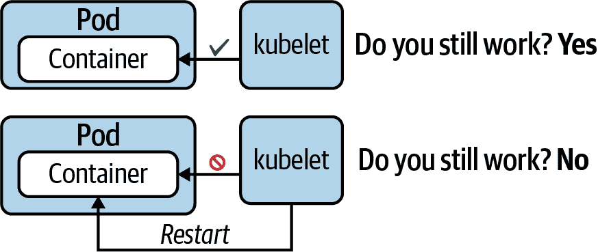

# 第十四章：容器探针

在容器中运行的应用程序并不遵循“发射即忘”的前提。一旦 Kubernetes 启动容器，您希望知道应用程序是否准备好使用，并且在一个小时、一周或一个月后仍然按预期工作。健康探针是一个定期运行的迷你进程，询问应用程序的状态并在特定条件下采取行动。

在本章中，我们将讨论容器健康探针——更具体地说，就绪、存活和启动探针。您将了解不同的健康验证方法以及如何为适当的用例定义它们。

# 使用探针

即使采用最佳的测试策略，也几乎不可能在部署软件到生产环境之前找到所有的错误。特别是对于仅在操作软件一段时间后发生的故障情况而言。看到内存泄漏、死锁、无限循环及类似情况在最终用户对应用程序进行负载时出现并不罕见。

适当的监控有助于识别这些问题；然而，您仍然需要采取措施来减轻情况。首先，您可能希望重新启动应用程序以防止进一步的中断。其次，开发团队需要确定潜在的根本原因并修复应用程序的代码。

## 探针类型

Kubernetes 提供了称为*健康探测*的概念，用于自动检测和修正此类问题。您可以配置一个容器执行定期的迷你进程，检查特定条件。这些进程定义如下：

就绪探针

即使应用程序启动后，它可能仍然需要执行配置过程，例如连接到数据库并准备数据。此探针检查应用程序是否准备好接受传入请求。图 14-1 展示了就绪探针。


###### 图 14-1\. 就绪探针检查应用程序是否准备好接受流量

存活探针

一旦应用程序运行起来，您希望确保它仍然如预期般工作且没有问题。此探针定期检查应用程序的响应性。如果探测器认为应用程序处于不健康状态，Kubernetes 将自动重新启动容器，如图 14-2 所示。



###### 图 14-2\. 存活探针检查应用程序是否健康

启动探针

特别是旧应用程序可能需要很长时间才能启动 —— 可能会有几分钟。可以实例化启动探针来等待预定义的时间量，然后才允许启动存活探针进行探测。通过设置启动探针，可以防止应用程序进程被探测请求压倒。如果应用程序无法在设定的时间内启动，则启动探针会终止容器。图 14-3 展示了启动探针的行为。


###### 图 14-3\. 启动探针延迟启动存活探针的行为

从运维的角度来看，最重要的探针是准备探针。如果不定义存活性和启动探针，Kubernetes 控制平面组件将处理大部分默认行为。

每个探针提供了一些独特的方法来验证容器的健康状态，详见下一节。

## 健康验证方法

您可以为容器定义一个或多个健康验证方法。表 14-1 描述了可用的健康验证方法、它们对应的 YAML 属性以及它们的运行时行为。

表 14-1\. 可用的健康验证方法

| 方法 | 选项 | 描述 |
| --- | --- | --- |
| 自定义命令 | `exec.command` | 在容器内执行命令（例如 `cat` 命令），并检查其退出代码。Kubernetes 认为零退出代码表示成功，非零退出代码表示错误。 |
| HTTP GET 请求 | `httpGet` | 发送 HTTP GET 请求到应用程序公开的端点。在 200 到 399 范围内的 HTTP 响应代码表示成功。任何其他响应代码被视为错误。 |
| TCP socket 连接 | `tcpSocket` | 尝试打开到端口的 TCP socket 连接。如果连接成功建立，则探测尝试成功。无法连接被视为错误。 |
| gRPC | `grpc` | 应用程序实现了 [GRPC 健康检查协议](https://github.com/grpc/grpc/blob/master/doc/health-checking.md)，验证服务器是否能处理远程过程调用（RPC）。 |

请记住，您可以将任何探针与任何健康检查方法结合使用。您选择的健康验证方法高度依赖于容器中运行的应用程序类型。例如，Web 应用程序的明显选择是使用 HTTP GET 请求验证方法。

## 健康检查属性

每个探针都提供一组属性，可以进一步配置运行时行为，如 表 14-2 所示。更多信息，请参阅 [探针 v1 核心](https://kubernetes.io/docs/reference/generated/kubernetes-api/v1.28/#probe-v1-core) 对象的 API。

表 14-2\. 用于微调健康检查运行时行为的属性

| 属性 | 默认值 | 描述 |
| --- | --- | --- |
| `initialDelaySeconds` | 0 | 直到执行第一次检查之前的延迟秒数。 |
| `periodSeconds` | 10 | 执行检查的间隔（例如，每 20 秒一次）。 |
| `timeoutSeconds` | 1 | 检查操作超时的最大秒数。 |
| `successThreshold` | 1 | 在失败后多少次成功检查尝试后，探测被视为成功。 |
| `failureThreshold` | 3 | 在检查尝试失败之前的失败次数，探测将被标记为失败并采取行动。 |
| `terminationGracePeriodSeconds` | 30 | 在失败后强制停止容器之前的优雅期限。 |

以下各节将演示不同探针类型的大多数验证方法的使用。

# 就绪探针

在这种情况下，我们希望为 Node.js 应用程序定义一个就绪探针。Node.js 应用程序在根上下文路径上公开了一个 HTTP 端点，并运行在 3000 端口上。处理基于 Web 的应用程序，使用 HTTP GET 请求非常适合探测其就绪状态。您可以在本书的 GitHub 代码库中找到该应用程序的源代码。

在 示例 14-1 中显示的 YAML 清单中，就绪探针在两秒后执行其第一次检查，并在此后每八秒重复检查。所有其他属性使用默认值。即使应用程序成功启动后，就绪探针仍将定期检查。

##### 示例 14-1\. 使用 HTTP GET 请求的就绪探针

```
apiVersion: v1
kind: Pod
metadata:
  name: readiness-pod
spec:
  containers:
  - image: bmuschko/nodejs-hello-world:1.0.0
    name: hello-world
    ports:
    - name: nodejs-port     
      containerPort: 3000
    readinessProbe:
      httpGet:
        path: /
        port: nodejs-port   
      initialDelaySeconds: 2
      periodSeconds: 8
```


您可以为端口分配一个名称，以便在探测中引用。


而不是再次分配 3000 端口，我们简单地使用端口名称。

通过将 `apply` 命令指向 YAML 清单来创建一个 Pod。在 Pod 的启动过程中，可能会显示状态为 `Running`，但容器尚未准备好接受传入请求，如 `READY` 列中的 `0/1` 所示：

```
$ kubectl apply -f readiness-probe.yaml
pod/readiness-pod created
$ kubectl get pod readiness-pod
NAME                READY   STATUS    RESTARTS   AGE
pod/readiness-pod   0/1     Running   0          6s
$ kubectl get pod readiness-pod
NAME                READY   STATUS    RESTARTS   AGE
pod/readiness-pod   1/1     Running   0          68s
$ kubectl describe pod readiness-pod
...
Containers:
  hello-world:
    ...
    Readiness:      http-get http://:nodejs-port/ delay=2s timeout=1s \
                    period=8s #success=1 #failure=3
...

```

# 存活探针

活跃性探针检查应用程序是否按预期工作。为了演示活跃性探针，我们将使用一个自定义命令。自定义命令是验证容器健康状态最灵活的方式，因为它允许调用容器可用的任何命令。这可以是基础镜像中提供的命令行工具，也可以是您作为容器化过程的一部分安装的工具。

在 示例 14-2 中，我们将使应用程序创建并更新一个文件，*/tmp/heartbeat.txt*，以显示其仍在运行。我们通过每五秒运行 Unix 的 `touch` 命令来实现这一点。探针将定期检查文件的修改时间戳是否早于一分钟。如果是，则 Kubernetes 可以假定该应用程序未按预期运行，并将重新启动容器。

##### 示例 14-2\. 使用自定义命令的活跃性探针

```
apiVersion: v1
kind: Pod
metadata:
  name: liveness-pod
spec:
  containers:
  - image: busybox:1.36.1
    name: app
    args:
    - /bin/sh
    - -c
    - 'while true; do touch /tmp/heartbeat.txt; sleep 5; done;'
    livenessProbe:
      exec:
        command:
        - test `find /tmp/heartbeat.txt -mmin -1`
      initialDelaySeconds: 5
      periodSeconds: 30
```

下一个命令使用存储在文件*liveness-probe.yaml*中的 YAML 示例 14-2 清单来创建 Pod。描述 Pod 会呈现有关存活探测的信息。我们不仅可以检查自定义命令及其配置，还可以看到在探测失败时容器已重启的次数：

```
$ kubectl apply -f liveness-probe.yaml
pod/liveness-pod created
$ kubectl get pod liveness-pod
NAME               READY   STATUS    RESTARTS   AGE
pod/liveness-pod   1/1     Running   0          22s
$ kubectl describe pod liveness-pod
...
Containers:
  app:
    ...
    Restart Count:  0
    Liveness:       exec [test `find /tmp/heartbeat.txt -mmin -1`] delay=5s \
                    timeout=1s period=30s #success=1 #failure=3
...

```

# 启动探测

启动探测的目的是找出应用程序何时完全启动。定义探测对于启动时间较长的应用程序很有用。kubelet 在运行启动探测时将暂停就绪和存活探测。启动探测在以下情况下完成其操作：

1.  如果可以验证应用程序已启动

1.  如果应用程序在超时期内没有响应

为了演示启动探测的功能，示例 14-3 定义了一个 Pod，在容器中运行[Apache HTTP 服务器](https://hub.docker.com/_/httpd)。默认情况下，该镜像公开容器端口 80，我们使用 TCP 套接字连接来探测该端口。

##### 示例 14-3\. 使用 TCP 套接字连接的启动探测

```
apiVersion: v1
kind: Pod
metadata:
  name: startup-pod
spec:
  containers:
  - image: httpd:2.4.46
    name: http-server
    startupProbe:
      tcpSocket:
        port: 80
      initialDelaySeconds: 3
      periodSeconds: 15
    livenessProbe:
      ...
```

正如您在以下终端输出中所看到的那样，`describe`命令可以检索启动探测的配置：

```
$ kubectl apply -f startup-probe.yaml
pod/startup-pod created
$ kubectl get pod startup-pod
NAME              READY   STATUS    RESTARTS   AGE
pod/startup-pod   1/1     Running   0          31s
$ kubectl describe pod startup-pod
...
Containers:
  http-server:
     ...
     Startup:        tcp-socket :80 delay=3s timeout=1s period=15s \
                     #success=1 #failure=3
...

```

# 总结

在本章中，我们查看了您可以为 Pod 定义的所有可用健康探测类型。健康探测是定期运行的迷你进程，询问运行在容器中的应用程序的状态。可以将其视为系统的脉搏检测。

就绪探测确保容器只接受传入流量，前提是应用程序正常运行。存活探测确保应用程序按预期运行，并在必要时重新启动容器。启动探测暂停存活探测，直到应用程序启动完成。实际上，您通常会发现一个容器定义了这三个探测。

# 考试要点

理解所有探测的目的

为了准备本节的考试，专注于理解和使用健康探测。您应理解启动、就绪和存活探测的目的，并练习如何配置它们。在您的 Kubernetes 集群中，尝试模拟成功和失败的条件，以查看探测的效果和它们采取的操作。

练习使用不同的验证方法

您可以选择多种适用于探测的验证方法。高层次了解何时应用哪种验证方法，以及如何配置每种方法。

# 示例练习

这些练习的解决方案可在附录 A 中找到。

1.  在 YAML 清单中定义名为`web-server`的新 Pod，使用镜像`nginx:1.23.0`。公开容器端口 80。暂时不要创建该 Pod。

    对于容器，声明一个类型为`httpGet`的启动探针。验证 kubelet 能够请求到根上下文端点。使用探针的默认配置。

    对于容器，声明一个类型为`httpGet`的就绪探针。验证 kubelet 能够请求到根上下文端点。在首次检查之前等待五秒钟。

    对于容器，声明一个类型为`httpGet`的存活探针。验证 kubelet 能够请求到根上下文端点。在首次检查之前等待十秒钟。探针应每 30 秒运行一次检查。

    创建 Pod 并在过程中跟踪 Pod 的生命周期阶段。

    检查 Pod 的探针的运行时详细信息。
