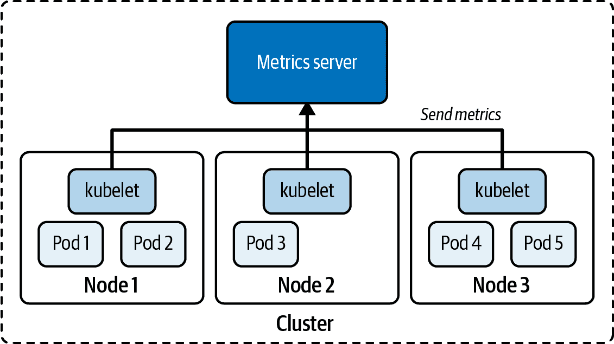

# 第十五章：故障排除 Pod 和容器

在生产 Kubernetes 集群中操作应用程序时，故障几乎是不可避免的。您不能完全将此工作交给 Kubernetes 管理员——作为应用程序开发者，您有责任为您设计和部署的 Kubernetes 对象解决问题。

在本章中，我们将探讨一些故障排除策略，这些策略有助于识别问题的根本原因，以便您可以采取措施并适当地纠正故障。

# 故障排除 Pods

在大多数情况下，创建 Pod 没有问题。您只需发出`run`，`create`或`apply`命令以实例化 Pod。如果 YAML 清单形式正确，Kubernetes 将接受您的请求，因此可以假定一切正常工作。为了验证正确的行为，您首先需要做的是检查 Pod 的高级运行时信息。该操作可能涉及其他 Kubernetes 对象，如负责部署多个 Pod 副本的部署。

## 检索高级信息

为了检索信息，运行`kubectl get pods`命令以仅获取在命名空间中运行的 Pod，或者运行`kubectl get all`命令以检索命名空间中最突出的对象类型（包括部署）。您需要查看`READY`，`STATUS`和`RESTARTS`列。在最佳情况下，准备就绪的容器数量与您在`spec`中定义的容器数量相匹配。对于单容器 Pod，`READY`列将显示 1/1。

状态应显示为`Running`，以指示 Pod 已进入正确的生命周期状态。请注意，可能会发生 Pod 呈现`Running`状态，但实际上应用程序并未正常工作。如果重新启动次数大于 0，则可能需要检查活跃探测器（如果已定义）的逻辑，并确定重新启动所需的原因。

以下 Pod 观察到状态为`ErrImagePull`，并且使得 0/1 个容器对传入流量可用。简言之，此 Pod 存在问题：

```
$ kubectl get pods
NAME              READY   STATUS         RESTARTS   AGE
misbehaving-pod   0/1     ErrImagePull   0          2s

```

在使用 Kubernetes 一段时间后，您将自动识别常见的错误条件。表 15-1 列出了其中一些错误状态，并说明如何修复它们。

表 15-1。常见的 Pod 错误状态

| 状态 | 根本原因 | 潜在修复方案 |
| --- | --- | --- |
| `ImagePullBackOff`或`ErrImagePull` | 无法从注册表中拉取镜像。 | 检查正确的镜像名称，检查该镜像名称是否存在于注册表中，验证节点到注册表的网络访问，确保正确的身份验证。 |
| `CrashLoopBackOff` | 容器中运行的应用程序或命令崩溃。 | 检查在容器中执行的命令，确保镜像可以正确执行（例如通过使用 Docker 创建容器）。 |
| `CreateContainerConfigError` | 容器引用的 ConfigMap 或 Secret 未找到。 | 检查配置对象的正确名称，验证命名空间中配置对象的存在性。 |

## 检查事件

您可能不会遇到这些错误状态中的任何一个。但 Pod 可能存在配置问题的可能性。您可以使用`kubectl describe pod`命令检查其事件，以获取有关 Pod 的详细信息。

以下输出属于尝试挂载不存在的 Secret 的 Pod。该 Pod 并未呈现特定的错误消息，而是以`ContainerCreating`状态挂起：

```
$ kubectl get pods
NAME         READY   STATUS              RESTARTS   AGE
secret-pod   0/1     ContainerCreating   0          4m57s
$ kubectl describe pod secret-pod
...
Events:
Type    Reason      Age                  From              Message
----    ------      ----                 ----              -------
Normal  Scheduled   <unknown>            default-scheduler Successfully \
                                                           assigned
                                                           default/secret-pod \
                                                           to minikube
Warning FailedMount 3m15s                kubelet, minikube Unable to attach or \
                                                           mount volumes: \
                                                           unmounted \
                                                           volumes=[mysecret], \
                                                           unattached volumes= \
                                                           [default-token-bf8rh \
                                                           mysecret]: timed out \
                                                           waiting for the \
                                                           condition
Warning FailedMount 68s (x10 over 5m18s) kubelet, minikube MountVolume.SetUp \
                                                           failed for volume \
                                                           "mysecret" : secret \
                                                           "mysecret" not found
Warning FailedMount 61s                  kubelet, minikube Unable to attach or \
                                                           mount volumes: \
                                                           unmounted volumes= \
                                                           [mysecret], \
                                                           unattached \
                                                           volumes=[mysecret \
                                                           default-token-bf8rh \
                                                           ]: timed out \
                                                           waiting for the \
                                                           condition

```

另一个有用的命令是`kubectl get events`。该命令的输出列出了给定命名空间内所有 Pod 的事件。您可以使用额外的命令行选项进一步过滤和排序事件：

```
$ kubectl get events
LAST SEEN   TYPE      REASON            OBJECT               MESSAGE
3m14s       Warning   BackOff           pod/custom-cmd       Back-off \
                                                             restarting \
                                                             failed container
2s          Warning   FailedNeedsStart  cronjob/google-ping  Cannot determine \
                                                             if job needs to \
                                                             be started: too \
                                                             many missed start \
                                                             time (> 100). Set \
                                                             or decrease \
                                                             .spec. \
                                                             startingDeadline \
                                                             Seconds or check \
                                                             clock skew

```

有时仅仅进行故障排除是不够的。您可能需要深入了解容器中的应用程序运行时行为和配置。

## 使用端口转发

在生产环境中，您将操作由 ReplicaSet 控制的多个 Pod 上的应用程序。其中一个副本遇到运行时问题并不罕见。您可以通过隧道化的 HTTP 连接将流量转发到 Pod，而不是从集群内的临时 Pod 中排查问题的 Pod。这就是[`port-forward`命令](https://kubernetes.io/docs/reference/kubectl/generated/kubectl_port-forward/)的作用所在。

让我们演示这种行为。以下命令将创建一个新的 Deployment，在三个副本中运行 nginx：

```
$ kubectl create deployment nginx --image=nginx:1.24.0 --replicas=3 --port=80
deployment.apps/nginx created

```

结果的 Pod 将具有根据 Deployment 名称衍生的唯一名称。假设 Pod `nginx-595dff4799-ph4js`存在您想要排查的问题：

```
$ kubectl get pods
NAME                     READY   STATUS    RESTARTS   AGE
nginx-595dff4799-pfgdg   1/1     Running   0          6m25s
nginx-595dff4799-ph4js   1/1     Running   0          6m25s
nginx-595dff4799-s76s8   1/1     Running   0          6m25s

```

`port-forward`命令将 HTTP 连接从本地端口转发到 Pod 中公开的端口。此示例命令将本地机器上的端口 2500 转发到运行在 Pod `nginx-595dff4799-ph4js`中的容器端口 80：

```
$ kubectl port-forward nginx-595dff4799-ph4js 2500:80
Forwarding from 127.0.0.1:2500 -> 80
Forwarding from [::1]:2500 -> 80

```

`port-forward`命令不会返回。您需要打开另一个终端，通过端口转发调用 Pod。以下命令仅仅检查 Pod 是否可从您的本地机器访问，使用`curl`：

```
curl -Is localhost:2500 | head -n 1
HTTP/1.1 200 OK

```

HTTP 响应码 200 明确显示我们可以从集群外访问 Pod。`port-forward`命令并非长时间运行的命令。它的主要目的是用于测试或排查 Pod，而无需通过 Service 公开它。

# 容器故障排除

您可以与容器交互，深入了解应用程序的运行时环境。接下来的章节将讨论如何检查日志，打开与容器的交互式 shell，并调试不提供 shell 的容器。

###### 注意

下面描述的命令也适用于 init 和 sidecar 容器。如果运行的容器多于一个，可以使用 `-c` 或 `--container` 命令行标志来指定目标容器。有关多容器 Pod 的更多信息，请参见第 8 章。

## 检查日志

在故障排除 Pod 时，可以通过下载并检查其日志获取下一级别的详细信息。您可能会找到指向行为不端的 Pod 根本原因的额外信息，也可能不会，但肯定值得一试。示例 15-1 中显示的 YAML 清单定义了一个运行 Shell 命令的 Pod。

##### 示例 15-1\. 运行失败 Shell 命令的 Pod

```
apiVersion: v1
kind: Pod
metadata:
  name: incorrect-cmd-pod
spec:
  containers:
  - name: test-container
    image: busybox:1.36.1
    command: ["/bin/sh", "-c", "unknown"]
```

创建对象后，Pod 失败，状态显示为 `CrashLoopBackOff`。运行 `logs` 命令显示容器中运行的命令存在问题：

```
$ kubectl create -f crash-loop-backoff.yaml
pod/incorrect-cmd-pod created
$ kubectl get pods incorrect-cmd-pod
NAME                READY   STATUS              RESTARTS   AGE
incorrect-cmd-pod   0/1     CrashLoopBackOff    5          3m20s
$ kubectl logs incorrect-cmd-pod
/bin/sh: unknown: not found

```

`logs` 命令提供了两个有用的选项。选项 `-f` 可以实时流式传输日志，意味着您将看到新的日志条目随着其实时生成。选项 `--previous` 获取容器先前实例的日志，如果容器已重新启动，则非常有帮助。

## 打开交互式 Shell

如果之前的任何命令都没有指向导致 Pod 失败的根本原因，那么现在是时候向容器打开交互式 Shell 了。作为应用程序开发者，您最了解在运行时从应用程序中期望什么行为。使用 Unix 或 Windows 实用工具来检查运行中的进程，具体取决于容器中运行的镜像。

假设您遇到一个情况，其中 Pod 表面上似乎正常工作，如示例 15-2 所示。

##### 示例 15-2\. 定期向文件写入当前日期的 Pod

```
apiVersion: v1
kind: Pod
metadata:
  name: failing-pod
spec:
  containers:
  - args:
    - /bin/sh
    - -c
    - while true; do echo $(date) >> ~/tmp/curr-date.txt; sleep \
      5; done;
    image: busybox:1.36.1
    name: failing-pod
```

创建 Pod 后，检查其状态。状态显示为 `Running`；然而，当请求应用程序时，端点报告错误。接下来，检查日志。日志输出显示一个指向不存在目录的错误消息。显然，应用程序所需的目录尚未正确设置：

```
$ kubectl create -f failing-pod.yaml
pod/failing-pod created
$ kubectl get pods failing-pod
NAME          READY   STATUS    RESTARTS   AGE
failing-pod   1/1     Running   0          5s
$ kubectl logs failing-pod
/bin/sh: can't create /root/tmp/curr-date.txt: nonexistent directory

```

`exec` 命令打开一个交互式 Shell 以进一步调查问题。在下面的代码中，我们在运行的容器内使用 Unix 工具 `mkdir`、`cd` 和 `ls` 来解决问题。显然，更好的缓解策略是在应用程序中创建目录或在 Dockerfile 中提供指令：

```
$ kubectl exec failing-pod -it -- /bin/sh
# mkdir -p ~/tmp
# cd ~/tmp
# ls -l
total 4
-rw-r--r-- 1 root root 112 May 9 23:52 curr-date.txt

```

## 与 Distroless 容器交互

一些运行在容器中的镜像出于安全原因设计得非常精简。例如，[Google distroless](https://github.com/GoogleContainerTools/distroless) 镜像没有预安装任何 Unix 实用工具。甚至无法打开容器的 Shell，因为它不带 Shell。

# 为容器镜像集成安全最佳实践

以可访问的 shell 和使用 `root` 用户运行的方式来运输容器显然是不鼓励的，因为这些方面可能被用作潜在的攻击向量。查看 [CKS 认证](https://training.linuxfoundation.org/certification/certified-kubernetes-security-specialist/) 以了解更多有关 Kubernetes 安全问题的信息。

Google 的一个 Distroless 镜像是 `k8s.gcr.io/pause:3.1`，如 示例 15-3 所示。

##### 示例 15-3\. 运行一个 Distroless 镜像

```
apiVersion: v1
kind: Pod
metadata:
  name: minimal-pod
spec:
  containers:
  - image: k8s.gcr.io/pause:3.1
    name: pause
```

正如您在以下 `exec` 命令中所见，该镜像不提供 shell：

```
$ kubectl create -f minimal-pod.yaml
pod/minimal-pod created
$ kubectl get pods minimal-pod
NAME          READY   STATUS    RESTARTS   AGE
minimal-pod   1/1     Running   0          8s
$ kubectl exec minimal-pod -it -- /bin/sh
OCI runtime exec failed: exec failed: container_linux.go:349: starting \
container process caused "exec: \"/bin/sh\": stat /bin/sh: no such file \
or directory": unknown
command terminated with exit code 126

```

Kubernetes 提供了 [短暂容器](https://kubernetes.io/docs/concepts/workloads/pods/ephemeral-containers/) 的概念。这些容器是可丢弃的，没有像探针这样的弹性功能。您可以为通常不允许使用 `exec` 命令的最小容器部署一个临时容器进行故障排除。

Kubernetes 1.18 引入了一个新的 `debug` 命令，可以为调试目的向运行中的 Pod 注入临时容器。以下命令将运行镜像 `busybox` 的临时容器添加到名为 `minimal-pod` 的 Pod，并为其打开交互式 shell：

```
$ kubectl alpha debug -it minimal-pod --image=busybox
Defaulting debug container name to debugger-jf98g.
If you don't see a command prompt, try pressing enter.
/ # pwd
/
/ # exit
Session ended, resume using 'kubectl alpha attach minimal-pod -c \
debugger-jf98g -i -t' command when the pod is running

```

# 检查资源指标

将软件部署到 Kubernetes 集群只是长期运行应用程序的开始。开发人员需要了解其应用程序的资源消耗模式和行为，目标是提供可扩展和可靠的服务。

在 Kubernetes 世界中，像 [Prometheus](https://prometheus.io/) 和 [Datadog](https://www.datadoghq.com/) 这样的监控工具帮助收集、处理和可视化信息随着时间的推移。考试不要求您熟悉第三方监控、日志记录、跟踪和聚合工具；但了解负责收集使用度量的底层 Kubernetes 基础设施的基本原理是有帮助的。以下是典型指标的示例：

+   集群中的节点数量

+   节点的健康状态

+   如 CPU、内存、磁盘空间、网络等节点性能指标

+   如 CPU 和内存消耗等 Pod 级性能指标

这项责任落到 [指标服务器](https://github.com/kubernetes-sigs/metrics-server)，这是一个集群范围内的资源使用数据聚合器。如 图 15-1 所示，运行在节点上的 kubelet 收集指标并将其发送到指标服务器。



###### 图 15-1\. 指标服务器的数据收集

指标服务器将数据存储在内存中，并且不会随时间持久化数据。如果您正在寻找保留历史数据的解决方案，那么您需要查看商业选项。有关其[安装过程](https://github.com/kubernetes-sigs/metrics-server?tab=readme-ov-file#installation)的更多信息，请参阅文档。

如果您的练习环境是 Minikube，使用以下命令简单地启用 metrics-server 插件是直接的：[enabling the metrics-server add-on](https://kubernetes.io/docs/tutorials/hello-minikube/#enable-addons)。

```
$ minikube addons enable metrics-server
The 'metrics-server' addon is enabled

```

现在您可以使用`top`命令查询集群节点和 Pod 的指标：

```
$ kubectl top nodes
NAME       CPU(cores)   CPU%   MEMORY(bytes)   MEMORY%
minikube   283m         14%    1262Mi          32%
$ kubectl top pod frontend
NAME       CPU(cores)   MEMORY(bytes)
frontend   0m           2Mi

```

安装指标服务器后，需要几分钟时间收集资源消耗信息。如果收到错误消息，请重新运行`kubectl top`命令。

# 摘要

我们讨论了解决失败或行为异常 Pod 的策略。主要目标是诊断失败的根本原因，然后采取正确的措施进行修复。故障排除 Pod 并不一定困难。通过正确的`kubectl`命令，您可以逐个排除根本原因，从而更清晰地了解情况。

Kubernetes 生态系统提供了许多选项来收集和处理集群的指标。其中包括像 Prometheus 和 Datadog 这样的商业监控工具。许多工具使用指标服务器作为这些指标的真实来源。我们还简要介绍了安装过程和从命令行检索指标的`kubectl top`命令。

# 考试要点

了解如何调试 Pod 对象

在本章中，我们主要专注于故障排除问题 Pod 和容器。练习所有相关的`kubectl`命令，这些命令可以帮助诊断问题。请参阅[Kubernetes 文档](https://kubernetes.io/docs/tasks/debug/debug-application/)以了解更多关于调试其他 Kubernetes 资源类型的信息。

学习如何检索和解释资源指标

监控 Kubernetes 集群是成功运行在真实环境中的重要方面。您应该阅读关于商业监控产品的信息，以及指标服务器可以收集哪些数据。您可以假设考试环境已安装指标服务器。学习如何使用`kubectl top`命令查看 Pod 和节点的资源指标并进行解释。

# 样例练习

这些练习的解决方案在附录 A 中可用。

1.  在这个练习中，您将通过检查配置错误的 Pod 来练习故障排除技能。导航到检出的 GitHub 存储库[*bmuschko/ckad-study-guide*](https://github.com/bmuschko/ckad-study-guide)的目录*app-a/ch15/troubleshooting*。

    根据文件*pod.yaml*中的 YAML 清单创建一个新的 Pod。检查 Pod 的状态。是否有任何问题？

    渲染正在运行的容器的日志并识别问题。进入容器的 Shell。您能根据渲染的日志消息验证问题吗？

    建议解决方案，可以修复问题的根本原因。

1.  要检查度量服务器收集的度量指标。导航到已检出的 GitHub 仓库 [*bmuschko/ckad-study-guide*](https://github.com/bmuschko/ckad-study-guide) 的目录 *app-a/ch15/stress-test*。当前目录包含三个 Pod 的 YAML 清单，*stress-1-pod.yaml*、*stress-2-pod.yaml* 和 *stress-3-pod.yaml*。检查这些清单文件。

    创建命名空间 `stress-test` 和该命名空间内的 Pods。

    利用度量服务器提供的数据，确定哪个 Pod 消耗的内存最多。

    *先决条件：* 如果要能够检查实际资源指标，您需要安装度量服务器。您可以在该项目的 GitHub 页面上找到[安装说明](https://github.com/kubernetes-sigs/metrics-server#installation)。
