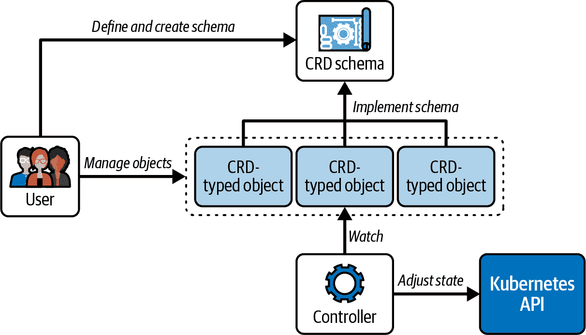

# 第十六章：自定义资源定义（CRD）

Kubernetes 提供的原语支持应用程序堆栈操作员所需的最常见用例。对于定制用例，Kubernetes 允许实现和安装平台扩展。

CustomResourceDefinition（CRD）是 Kubernetes 的扩展机制，用于引入自定义 API 原语，以满足内置原语无法覆盖的需求。本章将主要关注 CRD 的实现和与之交互。

# 使用 CRD

CRD 可以被理解为定义自定义对象蓝图的模式，然后使用新引入的类型实例化这些对象。对于 CRD 的实用性，必须由*控制器*支持。控制器与 Kubernetes API 交互，并实现与 CRD 对象交互的协调逻辑。CRD 和控制器的组合通常称为*操作者模式*。考试不要求您理解控制器，因此不会涵盖它们的实现。图 16-1 显示了带有其所有组成部分的操作者模式。



###### 图 16-1\. Kubernetes 操作者模式

Kubernetes 社区在[OperatorHub.io](https://operatorhub.io/)上实施了许多有用的操作者。您可以使用单个`kubectl`安装其中许多操作者。一个重要的操作者是[External Secrets Operator](https://external-secrets.io/)，它帮助集成外部的秘密管理器（如 AWS Secrets Manager 和 HashiCorp Vault）与 Kubernetes。在考试中，您需要理解如何发现外部操作者提供的 CRD 模式以及如何与遵循 CRD 模式的对象进行交互。本章节我们将进一步讨论如何创建自己的 CRD 模式。

## 示例 CRD

最佳实践是通过示例来解释 CRD 的实现和交互。我们将实现和实例化一个 CRD，该 CRD 代表在将应用程序堆栈部署到 Kubernetes 后执行的服务对象的烟测试。

技术基线

假设您负责管理一个基于 Web 的应用程序。管理该应用程序所需的 Kubernetes 对象包括用于在 Pod 中运行应用程序的部署（Deployment）对象和用于将网络流量路由到副本的服务（Service）对象。

期望的功能

应在部署负责操作应用程序的 Kubernetes 对象后自动触发烟测试。在运行时，烟测试通过目标服务的 DNS 名称执行 HTTPS 调用到应用程序的端点。烟测试的结果（成功或失败）将被发送到外部服务，以便在仪表盘上呈现为图表和图形。

目标

要实现此功能，您可以决定编写一个 CRD 和控制器。在本章中，我们仅讨论了用于 smoke test 的 CRD，而不是执行 smoke test 的控制器。

## 实现 CRD 架构

要使 CRD 运行，您必须创建两个对象：自定义资源架构和自定义资源对象。自定义资源架构根据 OpenAPI v3 规范指定 CRD 蓝图。自定义资源对象遵循 CRD 架构的规范，并为架构可用的属性分配值。

# 使用 Kubebuilder 生成 CRD

CRD 架构规范可以变得非常广泛。为了避免手工编写这些规范，请查看 [Kubebuilder](https://github.com/kubernetes-sigs/kubebuilder) 项目。Kubebuilder 的一个功能是能够使用用户提供的最小输入生成 CRD 架构。使用这个工具可以帮助节省启动 Kubernetes 操作者项目的时间。

首先，让我们看一下 smoke test 的自定义资源架构。如 示例 16-1 所示，架构使用 kind CustomResourceDefinition。

虽然我不能在此处解释每个 CustomResourceDefinition 属性的含义，但我想指出一些重要的方面。CustomResourceDefinition 指定了自定义基元的组、版本和名称。它还详细说明了所有可配置的属性，包括它们的数据类型。有关 CustomResourceDefinition 的更详细描述，请参阅 [Kubernetes 文档](https://kubernetes.io/docs/concepts/extend-kubernetes/api-extension/custom-resources/)。

##### 示例 16-1\. 代表 smoke test 的自定义资源架构

```
apiVersion: apiextensions.k8s.io/v1
kind: CustomResourceDefinition
metadata:
  name: smoketests.stable.bmuschko.com   
spec:
  group: stable.bmuschko.com             
  versions:
    - name: v1                           
      served: true
      storage: true
      schema:
        openAPIV3Schema:
          type: object
          properties:                    
            spec:
              type: object
              properties:
                service:
                  type: string
                path:
                  type: string
                timeout:
                  type: integer
                retries:
                  type: integer
  scope: Namespaced
  names:                                 
    plural: smoketests
    singular: smoketest
    kind: SmokeTest
    shortNames:
    - st
```


结合标识符 `<plural>`.`<group>` 的组合。


用于 CRD 的 API 组。


CRD 支持的版本。一个版本可以定义 0..n 个属性。


要设置的自定义类型属性。


自定义类型的标识符，例如 kind 和单数/复数/短名称。

文件 *smoketest-resource.yaml* 包含了前面示例中显示的 YAML 内容。您现在可以使用典型的 `kubectl` 命令为架构创建对象：

```
$ kubectl apply -f smoketest-resource.yaml
customresourcedefinition.apiextensions.k8s.io/smoketests.stable.bmuschko.com \
created

```

## 为 CRD 实例化一个对象

一旦架构对象创建完成，您可以为新的自定义类型创建对象。在 示例 16-2 中的 YAML 文件定义了一个名为 `backend-smoke-test` 的类型为 SmokeTest 的基元，用于名为 `backend` 的服务。正如您在示例中所见，可以指定额外的属性以微调其运行时行为。

##### 示例 16-2\. 实例化 CRD 种类 SmokeTest

```
apiVersion: stable.bmuschko.com/v1   
kind: SmokeTest                      
metadata:
  name: backend-smoke-test
spec:
  service: backend                   
  path: /health                      
  timeout: 600                       
  retries: 3                         
```


自定义类型的组和版本。


由 CRD 定义的种类。


使自定义类型可配置的属性及其值。

继续并从文件 *smoketest.yaml* 创建 SmokeTest 对象：

```
$ kubectl apply -f smoketest.yaml
smoketest.stable.bmuschko.com/backend-smoke-test created

```

你可以像操作 Kubernetes 中的任何其他对象一样与`backend-smoke-test`交互。例如，要列出对象，请使用`get`命令。要删除对象，请使用`delete`命令。以下命令展示了这些操作的执行过程：

```
$ kubectl get smoketest backend-smoke-test
NAME                 AGE
backend-smoke-test   12s
$ kubectl delete smoketest backend-smoke-test
smoketest.stable.bmuschko.com "backend-smoke-test" deleted

```

您可以根据需要创建更多此类型的对象以执行针对其他服务的冒烟测试，尽管每个对象都需要一个唯一的名称。我们现在已经放置了 CRD 模式对象。在下一节中，我们将与其交互。

## 发现 CRD

CRD 模式注册了一个新的 API 资源。每个 API 资源都可以被发现。您可以按照与内置 API 资源相同的方式列出自定义 API 资源。以下命令按 API 组 `stable.bmuschko.com` 列出 API 资源：

```
$ kubectl api-resources --api-group=stable.bmuschko.com
NAME         SHORTNAMES   APIVERSION               NAMESPACED   KIND
smoketests   st           stable.bmuschko.com/v1   true         SmokeTest

```

可以像使用 `kubectl` 操作任何其他对象一样与 CRD 对象进行交互。您可以创建、读取、更新和删除它们。以下命令列出了集群中安装的所有 CRD：

```
$ kubectl get crds
NAME                             CREATED AT
smoketests.stable.bmuschko.com   2023-05-04T14:49:40Z

```

在输出中看到的 CRD 是代表冒烟测试的一个。如果在输出中看到其他 CRD，则可能是由您集群中安装的外部运算符提供的。

## 实现控制器

冒烟测试对象只表示数据，并且本身不会有用。您需要添加一个控制器实现，该实现对这些对象进行操作。简而言之，控制器通过调用 Kubernetes API 检查 CRD 对象的状态来作为协调过程。

在运行时，控制器实现需要轮询新的 SmokeTest 对象，并执行 HTTPS 请求到配置的服务端点。最后，控制器检查请求的响应，评估结果，并将其发送到外部服务以记录在数据库中。然后，仪表板可以查看历史结果，并根据需要渲染，例如作为图表和图形。

控制器可以使用 Kubernetes [客户端库](https://kubernetes.io/docs/reference/using-api/client-libraries/)之一（使用 Go 或 Python 编写）来访问自定义资源。访问相关文档以获取有关如何实现控制器的更多信息和示例。

# 摘要

CRD 模式定义了自定义资源的结构。模式包括组、名称、版本及其可配置的属性。在注册模式后，可以创建此类新对象。您可以使用 `kubectl` 与任何其他原语使用的相同 CRUD 命令来与自定义对象交互。

当与控制器实现结合使用时，CRDs 能够发挥其全部潜力。控制器实现检查特定自定义对象的状态，并根据其发现的状态做出反应。Kubernetes 将 CRD 及其对应的控制器称为操作员模式。Kubernetes 社区已经实现了许多操作员以满足定制需求。您可以将它们安装到您的集群中以重复使用这些功能。

# 考试要点

获取 CRD 模式的可配置选项的高级理解

您不需要实现 CRD 模式。您只需要知道如何使用`kubectl`发现和使用它们。控制器实现明显超出了考试范围。

练习安装和发现 CRD 的命令

学习如何使用`kubectl get crds`命令来发现已安装的 CRDs，并学习如何根据 CRD 模式创建对象。如果您想进一步探索，请安装一个开源的 CRD，比如[Prometheus operator](https://github.com/prometheus-operator/prometheus-operator)或者[Jaeger operator](https://github.com/jaegertracing/jaeger-operator)，并检查它们的模式。

# 示例练习

这些练习的解决方案可以在附录 A 中找到。

1.  您决定通过[官方社区操作员](https://github.com/mongodb/mongodb-kubernetes-operator)的帮助，在 Kubernetes 中管理[MongoDB](https://www.mongodb.com/)安装。此操作员提供了一个 CRD。安装操作员后，您将与 CRD 进行交互。

    导航到已签出的 GitHub 仓库[*bmuschko/ckad-study-guide*](https://github.com/bmuschko/ckad-study-guide)的*app-a/ch16/mongodb-operator*目录。使用以下命令安装操作员：`kubectl apply -f` `mongodbcommunity.mongodb.com_mongodbcommunity.yaml`。

    使用适当的`kubectl`命令列出所有 CRDs。您能识别出安装过程中安装的 CRD 吗？

    检查 CRD 的模式。此 CRD 的类型和属性名称是什么？

1.  作为应用程序开发者，您可能希望通过 Kubernetes 操作员模式安装扩展平台的 Kubernetes 功能。本练习的目标是熟悉创建和管理 CRDs。您不需要编写控制器。

    使用以下规格创建名为`backup.example.com`的 CRD 资源：

    +   分组：`example.com`

    +   版本：`v1`

    +   类型：`Backup`

    +   单数形式：`backup`

    +   复数形式：`backups`

    +   类型为`string`的属性：`cronExpression`、`podName`、`path`

    检索在前一步创建的`Backup`自定义资源的详细信息。

    为 CRD 创建名为`nginx-backup`的自定义对象。提供以下属性值：

    +   `cronExpression`：`0 0 * * *`

    +   `podName`：`nginx`

    +   `path`：`/usr/local/nginx`

    检索在前一步创建的`nginx-backup`对象的详细信息。
