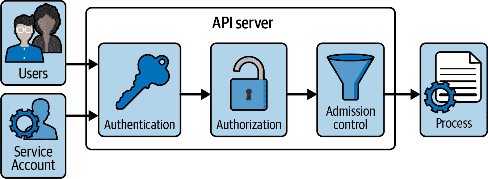
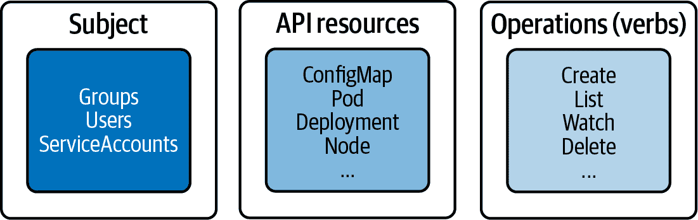
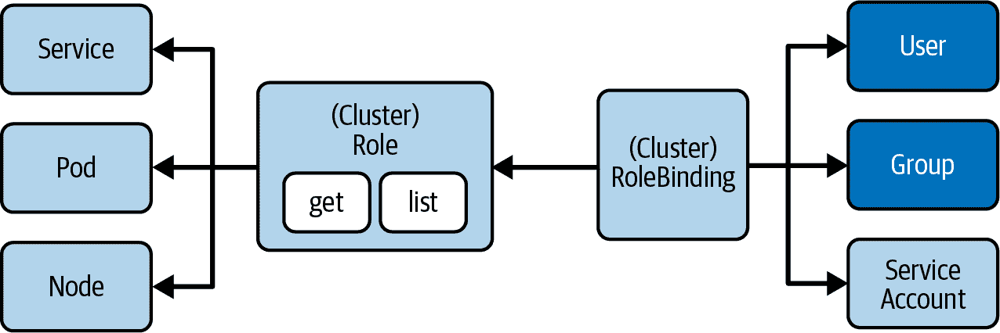
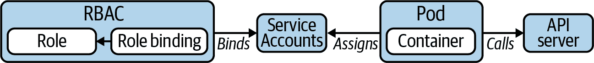

# 第十七章：认证、授权和准入控制

API 服务器是访问 Kubernetes 集群的入口。任何人类用户、客户端（例如`kubectl`）、集群组件或服务账号都将通过 HTTPS 进行 RESTful API 调用访问 API 服务器。这是执行操作（如创建 Pod 或删除 Service）的*中心点*。

在本章中，我们将重点关注与 API 服务器相关的安全特定方面。有关 API 服务器的内部工作原理及使用 Kubernetes API 的详细讨论，请参阅 Brendan Burns 和 Craig Tracey（O’Reilly）的[*管理 Kubernetes*](https://learning.oreilly.com/library/view/managing-kubernetes/9781492033905)。

# 处理请求

图 17-1 说明了调用 API 服务器时请求经历的阶段。有关更多信息，请参阅[Kubernetes 文档](https://kubernetes.io/docs/concepts/security/controlling-access/)。



###### 图 17-1. API 服务器请求处理

请求处理的第一阶段是*认证*。认证通过检查客户端证书或持有者令牌来验证调用者的身份。如果持有者令牌与服务账号关联，则在此处进行验证。

第二阶段确定第一阶段提供的身份是否可以访问动词和 HTTP 路径请求。因此，第二阶段处理请求的*授权*，使用标准的 Kubernetes RBAC 模型实现。在这里，我们确保服务账号被允许列出 Pod 或者在请求时创建新的 Service 对象。

请求处理的第三阶段涉及*准入控制*。准入控制验证请求是否格式良好或可能需要在处理请求之前进行修改。例如，准入控制策略可以确保创建 Pod 的请求包含特定标签的定义。如果请求未定义标签，则请求将被拒绝。

# 使用 kubectl 进行认证

开发人员通过运行`kubectl`命令行工具与 Kubernetes API 进行交互。每当使用`kubectl`执行命令时，需要通过 HTTPS 调用 API 服务器进行身份验证。

## Kubeconfig

用于`kubectl`的凭证存储在文件*$HOME/.kube/config*中，也称为*kubeconfig 文件*。kubeconfig 文件定义了我们希望与之交互的集群的 API 服务器端点，以及注册到集群的用户列表，包括其客户端证书形式的凭证。给定命名空间的集群与用户之间的映射称为*上下文*。`kubectl`使用当前选择的上下文来确定要与之通信的集群以及要使用的凭证。

###### 注意

你可以将环境变量 `KUBECONFIG` 指向一组 kubeconfig 文件。在运行时，`kubectl` 将合并定义的 kubeconfig 文件集的内容并使用它们。默认情况下，`KUBECONFIG` 未设置并且会回退到 *$HOME/.kube/config*。

示例 17-1 展示了一个 kubeconfig 文件。请注意，示例中分配的文件路径是特定于用户的，在您自己的环境中可能会有所不同。你可以在 [Config resource type](https://kubernetes.io/docs/reference/config-api/kubeconfig.v1/) API 文档中找到所有可配置属性的详细描述。

##### 示例 17-1\. 一个 kubeconfig 文件

```
apiVersion: v1
kind: Config
clusters:                   
- cluster:
    certificate-authority: /Users/bmuschko/.minikube/ca.crt
    extensions:
    - extension:
        last-update: Mon, 09 Oct 2023 07:33:01 MDT
        provider: minikube.sigs.k8s.io
        version: v1.30.1
      name: cluster_info
    server: https://127.0.0.1:63709
  name: minikube
contexts:                   
- context:
    cluster: minikube
    user: bmuschko
  name: bmuschko
- context:
    cluster: minikube
    extensions:
    - extension:
        last-update: Mon, 09 Oct 2023 07:33:01 MDT
        provider: minikube.sigs.k8s.io
        version: v1.30.1
      name: context_info
    namespace: default
    user: minikube
  name: minikube
current-context: minikube   
preferences: {}
users:                      
- name: bmuschko
  user:
    client-key-data: <REDACTED>
- name: minikube
  user:
    client-certificate: /Users/bmuschko/.minikube/profiles/minikube/client.crt
    client-key: /Users/bmuschko/.minikube/profiles/minikube/client.key
```


集群及其 API 服务器端点的参考名称列表。


上下文的参考名称列表（集群和用户的组合）。


当前选择的上下文。


用户及其凭据的参考名称列表。

用户管理由集群管理员处理。管理员创建一个代表开发者的用户，并将相关信息（用户名和凭据）交给希望通过 `kubectl` 与集群交互的人类。另外，也可以通过外部身份提供者（例如 [OpenID Connect](https://kubernetes.io/docs/reference/access-authn-authz/authentication/#openid-connect-tokens)）集成以进行身份验证。

手动创建新用户包括多个步骤，如 [Kubernetes documentation](https://kubernetes.io/docs/reference/access-authn-authz/certificate-signing-requests/#normal-user) 所述。然后，开发者将用户添加到旨在与集群交互的机器上的 kubeconfig 文件中。

## 使用 kubectl 管理 Kubeconfig

不需要手动编辑 kubeconfig 文件以更改或添加配置。`Kubectl` 提供了用于读取和修改其内容的命令。以下命令提供了概述。你可以在 [kubectl cheatsheet](https://kubernetes.io/docs/reference/kubectl/cheatsheet/#kubectl-context-and-configuration) 中找到更多命令示例。

要查看 kubeconfig 文件（们）的合并内容，请运行以下命令：

```
$ kubectl config view
apiVersion: v1
kind: Config
clusters:
...

```

要渲染当前选择的上下文，请使用 `current-context` 子命令。上下文名称为 `minikube` 是当前活动的。

```
$ kubectl config current-context
minikube

```

要更改上下文，请使用 `use-context` 子命令并提供名称。在这里，我们正在切换到上下文 `bmuschko`：

```
$ kubectl config use-context bmuschko
Switched to context "bmuschko".

```

要使用`set-credentials`子命令向 kubeconfig 文件注册用户，请选择分配用户名`myuser`并通过提供相应的 CLI 标志指向客户端证书：

```
$ kubectl config set-credentials myuser \
  --client-key=myuser.key --client-certificate=myuser.crt \
  --embed-certs=true

```

对于考试，请熟悉`kubectl config`命令。考试中的每个任务都要求您使用特定的上下文和/或命名空间。

# 基于角色的访问控制授权

我们了解到，API 服务器将尝试通过验证提供的凭据来认证使用`kubectl`发送的任何请求。经过认证的请求将需要根据分配给请求者的权限进行检查。API 处理工作流程的授权阶段检查操作是否允许针对请求的 API 资源进行。

在 Kubernetes 中，可以使用基于角色的访问控制（RBAC）来控制这些权限。简而言之，RBAC 通过允许或禁止对管理 API 资源的访问来定义用户、组和服务账户的策略。对于强调安全性的任何组织来说，启用和配置 RBAC 是强制性的。

设置权限是集群管理员的责任。在接下来的章节中，我们将简要讨论 RBAC 对来自用户和服务账户请求的影响。

## RBAC 概述

RBAC 有助于实现各种用例：

+   建立一个系统，使具有不同角色的用户能够访问一组 Kubernetes 资源

+   控制在 Pod 中运行的进程（与服务账户相关联）并对 Kubernetes API 执行操作

+   限制每个命名空间内某些资源的可见性

RBAC 由三个关键构建块组成，如图 17-2 所示。它们将 API 基元及其允许的操作连接到所谓的主体，这可以是用户、组或服务账户。



###### 图 17-2\. RBAC 关键构建块

每个块的责任如下：

主体

想要访问资源的用户或服务账户

资源

Kubernetes API 资源类型（例如 Deployment 或节点）

动词

可对资源执行的操作（例如创建 Pod 或删除 Service）

## 理解 RBAC API 基元

在掌握了这些关键概念后，让我们来看看实现 RBAC 功能的 Kubernetes API 基元：

角色

角色 API 基元声明了规则应在特定命名空间内操作的 API 资源及其操作。例如，您可能希望说“允许列出和删除 Pod”，或者可以表达“允许监视 Pod 的日志”，或者两者兼而有之。任何未明确说明的操作在绑定到主体后即被禁止。

RoleBinding

RoleBinding API 原语*将* Role 对象绑定到特定命名空间中的主体。这是使规则生效的关键。例如，您可能想说“将允许更新服务的角色绑定到用户约翰·多伊。”

图 17-3 显示了涉及的 API 原语之间的关系。请注意，该图像仅呈现了选定的 API 资源类型和操作列表。



###### 图 17-3\. RBAC 原语

以下各节演示了角色和 RoleBindings 的命名空间范围使用，但相同的操作和属性适用于讨论的“命名空间范围和集群范围的 RBAC” 中的集群范围角色和 RoleBindings。

## 默认用户可见角色

Kubernetes 定义了一组默认角色。您可以通过 RoleBinding 分配它们给主体，或根据需要定义自己的自定义角色。表 17-1 描述了默认的用户可见角色。

表 17-1\. 默认的用户可见角色

| 默认 ClusterRole | 描述 |
| --- | --- |
| cluster-admin | 允许跨所有命名空间读取和写入资源。 |
| admin | 允许在命名空间内读取和写入资源，包括角色和角色绑定。 |
| edit | 允许在命名空间内读取和写入资源，除了角色和角色绑定。提供对 Secrets 的访问权限。 |
| view | 允许在命名空间内只读访问资源，除了角色、角色绑定和 Secrets。 |

要定义新的角色和 RoleBindings，您必须使用允许创建或修改它们的上下文，即 cluster-admin 或 admin。

## 创建角色

可以使用`create role`命令声明性地创建角色。该命令的最重要选项是`--verb`用于定义动词（即操作），以及`--resource`用于声明 API 资源列表（核心原语以及自定义资源定义）。以下命令创建了一个新的角色，用于资源 Pod、Deployment 和 Service，并分别使用动词`list`、`get` 和 `watch`：

```
$ kubectl create role read-only --verb=list,get,watch \
  --resource=pods,deployments,services
role.rbac.authorization.k8s.io/read-only created

```

对于单个声明性`create role`命令声明多个动词和资源，可以作为相应命令行选项的逗号分隔列表或多个参数进行声明。例如，`--verb=list,get,watch` 和 `--verb=list --verb=get --verb=watch` 执行相同的指令。您还可以使用通配符“*”来指代所有动词或资源。

命令行选项`--resource-name`指定了一个或多个策略规则应适用的对象名称。Pod 的名称可以是`nginx`，可以在此处列出其名称。提供资源名称列表是可选的。如果未提供任何名称，则提供的规则将适用于资源类型的所有对象。

声明式方法可能会变得有些冗长。如在 示例 17-2 中所示，`rules` 部分列出了资源和动词。具有 API 组的资源（例如使用 API 版本 `apps/v1` 的 Deployments）需要在 `apiGroups` 属性下显式声明它。所有其他资源（例如 Pods 和 Services）只需使用空字符串，因为它们的 API 版本不包含组。请注意，创建 Role 的命令是命令式的，会自动确定 API 组。

##### 示例 17-2. 定义 Role 的 YAML 清单

```
apiVersion: rbac.authorization.k8s.io/v1
kind: Role
metadata:
  name: read-only
rules:
- apiGroups:
  - ""
  resources:
  - pods
  - services
  verbs:
  - list
  - get
  - watch
- apiGroups:      
  - apps
  resources:
  - deployments
  verbs:
  - list
  - get
  - watch
```


任何属于 API 组的资源都需要作为显式规则列出，除了不属于 API 组的 API 资源之外。

## 列出角色

创建 Role 后，可以列出其对象。角色列表仅显示名称和创建时间戳。列出的每个角色都不会透露任何详细信息：

```
$ kubectl get roles
NAME        CREATED AT
read-only   2021-06-23T19:46:48Z

```

## 渲染角色详情

您可以使用 `describe` 命令检查 Role 的详细信息。输出显示将资源映射到其允许的动词的表格：

```
$ kubectl describe role read-only
Name:         read-only
Labels:       <none>
Annotations:  <none>
PolicyRule:
  Resources         Non-Resource URLs  Resource Names  Verbs
  ---------         -----------------  --------------  -----
  pods              []                 []              [list get watch]
  services          []                 []              [list get watch]
  deployments.apps  []                 []              [list get watch]

```

由于此集群没有创建资源，因此以下控制台输出中的资源名称列表当前为空。

## 创建 RoleBindings

创建 RoleBinding 对象的命令是 `create rolebinding`。要将角色绑定到 RoleBinding，使用 `--role` 命令行选项。可以通过声明选项 `--user`、`--group` 或 `--serviceaccount` 来分配主体类型。以下命令创建了名为 `read-only-binding` 的 RoleBinding，并绑定到名为 `bmuschko` 的用户：

```
$ kubectl create rolebinding read-only-binding --role=read-only --user=bmuschko
rolebinding.rbac.authorization.k8s.io/read-only-binding created

```

示例 17-3 展示了表示 RoleBinding 的 YAML 清单。从结构中可以看出，一个角色可以映射到一个或多个主体。数组的数据类型由 `subjects` 属性下的破折号字符表示。目前只有用户 `bmuschko` 被分配。

##### 示例 17-3. 定义 RoleBinding 的 YAML 清单

```
apiVersion: rbac.authorization.k8s.io/v1
kind: RoleBinding
metadata:
  name: read-only-binding
roleRef:
  apiGroup: rbac.authorization.k8s.io
  kind: Role
  name: read-only
subjects:
- apiGroup: rbac.authorization.k8s.io
  kind: User
  name: bmuschko
```

## 列出 RoleBindings

RoleBindings 列表显示的最重要信息是关联的 Role。以下命令显示 RoleBinding `read-only-binding` 已映射到 Role `read-only`：

```
$ kubectl get rolebindings
NAME                ROLE             AGE
read-only-binding   Role/read-only   24h

```

输出不提供主体的指示。您需要渲染对象的详细信息以获取更多信息，如下一节所述。

## 渲染 RoleBinding 详情

RoleBindings 可以使用 `describe` 命令进行检查。输出显示一个主体和分配的角色的表格。以下示例显示了名为 `read-only-binding` 的 RoleBinding 的描述表示：

```
$ kubectl describe rolebinding read-only-binding
Name:         read-only-binding
Labels:       <none>
Annotations:  <none>
Role:
  Kind:  Role
  Name:  read-only
Subjects:
  Kind  Name      Namespace
  ----  ----      ---------
  User  bmuschko

```

## 查看 RBAC 规则生效情况

现在，让我们看看 Kubernetes 如何为我们迄今设置的场景执行 RBAC 规则。首先，我们将使用 `cluster-admin` 权限创建一个新的部署。在 Minikube 中，默认情况下上下文 `minikube` 拥有这些权限：

```
$ kubectl config current-context
minikube
$ kubectl create deployment myapp --image=:1.25.2 --port=80 --replicas=2
deployment.apps/myapp created

```

现在，我们将切换到用户 `bmuschko` 的上下文：

```
$ kubectl config use-context bmuschko-context
Switched to context "bmuschko-context".

```

请记住，用户 `bmuschko` 被允许列出部署。我们将使用 `get deployments` 命令来验证：

```
$ kubectl get deployments
NAME    READY   UP-TO-DATE   AVAILABLE   AGE
myapp   2/2     2            2           8s

```

RBAC 规则仅允许列出部署、Pod 和服务。以下命令尝试列出 ReplicaSets，结果将导致错误：

```
$ kubectl get replicasets
Error from server (Forbidden): replicasets.apps is forbidden: User "bmuschko" \
cannot list resource "replicasets" in API group "apps" in the namespace "default"

```

当尝试使用除 `list`、`get` 或 `watch` 之外的动词时，可以观察到类似的行为。以下命令尝试删除一个部署：

```
$ kubectl delete deployment myapp
Error from server (Forbidden): deployments.apps "myapp" is forbidden: User \
"bmuschko" cannot delete resource "deployments" in API group "apps" in the \
namespace "default"

```

在任何时候，您都可以使用 `auth can-i` 命令检查用户的权限。该命令可以让您列出所有权限或检查特定权限：

```
$ kubectl auth can-i --list --as bmuschko
Resources          Non-Resource URLs   Resource Names   Verbs
...
pods               []                  []               [list get watch]
services           []                  []               [list get watch]
deployments.apps   []                  []               [list get watch]
$ kubectl auth can-i list pods --as bmuschko
yes

```

## 命名空间范围和集群范围的 RBAC

Roles 和 RoleBindings 适用于特定的命名空间。在创建这两个对象时，您将不得不指定命名空间。有时，一组 Roles 和 RoleBindings 需要应用到多个命名空间，甚至整个集群。对于集群范围的定义，Kubernetes 提供了 API 资源类型 ClusterRole 和 ClusterRoleBinding。配置元素实际上是相同的。唯一的区别是 `kind` 属性的值：

+   要定义集群范围的角色，请使用命令 `clusterrole` 或在 YAML 清单中使用类型 `ClusterRole`。

+   要定义集群范围的 RoleBinding，请使用命令 `clusterrolebinding` 或在 YAML 清单中使用类型 `ClusterRoleBinding`。

ClusterRoles 和 ClusterRoleBindings 不仅为命名空间资源设置了集群范围的权限，还可以用于设置非命名空间资源（如 CRD 和节点）的权限。

# 使用服务账户工作

我们一直在使用 `kubectl` 可执行文件来对 Kubernetes 集群执行操作。在幕后，其实现通过对暴露的端点进行 HTTP 调用来调用 API 服务器。一些运行在 Pod 内部的应用程序可能也需要与 API 服务器通信。例如，该应用程序可能请求特定的集群节点信息或可用的命名空间。

Pod 可以通过认证令牌使用服务账户与 API 服务器进行身份验证。Kubernetes 管理员通过 RBAC 为服务账户分配规则，以授权访问特定资源和操作，如 图 17-4 所示。



###### 图 17-4\. 使用服务账户与 API 服务器通信

Pod 不一定需要参与此过程。其他用例需要在 Kubernetes 集群外部利用服务账户。例如，您可能希望在 CI/CD 管道自动化步骤中与 API 服务器通信。服务账户可以提供凭据来与 API 服务器进行身份验证。

## 默认服务账户

到目前为止，我们还没有为 Pod 定义服务账户。如果没有显式分配，Pod 将使用与未经身份验证用户相同权限的 [`default` service account](https://kubernetes.io/docs/concepts/security/service-accounts/#default-service-accounts)。这意味着 Pod 无法查看或修改集群状态，也不能列出或修改其任何资源。但 `default` 服务账户可以通过分配的 `system:discovery` 角色请求基本集群信息。

您可以使用子命令 `serviceaccounts` 查询可用的服务账户。您应该只看到输出中列出的 `default` 服务账户。

```
$ kubectl get serviceaccounts
NAME      SECRETS   AGE
default   0         4d

```

尽管可以执行 `kubectl` 操作删除 `default` 服务账户，但 Kubernetes 会立即重新实例化该服务账户。

## 创建服务账户

您可以使用命令式和声明式方法创建自定义服务账户对象。此命令创建一个名为 `cicd-bot` 的服务账户对象。这里的假设是使用此服务账户进行由 CI/CD 管道发起的对 API 服务器的调用：

```
$ kubectl create serviceaccount cicd-bot
serviceaccount/cicd-bot created

```

您还可以以清单的形式表示服务账户。在其最简单形式中，定义指定了 `ServiceAccount` 种类和名称，如 示例 17-4 所示。

##### 示例 17-4\. 用于服务账户的 YAML 清单

```
apiVersion: v1
kind: ServiceAccount
metadata:
  name: cicd-bot
```

您可以为服务账户设置一些[配置选项](https://kubernetes.io/docs/tasks/configure-pod-container/configure-service-account/)。例如，当将服务账户分配给 Pod 时，您可能希望禁用自动挂载身份验证令牌。尽管您在考试中不需要理解这些配置选项，但通过阅读 Kubernetes 文档深入了解安全最佳实践是明智的选择。

## 为服务账户设置权限

重要的是仅限制必要应用程序功能的服务账户权限。接下来的章节将解释如何实现此目标，以尽量减少潜在的攻击面。

要使此场景正常工作，您需要创建一个 ServiceAccount 对象并将其分配给 Pod。可以将服务账户与 RBAC 配置并通过 Role 和 RoleBinding 分配角色，以定义它们应执行的操作。

### 将服务账户绑定到 Pod

作为起点，我们将设置一个 Pod，通过调用 Kubernetes API 列出命名空间 `k97` 中的所有 Pods 和 Deployments。该调用作为每十秒无限循环的一部分执行。来自 API 调用的响应将写入标准输出，可通过 Pod 的日志访问。

# 访问 API 服务器端点

从 Pod 访问 Kubernetes API 很简单。不必使用 API 服务器 Pod 的 IP 地址和端口，只需直接引用名为 `kubernetes.default.svc` 的 Service 即可。这个特殊的 Service 存在于 `default` 命名空间，并且由集群自动创建。

要对 API 服务器进行身份验证，我们将发送与 Pod 使用的服务账号关联的令牌。服务账号的默认行为是在路径 */var/run/secrets/kubernetes.io/serviceaccount/token* 上自动挂载 API 凭据。我们只需使用 `cat` 命令行工具获取文件内容，并将其作为 HTTP 请求的标头发送。示例 17-5 在单个 YAML 清单文件 *setup.yaml* 中定义了命名空间、服务账号和 Pod。

##### 示例 17-5\. 分配服务账号给 Pod 的 YAML 清单

```
apiVersion: v1
kind: Namespace
metadata:
  name: k97
---
apiVersion: v1
kind: ServiceAccount
metadata:
  name: sa-api
  namespace: k97
---
apiVersion: v1
kind: Pod
metadata:
  name: list-objects
  namespace: k97
spec:
  serviceAccountName: sa-api   
  containers:
  - name: pods
    image: alpine/curl:3.14
    command: ['sh', '-c', 'while true; do curl -s -k -m 5 -H \
              "Authorization: Bearer $(cat /var/run/secrets/kubernetes.io/ \
              serviceaccount/token)" https://kubernetes.default.svc.cluster. \
              local/api/v1/namespaces/k97/pods; sleep 10; done']   
  - name: deployments
    image: alpine/curl:3.14
    command: ['sh', '-c', 'while true; do curl -s -k -m 5 -H \
              "Authorization: Bearer $(cat /var/run/secrets/kubernetes.io/ \
              serviceaccount/token)" https://kubernetes.default.svc.cluster. \
              local/apis/apps/v1/namespaces/k97/deployments;
              sleep 10; done']                                     
```


使用名称引用的服务账号，用于与 Kubernetes API 通信。


执行 API 调用以获取命名空间 `k97` 中 Pod 的列表。


执行 API 调用以获取命名空间 `k97` 中部署的列表。

使用以下命令从 YAML 清单创建对象：

```
$ kubectl apply -f setup.yaml
namespace/k97 created
serviceaccount/sa-api created
pod/list-objects created

```

### 验证默认权限

名为 `list-objects` 的 Pod 在专用容器中调用 API 服务器以获取 Pod 和 Deployments 的列表。容器 `pods` 执行调用以列出 Pods。容器 `deployments` 向 API 服务器发送请求以列出 Deployments。

如 [Kubernetes 文档](https://oreil.ly/gBp30) 中所述，默认的 RBAC 策略不授予 `kube-system` 命名空间外的服务账号任何权限。容器 `pods` 和 `deployments` 的日志返回一个错误消息，指示服务账号 `sa-api` 未经授权列出资源：

```
$ kubectl logs list-objects -c pods -n k97
{
  "kind": "Status",
  "apiVersion": "v1",
  "metadata": {},
  "status": "Failure",
  "message": "pods is forbidden: User \"system:serviceaccount:k97:sa-api\" \
              cannot list resource \"pods\" in API group \"\" in the \
              namespace \"k97\"",
  "reason": "Forbidden",
  "details": {
    "kind": "pods"
  },
  "code": 403
}
$ kubectl logs list-objects -c deployments -n k97
{
  "kind": "Status",
  "apiVersion": "v1",
  "metadata": {},
  "status": "Failure",
  "message": "deployments.apps is forbidden: User \
              \"system:serviceaccount:k97:sa-api\" cannot list resource \
              \"deployments\" in API group \"apps\" in the namespace \
              \"k97\"",
  "reason": "Forbidden",
  "details": {
    "group": "apps",
    "kind": "deployments"
  },
  "code": 403
}

```

接下来，我们将创建一个带有必要 API 权限的 Role 和 RoleBinding 对象。

### 创建角色

首先在 `role.yaml` 文件中定义名为 `list-pods-role` 的角色，如 示例 17-6 所示。该规则集仅添加 Pod 资源和动词 `list`。

##### 示例 17-6\. 允许列出 Pods 的 Role 的 YAML 清单

```
apiVersion: rbac.authorization.k8s.io/v1
kind: Role
metadata:
  name: list-pods-role
  namespace: k97
rules:
- apiGroups: [""]
  resources: ["pods"]
  verbs: ["list"]
```

通过指向相应的 YAML 清单文件创建对象：

```
$ kubectl apply -f role.yaml
role.rbac.authorization.k8s.io/list-pods-role created

```

### 创建 RoleBinding

示例 17-7 定义了 `rolebinding.yaml` 文件中 RoleBinding 的 YAML 清单。RoleBinding 将角色 `list-pods-role` 映射到名为 `sa-pod-api` 的服务账号，并且仅适用于命名空间 `k97`。

##### 示例 17-7\. 附加到服务账户的 RoleBinding 的 YAML 清单

```
apiVersion: rbac.authorization.k8s.io/v1
kind: RoleBinding
metadata:
  name: serviceaccount-pod-rolebinding
  namespace: k97
subjects:
- kind: ServiceAccount
  name: sa-api
roleRef:
  kind: Role
  name: list-pods-role
  apiGroup: rbac.authorization.k8s.io
```

使用`apply`命令创建两个 RoleBinding 对象：

```
$ kubectl apply -f rolebinding.yaml
rolebinding.rbac.authorization.k8s.io/serviceaccount-pod-rolebinding created

```

### 验证授予的权限

给予`list`权限后，服务账户现在能够正确地检索`k97`命名空间中的所有 Pods。`pods`容器中的`curl`命令成功执行，如下输出所示：

```
$ kubectl logs list-objects -c pods -n k97
{
  "kind": "PodList",
  "apiVersion": "v1",
  "metadata": {
    "resourceVersion": "628"
  },
  "items": [
      {
        "metadata": {
          "name": "list-objects",
          "namespace": "k97",
          ...
      }
  ]
}

```

我们未授予服务账户其他资源的任何权限。在`k97`命名空间中列出 Deployments 仍然失败。以下输出显示了在`deployments`命名空间中`curl`命令的响应：

```
$ kubectl logs list-objects -c deployments -n k97
{
  "kind": "Status",
  "apiVersion": "v1",
  "metadata": {},
  "status": "Failure",
  "message": "deployments.apps is forbidden: User \
              \"system:serviceaccount:k97:sa-api\" cannot list resource \
              \"deployments\" in API group \"apps\" in the namespace \
              \"k97\"",
  "reason": "Forbidden",
  "details": {
    "group": "apps",
    "kind": "deployments"
  },
  "code": 403
}

```

随意修改 Role 对象，以允许列出 Deployment 对象。

# 准入控制

处理向 Kubernetes API 服务器发出请求的最后阶段是准入控制。准入控制由准入控制器实现。准入控制器提供了在请求生效之前批准、拒绝或修改请求的方式。

可以通过 API 服务器的配置注册准入控制器。默认情况下，配置文件位于*/etc/kubernetes/manifests/kube-apiserver.yaml*。集群管理员负责管理 API 服务器配置。以下 API 服务器的命令行调用启用了名为`NamespaceLifecycle`、`PodSecurity`和`LimitRanger`的[准入控制插件](https://kubernetes.io/docs/reference/access-authn-authz/admission-controllers/#what-does-each-admission-controller-do)：

```
$ kube-apiserver --enable-admission-plugins=NamespaceLifecycle,PodSecurity,\
  LimitRanger

```

作为开发者，您无意间使用已为您配置的准入控制插件。一个例子是[LimitRanger](https://kubernetes.io/docs/reference/access-authn-authz/admission-controllers/#limitranger)和[ResourceQuota](https://kubernetes.io/docs/reference/access-authn-authz/admission-controllers/#resourcequota)，我们将在“使用限制范围”和“使用资源配额”中讨论它们。

# 概述

API 服务器处理对 Kubernetes API 的请求。每个请求都必须经过三个阶段：认证、授权和准入控制。每个阶段都可以直接终止处理过程。例如，如果请求中发送的凭据无法进行认证，则该请求将立即被丢弃。

我们查看了所有阶段的示例。认证阶段涵盖了`kubectl`作为调用 Kubernetes API 的客户端。kubeconfig 文件作为命名集群、用户及其凭据的配置源。在 Kubernetes 中，授权由 RBAC 处理。我们了解了让您为与一个或多个主体关联的 API 资源配置权限的 Kubernetes 原语。最后，我们简要介绍了准入控制的目的，并列出了一些作为验证或变异 Kubernetes API 请求控制器的插件。

# 考试要点

练习与 Kubernetes API 交互

本章展示了一些与 Kubernetes API 通信的方法。我们通过切换到用户上下文并借助 `curl` 进行了 RESTful API 调用来执行 API 请求。请自行探索 [Kubernetes API](https://kubernetes.io/docs/concepts/overview/kubernetes-api/) 及其端点，以获得更广泛的了解。

理解为用户和服务账户定义 RBAC 规则的影响

匿名用户对 Kubernetes API 的请求不会允许任何实质性操作。对来自用户或服务账户的请求，您需要仔细分析授予主体的权限。通过创建相关对象来学习定义 RBAC 规则的细节。在 Pod 中使用时，服务账户会自动挂载一个令牌。仅在打算从 Pod 中进行 API 调用时，将令牌公开为一个卷。

了解准入控制的基本需求

在考试中，您无需了解如何在 API 服务器中配置准入控制插件。开发人员与其交互，但配置任务由集群管理员负责。阅读不同的插件以更好地理解准入控制的环境。

# 样本练习

这些练习的解决方案可在 附录 A 中找到。

1.  本练习的前提是创建一个新用户并将其添加到 kubeconfig 文件中。然后，您将定义一个使用该用户的上下文，切换到该上下文，并执行一个 `kubectl` 命令。

    为名为 `mary` 的用户创建证书。不为用户提供任何权限。

    将用户添加到 kubeconfig 文件。定义名为 `mary-context` 的上下文，将用户分配到 kubeconfig 文件中已有的集群中。

    将当前选定的上下文设置为 `mary-context`。使用 `kubectl` 创建一个 Pod。您预期会看到什么结果？

1.  使用 RBAC 为服务账户授予权限。权限应仅适用于特定的 API 资源和操作。

    创建一个名为 `t23` 的新命名空间。在命名空间 `t23` 中创建一个名为 service-list 的 Pod。容器使用镜像 `alpine/curl:3.14`，并在无限循环中对 Kubernetes API 进行 `curl` 调用。

    创建并附加服务账户 `api-call` 到 Pod。

    启动 Pod 后，检查容器日志。您预期从 `curl` 命令获得什么响应？

    为允许 Pod 所需操作的服务账户分配一个 ClusterRole 和 RoleBinding。注意 `curl` 命令的响应。

1.  确定已配置的 API 服务器准入控制器插件。

    定位 API 服务器的配置文件。

    检查定义 API 服务器准入控制器插件的命令行标志。捕获其值。
