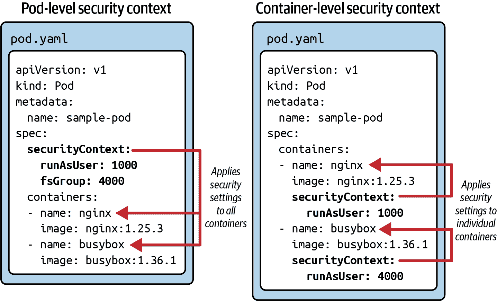
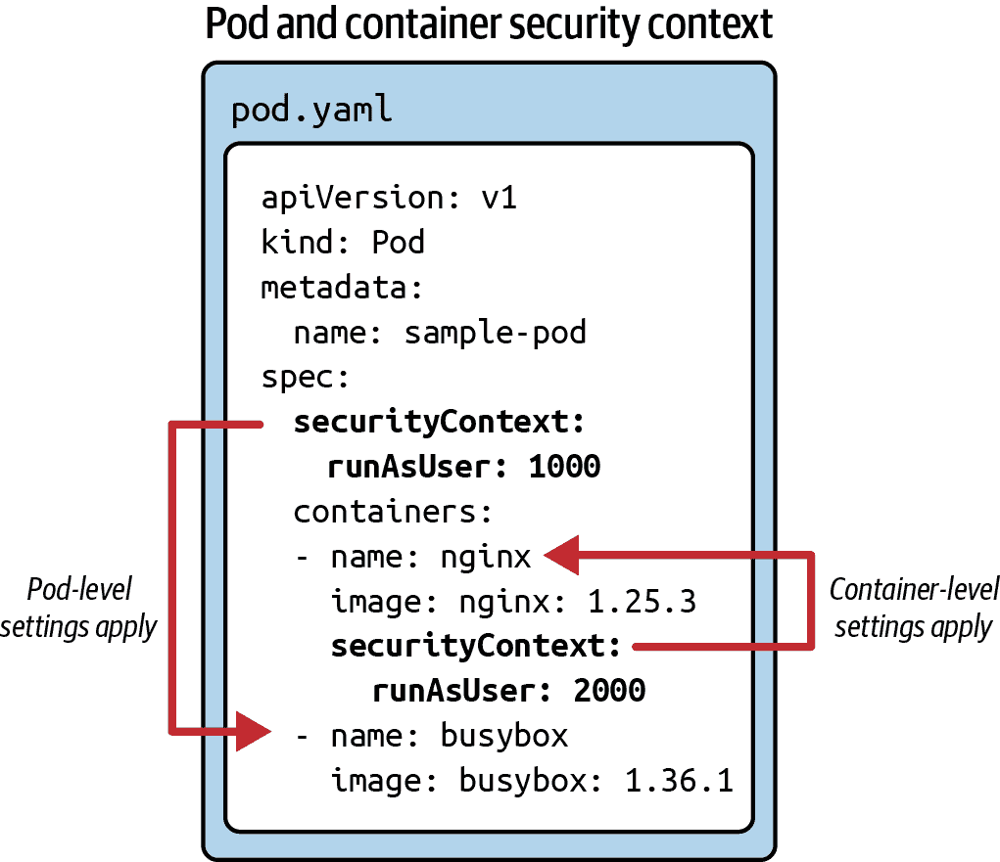

# 第二十章：安全上下文

在 Kubernetes 中运行 Pod 如果没有实施更严格的安全措施可能会造成安全风险。没有这些措施，攻击者可能会访问主机系统或执行恶意活动，例如访问包含敏感数据的文件。安全上下文定义了容器作为 Pod 规范的一部分的特权和访问控制设置。以下列表提供了一些与安全相关的参数示例：

+   应该用于运行 Pod 和/或容器的用户 ID

+   用于文件系统访问的组 ID

+   在容器内运行的进程授予根用户的一些特权，但并非全部

本章将为您提供定义安全上下文并在实践中查看其运行时效果的概述。考虑到安全设置的广泛范围，我们无法讨论所有设置。您可以在 [Kubernetes 文档](https://kubernetes.io/docs/tasks/configure-pod-container/security-context/) 中找到更多用例和配置选项。

# 使用安全上下文

安全上下文不是 Kubernetes 的基本结构。它被建模为 Pod 规范中 `securityContext` 指令下的一组属性。在 Pod 级别定义的安全设置适用于运行在 Pod 中的所有容器。当应用于单个容器时，它对其他在同一 Pod 中运行的容器没有影响。

+   您可以使用 `spec.securityContext` 属性将安全设置应用于 Pod 的所有容器。

+   对于单个容器，您可以使用 `spec.containers[].securityContext` 属性应用安全设置。

图 20-1 展示了在 Pod 和容器级别应用的 `runAsUser` 和 `fsGroup` 安全设置的使用。稍后的部分将通过示例描述这些设置的运行时效果。



###### 图 20-1\. 在 Pod 和容器级别应用安全设置

一些安全上下文属性可用于 Pod *和*容器级别。如果在两个级别上定义相同的安全上下文，则容器级别的值将优先。图 20-2 展示了对名为 `nginx` 的容器覆盖容器级安全上下文值的情况。对于该容器，将应用值 2000。



###### 图 20-2\. 在容器级别覆盖安全上下文属性

有关 Pod 级安全属性的具体信息，请参阅 [PodSecurityContext](https://kubernetes.io/docs/reference/generated/kubernetes-api/v1.28/#podsecuritycontext-v1-core) API。容器级安全属性可以在 [SecurityContext](https://kubernetes.io/docs/reference/generated/kubernetes-api/v1.28/#securitycontext-v1-core) API 中找到。

# 将安全上下文应用于 Deployment 的 Pod 模板

Deployment 的定义以与普通 Pod 定义相同的方式应用安全上下文属性。您会在 Deployment 的 Pod 模板部分使用相同的 Pod 和容器级别属性。

使用安全上下文定义与容器相关的安全参数始终限于容器。Kubernetes 生态系统提供其他改进或管理应用程序安全性的方式，其中一些直接与安全上下文概念相关。例如，您可以使用 [Pod 安全准入](https://kubernetes.io/docs/concepts/security/pod-security-admission/) 来强制执行命名空间内所有 Pod 的所需安全设置。

## 在 Pod 级别定义安全上下文

容器镜像可以定义安全相关的指令，以减少运行容器的攻击向量。默认情况下，容器以 root 特权运行，这为所有进程和容器文件系统提供了最高权限访问。作为最佳实践，应以某种方式编写相应的 `Dockerfile`，使容器将以用户 ID 0 以外的用户 ID 运行，通过 `USER` 指令的帮助。有许多其他方法可以在容器级别上保护容器，但我们在此不再详述。有关更多信息，请参考 [*Container Security*](https://learning.oreilly.com/library/view/container-security/9781492056690/)（由 Liz Rice 撰写，O’Reilly 出版）。

为了使安全上下文的功能更加透明，让我们看一个使用案例。某些镜像（例如用于开源反向代理服务器 [NGINX](https://hub.docker.com/_/nginx) 的镜像）必须以 root 用户运行。假设您希望作为合理的安全策略强制要求容器不能以 root 用户运行。在 例子 20-1 中显示的 YAML 清单将安全配置定义为 `spec` 属性的直接子级。如果要在 Pod 内运行其他容器，则 `runAsNonRoot` 设置也会适用于它们。

##### 例子 20-1\. 为 NGINX 镜像在容器级别设置安全上下文

```
apiVersion: v1
kind: Pod
metadata:
  name: nginx-non-root
spec:
  securityContext:
    runAsNonRoot: true        
  containers:
  - image: nginx:1.25.3
    name: secured-container
```


强制使用非 root 用户来运行容器。

创建 Pod 的清单将按预期工作：

```
$ kubectl apply -f container-nginx-root-user.yaml
pod/nginx-non-root created

```

不幸的是，该镜像不兼容。在启动过程中，容器失败并显示状态为 `CreateContainerConfigError`：

```
$ kubectl get pod nginx-non-root
NAME             READY   STATUS                       RESTARTS   AGE
nginx-non-root   0/1     CreateContainerConfigError   0          7s

```

您会在事件日志中找到此问题的根本原因：

```
$ kubectl describe pod nginx-non-root
...
Events:
Type     Reason     Age              From               Message
----     ------     ----             ----               -------
Normal   Scheduled  <unknown>        default-scheduler  Successfully assigned \
                                                        default/non-root to \
                                                        minikube
Normal   Pulling    18s              kubelet, minikube  Pulling image \
                                                        "nginx:1.25.3"
Normal   Pulled     14s              kubelet, minikube  Successfully pulled \
                                                        image "nginx:1.25.3"
Warning  Failed     0s (x3 over 14s) kubelet, minikube  Error: container has \
                                                        runAsNonRoot and image \
                                                        will run as root

```

有可用的替代 NGINX 镜像，不需要以 root 用户运行。一个例子是 [bitnami/nginx](https://hub.docker.com/r/bitnami/nginx)。在生成镜像的 `Dockerfile` 中仔细查看后，您会发现容器以用户 ID 1001 运行。例子 20-2 展示了使用 Bitnami 镜像的情况。

##### 例子 20-2\. 为 Bitnami NGIX 镜像在容器级别设置安全上下文

```
apiVersion: v1
kind: Pod
metadata:
  name: bitnami-ngnix-non-root
spec:
  securityContext:
    runAsNonRoot: true
  containers:
  - image: bitnami/nginx:1.25.3
    name: secured-container
```

使用 `runAsNonRoot` 指令启动容器将正常工作：

```
$ kubectl apply -f container-bitnami-nginx-root-user.yaml
pod/bitnami-ngnix-non-root created

```

容器将显示“运行”状态：

```
$ kubectl get pod nginx-non-root
NAME                     READY   STATUS    RESTARTS   AGE
bitnami-ngnix-non-root   1/1     Running   0          7s

```

容器可以以容器镜像设置的用户 ID 执行，你可以通过容器内运行以下命令轻松查看：

```
$ kubectl exec -it bitnami-ngnix-non-root -- id -u
1001

```

命令的输出呈现了用户 ID 1001，即非 root 用户 ID。

## 在容器级别定义安全上下文

在 Kubernetes 中，你可以对运行的容器施加许多其他安全限制。例如，你可能希望设置文件和目录的访问控制。假设在文件系统上创建文件时，文件的所有者应该是任意组 ID 3500。示例 20-3 中的 YAML 清单在容器级别分配了安全上下文设置。

##### 示例 20-3\. 在容器级别设置安全上下文

```
apiVersion: v1
kind: Pod
metadata:
  name: fs-secured
spec:
  containers:
  - image: nginx:1.25.3
    name: secured-container
    securityContext:
      fsGroup: 3500
    volumeMounts:
    - name: data-volume
      mountPath: /data/app
  volumes:
  - name: data-volume
    emptyDir: {}
```

从清单文件创建 Pod 对象并检查状态。Pod 应该转换为“运行”状态：

```
$ kubectl apply -f pod-file-system-group.yaml
pod/fs-secured created
$ kubectl get pods
NAME         READY   STATUS    RESTARTS   AGE
fs-secured   1/1     Running   0          24s

```

你可以轻松验证设置文件系统组 ID 的效果。打开容器的交互式 shell，进入挂载的卷，并创建一个新文件：

```
$ kubectl exec -it fs-secured -- /bin/sh
# cd /data/app
# touch logs.txt
# ls -l
-rw-r--r-- 1 root 3500 0 Jul  9 01:41 logs.txt

```

检查文件所有权将显示自动分配的组 ID 3500。

## 在 Pod 和容器级别定义安全上下文

最后，让我们演示在容器级别覆盖行为，如果已在 Pod 级别定义相同的属性。示例 20-4 展示了在两个级别上都定义 `runAsNonRoot` 的定义。

##### 示例 20-4\. 在 Pod 和容器级别设置安全上下文

```
apiVersion: v1
kind: Pod
metadata:
  name: non-root-user-override
spec:
  securityContext:
    runAsNonRoot: true            
  containers:
  - image: nginx:1.25.3
    name: root
    securityContext:
      runAsNonRoot: false         
  - image: bitnami/nginx:1.25.3
    name: non-root
```


将默认值 `true` 分配给 Pod 的所有容器。


即使在 Pod 级别分配了 `true`，值为 `false` 仍然优先。

从清单文件创建 Pod 对象：

```
$ kubectl apply -f pod-non-root-user-override.yaml
pod/non-root-user-override created

```

打开容器的交互式 shell 并执行命令来查看运行容器的用户 ID：

```
$ kubectl exec -it -c root non-root-user-override -- id -u
0
$ kubectl exec -it -c non-root non-root-user-override -- id -u
1001

```

容器 `root` 返回值 0，即 root 用户的用户 ID。容器 `non-root` 返回用户 ID 1001，这是容器镜像本身设置的 ID。

# 总结

对 Pod 实施安全最佳实践非常重要。本章介绍了安全上下文概念。借助安全上下文，你可以控制容器访问对象（如文件）、在特权和非特权模式下运行容器、指定 Linux 权限等。

可以在 Pod 和容器级别声明安全上下文。Pod 级别将提供的安全设置应用于 Pod 中的所有容器。容器级别仅适用于各个容器。如果在两个级别上都指定了相同属性值，则容器级别的安全设置将覆盖 Pod 级别的安全设置。

# 考试要点

尝试安全上下文可用的选项

Kubernetes 用户文档和 API 文档是探索安全上下文选项的良好起点。您会发现通过 PodSecurityContext 和 SecurityContext API 可用的选项存在重叠。在解决由安全上下文选项解决的不同用例时，请通过运行应允许或不允许的操作来验证其结果。

理解在 Pod 和容器级别定义安全上下文的影响。

您可以在 Pod 级别使用`spec.securityContext`定义安全上下文，在容器级别使用`spec.containers[].securityContext`定义。如果在 Pod 级别定义，设置可以通过在容器级别指定不同值来覆盖。考试可能会遇到在两个级别上都设置安全上下文的现有 Pods。理解哪个值将生效。

# 样例练习

这些练习的解决方案可以在附录 A 中找到。

1.  定义一个名为`busybox-security-context`的 Pod，使用镜像`busybox:1.36.1`，其中单个容器运行命令`sh -c sleep 1h`。

    添加一个类型为`emptyDir`的临时卷。将该卷挂载到容器的*/data/test*目录下。

    定义一个安全上下文，以 1000 用户 ID、3000 组 ID 运行容器，并且文件系统组 ID 为 2000。确保容器不允许特权升级。

    创建 Pod 对象，并确保其转换为“运行”状态。

    打开运行中容器的 shell，并在目录*/data/test*中创建一个名为*logs.txt*的新文件。文件的用户 ID 和组 ID 是多少？

1.  在命名空间`h20`中创建一个名为`nginx`的部署，包括 3 个副本。Pod 模板应使用镜像`nginx:1.25.3-alpine`。

    使用安全上下文，为该 Pod 模板分配`drop` Linux 能力。`drop`能力的属性应使用值`all`。

    创建部署对象并检查其副本。NGINX 是否按预期工作？
