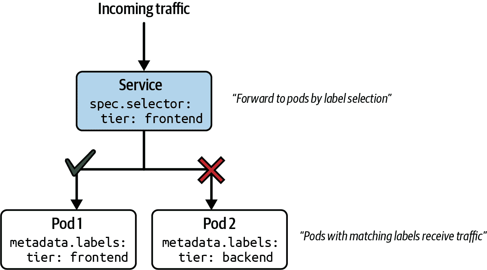
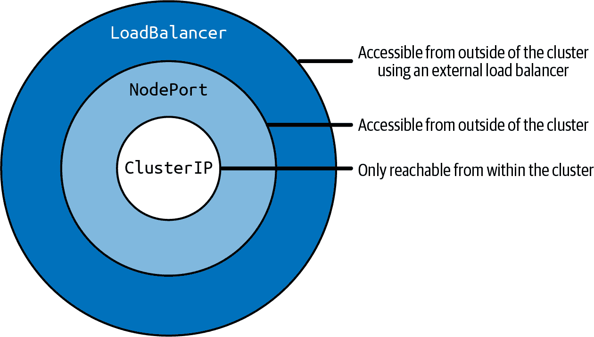
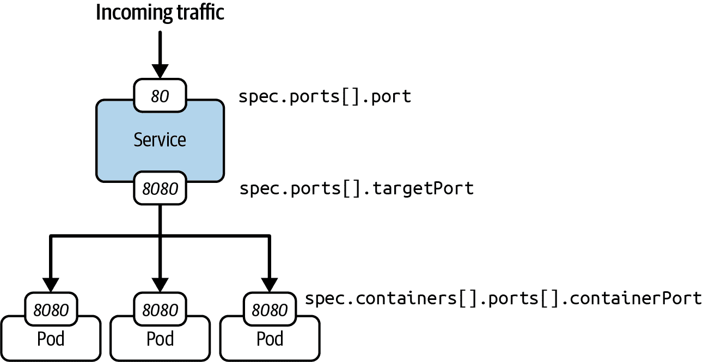
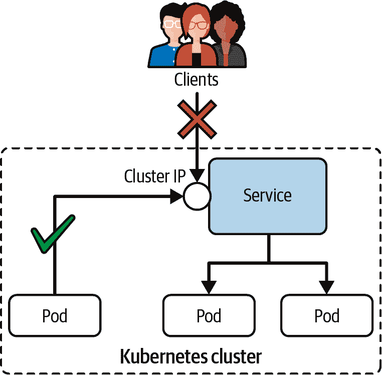
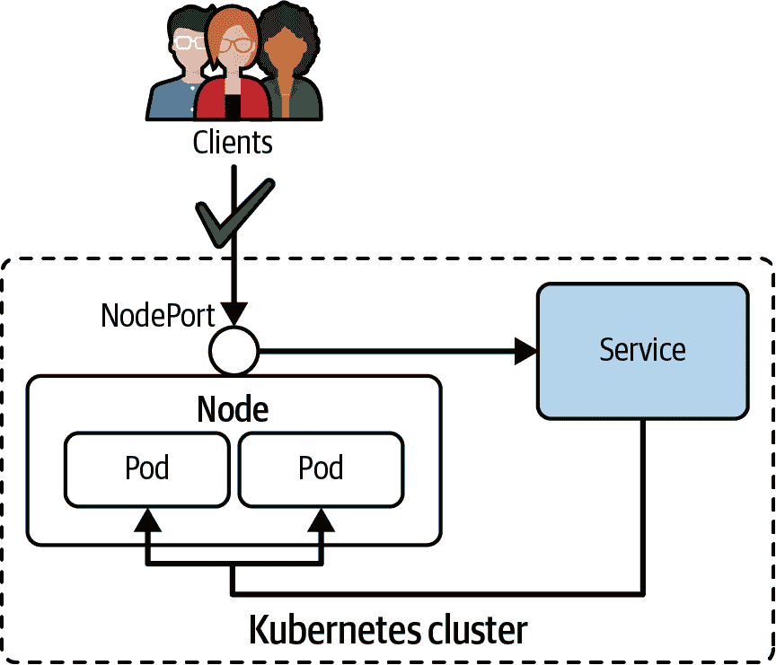
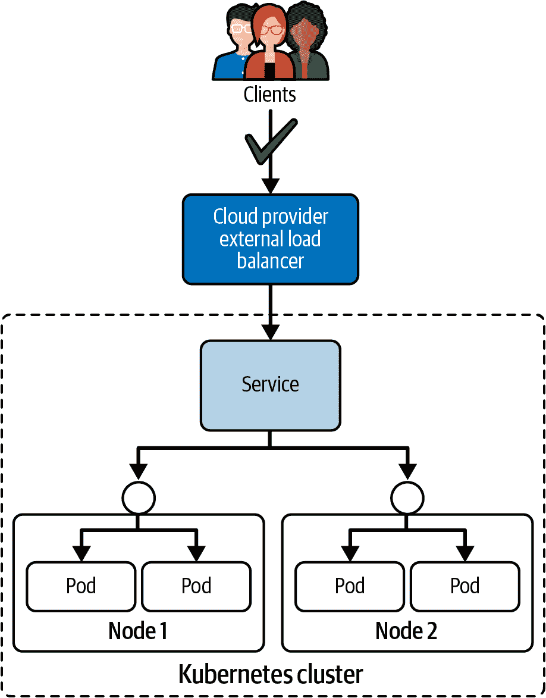

# 第二十一章：服务

在“使用 Pod 的 IP 地址进行网络通信”中，我们了解到可以通过其 IP 地址与 Pod 进行通信。重新启动 Pod 将自动分配新的虚拟集群 IP 地址。因此，如果需要彼此通信，则系统的其他部分不能依赖于 Pod 的 IP 地址。

构建微服务架构，其中每个组件在其自己的 Pod 中运行，并需要通过稳定的网络接口相互通信，需要一个不同的原语，即服务。

服务在 Pod 上实现了一个抽象层，为所有具有匹配标签的 Pod 分配一个固定的虚拟 IP，并且该虚拟 IP 称为集群 IP。本章将重点介绍服务的各个方面，尤其是基于声明类型在集群内外部暴露 Pods 的方法。

# 在 minikube 中访问服务

在 minikube 中访问类型为`NodePort`和`LoadBalancer`的服务需要特殊处理。有关详细说明，请参阅[文档](https://minikube.sigs.k8s.io/docs/handbook/accessing/#getting-the-nodeport-using-the-service-command)。

# 使用服务

简而言之，服务为一组 Pod 提供可发现的名称和负载平衡。服务利用 Kubernetes DNS 控制平面组件帮助保持对 IP 地址的不可知性，这是我们将在“通过 DNS 查找发现服务”中讨论的一个方面。类似于部署，服务通过标签选择确定其工作的 Pods。

图 21-1 说明了其功能。Pod 1 接收流量，因为其分配的标签与服务中定义的标签选择匹配。Pod 2 由于定义了不匹配的标签，因此不接收流量。



###### 图 21-1。基于标签选择的服务流量路由

请注意，可以创建一个没有标签选择器的服务来支持其他场景。有关更多信息，请参阅相关的[Kubernetes 文档](https://kubernetes.io/docs/concepts/services-networking/service/#services-without-selectors)。

# 服务与部署

服务是部署的补充概念。服务将网络流量路由到一组 Pods，而部署则管理一组 Pods，即副本。虽然可以单独使用这两个概念，但建议同时使用部署和服务。主要原因是能够扩展副本数量，并同时能够暴露端点以将网络流量引导到这些 Pods。

## 服务类型

每个服务定义了一种类型。这种类型负责在集群内部和/或外部公开服务。表 21-1 列出了与考试相关的服务类型。

表 21-1。服务类型

| 类型 | 描述 |
| --- | --- |
| `ClusterIP` | 在集群内部 IP 上公开服务。仅从集群内部可访问。Kubernetes 使用循环算法在目标 Pod 之间均匀分布流量。 |
| `NodePort` | 在每个节点的 IP 地址上以静态端口公开服务。从集群外部可访问。该服务类型不提供跨多个节点的负载均衡。 |
| `负载均衡器` | 使用云提供商的负载均衡器将服务外部化。 |

其他服务类型，例如 `ExternalName` 或无头服务，可以定义；但由于它们不在考试范围内，本书不会对它们进行详细讨论。有关更多信息，请参阅 [Kubernetes 文档](https://kubernetes.io/docs/concepts/services-networking/service/)。

### 服务类型继承

刚才提到的服务类型，`ClusterIP`、`NodePort` 和 `LoadBalancer`，使得服务在不同的暴露级别下可访问。理解这些服务类型也是至关重要的，因为它们是相互构建的。图 21-2 展示了不同服务类型之间的关系。



###### 图 21-2. 服务类型的网络可访问性特征

例如，创建一个 `NodePort` 类型的服务意味着该服务将具有 `ClusterIP` 服务类型的网络可访问性特征。反过来，`NodePort` 服务可从集群内部和外部访问。本章通过示例演示每种服务类型。在接下来的章节中，您将找到对继承的暴露行为的引用。

### 何时使用哪种服务类型？

在构建微服务架构时，一个问题是选择哪种服务类型来实现特定的使用案例。我们在这里简要讨论这个问题。

`ClusterIP` 服务类型适用于需要将微服务暴露给集群内其他 Pod 的用例。假设您有一个前端微服务需要连接一个或多个后端微服务。为了正确实现该场景，您将建立一个 `ClusterIP` 服务来路由流量到后端 Pod。然后，前端 Pod 将与该服务通信。

`NodePort`服务类型经常被提及作为一种向外部消费者暴露应用程序的方式。消费者必须知道节点的 IP 地址和静态分配的端口才能连接到服务。这对多种原因都是有问题的。首先，节点端口通常是动态分配的。因此，您通常无法预先知道它。其次，提供节点的 IP 地址将使网络流量只通过单个节点进行，因此您将无法使用负载均衡。最后，通过开放一个公开可用的节点端口，您有增加集群攻击面的风险。因为所有这些原因，`NodePort`服务主要用于开发或测试目的，而在生产环境中使用较少。

`LoadBalancer`服务类型通过外部负载均衡器提供的外部 IP 地址，使应用程序对外可用。网络流量将分布在集群中的多个节点上。这种解决方案非常适合生产环境，但请记住，每个配置的负载均衡器都会产生费用，并且可能会导致昂贵的基础设施账单。更经济有效的解决方案是使用 Ingress，在第二十二章中讨论。

## 端口映射

服务使用标签选择来确定转发流量的 Pod 集。成功路由网络流量取决于端口映射。

图 21-3 显示一个服务在端口 80 上接受传入流量。这是清单中`spec.ports[].port`属性定义的端口。任何传入的流量都将路由到目标端口，表示为`spec.ports[].targetPort`。



###### 图 21-3\. 服务端口映射

目标端口与在标签选择的 Pod 内运行的容器定义的`spec.containers[].ports[].containerPort`端口相同。在这个示例中，这是端口 8080。只有当服务的目标端口和容器端口匹配时，所选的 Pod(s) 才会接收到流量。

## 创建服务

您可以以多种方式创建服务，其中一些适合考试，因为它们提供快速的结果。首先让我们讨论命令式方法。

服务需要通过匹配标签来选择一个 Pod。以下`run`命令创建的 Pod 称为`echoserver`，它将应用暴露在容器端口 8080 上。在内部，它会自动为对象分配标签键值对`run=echoserver`：

```
$ kubectl run echoserver --image=k8s.gcr.io/echoserver:1.10 --restart=Never \
  --port=8080
pod/echoserver created
```

您可以使用`create service`命令创建一个服务对象。确保提供服务类型作为强制参数。这里我们使用类型`clusterip`。命令行选项`--tcp`指定端口映射。端口 80 将服务暴露给传入的网络流量。端口 8080 指向 Pod 暴露的容器端口：

```
$ kubectl create service clusterip echoserver --tcp=80:8080
service/echoserver created
```

使用 `run` 命令和 `--expose` 选项可以更快地创建 Pod 和 Service。以下命令一次性创建两个对象，并建立适当的标签选择。在考试中，如果要求同时创建 Pod 和 Service，此命令行选项是节省时间的好选择：

```
$ kubectl run echoserver --image=k8s.gcr.io/echoserver:1.10 --restart=Never \
  --port=8080 --expose
service/echoserver created
pod/echoserver created
```

实际上更常见的是使用一起工作的 Deployment 和 Service。以下一系列命令创建了一个具有五个副本的 Deployment，然后使用 `expose deployment` 命令实例化 Service 对象。端口映射可以通过 `--port` 和 `--target-port` 选项提供：

```
$ kubectl create deployment echoserver --image=k8s.gcr.io/echoserver:1.10 \
  --replicas=5
deployment.apps/echoserver created
$ kubectl expose deployment echoserver --port=80 --target-port=8080
service/echoserver exposed
```

示例 21-1 展示了一个以 YAML 清单形式表示的 Service。该 Service 声明了用于标签选择的键值对 `app=echoserver`，并定义了从端口 80 到 8080 的端口映射。

##### 示例 21-1\. YAML 清单定义的 Service

```
apiVersion: v1
kind: Service
metadata:
  name: echoserver
spec:
  selector:
    run: echoserver    
  ports:               
  - port: 80
    targetPort: 8080
```


选择所有带有指定标签分配的 Pods。


定义 Service 的传入和传出端口。传出端口需与所选 Pods 的容器端口匹配。

所示的 Service YAML 清单未分配显式类型。未为属性 `spec.type` 指定值的 Service 对象在创建时将默认为 `ClusterIP`。

## 服务清单

显示所有服务会呈现一个包含服务类型、集群 IP 地址、可选的外部 IP 地址以及传入端口的表视图。在这里，你可以看到我们之前创建的 `echoserver` Pod 的输出：

```
$ kubectl get services
NAME         TYPE        CLUSTER-IP      EXTERNAL-IP   PORT(S)   AGE
echoserver   ClusterIP   10.109.241.68   <none>        80/TCP    6s
```

当 Service 类型为 `ClusterIP` 时，Kubernetes 会分配一个集群 IP 地址。此类 Service 没有外部 IP 地址可用。Service 可通过端口 80 访问。

## 渲染服务详细信息

如果向一个 Service 的传入流量没有正确路由到你预期处理请求的一组 Pods，可能需要深入了解该 Service 的详细信息以进行故障排除。

`describe service` 命令呈现有关 Service 配置的宝贵信息。用于故障排除的配置是字段 Selector、IP、Port、TargetPort 和 Endpoints 的值。常见的配置错误来源是选择不正确的标签和端口分配。确保所选标签确实存在于意图将流量路由到的 Pods 中，并且 Service 的目标端口与 Pods 暴露的容器端口匹配。

查看以下 `describe` 命令的输出。这是为一个由 Deployment 控制的五个 Pods 创建的 Service 的详细信息。Endpoints 属性列出了一系列端点，每个端点对应一个 Pod：

```
$ kubectl describe service echoserver
Name:              echoserver
Namespace:         default
Labels:            app=echoserver
Annotations:       <none>
Selector:          app=echoserver
Type:              ClusterIP
IP Family Policy:  SingleStack
IP Families:       IPv4
IP:                10.109.241.68
IPs:               10.109.241.68
Port:              <unset>  80/TCP
TargetPort:        8080/TCP
Endpoints:         172.17.0.4:8080,172.17.0.5:8080,172.17.0.7:8080 + 2 more...
Session Affinity:  None
Events:            <none>
```

端点是一个可解析的网络端点，充当 Pod 的虚拟 IP 地址和容器端口。如果一个 Service 没有显示任何端点，则可能存在配置错误。

Kubernetes 通过一个专用的原始数据来表示端点，您可以对其进行查询。端点对象与实例化服务对象同时创建。以下命令列出了名为 `echoserver` 的服务的端点：

```
$ kubectl get endpoints echoserver
NAME         ENDPOINTS                                                     AGE
echoserver   172.17.0.4:8080,172.17.0.5:8080,172.17.0.7:8080 + 2 more...   8m5s
```

端点的详细信息显示了完整的 IP 地址和端口组合列表：

```
$ kubectl describe endpoints echoserver
Name:         echoserver
Namespace:    default
Labels:       app=echoserver
Annotations:  endpoints.kubernetes.io/last-change-trigger-time: \
              2021-11-15T19:09:04Z
Subsets:
  Addresses:          172.17.0.4,172.17.0.5,172.17.0.7,172.17.0.8,172.17.0.9
  NotReadyAddresses:  <none>
  Ports:
    Name     Port  Protocol
    ----     ----  --------
    <unset>  8080  TCP

Events:  <none>
```

# ClusterIP 服务类型

`ClusterIP` 是默认的服务类型。它将服务暴露在集群内部 IP 地址上。这意味着只能从运行在集群内部的 Pod 中访问服务，而不能从集群外部（例如，从您的本地机器）进行调用。图 21-4 说明了类型为 `ClusterIP` 的服务的可访问性。



###### 图 21-4\. 类型为 `ClusterIP` 的服务的可访问性

## 创建和检查服务

我们将创建一个 Pod 和相应的服务，以演示 `ClusterIP` 服务类型的运行时行为。名为 `echoserver` 的 Pod 公开容器端口 8080，并指定标签 `app=echoserver`。服务为传入流量定义端口 5005，将其转发到出口端口 8080\. 标签选择与我们设置的 Pod 匹配：

```
$ kubectl run echoserver --image=k8s.gcr.io/echoserver:1.10 --restart=Never \
  --port=8080 -l app=echoserver
pod/echoserver created
$ kubectl create service clusterip echoserver --tcp=5005:8080
service/echoserver created
```

使用命令 `kubectl get service echoserver -o yaml` 检查实时对象，将呈现分配的集群 IP 地址。示例 21-2 显示了服务运行时表示的简化版本。

##### 示例 21-2\. 运行时的 ClusterIP 服务对象

```
apiVersion: v1
kind: Service
metadata:
  name: echoserver
spec:
  type: ClusterIP          
  clusterIP: 10.96.254.0   
  selector:
    app: echoserver
  ports:
  - port: 5005
    targetPort: 8080
    protocol: TCP
```


设置为 `ClusterIP` 类型的服务。


运行时分配给服务的集群 IP 地址。

此示例中使服务可用的集群 IP 地址是 `10.96.254.0`。列出服务对象是呈现所需信息的另一种方式，以便调用服务：

```
$ kubectl get service echoserver
NAME         TYPE        CLUSTER-IP    EXTERNAL-IP   PORT(S)    AGE
echoserver   ClusterIP   10.96.254.0   <none>        5005/TCP   8s
```

接下来，我们将尝试对服务进行调用。

## 访问服务

您可以使用集群 IP 地址和传入端口组合来访问服务：10.96.254.0:5005\. 从集群外的任何其他机器上进行请求将失败，如以下 `wget` 命令所示：

```
$ wget 10.96.254.0:5005 --timeout=5 --tries=1
--2021-11-15 15:45:36--  http://10.96.254.0:5005/
Connecting to 10.96.254.0:5005... ]failed: Operation timed out.
Giving up.
```

从 Pod 内部访问服务会正确地将请求路由到与标签选择匹配的 Pod：

```
$ kubectl run tmp --image=busybox:1.36.1 --restart=Never -it --rm \
  -- wget 10.96.254.0:5005
Connecting to 10.96.254.0:5005 (10.96.254.0:5005)
saving to 'index.html'
index.html           100% |********************************|   408  0:00:00 ETA
'index.html' saved
pod "tmp" deleted

```

除了使用集群 IP 地址和端口外，您还可以通过 DNS 名称和容器可用的环境变量来发现服务。

### 通过 DNS 查找发现服务

Kubernetes 通过其名字将每个服务注册到其 DNS 服务 CoreDNS 中。在内部，CoreDNS 将服务名称存储为主机名，并将其映射到集群 IP 地址。在构建微服务架构时，通过其 DNS 名称而不是 IP 地址访问服务更加方便和表达性。

可以通过在同一命名空间中运行一个 Pod 来验证正确的服务发现，该 Pod 使用其主机名和传入端口调用 Service：

```
$ kubectl run tmp --image=busybox:1.36.1 --restart=Never -it --rm \
  -- wget echoserver:5005
Connecting to echoserver:5005 (10.96.254.0:5005)
saving to 'index.html'
index.html           100% |********************************|   408  0:00:00 ETA
'index.html' saved
pod "tmp" deleted

```

在 Pod 与位于不同命名空间中的 Service 进行调用并不罕见。仅仅引用 Service 的主机名在跨命名空间中是不起作用的。你需要追加命名空间。以下是在 `other` 命名空间中的 Pod 调用 `default` 命名空间中的 Service 的示例：

```
$ kubectl run tmp --image=busybox:1.36.1 --restart=Never -it --rm \
  -n other -- wget echoserver.default:5005
Connecting to echoserver.default:5005 (10.96.254.0:5005)
saving to 'index.html'
index.html           100% |********************************|   408  0:00:00 ETA
'index.html' saved
pod "tmp" deleted

```

Service 的完整主机名为 `echoserver.default.svc.cluster.local`。字符串 `svc` 描述了我们要通信的资源类型。CoreDNS 使用默认值 `cluster.local` 作为域名（如果需要更改，此域名是可配置的）。在与 Service 通信时，不必拼写完整的主机名。

### 通过环境变量发现 Service

对于在 Pod 中运行的应用程序，直接使用环境变量中的 Service 连接信息可能更为简单。kubelet 使每个活动 Service 的集群 IP 地址和端口作为环境变量可用。与 Service 相关的环境变量的命名约定为 `<SERVICE_NAME>_SERVICE_HOST` 和 `<SERVICE_NAME>_SERVICE_PORT`。

# Service 环境变量的可用性

确保在实例化 Pod 之前创建 Service。否则，这些环境变量将不会被填充。

通过列出容器的环境变量可以验证实际的键值对：

```
$ kubectl exec -it echoserver -- env
ECHOSERVER_SERVICE_HOST=10.96.254.0
ECHOSERVER_SERVICE_PORT=8080
...

```

Service 的名称 `echoserver` 不包含任何特殊字符。这就是为什么将其转换为环境变量键名是简单的原因；Service 名称只是简单地大写以符合环境变量命名约定。任何 Service 名称中的特殊字符（例如连字符）都将被下划线字符替换。如果要填充这些环境变量，确保在启动 Pod 前已创建了 Service。

# NodePort Service 类型

使用 `NodePort` 类型声明 Service，通过节点 IP 地址公开访问，可以从 Kubernetes 集群外部解析。节点 IP 地址可以与端口号（范围在 30000 到 32767，也称为节点端口）结合使用，该端口在创建 Service 时会自动分配。图 21-5 说明了通过 `NodePort` 类型 Service 转发流量至 Pods 的路由。



###### 图 21-5\. 使用 `NodePort` 类型的 Service 的可访问性

节点端口在集群中的每个节点上都是开放的，并且其值在集群范围内是全局且唯一的。为避免端口冲突，最好不定义确切的节点端口，而是让 Kubernetes 找到一个可用端口。

## 创建和检查 Service

下面两个命令创建了一个 Pod 和一个 `NodePort` 类型的 Service。这里唯一的区别是命令行选项中提供了 `nodeport` 而不是 `clusterip`：

```
$ kubectl run echoserver --image=k8s.gcr.io/echoserver:1.10 --restart=Never \
  --port=8080 -l app=echoserver
pod/echoserver created
$ kubectl create service nodeport echoserver --tcp=5005:8080
service/echoserver created
```

服务对象的运行时表示如示例 21-3 所示。需要指出的是，节点端口将自动分配。请记住，`NodePort`（大写*N*）是服务类型，而`nodePort`（小写*n*）是其键对应的值。

##### 示例 21-3\. 运行时的 NodePort 服务对象

```
apiVersion: v1
kind: Service
metadata:
  name: echoserver
spec:
  type: NodePort           
  clusterIP: 10.96.254.0
  selector:
    app: echoserver
  ports:
  - port: 5005
    nodePort: 30158        
    targetPort: 8080
    protocol: TCP
```


将服务类型设置为`NodePort`。


使服务从集群外部可访问的静态分配节点端口。

创建服务后，可以列出它。您会发现端口表示包含使服务可访问的静态分配端口：

```
$ kubectl get service echoserver
NAME         TYPE        CLUSTER-IP       EXTERNAL-IP   PORT(S)          AGE
echoserver   NodePort    10.101.184.152   <none>        5005:30158/TCP   5s
```

在此输出中，节点端口为 30158（通过冒号分隔可识别）。入站端口 5005 仍然可用于解析来自集群内部的服务目的。

## 访问服务

在集群内部，您仍然可以使用集群 IP 地址和端口号访问服务。此服务的行为与`ClusterIP`类型完全相同：

```
$ kubectl run tmp --image=busybox:1.36.1 --restart=Never -it --rm \
  -- wget 10.101.184.152:5005
Connecting to 10.101.184.152:5005 (10.101.184.152:5005)
saving to 'index.html'
index.html           100% |********************************|   414  0:00:00 ETA
'index.html' saved
pod "tmp" deleted

```

从集群外部，您需要使用集群中任何工作节点的 IP 地址和静态分配的端口。确定工作节点 IP 地址的一种方法是渲染节点详细信息。另一种选择是使用 Pod 的`status.hostIP`属性值，即 Pod 运行所在的工作节点的 IP 地址。

此处的节点 IP 地址为`192.168.64.15`。可用于从集群外部调用服务：

```
$ kubectl get nodes -o \
  jsonpath='{ $.items[*].status.addresses[?(@.type=="InternalIP")].address }'
192.168.64.15
$ wget 192.168.64.15:30158
--2021-11-16 14:10:16--  http://192.168.64.15:30158/
Connecting to 192.168.64.15:30158... connected.
HTTP request sent, awaiting response... 200 OK
Length: unspecified [text/plain]
Saving to: ‘index.html’
...

```

# LoadBalancer 服务类型

本书讨论的最后一种服务类型是`LoadBalancer`。这种服务类型为 Kubernetes 云提供商提供外部负载均衡器，主要用于向集群节点分发入站请求的单一 IP 地址。负载平衡策略的实现（例如轮询）由云提供商决定。

# 本地 Kubernetes 集群的负载均衡器

Kubernetes 未为本地集群提供原生负载均衡器解决方案。云提供商负责提供适当的实现。[MetalLB 项目](https://metallb.universe.tf/)旨在填补这一空白。

图 21-6 显示了`LoadBalancer`服务类型的架构概述。



###### 图 21-6\. 类型为`LoadBalancer`的服务的可访问性

如图所示，负载均衡器在不同节点之间路由流量，只要目标 Pod 满足请求的标签选择。

## 创建和检查服务

要将服务创建为负载均衡器，请在清单中将类型设置为`LoadBalancer`，或使用`create service loadbalancer`命令：

```
$ kubectl run echoserver --image=k8s.gcr.io/echoserver:1.10 --restart=Never \
  --port=8080 -l app=echoserver
pod/echoserver created
 $ kubectl create service loadbalancer echoserver --tcp=5005:8080
service/echoserver created
```

LoadBalancer Service 类型的运行时特性看起来与 NodePort Service 类型提供的类似。主要区别在于外部 IP 地址列具有值，如 Example 21-4 所示。

##### 示例 21-4. 运行时的 LoadBalancer Service 对象

```
apiVersion: v1
kind: Service
metadata:
  name: echoserver
spec:
  type: LoadBalancer            
  clusterIP: 10.96.254.0
  loadBalancer: 10.109.76.157   
  selector:
    app: echoserver
  ports:
  - port: 5005
    targetPort: 8080
    nodePort: 30158
    protocol: TCP
```


Service 类型设置为 `LoadBalancer`。


Service 在运行时分配的外部 IP 地址。

列出 Service 时会显示外部 IP 地址，示例中为 `10.109.76.157`，如以下命令所示：

```
$ kubectl get service echoserver
NAME         TYPE           CLUSTER-IP      EXTERNAL-IP     PORT(S)          AGE
echoserver   LoadBalancer   10.109.76.157   10.109.76.157   5005:30642/TCP   5s
```

由于外部负载均衡器需要由云提供商进行配置，因此直到外部 IP 地址变为可用可能需要一些时间。

## 访问 Service

要从集群外调用 Service，请使用外部 IP 地址及其入站端口：

```
$ wget 10.109.76.157:5005
--2021-11-17 11:30:44--  http://10.109.76.157:5005/
Connecting to 10.109.76.157:5005... connected.
HTTP request sent, awaiting response... 200 OK
Length: unspecified [text/plain]
Saving to: ‘index.html’
...
```

如讨论的，`LoadBalancer` Service 也可以像访问 `ClusterIP` 或 `NodePort` Service 一样访问。

# 概述

Kubernetes 为集群中的每个 Pod 分配唯一的 IP 地址。Pod 可以使用该 IP 地址彼此通信；但是，不能依赖 IP 地址随时间的稳定性。这就是 Kubernetes 提供 Service 资源类型的原因。

Service 根据标签选择和端口映射将网络流量转发到一组 Pod。每个 Service 都需要分配一个类型，该类型决定了如何从集群内部或外部访问 Service。考试相关的 Service 类型有 `ClusterIP`、`NodePort` 和 `LoadBalancer`。CoreDNS，即 Kubernetes 的 DNS 服务器，允许 Pod 从同一命名空间及其他命名空间通过主机名访问 Service。

# 考试要点

理解 Service 的目的

通过它们的 IP 地址进行 Pod 到 Pod 的通信不能保证随时间的稳定网络接口。Pod 的重新启动将会分配一个新的虚拟 IP 地址。Service 的目的是提供稳定的网络接口，以便您可以操作在 Kubernetes 集群中运行的复杂微服务架构。在大多数情况下，Pod 通过主机名调用 Service。主机名由运行在 `kube-system` 命名空间中的名为 CoreDNS 的 DNS 服务器提供。

练习如何访问每种类型的 Service

考试期望您理解 `ClusterIP`、`NodePort` 和 `LoadBalancer` 之间的差异。根据分配的类型，Service 可以从集群内部或外部访问。

解决 Service 故障排除场景

很容易配置 Service 的配置错误。任何配置错误都将导致无法将网络流量传输到预期的 Pod 集合。常见的配置错误包括不正确的标签选择和端口分配。`kubectl get endpoints` 命令将帮助您了解 Service 可以路由流量到哪些 Pod。

# 示例练习

这些练习的解决方案位于附录 A 中。

1.  创建名为`myapp`的 Service，类型为`ClusterIP`，暴露端口 80 并映射到目标端口 80。

    创建名为`myapp`的 Deployment，创建 1 个副本，运行镜像`nginx:1.23.4-alpine`。暴露容器端口 80。将 Deployment 扩展到 2 个副本。

    使用镜像`busybox:1.36.1`创建临时 Pod，并执行针对服务 IP 的`wget`命令。

    将服务类型更改为`NodePort`，以便从集群外部访问 Pod。从集群外部执行`wget`命令来访问该服务。

1.  Kate 是负责实现基于 Web 的应用程序堆栈的开发人员。她对 Kubernetes 不熟悉，并请求您的帮助。相关对象已创建；然而，无法从集群内部连接到应用程序。帮助 Kate 修复她的 YAML 清单的配置。

    导航至 GitHub 仓库[*bmuschko/ckad-study-guide*](https://github.com/bmuschko/ckad-study-guide)的已检出分支中的目录*app-a/ch21/troubleshooting*。从 YAML 清单*setup.yaml*创建对象。检查命名空间`y72`中的对象。

    在命名空间`y72`中使用镜像`busybox:1.36.1`创建临时 Pod。容器命令应调用 Service `web-app` 进行`wget`调用。`wget`调用无法成功连接到该 Service。

    确定连接问题的根本原因并加以修复。通过重复前一步骤验证正确行为。`wget`调用应返回成功响应。
