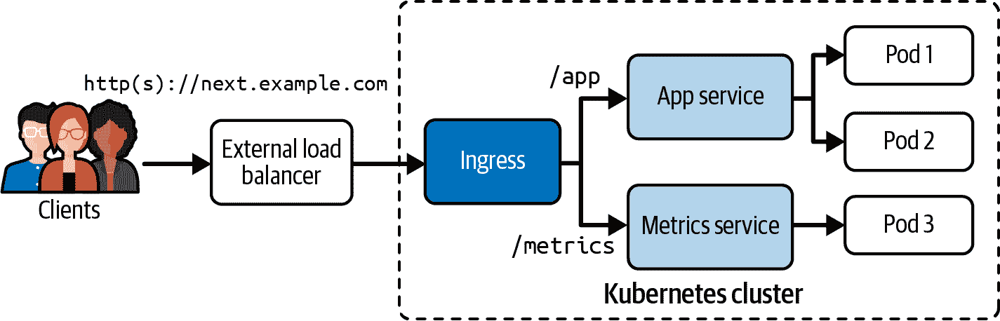

# 第二十二章：Ingress

第二十一章 探讨了服务原语的目的和创建。一旦需要将应用程序暴露给外部消费者，选择适当的服务类型变得至关重要。最实际的选择通常涉及创建类型为 LoadBalancer 的服务。这种服务通过分配给消费者外部可访问的外部 IP 地址来提供负载平衡能力，超出 Kubernetes 集群的范围。

然而，为每个外部可达的应用程序选择 LoadBalancer 服务存在缺点。在云提供商环境中，每个服务触发外部负载均衡器的配置，导致成本增加。此外，管理一组 LoadBalancer 服务对象可能会带来管理挑战，因为每个外部可访问的微服务都必须建立一个新的对象。

为了缓解这些问题，Ingress 原语发挥作用，提供一个统一的、负载均衡的应用程序堆栈入口点。Ingress 具有根据可选的、可通过 DNS 解析的主机名和 URL 上下文路径路由外部 HTTP(S) 请求到集群内一个或多个服务的能力。本章将指导您创建和访问 Ingress。

# 在 minikube 中访问 Ingress

在 minikube 中访问 Ingress 需要特别处理。请参考 Kubernetes 教程 [“在 Minikube 上使用 NGINX Ingress 控制器设置 Ingress”](https://kubernetes.io/docs/tasks/access-application-cluster/ingress-minikube/) 获取详细指南。

# 使用 Ingress

Ingress 通过外部可访问的 URL 公开 HTTP（和可选的 HTTPS）路由给客户端。与 Ingress 配置的路由规则决定了 *流量应该如何* 被路由。云提供商的 Kubernetes 环境通常会部署一个外部负载均衡器。Ingress 从负载均衡器获取公共 IP 地址。您可以配置规则，根据特定的 URL 上下文路径将流量路由到多个服务，如 图 22-1 所示。



###### 图 22-1\. 通过 HTTP(S) 管理对服务的外部访问

在 图 22-1 中描述的场景中，将 Ingress 实例化为 HTTP(S) 调用到域名“next.example.com”的唯一入口点。根据提供的 URL 上下文，Ingress 将流量定向到两个虚构服务之一：一个设计用于业务应用程序，另一个用于获取与应用程序相关的指标。

具体而言，URL 上下文路径`/app`被路由到负责管理业务应用程序的应用服务。相反，向 URL 上下文`/metrics`发送请求将导致调用被转发到能够返回相关指标的指标服务。

## 安装 Ingress 控制器

为了使 Ingress 正常运行，必须有一个 Ingress 控制器。此控制器评估由 Ingress 定义的一组规则，指导流量的路由。选择 Ingress 控制器通常取决于 Kubernetes 集群管理员的特定用例、要求和偏好。生产级别的 Ingress 控制器的显著示例包括 [F5 NGINX Ingress Controller](https://www.nginx.com/products/nginx-ingress-controller/) 或 [AKS Application Gateway Ingress Controller](https://azure.github.io/application-gateway-kubernetes-ingress/)。还可以在 [Kubernetes 文档](https://kubernetes.io/docs/concepts/services-networking/ingress-controllers/) 中探索其他选项。

在安装后，您应该找到至少一个运行 Ingress 控制器的 Pod。此输出显示由 NGINX Ingress 控制器创建的 Pod 位于命名空间 `ingress-nginx` 中：

```
$ kubectl get pods -n ingress-nginx
NAME                                        READY   STATUS      RESTARTS   AGE
ingress-nginx-admission-create-qqhrp        0/1     Completed   0          60s
ingress-nginx-admission-patch-56z26         0/1     Completed   1          60s
ingress-nginx-controller-7c6974c4d8-2gg8c   1/1     Running     0          60s
```

一旦 Ingress 控制器 Pod 进入“Running”状态，可以假定由 Ingress 对象定义的规则将被评估。

## 部署多个 Ingress 控制器

当然，在单个集群内部部署多个 Ingress 控制器是一个可行的选择，特别是如果云服务提供商已经在 Kubernetes 集群中预配置了一个 Ingress 控制器。Ingress API 引入了属性 `spec.ingressClassName`，以便按名称选择特定的控制器实现。要识别所有已安装的 Ingress 类别，可以使用以下命令：

```
$ kubectl get ingressclasses
NAME    CONTROLLER             PARAMETERS   AGE
nginx   k8s.io/ingress-nginx   <none>       14m
```

Kubernetes 通过扫描所有 Ingress 类对象中的注释 `ingressclass.kubernetes.io/is-default-class: "true"` 来确定默认的 Ingress 类。在 Ingress 对象没有使用属性 `spec.ingressClassName` 明确指定 Ingress 类的情况下，它们会自动默认为通过此注释标记为默认的 Ingress 类。该机制提供了管理 Ingress 类的灵活性，并在单个 Ingress 对象中未指定特定类时提供默认行为。

## 配置 Ingress 规则

创建 Ingress 时，您可以灵活定义一个或多个规则。每个规则包括可选主机的规范、一组 URL 上下文路径以及负责路由入站流量的后端。该结构允许对 Kubernetes 集群内的外部 HTTP(S) 请求进行细粒度控制，根据指定条件为不同的服务提供服务。表 22-1 描述了三个规则。

表 22-1\. Ingress 规则

| 类型 | 示例 | 描述 |
| --- | --- | --- |
| 可选主机 | `next.example.com` | 如果提供，规则适用于该主机。如果未定义主机，则处理所有入站 HTTP(S) 流量（例如，如果通过 Ingress 的 IP 地址进行）。 |
| 路径列表 | `/app` | 进入流量必须匹配主机和路径，以正确转发流量到服务。 |
| 后端 | `app-service:8080` | 服务名称和端口的组合。 |

Ingress 控制器可以选择定义一个默认后端，作为如果没有匹配任何配置的 Ingress 规则时的备用路由。您可以在[Ingress 原语文档](https://kubernetes.io/docs/concepts/services-networking/ingress/#default-backend)中了解更多信息。

## 创建 Ingresses

你可以使用命令`create ingress`来创建一个 Ingress。你需要提供的主要命令行选项是`--rule`，它以逗号分隔的方式定义规则。每个键值对的表示法为`<host>/<path>=<service>:<port>`。让我们创建一个具有两个规则的 Ingress 对象：

```
$ kubectl create ingress next-app \
  --rule="next.example.com/app=app-service:8080" \
  --rule="next.example.com/metrics=metrics-service:9090"
ingress.networking.k8s.io/next-app created
```

当查看`create ingress --help`命令的输出时，可以指定更精细的规则。

# 支持 TLS 终止

对于 HTTP 流量的端口 80 是隐含的，因为我们没有指定对 TLS Secret 对象的引用。如果在规则定义中指定了`tls=mysecret`，那么端口 443 也会在此列出。有关启用 HTTPS 流量的更多信息，请参见[Kubernetes 文档](https://kubernetes.io/docs/concepts/services-networking/ingress/#tls)。考试不涵盖为 Ingress 配置 TLS 终止。

使用 YAML 清单来定义 Ingress 通常更直观，也是许多人首选的方式。它提供了一种更清晰和更结构化的方式来表达所需的配置。作为 YAML 清单定义的 Ingress 显示在示例 22-1 中。

##### 示例 22-1\. 由 YAML 清单定义的 Ingress

```
apiVersion: networking.k8s.io/v1
kind: Ingress
metadata:
  name: next-app
  annotations:
    nginx.ingress.kubernetes.io/rewrite-target: /$1   
spec:
  rules:
  - host: next.example.com                            
    http:
      paths:
      - backend:
          service:
            name: app-service
            port:
              number: 8080
        path: /app
        pathType: Exact
  - host: next.example.com                            
    http:
      paths:
      - backend:
          service:
            name: metrics-service
            port:
              number: 9090
        path: /metrics
        pathType: Exact
```


分配了一个 NGINX Ingress 特定的注解，用于重写 URL。


定义将`app-service`后端映射到 URL *next.example.com/app* 的规则。


定义将`metrics-service`后端映射到 URL *next.example.com/metrics* 的规则。

Ingress YAML 清单与由命令创建的实时对象表示之间存在一个主要区别：Ingress 控制器注解的分配。某些 Ingress 控制器实现提供了注解来自定义它们的行为。您可以在[对应文档](https://github.com/kubernetes/ingress-nginx/blob/main/docs/user-guide/nginx-configuration/annotations.md)中找到 NGINX Ingress 控制器提供的所有注解的完整列表。

## 定义路径类型

前面的 YAML 清单演示了通过属性`spec.rules[].http.paths[].pathType`指定路径类型的选项之一。路径类型定义了如何根据声明的路径评估传入请求。表 22-2 指示了传入请求及其路径的评估。有关更全面列表，请参阅[Kubernetes 文档](https://kubernetes.io/docs/concepts/services-networking/ingress/#path-types)。

表 22-2\. Ingress 路径类型

| 路径类型 | 规则 | 进入请求 |
| --- | --- | --- |
| `精确` | `/app` | 仅匹配 `/app`，不匹配 `/app/test` 或 `/app/` |
| `前缀` | `/app` | 匹配 `/app` 和 `/app/`，但不匹配 `/app/test` |

`精确` 和 `前缀` 路径类型之间的关键区别在于它们对尾部斜杠的处理。`前缀` 路径类型仅关注 URL 上下文路径的提供前缀，允许处理包含尾部斜杠的 URL 请求。相反，`精确` 路径类型更为严格，要求指定的 URL 上下文路径完全匹配，不考虑尾部斜杠。

## 列出入口

使用 `get ingress` 命令可以列出 Ingress。您将看到在创建 Ingress 时指定的部分信息（例如主机）：

```
$ kubectl get ingress
NAME       CLASS   HOSTS              ADDRESS        PORTS   AGE
next-app   nginx   next.example.com   192.168.66.4   80      5m38s
```

Ingress 自动选择了由 Ingress 控制器配置的默认 Ingress 类 `nginx`。您可以在 `CLASS` 列下找到该信息。在 `ADDRESS` 列下列出的值是外部负载均衡器提供的 IP 地址。

## 渲染 Ingress 详细信息

`describe ingress` 命令是获取有关 Ingress 资源详细信息的宝贵工具。它以清晰的表格格式呈现规则，有助于理解路由配置。此外，在故障排除时，注意任何额外消息或事件至关重要。

在提供的输出中，显然可能存在与 Ingress 规则中映射的名为 app-service 和 metrics-service 的服务存在问题。指定服务与其存在之间的差异可能导致路由错误：

```
$ kubectl describe ingress next-app
Name:             next-app
Labels:           <none>
Namespace:        default
Address:          192.168.66.4
Ingress Class:    nginx
Default backend:  <default>
Rules:
  Host              Path  Backends
  ----              ----  --------
  next.example.com
                    /app       app-service:8080 (<error: endpoints \
                    "app-service" not found>)
                    /metrics   metrics-service:9090 (<error: endpoints \
                    "metrics-service" not found>)
Annotations:        <none>
Events:
  Type    Reason  Age                   From                      ...
  ----    ------  ----                  ----                      ...
  Normal  Sync    6m45s (x2 over 7m3s)  nginx-ingress-controller  ...
```

此外，观察显示 Ingress 控制器同步活动的事件日志至关重要。此日志中的任何警告或错误都可以提供关于同步过程中潜在问题的见解。

为了解决问题，请确保 Ingress 规则中指定的服务实际存在并且在 Kubernetes 集群内可访问。此外，请检查事件日志以查看可能指示不一致原因的相关消息。

让我们解决无法路由到 Ingress 对象配置的后端的问题。以下命令创建 Pod 和服务：

```
$ kubectl run app --image=k8s.gcr.io/echoserver:1.10 --port=8080 \
  -l app=app-service
pod/app created
$ kubectl run metrics --image=k8s.gcr.io/echoserver:1.10 --port=8080 \
  -l app=metrics-service
pod/metrics created
$ kubectl create service clusterip app-service --tcp=8080:8080
service/app-service created
$ kubectl create service clusterip metrics-service --tcp=9090:8080
service/metrics-service created
```

检查 Ingress 对象并未显示配置规则的任何错误。如果您现在能够看到可解析后端列表以及相应的 Pod 虚拟 IP 地址和端口，则 Ingress 对象已正确配置，并且后端已被识别并且可访问：

```
$ kubectl describe ingress next-app
Name:             next-app
Labels:           <none>
Namespace:        default
Address:          192.168.66.4
Ingress Class:    nginx
Default backend:  <default>
Rules:
  Host              Path  Backends
  ----              ----  --------
  next.example.com
                    /app       app-service:8080 (10.244.0.6:8080)
                    /metrics   metrics-service:9090 (10.244.0.7:8080)
Annotations:        <none>
Events:
  Type    Reason  Age                From                      Message
  ----    ------  ----               ----                      -------
  Normal  Sync    13m (x2 over 13m)  nginx-ingress-controller  Scheduled for sync
```

如果您在通过 Ingress 端点路由流量时遇到任何问题，回到 Ingress 细节是值得的。

## 访问入口

要使传入的 HTTP(S) 流量通过 **入口** 并进一步传递到配置的 **服务**，设置与外部地址映射的 DNS 记录非常重要。通常涉及配置 A 记录或 CNAME 记录。 [ExternalDNS 项目](https://github.com/kubernetes-sigs/external-dns) 是一个有价值的工具，可以帮助自动管理这些 DNS 记录。

对于在你的机器上的 Kubernetes 集群上的本地测试，请按照以下步骤进行：

1.  找出入口使用的负载均衡器的 IP 地址。

1.  将 IP 地址添加到主机名映射到 */etc/hosts* 文件中。

通过将 IP 地址添加到本地 */etc/hosts* 文件中，可以在不依赖实际 DNS 记录的情况下模拟本地 DNS 解析，从而测试入口的行为：

```
$ kubectl get ingress next-app \
  --output=jsonpath="{.status.loadBalancer.ingress[0]['ip']}"
192.168.66.4
$ sudo vim /etc/hosts
...
192.168.66.4   next-app

```

现在你可以向后端发送 HTTP 请求了。此调用匹配 `精确` 路径规则，因此从应用程序返回 HTTP 200 响应代码：

```
$ wget next.example.com/app --timeout=5 --tries=1
--2021-11-30 19:34:57--  http://next.example.com/app
Resolving next.example.com (next.example.com)... 192.168.66.4
Connecting to next.example.com (next.example.com)|192.168.66.4|:80... \
connected.
HTTP request sent, awaiting response... 200 OK
```

此次调用使用了带有尾部斜杠的 URL。入口路径规则不支持此情况，因此调用无法通过。你会收到 HTTP 404 响应代码。要使第二次调用起作用，必须将路径规则更改为 `前缀`：

```
$ wget next.example.com/app/ --timeout=5 --tries=1
--2021-11-30 15:36:26--  http://next.example.com/app/
Resolving next.example.com (next.example.com)... 192.168.66.4
Connecting to next.example.com (next.example.com)|192.168.66.4|:80... \
connected.
HTTP request sent, awaiting response... 404 Not Found
2021-11-30 15:36:26 ERROR 404: Not Found.
```

你可以观察到配置了 URL 上下文路径 `metrics` 的指标服务的相同行为。也可以随时尝试一下。

# 概要

资源类型入口定义了将群集外部 HTTP(S) 流量路由到一个或多个服务的规则。每个规则定义了一个 URL 上下文路径以定位一个服务。为了使入口工作，您首先需要安装一个入口控制器。入口控制器定期评估这些规则，并确保它们适用于群集。为了暴露入口，云提供商通常会启动一个外部负载均衡器，为入口提供外部 IP 地址。

# 考试要点

理解 **服务** 和 **入口** 之间的区别。

入口不应与服务混淆。入口旨在基于可选的主机名和强制路径将群集外部 HTTP(S) 流量路由到一个或多个服务。服务将流量路由到一组 Pod。

理解入口控制器的作用

在 **入口控制器** 安装之前，入口才能正常运行。如果没有安装入口控制器，入口规则将不会生效。你可以在 Kubernetes 文档页面上找到一系列入口控制器的实现方式。假设在考试环境中会预先安装入口控制器。

练习定义入口规则

你可以在入口中定义一个或多个规则。每个规则包含一个可选的主机名、URL 上下文路径和服务 DNS 名称和端口。尝试定义多个规则以及如何访问端点。你不必理解配置入口的 TLS 终止过程 —— 这一方面已经在 CKS 考试中涵盖。

# 示例练习

这些练习的解决方案可以在 附录 A 中找到。

1.  创建一个名为 `web` 的新部署，控制一个运行在端口 3000 上的映像 `bmuschko/nodejs-hello-world:1.0.0` 的副本。使用类型为 `ClusterIP` 的名为 `web` 的 Service 公开部署。该 Service 将流量路由到由部署 `web` 控制的 Pod。向应用程序的端点路径 / 发出请求。您应该看到消息 “Hello World.”。

    创建一个暴露路径 / 的 Ingress，用于主机 hello-world.exposed。流量应路由到先前创建的 Service。列出 Ingress 对象。

    在 */etc/hosts* 中添加一个条目，将负载均衡器 IP 地址映射到主机 hello-world.exposed。向 [*http://hello-world.exposed*](http://hello-world.exposed) 发出请求。您应该看到消息 “Hello World.”。

1.  任何应用程序都已经通过 Ingress 暴露。一些最终用户报告从集群外部连接到应用程序时出现问题。检查现有设置并为最终用户解决问题。

    切换到检出的 GitHub 仓库[*bmuschko/ckad-study-guide*](https://github.com/bmuschko/ckad-study-guide)的目录 *app-a/ch22/troubleshooting*。从 YAML 清单 *setup.yaml* 中创建对象。在命名空间 `s96` 中检查这些对象。为主机名 faulty.ingress.com 在 */etc/hosts* 中创建一个条目。

    使用 `wget` 或 `curl` 对 faulty.ingress.com/ 执行 HTTP 调用。检查连接错误。

    更改配置以确保最终用户可以连接到 Ingress。通过执行另一个 HTTP 调用来验证连接的正确性。
