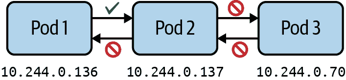
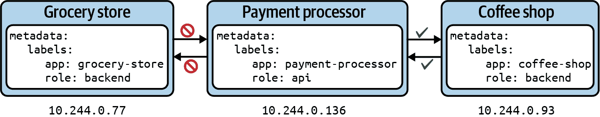

# 第二十三章：网络策略

分配给 Pod 的 IP 地址的唯一性在所有节点和命名空间中保持不变。这是通过在其创建过程中为每个注册节点分配专用子网来实现的。当在节点上创建新的 Pod 时，容器网络接口（CNI）插件会从分配的子网中分配 IP 地址。因此，节点上的 Pod 可以与集群中任何节点上运行的所有其他 Pod 无缝通信。

Kubernetes 中的网络策略与防火墙规则类似，专门设计用于管理 Pod 到 Pod 的通信。这些策略包括指定网络流量方向（入站和/或出站）的规则，适用于命名空间内或跨不同命名空间中一个或多个 Pod。此外，这些规则定义了通信的目标端口。这种精细化的控制增强了 Kubernetes 集群内部流量的安全性和管理能力。

# 使用网络策略

在 Kubernetes 集群中，任何 Pod 都可以使用其[IP 地址或 DNS 名称](https://kubernetes.io/docs/concepts/services-networking/dns-pod-service/#pods)与任何其他 Pod 自由通信，甚至跨命名空间。不仅不受限制的 Pod 间通信可能存在安全风险，还使得架构的心智通信模型难以理解。网络策略定义了控制从 Pod 到 Pod 的流量的规则，如图 23-1 所示。



###### 图 23-1\. 网络策略定义了从 Pod 到 Pod 的流量

例如，没有充分的理由允许运行在一个 Pod 中的后端应用直接与运行在另一个 Pod 中的前端应用进行通信。通信应该从前端 Pod 指向后端 Pod。

## 安装网络策略控制器

没有网络策略控制器，网络策略是无法工作的。网络策略控制器评估由网络策略定义的规则集合。在[Kubernetes 文档](https://kubernetes.io/docs/tasks/administer-cluster/network-policy-provider/)中可以找到各种网络策略控制器的说明。

[Cilium](https://cilium.io/)是一个实现网络策略控制器的 CNI。您可以在云提供商和本地 Kubernetes 集群上安装 Cilium。详细信息请参阅[安装说明](https://docs.cilium.io/en/stable/gettingstarted/k8s-install-default/)。安装完成后，您应该能够在 `kube-system` 命名空间中找到至少两个运行 Cilium 和 Cilium Operator 的 Pod：

```
$ kubectl get pods -n kube-system
NAME                               READY   STATUS    RESTARTS       AGE
cilium-k5td6                       1/1     Running   0              110s
cilium-operator-f5dcdcc8d-njfbk    1/1     Running   0              110s

```

现在可以假设网络策略对象定义的规则将被评估。此外，您可以使用 Cilium 命令行工具验证正确的安装。

## 创建网络策略

标签选择在定义网络策略适用于哪些 Pod 方面起着至关重要的作用。我们已经在其他上下文中看到过这个概念（例如，部署和服务）。此外，网络策略定义了流量的方向，允许或禁止。在网络策略的上下文中，入站流量称为*入口*，出站流量称为*出口*。对于入口和出口，您可以像 Pod、IP 地址或端口这样设置白名单。

# 网络策略不适用于服务。

在大多数情况下，您将设置服务对象来基于标签和端口选择将网络流量引导到 Pod。网络策略完全不涉及服务。所有规则都是命名空间和 Pod 特定的。

通过示例最好解释了网络策略的创建。假设您正在处理以下场景：您正在运行一个 Pod，该 Pod 向其他消费者公开 API。例如，一个处理其他应用程序付款的 Pod。您所在的公司正在将应用程序从旧的付款处理器迁移到新的付款处理器。因此，您只希望允许能够正确与其通信的应用程序访问。目前，您有两个消费者——一个杂货店和一个咖啡店——每个都在单独的 Pod 中运行其应用程序。咖啡店已准备好消费付款处理器的 API，但杂货店尚未准备好。 Figure 23-2 显示了 Pod 及其分配的标签。



###### 图 23-2\. 限制与 Pod 之间的流量

在创建网络策略之前，我们将启动用于表示场景的 Pod：

```
$ kubectl run grocery-store --image=nginx:1.25.3-alpine \
  -l app=grocery-store,role=backend --port 80
pod/grocery-store created
$ kubectl run payment-processor --image=nginx:1.25.3-alpine \
  -l app=payment-processor,role=api --port 80
pod/payment-processor created
$ kubectl run coffee-shop --image=nginx:1.25.3-alpine \
  -l app=coffee-shop,role=backend --port 80

```

鉴于 Kubernetes 默认允许无限制的 Pod 对 Pod 通信，这三个 Pod 将能够相互通信。以下命令验证了这种行为。杂货店和咖啡店的 Pod 对付款处理器 Pod 的 IP 地址执行 `wget` 调用：

```
$ kubectl get pod payment-processor --template '{{.status.podIP}}'
10.244.0.136
$ kubectl exec grocery-store -it -- wget --spider --timeout=1 10.244.0.136
Connecting to 10.244.0.136 (10.244.0.136:80)
remote file exists
$ kubectl exec coffee-shop -it -- wget --spider --timeout=1 10.244.0.136
Connecting to 10.244.0.136 (10.244.0.136:80)
remote file exists

```

您不能使用命令式的 `create` 命令创建新的网络策略。而是必须使用声明式方法。存储在文件 *networkpolicy-api-allow.yaml* 中的 Example 23-1 中的 YAML 清单显示了前面描述场景的网络策略。

##### Example 23-1\. 使用 YAML 声明 NetworkPolicy

```
apiVersion: networking.k8s.io/v1
kind: NetworkPolicy
metadata:
  name: api-allow
spec:
  podSelector:                     
    matchLabels:
      app: payment-processor
      role: api
  ingress:                         
  - from:
    - podSelector:
        matchLabels:
          app: coffee-shop
```


通过标签选择来选择应用策略的 Pod。


允许来自同一命名空间中具有匹配标签的 Pod 的入站流量。

网络策略定义了几个重要属性，这些属性一起形成其规则集。 Table 23-1 显示了 `spec` 级别的属性。

表 23-1\. 网络策略的规范属性

| 属性 | 描述 |
| --- | --- |
| `podSelector` | 选择在命名空间中应用网络策略的 Pod。 |
| `policyTypes` | 定义网络策略适用的流量类型（即入口和/或出口）。 |
| `ingress` | 列出了入站流量的规则。每个规则可以定义 `from` 和 `ports` 部分。 |
| `egress` | 列出了出站流量的规则。每个规则可以定义 `to` 和 `ports` 部分。 |

您可以使用 `spec.ingress.from[]` 和 `spec.egress.to[]` 来独立指定入口和出口规则。每个规则由 Pod 选择器、可选的命名空间选择器或两者的组合组成。表 23-2 列出了 `to` 和 `from` 选择器的相关属性。

表 23-2\. 网络策略 `to` 和 `from` 选择器的属性

| 属性 | 描述 |
| --- | --- |
| `podSelector` | 通过标签在与网络策略相同的命名空间中选择 Pod，这些 Pod 应被允许作为入口源或出口目的地。 |
| `namespaceSelector` | 通过标签选择命名空间，所有 Pod 应被允许作为入口源或出口目的地。 |
| `namespaceSelector` 和 `podSelector` | 通过标签在命名空间中选择 Pod。 |

让我们看看网络策略在实际中的效果。从清单创建网络策略对象：

```
$ kubectl apply -f networkpolicy-api-allow.yaml
networkpolicy.networking.k8s.io/api-allow created

```

网络策略阻止了从杂货店 Pod 调用支付处理器。从咖啡店 Pod 访问支付处理器完全正常，因为网络策略的 Pod 选择器与分配给 Pod 的标签 `app=coffee-shop` 匹配：

```
kubectl exec grocery-store -it -- wget --spider --timeout=1 10.244.0.136
Connecting to 10.244.0.136 (10.244.0.136:80)
wget: download timed out
command terminated with exit code 1
$ kubectl exec coffee-shop -it -- wget --spider --timeout=1 10.244.0.136
Connecting to 10.244.0.136 (10.244.0.136:80)
remote file exists

```

作为开发人员，您可能需要处理由其他团队成员或管理员为您设置的网络策略。您需要了解 `kubectl` 命令来列出和检查网络策略对象，以了解它们对微服务之间方向性网络流量的影响。

## 列出网络策略

列出网络策略的操作与任何其他 Kubernetes 原语相同。使用 `get` 命令结合资源类型 `networkpolicy` 或其简写形式 `netpol`。对于先前的网络策略，您会看到一个表格，显示名称和 Pod 选择器：

```
$ kubectl get networkpolicy api-allow
NAME         POD-SELECTOR                     AGE
api-allow    app=payment-processor,role=api   83m

```

遗憾的是，该命令的输出并未提供关于入口和出口规则的大量信息。要获取更多信息，您需要深入了解详情。

## 渲染网络策略详细信息

您可以使用 `describe` 命令检查网络策略的详细信息。输出会渲染所有重要信息：Pod 选择器，以及入口和出口规则：

```
$ kubectl describe networkpolicy api-allow
Name:         api-allow
Namespace:    default
Created on:   2024-01-10 09:06:59 -0700 MST
Labels:       <none>
Annotations:  <none>
Spec:
  PodSelector:     app=payment-processor,role=api
  Allowing ingress traffic:
    To Port: <any> (traffic allowed to all ports)
    From:
      PodSelector: app=coffee-shop
  Not affecting egress traffic
  Policy Types: Ingress

```

网络策略的详细信息没有清晰地描述基于其规则选择的 Pod。您可以创建符合规则和不符合规则的 Pod，以验证网络策略的预期行为。

# 可视化网络策略

正确定义网络策略的规则可能具有挑战性。页面 [networkpolicy.io](https://networkpolicy.io) 提供了一个网络策略的可视化编辑器，在浏览器中呈现图形表示。

如前所述，每个 Pod 可以与集群的任何节点上运行的其他 Pod 进行通信，这暴露了潜在的安全风险。攻击者如果能够访问一个 Pod，理论上可以通过其虚拟 IP 地址与另一个 Pod 进行通信试图进行破坏。

## 应用默认网络策略

最小权限原则是一个基本的安全概念，在 Kubernetes 中限制 Pod 与 Pod 之间的网络流量时非常推荐。其思想是最初禁止所有流量，然后根据应用程序的架构和通信需求选择性地打开必要的连接。

通过[默认网络策略](https://kubernetes.io/docs/concepts/services-networking/network-policies/#default-policies)，您可以锁定 Pod 与 Pod 之间的通信。默认网络策略是管理员设置的自定义策略，用于默认强制执行限制性通信模式。

为了演示这种默认网络策略的功能，我们将在命名空间 `internal-tools` 中设置两个 Pod。在命名空间内，所有 Pod 将能够彼此通信：

```
$ kubectl create namespace internal-tools
namespace/internal-tools created
$ kubectl run metrics-api --image=nginx:1.25.3-alpine --port=80 \
  -l app=api -n internal-tools
pod/metrics-api created
$ kubectl run metrics-consumer --image=nginx:1.25.3-alpine --port=80 \
  -l app=consumer -n internal-tools
pod/metrics-consumer created

```

让我们创建一个默认网络策略，在命名空间中拒绝所有入站和出站网络流量。我们将网络策略存储在名为 *networkpolicy-deny-all.yaml* 的文件中。

##### 示例 23-2\. 使用默认策略禁止所有流量

```
apiVersion: networking.k8s.io/v1
kind: NetworkPolicy
metadata:
  name: default-deny-all
  namespace: internal-tools
spec:
  podSelector: {}                  
  policyTypes:                     
  - Ingress                        
  - Egress                         
```


对于 `spec.podSelector` 的大括号意味着“适用于命名空间中的所有 Pod”。


定义规则应适用的流量类型，在本例中为入站和出站流量。

从清单创建网络策略：

```
$ kubectl apply -f networkpolicy-deny-all.yaml
networkpolicy.networking.k8s.io/default-deny-all created

```

网络策略防止 `internal-tools` 命名空间中 Pod 之间的任何网络通信，如下所示：

```
$ kubectl get pod metrics-api --template '{{.status.podIP}}' -n internal-tools
10.244.0.182
$ kubectl exec metrics-consumer -it -n internal-tools \
  -- wget --spider --timeout=1 10.244.0.182
Connecting to 10.244.0.182 (10.244.0.182:80)
wget: download timed out
command terminated with exit code 1
$ kubectl get pod metrics-consumer --template '{{.status.podIP}}' \
  -n internal-tools
10.244.0.70
$ kubectl exec metrics-api -it -n internal-tools \
  -- wget --spider --timeout=1 10.244.0.70
Connecting to 10.244.0.70 (10.244.0.70:80)
wget: download timed out
command terminated with exit code 1

```

有了这些默认的拒绝限制，您可以逐步定义更详细的规则并逐渐放宽限制。网络策略是累加的。现在设置额外的网络策略来打开方向性流量是常见做法，但仅限于真正需要的那些。

## 限制对特定端口的访问

在 Kubernetes 中，控制端口级别的访问是网络安全的关键方面。如果没有网络策略明确定义，所有端口都是可访问的，这可能存在安全风险。例如，如果您在 Pod 中运行一个将端口 80 暴露给外部世界的应用程序，则保持其他所有端口开放会不必要地扩大攻击面。端口规则可以作为网络策略的一部分指定为入站和出站。在示例 23-3 中定义的网络策略允许访问端口 80。

##### 示例 23-3\. 定义允许端口 8080 入站访问的网络策略

```
apiVersion: networking.k8s.io/v1
kind: NetworkPolicy
metadata:
  name: port-allow
  namespace: internal-tools
spec:
  podSelector:
    matchLabels:
      app: api
  ingress:
  - from:
    - podSelector:
        matchLabels:
          app: consumer
    ports:                         
    - protocol: TCP                
      port: 80                     
```


仅允许端口 80 的入站流量。

在定义网络策略时，只允许实施架构需求所需的端口。所有其他端口都应该被锁定。

# 总结

Kubernetes 中的容器内通信或同一 Pod 中两个容器之间的通信是完全不受限制的。网络策略规定了控制从 Pod 到 Pod 或从 Pod 到外部网络的流量的规则。你可以将网络策略视为 Pod 的防火墙规则。最佳实践是从“拒绝所有流量”规则开始，以最小化攻击向量。

从那里，您可以根据需要开放访问。学习网络策略的复杂性需要一些实践经验，因为不直接明显规则是否按预期工作。

# 考试要点

理解网络策略的目的和影响

默认情况下，Pod 与 Pod 之间的通信是不受限制的。使用最小特权原则实例化默认拒绝规则，以限制 Pod 与 Pod 之间的网络流量。网络策略的 `spec.podSelector` 属性根据标签选择来选择目标 Pod，规则适用于该 Pod。入口和出口规则定义了允许的入站和出站流量的 Pod、命名空间、IP 地址和端口。

知道如何实施最小特权原则

网络策略可以进行聚合。默认拒绝规则可以禁止入口和/或出口流量。附加的网络策略可以通过更精细的定义打开这些规则。

探索常见的网络策略场景

要探索常见场景，请查看名为 [“Kubernetes Network Policy Recipes”](https://github.com/ahmetb/kubernetes-network-policy-recipes) 的 GitHub 仓库。该仓库提供每个场景的可视化表示，并引导您设置网络策略及相关 Pod 的步骤。这是一个很好的实践资源。

# 示例练习

这些练习的解决方案可在 附录 A 中找到。

1.  您已被委托为现有应用程序堆栈设置网络策略。该堆栈包含 `end-user` 命名空间中的 `frontend` Pod 和 `internal` 命名空间中的 `backend` Pod。

    转到已检出的 GitHub 仓库 [*bmuschko/ckad-study-guide*](https://github.com/bmuschko/ckad-study-guide) 中的 *app-a/ch23/app-stack* 目录。从 YAML 清单 *setup.yaml* 创建对象。检查两个命名空间中的对象。

    在 `end-user` 命名空间中创建名为 `app-stack` 的网络策略。只允许 `frontend` Pod 到 `backend` Pod 的出口流量。`backend` Pod 只能通过端口 80 访问。

1.  转到已检出的 GitHub 仓库 [*bmuschko/ckad-study-guide*](https://github.com/bmuschko/ckad-study-guide) 中的 *app-a/ch23/troubleshooting* 目录。从 YAML 清单 *setup.yaml* 创建对象。检查命名空间 `k1` 和 `k2` 中的对象。

    确定在命名空间 `k2` 中 `nginx` Pod 的虚拟 IP 地址。尝试从命名空间 `k1` 中的 `busybox` Pod 到命名空间 `k2` 中的 `nginx` Pod 在端口 80 上进行 wget 调用。当前的设置下，此调用将失败。

    创建一个网络策略，允许命名空间 `k1` 中所有 Pod 向命名空间 `k2` 中的 `nginx` Pod 执行入口调用。所有其他命名空间中的 Pod 应被拒绝向命名空间 `k2` 中的 Pod 执行入口调用。

    验证是否可以建立网络连接。
