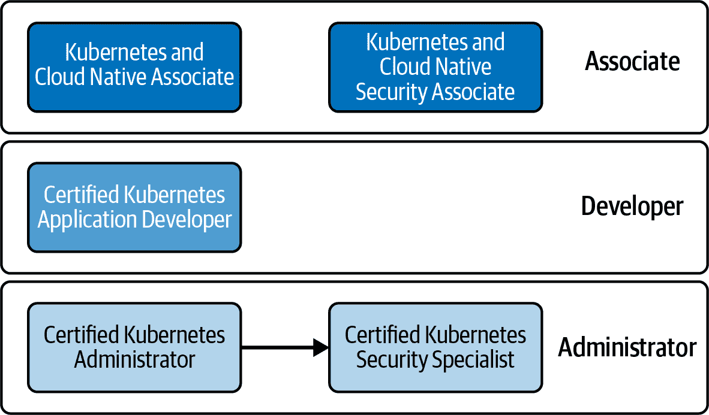
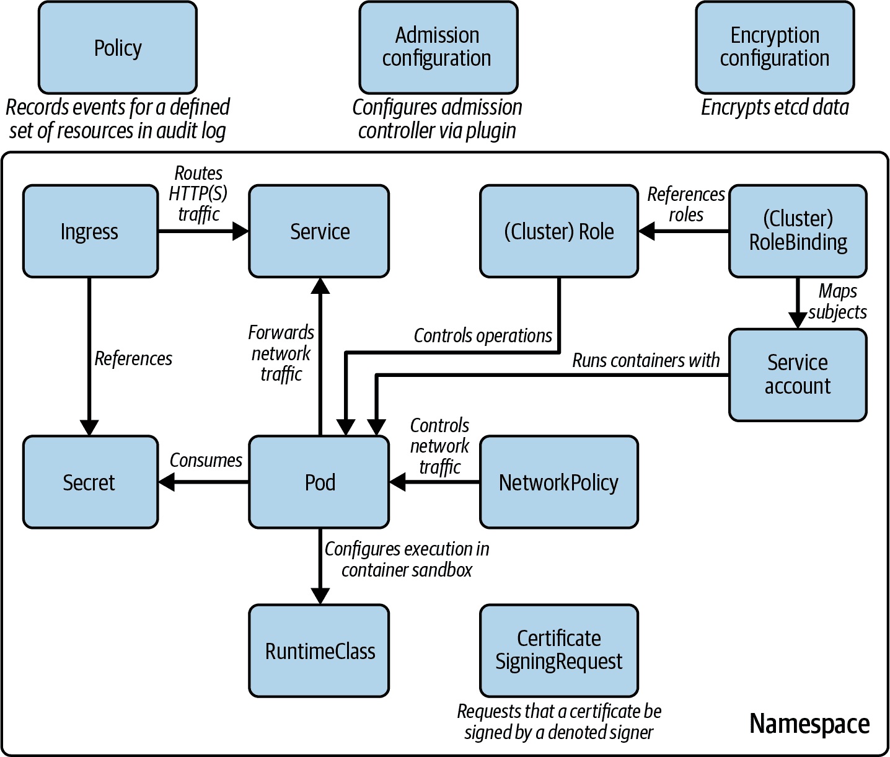

# 第一章：考试细节和资源

本章介绍了备考 [Certified Kubernetes Security Specialist (CKS) 考试](https://www.cncf.io/certification/cks) 时候候候候候候候候候候候候候候候候候候候候候候候候候候候候候候候。我们将讨论该认证的目标受众、课程设置和考试环境，以及技巧和额外的学习资源。如果您对该认证计划已经很熟悉，可以直接跳到覆盖技术概念的章节。

# Kubernetes 认证学习路径

CNCF 提供四种不同的 Kubernetes 认证。Figure 1-1 根据目标受众对它们进行了分类。您会发现 CKS 是您可以获得的最高级别认证。它是唯一一个有通过其他认证作为先决条件的认证；其他所有认证都是独立的项目。

###### 图 1-1。Kubernetes 认证学习路径

让我们简要地查看每个认证的详细信息，看看 CKS 是否适合您。

## Kubernetes and Cloud Native Associate (KCNA)

KCNA 是一个面向任何对云原生应用开发、运行时环境和工具感兴趣的入门级认证项目。虽然考试涵盖 Kubernetes，但并不期望您实际解决实际问题。该考试适合对该主题有广泛了解的候选人。

## Kubernetes and Cloud Native Security Associate (KCSA)

该认证侧重于安全概念的基础知识及其在 Kubernetes 集群中的应用。该程序的广度和深度与 KCNA 相当，因为它不要求实际动手解决问题。

## Certified Kubernetes Application Developer (CKAD)

CKAD 考试侧重于验证您构建、配置和部署基于微服务的应用程序到 Kubernetes 的能力。您不需要实际实现应用程序；然而，该考试适合熟悉应用架构、运行时和编程语言等主题的开发人员。

## Certified Kubernetes Administrator (CKA)

CKA 考试的目标受众包括 DevOps 从业者、系统管理员和可靠性工程师。该考试测试您在 Kubernetes 管理员角色中执行任务的能力，包括集群、网络、存储和初级安全管理，重点放在故障排除场景上。

## Certified Kubernetes Security Specialist (CKS)

CKS 考试扩展了 CKA 考试验证的主题。在您甚至能够报名参加 CKS 考试之前，通过 CKA 考试是必须的先决条件。对于这个认证，您需要对 Kubernetes 安全方面有更深入的了解。课程涵盖的主题包括应用构建容器化应用程序的最佳实践和确保安全的 Kubernetes 运行时环境。

# 考试目标

如果被利用，软件和 IT 基础设施中的漏洞可能对组织构成重大威胁。云原生计算基金会（CNCF）开发了认证 Kubernetes 安全专家（CKS）证书，以验证 Kubernetes 管理员在保护 Kubernetes 集群及其中运行的云原生软件方面的能力。作为 CKS 考试的一部分，您应该了解 Kubernetes 核心安全功能，以及用于保护应用程序和基础设施的第三方工具和已建立的实践。

# 考试期间使用的 Kubernetes 版本

在撰写本书时，考试基于 Kubernetes 1.26 版。本书的所有内容将遵循该特定版本的功能、API 和命令行支持。未来版本有可能会破坏向后兼容性。在准备认证时，请查阅[Kubernetes 发布说明](https://oreil.ly/u3REo)，并使用考试中使用的 Kubernetes 版本进行练习，以避免不愉快的意外。

在本书中，我将通过提供特定用例来解释每种安全威胁。我们将从讨论允许攻击者访问集群、注入恶意代码或使用漏洞入侵系统的场景开始。然后，我们将涉及可以防止该情况发生的概念、实践和/或工具。通过这种方法，您将能够评估安全风险的严重性以及实施安全措施的必要性。

# 课程

以下概述列出了 CKS 考试的高级部分，也称为领域，以及它们的评分权重：

+   10%：集群设置

+   15%：集群硬化

+   15%：系统硬化

+   20%：最小化微服务漏洞

+   20%：供应链安全

+   20%：监控、日志和运行时安全性

# 书籍工作原理

本书的大纲严格遵循 CKS 课程。虽然一般来说，学习 Kubernetes 可能会有更自然、更教学性的组织结构，但课程大纲将帮助考试参与者通过专注于特定主题来准备考试。因此，根据你的现有知识水平，你会发现自己需要参考本书的其他章节。

让我们在接下来的章节详细分析每个领域。

## 集群设置

本节涵盖了 CKA 考试已经涵盖的 Kubernetes 概念；然而，它们假定您已经理解基础知识，并期望您能够深入了解。在这里，您将被测试网络策略及其对在同一命名空间内和跨多个命名空间之间的 Pod 之间的网络通信禁止和授予的影响。主要关注点将放在限制通信以最小化攻击面上。此外，“集群设置”领域将验证您设置带有传输层安全性（TLS）终止的 Ingress 对象的知识。

强调通过检查集群设置来识别和修复安全漏洞。像 kube-bench 这样的外部工具可以帮助自动化该过程。执行工具针对集群的结果将为您提供一个可执行的漏洞列表。根据建议更改集群的配置设置可以显著降低安全风险。

最后，锁定集群节点端点、端口和图形用户界面（GUI）可以帮助防止攻击者控制集群。您需要了解默认集群设置，以便尽可能限制对它们的访问。需要检查 Kubernetes 的二进制文件和可执行文件（如`kubectl`、`kubeadm`和 kubelet）的校验和，以确保它们没有被第三方篡改。您需要了解如何获取二进制文件的校验和文件以及如何使用它来验证可执行文件的有效性。

## 集群加固

大多数组织从允许开发人员和管理员管理 Kubernetes 安装、配置和管理任何对象的集群开始。虽然这对于熟悉 Kubernetes 的团队来说是一种便利的方法，但并不安全，因为它可能会为攻击者打开闸门。一旦访问了集群，就可以执行任何恶意操作。

基于角色的访问控制（RBAC）将权限映射到用户或进程。考试要求深入了解涉及的 API 资源。领域“集群加固”还集中讨论保持集群版本最新以确保获取最新错误修复的主题。Kubernetes 通过端点公开 API 服务器。您应了解最小化其对外界暴露的策略。

## 系统加固

此领域的重点在于理解如何最小化对主机系统和外部网络的访问，以减少攻击面。这就是像 AppArmor 和 seccomp 这样的操作系统级工具发挥作用的地方。您需要展示它们的使用以满足要求。此领域还涉及在亚马逊云环境中运行的集群中使用 AWS IAM 角色的使用。

## 最小化微服务的漏洞

安全上下文定义了容器的特权和访问控制。平台和安全团队可以在组织级别上管理和执行所需的安全措施。考试要求您了解 Pod 安全策略和 OPA Gatekeeper 的目的。此外，您将被要求演示定义不同类型的 Secrets 并从 Pod 中使用它们以注入敏感的运行时信息。

有时，您可能希望从未经验证的来源或潜在不安全的来源实验容器镜像。像 gVisor 和 Kata Containers 这样的容器运行时沙箱可以在 Kubernetes 中配置，以使用非常受限的权限执行容器镜像。配置和使用这样的容器运行时沙箱是本领域的一部分。此外，您需要了解 mTLS Pod 对 Pod 加密的好处以及如何配置它。

## 供应链安全

容器安全始于基础镜像。您需要了解构建容器镜像的最佳实践，以最小化从一开始引入安全漏洞的风险。最优的做法是，您只允许从已经扫描过镜像漏洞的组织内部容器注册表中拉取受信任的容器镜像。仅允许这些注册表至关重要，并且是本领域重要主题之一。像 Trivy 这样的工具可以帮助扫描镜像以查找漏洞，并被列为通过考试的要求之一。

## 监控、日志记录和运行时安全

此领域的重点之一是行为分析，即观察异常和恶意事件的过程。Falco 是本节中应熟悉的主要工具。容器启动后不应该可变，以避免为攻击者打开额外的后门。您需要了解最佳实践，并能够在容器的配置中应用它们。

审计日志记录对于实时查看集群事件或调试目的很有帮助。配置 Kubernetes 集群的审计日志记录是考试的一部分。

# 涉及的 Kubernetes 原语

一些考试目标可以通过理解相关的核心 Kubernetes 原语来实现。预计考试将在单个问题中结合多个概念。参考图 1-2 作为适用的 Kubernetes 资源及其关系的粗略指南。

###### 图 1-2\. 与考试相关的 Kubernetes 原语

除了 Kubernetes 核心原语外，您还需要掌握开源项目提供的特定自定义资源定义（CRD）。例如，Open Policy Agent（OPA）Gatekeeper 提供了原语的 ConstraintTemplate。

# 涉及的外部工具

考试中有相当一部分内容需要展示你对外部安全工具的专业知识。课程中明确列出了一些工具，但还有其他属于同一功能类别的工具。至少，你需要熟悉以下工具：

+   [kube-bench](https://oreil.ly/y3mbO)

+   [AppArmor](https://apparmor.net)

+   [seccomp](https://oreil.ly/vxdZV)

+   [gVisor](https://gvisor.dev)

+   [Kata Containers](https://oreil.ly/vmCZH)

+   [Trivy](https://oreil.ly/RsWka)

+   [Falco](https://oreil.ly/LGT8B)

# 文档

考试期间，你可以打开明确定义的一系列网页作为参考。你可以自由浏览这些页面并在考试终端中复制粘贴代码。CKS 的 [常见问题解答 (FAQ)](https://oreil.ly/ZcKNf) 列出了一些允许的 URL。

Kubernetes 官方文档包括参考手册、GitHub 网站和博客：

+   参考手册: *[*https://kubernetes.io/docs*](https://kubernetes.io/docs)*

+   GitHub: *[*https://github.com/kubernetes*](https://github.com/kubernetes)*

+   博客: *[*https://kubernetes.io/blog*](https://kubernetes.io/blog)*

对于外部工具，允许你打开并浏览以下网址：

+   Trivy: *[*https://github.com/aquasecurity/trivy*](https://github.com/aquasecurity/trivy)*

+   Falco: *[*https://falco.org/docs*](https://falco.org/docs)*

+   AppArmor: *[*https://gitlab.com/apparmor/apparmor/-/wikis/Documentation*](https://gitlab.com/apparmor/apparmor/-/wikis/Documentation)*

# 候选技能

CKS 认证假设你已经具备 Kubernetes 的管理员级理解。CNCF 要求你先获得 CKA 认证作为先决条件。没有这些证书，你将无法报名参加 CKS 考试。如果你还没有通过 CKA 考试，或者想复习相关主题，我建议你看一下我的书籍 [*Certified Kubernetes Administrator (CKA) Study Guide*](https://oreil.ly/cka-study-guide)。

在本书的其余部分，我将假设你已经掌握了通过 CKA 所需的知识。因此，我不会再重复涉及重叠主题的基础知识。为方便起见，我将在需要时指向 CKA 书中相关信息。请重新查看 CKA 书中有关考试环境和时间管理的部分。它们同样适用于 CKS 考试。

# 练习和实践考试

在通过考试时，动手练习非常重要。为此，你需要一个功能正常的 Kubernetes 集群环境。以下选项非常突出：

+   我发现使用 [Vagrant](https://oreil.ly/2jLJS) 和 [VirtualBox](https://oreil.ly/3BhDj) 运行一个或多个虚拟机非常有用。这些工具帮助创建一个易于引导和按需处理的孤立 Kubernetes 环境。本书的一些实践练习使用此设置作为起点。

+   在你的开发者机器上安装一个简单的 Kubernetes 集群相对来说是很容易的。Kubernetes 文档根据你的操作系统提供各种[安装选项](https://oreil.ly/JrBUh)。Minikube 在实验更高级功能（如 Ingress 或存储类）时非常有用，因为它提供了作为附加组件的必要功能，可以通过单个命令安装。

+   如果你是[O'Reilly 学习平台](https://oreil.ly/xOtTT)的订阅者，你可以无限制地访问[运行 Kubernetes 环境的实验室](https://oreil.ly/gYiVj)。此外，你可以通过[以互动实验室形式的 CKS 实践测试](https://oreil.ly/9Jp6j)来测试你的知识。

你可能还想尝试以下一些商业化的学习和练习资源：

+   书籍[*Certified Kubernetes Administrator (CKA) Study Guide*](https://oreil.ly/cka-study-guide)覆盖了 CKA 认证的课程内容。重新学习本书的材料，巩固基础知识。

+   [Killer Shell](https://killer.sh)是一个模拟器，提供所有 Kubernetes 认证的示例练习。

+   来自 Study4exam 的[CKS 实践考试](https://oreil.ly/c3Y7_)提供了一个商业化的基于 Web 的测试环境，用于评估你的知识水平。

# 总结

CKS 考试验证你在 Kubernetes 中与安全相关的实际操作知识。你需要理解核心 Kubernetes 基元和概念，以满足安全需求，如 RBAC、网络策略和 Ingress。考试还涉及有用的第三方安全工具。你需要展示如何有效地使用这些工具。通过 CKA 考试是 CKS 考试的必要条件。如果你还没有通过 CKA 考试，请确保先通过 CKA。

以下章节与考试大纲一致，这样你可以将内容映射到学习目标上。每章结束时，你会找到一些示例练习来巩固你的知识。每个领域的讨论以对最重要的学习要点的简短总结结束。
