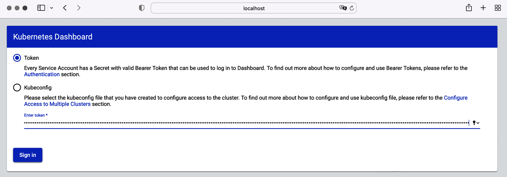

# 第二章：聚集设置

考试的第一个领域涉及与 Kubernetes 集群设置和配置相关的问题。在本章中，我们将仅深入探讨与安全相关的方面，而不是 Kubernetes 管理员的标准责任。

在高层次上，本章涵盖以下概念：

+   使用网络策略来限制 Pod 到 Pod 的通信

+   运行 CIS 基准工具以识别集群组件的安全风险

+   设置带有 TLS 支持的入口对象

+   保护节点端口、API 端点和 GUI 访问

+   验证平台二进制文件与它们的校验和

# 使用网络策略来限制 Pod 到 Pod 的通信

在 Kubernetes 中，为了使微服务架构正常运行，Pod 需要能够在同一节点上或不同节点上运行的另一个 Pod 进行通信，而不需要网络地址转换（NAT）。Kubernetes 在每个 Pod 创建时从其节点的 Pod CIDR 范围内为其分配唯一的 IP 地址。该 IP 地址是临时的，因此不能长期稳定。每次 Pod 重新启动时，都会租用一个新的 IP 地址。建议使用 Pod 到服务的通信而不是 Pod 到 Pod 的通信，以便依赖于一致的网络接口。

分配给 Pod 的 IP 地址在所有节点和命名空间中是唯一的。这是通过在注册节点时为每个节点分配专用子网来实现的。在节点上创建新的 Pod 时，IP 地址是从分配的子网中租赁的。这由容器网络接口（CNI）插件处理。因此，节点上的 Pod 可以与集群中任何其他节点上运行的所有其他 Pod 进行通信。

网络策略类似于防火墙规则，但用于 Pod 到 Pod 的通信。规则可以包括网络流量的方向（入站和/或出站），一个或多个命名空间内或跨不同命名空间的多个 Pod 的目标端口。关于网络策略基础的深入覆盖，请参阅书籍 [*Certified Kubernetes Application Developer (CKAD) Study Guide*](https://learning.oreilly.com/library/view/certified-kubernetes-application/9781492083726)（O’Reilly）或 [Kubernetes 文档](https://oreil.ly/WChde)。CKS 考试主要侧重于使用网络策略限制集群级访问。

正确定义网络策略的规则可能具有挑战性。网站 [networkpolicy.io](https://networkpolicy.io) 提供了一个网络策略的可视化编辑器，在浏览器中呈现图形表示。

## 场景：攻击者获得对 Pod 的访问权限

假设你在为一家运营 Kubernetes 集群的公司工作，该集群有三个工作节点。工作节点 1 当前作为微服务架构的一部分运行两个 Pod。考虑到 Kubernetes 对 Pod 到 Pod 网络通信的默认行为，Pod 1 可以无限制地与 Pod 2 进行通信，反之亦然。

如您在图 2-1 中所见，攻击者已经访问了 Pod 1\. 如果没有定义网络策略，攻击者可以简单地与 Pod 2 进行通信，并造成额外的损害。这种漏洞不限于单个命名空间。Pod 3 和 Pod 4 也可以被访问和受到威胁。


###### 图 2-1\. 已经访问 Pod 1 的攻击者可以访问其他 Pod 的网络

## 观察默认行为

我们将设置三个 Pod 来演示实践中无限制的 Pod-to-Pod 网络通信。如您在示例 2-1 中所见，YAML 清单定义了命名空间 `g04` 中名为 `backend` 和 `frontend` 的 Pods。`other` Pod 位于 `default` 命名空间中。观察命名空间和 Pods 的标签分配。稍后在本章节中定义网络策略时我们会引用它们。

##### 示例 2-1\. 位于不同命名空间中的三个 Pods 的 YAML 清单

```
apiVersion: v1
kind: Namespace
metadata:
  labels:
    app: orion
  name: g04
---
apiVersion: v1
kind: Pod
metadata:
  labels:
    tier: backend
  name: backend
  namespace: g04
spec:
  containers:
  - image: bmuschko/nodejs-hello-world:1.0.0
    name: hello
    ports:
    - containerPort: 3000
  restartPolicy: Never
---
apiVersion: v1
kind: Pod
metadata:
  labels:
    tier: frontend
  name: frontend
  namespace: g04
spec:
  containers:
  - image: alpine
    name: frontend
    args:
    - /bin/sh
    - -c
    - while true; do sleep 5; done;
  restartPolicy: Never
---
apiVersion: v1
kind: Pod
metadata:
  labels:
    tier: outside
  name: other
spec:
  containers:
  - image: alpine
    name: other
    args:
    - /bin/sh
    - -c
    - while true; do sleep 5; done;
  restartPolicy: Never
```

首先，使用声明性的 `kubectl apply` 命令从现有的 YAML 清单创建对象：

```
$ kubectl apply -f setup.yaml
namespace/g04 created
pod/backend created
pod/frontend created
pod/other created
```

让我们验证命名空间 `g04` 运行正确的 Pods。使用 `-o wide` CLI 选项来确定分配给 Pods 的虚拟 IP 地址。`backend` Pod 使用 IP 地址 10.0.0.43，而 `frontend` Pod 使用 IP 地址 10.0.0.193：

```
$ kubectl get pods -n g04 -o wide
NAME       READY   STATUS    RESTARTS   AGE   IP           NODE     \
  NOMINATED NODE   READINESS GATES
backend    1/1     Running   0          15s   10.0.0.43    minikube \
  <none>           <none>
frontend   1/1     Running   0          15s   10.0.0.193   minikube \
  <none>           <none>
```

`default` 命名空间处理单个 Pod：

```
$ kubectl get pods
NAME    READY   STATUS    RESTARTS   AGE
other   1/1     Running   0          4h45m
```

`frontend` Pod 可以与 `backend` Pod 进行通信，因为没有设置通信限制：

```
$ kubectl exec frontend -it -n g04 -- /bin/sh
/ # wget --spider --timeout=1 10.0.0.43:3000
Connecting to 10.0.0.43:3000 (10.0.0.43:3000)
remote file exists
/ # exit
```

位于 `default` 命名空间中的 `other` Pod 可以与 `backend` Pod 进行通信而没有问题：

```
$ kubectl exec other -it -- /bin/sh
/ # wget --spider --timeout=1 10.0.0.43:3000
Connecting to 10.0.0.43:3000 (10.0.0.43:3000)
remote file exists
/ # exit
```

在接下来的章节中，我们将讨论如何通过拒绝所有网络策略规则来限制 Pod-to-Pod 网络通信的最大程度。然后，我们将仅针对微服务架构正常运行所需的网络通信打开入口和/或出口通信。

## 拒绝定向网络流量

限制 Pod-to-Pod 网络流量的最佳方法是使用最小权限原则。最小权限意味着 Pods 应该以最低特权进行网络通信。通常情况下，您会从禁止任何方向的流量开始，然后开放应用架构所需的流量。

[Kubernetes 文档](https://oreil.ly/PZOGf)提供了几个有用的 YAML 清单示例。示例 2-2 展示了一个拒绝命名空间 `g04` 中所有 Pods 入口流量的网络策略。

##### 示例 2-2\. 默认拒绝所有入口网络策略

```
apiVersion: networking.k8s.io/v1
kind: NetworkPolicy
metadata:
  name: default-deny-ingress
  namespace: g04
spec:
  podSelector: {}
  policyTypes:
  - Ingress
```

选择所有 Pods 由赋值给 `spec.podSelector` 属性的值 `{}` 表示。`spec.policyTypes` 属性的值定义了流量的拒绝方向。对于入站流量，您可以将 `Ingress` 添加到数组中。出站流量可以通过 `Egress` 指定。在这个特定的例子中，我们禁止所有入站流量。出站流量仍然允许。

“拒绝所有”网络策略的内容已保存在文件`deny-all-ingress-network-policy.yaml`中。以下命令从文件创建对象：

```
$ kubectl apply -f deny-all-ingress-network-policy.yaml
networkpolicy.networking.k8s.io/default-deny-ingress created
```

让我们看看这如何改变 Pod 到 Pod 网络通信的运行时行为。`frontend` Pod 无法再与`backend` Pod 通信，通过运行与之前相同的`wget`命令观察到这一点。网络调用在一秒后超时，由 CLI 选项`--timeout`定义：

```
$ kubectl exec frontend -it -n g04 -- /bin/sh
/ # wget --spider --timeout=1 10.0.0.43:3000
Connecting to 10.0.0.43:3000 (10.0.0.43:3000)
wget: download timed out
/ # exit
```

此外，运行在不同命名空间中的 Pod 也无法再连接到`backend` Pod。以下`wget`命令从运行在`default`命名空间中的`other` Pod 到`backend` Pod 的 IP 地址的调用：

```
$ kubectl exec other -it -- /bin/sh
/ # wget --spider --timeout=1 10.0.0.43:3000
Connecting to 10.0.0.43:3000 (10.0.0.43:3000)
wget: download timed out
```

此调用也超时。

## 允许细粒度入站流量

网络策略是可加的。要为网络通信授予更多权限，只需创建另一个具有更精细规则的网络策略。例如，我们想要仅允许来自同一命名空间中的`frontend` Pod 的入口流量访问`backend` Pod。独立于它们运行的命名空间，应拒绝所有其他 Pod 的入口流量。

网络策略大量使用标签选择来定义规则。识别`g04`命名空间中的标签及其运行在同一命名空间中的 Pod 对象，以便在网络策略中使用它们：

```
$ kubectl get ns g04 --show-labels
NAME   STATUS   AGE   LABELS
g04    Active   12m   app=orion,kubernetes.io/metadata.name=g04
$ kubectl get pods -n g04 --show-labels
NAME       READY   STATUS    RESTARTS   AGE     LABELS
backend    1/1     Running   0          9m46s   tier=backend
frontend   1/1     Running   0          9m46s   tier=frontend
```

`g04`命名空间的标签分配包括键值对`app=orion`。`backend` Pod 的标签集包括键值对`tier=backend`，而`frontend` Pod 则包括键值对`tier=frontend`。

创建一个新的网络策略，允许`frontend` Pod 只在端口 3000 上与`backend` Pod 通信。不允许其他任何通信。在示例 2-3 中，YAML 清单显示了完整的网络策略定义。

##### 示例 2-3\. 允许入口流量的网络策略

```
apiVersion: networking.k8s.io/v1
kind: NetworkPolicy
metadata:
  name: backend-ingress
  namespace: g04
spec:
  podSelector:
    matchLabels:
      tier: backend
  policyTypes:
  - Ingress
  ingress:
  - from:
    - namespaceSelector:
        matchLabels:
          app: orion
      podSelector:
        matchLabels:
          tier: frontend
    ports:
    - protocol: TCP
      port: 3000
```

网络策略的定义已存储在文件`backend-ingress-network-policy.yaml`中。从文件创建对象：

```
$ kubectl apply -f backend-ingress-network-policy.yaml
networkpolicy.networking.k8s.io/backend-ingress created
```

`frontend` Pod 现在可以与`backend` Pod 通信：

```
$ kubectl exec frontend -it -n g04 -- /bin/sh
/ # wget --spider --timeout=1 10.0.0.43:3000
Connecting to 10.0.0.43:3000 (10.0.0.43:3000)
remote file exists
/ # exit
```

仍在`g04`命名空间之外运行的 Pod 无法连接到`backend` Pod。`wget`命令超时：

```
$ kubectl exec other -it -- /bin/sh
/ # wget --spider --timeout=1 10.0.0.43:3000
Connecting to 10.0.0.43:3000 (10.0.0.43:3000)
wget: download timed out
```

# 应用 Kubernetes 组件安全最佳实践

管理本地 Kubernetes 集群可以完全控制应用于集群组件（如 API 服务器、etcd、kubelet 等）的配置选项。当创建集群节点时，使用`kubeadm`的默认配置设置通常并不罕见。其中一些默认设置可能会暴露集群组件，使其面临不必要的攻击机会。

加固集群安全措施是任何寻求最小化攻击向量的 Kubernetes 管理员的关键活动。如果你了解最佳实践，可以手动执行此活动，或者使用自动化过程。

[互联网安全中心（CIS）](https://www.cisecurity.org)是一个非营利性组织，发布网络安全最佳实践。其中包括他们的最佳实践之一是 [Kubernetes CIS Benchmark](https://oreil.ly/CUe_D)，这是针对 Kubernetes 环境的最佳实践目录。您将在他们的网页上找到针对集群组件推荐的详细安全设置列表。

# 云提供商 Kubernetes 环境的 CIS 基准测试

Kubernetes CIS Benchmark 针对自管理的 Kubernetes 安装。云提供商的 Kubernetes 环境（例如 Amazon Elastic Kubernetes Service (EKS) 和 Google Kubernetes Engine (GKE)）提供了由其自己的命令行工具支持的托管控制平面。因此，Kubernetes CIS Benchmark 提出的安全建议可能不太适用。一些工具，如下讨论的 kube-bench，专门为云提供商提供验证检查。

## 使用 kube-bench

使用工具[kube-bench](https://oreil.ly/y3mbO)可以自动化地检查 Kubernetes 集群组件是否符合 CIS 基准最佳实践。kube-bench 可以通过多种方式执行。例如，您可以将其安装为平台特定的二进制文件，如 RPM 或 Debian 文件。直接在 Kubernetes 集群上的 Pod 中运行 kube-bench 是最方便和直接的验证过程。为此，使用工具的 GitHub 仓库中提供的 YAML 文件创建一个 Job 对象。

首先，根据需求从文件 `job-master.yaml` 或 `job-node.yaml` 创建 Job，以检查控制平面节点或工作节点。以下命令对控制平面节点执行验证检查：

```
$ kubectl apply -f https://raw.githubusercontent.com/aquasecurity/kube-bench/\
main/job-master.yaml
job.batch/kube-bench-master created
```

在 Job 执行期间，可以通过其名称在 `default` 命名空间中标识运行验证过程的 Pod。Pod 的名称以 `kube-bench` 前缀开始，然后附加节点类型及末尾的哈希。以下输出使用名为 `kube-bench-master-8f6qh` 的 Pod：

```
$ kubectl get pods
NAME                      READY   STATUS      RESTARTS   AGE
kube-bench-master-8f6qh   0/1     Completed   0          45s
```

等待 Pod 转换为“已完成”状态，以确保所有验证检查已完成。您可以通过转储 Pod 的日志查看基准结果：

```
$ kubectl logs kube-bench-master-8f6qh
```

有时，将验证结果写入文件可能更为方便。您可以将 `kubectl logs` 命令的输出重定向到文件，例如使用命令 `kubectl logs kube-bench-master-8f6qh > control-plane-kube-bench-results.txt`。

## kube-bench 验证结果

生成的验证结果可能会很长，但包括以下关键元素：被检查节点的类型，被检查的组件，通过检查的列表，未通过检查的列表，警告列表和高级别摘要：

```
[INFO] 1 Control Plane Security Configuration 
[INFO] 1.1 Control Plane Node Configuration Files
[PASS] 1.1.1 Ensure that the API server pod specification file permissions are \
set to 644 or more restrictive (Automated) 
...
[INFO] 1.2 API Server
[WARN] 1.2.1 Ensure that the --anonymous-auth argument is set to false \
(Manual) 
...
[FAIL] 1.2.6 Ensure that the --kubelet-certificate-authority argument is set \
as appropriate (Automated) 

== Remediations master ==
...
1.2.1 Edit the API server pod specification file /etc/kubernetes/manifests/ \
kube-apiserver.yaml on the control plane node and set the below parameter.
--anonymous-auth=false
...
1.2.6 Follow the Kubernetes documentation and setup the TLS connection between 
the apiserver and kubelets. Then, edit the API server pod specification file 
/etc/kubernetes/manifests/kube-apiserver.yaml on the control plane node and \ 
set the --kubelet-certificate-authority parameter to the path to the cert \ 
file for the certificate authority. 
--kubelet-certificate-authority=<ca-string> 

...
== Summary total == 
42 checks PASS
9 checks FAIL
11 checks WARN
0 checks INFO
```


在本例中，被检查的节点是控制平面节点。


一个通过的检查。这里是 API 服务器配置文件的文件权限。


提示消息，提示您手动检查提供给 API 服务器可执行文件的参数值。


一个失败的检查。例如，应为 API 服务器可执行文件设置标志`--kubelet-certificate-authority`。


修复问题所需的纠正操作。失败或警告的编号，例如 1.2.1，对应于纠正操作分配的编号。


所有通过和失败检查的摘要，以及警告和信息消息。

## 修复检测到的安全问题

最初，报告的警告和失败检查列表可能会让人有些不知所措。请记住，您不必一次性修复所有问题。一些检查只是指南或提示，用于验证配置的分配值。以下步骤将引导您完成消除警告消息的过程。

控制平面组件的配置文件可以在控制平面节点的主机系统上的目录`/etc/kubernetes/manifests`中找到。假设您想修复由 kube-bench 报告的警告 1.2.12：

```
[INFO] 1.2 API Server
...
[WARN] 1.2.12 Ensure that the admission control plugin AlwaysPullImages is \
set (Manual)

== Remediations master ==
...
1.2.12 Edit the API server pod specification file /etc/kubernetes/manifests/ \
kube-apiserver.yaml
on the control plane node and set the --enable-admission-plugins parameter \
to include AlwaysPullImages.
--enable-admission-plugins=...,AlwaysPullImages,...
```

如纠正操作所建议的，您应编辑 API 服务器的配置文件并将值`AlwaysPullImages`添加到准入插件列表中。继续编辑文件`kube-apiserver.yaml`：

```
$ sudo vim /etc/kubernetes/manifests/kube-apiserver.yaml
```

在参数`--enable-admission-plugins`中添加值`AlwaysPullImages`后，结果可能如下所示：

```
apiVersion: v1
kind: Pod
metadata:
  annotations:
    kubeadm.kubernetes.io/kube-apiserver.advertise-address.endpoint: \
    192.168.56.10:6443
  creationTimestamp: null
  labels:
    component: kube-apiserver
    tier: control-plane
  name: kube-apiserver
  namespace: kube-system
spec:
  containers:
  - command:
    - kube-apiserver
    - --advertise-address=192.168.56.10
    - --allow-privileged=true
    - --authorization-mode=Node,RBAC
    - --client-ca-file=/etc/kubernetes/pki/ca.crt
    - --enable-admission-plugins=NodeRestriction,AlwaysPullImages
...
```

将更改保存到文件。在`kube-system`命名空间中运行 API 服务器的 Pod 将自动重启。启动过程可能需要几秒钟。因此，执行以下命令可能需要一段时间才能成功：

```
$ kubectl get pods -n kube-system
NAME                           READY   STATUS    RESTARTS   AGE
...
kube-apiserver-control-plane   1/1     Running   0          71m
...
```

在验证更改结果之前，您需要删除现有的作业对象：

```
$ kubectl delete job kube-bench-master
job.batch "kube-bench-master" deleted
```

验证检查 1.2.12 现在报告通过的结果：

```
$ kubectl apply -f https://raw.githubusercontent.com/aquasecurity/kube-bench/\
main/job-master.yaml
job.batch/kube-bench-master created
$ kubectl get pods
NAME                      READY   STATUS      RESTARTS   AGE
kube-bench-master-5gjdn   0/1     Completed   0          10s
$ kubectl logs kube-bench-master-5gjdn | grep 1.2.12
[PASS] 1.2.12 Ensure that the admission control plugin AlwaysPullImages is \
set (Manual)
```

# 创建带有 TLS 终止的 Ingress

Ingress 会根据匹配的 URL 上下文路径，将来自集群外部的 HTTP 和/或 HTTPS 流量路由到一个或多个服务。您可以在图 2-2 中看到其功能。


###### 图 2-2\. 通过 HTTP(S)管理对服务的外部访问

Ingress 已配置为接受来自集群外部的 HTTP 和 HTTPS 流量。如果调用方提供上下文路径`/app`，则流量路由到服务 1。如果调用方提供上下文路径`/api`，则流量路由到服务 2。重要的是指出，一旦流过 Ingress，通信通常使用未加密的 HTTP 网络通信。

考虑到 Ingress API 资源是 CKAD 和 CKA 考试的一部分，我们不再在这里讨论基础知识。有关详细讨论，请参阅[*Certified Kubernetes Administrator (CKA) Study Guide*](https://oreil.ly/cka-study-guide)或[Kubernetes 文档](https://oreil.ly/wmk2s)中的信息。

# Ingress 控制器的角色

请记住，没有 Ingress 控制器，Ingress 无法工作。Ingress 控制器评估由 Ingress 定义的规则集，确定流量路由。一个生产级别的 Ingress 控制器示例是[F5 NGINX Ingress Controller](https://oreil.ly/jOo6P)或[AKS Application Gateway Ingress Controller](https://oreil.ly/ckuqf)。您可以在[Kubernetes 文档](https://oreil.ly/BXx8e)中找到其他选项。如果您使用 minikube，请确保[启用 Ingress 插件](https://oreil.ly/11QAA)。

CKS 的主要焦点是设置带有 TLS 终止的 Ingress 对象。配置 Ingress 以进行 HTTPS 通信可以免去在服务级别上处理网络通信安全性的麻烦。在本书的本节中，您将学习如何创建 TLS 证书和密钥，如何将证书和密钥提供给 TLS 类型的 Secret 对象，以及如何配置 Ingress 对象以支持 HTTPS 通信。

## 设置 Ingress 后端

在 Ingress 的上下文中，*后端*是服务名称和端口的组合。在创建 Ingress 之前，我们将处理服务、部署和运行 nginx 的 Pod，以便稍后演示将 HTTPS 流量路由到实际应用程序。所有这些对象都应存在于命名空间 `t75` 中。示例 2-4 将所有这些资源定义为单个 YAML 清单文件 `setup.yaml`，以便快速创建 Ingress 后端。

##### 示例 2-4\. 通过服务暴露 nginx 的 YAML 清单

```
apiVersion: v1
kind: Namespace
metadata:
  name: t75
---
apiVersion: apps/v1
kind: Deployment
metadata:
  name: nginx-deployment
  namespace: t75
  labels:
    app: nginx
spec:
  replicas: 3
  selector:
    matchLabels:
      app: nginx
  template:
    metadata:
      labels:
        app: nginx
    spec:
      containers:
      - name: nginx
        image: nginx:1.14.2
        ports:
        - containerPort: 80
---
apiVersion: v1
kind: Service
metadata:
  name: accounting-service
  namespace: t75
spec:
  selector:
    app: nginx
  ports:
    - protocol: TCP
      port: 80
      targetPort: 80
```

使用以下命令从 YAML 文件创建对象：

```
$ kubectl apply -f setup.yaml
namespace/t75 created
deployment.apps/nginx-deployment created
service/accounting-service created
```

让我们快速验证对象已正确创建，并且 Pod 已转换为“Running”状态。执行`get all`命令时，您应该看到一个名为 `nginx-deployment` 的控制三个副本的部署，以及一个类型为 `ClusterIP` 的名为 `accounting-service` 的服务：

```
$ kubectl get all -n t75
NAME                                    READY   STATUS    RESTARTS   AGE
pod/nginx-deployment-6595874d85-5rdrh   1/1     Running   0          108s
pod/nginx-deployment-6595874d85-jmhvh   1/1     Running   0          108s
pod/nginx-deployment-6595874d85-vtwxp   1/1     Running   0          108s

NAME                         TYPE        CLUSTER-IP      EXTERNAL-IP   PORT(S) \
  AGE
service/accounting-service   ClusterIP   10.97.101.228   <none>        80/TCP \
  108s

NAME                               READY   UP-TO-DATE   AVAILABLE   AGE
deployment.apps/nginx-deployment   3/3     3            3           108s
```

当在同一节点上的另一个 Pod 中调用服务端点时，应该从 nginx Pod 获得成功响应。这里我们使用`wget`命令来验证这种行为：

```
$ kubectl run tmp --image=busybox --restart=Never -it --rm \
  -- wget 10.97.101.228:80
Connecting to 10.97.101.228:80 (10.97.101.228:80)
saving to 'index.xhtml'
index.xhtml           100% |************|   612  0:00:00 ETA
'index.xhtml' saved
pod "tmp" deleted**********
```

****有了这些对象并按预期运行，我们现在可以集中精力创建带有 TLS 终止的 Ingress。****  ****## 创建 TLS 证书和密钥

在创建 TLS Secret 之前，我们需要生成 TLS 证书和密钥。为此，我们将使用 OpenSSL 命令。生成的文件名为 `accounting.crt` 和 `accounting.key`：

```
$ openssl req -nodes -new -x509 -keyout accounting.key -out accounting.crt \
  -subj "/CN=accounting.tls"
Generating a 2048 bit RSA private key
...........................+
..........................+
writing new private key to 'accounting.key'
-----
$ ls
accounting.crt accounting.key
```

用于生产环境，您需要生成一个密钥文件，并使用它从证书颁发机构（CA）获取 TLS 证书。有关创建 TLS 证书和密钥的更多信息，请参阅 [OpenSSL 文档](https://oreil.ly/sETSb)。

## 创建 TLS 类型的 Secret

创建 Secret 最简单的方法是使用命令式命令的帮助。此创建方法不需要您手动对证书和密钥值进行 base64 编码。编码在对象创建时会自动发生。以下命令使用 Secret 选项 `tls` 并使用选项 `--cert` 和 `--key` 分配证书和密钥文件名：

```
$ kubectl create secret tls accounting-secret --cert=accounting.crt \
  --key=accounting.key -n t75
secret/accounting-secret created
```

示例 2-5 显示了如果要声明性地创建对象，则 TLS Secret 的 YAML 表示。

##### 示例 2-5\. 使用类型 `kubernetes.io/tls` 的 Secret

```
apiVersion: v1
kind: Secret
metadata:
  name: accounting-secret
  namespace: t75
type: kubernetes.io/tls
data:
  tls.crt: LS0tLS1CRUdJTiBDRVJUSUZJQ0FURS0tLS0tCk...
  tls.key: LS0tLS1CRUdJTiBQUklWQVRFIEtFWS0tLS0tCk...
```

确保将 `tls.crt` 和 `tls.key` 属性的值分配为单行的 base64 编码值。要生成 base64 编码的值，只需将 `base64` 命令指向要转换内容的文件名即可。以下示例将文件 `accounting.crt` 的内容进行了 base64 编码：

```
$ base64 accounting.crt
LS0tLS1CRUdJTiBDRVJUSUZJQ0FURS0tLS0tCk1JSUNyakNDQ...
```

## 创建 Ingress

您可以使用一行命令的命令式方法创建 Ingress，如以下片段所示。制定 `--rule` 参数的值是件难事。您可能需要参考 `create ingress` 命令的 `--help` 选项，因为它需要特定的表达式。创建 Ingress 对象与 TLS Secret 之间连接的相关信息是附加的参数 `tls=accounting-secret`：

```
$ kubectl create ingress accounting-ingress \
  --rule="accounting.internal.acme.com/*=accounting-service:80, \
  tls=accounting-secret" -n t75
ingress.networking.k8s.io/accounting-ingress created
```

示例 2-6 显示了 Ingress 的 YAML 表示。定义 TLS 信息的属性是 `spec.tls[]`。

##### 示例 2-6\. 定义 TLS 终止 Ingress 的 YAML 清单

```
apiVersion: networking.k8s.io/v1
kind: Ingress
metadata:
  name: accounting-ingress
  namespace: t75
spec:
  tls:
  - hosts:
    - accounting.internal.acme.com
    secretName: accounting-secret
  rules:
  - host: accounting.internal.acme.com
    http:
      paths:
      - path: /
        pathType: Prefix
        backend:
          service:
            name: accounting-service
            port:
              number: 80
```

使用命令式或声明式方法创建 Ingress 对象后，您应该能够在命名空间 `t75` 中找到它。正如您在以下输出中看到的那样，端口 443 列在 “PORT” 列中，表示已启用 TLS 终止：

```
$ kubectl get ingress -n t75
NAME                 CLASS   HOSTS                          ADDRESS       \
  PORTS     AGE
accounting-ingress   nginx   accounting.internal.acme.com   192.168.64.91 \
  80, 443   55s
```

描述 Ingress 对象显示，后端可以映射到路径 `/` 并通过名为 `accounting-service` 的 Service 将流量路由到 Pod：

```
$ kubectl describe ingress accounting-ingress -n t75
Name:             accounting-ingress
Labels:           <none>
Namespace:        t75
Address:          192.168.64.91
Ingress Class:    nginx
Default backend:  <default>
TLS:
  accounting-secret terminates accounting.internal.acme.com
Rules:
  Host                          Path  Backends
  ----                          ----  --------
  accounting.internal.acme.com
                                /   accounting-service:80 \
                                (172.17.0.5:80,172.17.0.6:80,172.17.0.7:80)
Annotations:                    <none>
Events:
  Type    Reason  Age               From                      Message
  ----    ------  ----              ----                      -------
  Normal  Sync    1s (x2 over 31s)  nginx-ingress-controller  Scheduled for sync
```

## 调用 Ingress

要在您的本地 Kubernetes 集群上测试行为，您需要首先找出节点的 IP 地址。以下命令在 minikube 环境中显示 IP 地址：

```
$ kubectl get nodes -o wide
NAME       STATUS   ROLES           AGE     VERSION   INTERNAL-IP   \
  EXTERNAL-IP   OS-IMAGE               KERNEL-VERSION   CONTAINER-RUNTIME
minikube   Ready    control-plane   3d19h   v1.24.1   192.168.64.91 \
  <none>        Buildroot 2021.02.12   5.10.57          docker://20.10.16
```

接下来，您需要将 IP 地址添加到主机名映射到您的 `/etc/hosts` 文件中：

```
$ sudo vim /etc/hosts
...
192.168.64.91   accounting.internal.acme.com
```

您现在可以使用分配的域名发送 HTTPS 请求到 Ingress，并收到 HTTP 响应码 200：

```
$ wget -O- https://accounting.internal.acme.com --no-check-certificate
--2022-07-28 15:32:43--  https://accounting.internal.acme.com/
Resolving accounting.internal.acme.com (accounting.internal.acme.com)... \
192.168.64.91
Connecting to accounting.internal.acme.com (accounting.internal.acme.com) \
|192.168.64.91|:443... connected.
WARNING: cannot verify accounting.internal.acme.com's certificate, issued \
by ‘CN=Kubernetes Ingress Controller Fake Certificate,O=Acme Co’:
  Self-signed certificate encountered.
WARNING: no certificate subject alternative name matches
	requested host name ‘accounting.internal.acme.com’.
HTTP request sent, awaiting response... 200 OK
```****  ****# 保护节点元数据和端点

Kubernetes 集群公开用于与集群组件通信的端口。例如，API 服务器默认使用端口 6443，以便客户端（如 `kubectl`）在执行命令时可以与其通信。

Kubernetes 文档列出了这些端口在 [“端口和协议”](https://oreil.ly/iN993) 中。以下两个表格显示了每个节点的默认端口分配。

表 2-1 显示了集群节点上的默认入站端口。

表 2-1\. 入站控制平面节点端口

| 端口范围 | 用途 |
| --- | --- |
| 6643 | Kubernetes API 服务器 |
| 2379–2380 | etcd 服务器客户端 API |
| 10250 | Kubelet API |
| 10259 | kube-scheduler |
| 10257 | kube-controller-manager |

许多这些端口是可配置的。例如，您可以通过在配置文件 `/etc/kubernetes/manifests/kube-apiserver.yaml` 中使用 `--secure-port` 标志提供不同的值来修改 API 服务器端口，如在集群组件的 [文档](https://oreil.ly/TTzAz) 中所述。有关所有其他集群组件，请参阅它们各自的文档。

表 2-2 列出了工作节点上的默认入站端口。

表 2-2\. 入站工作节点端口

| 端口范围 | 用途 |
| --- | --- |
| 10250 | Kubelet API |
| 30000–32767 | NodePort 服务 |

要保护集群组件使用的端口，设置防火墙规则以减少攻击面。例如，您可以决定不将 API 服务器暴露给企业内部以外的任何人。只有在 VPN 登录时，使用 `kubectl` 的客户端才能对 Kubernetes 集群运行命令，从而使集群更不容易受到攻击。

云提供商 Kubernetes 集群（例如 AWS、Azure 或 Google Cloud）公开了所谓的元数据服务。元数据服务是可以提供敏感数据（如认证令牌）的 API，供 VM 或 Pod 在不需要额外授权的情况下消费。在 CKS 考试中，您需要了解这些节点端点和云提供商元数据服务。此外，您应该对如何防止未经授权访问它们有高层次的理解。

## 场景：被攻击的 Pod 可以访问元数据服务器

图 2-3 显示了在云提供商 Kubernetes 集群中一个节点上运行的 Pod 的攻击者。


###### 图 2-3\. 攻击者已经获得对 Pod 的访问权限，因此可以访问元数据服务器。

对元数据服务器的访问未受到任何限制。攻击者可以检索敏感信息，这可能会打开其他入侵可能性。

## 使用网络策略保护元数据服务器访问

让我们选择一个暴露元数据端点的云提供商。在 AWS 中，可以使用 IP 地址 169.254.169.254 访问元数据服务器，详见 [AWS 文档](https://oreil.ly/6DsIx)。所暴露的端点可以提供访问 EC2 实例元数据的权限。例如，您可以获取实例的本地 IP 地址以便通过脚本管理外部应用程序的连接或与实例联系。参见相应的 [文档页面](https://oreil.ly/Bwdej)，了解使用 curl 命令行工具调用这些端点的详细信息。

要防止命名空间中的任何 Pod 访问元数据服务器的 IP 地址，需设置一个网络策略，允许所有 IP 地址的出站流量，除了 169.254.169.254\. 示例 2-7 展示了带有此规则集的 YAML 清单。

##### 示例 2-7\. 默认拒绝向 IP 地址 169.254.169.254 的出站网络策略

```
apiVersion: networking.k8s.io/v1
kind: NetworkPolicy
metadata:
  name: default-deny-egress-metadata-server
  namespace: a12
spec:
  podSelector: {}
  policyTypes:
  - Egress
  egress:
  - to:
    - ipBlock:
        cidr: 0.0.0.0/0
        except:
        - 169.254.169.254/32
```

创建网络策略后，命名空间 `a12` 中的 Pod 不应再能访问元数据端点。有关使用 curl 访问端点的详细示例，请参阅相关的 [AWS 文档](https://oreil.ly/fQ07b)。

# 保护 GUI 元素

`kubectl` 工具并非管理集群的唯一用户界面（UI）。尽管 `kubectl` 允许进行精细操作，但大多数组织更喜欢使用更便捷的图形用户界面（GUI）来管理集群中的对象。您可以从多种选择中进行选择。[Kubernetes 仪表板](https://oreil.ly/ABDQo) 是一个免费的基于 Web 的应用程序。其他用于 Kubernetes 的 GUI 仪表板如 [Portainer](https://oreil.ly/i_FJv) 则通过添加事件追踪或硬件资源消耗可视化等功能，扩展了基本功能。在本节中，我们将重点介绍 Kubernetes 仪表板，因为它易于安装和配置。

## 情景：攻击者获得了对仪表板功能的访问权限。

Kubernetes 仪表板作为集群内的一个 Pod 运行。安装仪表板还会创建一个 `ClusterIP` 类型的 Service，只允许从集群内部访问该端点。要使仪表板对最终用户可访问，必须将该 Service 暴露到集群外部。例如，可以切换到 `NodePort` Service 类型或者部署一个 Ingress。图 2-4 展示了部署和访问仪表板的高级架构。


###### 图 2-4\. 成功访问仪表板的攻击者

一旦将仪表板暴露给外部世界，攻击者可能会获取访问权限。如果没有正确的安全设置，对象可以被删除、修改或用于恶意目的。这种攻击的最著名受害者是特斯拉，在 2018 年成为黑客攻击的牺牲品，黑客们成功访问了其未受保护的仪表板以进行加密货币挖掘。从那时起，仪表板的新版本更改了默认设置，以使其从一开始就更安全。

## 安装 Kubernetes 仪表板

安装 Kubernetes 仪表板非常简单。您可以使用项目 GitHub 存储库中提供的 YAML 清单创建相关对象。以下命令安装所有必要的对象：

```
$ kubectl apply -f https://raw.githubusercontent.com/kubernetes/dashboard/\
v2.6.0/aio/deploy/recommended.yaml
```

# 渲染仪表板中的度量数据

如果您有兴趣检查仪表板功能中的资源消耗度量标准，您可能还希望安装[度量服务器](https://oreil.ly/3Rtkl)。

您可以在`kubernetes-dashboard`命名空间中找到清单创建的对象。其中包括 Deployments、Pods 和 Services。以下命令列出所有这些对象：

```
$ kubectl get deployments,pods,services -n kubernetes-dashboard
NAME                                        READY   UP-TO-DATE   AVAILABLE   AGE
deployment.apps/dashboard-metrics-scraper   1/1     1            1           11m
deployment.apps/kubernetes-dashboard        1/1     1            1           11m

NAME                                             READY   STATUS    RESTARTS   AGE
pod/dashboard-metrics-scraper-78dbd9dbf5-f8z4x   1/1     Running   0          11m
pod/kubernetes-dashboard-5fd5574d9f-ns7nl        1/1     Running   0          11m

NAME                                TYPE        CLUSTER-IP       EXTERNAL-IP \
  PORT(S)    AGE
service/dashboard-metrics-scraper   ClusterIP   10.98.6.37       <none>      \
  8000/TCP   11m
service/kubernetes-dashboard        ClusterIP   10.102.234.158   <none>      \
  80/TCP     11m
```

## 访问 Kubernetes 仪表板

`kubectl proxy`命令可帮助临时创建代理，允许您在浏览器中打开仪表板。此功能仅用于故障排除目的，不适用于生产环境。您可以在[文档](https://oreil.ly/gGsqX)中找到有关`proxy`命令的信息：

```
$ kubectl proxy
Starting to serve on 127.0.0.1:8001
```

使用[*http://localhost:8001/api/v1/namespaces/kubernetes-dashboard/services/https:kubernetes-dashboard:/proxy*](http://localhost:8001/api/v1/namespaces/kubernetes-dashboard/services/https:kubernetes-dashboard:/proxy)网址在浏览器中打开。仪表板将要求您提供身份验证方法和凭据。配置仪表板的推荐方式是通过承载令牌。

## 创建具有管理权限的用户

在登录屏幕中进行身份验证之前，您需要创建一个 ServiceAccount 和 ClusterRoleBinding 对象，授予管理员权限。首先创建名为`admin-user-serviceaccount.yaml`的文件，并填充其中显示的内容，该内容如示例 2-8 所示。

##### 示例 2-8\. 管理权限的服务账户

```
apiVersion: v1
kind: ServiceAccount
metadata:
  name: admin-user
  namespace: kubernetes-dashboard
```

然后，将示例 2-9 的内容存储到名为`admin-user-⁠clusterrole​bind⁠ing.yaml`的文件中，以将 ClusterRole 命名为`cluster-admin`映射到 ServiceAccount。

##### 示例 2-9\. 用于管理员权限的 ClusterRoleBinding

```
apiVersion: rbac.authorization.k8s.io/v1
kind: ClusterRoleBinding
metadata:
  name: admin-user
roleRef:
  apiGroup: rbac.authorization.k8s.io
  kind: ClusterRole
  name: cluster-admin
subjects:
- kind: ServiceAccount
  name: admin-user
  namespace: kubernetes-dashboard
```

使用以下声明性命令创建这两个对象：

```
$ kubectl create -f admin-user-serviceaccount.yaml
serviceaccount/admin-user created
$ kubectl create -f admin-user-clusterrolebinding.yaml
clusterrolebinding.rbac.authorization.k8s.io/admin-user created
```

您现在可以使用以下命令为管理员用户创建承载令牌。该命令将为提供的 ServiceAccount 对象生成一个令牌，并在控制台上呈现它：

```
$ kubectl create token admin-user -n kubernetes-dashboard
eyJhbGciOiJSUzI1NiIsImtpZCI6...
```

# 服务账户令牌的过期时间

默认情况下，此令牌将在 24 小时后过期。这意味着一旦“生存时间”（TTL）过去，令牌对象将自动删除。您可以通过提供命令行选项 `--ttl` 来更改令牌的 TTL。例如，`40h` 的值将在 40 小时后使令牌过期。值 `0` 表示令牌永不过期。

将命令的输出复制并粘贴到登录屏幕的“输入令牌”字段中，如 Figure 2-5 所示。



###### 图 2-5\. 仪表板登录界面中令牌的使用

单击“登录”按钮将带您进入 Figure 2-6 中显示的仪表板。


###### 图 2-6\. 特定命名空间中 Pods 的仪表板视图

您现在可以管理端用户和集群对象而无需任何限制。

## 创建具有受限权限的用户

在上一节中，您学习了如何创建具有全局集群管理权限的用户。但是，仪表板的大多数用户可能只需要一组受限权限。例如，实施和操作云原生应用程序的开发人员可能只需要在 Kubernetes 集群上执行其任务所需的部分管理权限。为仪表板创建具有受限权限的用户包括以下三个步骤：

1.  创建一个 ServiceAccount 对象。

1.  创建定义权限的 ClusterRole 对象。

1.  创建将 ClusterRole 映射到 ServiceAccount 的 ClusterRoleBinding。

如您所见，该流程与我们为管理员用户所经历的流程非常相似。第 2 步是新的，因为我们需要明确我们要授予哪些权限。接下来的 YAML 清单将模拟作为开发人员工作的用户，该用户仅允许只读权限（例如获取、列出和观察资源）。

首先创建文件 `restricted-user-serviceaccount.yaml`，并填入示例 Example 2-10 中显示的内容。

##### 示例 2-10\. 用于受限权限的 ServiceAccount

```
apiVersion: v1
kind: ServiceAccount
metadata:
  name: developer-user
  namespace: kubernetes-dashboard
```

Example 2-11 中的 ClusterRole 仅允许获取、列出和观察资源。不允许执行其他任何操作。将内容存储在文件 `restricted-user-clusterrole.yaml` 中。

##### 示例 2-11\. 用于受限权限的 ClusterRole

```
apiVersion: rbac.authorization.k8s.io/v1
kind: ClusterRole
metadata:
  annotations:
    rbac.authorization.kubernetes.io/autoupdate: "true"
  name: cluster-developer
rules:
- apiGroups:
  - '*'
  resources:
  - '*'
  verbs:
  - get
  - list
  - watch
- nonResourceURLs:
  - '*'
  verbs:
  - get
  - list
  - watch
```

最后，将 ServiceAccount 映射到文件 `restricted-user-clusterrolebinding.yaml` 中的 ClusterRole，如 Example 2-12 所示。

##### 示例 2-12\. 用于受限权限的 ClusterRoleBinding

```
apiVersion: rbac.authorization.k8s.io/v1
kind: ClusterRoleBinding
metadata:
  name: developer-user
roleRef:
  apiGroup: rbac.authorization.k8s.io
  kind: ClusterRole
  name: cluster-developer
subjects:
- kind: ServiceAccount
  name: developer-user
  namespace: kubernetes-dashboard
```

使用以下声明性命令创建所有对象：

```
$ kubectl create -f restricted-user-serviceaccount.yaml
serviceaccount/restricted-user created
$ kubectl create -f restricted-user-clusterrole.yaml
clusterrole.rbac.authorization.k8s.io/cluster-developer created
$ kubectl create -f restricted-user-clusterrolebinding.yaml
clusterrolebinding.rbac.authorization.k8s.io/developer-user created
```

使用以下命令生成具有受限用户的 Bearer 令牌：

```
$ kubectl create token developer-user -n kubernetes-dashboard
eyJhbGciOiJSUzI1NiIsImtpZCI6...
```

GUI 中，对于当前登录用户不允许的操作将不会显示为禁用选项。你仍然可以选择该选项，但会显示错误消息。图 2-7 展示了如果尝试通过没有权限执行操作的用户删除 Pod 时，Dashboard 的行为。


###### 图 2-7\. 尝试调用允许操作时显示的错误消息

## 避免不安全的配置参数

在生产环境中保护 Dashboard 包括使用[执行参数](https://oreil.ly/gS1hE)，用于正确配置身份验证和授权。默认情况下，启用登录功能，并且 HTTPS 端点将在 8443 端口上公开。如果不希望自动生成 TLS 证书，可以使用`--tls-cert-file`和`--tls-cert-key`命令行选项提供 TLS 证书。

避免设置命令行参数`--insecure-port`来公开 HTTP 端点和`--enable-insecure-login`来启用以 HTTP 而非 HTTPS 提供登录页面。此外，请确保*不要*使用`--enable-skip-login`选项，因为这将允许通过在登录屏幕上单击跳过按钮来规避认证方法。

# 验证 Kubernetes 平台的二进制文件

Kubernetes 项目会在每个发布中发布客户端和服务器二进制文件。客户端二进制文件指的是可执行的`kubectl`。服务器二进制文件包括`kubeadm`，以及 API 服务器、调度器和 kubelet 的可执行文件。你可以在[Kubernetes GitHub 仓库的“tags”部分](https://oreil.ly/vHpAV)或发布页面[*https://dl.k8s.io*](https://dl.k8s.io)找到这些文件。

## 场景：攻击者向二进制文件注入恶意代码

可执行文件`kubectl`和`kubeadm`对于与 Kubernetes 交互至关重要。`kubectl`允许你针对 API 服务器运行命令，例如管理对象。`kubeadm`在将集群节点从一个版本升级到另一个版本时是必需的。假设你正在[升级集群版本的过程中](https://oreil.ly/hTJ57)，从 1.23 版本升级到 1.24 版本。作为过程的一部分，你将需要升级`kubeadm`二进制文件。官方升级文档详细说明了升级二进制文件所需的命令。

假设攻击者成功修改了版本为 1.24 的`kubeadm`可执行文件，并诱使你以为需要从放置恶意二进制文件的位置下载该二进制文件。正如图 2-8 所示，每次调用修改后的`kubeadm`可执行文件都会暴露你于运行恶意代码的风险。例如，你可能会向集群外的服务器发送凭据，这会为入侵你的 Kubernetes 环境打开新的途径。


###### 图 2-8\. 一个将恶意代码注入二进制文件的攻击者

## 验证二进制文件与哈希值匹配

您可以借助 MD5 或 SHA 等哈希码验证二进制文件的有效性。Kubernetes 为每个二进制文件发布 SHA256 哈希码。在首次使用之前，应对各个二进制文件进行哈希验证。如果生成的哈希码与您下载的哈希码不匹配，则表示二进制文件存在问题。可能是第三方修改了二进制文件，或者您未正确使用特定类型或版本的哈希码。

您可以从[*https://dl.k8s.io*](https://dl.k8s.io)下载与二进制文件对应的哈希码。哈希码的完整 URL 反映了二进制文件的版本、操作系统和架构信息。以下列表展示了适用于 Linux AMD64 平台二进制文件的示例 URL：

+   `kubectl`: [*https://dl.k8s.io/v1.26.1/bin/linux/amd64/kubectl.sha256*](https://dl.k8s.io/v1.26.1/bin/linux/amd64/kubectl.sha256)

+   `kubeadm`: [*https://dl.k8s.io/v1.26.1/bin/linux/amd64/kubeadm.sha256*](https://dl.k8s.io/v1.26.1/bin/linux/amd64/kubeadm.sha256)

+   `kubelet`: [*https://dl.k8s.io/v1.26.1/bin/linux/amd64/kubelet.sha256*](https://dl.k8s.io/v1.26.1/bin/linux/amd64/kubelet.sha256)

+   `kube-apiserver`: [*https://dl.k8s.io/v1.26.1/bin/linux/amd64/kube-apiserver.sha256*](https://dl.k8s.io/v1.26.1/bin/linux/amd64/kube-apiserver.sha256)

您需要使用特定于操作系统的哈希码验证工具来检查二进制文件的有效性。如果您的机器上还没有该工具，可能需要先安装它。下面的命令展示了在不同操作系统上使用工具的示例，详细说明请参考[Kubernetes 文档](https://oreil.ly/2FmVm)：

+   Linux: `echo "$(cat kubectl.sha256) kubectl" | sha256sum --check`

+   MacOSX: `echo "$(cat kubectl.sha256) kubectl" | shasum -a 256 --check`

+   Windows with Powershell: `$($(CertUtil -hashfile .\kubectl.exe SHA256)[1] -replace " ", "") -eq $(type .\kubectl.exe.sha256)`

以下命令演示如何下载版本为 1.26.1 的`kubeadm`二进制文件及其对应的 SHA256 哈希文件：

```
$ curl -LO "https://dl.k8s.io/v1.26.1/bin/linux/amd64/kubeadm"
$ curl -LO "https://dl.k8s.io/v1.26.1/bin/linux/amd64/kubeadm.sha256"
```

验证工具`shasum`可用于确认校验和是否匹配：

```
$ echo "$(cat kubeadm.sha256)  kubeadm" | shasum -a 256 --check
kubeadm: OK
```

前一个命令返回“OK”消息。二进制文件未被篡改。任何其他消息都可能表示在执行二进制文件时存在潜在的安全风险。

# 总结

“集群设置” 领域关注于设置 Kubernetes 集群相关的安全方面。即使您可能正在使用 `kubeadm` 从头开始创建集群，这并不意味着您一定在遵循最佳实践。使用 kube-bench 检测潜在的安全风险是一个很好的起点。逐个修复工具报告的问题。您还可以检查客户端和服务器二进制文件的校验和，以确保它们未被攻击者修改。一些组织使用仪表板来管理集群及其对象。确保仪表板的身份验证和授权限制访问的小部分利益相关者。

网络通信是一个重要的安全方面。默认情况下，Pod 之间的通信是不受限制的。仔细查看运行在 Kubernetes 内的应用架构。只允许符合架构要求的 Pod 之间的单向网络流量。拒绝所有其他网络流量。在将应用程序暴露到集群外部时，请确保已配置带有 TLS 终止的 Ingress 对象。这将确保数据双向加密，使攻击者无法观察客户端和 Kubernetes 集群之间发送的密码等敏感信息。

# 考试要点

理解网络策略的目的和影响

默认情况下，Pod 之间的通信是无限制的。使用最小特权原则实例化默认拒绝规则以限制 Pod 之间的网络流量。网络策略的 `spec.podSelector` 属性根据标签选择选择目标 Pod 应用规则。入站和出站规则定义了允许进出流量的 Pod、命名空间、IP 地址和端口。网络策略可以进行聚合。默认拒绝规则可能禁止入站和/或出站流量。可以使用更精细的定义打开这些规则的其他网络策略。

练习使用 kube-bench 检测集群组件的漏洞

Kubernetes CIS 基准是在生产 Kubernetes 环境中推荐的安全设置的最佳实践集合。您可以利用工具 kube-bench 自动化检测安全风险的过程。运行 kube-bench 生成的报告描述了修复检测到问题所需的详细补救措施。学习如何解释结果以及如何缓解问题。

知道如何配置具有 TLS 终止的 Ingress

可以通过暴露 HTTPS 端点来配置 Ingress 发送和接收加密数据。为此，您需要创建一个 TLS Secret 对象，并为其分配一个 TLS 证书和密钥。然后，可以通过 Ingress 使用属性 `spec.tls[]` 消费这个 Secret。

知道如何为安全访问配置 GUI 元素

GUI 元素，例如 Kubernetes 仪表盘，提供了管理对象的便捷方式。如果应用程序没有受到未经授权访问的保护，攻击者可能会对您的集群造成危害。在考试中，您需要知道如何为特定利益相关者正确设置 RBAC。此外，您还应该大致了解与安全相关的命令行参数。练习安装仪表盘的过程，学习如何调整其命令行参数，并了解为不同用户设置权限的影响。

知道如何检测修改过的平台二进制文件

可以根据其相应的哈希码验证平台二进制文件，如 `kubectl` 和 `kubeadm`。了解如何查找哈希文件以及如何使用验证工具来识别二进制文件是否已被篡改。

# 示例练习

这些练习的解决方案可以在 附录 中找到。

1.  创建一个网络策略，禁止出口流量到集群外的任何域。网络策略适用于具有标签 `app=backend` 的 Pod，并且还允许 UDP 和 TCP 的端口 53 的出口流量到任何其他命名空间中的 Pod。

1.  创建一个名为 `allowed` 的 Pod，在端口 80 上运行 `busybox:1.36.0` 镜像，并为其分配标签 `app=frontend`。对 `http://google.com` 进行 `curl` 调用。网络调用应该被允许，因为网络策略不适用于该 Pod。

1.  创建另一个名为 `denied` 的 Pod，在端口 80 上运行 `busybox:1.36.0` 镜像，并为其分配标签 `app=backend`。对 `http://google.com` 进行 `curl` 调用。网络调用应该被阻止。

1.  安装 Kubernetes 仪表盘或确保已经安装。在命名空间 `kubernetes-dashboard` 中，创建一个名为 `observer-user` 的 ServiceAccount。此外，创建相应的 ClusterRole 和 ClusterRoleBinding。ServiceAccount 应只被允许查看部署（Deployments）。所有其他操作应被拒绝。例如，使用以下命令在 `default` 命名空间中创建名为 `deploy` 的部署：`kubectl create deployment deploy --image=nginx --replicas=3`。

1.  为名为 `observer-user` 的 ServiceAccount 创建一个永不过期的令牌。使用该令牌登录仪表盘。确保仅可以查看部署（Deployments），而不能查看任何其他类型的资源。

1.  在 Linux AMD64 上下载 API 服务器版本 1.26.1 的二进制文件。下载 API 服务器可执行文件版本 1.23.1 的 SH256 校验和文件。运行特定于操作系统的验证工具，并观察结果。
