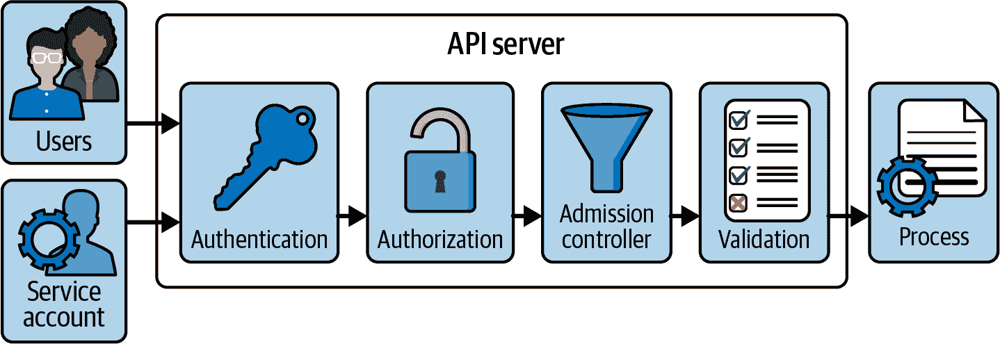
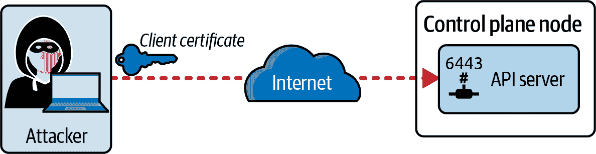
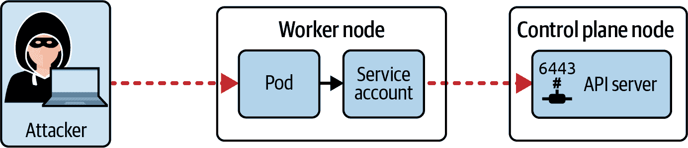
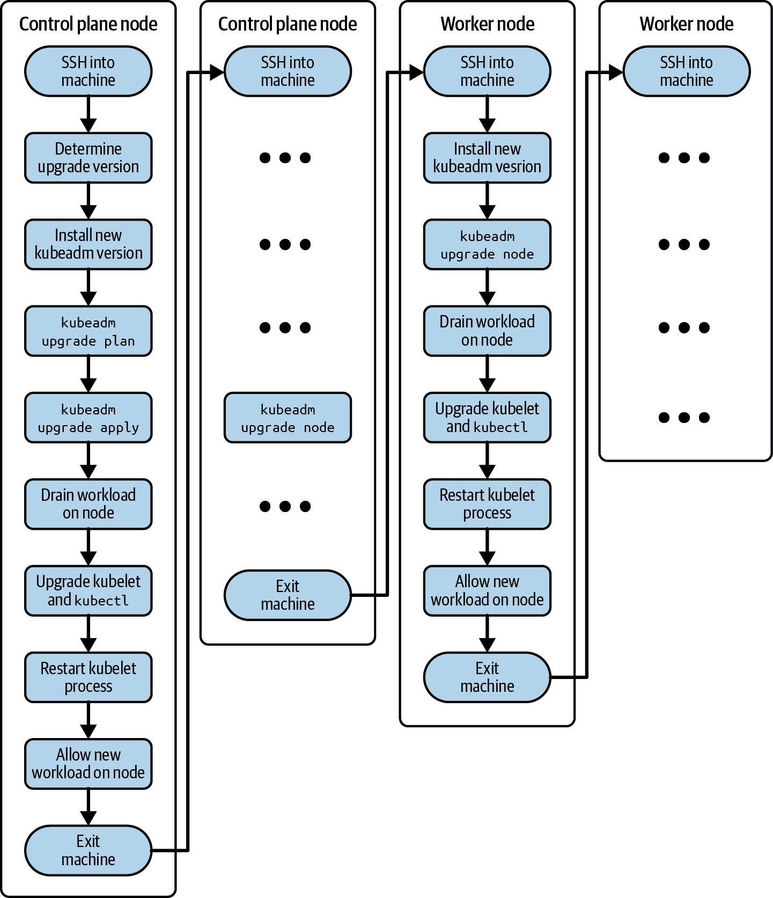

# 第三章：集群加固

“集群加固”领域涉及一些在集群初始化设置和配置后保持尽可能安全的重要主题。作为本章讨论的一部分，您可能会注意到，我将引用通常由 Kubernetes 管理员负责的概念和实践。在适当的情况下，我将提供链接到已涵盖 CKA 考试的主题。

在高层次上，本章涵盖以下概念：

+   限制对 Kubernetes API 的访问

+   配置基于角色的访问控制（RBAC）以最小化暴露

+   在使用服务账户时要谨慎

+   经常更新 Kubernetes

# 与 Kubernetes API 交互

API 服务器是访问 Kubernetes 集群的网关。任何人类用户、客户端（例如`kubectl`）、集群组件或服务账户都将通过 HTTPS 进行 RESTful API 调用访问 API 服务器。这是执行操作（如创建 Pod 或删除 Service）的*中心点*。

在本节中，我们将专注于与 API 服务器相关的安全特定方面。关于 API 服务器的内部工作方式以及 Kubernetes API 的使用详细讨论，请参考 Brendan Burns 和 Craig Tracey（O'Reilly）的书籍[*管理 Kubernetes*](https://learning.oreilly.com/library/view/managing-kubernetes/9781492033905)。

## 处理请求

图 3-1 说明了向 API 服务器发出调用时请求经历的阶段。有关更多信息，请参阅[Kubernetes 文档](https://oreil.ly/DuLdf)。



###### 图 3-1\. API 服务器请求处理

请求处理的第一个阶段是*身份验证*。通过检查客户端证书或令牌验证来验证调用者的身份。如果令牌与服务账户关联，则将在此处验证。

第二阶段确定了第一阶段提供的身份是否可以访问动词和 HTTP 路径请求。因此，第二阶段处理请求的*授权*，使用标准的 Kubernetes RBAC 模型实现。在这里，我们要确保服务账户被允许列出 Pods 或者根据请求创建新的 Service 对象。

请求处理的第三阶段涉及*准入控制*。准入控制验证请求是否格式正确，并在处理请求之前可能需要进行修改。例如，准入控制策略可以确保创建 Pod 的请求包含特定标签的定义。如果没有定义该标签，则请求将被拒绝。

最后一个阶段确保了请求中包含的资源是有效的。请求*验证*可以作为准入控制的一部分来实现，但不是必须的。例如，这个阶段确保了服务对象的名称遵循提供的 DNS 名称的标准 Kubernetes 命名规则。

## 连接到 API 服务器

运行以下命令很容易确定 API 服务器的端点：

```
$ kubectl cluster-info
Kubernetes control plane is running at https://172.28.40.5:6443
...
```

对于给定的 Kubernetes 集群，API 服务器已通过 URL [*https://172.28.40.5:6443*](https://172.28.40.5:6443) 暴露。此外，您还可以查看 API 服务器配置文件中的命令行选项 `--advertise-address` 和 `--secure-port` 来确定端点。您可以在 `/etc/kubernetes/manifests/kube-apiserver.yaml` 找到 API 服务器配置文件。

# 配置 API 服务器的不安全端口

可以配置 API 服务器使用不安全端口（例如，80）已在 Kubernetes 1.10 版本中弃用。在版本 1.24 中，不安全端口标志 `--port` 和 `--insecure-port` 已完全删除，因此不能再用于配置 API 服务器。有关更多信息，请参阅[发布说明](https://oreil.ly/OTsmV)。

### 使用 Kubernetes 服务

Kubernetes 使得特定用例更方便访问 API 服务器。例如，您可能希望从 Pod 发送请求到 Kubernetes API。而不是使用 API 服务器的 IP 地址和端口，您可以简单地引用名为 `kubernetes.default.svc` 的服务。这个特殊的服务位于 `default` 命名空间中，并由集群自动启动。删除服务将自动重新创建它。您可以通过以下命令轻松找到该服务：

```
$ kubectl get service kubernetes
NAME         TYPE        CLUSTER-IP   EXTERNAL-IP   PORT(S)   AGE
kubernetes   ClusterIP   10.96.0.1    <none>        443/TCP   32s
```

检查此服务的端点时，您将看到它指向 API 服务器的 IP 地址和端口，如通过执行以下命令所示：

```
$ kubectl get endpoints kubernetes
NAME         ENDPOINTS          AGE
kubernetes   172.28.40.5:6443   4m3s
```

服务的 IP 地址和端口也通过环境变量暴露给 Pod。您可以从容器内运行的程序中读取环境变量的值。服务的 IP 地址由环境变量 `KUBERNETES_SERVICE_HOST` 反映。端口可以使用环境变量 `KUBERNETES_SERVICE_PORT` 访问。要渲染环境，请简单地使用 `env` 命令在临时 Pod 中访问环境变量：

```
$ kubectl run kubernetes-envs --image=alpine:3.16.2 -it --rm --restart=Never \
  -- env
KUBERNETES_SERVICE_HOST=10.96.0.1
KUBERNETES_SERVICE_PORT=443
```

我们将在 “最小化服务账户权限” 部分中使用 `kubernetes` 服务。

### 匿名访问

以下命令使用 `curl` 命令行工具匿名调用 API 列出所有命名空间。选项 `-k` 避免验证服务器的 TLS 证书：

```
$ curl https://172.28.40.5:6443/api/v1/namespaces -k
{
  "kind": "Status",
  "apiVersion": "v1",
  "metadata": {},
  "status": "Failure",
  "message": "namespaces is forbidden: User \"system:anonymous\" cannot list \
              resource \"namespaces\" in API group \"\" at the cluster scope",
  "reason": "Forbidden",
  "details": {
    "kind": "namespaces"
  },
  "code": 403
}
```

如你从 JSON 格式的 HTTP 响应体中看到的那样，API 服务器接受匿名调用，但没有适当的操作权限。在内部，Kubernetes 将调用映射到[用户名 `system:anonymous`](https://oreil.ly/_HrbF)，这实际上没有授权执行该操作。

### 使用客户端证书访问

要作为授权用户发出请求，您需要创建一个新用户或使用具有管理员权限的现有默认用户 `kubernetes-admin`。我们现在不会详细介绍创建新用户的过程。有关创建用户的更多信息，请参阅“限制用户权限”。

以下命令列出了所有可用用户，包括其客户端证书和密钥：

```
$ kubectl config view --raw
apiVersion: v1
clusters:
- cluster:
    certificate-authority-data: LS0tLS1CRUdJTiBDRVJUSUZJQ0FURS0tL... 
    server: https://172.28.132.5:6443
  name: kubernetes
contexts:
- context:
    cluster: kubernetes
    user: kubernetes-admin
  name: kubernetes-admin@kubernetes
current-context: kubernetes-admin@kubernetes
kind: Config
preferences: {}
users:
- name: kubernetes-admin 
  user:
    client-certificate-data: LS0tLS1CRUdJTiBDRVJUSUZJQ0FURS0tL... 
    client-key-data: LS0tLS1CRUdJTiBSU0EgUFJJVkFURSBLRVktL... 
```


证书颁发机构的 base64 编码值


默认创建的具有管理员权限的用户条目


用户客户端证书的 base64 编码值


用户私钥的 base64 编码值

要使用用户 `kubernetes-admin` 进行调用，我们需要将 CA、客户端证书和私钥的 base64 编码值提取到文件中作为 base64 解码值。以下命令将复制 base64 编码值，并使用工具 `base64` 对其进行解码，然后写入文件。CA 值将存储在文件 `ca` 中，客户端证书值将存储在 `kubernetes-admin.crt` 中，私钥将存储在 `kubernetes-admin.key` 中：

```
$ echo LS0tLS1CRUdJTiBDRVJUSUZJQ0FURS0tL... | base64 -d > ca
$ echo LS0tLS1CRUdJTiBDRVJUSUZJQ0FURS0tL... | base64 -d > kubernetes-admin.crt
$ echo LS0tLS1CRUdJTiBSU0EgUFJJVkFURSBLRVktL... | base64 - \
> kubernetes-admin.key
```

现在，您可以使用相关命令行选项将 `curl` 命令指向这些文件。向 API 服务器的请求应正确进行身份验证，并返回所有现有的命名空间，因为 `kubernetes-admin` 具有适当的权限：

```
$ curl --cacert ca --cert kubernetes-admin.crt --key kubernetes-admin.key \
  https://172.28.132.5:6443/api/v1/namespaces
{
  "kind": "NamespaceList",
  "apiVersion": "v1",
  "metadata": {
    "resourceVersion": "2387"
  },
  "items": [
    ...
  ]
}
```

# 限制访问 API 服务器

如果您正在将 API 服务器暴露到互联网，请问您是否有必要这样做。一些云提供商提供创建私有集群的选项，这将限制或完全禁用对 API 服务器的公共访问。有关更多信息，请参阅[EKS](https://oreil.ly/W4Oma)和[GKE](https://oreil.ly/c7G-g)的文档页面。

如果您正在运营本地 Kubernetes 集群，您将需要实例化防火墙规则以阻止对 API 服务器的访问。设置防火墙规则超出了考试范围，因此本书不会讨论此内容。

## 场景：攻击者可以通过互联网调用 API 服务器

云服务提供商有时会将 API 服务器暴露在互联网上，以简化管理访问。攻击者可以尝试通过拒绝提供客户端证书或令牌来向 API 服务器端点发起匿名请求。如果攻击者幸运地捕获到用户凭据，那么可以执行经过身份验证的调用。根据分配给用户的权限，可以执行恶意操作。图 3-2 说明了一个攻击者从互联网调用 API 服务器的情况。



###### 图 3-2\. 一个攻击者从互联网调用 API 服务器

在本章中，我们将看一下如何限制对 API 服务器的访问，并通过示例实现具有有限权限的 RBAC。“理解 Open Policy Agent（OPA）和 Gatekeeper”将通过 OPA Gateway 帮助审计控制。

## 限制用户权限

我们已经看到我们可以使用`kubernetes-admin`用户的凭据来调用 Kubernetes API。这个用户应该非常节俭地使用，也不应该与很多人共享凭据。如果凭据落入错误的手中，可能会造成很大的损害。将这个用户专门保留给负责集群管理的人员使用。

对于您的 Kubernetes 集群的其他利益相关者，您应该设置一个具有有限权限集的专用用户。您可能在组织中有特定的角色可以映射到。例如，您可能有一个开发者角色，应该被允许管理部署、Pod、ConfigMaps、Secrets 和 Services，但不允许其他操作。要创建一个新用户并分配相关的 RBAC 权限，请参考[Kubernetes 文档](https://oreil.ly/n8EMD)。简而言之，有四个步骤：

1.  创建一个私钥。

1.  创建并批准一个 CertificateSigningRequest。

1.  创建一个 Role 和一个 RoleBinding。

1.  将用户添加到[kubeconfig 文件](https://oreil.ly/OKs9g)中。

我们将详细介绍这个过程，但会在“最小化服务账户权限”中更详细地讨论 RBAC 概念。

### 创建一个私钥

使用`openssl`可执行文件创建一个私钥。提供一个有意义的文件名，比如`<username>.key`：

```
$ openssl genrsa -out johndoe.key 2048
Generating RSA private key, 2048 bit long modulus
...+
......................................................................+
e is 65537 (0x10001)
```

在带有扩展名`.csr`的文件中创建一个证书签名请求（CSR）。您需要提供上一步的私钥。当要求输入“通用名称”值时，以下命令使用用户名`johndoe`。所有其他输入请求都是可选的，可以根据需要填写：

```
$ openssl req -new -key johndoe.key -out johndoe.csr
You are about to be asked to enter information that will be incorporated
into your certificate request.
What you are about to enter is what is called a Distinguished Name or a DN.
There are quite a few fields but you can leave some blank
For some fields there will be a default value,
If you enter '.', the field will be left blank.
-----
Country Name (2 letter code) []:
State or Province Name (full name) []:
Locality Name (eg, city) []:
Organization Name (eg, company) []:
Organizational Unit Name (eg, section) []:
Common Name (eg, fully qualified host name) []:johndoe
Email Address []:

Please enter the following 'extra' attributes
to be sent with your certificate request
A challenge password []:
```

使用以下命令检索 CSR 文件内容的 base64 编码值。在下一步创建 CertificateSigningRequest 对象时会需要它：

```
$ cat johndoe.csr | base64 | tr -d "\n"
LS0tLS1CRUdJTiBDRVJUSUZJQ0FURSBSRVFVRVNULS0tL...
```

### 创建和批准一个 CertificateSigningRequest

以下脚本创建一个 CertificateSigningRequest 对象。[CertificateSigningRequest 资源](https://oreil.ly/ltFbE) 用于请求由指定签名者签名的证书：

```
$ cat <<EOF | kubectl apply -f -
apiVersion: certificates.k8s.io/v1
kind: CertificateSigningRequest
metadata:
  name: johndoe
spec:
  request: LS0tLS1CRUdJTiBDRVJUSUZJQ0FURSBSRVFVRVNULS0tL...
  signerName: kubernetes.io/kube-apiserver-client
  expirationSeconds: 86400
  usages:
  - client auth
EOF
certificatesigningrequest.certificates.k8s.io/johndoe created
```

属性 `spec.signerName` 的值 `kubernetes.io/kube-apiserver-client` 签署证书，这些证书将被 API 服务器作为客户端证书接受。使用上一步的 Base64 编码值并将其分配给属性 `spec.request` 的值。最后，可选属性 `spec.expirationSeconds` 确定证书的生存期。分配的值 `86400` 使证书有效期为一天。根据你希望证书持续的时间长短增加或减少到期时间，或者简单地不添加这个属性。

创建 CertificateSigningRequest 对象后，条件将显示为“待处理”。你需要在 24 小时内批准签名请求，否则对象将被自动删除，作为清理集群中不必要对象的手段。

```
$ kubectl get csr johndoe
NAME        AGE   SIGNERNAME                            REQUESTOR     \
  REQUESTEDDURATION   CONDITION
johndoe     6s    kubernetes.io/kube-apiserver-client   minikube-user \
  24h                 Pending
```

使用 `certificate approve` 命令批准签名请求。结果，条件变更为“已批准，已发放”：

```
$ kubectl certificate approve johndoe
certificatesigningrequest.certificates.k8s.io/johndoe approved
$ kubectl get csr johndoe
NAME        AGE   SIGNERNAME                            REQUESTOR     \
  REQUESTEDDURATION   CONDITION
johndoe     17s   kubernetes.io/kube-apiserver-client   minikube-user \
  24h                 Approved,Issued
```

最后，导出从已批准的 CertificateSigningRequest 对象颁发的证书：

```
$ kubectl get csr johndoe -o jsonpath=*{.status.certificate}*| base64 \
  -d > johndoe.crt
```

### 创建一个角色和一个角色绑定

是时候分配 RBAC 权限了。在这一步，你将为用户创建一个角色和一个角色绑定。角色模拟了组织内的“应用开发者”角色。开发者只能允许获取、列出、更新和删除 Pod。以下的命令创建了角色对象：

```
$ kubectl create role developer --verb=create --verb=get --verb=list \
  --verb=update --verb=delete --resource=pods
role.rbac.authorization.k8s.io/developer created
```

接下来，我们将把角色绑定到名为 `johndoe` 的用户上。使用命令 `create rolebinding` 来完成这个操作：

```
$ kubectl create rolebinding developer-binding-johndoe --role=developer \
  --user=johndoe
rolebinding.rbac.authorization.k8s.io/developer-binding-johndoe created
```

### 将用户添加到 kubeconfig 文件中

在最后一步，你需要将用户添加到 kubeconfig 文件中，并为其创建一个用户上下文。请注意，在下面的命令中集群名称是 `minikube`，因为我们正在 minikube 安装中尝试这个操作：

```
$ kubectl config set-credentials johndoe --client-key=johndoe.key \
  --client-certificate=johndoe.crt --embed-certs=true
User "johndoe" set.
$ kubectl config set-context johndoe --cluster=minikube --user=johndoe
Context "johndoe" created.
```

### 验证权限

是时候切换到名为`johndoe`的用户上下文了：

```
$ kubectl config use-context johndoe
Switched to context "johndoe".
```

使用 `kubectl` 作为客户端向 API 服务器发出调用，我们将验证这个操作是否被允许。用于在 `default` 命名空间中列出所有 Pod 的 API 调用已经被验证和授权：

```
$ kubectl get pods
No resources found in default namespace.
```

命令的输出指示当前`default`命名空间在这个时间点上不包含任何 Pod 对象，但是调用是成功的。我们还将测试负面案例。列出命名空间对于用户来说是一个不允许的操作。执行相关的 `kubectl` 命令将返回一个错误消息：

```
$ kubectl get namespaces
Error from server (Forbidden): namespaces is forbidden: User "johndoe" cannot \
list resource "namespaces" in API group "" at the cluster scope
```

当你完成权限验证后，你可能想要切换回拥有管理员权限的上下文：

```
$ kubectl config use-context minikube
Switched to context "minikube".
```

## 情景：攻击者可以通过服务账号调用 API 服务器

用户代表经常使用 `kubectl` 可执行文件或 UI 仪表板与 Kubernetes 集群进行交互的真实人员。在某些罕见条件下，运行在 Pod 容器内的应用程序需要与 Kubernetes API 进行交互。这种需求的典型示例是包管理器[Helm](https://helm.sh)。Helm 根据捆绑在 Helm 图表中的 YAML 清单管理 Kubernetes 资源。Kubernetes 使用服务账户通过身份验证令牌将 Helm 服务进程与 API 服务器进行身份验证。可以将此服务账户分配给 Pod，并映射到 RBAC 规则。

如果攻击者能够访问 Pod，很可能也能够滥用服务账户调用 Kubernetes API，如图 3-3 所示。



###### 图 3-3\. 攻击者使用服务账户调用 API 服务器。

## 最小化服务账户的权限。

重要的是只限制那些对应用程序真正必要的服务账户的权限。接下来的章节将解释如何实现这一点，以最小化潜在的攻击面。

要使这种场景正常工作，您需要创建一个 ServiceAccount 对象，并将其分配给 Pod。服务账户可以与 RBAC 绑定，并分配角色和角色绑定以定义它们应该允许执行的操作。

### 将服务账户绑定到 Pod。

作为起点，我们将设置一个 Pod，通过调用 Kubernetes API 列出命名空间 `k97` 中所有 Pods 和 Deployments。该调用作为每十秒无限循环的一部分进行。来自 API 调用的响应将写入标准输出，可通过 Pod 的日志访问。

为了对 API 服务器进行身份验证，我们将发送与 Pod 使用的服务账户相关联的令牌。服务账户的默认行为是自动挂载 API 凭据到路径 `/var/run/secrets/kubernetes.io/serviceaccount/token`。我们将使用 `cat` 命令行工具简单地获取文件内容，并将其作为 HTTP 请求的标头一并发送。示例 3-1 定义了命名空间、服务账户和 Pod，在一个名为 `setup.yaml` 的 YAML 文件中。

##### 示例 3-1\. 为将服务账户分配给 Pod 的 YAML 文件清单。

```
apiVersion: v1
kind: Namespace
metadata:
  name: k97
---
apiVersion: v1
kind: ServiceAccount
metadata:
  name: sa-api
  namespace: k97
---
apiVersion: v1
kind: Pod
metadata:
  name: list-objects
  namespace: k97
spec:
  serviceAccountName: sa-api
  containers:
  - name: pods
    image: alpine/curl:3.14
    command: ['sh', '-c', 'while true; do curl -s -k -m 5 -H \
              "Authorization: Bearer $(cat /var/run/secrets/kubernetes.io/ \
              serviceaccount/token)" https://kubernetes.default.svc.cluster. \
              local/api/v1/namespaces/k97/pods; sleep 10; done']
  - name: deployments
    image: alpine/curl:3.14
    command: ['sh', '-c', 'while true; do curl -s -k -m 5 -H \
              "Authorization: Bearer $(cat /var/run/secrets/kubernetes.io/ \
              serviceaccount/token)" https://kubernetes.default.svc.cluster. \
              local/apis/apps/v1/namespaces/k97/deployments; sleep 10; done']
```

使用以下命令从 YAML 文件创建对象：

```
$ kubectl apply -f setup.yaml
namespace/k97 created
serviceaccount/sa-api created
pod/list-objects created
```

### 验证默认权限。

名为 `list-objects` 的 Pod 在专用容器中调用 API 服务器以检索 Pods 和 Deployments 的列表。容器 `pods` 执行调用以列出 Pods。容器 `deployments` 向 API 服务器发送请求以列出 Deployments。

如 [Kubernetes 文档](https://oreil.ly/gBp30) 所述，默认的 RBAC 策略不会授予 `kube-system` 命名空间之外的服务帐户任何权限。容器 `pods` 和 `deployments` 的日志返回错误消息，指示服务帐户 `sa-api` 未被授权列出资源：

```
$ kubectl logs list-objects -c pods -n k97
{
  "kind": "Status",
  "apiVersion": "v1",
  "metadata": {},
  "status": "Failure",
  "message": "pods is forbidden: User \"system:serviceaccount:k97:sa-api\" \
              cannot list resource \"pods\" in API group \"\" in the \
              namespace \"k97\"",
  "reason": "Forbidden",
  "details": {
    "kind": "pods"
  },
  "code": 403
}
$ kubectl logs list-objects -c deployments -n k97
{
  "kind": "Status",
  "apiVersion": "v1",
  "metadata": {},
  "status": "Failure",
  "message": "deployments.apps is forbidden: User \
              \"system:serviceaccount:k97:sa-api\" cannot list resource \
              \"deployments\" in API group \"apps\" in the namespace \
              \"k97\"",
  "reason": "Forbidden",
  "details": {
    "group": "apps",
    "kind": "deployments"
  },
  "code": 403
}
```

接下来，我们将创建一个 ClusterRole 和 RoleBinding 对象，并赋予执行所需 API 调用的权限。

### 创建 ClusterRole

首先，定义名为 `list-pods-clusterrole` 的 ClusterRole，如 示例 3-2 中所示，在文件 `clusterrole.yaml` 中。规则集仅添加 Pod 资源和动词 `list`。

##### 示例 3-2\. 允许列出 Pods 的 ClusterRole 的 YAML 清单

```
apiVersion: rbac.authorization.k8s.io/v1
kind: ClusterRole
metadata:
  name: list-pods-clusterrole
rules:
- apiGroups: [""]
  resources: ["pods"]
  verbs: ["list"]
```

通过指向相应的 YAML 清单文件来创建对象：

```
$ kubectl apply -f clusterrole.yaml
clusterrole.rbac.authorization.k8s.io/list-pods-clusterrole created
```

### 创建 RoleBinding

示例 3-3 在 `rolebinding.yaml` 文件中定义了 RoleBinding 的 YAML 清单。RoleBinding 将 ClusterRole `list-pods-clusterrole` 映射到名为 `sa-pod-api` 的服务帐户，并且仅适用于命名空间 `k97`。

##### 示例 3-3\. 附加到服务帐户的 RoleBinding 的 YAML 清单

```
apiVersion: rbac.authorization.k8s.io/v1
kind: RoleBinding
metadata:
  name: serviceaccount-pod-rolebinding
  namespace: k97
subjects:
- kind: ServiceAccount
  name: sa-api
roleRef:
  kind: ClusterRole
  name: list-pods-clusterrole
  apiGroup: rbac.authorization.k8s.io
```

使用 `apply` 命令创建 RoleBinding 对象：

```
$ kubectl apply -f rolebinding.yaml
rolebinding.rbac.authorization.k8s.io/serviceaccount-pod-rolebinding created
```

### 验证授予的权限

通过授予 `list` 权限，服务帐户现在可以正确检索 `k97` 命名空间中的所有 Pods。`pods` 容器中的 `curl` 命令成功执行，如下所示：

```
$ kubectl logs list-objects -c pods -n k97
{
  "kind": "PodList",
  "apiVersion": "v1",
  "metadata": {
    "resourceVersion": "628"
  },
  "items": [
      {
        "metadata": {
          "name": "list-objects",
          "namespace": "k97",
          ...
      }
  ]
}
```

我们没有授予服务帐户其他资源的任何权限。在 `k97` 命名空间中列出 Deployments 仍然失败。以下输出显示了在 `deployments` 命名空间中使用 `curl` 命令的响应：

```
$ kubectl logs list-objects -c deployments -n k97
{
  "kind": "Status",
  "apiVersion": "v1",
  "metadata": {},
  "status": "Failure",
  "message": "deployments.apps is forbidden: User \
              \"system:serviceaccount:k97:sa-api\" cannot list resource \
              \"deployments\" in API group \"apps\" in the namespace \
              \"k97\"",
  "reason": "Forbidden",
  "details": {
    "group": "apps",
    "kind": "deployments"
  },
  "code": 403
}
```

随意修改 ClusterRole 对象，以允许列出 Deployment 对象。

### 禁用服务帐户令牌的自动装载

前一节中描述的 Pod 使用服务帐户的令牌作为针对 API 服务器进行身份验证的手段。将令牌文件挂载到 `/var/run/secrets/kubernetes.io/serviceaccount/token` 是每个服务帐户的标准行为。只有当 Pod 实际与 Kubernetes API 交互时，您才真正需要文件的内容。在所有其他情况下，此行为可能构成潜在的安全风险，因为访问 Pod 将直接将攻击者引导至令牌。

您可以通过将属性 `automountServiceAccountToken` 的值设置为 `false` 来禁用服务帐户对象的自动装载行为，如 示例 3-4 所示。

##### 示例 3-4\. 选择退出服务帐户的令牌自动装载行为

```
apiVersion: v1
kind: ServiceAccount
metadata:
  name: sa-api
  namespace: k97
automountServiceAccountToken: false
```

如果要为单个 Pod 禁用自动装载行为，请在 Pod 定义中使用 `spec.automountServiceAccountToken` 属性。示例 3-5 展示了一个 Pod 的 YAML 清单。

##### 示例 3-5\. 在 Pod 中禁用服务帐户的令牌自动装载

```
apiVersion: v1
kind: Pod
metadata:
  name: list-objects
  namespace: k97
spec:
  serviceAccountName: sa-api
  automountServiceAccountToken: false
  ...
```

### 生成服务账户令牌

有多种用例表明希望创建一个禁用令牌自动挂载的服务账户。例如，您可能需要从外部工具或连续交付流水线访问 Kubernetes API，以查询现有对象的信息。在这些场景中，仍需要使用令牌对 API 服务器进行身份验证。所列场景不一定运行分配了服务账户的 Pod，而只是从诸如`curl`之类的工具执行 RESTful API 调用。

要手动创建令牌，请执行`create token`命令，并将服务账户的名称作为参数提供。该命令的输出呈现令牌：

```
$ kubectl create token sa-api
eyJhbGciOiJSUzI1NiIsImtpZCI6IjBtQkJzVWlsQjl...
```

您需要将令牌存储在安全的位置，例如密码管理器中。如果丢失令牌，将无法重新获取。您只能使用相同的命令重新创建令牌，这将自动使先前的令牌失效。所有使用该令牌的引用都必须更改。

对于自动化流程，使用有限生命周期生成令牌可能很有帮助。`--duration`将在“生命周期”结束后自动使令牌失效：

```
$ kubectl create token sa-api --duration 10m
eyJhbGciOiJSUzI1NiIsImtpZCI6IjBtQkJzVWlsQjl...
```

### 创建服务账户的密钥

在 Kubernetes 1.24 中，ServiceAccount 对象不再自动创建包含令牌的对应 Secret 对象。有关更多信息，请参阅 [发行说明](https://oreil.ly/MSPuX)。列出 ServiceAccount 对象会呈现 0 个密钥的数量。该对象在 YAML 表示中也不再包含`secrets`属性：

```
$ kubectl get serviceaccount sa-api -n k97
NAME     SECRETS   AGE
sa-api   0         42m
```

您可以使用`create token`命令生成令牌，如 “生成服务账户令牌”中所述，或手动创建相应的密钥。示例 3-6 显示了这种密钥的 YAML 清单。

##### 示例 3-6\. 手动创建服务账户的密钥

```
apiVersion: v1
kind: Secret
metadata:
  name: sa-api-secret
  namespace: k97
  annotations:
    kubernetes.io/service-account.name: sa-api
type: kubernetes.io/service-account-token
```

要为服务账户分配密钥，需添加带有键`kubernetes.io/service-account.name`的注释。以下命令创建密钥对象：

```
$ kubectl create -f secret.yaml
secret/sa-api-secret created
```

描述 Secret 对象时，您可以在“数据”部分找到令牌：

```
$ kubectl describe secret sa-api-secret -n k97
...
Data
====
ca.crt:     1111 bytes
namespace:  3 bytes
token:      eyJhbGciOiJSUzI1NiIsImtpZCI6IjBtQkJzVWlsQjl...
```

# 频繁更新 Kubernetes

安装具有特定版本的 Kubernetes 集群并非一劳永逸的操作。即使在安装时使用了最新的长期支持 (LTS) 版本，也不能保证您的集群没有安全漏洞。

随着时间的推移，将发现与安全相关的漏洞和弱点。此声明包括底层操作系统以及集群节点运行的依赖项。攻击者可以轻易在公开披露的 [通用漏洞和暴露 (CVE) 数据库](https://oreil.ly/FHhXD) 中查找安全漏洞并利用它们。

## 版本控制方案

将 Kubernetes 版本定期更新到所有节点上，这由集群管理员负责。Kubernetes 遵循[语义化版本控制方案](https://semver.org)。语义化版本包括主版本号、次版本号和补丁版本号。例如，对于 Kubernetes 版本 1.24.3，主版本号是 1，次版本号是 24，补丁版本号是 3。

每个版本号的部分都有特定的含义。主版本号的变更表示有不兼容的改动。递增次版本号表示以向后兼容的方式新增了功能。补丁版本号仅修复了一个 bug。

# Kubernetes 中通过次版本更新引入的不兼容变更

需要指出的是，Kubernetes 并不总是严格遵循语义化版本控制的解释。例如，PodSecurityPolicy（PSP）准入控制器已经在[版本 1.25.0](https://oreil.ly/JE-i8)中被 Pod Security Admission 概念取代。按照传统，这些更改只应该发生在主版本更新时。参考[Kubernetes 废弃政策](https://oreil.ly/on9lu)以更好地理解 API、标志或功能如何逐步淘汰。

## 发布节奏

您可以预期每三个月发布[一个新的次版本](https://oreil.ly/LGIn5)的 Kubernetes。新发布版本可能包含新功能和额外的 bug 修复。必要时，安全修复也会被实施到最新版本的 Kubernetes，并将回溯到之前的两个次版本。始终保持更新到您的集群的最新版本需要相当多的人力投入。因此，您需要相应地预留时间来执行这些活动。

## 执行升级过程

建议从一个次版本升级到更高的次版本（例如，从 1.23 到 1.24），或者从一个补丁版本升级到更近期的一个（例如，从 1.24.1 到 1.24.3）。避免跨越多个次版本进行升级，以避免意外的副作用。

您可以在官方 Kubernetes 文档中找到关于[升级步骤](https://oreil.ly/RxC9j)的完整描述。图 3-4 概述了高层次的升级过程。

集群版本升级过程已经是 CKA 考试的一部分。考虑到您必须通过 CKA 作为先决条件，我假设您已经知道如何执行这个过程。有关详细描述，请参考[*Certified Kubernetes Administrator (CKA) Study Guide*](https://oreil.ly/cka-study-guide)。



###### 图 3-4\. 集群版本升级流程

# 概述

用户、客户端应用程序（例如`kubectl`或`curl`）、使用服务账户的 Pod，以及集群组件都通过 API 服务器与其通信，以管理对象。确保安全地保护 API 服务器，以防止恶意访问，这至关重要。

为了最小化攻击面积，避免使用防火墙规则将 API 服务器暴露给互联网。对于每个用户或服务账户，使用 RBAC 规则将权限限制到最低限度，以执行对 Kubernetes API 的操作。权限最小化可以在攻击者获得凭据访问时造成更少的损害。

确保升级您的 Kubernetes 集群版本。集成错误和安全修复将减少暴露给攻击者利用的不必要漏洞的风险。

# 考试要点

练习与 Kubernetes API 交互。

本章演示了与 Kubernetes API 交互的不同方式。我们通过切换到用户上下文执行 API 请求，并借助使用`curl`进行 RESTful API 调用。您需要了解如何确定 API 服务器的端点以及如何使用不同的身份验证方法，例如客户端凭据和 Bearer 令牌。探索 Kubernetes API 及其端点，以便获得更广泛的暴露。

理解为用户和服务账户定义 RBAC 规则的影响。

匿名用户对 Kubernetes API 的请求不会允许任何实质性操作。对于来自用户或服务账户的请求，您需要仔细分析授予主体的权限。通过创建相关对象来控制权限，了解定义 RBAC 规则的方方面面。服务账户在 Pod 中使用时会自动挂载令牌。如果打算从 Pod 中进行 API 调用，则仅暴露令牌作为卷。

注意 Kubernetes 的发布节奏和升级集群的必要性。

出于安全原因，Kubernetes 集群需要随着时间的推移进行维护。攻击者可能会利用已知的过时 Kubernetes 版本中的漏洞。版本升级过程是每个管理员的职责的一部分，不应忽视。

# 示例练习

这些练习的解答在附录中提供。

1.  为名为`jill`的用户在`observer`组中创建客户端证书和密钥。使用管理员上下文为用户`jill`创建上下文。

1.  对于组（而不是用户！），在`default`名称空间中定义一个允许资源 Pods、ConfigMaps 和 Secrets 的动词`get`、`list`和`watch`的角色和角色绑定。创建这些对象。

1.  切换到用户上下文，并执行允许已授权操作的`kubectl`命令，以及一个不应允许的`kubectl`命令。切换回`admin`上下文。

1.  在名称空间`t23`中创建一个名为`service-list`的 Pod。该容器使用`alpine/curl:3.14`镜像，并在无限循环中向 Kubernetes API 发出一个列出`default`名称空间中 Service 对象的`curl`调用。创建并附加服务账户`api-call`。在 Pod 启动后检查容器日志。您期望从`curl`命令中看到什么响应？

1.  为服务账号分配 ClusterRole 和 RoleBinding，仅允许 Pod 所需的操作。查看 `curl` 命令的响应。

1.  配置 Pod 以禁用自动挂载服务账号令牌。检索令牌值并直接在 `curl` 命令中使用。确保 `curl` 命令仍然能够授权操作。

1.  导航到 GitHub 仓库 [*bmuschko/cks-study-guide*](https://oreil.ly/sImXZ) 的 *app-a/ch03/upgrade-version* 目录。使用命令 `vagrant up` 启动运行集群的虚拟机。将集群中所有节点从 Kubernetes 1.25.6 升级到 1.26.1\. 集群包括名为 `kube-control-plane` 的单一控制平面节点和名为 `kube-worker-1` 的工作节点。完成后，使用 `vagrant destroy -f` 关闭集群。

    *先决条件：* 这个练习需要安装工具 [Vagrant](https://oreil.ly/FiyeH) 和 [VirtualBox](https://oreil.ly/WW8IK)。
