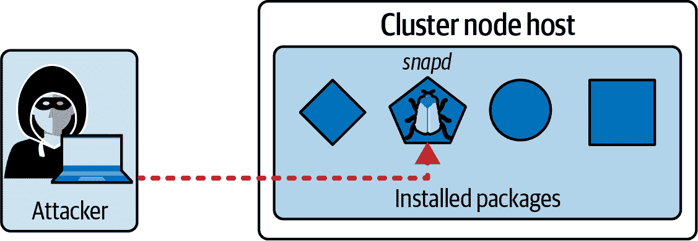
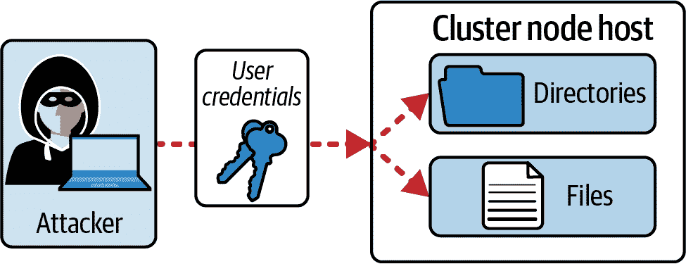

# 第四章：系统加固

“系统加固”领域涉及到运行 Kubernetes 集群节点的底层主机系统的安全相关方面。本章讨论的主题涉及基本的 Linux 核心功能，包括禁用服务和删除软件包、管理用户和组、禁用端口以及设置防火墙规则。最后，本章讨论了可以限制容器中运行的进程在主机级别上执行操作的 Linux 内核加固工具。

从高层次上看，本章涵盖以下概念：

+   减少主机操作系统的占用

+   减少 IAM 角色

+   减少对网络的外部访问

+   使用像 AppArmor 和 seccomp 这样的内核加固工具

# 减少主机操作系统的占用

集群节点运行在物理机或虚拟机上。在大多数情况下，这些机器上的操作系统是 Linux 发行版。显然，操作系统可能会暴露安全漏洞。

随着时间的推移，您需要将操作系统的版本保持最新，以包含最新的安全修复。例如，这个过程可能涉及将节点的操作系统从 Ubuntu 18 升级到 22。本书不涵盖操作系统的升级；有关更多信息，请参阅相关的 Linux 文档。

许多 Linux 发行版，如 Ubuntu，自带额外的工具、应用程序和服务，并非操作 Kubernetes 集群所必需。作为管理员，您的任务是识别安全风险，禁用或移除可能暴露漏洞的任何操作系统特定功能，并保持操作系统补丁，以包含最新的安全修复。操作系统的功能越少，风险就越小。

# Ubuntu Linux 的 CIS 基准

作为参考指南，您可以将操作系统的配置与 [Ubuntu Linux 的 CIS 基准](https://oreil.ly/AeAAE) 进行比较。

## 场景：攻击者利用软件包漏洞

图 4-1 描述了攻击者如何利用系统上安装的软件包的漏洞。例如，该应用程序可能是软件包管理器 [snapd](https://oreil.ly/ZOFTj)。假设攻击者利用已知的漏洞 [USN-5292-1](https://oreil.ly/lw_MV)，可能会向攻击者公开敏感信息。



###### 图 4-1\. 攻击者利用操作系统级别的漏洞

下一节将解释如何通过简单禁用或移除不真正需要的服务和软件包，来减少操作 Kubernetes 所需的服务和软件包的安全风险。

## 禁用服务

在 Linux 上，许多应用程序作为后台服务运行。可以使用命令行工具 `systemctl` 管理服务。以下 `systemctl` 命令列出所有正在运行的服务：

```
$ systemctl | grep running
...
snapd.service   loaded active running   Snap Daemon
```

在操作群集节点时我们不需要的一个服务是软件包管理器 snapd。 有关该服务的更多详细信息，请使用`status`子命令检索其状态：

```
$ systemctl status snapd
● snapd.service - Snap Daemon
     Loaded: loaded (/lib/systemd/system/snapd.service; enabled; vendor \
     preset: enabled)
     Active: active (running) since Mon 2022-09-19 22:49:56 UTC; 30min ago
TriggeredBy: ● snapd.socket
   Main PID: 704 (snapd)
      Tasks: 12 (limit: 2339)
     Memory: 45.9M
     CGroup: /system.slice/snapd.service
             └─704 /usr/lib/snapd/snapd
```

您可以使用`systemctl`子命令`stop`停止服务：

```
$ sudo systemctl stop snapd
Warning: Stopping snapd.service, but it can still be activated by:
  snapd.socket
```

执行`disable`子命令以防止系统重新启动时再次启动服务：

```
$ sudo systemctl disable snapd
Removed /etc/systemd/system/multi-user.target.wants/snapd.service.
```

服务现已停止并已禁用：

```
$ systemctl status snapd
● snapd.service - Snap Daemon
     Loaded: loaded (/lib/systemd/system/snapd.service; disabled; vendor \
     preset: enabled)
     Active: inactive (dead) since Mon 2022-09-19 23:22:22 UTC; 4min 4s ago
TriggeredBy: ● snapd.socket
   Main PID: 704 (code=exited, status=0/SUCCESS)
```

## 删除不需要的软件包

既然服务已停用，保留软件包也就没有意义了。 您可以删除软件包以释放额外的磁盘空间和内存。 您可以使用`apt purge`命令删除软件包及其传递的软件包，如下所示：

```
$ sudo apt purge --auto-remove snapd
Reading package lists... Done
Building dependency tree
Reading state information... Done
The following packages will be REMOVED:
  snapd* squashfs-tools*
0 upgraded, 0 newly installed, 2 to remove and 116 not upgraded.
After this operation, 147 MB disk space will be freed.
Do you want to continue? [Y/n] y
...
```

即使软件包不受服务控制，您也可以使用相同的命令。 确定您不需要的软件包，然后简单地删除它们。 您应该能够获得系统更加精简的足迹。

潜在攻击者无法再使用 snapd 服务来利用系统。 您应该对任何不需要的服务重复此过程。 结果，snapd 服务将不再存在于系统中：

```
$ systemctl status snapd
Unit snapd.service could not be found.
```

# 最小化 IAM 角色

系统级别的身份验证和访问管理（IAM）涉及管理 Linux 用户、他们所属的组以及授予他们的权限。 任何目录和文件都将为用户分配文件权限。

适当的用户和访问管理是每个系统管理员的经典责任。 尽管您作为 Kubernetes 管理员的角色可能不直接涉及系统级别的 IAM，但理解安全性的影响至关重要。 您可能需要与同行合作以加固运行 Kubernetes 集群的系统。

本节将简要介绍如何管理用户和组。 我们还将讨论如何设置文件权限和所有权以尽可能减少访问权限。 在本书中，我们只是涉及这个主题的皮毛。 如需更多信息，请参考您选择的 Linux 文档。

## 场景：攻击者使用凭据获取文件访问权限

安全漏洞可能导致用户凭据被窃取。 获得有效用户凭据使攻击者可以打开其他攻击向量的大门。 图 4-2 显示一个攻击者使用窃取的用户凭据登录到群集节点，现在可以与分配给用户权限的所有文件和目录进行交互。



###### 图 4-2。 攻击者使用窃取的凭据访问文件

建议遵循最小特权原则。 只向有限的用户组授予管理权限。 所有其他用户应只被允许执行其工作所需的操作。

## 理解用户管理

每个用户必须对系统进行身份验证才能使用它。 认证用户根据分配的权限访问资源。 本节将为您介绍管理用户所需的主要操作。

### 用户列表

要列出系统上的所有用户，请渲染文件`/etc/passwd`的内容。每个条目遵循一般模式`username:password:UID:GID:comment:home:shell`。模式内的某些字段可能为空：

```
$ cat /etc/passwd
root:x:0:0:root:/root:/bin/bash
nobody:x:65534:65534:nobody:/nonexistent:/usr/sbin/nologin
...
```

命令输出将用户`root`呈现在输出的第一个位置。字符串的最后一部分`/bin/bash`表示用户被允许使用`bash` shell 登录系统。其他用户可能根本无法登录。对于这些用户，您将在`shell`字段中找到分配给`/usr/sbin/nologin`的字符串。

在任何给定时间点，您可以看到由用户启动的哪些进程。以下命令显示所有`bash`进程，包括启动它的相应用户：

```
$ ps aux | grep bash
root         956  0.0  0.4  22512 19200 pts/0    Ss   17:57   0:00 -bash
root        7064  0.0  0.0   6608  2296 pts/0    S+   18:08   0:00 grep \
--color=auto bash
```

### 添加用户

在某些时候，您可能希望让团队成员访问运行集群节点的机器，并限制权限。您可以使用`adduser`命令将新用户添加到系统。添加标志`--shell /sbin/nologin`以禁用用户的 Shell 访问权限。以下命令创建用户`ben`：

```
$ sudo adduser ben
Adding user ‘ben’ ...
Adding new group ‘ben’ (1001) ...
Adding new user ‘ben’ (1001) with group ‘ben’ ...
Creating home directory ‘/home/ben’ ...
Copying files from ‘/etc/skel’ ...
New password:
Retype new password:
...
```

用户条目已添加到文件`/etc/passwd`中：

```
$ cat /etc/passwd
...
ben:x:1001:1001:,,,:/home/ben:/bin/bash
```

### 切换到用户

您可以使用`su`命令在 Shell 中更改用户。以下命令切换到之前创建的用户`ben`。系统将要求您输入用户的密码：

```
$ su ben
Password:
ben@controlplane:/root$ pwd
/root
```

Shell 将通过其提示指示当前用户。您将从运行`su`命令时使用的帐户继承环境变量。要创建新环境，请在`su`命令中添加连字符：

```
$ su - ben
ben@controlplane:~$ pwd
/home/ben
```

另一种临时切换用户的方法是使用`sudo`命令。您需要有提升的权限来执行该命令。因此，`sudo`命令等效于“以管理员身份运行此命令”：

```
$ sudo -u ben pwd
/root
```

### 删除用户

由系统中的用户代表的团队成员转移到其他团队，或者可能只是离开公司。您将希望撤销用户的访问权限，以防止未经授权使用凭据。以下命令删除用户，包括用户的主目录：

```
$ sudo userdel -r ben
```

## 理解组管理

系统管理员更方便地将具有类似访问要求的用户分组，以控制个别用户级别的权限。Linux 系统提供了组的概念，用于基于团队或特定组织角色组织用户。我们将简要介绍组管理的最重要方面。

### 列出组

可以通过检查文件`/etc/group`的内容来列出组。每个条目遵循一般模式`groupname:password:GID:group members`：

```
$ cat /etc/group
root:x:0:
plugdev:x:46:packer
nogroup:x:65534:
...
```

正如您在输出中看到的那样，某些字段可能为空。唯一具有分配成员的组是`plugdev`，其名称为`packer`。

### 添加组

使用命令`groupadd`添加新组。以下示例添加组`kube-developers`：

```
$ sudo groupadd kube-developers
```

该组现在将在文件`/etc/group`中列出。请注意，组标识符为 1004：

```
$ cat /etc/group
...
kube-developers:x:1004:
```

### 将用户分配到一个组

要将组分配给用户，请使用`usermod`命令。以下命令将用户`ben`添加到组`kube-developers`：

```
$ sudo usermod -g kube-developers ben
```

组标识符 1004 充当`kube-developers`组的替代品：

```
$ cat /etc/passwd | grep ben
ben:x:1001:1004:,,,:/home/ben:/bin/bash
```

### 删除组

有时您希望完全摆脱一个组。也许是指向一个不再存在的 Linux 组的组织角色。使用`groupdel`命令删除一个组。如果成员仍然是该组的一部分，您将收到错误消息：

```
$ sudo groupdel kube-developers
groupdel: cannot remove the primary group of user *ben*
```

在删除组之前，您应该使用`usermod`命令将组成员重新分配到另一个组。以下命令将组从`kube-developers`更改为`kube-admins`。假设组`kube-admins`已经在之前创建好：

```
$ sudo usermod -g kube-admins ben
$ sudo groupdel kube-developers
```

## 理解文件权限和所有权

将文件权限分配为尽可能小的访问权限对于最大化安全性至关重要。这就是 Linux 文件权限和所有权发挥作用的地方。我只会高层次地讨论相关操作。更多详细信息，请参考[Linux Foundation 关于 Linux 文件权限的博文](https://oreil.ly/3IpRT)。

### 查看文件权限和所有权

每个用户都可以创建新的目录和文件。例如，您可以使用`touch`命令创建一个空文件。以下命令在当前目录中创建一个名为`my-file`的文件：

```
$ touch my-file
```

要查看目录内容的“长”格式，请使用`ls`命令。由于请求的`-l`命令行参数，输出的长格式呈现文件权限和文件所有权：

```
$ ls -l
total 0
-rw-r--r-- 1 root root 0 Sep 26 17:53 my-file
```

输出的重要部分是`-rw-r--r--`。第一个字符是特殊的权限字符，可以根据系统而变化，后跟三个以`rwx`表示的组合。前三个字符代表所有者权限，第二组三个字符是组权限，最后三个字符表示所有用户的权限。符号`r`表示读取权限，`w`表示写入权限，`x`表示执行权限。在前面的示例中，用户`root`可以读取和写入文件，而组和其他用户只能读取文件。

### 更改文件所有权

使用`chown`命令更改文件或目录的用户和组分配。命令的语法遵循`chown owner:group filename`的模式。以下命令将文件的所有权更改为用户`ben`，但不重新分配组。执行`chown`命令的用户需要具有写权限：

```
$ chown ben my-file
$ ls -l
total 0
-rw-r--r-- 1 ben  root 0 Sep 26 17:53 my-file
```

### 更改文件权限

您可以使用`chmod`命令以多种表示法添加或删除权限。例如，使用以下命令为文件所有者删除写权限：

```
$ chmod -w file1
$ ls -l
total 0
-r--r--r-- 1 ben  root 0 Sep 26 17:53 my-file
```

# 减少网络对外部访问

只有允许对 Kubernetes 操作必需的端口进行集群节点的外部访问。我们已经在“保护节点元数据和端点”中讨论了标准的 Kubernetes 端口。所有其他端口的访问应被阻止。

## 辨识和停用开放端口

像 FTP 服务器、Web 服务器以及诸如 Samba 之类的文件和打印服务这样的应用程序通过开放端口来向客户端公开通信终点。运行打开网络通信的应用程序可能会带来安全风险。您可以通过简单地禁用服务并卸载应用程序来消除风险。

假设我们在控制平面节点上[安装了 Apache 2 HTTP Web 服务器](https://oreil.ly/t-np3)，使用以下命令：

```
$ sudo apt update
$ sudo apt install apache2
```

# 关于 netstat 命令的更新

`netstat`命令已经弃用，推荐使用更快速、更易读的`ss`命令。有关更多信息，请参阅您使用的操作系统的文档。

我们可以使用命令行工具`ss`检查所有开放端口，该工具类似于`netstat`。以下命令显示了所有开放端口及其进程，其中包括 Apache 2 暴露的端口 80：

```
$ sudo ss -ltpn
State    Recv-Q   Send-Q   Local Address:Port   Peer Address:Port   Process
...
LISTEN   0        511      *:80                 *:*                 users: \
(("apache2",pid=18435,fd=4),("apache2",pid=18434,fd=4),("apache2", ]\
pid=18432,fd=4))

```

您可能仅临时需要 Web 服务器，并且可能只是忘记了安装它。该过程当前由服务器管理。您可以使用`systemctl status`命令查看服务的状态：

```
$ sudo systemctl status apache2
● apache2.service - The Apache HTTP Server
     Loaded: loaded (/lib/systemd/system/apache2.service; enabled; vendor \
     preset: enabled)
     Active: active (running) since Tue 2022-09-20 22:25:25 UTC; 39s ago
       Docs: https://httpd.apache.org/docs/2.4/
   Main PID: 18432 (apache2)
      Tasks: 55 (limit: 2339)
     Memory: 5.6M
     CGroup: /system.slice/apache2.service
             ├─18432 /usr/sbin/apache2 -k start
             ├─18434 /usr/sbin/apache2 -k start
             └─18435 /usr/sbin/apache2 -k start
```

Kubernetes 不需要 Apache 2。我们决定关闭该服务并卸载该软件包：

```
$ sudo systemctl stop apache2
$ sudo systemctl disable apache2
Synchronizing state of apache2.service with SysV service script with \
/lib/systemd/systemd-sysv-install.
Executing: /lib/systemd/systemd-sysv-install disable apache2
Removed /etc/systemd/system/multi-user.target.wants/apache2.service.
$ sudo apt purge --auto-remove apache2
```

验证端口是否不再被使用。`ss`命令再也找不到暴露端口 80 的应用程序：

```
$ sudo ss -ltpn | grep :80
```

## 设置防火墙规则

控制端口的另一种方式是使用操作系统级防火墙的帮助。在 Linux 上，您可以使用[Uncomplicated Firewall (UFW)](https://oreil.ly/iqiwv)。本节将简要介绍如何启用 UFW 及配置防火墙规则。

遵循最小权限原则，建议首先启用防火墙，并为*任何*传入和传出的网络流量设置拒绝规则。以下命令演示了实现这一目标的步骤：

```
$ sudo ufw allow ssh
Rules updated
Rules updated (v6)
$ sudo ufw default deny outgoing
Default outgoing policy changed to *deny*
(be sure to update your rules accordingly)
$ sudo ufw default deny incoming
Default incoming policy changed to *deny*
(be sure to update your rules accordingly)
$ sudo ufw enable
Command may disrupt existing ssh connections. Proceed with operation (y|n)? y
Firewall is active and enabled on system startup
```

你需要允许像`kubectl`这样的外部工具连接到运行在 6443 端口的 API 服务器。在控制平面节点上，执行以下命令以允许访问 API 服务器端口：

```
$ sudo ufw allow 6443
Rule added
Rule added (v6)
```

您需要重复相同的过程以打开控制平面和工作节点上的其他端口。确保所有不需要用于操作 Kubernetes 的其他端口都被阻止。

# 使用内核硬化工具

容器内运行的应用程序或进程可以进行系统调用。典型示例可能是 `curl` 命令执行 HTTP 请求。系统调用是用户空间中用于请求内核服务的程序抽象。我们可以使用内核硬化工具限制允许进行的系统调用。CKS 考试明确提到了两种工具，AppArmor 和 seccomp。我们将讨论这两种工具及其与 Kubernetes 集成的机制。

## 使用 AppArmor

[AppArmor](https://apparmor.net) 提供对在 Linux 系统上运行的程序的访问控制。该工具在用户空间调用的应用程序和底层系统功能之间实现了一个额外的安全层。例如，我们可以限制网络调用或文件系统交互。许多 Linux 发行版（如 Debian、Ubuntu、openSUSE）已经预装了 AppArmor。因此，不需要手动安装 AppArmor。不支持 AppArmor 的 Linux 发行版使用 [Security-Enhanced Linux (SELinux)](https://oreil.ly/CKBr7) 代替，其与 AppArmor 采取了类似的方法。了解 SELinux 超出了 CKS 考试的范围。

### 理解配置文件

定义程序能够执行或无法执行的规则在 AppArmor 配置文件中定义。每个配置文件在生效之前都需要加载到 AppArmor 中。AppArmor 提供了一个命令行工具，用于检查已加载的配置文件。执行命令 `aa-status` 可以查看所有加载配置文件的摘要。您会看到 AppArmor 已经带有一组默认的应用程序配置文件，用于保护 Linux 服务：

```
$ sudo aa-status
apparmor module is loaded.
31 profiles are loaded.
31 profiles are in enforce mode.
   /snap/snapd/15177/usr/lib/snapd/snap-confine
   ...
0 profiles are in complain mode.
14 processes have profiles defined.
14 processes are in enforce mode.
   /pause (11934) docker-default
   ...
0 processes are in complain mode.
0 processes are unconfined but have a profile defined.
```

配置文件模式决定运行时对规则的处理，如果匹配事件发生。AppArmor 区分两种配置文件模式：

强制执行

系统强制执行规则，并将违规情况报告并记录到系统日志中。您应该使用此模式来防止程序进行特定的调用。

抱怨

系统不强制执行规则，但会将违规情况记录到日志中。如果您希望了解程序调用的调用，请使用此模式。

示例 4-1 定义了一个自定义配置文件 `k8s-deny-write`，用于限制文件写入访问权限。该文件应放置在每个执行工作负载的工作节点的目录 `/etc/apparmor.d` 中。本书不详细解释所有规则。要了解更多信息，请参阅 [AppArmor wiki](https://oreil.ly/mNuWB)。

##### 示例 4-1\. 限制文件写入访问的 AppArmor 配置文件

```
#include <tunables/global>

profile k8s-deny-write flags=(attach_disconnected) { 
  #include <abstractions/base>

  file, 

  deny /** w, 
}
```


`profile` 关键字后的标识符是配置文件的名称。


应用到文件操作。


拒绝所有文件写入。

### 设置自定义配置文件

要将配置文件加载到 AppArmor 中，请在工作节点上运行以下命令：

```
$ sudo apparmor_parser /etc/apparmor.d/k8s-deny-write
```

该命令默认使用强制执行模式。要加载投诉模式的配置文件，请使用 `-C` 选项。现在 `aa-status` 命令将列出该配置文件以及默认配置文件。从输出中可以看到，配置文件以强制执行模式列出：

```
$ sudo aa-status
apparmor module is loaded.
32 profiles are loaded.
32 profiles are in enforce mode.
   k8s-deny-write
   ...
```

AppArmor 还支持作为一个实用程序包的附加方便命令。如果你想使用它们，可以手动安装该包，并执行以下命令：

```
$ sudo apt-get update
$ sudo apt-get install apparmor-utils
```

安装完成后，您可以使用 `aa-enforce` 命令以强制执行模式加载配置文件，使用 `aa-complain` 命令以投诉模式加载配置文件。对于考试来说，直接使用标准的 `apparmor_parser` 命令可能更容易。

### 将配置文件应用到容器上

在使用 Pod 定义中的 AppArmor 规则之前，您需要确保一些前提条件。首先，容器运行时需要支持 AppArmor，以便规则生效。此外，运行 Pod 的工作节点上需要安装 AppArmor。最后，请确保加载了配置文件，如前一节所述。

示例 4-2 展示了一个在文件 `pod.yaml` 中定义的 Pod 的 YAML 清单。要将配置文件应用到容器上，需要设置一个特定的注解。注解键需要使用格式 `container.apparmor.security.beta.kubernetes.io/<container-name>` 中的键。在我们的案例中，容器名称为 `hello`。完整的键是 `container.apparmor.security.beta.kubernetes.io/hello`。注解的值遵循模式 `localhost/<profile-name>`。这里我们想要使用的自定义配置文件是 `k8s-deny-write`。有关配置选项的更多信息，请参阅 [Kubernetes 文档](https://oreil.ly/1o3zO)。

##### 示例 4-2\. 应用一个 AppArmor 配置文件到一个容器的 Pod

```
apiVersion: v1
kind: Pod
metadata:
  name: hello-apparmor
  annotations:
    container.apparmor.security.beta.kubernetes.io/hello: \ 
    localhost/k8s-deny-write 
spec:
  containers:
  - name: hello 
    image: busybox:1.28
    command: ["sh", "-c", "echo 'Hello AppArmor!' && sleep 1h"]
```


由硬编码前缀和由斜杠字符分隔的容器名称组成的注解键。


在当前节点上指示的配置文件名称，由 `localhost` 表示。


容器名称。

我们已经准备好创建 Pod 了。运行 `apply` 命令，并指向 YAML 清单。等待 Pod 转换为“Running”状态：

```
$ kubectl apply -f pod.yaml
pod/hello-apparmor created
$ kubectl get pod hello-apparmor
NAME             READY   STATUS    RESTARTS   AGE
hello-apparmor   1/1     Running   0          4s
```

现在，您可以进入容器并执行文件写入操作：

```
$ kubectl exec -it hello-apparmor -- /bin/sh
/ # touch test.txt
touch: test.txt: Permission denied
```

如果尝试向容器文件系统写入文件，AppArmor 将会阻止此操作，并显示“Permission denied”的消息。

## 使用 seccomp

Seccomp，即“安全计算模式”，是另一个 Linux 内核特性，可以限制从用户空间到内核的调用。Seccomp 配置文件是定义限制系统调用及其参数的规则的机制。使用 Seccomp 可以降低利用 Linux 内核漏洞的风险。有关 Kubernetes 上 Seccomp 的更多信息，请参阅 [文档](https://oreil.ly/B8I5L)。

### 将默认的容器运行时配置文件应用到容器上

容器运行时（如 Docker Engine 或 containerd）附带默认的 seccomp 配置文件。默认的 seccomp 配置文件允许应用程序使用的最常用系统调用，同时禁止被认为危险的系统调用。

Kubernetes 在创建 Pod 时不会将默认容器运行时配置文件应用于容器，但可以通过设置安全上下文属性`seccompProfile`将 seccomp 配置文件类型设置为`RuntimeDefault`来启用它。您可以使用`SeccompDefault` [功能门](https://oreil.ly/m9g0G)在 Pod 级别启用该功能。示例 4-3 演示了其使用方法。

##### 示例 4-3. 一个应用了容器运行时配置文件提供的默认 seccomp 配置文件的 Pod

```
apiVersion: v1
kind: Pod
metadata:
  name: hello-seccomp
spec:
  securityContext:
    seccompProfile:
      type: RuntimeDefault 
  containers:
  - name: hello
    image: busybox:1.28
    command: ["sh", "-c", "echo 'Hello seccomp!' && sleep 1h"]
```


应用默认的容器运行时配置文件。

使用`apply`命令并指向 YAML 清单文件可以启动 Pod。Pod 应该会转换为“运行”状态：

```
$ kubectl apply -f pod.yaml
pod/hello-seccomp created
$ kubectl get pod hello-seccomp
NAME            READY   STATUS    RESTARTS   AGE
hello-seccomp   1/1     Running   0          4s
```

在容器中执行的`echo`命令在安全性方面被默认的 seccomp 配置文件视为无问题。以下命令检查容器的日志：

```
$ kubectl logs hello-seccomp
Hello seccomp!
```

允许调用并导致将消息“Hello seccomp!”写入标准输出。

### 设置自定义配置文件

除了默认容器运行时配置文件之外，您还可以创建和设置自定义配置文件。这些文件的标准目录是`/var/lib/kubelet/seccomp`。我们将在子目录`profiles`中组织我们的自定义配置文件。如果目录不存在，则创建该目录：

```
$ sudo mkdir -p /var/lib/kubelet/seccomp/profiles
```

我们决定在配置文件目录中的文件`mkdir-violation.json`中创建我们的自定义配置文件。示例 4-4 显示了配置文件定义的详细信息。简而言之，规则集禁止使用`mkdir`系统调用。

##### 示例 4-4. 阻止执行`mkdir`系统调用的 seccomp 配置文件

```
{
    "defaultAction": "SCMP_ACT_ALLOW", 
    "architectures":  ![2
        "SCMP_ARCH_X86_64",
        "SCMP_ARCH_X86",
        "SCMP_ARCH_X32"
    ],
    "syscalls": [
        {
            "names": [
                "mkdir"
            ],
            "action": "SCMP_ACT_ERRNO" 
        }
    ]
}
```


默认操作适用于所有系统调用。在这里，我们将使用`SCMP_ACT_ALLOW`允许所有系统调用。


您可以过滤默认操作应用于的特定体系结构。该字段的定义是可选的。


默认操作可以通过声明更细粒度的规则来覆盖。`SCMP_ACT_ERRNO`操作将阻止执行`mkdir`系统调用。

将自定义配置文件放入目录`/var/lib/kubelet/seccomp`中不会自动将规则应用于 Pod。您仍然需要配置 Pod 以使用它。

### 将自定义配置文件应用于容器

应用自定义配置文件与应用默认的容器运行时配置文件遵循类似的模式，但存在一些小差异。正如您在示例 4-5 中所看到的，我们将安全配置文件的`seccompProfile`属性指向文件`mkdir-violation.json`，并将类型设置为`Localhost`。

##### 示例 4-5\. 应用自定义 seccomp 配置文件的 Pod 阻止了`mkdir`系统调用。

```
apiVersion: v1
kind: Pod
metadata:
  name: hello-seccomp
spec:
  securityContext:
    seccompProfile:
      type: Localhost 
      localhostProfile: profiles/mkdir-violation.json 
  containers:
  - name: hello
    image: busybox:1.28
    command: ["sh", "-c", "echo 'Hello seccomp!' && sleep 1h"]
    securityContext:
      allowPrivilegeEscalation: false
```


指的是当前节点上的一个配置文件。


应用名称为`mkdir-violation.json`的配置文件位于子目录`profiles`中。

使用声明性的`apply`命令创建 Pod。等待 Pod 转换为“运行”状态。

```
$ kubectl apply -f pod.yaml
pod/hello-seccomp created
$ kubectl get pod hello-seccomp
NAME            READY   STATUS    RESTARTS   AGE
hello-seccomp   1/1     Running   0          4s
```

进入容器的 Shell 中，验证 seccomp 是否正确执行了应用的规则：

```
$ kubectl exec -it hello-seccomp -- /bin/sh
/ # mkdir test
mkdir: can't create directory *test*: Operation not permitted
```

正如您在输出中所看到的，在尝试执行`mkdir`命令时，操作会生成一个错误消息。违反了自定义配置文件中的规则。

# 概要

处理安全方面不仅限于 Kubernetes 集群组件或工作负载。您可以在主机系统层面上做很多事情。我们讨论了不同的操作系统功能以及如何利用它们来减少潜在的安全漏洞。

许多操作系统提供了丰富的软件包和服务，以提供更丰富的用户体验。识别不需要操作 Kubernetes 集群的功能非常重要。彻底清理不必要的软件包和服务，并关闭不需要的端口。您还需要严格控制哪些用户被允许访问特定目录、文件和应用程序。利用 Linux 的用户管理来限制权限。

容器中运行的应用程序和进程通常会进行系统调用，这是非常普遍的。您可以使用 Linux 内核加固工具如 AppArmor 和 seccomp 来限制这些调用。只允许那些对您应用运行所需至关重要的系统调用。

# 考试要点

具备基本的 Linux 操作系统工具使用理解。

CKS 考试主要关注 Kubernetes 中的安全功能。该领域跨越边界到 Linux 操作系统安全特性。熟悉 Linux 特定的工具和安全方面的高级内容不会有害。独立于本章涵盖的内容，建议熟悉 Linux 上的服务、包管理、用户管理和网络管理。

知道如何将 Linux 内核加固工具与 Kubernetes 集成。

AppArmor 和 seccomp 只是一些可以与 Kubernetes 集成的内核加固工具，用于限制容器中发出的系统调用。实践加载配置文件并将其应用于容器的过程。为了拓宽视野，您可能还希望探索与 Kubernetes 并行工作的其他内核功能，如[SELinux](https://oreil.ly/DrGbB)或[sysctl](https://oreil.ly/GyUoc)。

# 样例练习

这些练习的解决方案可以在附录中找到。

1.  进入已检出的 GitHub 代码库 [*bmuschko/cks-study-guide*](https://oreil.ly/sImXZ) 的目录 *app-a/ch04/close-ports*。使用命令 `vagrant up` 启动运行集群的虚拟机（VMs）。该集群包含一个名为 `kube-control-plane` 的控制平面节点和一个名为 `kube-worker-1` 的工作节点。完成后，使用 `vagrant destroy -f` 关闭集群。

    确定在 VM `kube-worker-1` 上监听端口 21 的进程。为降低攻击者利用该端口的风险，决定关闭该端口对应的进程。

    *先决条件：* 此练习需要安装工具 [Vagrant](https://oreil.ly/FiyeH) 和 [VirtualBox](https://oreil.ly/WW8IK)。

1.  进入已检出的 GitHub 代码库 [*bmuschko/cks-study-guide*](https://oreil.ly/sImXZ) 的目录 *app-a/ch04/apparmor*。使用命令 `vagrant up` 启动运行集群的虚拟机（VMs）。该集群包含一个名为 `kube-control-plane` 的控制平面节点和一个名为 `kube-worker-1` 的工作节点。完成后，使用 `vagrant destroy -f` 关闭集群。

    创建一个名为 `network-deny` 的 AppArmor 配置文件。该配置文件应禁止任何入站和出站网络流量。将该配置添加到处于强制执行模式的 AppArmor 规则集中。将该配置应用于运行在 `default` 命名空间中的名为 `network-call` 的 Pod。检查 Pod 的日志以确保无法进行网络调用。

    *先决条件：* 此练习需要安装工具 [Vagrant](https://oreil.ly/FiyeH) 和 [VirtualBox](https://oreil.ly/WW8IK)。

1.  进入已检出的 GitHub 代码库 [*bmuschko/cks-study-guide*](https://oreil.ly/sImXZ) 的目录 *app-a/ch04/seccomp*。使用命令 `vagrant up` 启动运行集群的虚拟机（VMs）。该集群包含一个名为 `kube-control-plane` 的控制平面节点和一个名为 `kube-worker-1` 的工作节点。完成后，使用 `vagrant destroy -f` 关闭集群。

    创建一个名为 `audit.json` 的 seccomp 配置文件，记录标准 seccomp 目录中的所有系统调用。将该配置应用于运行在 `default` 命名空间中的名为 `network-call` 的 Pod。检查日志文件 `/var/log/syslog` 查看日志条目。

    *先决条件：* 此练习需要安装工具 [Vagrant](https://oreil.ly/FiyeH) 和 [VirtualBox](https://oreil.ly/WW8IK)。

1.  创建一个名为 `sysctl-pod` 的新 Pod，使用镜像 `nginx:1.23.1`。设置 sysctl 参数 `net.core.somaxconn` 为 1024 和 `debug.iotrace` 为 `1`。检查 Pod 的状态。
