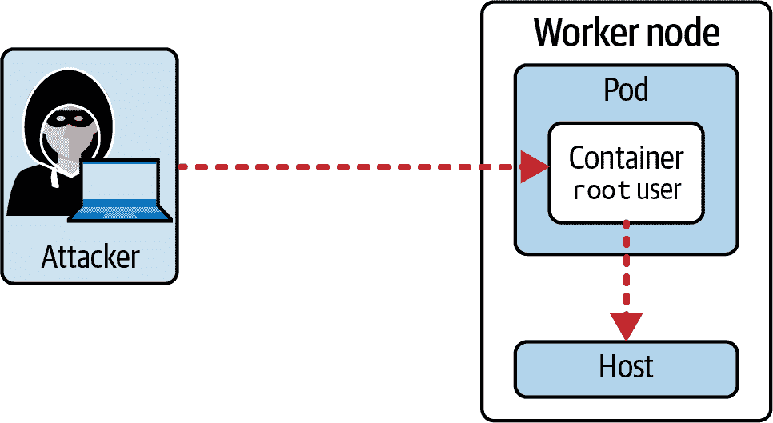
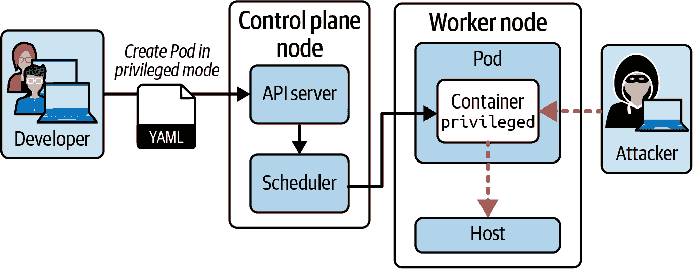
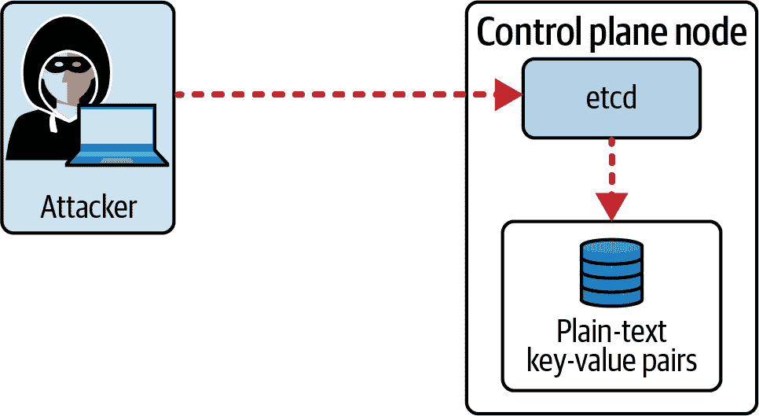
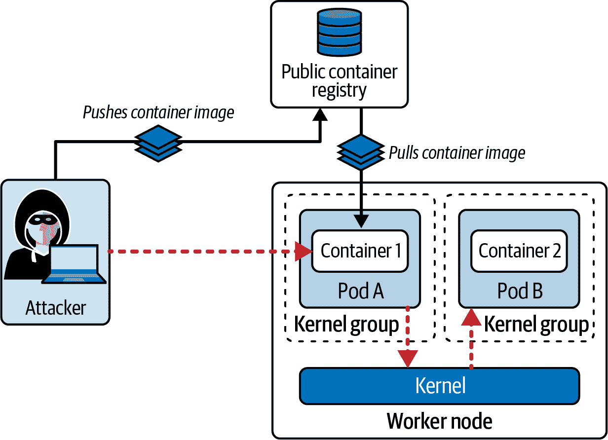
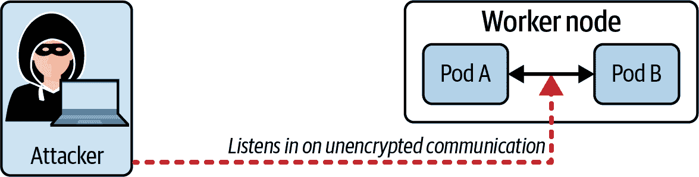

# 第五章：最小化微服务漏洞

在 Kubernetes 集群中操作的应用程序堆栈通常遵循微服务架构。“最小化微服务漏洞”领域涵盖了在 Pod 级别上实施安全设置的治理和强制执行。我们将介绍 Kubernetes 核心功能以及外部工具，帮助减少安全漏洞。此外，我们还将讨论运行微服务的 Pod 之间的加密网络通信。

在高层次上，本章涵盖以下概念：

+   设置适当的操作系统级安全域与安全上下文，Pod 安全审计（PSA）和 Open Policy Agent Gatekeeper

+   管理秘密

+   使用容器运行时沙盒，如 gVisor 和 Kata 容器

+   通过双向传输层安全协议（TLS）实现 Pod 之间的通信加密

# 设置适当的操作系统级安全域

Kubernetes 核心和 Kubernetes 生态系统均提供了定义、实施和管理 Pod 和容器级别安全设置的解决方案。本节将讨论安全上下文、Pod 安全审计和 Open Policy Agent Gatekeeper。您将学习如何通过示例应用每个功能和工具，展示它们在安全性方面的重要性。让我们从设置一个场景开始。

## 情景：攻击者滥用 root 用户容器访问权限

默认情况下，容器以 root 权限运行。应用程序中的漏洞可能会授予攻击者`root`访问容器的权限。容器的 root 用户与主机上的 root 用户相同。攻击者不仅可以检查或修改应用程序，还可能安装额外的工具，使攻击者能够打破容器并以`root`权限进入主机命名空间。攻击者还可以将主机文件系统的敏感数据复制到容器中。图 5-1 说明了该场景。



###### 图 5-1\. 攻击者滥用 root 用户容器访问权限

因此，默认情况下以 root 用户运行容器是一个不好的选择。接下来的章节将解释如何为容器声明一个安全上下文，强制使用非 root 用户或特定用户和/或组标识符。我们还将讨论其他与从容器到主机的访问隔离相关的安全上下文设置。

## 理解安全上下文

作为容器编排引擎的 Kubernetes 可以应用额外的配置来增强容器安全性。通过定义安全上下文来实现。安全上下文定义了 Pod 或容器的特权和访问控制设置。以下列表提供了一些示例：

+   应用程序应使用的用户 ID 来运行 Pod 和/或容器

+   文件系统访问应使用的组 ID

+   授予容器内运行的进程部分 root 用户权限但不是全部权限

安全上下文不是 Kubernetes 的原语。它被建模为 Pod 规范内的一组属性，在指令 `securityContext` 下。在 Pod 级别定义的安全设置适用于在 Pod 中运行的所有容器；但容器级别的设置优先。有关 Pod 级别安全属性的更多信息，请参阅 [PodSecurityContext API](https://oreil.ly/cJWXA)。容器级别的安全属性可以在 [SecurityContext API](https://oreil.ly/XOy2a) 中找到。

## 强制使用非 root 用户

我们将看一个使用案例，使功能更透明。某些镜像，如用于开源反向代理服务器 nginx 的镜像，必须以 `root` 用户运行。假设你想强制容器不能作为 `root` 用户运行，以支持更合理的安全策略。文件 `container-non-root-user-error.yaml` 中的 YAML 清单文件（示例 5-1）定义了特定容器的安全配置。此安全上下文仅适用于此容器，而不适用于其他容器（如果你要定义更多的话）。

##### 示例 5-1\. 强制在需要以 root 用户运行的镜像上使用非 root 用户

```
apiVersion: v1
kind: Pod
metadata:
  name: non-root-error
spec:
  containers:
  - image: nginx:1.23.1
    name: nginx
    securityContext:
      runAsNonRoot: true
```

容器在启动过程中失败，状态为 `CreateContainer​Confi⁠gError`。查看 Pod 的事件日志显示，镜像尝试以 `root` 用户运行。配置的安全上下文不允许这样做：

```
$ kubectl apply -f container-non-root-user-error.yaml
pod/non-root-error created
$ kubectl get pod non-root-error
NAME             READY   STATUS                       RESTARTS   AGE
non-root-error   0/1     CreateContainerConfigError   0          9s
$ kubectl describe pod non-root-error
...
Events:
  Type     Reason     Age               From               Message
  ----     ------     ----              ----               -------
  Normal   Scheduled  24s               default-scheduler  Successfully \
  assigned default/non-root to minikube
  Normal   Pulling    24s               kubelet            Pulling image \
  "nginx:1.23.1"
  Normal   Pulled     16s               kubelet            Successfully \
  pulled image "nginx:1.23.1" in 7.775950615s
  Warning  Failed     4s (x3 over 16s)  kubelet            Error: container \
  has runAsNonRoot and image will run as root (pod: "non-root-error_default \
  (6ed9ed71-1002-4dc2-8cb1-3423f86bd144)", container: secured-container)
  Normal   Pulled     4s (x2 over 16s)  kubelet            Container image \
  "nginx:1.23.1" already present on machine
```

有可用的替代 nginx 容器镜像，不需要以 `root` 用户运行。例如 [bitnami/nginx](https://oreil.ly/EnvzT)。示例 5-2 展示了文件 `container-non-root-user-success.yaml` 的内容。此文件的主要变更是为 `spec.containers[].image` 属性分配的值。

##### 示例 5-2\. 强制在支持使用用户 ID 运行的镜像上使用非 root 用户

```
apiVersion: v1
kind: Pod
metadata:
  name: non-root-success
spec:
  containers:
  - image: bitnami/nginx:1.23.1
    name: nginx
    securityContext:
      runAsNonRoot: true
```

使用 `runAsNonRoot` 指令启动容器将正常工作。容器转换为“运行”状态：

```
$ kubectl apply -f container-non-root-user-success.yaml
pod/non-root-success created
$ kubectl get pod non-root-success
NAME               READY   STATUS    RESTARTS   AGE
non-root-success   1/1     Running   0          7s
```

让我们快速检查容器使用哪个用户 ID。进入容器并运行 `id` 命令。输出显示用户 ID、组 ID 和附加组的 ID。镜像 `bitnami/nginx` 在构建容器镜像时通过指令将用户 ID 设置为 1001：

```
$ kubectl exec non-root-success -it -- /bin/sh
$ id
uid=1001 gid=0(root) groups=0(root)
$ exit
```

## 设置特定的用户和组 ID

许多容器镜像未设置显式的用户 ID 或组 ID。不使用 `root` 默认用户运行，可以设置所需的用户 ID 和组 ID，以最小化潜在的安全风险。文件 `container-user-id.yaml` 中存储的 YAML 清单文件（示例 5-3）将用户 ID 设置为 1000，组 ID 设置为 3000。

##### 示例 5-3\. 使用特定用户和组 ID 运行容器

```
apiVersion: v1
kind: Pod
metadata:
  name: user-id
spec:
  containers:
  - image: busybox:1.35.0
    name: busybox
    command: ["sh", "-c", "sleep 1h"]
    securityContext:
      runAsUser: 1000
      runAsGroup: 3000
```

创建 Pod 将无问题。容器转换为“运行”状态：

```
$ kubectl apply -f container-user-id.yaml
pod/user-id created
$ kubectl get pods user-id
NAME      READY   STATUS    RESTARTS   AGE
user-id   1/1     Running   0          6s
```

进入容器后，您可以检查用户 ID 和组 ID。当前用户无权在`/`目录中创建文件。在`/tmp`目录中创建文件将起作用，因为大多数用户都有写入权限：

```
$ kubectl exec user-id -it -- /bin/sh
/ $ id
uid=1000 gid=3000 groups=3000
/ $ touch test.txt
touch: test.txt: Permission denied
/ $ touch /tmp/test.txt
/ $ exit
```

## 避免使用特权容器

Kubernetes 在进程、网络、挂载、用户 ID 等方面在容器命名空间和主机命名空间之间建立了明确的分离。您可以配置容器的安全上下文以获取对主机命名空间某些方面的权限。使用特权容器时，请考虑以下影响：

+   容器内的进程几乎具有与主机上进程相同的权限。

+   容器具有访问主机上所有设备的权限。

+   容器中的`root`用户具有与主机上的`root`用户类似的权限。

+   可以在容器中挂载主机文件系统上的所有目录。

+   可以通过使用[`sysctl`命令](https://oreil.ly/YEcOs)更改内核设置。

# 使用特权模式的容器

配置容器以使用特权模式应该是一个罕见的情况。大多数运行在容器中的应用程序和进程不需要超出容器命名空间之外的提升权限。如果遇到配置为使用特权模式的 Pod，请联系负责的团队或开发者进行澄清，因为这将为攻击者打开入侵主机系统的漏洞。

让我们比较配置为非特权容器和配置为特权模式运行的容器的行为。首先，我们将设置一个常规的 Pod，如示例 5-4 所示。在 Pod 或容器级别未设置安全上下文。

##### 示例 5-4\. 使用非特权模式的容器中的 Pod

```
apiVersion: v1
kind: Pod
metadata:
  name: non-privileged
spec:
  containers:
  - image: busybox:1.35.0
    name: busybox
    command: ["sh", "-c", "sleep 1h"]
```

创建 Pod 并确保其正确启动：

```
$ kubectl apply -f non-privileged.yaml
pod/non-privileged created
$ kubectl get pods
NAME             READY   STATUS    RESTARTS   AGE
non-privileged   1/1     Running   0          6s
```

为了演示容器命名空间与主机命名空间之间的隔离，我们将尝试使用`sysctl`来更改主机名。正如您在命令输出中所看到的那样，容器明确执行受限权限：

```
$ kubectl exec non-privileged -it -- /bin/sh
/ # sysctl kernel.hostname=test
sysctl: error setting key 'kernel.hostname': Read-only file system
/ # exit
```

要使容器具有特权，请简单地将值`true`分配给安全上下文属性`privileged`。在示例 5-5 中的 YAML 清单中显示了一个示例。

##### 示例 5-5\. 配置为运行在特权模式中的容器的 Pod

```
apiVersion: v1
kind: Pod
metadata:
  name: privileged
spec:
  containers:
  - image: busybox:1.35.0
    name: busybox
    command: ["sh", "-c", "sleep 1h"]
    securityContext:
      privileged: true
```

如常创建 Pod。Pod 应该转换为“Running”状态：

```
$ kubectl apply -f privileged.yaml
pod/privileged created
$ kubectl get pod privileged
NAME         READY   STATUS    RESTARTS   AGE
privileged   1/1     Running   0          6s
```

现在您可以看到，相同的`sysctl`将允许您更改主机名：

```
$ kubectl exec privileged -it -- /bin/sh
/ # sysctl kernel.hostname=test
kernel.hostname = test
/ # exit
```

与特权模式相关的容器安全上下文配置是属性`allowPrivilegeEscalation`。此属性将允许运行容器的进程获得比父进程更多的权限。该属性的默认值为`false`，但如果看到将属性设置为`true`，请对其使用进行严格审查。在大多数情况下，您不需要此功能。

## 情景：开发者不遵循 Pod 安全最佳实践

假设开发人员在 Kubernetes 功能方面，特别是适用于安全最佳实践的方面，没有广泛的知识是不公平的。在前一节中，我们了解了安全上下文以及要避免使用的设置。开发人员可能不知道这些最佳实践，没有持续的教育，因此可能会创建使用问题安全设置或根本不使用安全设置的 Pod。Figure 5-2 显示了一名开发人员使用从互联网上找到的复制清单在启用特权模式下创建 Pod。攻击者将乐意利用这种设置获取优势。



###### 图 5-2\. 开发人员创建启用特权模式的 Pod

作为 Kubernetes 安全专家，您就是这里的关键人物。Kubernetes 生态系统提供了核心功能和外部工具，用于强制执行 Pod 的安全标准，以便没有正确配置的对象将被拒绝或至少会进行审计。下一节将探讨名为 Pod 安全入场的 Kubernetes 核心功能。

## 理解 Pod 安全入场（PSA）

Kubernetes 的旧版本附带了名为 Pod 安全策略（PSP）的功能。Pod 安全策略是一个概念，帮助强制执行 Pod 对象的安全标准。Kubernetes 1.21 弃用了 Pod 安全策略，并引入了其替代功能 Pod 安全入场。PSA 决定要遵循哪个 Pod 安全标准（PSS）。PSS 定义了从高度限制到高度宽松的安全策略范围。

然而，Kubernetes 1.25 完全删除了 Pod 安全策略。您可能仍然会在旧版本的 CKS 课程中看到此功能。我们在本书中将仅关注 Pod 安全入场。PSA 在 Kubernetes 1.23 中默认启用；但是，您需要声明哪些 Pod 应遵循安全标准。要选择 PSA 功能，您只需在命名空间中添加特定格式的标签。该命名空间中的所有 Pod 将必须遵循声明的标准。

标签包含三个部分：前缀、模式和级别。*前缀* 总是使用硬编码值 `pod-security.kubernetes.io`，后面跟着一个斜线。*模式* 决定了违规处理方式。最后，*级别* 规定了遵循的安全标准的程度。这样的标签示例可能如下所示：

```
metadata:
  labels:
    pod-security.kubernetes.io/enforce: restricted
```

模式允许设置三种不同的选项，如 Table 5-1 所示。

Table 5-1\. Pod 安全入场模式

| 模式 | 行为 |
| --- | --- |
| `enforce` | 违规将导致 Pod 被拒绝。 |
| `audit` | 允许创建 Pod。违规将被记录到审计日志中。 |
| `warn` | 允许创建 Pod。违规将在控制台上显示。 |

Table 5-2 说明了由 PSA 设置的级别确定的安全策略。

Table 5-2\. Pod 安全入场级别

| 级别 | 行为 |
| --- | --- |
| `privileged` | 完全无限制的策略。 |
| `baseline` | 最低限度的限制性策略，覆盖了关键标准。 |
| `restricted` | 遵循从安全角度加固 Pod 的最佳实践的严格限制性策略。 |

详细了解 PSA 的内容，请参阅 [Kubernetes 文档](https://oreil.ly/DYziy)。

## 为命名空间执行 Pod 安全标准

在 `psa` 命名空间中将 PSA 应用于一个 Pod。示例 5-6 展示了命名空间的定义及相关标签的声明。该标签将强制执行最高级别的安全标准。

##### Example 5-6\. 强制执行最高级别安全标准的命名空间

```
apiVersion: v1
kind: Namespace
metadata:
  name: psa
  labels:
    pod-security.kubernetes.io/enforce: restricted
```

确保 Pod 在 `psa` 命名空间中创建。示例 5-7 展示了运行 `busybox` 镜像的简单 Pod 的 YAML 清单。

##### Example 5-7\. 违反 PSA 限制的 Pod

```
apiVersion: v1
kind: Pod
metadata:
  name: busybox
  namespace: psa
spec:
  containers:
  - image: busybox:1.35.0
    name: busybox
    command: ["sh", "-c", "sleep 1h"]
```

在运行创建 Pod 的命令时，违规将在控制台中呈现。如下所示，该 Pod 无法被创建：

```
$ kubectl create -f psa-namespace.yaml
namespace/psa created
$ kubectl apply -f psa-violating-pod.yaml
Error from server (Forbidden): error when creating "psa-pod.yaml": pods \
"busybox" is forbidden: violates PodSecurity "restricted:latest": \
allowPrivilegeEscalation != false (container "busybox" must set \
securityContext.allowPrivilegeEscalation=false), unrestricted \
capabilities (container "busybox" must set securityContext. \
capabilities.drop=["ALL"]), runAsNonRoot != true (pod or container \
"busybox" must set securityContext.runAsNonRoot=true), seccompProfile \
(pod or container "busybox" must set securityContext.seccompProfile. \
type to "RuntimeDefault" or "Localhost")
$ kubectl get pod -n psa
No resources found in psa namespace.
```

您需要配置 Pod 的安全上下文设置，以遵循非常严格的标准。示例 5-8 展示了一个示范 Pod 定义，它不违反 Pod 安全标准。

##### Example 5-8\. 跟随 PSS 的 Pod

```
apiVersion: v1
kind: Pod
metadata:
  name: busybox
  namespace: psa
spec:
  containers:
  - image: busybox:1.35.0
    name: busybox
    command: ["sh", "-c", "sleep 1h"]
    securityContext:
      allowPrivilegeEscalation: false
      capabilities:
        drop: ["ALL"]
      runAsNonRoot: true
      runAsUser: 2000
      runAsGroup: 3000
      seccompProfile:
        type: RuntimeDefault
```

现在创建 Pod 对象按预期运行：

```
$ kubectl apply -f psa-non-violating-pod.yaml
pod/busybox created
$ kubectl get pod busybox -n psa
NAME      READY   STATUS    RESTARTS   AGE
busybox   1/1     Running   0          10s
```

PSA 是 Kubernetes 1.23 版本或更高版本中默认启用的内置功能。它易于采用，允许选择合适的策略标准，并可配置为强制执行或仅记录违规行为。

不幸的是，PSA 仅适用于具有预定义策略集的 Pod。您无法编写自定义规则、更改消息传递或变异 Pod 对象，如果不符合 PSS 的话。在下一节中，我们将研究超越 PSA 功能的工具。

## 了解开放策略代理（OPA）和 Gatekeeper

[Open Policy Agent (OPA)](https://oreil.ly/oK9pI) 是一款开源的通用策略引擎，用于强制执行规则。OPA 不特定于 Kubernetes，可以在其他技术堆栈中使用。其好处之一是能够以非常灵活的方式定义策略。您可以使用名为 [Rego](https://oreil.ly/0_mA8) 的查询语言编写自己的规则。在 Rego 中编写的验证逻辑确定是否接受或拒绝对象。

[Gatekeeper](https://oreil.ly/AyVjP) 是 Kubernetes 的一个扩展，使用 OPA。Gatekeeper 允许为任何类型的 Kubernetes API 原语定义和强制执行自定义策略。因此，它比 PSA 更加灵活，但需要更复杂的知识来制定这些规则。Gatekeeper 参与了讨论的 *准入控制* 阶段，详见 “处理请求”。以下策略列表试图给您展示 Gatekeeper 的可能性：

+   确保所有 Service 对象都需要定义一个带有键 `team` 的标签。

+   确保 Pods 定义的所有容器镜像都从公司内部注册表中拉取。

+   确保 Deployments 需要至少控制三个副本。

在撰写本文时，Gatekeeper 允许通过拒绝对象创建来强制执行策略，如果未满足要求。Gatekeeper 的未来版本还可能提供一种在创建时改变对象的机制。例如，您可能希望为创建的任何对象添加特定的标签键值对。该变动将自动处理添加这些标签。

## 安装 Gatekeeper

安装 Gatekeeper 相对简单。您只需从 Gatekeeper 项目提供的 YAML 清单创建一堆 Kubernetes 对象即可。您需要有集群管理员权限来正确安装 Gatekeeper。以下命令展示了应用最新发布版的 `kubectl` 命令。更多信息，请参阅 [安装手册](https://oreil.ly/CyZ1c)。

```
$ kubectl apply -f https://raw.githubusercontent.com/open-policy-agent/\
gatekeeper/master/deploy/gatekeeper.yaml
```

Gatekeeper 对象已安装在命名空间 `gatekeeper-system` 中。确保在尝试使用 Gatekeeper 之前，命名空间中的所有 Pods 都转入“运行”状态：

```
$ kubectl get namespaces
NAME                STATUS   AGE
default             Active   29h
gatekeeper-system   Active   4s
...
```

## 实施 OPA 策略。

我们将使用一个具体的用例作为示例，演示定义自定义 OPA 策略所需的各部分。“使用网络策略限制 Pod 间通信” 解释了如何为命名空间分配标签，以便从网络策略中选择。在其核心，我们的自定义 OPA 策略将确定命名空间需要定义至少一个带有键 `app` 的标签，以表示命名空间托管的应用程序。

Gatekeeper 要求我们为自定义策略实现两个组件，*约束模板* 和 *约束*。简言之，约束模板使用 Rego 定义规则，并描述约束的模式。示例 5-9 展示了用于强制执行标签分配的约束模板定义。

##### 示例 5-9\. 使用 OPA 约束模板要求至少定义一个单一标签

```
apiVersion: templates.gatekeeper.sh/v1
kind: ConstraintTemplate
metadata:
  name: k8srequiredlabels
spec:
  crd:
    spec:
      names:
        kind: K8sRequiredLabels 
      validation:
        openAPIV3Schema: 
          type: object
          properties:
            labels:
              type: array
              items:
                type: string
  targets:
    - target: admission.k8s.gatekeeper.sh
      rego: | 
        package k8srequiredlabels

        violation[{"msg": msg, "details": {"missing_labels": missing}}] {
          provided := {label | input.review.object.metadata.labels[label]}
          required := {label | label := input.parameters.labels[_]}
          missing := required - provided
          count(missing) > 0
          msg := sprintf("you must provide labels: %v", [missing])
        }
```


声明用于约束的类型。


指定约束的验证模式。在这种情况下，我们允许传递名为 `labels` 的属性，其中捕获所需的标签键。


使用 Rego 检查标签的存在并将其与所需键的列表进行比较。

约束本质上是约束模板的实现。它使用约束模板定义的种类，并填充终端用户提供的数据。在 示例 5-10 中，种类是 `K8sRequiredLabels`，我们在约束模板中定义了它。我们正在匹配命名空间，并期望它们定义具有键 `app` 的标签。

##### 示例 5-10\. 定义策略“数据”的 OPA 约束

```
apiVersion: constraints.gatekeeper.sh/v1beta1
kind: K8sRequiredLabels 
metadata:
  name: ns-must-have-app-label-key
spec:
  match: 
    kinds:
      - apiGroups: [""]
        kinds: ["Namespace"]
  parameters: 
    labels: ["app"]
```


使用约束模板定义的种类。


定义约束模板应用的 API 资源。


声明 `labels` 属性期望存在键 `app`。

有了相关的 YAML 清单，让我们为约束模板和约束创建对象。假设约束模板写入文件 `constraint-template-labels.yaml`，约束写入文件 `constraint-ns-labels.yaml`：

```
$ kubectl apply -f constraint-template-labels.yaml
constrainttemplate.templates.gatekeeper.sh/k8srequiredlabels created
$ kubectl apply -f constraint-ns-labels.yaml
k8srequiredlabels.constraints.gatekeeper.sh/ns-must-have-app-label-key created
```

您可以通过快速运行的命令验证验证行为。以下命令尝试创建一个没有标签分配的新命名空间。 Gatekeeper 将呈现错误消息并阻止对象的创建：

```
$ kubectl create ns governed-ns
Error from server (Forbidden): admission webhook "validation.gatekeeper.sh" \
denied the request: [ns-must-have-app-label-key] you must provide labels: {"app"}
```

让我们确保我们实际上可以创建具有预期标签分配的命名空间。示例 5-11 展示了这样一个命名空间的 YAML 清单。

##### 示例 5-11\. 具有标签分配的命名空间的 YAML 清单

```
apiVersion: v1
kind: Namespace
metadata:
  labels:
    app: orion
  name: governed-ns
```

以下命令从名为 `namespace-app-label.yaml` 的 YAML 清单文件创建对象：

```
$ kubectl apply -f namespace-app-label.yaml
namespace/governed-ns created
```

这个简单的例子演示了 OPA Gatekeeper 的使用。您可以在 [OPA Gatekeeper Library](https://oreil.ly/1VV5e) 中找到许多其他示例。尽管 CKS 课程没有明确说明，您可能还想查看最近在 Kubernetes 社区中获得了很多关注的项目 [Kyverno](https://kyverno.io)。

# 管理秘密

Kubernetes 安全功能讨论不完整，没有提到 Secrets。我假设你已经非常熟悉 API 原语 Secret 用于定义敏感数据以及在 Pod 中消费的不同选项。考虑到这个主题已经是 CKA 考试的一部分，我在这里不再赘述。更多信息，请参阅《[*Certified Kubernetes Administrator (CKA) Study Guide*](https://oreil.ly/cka-study-guide)》中的相关章节或者[Kubernetes 文档](https://oreil.ly/1afoc)。我在“Configuring a Container with a ConfigMap or Secret”章节中讨论在容器中消费 ConfigMaps 和 Secrets 时的安全方面。

CKS 考试更加强调 Secret 管理的更专业方面。其中一个场景是处理可以分配给服务账户的 Secret，我们已经提到过。回顾“Creating a Secret for a service account”以刷新你对该主题的记忆。由于我们不会在这里讨论所有内置的 Secret 类型，请阅读相关章节了解它们的用途和创建方式在[Kubernetes 文档](https://oreil.ly/YU7Yy)中。

存储 Secrets 键值对的中心位置是 etcd。让我们来看看，如果攻击者能够访问 Kubernetes 后端存储集群数据，可能会出现的潜在问题。

## 场景：攻击者获得访问运行 etcd 的节点

etcd 运行的位置取决于你的 Kubernetes 集群的[拓扑结构](https://oreil.ly/bf5Gt)。为了这个场景，我们假设 etcd 运行在控制平面节点上。存储在 etcd 中的任何数据都以未加密形式存在，因此访问控制平面节点允许以明文形式读取 Secrets。图 5-3 展示了攻击者访问控制平面节点和因此在 etcd 中的未加密 Secrets。



###### 图 5-3\. 攻击者获得访问 etcd 并读取 Secrets

缓解这种情况的一种方法是加密存储在 etcd 中的数据。无论是使用 `etcdctl` 访问 etcd 还是从文件系统读取 etcd 数据，都不会再暴露出人类可读的敏感信息。

## 访问 etcd 数据

我们将首先展示，攻击者在能够登录控制平面节点后如何读取 etcd 数据。首先，我们需要创建一个 Secret 对象以存储在 etcd 中。使用以下命令来创建一个条目：

```
$ kubectl create secret generic app-config --from-literal=password=passwd123
secret/app-config created
```

我们创建了一个带有键值对 `password=passwd123` 的 Secret。使用 SSH 登录控制平面节点。你可以轻松使用 etcd 客户端工具 `etcdctl` 从 etcd 中读取一个条目。

# 使用 etcd 客户端工具 etcdctl

很可能您尚未在控制平面节点上安装`etcdctl`。请按照[安装手册](https://oreil.ly/wpCkO)安装工具。在 Debian Linux 上，可以使用`sudo apt install etcd-client`进行安装。要对 etcd 进行身份验证，您需要提供必需的命令行选项`--cacert`、`--cert`和`--key`。您可以在通常位于`/etc/kubernetes/manifests/kube-apiserver.yaml`的 API 服务器配置文件中找到相应的值。参数需要以`--etcd`前缀开头。

以下命令使用必需的 CLI 选项从名为`app-config`的秘密对象中读取内容。以下输出以十六进制格式显示文件内容。虽然不是 100%明显，但您仍然可以从输出中识别出明文的键值对：

```
$ sudo ETCDCTL_API=3 etcdctl --cacert=/etc/kubernetes/pki/etcd/ca.crt \
--cert=/etc/kubernetes/pki/etcd/server.crt --key=/etc/kubernetes/pki/\
etcd/server.key get /registry/secrets/default/app-config | hexdump -C
00000000  2f 72 65 67 69 73 74 72  79 2f 73 65 63 72 65 74  |/registry/secret|
00000010  73 2f 64 65 66 61 75 6c  74 2f 61 70 70 2d 63 6f  |s/default/app-co|
00000020  6e 66 69 67 0a 6b 38 73  00 0a 0c 0a 02 76 31 12  |nfig.k8s.....v1.|
00000030  06 53 65 63 72 65 74 12  d9 01 0a b7 01 0a 0a 61  |.Secret........a|
00000040  70 70 2d 63 6f 6e 66 69  67 12 00 1a 07 64 65 66  |pp-config....def|
00000050  61 75 6c 74 22 00 2a 24  36 38 64 65 65 34 34 38  |ault".*$68dee448|
00000060  2d 34 39 62 37 2d 34 34  32 66 2d 39 62 32 66 2d  |-49b7-442f-9b2f-|
00000070  33 66 39 62 39 62 32 61  66 66 36 64 32 00 38 00  |3f9b9b2aff6d2.8.|
00000080  42 08 08 97 f8 a4 9b 06  10 00 7a 00 8a 01 65 0a  |B.........z...e.|
00000090  0e 6b 75 62 65 63 74 6c  2d 63 72 65 61 74 65 12  |.kubectl-create.|
000000a0  06 55 70 64 61 74 65 1a  02 76 31 22 08 08 97 f8  |.Update..v1"....|
000000b0  a4 9b 06 10 00 32 08 46  69 65 6c 64 73 56 31 3a  |.....2.FieldsV1:|
000000c0  31 0a 2f 7b 22 66 3a 64  61 74 61 22 3a 7b 22 2e  |1./{"f:data":{".|
000000d0  22 3a 7b 7d 2c 22 66 3a  70 61 73 73 77 6f 72 64  |":{},"f:password|
000000e0  22 3a 7b 7d 7d 2c 22 66  3a 74 79 70 65 22 3a 7b  |":{}},"f:type":{|
000000f0  7d 7d 42 00 12 15 0a 08  70 61 73 73 77 6f 72 64  |}}B.....password|
00000100  12 09 70 61 73 73 77 64  31 32 33 1a 06 4f 70 61  |..passwd123..Opa|
00000110  71 75 65 1a 00 22 00 0a                           |que.."..|
```

接下来，我们将加密存储在 etcd 中的秘密，然后使用相同的命令验证现有条目。

## 加密 etcd 数据

您可以使用命令行选项`--encryption-provider-config`控制 API 数据在 etcd 中如何加密，该选项提供给 API 服务器进程。分配给参数的值需要指向一个定义了`EncryptionConfiguration`对象的配置文件。我们将首先创建配置文件，然后配置 API 服务器进程来消耗它。

生成一个 32 字节的随机密钥并对其进行 base64 编码。该值用于配置所谓的加密配置中的提供程序：

```
$ head -c 32 /dev/urandom | base64
W68xlPT/VXcOSEZJvWeIvkGJnGfQNFpvZYfT9e+ZYuY=
```

接下来，我们将使用 base64 编码的密钥并将其分配给加密配置中的提供程序，如示例 5-12 所示。将内容保存在文件`/etc/kubernetes/enc/enc.yaml`中。

##### 示例 5-12\. 用于加密配置的 YAML 清单

```
apiVersion: apiserver.config.k8s.io/v1
kind: EncryptionConfiguration
resources:
  - resources:
      - secrets 
    providers:
      - aescbc:
          keys:
            - name: key1
              secret: W68xlPT/VXcOSEZJvWeIvkGJnGfQNFpvZYfT9e+ZYuY= 
      - identity: {}
```


定义要在 etcd 中加密的 API 资源。我们这里只加密秘密数据。


分配给 AES-CBC 加密提供程序的 base64 编码密钥。

编辑位于`/etc/kubernetes/manifests/kube-apiserver.yaml`的清单，这是定义如何在 Pod 中运行 API 服务器的 YAML 清单。添加参数`--encryption-provider-config`，并定义配置文件的 Volume 及其挂载路径，如下所示：

```
$ sudo vim /etc/kubernetes/manifests/kube-apiserver.yaml
apiVersion: v1
kind: Pod
metadata:
  annotations:
    kubeadm.kubernetes.io/kube-apiserver.advertise-address.endpoint: \
    192.168.56.10:6443
  creationTimestamp: null
  labels:
    component: kube-apiserver
    tier: control-plane
  name: kube-apiserver
  namespace: kube-system
spec:
  containers:
  - command:
    - kube-apiserver
    - --encryption-provider-config=/etc/kubernetes/enc/enc.yaml
    volumeMounts:
    ...
    - name: enc
      mountPath: /etc/kubernetes/enc
      readonly: true
  volumes:
  ...
  - name: enc
    hostPath:
      path: /etc/kubernetes/enc
      type: DirectoryOrCreate
...
```

运行 API 服务器的 Pod 应该会自动重新启动。这个过程可能需要几分钟时间。一旦完全重启，您应该能够查询它：

```
$ kubectl get pods -n kube-system
NAME                           READY   STATUS    RESTARTS   AGE
...
kube-apiserver-control-plane   1/1     Running   0          69s
```

新的秘密将自动加密。现有的秘密需要更新。您可以运行以下命令来跨所有命名空间执行秘密的更新。这包括`default`命名空间中名为`app-config`的秘密：

```
$ kubectl get secrets --all-namespaces -o json | kubectl replace -f -
...
secret/app-config replaced
```

运行我们之前使用的`etcdctl`命令将显示`aescbc`提供程序已用于加密数据。密码值不再能以明文读取：

```
$ sudo ETCDCTL_API=3 etcdctl --cacert=/etc/kubernetes/pki/etcd/ca.crt \
--cert=/etc/kubernetes/pki/etcd/server.crt --key=/etc/kubernetes/pki/\
etcd/server.key get /registry/secrets/default/app-config | hexdump -C
00000000  2f 72 65 67 69 73 74 72  79 2f 73 65 63 72 65 74  |/registry/secret|
00000010  73 2f 64 65 66 61 75 6c  74 2f 61 70 70 2d 63 6f  |s/default/app-co|
00000020  6e 66 69 67 0a 6b 38 73  3a 65 6e 63 3a 61 65 73  |nfig.k8s:enc:aes|
00000030  63 62 63 3a 76 31 3a 6b  65 79 31 3a ae 26 e9 c2  |cbc:v1:key1:.&..|
00000040  7b fd a2 74 30 24 85 61  3c 18 1e 56 00 a1 24 65  |{..t0$.a<..V..$e|
00000050  52 3c 3f f1 24 43 9f 6d  de 5f b0 84 32 18 84 47  |R<?.$C.m._..2..G|
00000060  d5 30 e9 64 84 22 f5 d0  0b 6f 02 af db 1d 51 34  |.0.d."...o....Q4|
00000070  db 57 c8 17 93 ed 9e 00  ea 9a 7b ec 0e 75 0c 49  |.W........{..u.I|
00000080  6a e9 97 cd 54 d4 ae 6b  b6 cb 65 8a 5d 4c 3c 9c  |j...T..k..e.]L<.|
00000090  db 9b ed bc ce bf 3c ef  f6 2e cb 6d a2 53 25 49  |......<....m.S%I|
000000a0  d4 26 c5 4c 18 f3 65 bb  a8 4c 0f 8d 6e be 7b d3  |.&.L..e..L..n.{.|
000000b0  24 9b a8 09 9c bb a3 f9  53 49 78 86 f5 24 e7 10  |$.......SIx..$..|
000000c0  ad 05 45 b8 cb 31 bd 38  b6 5c 00 02 b2 a4 62 13  |..E..1.8.\....b.|
000000d0  d5 82 6b 73 79 97 7e fa  2f 5d 3b 91 a0 21 50 9d  |..ksy.~./];..!P.|
000000e0  77 1a 32 44 e1 93 9b 9c  be bf 49 d2 f9 dc 56 23  |w.2D......I...V#|
000000f0  07 a8 ca a5 e3 e7 d1 ae  9c 22 1f 98 b1 63 b8 73  |........."...c.s|
00000100  66 3f 9f a5 6a 45 60 a7  81 eb 32 e5 42 4d 2b fd  |f?..jE`...2.BM+.|
00000110  65 6c c2 c7 74 9f 1d 6a  1c 24 32 0e 7a 94 a2 60  |el..t..j.$2.z..`|
00000120  22 77 58 c9 69 c3 55 72  e8 fb 0b 63 9d 7f 04 31  |"wX.i.Ur...c...1|
00000130  00 a2 07 76 af 95 4e 03  0a 92 10 b8 bb 1e 89 94  |...v..N.........|
00000140  45 60 01 45 bf d7 95 df  ff 2e 9e 31 0a           |E`.E.......1.|
0000014d
```

要了解有关加密 etcd 数据的更多详细信息，请参阅[Kubernetes 文档](https://oreil.ly/uIylK)。在那里，您将找到关于其他加密提供者的额外信息，如何轮换解密密钥以及考虑用于高可用 (HA) 集群设置的过程。

# 理解容器运行时沙盒

容器在与主机环境隔离的容器运行时中运行。运行在容器中的进程或应用程序可以通过 syscalls 与内核交互。现在，我们可以在单个 Kubernetes 集群节点上运行多个容器（由 Pod 控制），因此使用相同的内核。在某些条件下，漏洞可能导致在容器运行的进程“突破”其隔离环境，并访问在同一主机上运行的另一个容器。*容器运行时沙盒*与常规容器运行时并行运行，但通过加强进程隔离添加了额外的安全层。

有几种情况下使用容器运行时沙盒可能是有意义的。例如，您的 Kubernetes 集群使用相同的基础设施处理不同客户的工作负载，这种称为多租户环境。另一个希望依赖更强容器隔离性的原因是，您可能不信任从公共注册表拉取的容器镜像中运行的进程或应用程序，特别是当您无法验证创建者或其运行时行为时。

## 情景：攻击者获取对另一个容器的访问权限

在这种情况下，我们面对的是开发者从公共注册表拉取容器镜像，如 Pod 所引用。该容器未经安全漏洞扫描。攻击者可以推送容器镜像的新标签来执行恶意代码。在实例化从该镜像运行的容器之后，运行在容器 1 的内核组中的恶意代码可以访问运行在容器 2 中的进程。正如您在图 5-4 中所看到的，两个容器使用同一主机系统的内核。



###### 图 5-4\. 攻击者获取对另一个容器的访问权限

一般来说，盲目信任公共容器镜像并不是一个好主意。确保这样的容器镜像以更高的隔离运行的一种方法是容器运行时沙盒。下一节将向您介绍两种实现方式，这两种方式在课程中都有明确提到。

## 可用的容器运行时沙盒实现

在本书中，我们只讨论两种容器运行时沙箱实现，[Kata Containers](https://katacontainers.io)和[gVisor](https://gvisor.dev)。

安装和配置 gVisor

## 示例 5-14\. 使用运行时类的 Pod 的 YAML 清单

创建和使用运行时类

接下来，配置用于签署归档和存储库的密钥。正如您在以下命令中所见，gVisor 托管在 Google 存储中：

```
$ sudo apt-get update && \
  sudo apt-get install -y \
    apt-transport-https \
    ca-certificates \
    curl \
    gnupg
```

Kata containers 通过在轻量级虚拟机中运行来实现容器隔离。gVisor 采取了不同的方法。它有效地实现了在主机系统上运行的 Linux 内核。因此，主机系统上的所有容器不再共享系统调用。

```
$ curl -fsSL https://gvisor.dev/archive.key | sudo gpg --dearmor -o /usr/share/\
keyrings/gvisor-archive-keyring.gpg
$ echo "deb [arch=$(dpkg --print-architecture) signed-by=/usr/share/keyrings/\
gvisor-archive-keyring.gpg] https://storage.googleapis.com/gvisor/releases \
release main" | sudo tee /etc/apt/sources.list.d/gvisor.list > /dev/null
```

最后，重新启动 containerd 以使更改生效：

```
$ sudo apt-get update && sudo apt-get install -y runsc
```

现在我们可以在 Pod 的配置中引用运行时类名`gvisor`。Example 5-14 展示了一个分配了`spec.runtimeClassName`属性的 Pod 定义，指定了运行时类。

```
$ cat <<EOF | sudo tee /etc/containerd/config.toml
version = 2
[plugins."io.containerd.runtime.v1.linux"]
  shim_debug = true
[plugins."io.containerd.grpc.v1.cri".containerd.runtimes.runc]
  runtime_type = "io.containerd.runc.v2"
[plugins."io.containerd.grpc.v1.cri".containerd.runtimes.runsc]
  runtime_type = "io.containerd.runsc.v1"
EOF
```

使用`apply`命令创建运行时类和 Pod 对象：

```
$ sudo systemctl restart containerd
```

示例 5-13\. 使用 runsc 处理程序定义运行时类的 YAML 清单

## gVisor 包含一个名为 runsc 的 Open Container Initiative (OCI)运行时。runsc 运行时与 Docker 和 Kubernetes 等工具集成，用于运行容器运行时沙箱。以下命令从存储库安装可执行文件：

假设我们正在使用 containerd 作为容器运行时。您需要向 containerd 添加一些配置以使其意识到 runsc。您可以在 gVisor 文档中找到其他容器运行时的类似说明：

##### 使用容器运行时沙箱在 Pod 中是一个两步骤的过程。首先，您需要创建一个运行时类。RuntimeClass 是一个 Kubernetes API 资源，用于定义容器运行时的配置。Example 5-13 展示了一个使用 runsc 处理程序的容器运行时的 YAML 清单。

```
apiVersion: node.k8s.io/v1
kind: RuntimeClass
metadata:
  name: gvisor
handler: runsc
```

以下[instructions](https://oreil.ly/MlSET)描述了使用`apt`软件包管理器在 Linux 上安装 gVisor 所需的步骤。您需要在所有被声明为工作节点的主机机器上重复这些步骤。在考试中，您不需要安装 gVisor 或 Kata Containers。您可以假设容器运行时沙箱已经安装并配置好了。

##### 从以下命令开始安装 gVisor 的依赖项：

```
apiVersion: v1
kind: Pod
metadata:
  name: nginx
spec:
  runtimeClassName: gvisor
  containers:
  - name: nginx
    image: nginx:1.23.2
```

对于这些容器运行时沙箱实现的特性集或特定用例的深入讨论超出了本书的范围。我们将简单地学习如何使用一个解决方案作为示例，即 gVisor，并如何将其与 Kubernetes 集成。详细比较，请查看讲座[“Kata Containers 和 gVisor：定量比较”](https://oreil.ly/PBfEn)。

```
$ kubectl apply -f runtimeclass.yaml
runtimeclass.node.k8s.io/gvisor created
$ kubectl apply -f pod.yaml
pod/nginx created
```

您可以通过设置容器运行时沙箱来验证容器是否正在运行。只需执行 `dmesg` 命令来检查内核环形缓冲区。命令的输出应该提到 gVisor，如下所示：

```
$ kubectl exec nginx -- dmesg
[    0.000000] Starting gVisor...
[    0.123202] Preparing for the zombie uprising...
[    0.415862] Rewriting operating system in Javascript...
[    0.593368] Reading process obituaries...
[    0.741642] Segmenting fault lines...
[    0.797360] Daemonizing children...
[    0.831010] Creating bureaucratic processes...
[    1.313731] Searching for needles in stacks...
[    1.455084] Constructing home...
[    1.834278] Gathering forks...
[    1.928142] Mounting deweydecimalfs...
[    2.109973] Setting up VFS...
[    2.157224] Ready!
```

# 理解 Pod 与 Pod 之间的 mTLS 加密

在 “使用网络策略限制 Pod 与 Pod 通信” 中，我们谈论了 Pod 与 Pod 之间的通信。一个重要的要点是，除非你制定更严格的网络策略，否则每个 Pod 都可以通过定位其虚拟 IP 地址与任何其他 Pod 通信。默认情况下，两个 Pod 之间的通信是未加密的。

TLS 提供网络通信的加密，通常与 HTTP 协议一起使用。当我们谈论从浏览器对 Web 页面的调用时，就会涉及使用 HTTPS 协议。作为认证过程的一部分，客户端向服务器提供其客户端证书以证明其身份。但服务器不对客户端进行认证。

在加载 Web 页面时，客户端（即浏览器）的身份通常并不重要。重要的是 Web 页面证明其身份。双向 TLS（mTLS）类似于 TLS，但双方都必须进行身份验证。这种方法有以下几个好处。首先，通过加密实现安全通信。其次，可以验证客户端身份。攻击者不能轻易冒充另一个 Pod。

## 情景：攻击者监听两个 Pod 之间的通信

攻击者可以利用默认的未加密 Pod 与 Pod 之间的网络通信行为来加以利用。如你在 图 5-5 中所见，攻击者甚至不需要侵入 Pod。他们可以简单地通过冒充发送端或接收端来监听 Pod 与 Pod 的通信，提取敏感信息，然后用于更高级的攻击向量。



###### 图 5-5\. 攻击者监听 Pod 与 Pod 之间的通信

通过设置 mTLS，你可以缓解这种情况。下一节将简要介绍实现这一目标的选项。

## 在 Kubernetes 中采用 mTLS

在 Kubernetes 集群中实现 mTLS 的棘手部分是证书的管理。正如你可以想象的，当实施微服务架构时，我们将不得不处理大量的证书。这些证书通常由官方证书颁发机构（CA）生成，以确保它们可以信任。请求证书涉及向 CA 发送证书签名请求（CSR）。如果 CA 批准请求，它将创建证书，然后签名并返回。建议在证书到期之前分配较短的生命周期，然后重新发行。这个过程称为证书轮换。

CKS 考试需要您了解 mTLS 的详细程度尚不太清楚。请求和批准证书的一般过程在[Kubernetes 文档](https://oreil.ly/QvtEQ)中有描述。

在大多数情况下，Kubernetes 管理员依赖于 Kubernetes 服务网格来实现 mTLS，而不是手动实现。Kubernetes 服务网格（如 Linkerd 或 Istio）是一种工具，用于为集群添加横切功能，如可观察性和安全性。

另一个选项是使用透明加密来确保流量不会在传输中未加密。一些流行的 CNI 插件，如[Calico](https://oreil.ly/XZSpx)和[Cilium](https://oreil.ly/Qsqq_)，已经增加了对[WireGuard](https://www.wireguard.com)的支持。WireGuard 是一种开源、轻量级和安全的虚拟专用网络（VPN）解决方案，无需配置或管理加密密钥或证书。许多团队更喜欢 WireGuard 而不是服务网格，因为它更易于管理。

考试不涵盖服务网格和 WireGuard。

# 总结

对于 Pod 来说，执行安全最佳实践非常重要。在本章中，我们审查了不同的选项。我们关注安全上下文以及如何在 Pod 和容器级别定义它们。例如，我们可以为容器配置一个安全上下文，使其以非 root 用户运行并防止使用特权模式。通常由开发人员负责定义这些设置。Pod 安全入场是 Kubernetes 的一个功能，可以进一步配置 Pod 安全设置。配置的安全标准可以强制执行、审计或仅记录到标准输出。Gatekeeper 是一个开源项目，实现了用于 Kubernetes 的 Open Policy Agent 的功能。不仅可以管理 Pod 对象的配置，还可以在创建时对其他类型的对象应用策略。

由 Secrets 定义的键值对以明文存储在 etcd 中。您应该配置 etcd 的加密，以确保攻击者无法从中读取敏感数据。要启用加密，创建一个 EncryptionConfiguration 的 YAML 清单，然后使用命令行选项`--encryption-provider-config`将其传递给 API 服务器进程。

容器运行时沙盒比常规容器运行时更有效地隔离进程和应用程序。项目 Kata Containers 和 gVisor 是此类容器运行时沙盒的实现，可以安装并配置以与 Kubernetes 一起工作。我们尝试了 gVisor。安装和配置 gVisor 后，您需要创建一个指向 runsc 的 RuntimeClass 对象。在 Pod 配置中，通过名称指向 RuntimeClass 对象。

默认情况下，Pod 到 Pod 的通信是未加密且未认证的。双向 TLS 可以使这个过程更安全。互相通信的 Pods 需要提供证书来证明它们的身份。为具有数百个微服务的集群实现 mTLS 是一个繁琐的任务。每个运行微服务的 Pod 需要使用来自客户机机构的批准证书。服务网格可以作为 Kubernetes 集群中添加 mTLS 功能的一种方式。

# 考试要点

练习使用核心 Kubernetes 功能和外部工具来管理安全设置。

在本章的过程中，我们探讨了操作系统级别的安全设置及如何通过不同的核心功能和外部工具进行管理。您需要了解不同选项、它们的优势和局限性，并能够根据情境要求应用它们。练习使用安全上下文、Pod 安全审核和 Open Policy Agent Gatekeeper。Kubernetes 生态系统在这方面提供了更多的工具。可以自行探索以扩展视野。

了解 etcd 如何管理 Secrets 数据。

CKA 考试已经涵盖了使用 Secrets 将敏感配置数据注入到 Pods 的工作流程。我假设您已经知道如何操作。每个 Secret 的键值对都存储在 etcd 中。通过学习如何加密 etcd 来扩展您对 Secret 管理的知识，这样即使攻击者能访问运行 etcd 的主机，也无法以明文读取信息。

知道如何配置容器运行时沙盒的使用。

容器运行时沙盒有助于为容器增加更严格的隔离。您不需要安装容器运行时沙盒，如 Kata Containers 或 gVisor。但您需要了解如何通过 RuntimeClass 对象配置容器运行时沙盒的过程，并将 RuntimeClass 分配给 Pod 名称。

了解 mTLS 的重要性。

为所有在 Pod 中运行的微服务设置 mTLS 可能因证书管理而非常繁琐。在考试中，了解希望为 Pod 到 Pod 通信设置 mTLS 的一般用例。尽管您可能不需要手动实现它，但生产 Kubernetes 集群使用服务网格提供 mTLS 作为一种功能。

# 样例练习

这些练习的解决方案可以在 附录 中找到。

1.  创建一个名为 `busybox-security-context` 的 Pod，使用容器镜像 `busybox:1.28`，运行命令 `sh -c sleep 1h`。添加一个类型为 `emptydir` 的 Volume，并将其挂载到路径 `/data/test`。配置安全上下文，包括以下属性：`runAsUser: 1000`，`runAsGroup: 3000`，`fsGroup: 2000`。此外，将属性 `allowPrivilegeEscalation` 设置为 `false`。

    登入容器，导航到目录 `/data/test`，并创建名为 `hello.txt` 的文件。检查文件分配的群组。数值是多少？退出容器。

1.  创建一个 Pod 安全性审核（PSA）规则。在名为 `audited` 的命名空间中，创建一个 Pod 安全性标准（PSS），其级别为 `baseline`，该信息应该渲染到控制台。

    尝试在违反 PSS 的命名空间中创建一个 Pod，并在控制台日志中输出消息。您可以提供任何名称、容器映像和安全配置。Pod 是否被创建？需要配置哪些 PSA 级别来防止创建该 Pod？

1.  在集群上安装 Gatekeeper。创建一个 Gatekeeper ConstraintTemplate 对象，定义一个副本集所控制的副本数的最小和最大值。实例化一个使用该 ConstraintTemplate 的约束对象。设置最小副本数为 3，最大副本数为 10。

    创建   创建一个部署对象，将副本数设置为 15。门禁不允许创建该部署、副本集和 Pod，应该渲染一个错误消息。尝试再次创建副本数为 7 的部署对象，验证是否成功创建了所有对象。

1.  使用 `aescbc` 提供者为 etcd 配置加密。创建一个类型为 `Opaque` 的密钥对象。提供键值对 `api-key=YZvkiWUkycvspyGHk3fQRAkt`。使用 etcdctl 查询该 Secret 的值，查看加密值是什么。

1.  导航到从 GitHub 仓库[*bmuschko/cks-study-guide*](https://oreil.ly/sImXZ)checkout 的目录 *app-a/ch05/gvisor*，启动运行集群的虚拟机使用命令 `vagrant up`。该集群包括一个名为 `kube-control-plane` 的单个控制平面节点和一个名为 `kube-worker-1` 的工作节点。完成后，使用 `vagrant destroy -f` 关闭集群。

    gVisor 已经安装在虚拟机 `kube-worker-1` 上。进入该虚拟机并创建一个名为 `container-runtime-sandbox` 的 RuntimeClass 对象，使用 runsc 作为处理程序。然后创建一个名为 `nginx` 的 Pod，并使用容器映像 `nginx:1.23.2` 分配该 RuntimeClass。

    *先决条件*：此练习需要安装工具 [Vagrant](https://oreil.ly/FiyeH) 和 [VirtualBox](https://oreil.ly/WW8IK)。
