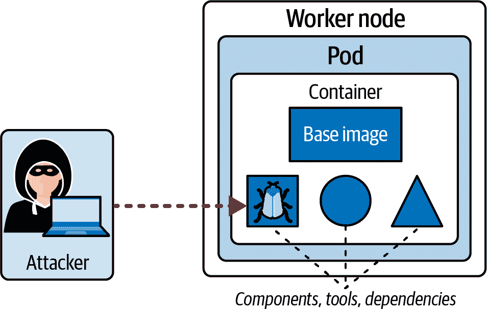
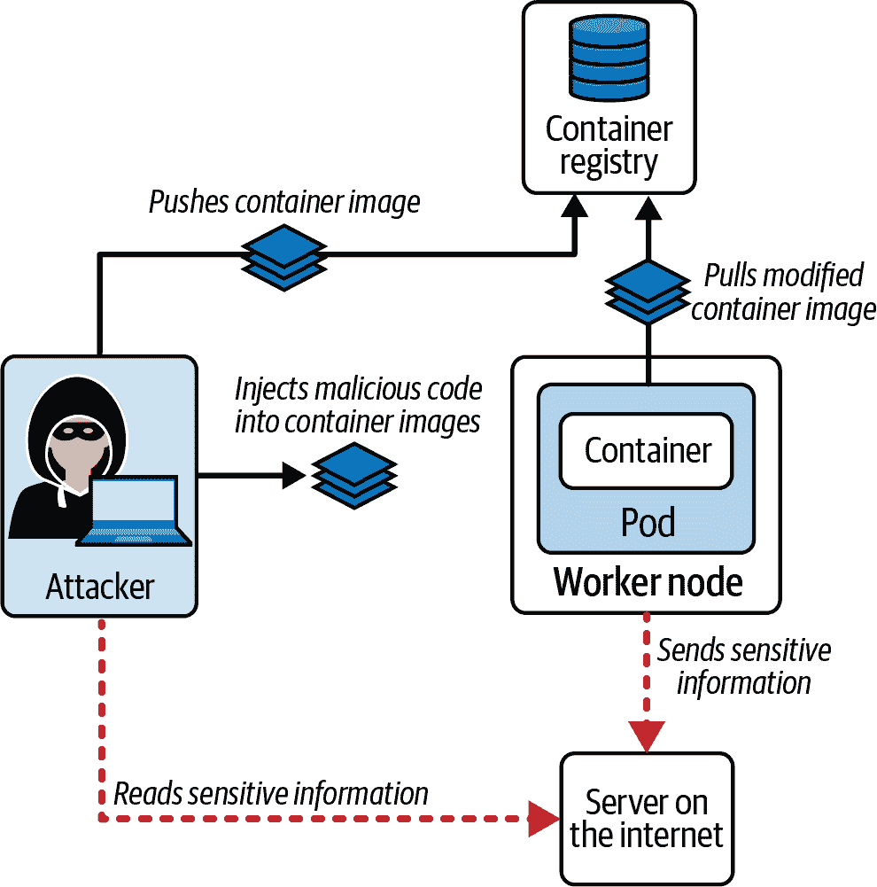
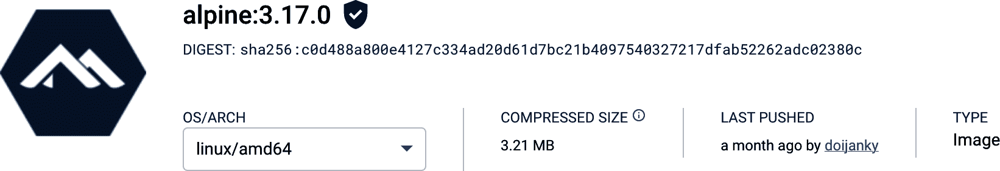
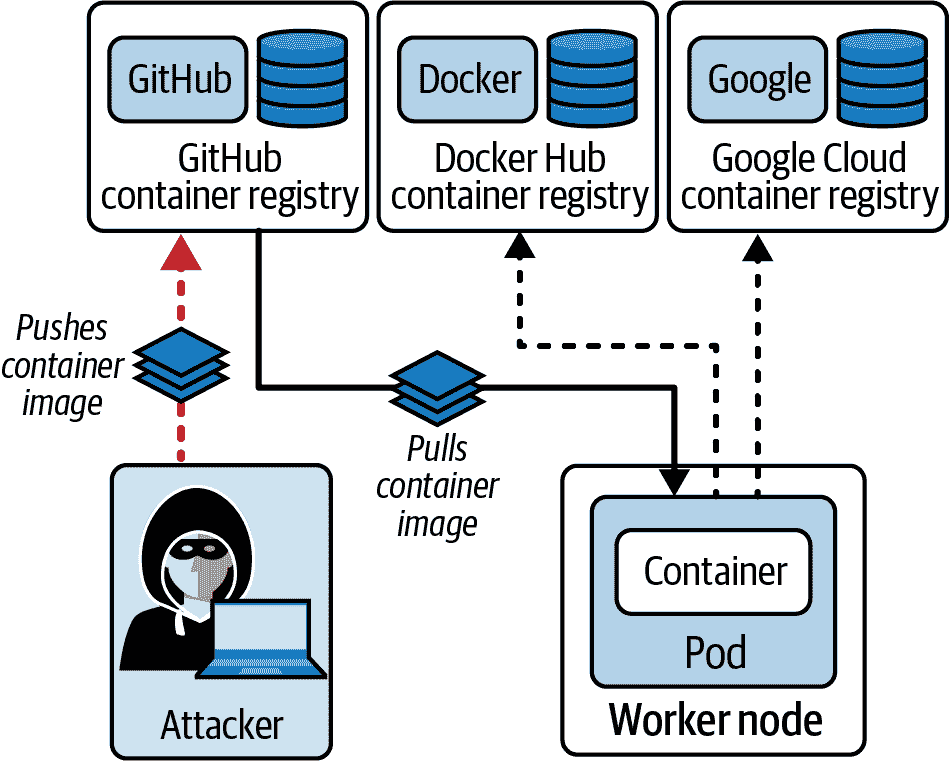
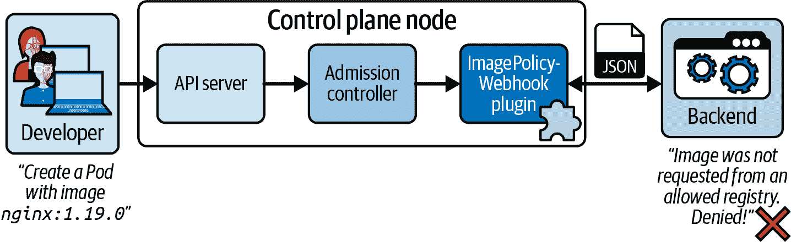
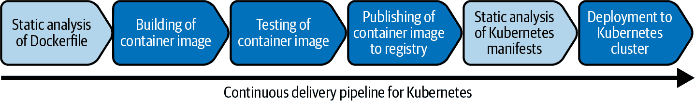
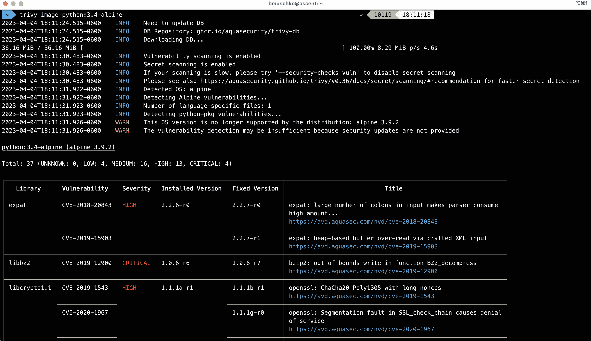

# 第六章：供应链安全

较早的章节主要集中在保护 Kubernetes 集群及其组件、用于运行集群节点的操作系统基础设施以及在现有容器镜像上运行工作负载的操作方面。本章退一步，深入探讨了设计、构建和优化容器镜像的过程、最佳实践和工具。

有时，你可能不想创建自己的容器镜像，而是消耗由其他团队或公司生产的现有镜像。在使用它们运行工作负载之前，手动或自动扫描已知漏洞的容器镜像应该成为你的审查过程的一部分。我们将讨论与 CKS 考试相关的一些选项，用于识别、分析和减轻预构建容器镜像的安全风险。

在高层次上，本章涵盖以下概念：

+   减小基础镜像的占用空间

+   保护供应链

+   使用用户工作负载的静态分析

+   扫描已知漏洞的镜像

# 减小基础镜像的占用空间

表面上看，构建容器镜像的过程似乎很简单；然而，魔鬼往往隐藏在细节中。对于新手来说，要避免构建过大、充满漏洞并且不优化容器层缓存的容器镜像可能并不明显。在本章的课程中，我们将在 Docker 容器引擎的帮助下解决所有这些问题。

## 场景：攻击者利用容器漏洞

在定义 Dockerfile 时，你需要做的第一个决定之一是选择一个基础镜像。基础镜像提供操作系统和额外的依赖项，并可能暴露 shell 访问权限。

在像 Docker Hub 这样的公共注册表上，你可以选择的一些基础镜像体积庞大，并且可能包含你不一定需要在其中运行应用程序的功能。操作系统本身以及基础镜像提供的任何依赖项都可能存在漏洞。

在 图 6-1 中，攻击者能够通过访问容器获取关于其详细信息的信息。这些漏洞现在可以被用作更高级攻击的跳板。



###### 图 6-1\. 攻击者利用容器镜像漏洞

建议使用一个功能和依赖项最少的基础镜像。接下来的几节将解释创建更优化的基础镜像的方法，这将使构建速度更快，从容器注册表下载速度更快，并且通过减少臃肿的镜像来减小攻击面。接下来的几节将涉及最重要的技术。你可以在[Docker 文档](https://oreil.ly/43Diy)中找到更详细的 Dockerfile 写作最佳实践列表。

## 选择尺寸小的基础镜像

一些容器镜像可能有千兆字节甚至更多的大小。您真的需要这种容器镜像捆绑的所有功能吗？可能性不大。幸运的是，许多容器生产商为同一个版本上传了各种变体的容器镜像。其中一个变体是`alpine`镜像，这是一个小巧、轻量且较少漏洞的 Linux 发行版。正如您在下面的输出中所看到的，下载的带有标签`3.17.0`的`alpine`容器镜像只有 7.05MB 的大小：

```
$ docker pull alpine:3.17.0
...
$ docker image ls alpine
REPOSITORY   TAG       IMAGE ID       CREATED       SIZE
alpine       3.17.0    49176f190c7e   3 weeks ago   7.05MB
```

`alpine`容器镜像自带一个`sh` shell，您可以用来排查容器内运行的进程。您可以使用以下命令在一个新的容器中打开交互式 shell：

```
$ docker run -it alpine:3.17.0 /bin/sh
/ # exit
```

虽然运行时的故障排除功能可能很有用，但将 shell 作为容器镜像的一部分会增加其大小，并可能为攻击者打开大门。此外，容器镜像内的软件越多，其漏洞也会越多。

您可以通过使用由 Google 提供的[distroless 镜像](https://oreil.ly/J6Vra)进一步减小容器镜像的大小和攻击面。以下命令下载`gcr.io/distroless/static-debian11`容器镜像的最新标签，并显示其详情。容器镜像的大小仅为 2.34MB：

```
$ docker pull gcr.io/distroless/static-debian11
...
$ docker image ls gcr.io/distroless/static-debian11:latest
REPOSITORY                          TAG       IMAGE ID       CREATED      \
  SIZE
gcr.io/distroless/static-debian11   latest    901590160d4d   53 years ago \
  2.34MB
```

Distroless 容器镜像不包含任何 shell，您可以通过运行以下命令观察到这一点：

```
$ docker run -it gcr.io/distroless/static-debian11:latest /bin/sh
docker: Error response from daemon: failed to create shim task: OCI runtime \
create failed: runc create failed: unable to start container process: exec: \
"/bin/sh": stat /bin/sh: no such file or directory: unknown.
```

Kubernetes 提供了用于故障排除 distroless 容器的临时容器的概念。这些容器被设计为可丢弃的，可以用于排查通常不允许打开 shell 的最小化容器。讨论临时容器超出了本书的范围，但您可以在[Kubernetes 文档](https://oreil.ly/IRjP3)中找到更多信息。

## 使用多阶段方法构建容器镜像

作为开发者，您可以决定将应用程序代码作为 Dockerfile 指令的一部分进行构建。这个过程可能包括编译代码和构建一个应该成为容器镜像入口点的二进制文件。拥有实施这一过程所需的所有工具和依赖项将自动增加容器镜像的大小，而且您在运行时也不再需要这些依赖项。

在 Docker 中使用[多阶段构建](https://oreil.ly/znQc3)的思想是将构建阶段与运行阶段分离。因此，构建阶段中需要的所有依赖项在完成进程后都会被丢弃，因此不会出现在最终的容器镜像中。这种方法通过去除所有不必要的内容，大大减小了容器镜像的大小。

尽管我们不会详细介绍制作和完全理解多阶段 Dockerfile 的细节，但我想在高层次上展示一下它们的区别。我们将首先展示一个 Dockerfile，它使用编程语言 Go 构建和测试一个简单的程序，如示例 6-1 所示。实质上，我们使用了一个包含 Go 1.19.4 的[基础镜像](https://oreil.ly/nwLtT)。Go 运行时提供了`go`命令，我们将调用它来执行测试并构建应用程序的二进制文件。

##### 示例 6-1\. 使用 Go 基础镜像构建和测试 Go 程序

```
FROM golang:1.19.4-alpine 
WORKDIR /app

COPY go.mod .
COPY go.sum .
RUN go mod download

COPY . .
RUN CGO_ENABLED=0 go test -v 
RUN go build -o /go-sample-app . 
CMD ["/go-sample-app"]
```


使用了一个 Go 基础镜像


执行针对应用代码的测试。


构建 Go 应用程序的二进制文件。

您可以使用`docker build`命令生成镜像，如下所示：

```
$ docker build . -t go-sample-app:0.0.1
...
```

结果容器镜像的大小相当大，为 348MB，这其中有很好的理由。它包含了 Go 运行时，尽管在启动容器时实际上不再需要它。`go build`命令生成的二进制文件将作为容器启动时的命令运行：

```
$ docker images
REPOSITORY      TAG     IMAGE ID       CREATED          SIZE
go-sample-app   0.0.1   88175f3ab0d3   44 seconds ago   358MB
```

接下来，我们将看看多阶段方法。在多阶段的 Dockerfile 中，您至少定义了两个阶段。在示例 6-2 中，我们指定了一个别名为`build`的阶段来运行测试并构建二进制文件，类似于之前的操作。第二个阶段将由阶段`build`生成的二进制文件复制到一个专用目录中；然而，它使用`alpine`基础镜像来运行它。在运行`docker build`命令时，阶段`build`将不再包含在最终的容器镜像中。

##### 示例 6-2\. 作为多阶段 Dockerfile 的一部分构建和测试 Go 程序

```
FROM golang:1.19.4-alpine AS build 
RUN apk add --no-cache git
WORKDIR /tmp/go-sample-app
COPY go.mod .
COPY go.sum .
RUN go mod download
COPY . .

RUN CGO_ENABLED=0 go test -v 
RUN go build -o ./out/go-sample-app . 

FROM alpine:3.17.0 
RUN apk add ca-certificates
COPY --from=build /tmp/go-sample-app/out/go-sample-app /app/go-sample-app 
CMD ["/app/go-sample-app"]
```


在名为`build`的阶段中，使用了一个 Go 基础镜像来构建和测试程序。


执行针对应用代码的测试。


构建 Go 应用程序的二进制文件。


使用一个更小的基础镜像来运行容器中的应用程序。


复制在`build`阶段生成的应用程序二进制文件，并将其用作启动容器时运行的命令。

使用 `alpine` 基础镜像时，生成的容器镜像大小显著较小，仅为 12MB。您可以通过再次运行 `docker build` 命令并列出容器镜像大小来验证结果：

```
$ docker build . -t go-sample-app:0.0.1
...
$ docker images
REPOSITORY      TAG     IMAGE ID       CREATED          SIZE
go-sample-app   0.0.1   88175f3ab0d3   44 seconds ago   12MB
```

我们不仅减少了大小，还通过包含更少的依赖项减少了攻击面。通过使用 distroless 基础镜像而不是 `alpine` 基础镜像，你可以进一步减小容器镜像的大小。

## 减少层数

每个 Dockerfile 都由一系列有序的指令组成。只有一些指令会在最终容器镜像中创建只读层。这些指令是 `FROM`、`COPY`、`RUN` 和 `CMD`。所有其他指令不会创建层，因为它们会创建临时中间镜像。向容器镜像添加的层数越多，构建执行时间可能会越慢，容器镜像的大小可能会越大。因此，需要谨慎选择 Dockerfile 中的指令，以尽量减小容器镜像的占用空间。

通常会连续执行多个命令。您可以使用单独的 `RUN` 指令列表来定义这些命令，如 示例 6-3 所示。

##### 示例 6-3\. 指定多个 `RUN` 指令的 Dockerfile

```
FROM ubuntu:22.10
RUN apt-get update -y
RUN apt-get upgrade -y
RUN apt-get install -y curl
```

每个 `RUN` 指令将创建一个层，可能会增加容器镜像的大小。使用 `&&` 将它们串联在一起更有效，确保只生成单个层。示例 6-4 展示了这种优化技术的示例。

##### 示例 6-4\. 指定多个 `RUN` 指令的 Dockerfile

```
FROM ubuntu:22.10
RUN apt-get update -y && apt-get upgrade -y && apt-get install -y curl
```

## 使用容器镜像优化工具

很容易忘记之前提到的优化实践。开源社区开发了一些工具，可以帮助检查生成的容器镜像。它们的功能提供了有用的提示，可以减少不必要的层、文件和文件夹：

DockerSlim

DockerSlim 将通过分析应用程序及其依赖项来优化和保护您的容器镜像。您可以在该工具的 [GitHub 仓库](https://oreil.ly/ZbeZl) 中获取更多信息。

Dive

Dive 是一个用于探索嵌入容器镜像中层的工具。它可以帮助您轻松识别不必要的层，进而进行进一步优化。Dive 的代码和文档可在 [GitHub 仓库](https://oreil.ly/UBqqj) 中找到。

这只是容器镜像优化工具的简短列表。在 “工作负载的静态分析” 中，我们将看看其他专注于 Dockerfile 和 Kubernetes 清单的静态分析工具。

# 保护供应链

供应链自动化生产容器镜像并在运行时环境中操作的过程，在这种情况下是 Kubernetes。我们已经提到了一些可以集成到供应链中以支持容器镜像优化方面的工具。在本节中，我们将扩展到针对安全方面的实践。参考书籍 [*Container Security*](https://learning.oreilly.com/library/view/container-security/9781492056690/) 作者 Liz Rice（O’Reilly）以获取更多信息。

## 签署容器镜像

在将容器镜像推送到容器注册表之前，您可以对其进行签名。签名可以通过`docker trust sign`命令实现，该命令会向容器镜像添加一个签名，即所谓的图像摘要。图像摘要是根据容器镜像的内容派生的，通常以 SHA256 的形式表示。在消费容器镜像时，Kubernetes 可以将图像摘要与镜像内容进行比较，以确保其未被篡改。

## 场景：攻击者将恶意代码注入容器镜像

验证图像摘要的 Kubernetes 组件是 kubelet。如果您将 [image pull policy](https://oreil.ly/0wSjy) 配置为 `Always`，即使 kubelet 在之前已经下载和验证过容器镜像，它也会从容器注册表中查询图像摘要。

攻击者可以尝试修改现有容器镜像的内容，注入恶意代码，并将其上传到具有相同标签的容器注册表中，如 图 6-2 所示。然后，运行在容器中的恶意代码可能会将敏感信息发送到攻击者可访问的第三方服务器。



###### 图 6-2\. 攻击者将恶意代码注入容器镜像

# 容器镜像的校验和验证不是自动进行的

图像摘要验证在 Kubernetes 中是一种选择性功能。在定义 Pod 时，请确保明确指定所有容器镜像的图像摘要。

## 验证容器镜像

在 Kubernetes 中，您可以将 SHA256 图像摘要附加到容器的规范中。例如，可以通过属性`spec.containers[].image`来实现。图像摘要通常可以在容器注册表中找到。例如，图 6-3 显示了 Docker Hub 上 `alpine:3.17.0` 容器镜像的图像摘要（https://oreil.ly/ZAV_H）。在此示例中，图像摘要为 `sha256:c0d488a800e4127c334ad20d61d7bc21b4097540327217dfab52262adc02380c`。



###### 图 6-3\. Docker Hub 上 `alpine:3.17.0` 容器镜像的图像摘要

让我们看看图像摘要的作用。而不是使用标签，示例 6-5 通过附加图像摘要来指定容器镜像。

##### 示例 6-5\. 使用有效容器镜像摘要的 Pod

```
apiVersion: v1
kind: Pod
metadata:
  name: alpine-valid
spec:
  containers:
  - name: alpine
    image: alpine@sha256:c0d488a800e4127c334ad20d61d7bc21b40 \
           97540327217dfab52262adc02380c
    command: ["/bin/sh"]
    args: ["-c", "while true; do echo hello; sleep 10; done"]
```

创建 Pod 将按预期工作。将验证镜像摘要，并将容器转换为“运行”状态：

```
$ kubectl apply -f pod-valid-image-digest.yaml
pod/alpine-valid created
$ kubectl get pod alpine-valid
NAME           READY   STATUS    RESTARTS   AGE
alpine-valid   1/1     Running   0          6s
```

示例 6-6 显示了相同的 Pod 定义；但是，已更改了镜像摘要，因此它与容器镜像的内容不匹配。

##### 示例 6-6\. 使用无效容器镜像摘要的 Pod

```
apiVersion: v1
kind: Pod
metadata:
  name: alpine-invalid
spec:
  containers:
  - name: alpine
    image: alpine@sha256:d006a643bccb6e9adbabaae668533c7f2e5 \
           111572fffb5c61cb7fcba7ef4150b
    command: ["/bin/sh"]
    args: ["-c", "while true; do echo hello; sleep 10; done"]
```

您会发现 Kubernetes 仍然可以创建 Pod 对象，但无法正确验证容器镜像的哈希值。这将导致状态为“ErrImagePull”。正如事件日志中所示，甚至无法从容器注册表中拉取容器镜像：

```
$ kubectl get pods
NAME             READY   STATUS         RESTARTS   AGE
alpine-invalid   0/1     ErrImagePull   0          29s
$ kubectl describe pod alpine-invalid
...
Events:
  Type     Reason     Age   From               Message
  ----     ------     ----  ----               -------
  Normal   Scheduled  13s   default-scheduler  Successfully assigned default \
  /alpine-invalid to minikube
  Normal   Pulling    13s   kubelet            Pulling image "alpine@sha256: \
  d006a643bccb6e9adbabaae668533c7f2e5111572fffb5c61cb7fcba7ef4150b"
  Warning  Failed     11s   kubelet            Failed to pull image \
  "alpine@sha256:d006a643bccb6e9adbabaae668533c7f2e5111572fffb5c61cb7fcba7ef4 \
  150b": rpc error: code = Unknown desc = Error response from daemon: manifest \
  for alpine@sha256:d006a643bccb6e9adbabaae668533c7f2e5111572fffb5c61cb7fcba7e \
  f4150b not found: manifest unknown: manifest unknown
  Warning  Failed     11s   kubelet            Error: ErrImagePull
  Normal   BackOff    11s   kubelet            Back-off pulling image \
  "alpine@sha256:d006a643bccb6e9adbabaae668533c7f2e5111572fffb5c61cb7fcba7ef415 \
  0b"
  Warning  Failed     11s   kubelet            Error: ImagePullBackOff
```

## 使用公共镜像注册表

每当创建一个 Pod 时，容器运行时引擎将从容器注册表下载声明的容器镜像（如果本地尚不可用）。可以使用[镜像拉取策略](https://oreil.ly/ZBMnH)来进一步调整此运行时行为。

图像名称中的前缀声明了注册表的域名；例如，`gcr.io/google-containers/debian-base:v1.0.1` 指的是 `google-containers/debian-base:v1.0.1` 在[Google Cloud 容器注册表](https://oreil.ly/QFxfY)中，由 `gcr.io` 表示。如果在容器镜像声明中不指定域名，则容器运行时将尝试从 `docker.io`，即[Docker Hub 容器注册表](https://hub.docker.com) 解析它。

## 情景：攻击者上传恶意容器镜像

虽然从公共容器注册表解析容器镜像很方便，但也伴随着风险。任何拥有这些容器注册表登录凭据的人都可以上传新的镜像。通常，使用容器镜像并不需要账户。

如图 6-4 所示（#公共注册表攻击者），攻击者可以使用窃取的凭据上传包含恶意代码的容器镜像到公共注册表。任何引用该注册表中容器镜像的容器都将自动运行恶意代码。



###### 图 6-4\. 攻击者上传恶意容器镜像

在企业级别上，您需要控制信任的容器注册表。建议在公司网络内设置自己的容器注册表，可以完全控制和管理。或者，您可以在云提供商环境中设置一个私有容器注册表，不允许任何其他人访问。

您可以选择其中一个主要的二进制仓库管理器，例如[JFrog Artifactory](https://oreil.ly/jdF_6)。该产品完全支持存储、扫描和提供容器镜像。任何使用容器镜像的消费者应仅允许从您的白名单容器注册表中拉取镜像。所有其他容器注册表都应该被拒绝。

## 使用 OPA GateKeeper 白名单允许的镜像注册表

通过 **OPA Gatekeeper** 控制容器注册表的使用方式。我们讨论了 “理解开放策略代理（OPA）和 Gatekeeper” 的安装过程和功能。在这里，我们将触及约束模板和允许信任容器注册表的约束条件。

示例 6-7 展示了我直接从 OPA Gatekeeper 库获取的 [约束模板](https://oreil.ly/hvgnr)。作为输入属性，约束模板定义了一个字符串数组，表示容器注册表的前缀。Rego 规则不仅验证了属性 `spec.containers[]` 的分配容器镜像，还验证了 `spec.initContainers[]` 和 `spec.ephemeralContainers[]`。

##### 示例 6-7\. 用于执行容器注册表强制约束的 OPA Gatekeeper 约束模板。

```
apiVersion: templates.gatekeeper.sh/v1
kind: ConstraintTemplate
metadata:
  name: k8sallowedrepos
  annotations:
    metadata.gatekeeper.sh/title: "Allowed Repositories"
    metadata.gatekeeper.sh/version: 1.0.0
    description: >-
      Requires container images to begin with a string from the specified list.
spec:
  crd:
    spec:
      names:
        kind: K8sAllowedRepos
      validation:
        openAPIV3Schema:
          type: object
          properties:
            repos:
              description: The list of prefixes a container image is allowed to have.
              type: array
              items:
                type: string
  targets:
    - target: admission.k8s.gatekeeper.sh
      rego: |
        package k8sallowedrepos

        violation[{"msg": msg}] {
          container := input.review.object.spec.containers[_]
          satisfied := [good | repo = input.parameters.repos[_] ; \
          good = startswith(container.image, repo)]
          not any(satisfied)
          msg := sprintf("container <%v> has an invalid image repo <%v>, allowed \
          repos are %v", [container.name, container.image, input.parameters.repos])
        }

        violation[{"msg": msg}] {
          container := input.review.object.spec.initContainers[_]
          satisfied := [good | repo = input.parameters.repos[_] ; \
          good = startswith(container.image, repo)]
          not any(satisfied)
          msg := sprintf("initContainer <%v> has an invalid image repo <%v>, \
          allowed repos are %v", [container.name, container.image, \
          input.parameters.repos])
        }

        violation[{"msg": msg}] {
          container := input.review.object.spec.ephemeralContainers[_]
          satisfied := [good | repo = input.parameters.repos[_] ; \
          good = startswith(container.image, repo)]
          not any(satisfied)
          msg := sprintf("ephemeralContainer <%v> has an invalid image repo <%v>, \
          allowed repos are %v", [container.name, container.image, \
          input.parameters.repos])
        }
```

在 示例 6-8 中显示的约束负责定义我们想要允许的容器注册表。通常会选择公司网络中托管的服务器的域名。在这里，我们将使用 `gcr.io/` 作为演示目的。

##### 示例 6-8\. OPA Gatekeeper 约束，将 Google Cloud 注册表分配为受信任的存储库。

```
apiVersion: constraints.gatekeeper.sh/v1beta1
kind: K8sAllowedRepos
metadata:
  name: repo-is-gcr
spec:
  match:
    kinds:
      - apiGroups: [""]
        kinds: ["Pod"]
  parameters:
    repos:
      - "gcr.io/"
```

让我们使用 `apply` 命令创建这两个对象：

```
$ kubectl apply -f allowed-repos-constraint-template.yaml
constrainttemplate.templates.gatekeeper.sh/k8sallowedrepos created
$ kubectl apply -f gcr-allowed-repos-constraint.yaml
k8sallowedrepos.constraints.gatekeeper.sh/repo-is-gcr created
```

在约束中，我们没有指定规则应适用于的命名空间。因此，它们将适用于集群中的所有命名空间。以下命令验证白名单规则是否按预期工作。以下命令尝试使用来自 Docker Hub 的 `nginx` 容器镜像创建一个 Pod。创建 Pod 被拒绝，并显示适当的错误消息：

```
$ kubectl run nginx --image=nginx:1.23.3
Error from server (Forbidden): admission webhook "validation.gatekeeper.sh" \
denied the request: [repo-is-gcr] container <nginx> has an invalid image \
repo <nginx:1.23.3>, allowed repos are ["gcr.io/"]
```

下一个命令创建一个 Pod，其容器镜像来自 Google Cloud 容器注册表。操作被允许，并且创建了 Pod 对象：

```
$ kubectl run busybox --image=gcr.io/google-containers/busybox:1.27.2
pod/busybox created
$ kubectl get pods
NAME      READY   STATUS      RESTARTS     AGE
busybox   0/1     Completed   1 (2s ago)   3s
```

## 使用 ImagePolicyWebhook Admission Controller 插件为允许的镜像注册表设置白名单。

另一种验证允许使用的镜像注册表的方法是拦截在创建 Pod 时向 API 服务器发出的调用。通过启用 Admission Controller 插件可以实现此机制。配置后，当 API 服务器接收请求时，会自动调用 Admission Controller 插件的逻辑，但在验证调用者身份后。我们已经讨论了 API 调用必须经过的阶段，见 “处理请求”。

Admission Controller 提供了在请求生效之前批准、拒绝或变更请求的方式。例如，我们可以检查与创建 Pod 的 API 请求一起发送的数据，迭代分配的容器镜像，并执行自定义逻辑以验证容器镜像的表示法。如果容器镜像不符合预期的约定，我们可以拒绝创建 Pod。图 6-5 展示了高级别的工作流程。



###### 图 6-5. 拦截特定 Pod API 调用并使用 Webhook 处理它

[ImagePolicyWebhook](https://oreil.ly/JxmUu) 准入控制器插件是我们可以配置用于拦截 Kubernetes API 调用的插件之一。 您可以从其名称推断出插件的功能。 它为 Pod 中定义的所有容器镜像定义策略。 为了与定义的策略比较容器镜像，插件通过 HTTPS 调用到一个服务外部于 Kubernetes 的 webhook。 外部服务然后决定如何验证数据。 在准入控制器插件的上下文中，外部服务也被称为*后端*。

## 实施后端应用

后端应用可以使用您选择的编程语言实现。 它必须满足以下三个要求：

1.  这是一个可以处理 HTTPS 请求的 Web 应用程序。

1.  它可以接受和解析 JSON 请求有效载荷。

1.  它可以发送一个 JSON 响应有效载荷。

实施后端应用不是 CKS 考试的一部分，但您可以在本书的[GitHub 仓库](https://oreil.ly/OF4fF)中找到一个基于 Go 的示例实现。 请注意，该代码不被视为生产就绪。

以下命令演示了应用程序在`https://localhost:8080/validate`上的运行时行为。 您可以在[Kubernetes 文档](https://oreil.ly/8GaQe)中找到示例请求和响应 JSON 主体。

以下 `curl` 命令调用验证逻辑以验证容器镜像 `nginx:1.19.0`。 如 JSON 响应所示，镜像被拒绝：

```
$ curl -X POST -H "Content-Type: application/json" -k -d \'{"apiVersion": \
"imagepolicy.k8s.io/v1alpha1", "kind": "ImageReview", "spec": \
{"containers": [{"image": "nginx:1.19.0"}]}}' https://localhost:8080/validate
{"apiVersion": "imagepolicy.k8s.io/v1alpha1", "kind": "ImageReview", \
"status": {"allowed": false, "reason": "Denied request: [container 1 \
has an invalid image repo nginx:1.19.0, allowed repos are [gcr.io/]]"}}

```

以下 `curl` 命令调用验证逻辑以验证容器镜像 `gcr.io/nginx:1.19.0`。 如 JSON 响应所示，镜像被允许：

```
$ curl -X POST -H "Content-Type: application/json"  -k -d '{"apiVersion": \
"imagepolicy.k8s.io/v1alpha1", "kind": "ImageReview", "spec": {"containers": \
[{"image": "gcr.io/nginx:1.19.0"}]}}' https://localhost:8080/validate
{"apiVersion": "imagepolicy.k8s.io/v1alpha1", "kind": "ImageReview", \
"status": {"allowed": true, "reason": ""}}

```

## 配置 ImagePolicyWebhook 准入控制器插件

考试中，您需要理解如何“连接”ImagePolicyWebhook 准入控制器插件。 本节将指导您完成此过程。 首先，您需要为准入控制器创建一个配置文件，以便它知道要使用哪些插件以及运行时应如何行为。 创建文件`/etc/kubernetes/admission-control/image-policy-webhook-admission-config.yaml`并填入示例 6-9 中显示的内容。

##### 示例 6-9. 准入控制器配置文件

```
apiVersion: apiserver.config.k8s.io/v1
kind: AdmissionConfiguration
plugins:
  - name: ImagePolicyWebhook 
    configuration:
      imagePolicy:
        kubeConfigFile: /etc/kubernetes/admission-control/ \
                        imagepolicywebhook.kubeconfig 
        allowTTL: 50
        denyTTL: 50
        retryBackoff: 500
        defaultAllow: false 
```


提供了 ImagePolicyWebhook 插件的配置。


指向用于配置后端的配置文件。


如果无法访问后端，则拒绝 API 请求。 默认值为 true，但将其设置为 false 更为明智。

接下来，创建由 `plugins[].configuration.imagePolicy.kubeConfigFile` 属性引用的文件。该文件的内容指向外部服务的 HTTPS URL。它还定义了磁盘上的客户端证书和密钥文件，以及 CA 文件。示例 6-10 显示了配置文件的内容。

##### 示例 6-10\. 镜像策略配置文件

```
apiVersion: v1
kind: Config
preferences: {}
clusters:
  - name: image-validation-webhook
    cluster:
      certificate-authority: /etc/kubernetes/admission-control/ca.crt
      server: https://image-validation-webhook:8080/validate 
contexts:
- context:
    cluster: image-validation-webhook
    user: api-server-client
  name: image-validation-webhook
current-context: image-validation-webhook
users:
  - name: api-server-client
    user:
      client-certificate: /etc/kubernetes/admission-control/api-server-client.crt
      client-key: /etc/kubernetes/admission-control/api-server-client.key
```


后端服务的 URL。必须使用 HTTPS 协议。

启用 API 服务器的 ImagePolicyWebhook 准入控制器插件，并将准入控制器指向配置文件。为实现此目的，请编辑 API 服务器的配置文件，通常位于 `/etc/kubernetes/manifests/kube-apiserver.yaml`。

查找命令行选项 `--enable-admission-plugins`，并在现有插件列表中追加值 `ImagePolicyWebhook`，以逗号分隔。如果尚不存在，请提供命令行选项 `--admission-control-config-file`，并将值设置为 `/etc/kubernetes/admission-control/image-policy-webhook-admission-configuration.yaml`。由于配置文件位于新目录中，您将需要将其定义为 Volume 并将其挂载到容器中。示例 6-11 显示了 API 服务器容器的相关选项。

##### 示例 6-11\. API 服务器配置文件

```
...
spec:
  containers:
  - command:
    - kube-apiserver
    - --enable-admission-plugins=NodeRestriction,ImagePolicyWebhook
    - --admission-control-config-file=/etc/kubernetes/admission-control/ \
      image-policy-webhook-admission-configuration.yaml
    ...
    volumeMounts:
    ...
    - name: admission-control
      mountPath: /etc/kubernetes/admission-control
      readonly: true
  volumes:
  ...
  - name: admission-control
    hostPath:
      path: /etc/kubernetes/admission-control
      type: DirectoryOrCreate
...
```

运行 API 服务器的 Pod 应自动重启。此过程可能需要几分钟时间。如果 API 服务器未能自行启动，请使用命令 `sudo systemctl restart kubelet` 重新启动 kubelet 服务。一旦完全重启，您应该能够查询它：

```
$ kubectl get pods -n kube-system
NAME                           READY   STATUS    RESTARTS   AGE
...
kube-apiserver-control-plane   1/1     Running   0          69s
```

现在，任何请求创建 Pod 的 API 调用将被路由到后端。根据验证结果，将允许或拒绝对象的创建。

# 工作负载的静态分析

在本书中，我们讨论了 Dockerfile 和 Kubernetes 清单的最佳实践。您可以手动检查这些文件，查找不良配置，并手动修复它们。这种方法需要大量复杂的知识，并且非常繁琐且易出错。通过适当的工具以自动化方式分析工作负载文件，会更加方便和高效。商业和开源静态分析工具的列表很长。在本节中，我们将介绍两个选项的功能，即 Haskell Dockerfile Linter 和 Kubesec。

在企业级别上，当您需要处理数百甚至数千个工作负载文件时，您可以借助持续交付管道的帮助来完成，如 图 6-6 所示。



###### 图 6-6\. Kubernetes 的示例持续交付管道

相关的静态分析工具可以作为管道早期阶段的质量门控调用，甚至在构建容器镜像、推送到注册表或部署到 Kubernetes 集群之前。有关持续交付原则和实践的深入了解，请参阅 Jez Humble 和 David Farley 的优秀著作 [*Continuous Delivery*](https://oreil.ly/8CR5M)（Addison-Wesley Professional）。

## 使用 Hadolint 分析 Dockerfile

[Haskell Dockerfile Linter](https://oreil.ly/C9bvu)，也称为 hadolint，是 Dockerfile 的一个代码检查工具。该工具根据 Docker 文档页面上列出的 [最佳实践](https://oreil.ly/Fwksr) 检查 Dockerfile。示例 6-12 展示了用于构建运行基于 Go 的应用程序的容器镜像的未优化 Dockerfile。

##### 示例 6-12\. 一个未优化的 Dockerfile

```
FROM golang
COPY main.go .
RUN go build main.go
CMD ["./main"]
```

Haskell Dockerfile Linter 支持一种操作模式，允许您将 `hadolint` 可执行文件指向磁盘上的 Dockerfile。您可以看到随后的命令执行，包括分析产生的发现的警告消息：

```
$ hadolint Dockerfile
Dockerfile:1 DL3006 warning: Always tag the version of an image explicitly
Dockerfile:2 DL3045 warning: `COPY` to a relative destination without \
`WORKDIR` set.
```

命令的输出建议您为基础镜像分配一个标签。现有的 Dockerfile 将拉取 `latest` 标签，该标签将解析为最新的 Go 容器镜像。这种做法可能导致 Go 运行时版本与应用程序代码不兼容。定义用于复制资源的工作目录有助于将操作系统特定的目录和文件与应用程序特定的目录和文件分开。示例 6-13 修复了 Haskell Dockerfile Linter 发现的警告消息。

##### 示例 6-13\. 一个优化后的 Dockerfile

```
FROM golang:1.19.4-alpine
WORKDIR /app
COPY main.go .
RUN go build main.go
CMD ["./main"]
```

对修改后的 Dockerfile 的另一次执行将导致成功的退出代码，并且不会呈现任何额外的警告消息：

```
$ hadolint Dockerfile
```

Dockerfile 现在遵循 hadolint 感知到的最佳实践。

## 使用 Kubesec 分析 Kubernetes 清单

[Kubesec](https://kubesec.io) 是分析 Kubernetes 清单的工具。它可以作为二进制文件、Docker 容器、准入控制器插件甚至是 `kubectl` 插件执行。为了演示其用法，我们将设置一个 YAML 清单文件 `pod-initial-kubesec-test.yaml`，如 示例 6-14 所示，作为起点。

##### 示例 6-14\. 使用初始安全设置的 Pod YAML 清单

```
apiVersion: v1
kind: Pod
metadata:
  name: kubesec-demo
spec:
  containers:
  - name: kubesec-demo
    image: gcr.io/google-samples/node-hello:1.0
    securityContext:
      readOnlyRootFilesystem: true
```

在检查 Pod 配置时，您可能已经根据前几章的内容有一些改进建议。让我们看看 Kubesec 将会推荐什么。

通过在 Docker 容器中运行逻辑的最简单方法来调用 Kubesec。以下命令将 YAML 清单的内容传送到标准输入流中。格式化为 JSON 的结果呈现评分，并提供结果的人类可读消息，并建议进行更改：

```
$ docker run -i kubesec/kubesec:512c5e0 scan /dev/stdin \
  < pod-initial-kubesec-test.yaml
[
  {
    "object": "Pod/kubesec-demo.default",
    "valid": true,
    "message": "Passed with a score of 1 points",
    "score": 1,
    "scoring": {
      "advise": [
        {
          "selector": ".spec .serviceAccountName",
          "reason": "Service accounts restrict Kubernetes API access and \
                     should be configured with least privilege"
        },
        {
          "selector": ".metadata .annotations .\"container.apparmor.security. \
                       beta.kubernetes.io/nginx\"",
          "reason": "Well defined AppArmor policies may provide greater \
                     protection from unknown threats. WARNING: NOT PRODUCTION \
                     READY"
        },
        {
          "selector": "containers[] .resources .requests .cpu",
          "reason": "Enforcing CPU requests aids a fair balancing of \
                     resources across the cluster"
        },
        {
          "selector": ".metadata .annotations .\"container.seccomp.security. \
                       alpha.kubernetes.io/pod\"",
          "reason": "Seccomp profiles set minimum privilege and secure against \
                     unknown threats"
        },
        {
          "selector": "containers[] .resources .limits .memory",
          "reason": "Enforcing memory limits prevents DOS via resource \
                     exhaustion"
        },
        {
          "selector": "containers[] .resources .limits .cpu",
          "reason": "Enforcing CPU limits prevents DOS via resource exhaustion"
        },
        {
          "selector": "containers[] .securityContext .runAsNonRoot == true",
          "reason": "Force the running image to run as a non-root user to \
                     ensure least privilege"
        },
        {
          "selector": "containers[] .resources .requests .memory",
          "reason": "Enforcing memory requests aids a fair balancing of \
                     resources across the cluster"
        },
        {
          "selector": "containers[] .securityContext .capabilities .drop",
          "reason": "Reducing kernel capabilities available to a container \
                     limits its attack surface"
        },
        {
          "selector": "containers[] .securityContext .runAsUser -gt 10000",
          "reason": "Run as a high-UID user to avoid conflicts with the \
                     host's user table"
        },
        {
          "selector": "containers[] .securityContext .capabilities .drop | \
                       index(\"ALL\")",
          "reason": "Drop all capabilities and add only those required to \
                     reduce syscall attack surface"
        }
      ]
    }
  }
]
```

示例 6-15 中可以找到原始 YAML 清单的修订版本。在这里，我们整合了 Kubesec 建议的一些推荐更改。

##### 示例 6-15\. 使用改进的安全设置的 Pod YAML 清单

```
apiVersion: v1
kind: Pod
metadata:
  name: kubesec-demo
spec:
  containers:
  - name: kubesec-demo
    image: gcr.io/google-samples/node-hello:1.0
    resources:
      requests:
        memory: "64Mi"
        cpu: "250m"
      limits:
        memory: "128Mi"
        cpu: "500m"
    securityContext:
      readOnlyRootFilesystem: true
      runAsNonRoot: true
      runAsUser: 20000
      capabilities:
        drop: ["ALL"]
```

对改变的 Pod YAML 清单执行相同的 Docker 命令将会呈现出一个改进的分数，并减少建议消息的数量：

```
$ docker run -i kubesec/kubesec:512c5e0 scan /dev/stdin \
  < pod-improved-kubesec-test.yaml
[
  {
    "object": "Pod/kubesec-demo.default",
    "valid": true,
    "message": "Passed with a score of 9 points",
    "score": 9,
    "scoring": {
      "advise": [
        {
          "selector": ".metadata .annotations .\"container.seccomp.security. \
                       alpha.kubernetes.io/pod\"",
          "reason": "Seccomp profiles set minimum privilege and secure against \
                     unknown threats"
        },
        {
          "selector": ".spec .serviceAccountName",
          "reason": "Service accounts restrict Kubernetes API access and should \
                     be configured with least privilege"
        },
        {
          "selector": ".metadata .annotations .\"container.apparmor.security. \
                       beta.kubernetes.io/nginx\"",
          "reason": "Well defined AppArmor policies may provide greater \
                     protection from unknown threats. WARNING: NOT PRODUCTION \
                     READY"
        }
      ]
    }
  }
]
```

# 扫描已知漏洞的镜像

记录和发现安全漏洞的首要来源之一是[CVE 详情](https://oreil.ly/DDlVa)。该页面列出并按分数排名已知的漏洞（CVE）。自动化工具可以识别嵌入容器镜像中的软件组件，将其与中央漏洞数据库进行比较，并通过其严重性标记问题。

在 CKS 课程中明确提到的具备此能力的开源工具之一是[Trivy](https://oreil.ly/hqPHH)。Trivy 可以以不同的操作模式运行：作为命令行工具、在容器中、作为 GitHub Action 配置在持续集成工作流中、作为 IDE VSCode 的插件以及作为 Kubernetes 操作者。关于可用安装选项和流程的概述，请参阅[Trivy 文档](https://oreil.ly/qB_c8)。在考试期间，您无需安装此工具，它已经预先配置好。您只需要理解如何运行它、如何解释和修复找到的漏洞即可。

假设您已安装了 Trivy 的命令行实现。您可以使用以下命令检查 Trivy 的版本：

```
$ trivy -v
Version: 0.36.1
Vulnerability DB:
  Version: 2
  UpdatedAt: 2022-12-13 12:07:14.884952254 +0000 UTC
  NextUpdate: 2022-12-13 18:07:14.884951854 +0000 UTC
  DownloadedAt: 2022-12-13 17:09:28.866739 +0000 UTC
```

如您在图 6-7 中所见，Trivy 指示了从中央数据库下载已知漏洞副本的时间戳。Trivy 可以以各种形式扫描容器镜像。子命令`image`期望您简单地拼写出镜像名称和标签，在本例中为`python:3.4-alpine`。



###### 图 6-7\. 使用 Trivy 扫描容器镜像生成的报告

输出中最重要的信息包括包含特定漏洞的库、其严重性以及修复问题所需的最低版本。应考虑修复任何具有高或关键严重性的发现漏洞。如果您无法控制容器镜像本身，则可以尝试升级到更新版本。

# 总结

Kubernetes 的主要目标是以可伸缩和安全的方式运行应用程序容器。在本章中，我们探讨了确保生成的容器镜像尺寸小且具有尽可能少的已知安全漏洞的过程、最佳实践和工具。

我们回顾了将容器映像占用空间减少到最小的一些最有效技术。首先选择一个小的基础映像来开始。甚至可以走极端，完全不提供 shell 以获得额外的大小减少。如果您正在使用 Docker，则可以利用多阶段方法，在容器内构建应用程序，而无需捆绑编译器、运行时和构建工具以实现目标。

在 Pod 中消费容器映像时，请确保仅从受信任的注册表中拉取容器映像。建议设置内部容器注册表以提供容器映像，从而消除对公共、可通过互联网访问的注册表的依赖，以消除潜在的安全风险。您可以通过 OPA Gatekeeper 帮助执行受信任容器注册表列表的使用。另一种安全措施是使用容器映像的 SHA256 哈希来验证其预期内容。

构建和扫描容器映像的过程可以整合到 CI/CD 流水线中。第三方工具可以在构建之前解析和分析可部署工件的资源文件。我们查看了用于 Dockerfile 的 Haskell Dockerfile Linter 和用于 Kubernetes 清单的 Kubesec。另一个需要在安全方面涵盖的用例是作为开发人员或您公司外部实体构建的现有容器映像的消费。在运行 Kubernetes Pod 中的容器映像之前，请确保扫描其内容以查找漏洞。Trivy 是可以识别并报告容器映像中漏洞的工具之一，以帮助您了解在计划在容器中操作时可能面临的安全风险。

# 考试要点

熟悉有助于减少容器映像占用空间的技术。

在本节中，我们描述了在构建时减小容器映像大小的一些技术。我建议您阅读 Docker 网页上提到的最佳实践，并尝试将它们应用于样本容器映像。比较应用技术前后生成的容器映像的大小。您可以尝试通过避免丢失关键功能的同时将容器映像减小到最小尺寸，挑战自己。

行走通过治理过程，其中容器映像可以解析。

OPA Gatekeeper 提供了定义允许用户解析容器映像的注册表的方法。设置约束模板和约束对象，并查看规则是否适用于定义主应用程序容器、初始化容器和临时容器的 Pod。为了扩展您的曝光度，还可以查看 Kubernetes 领域中提供类似功能的其他产品。其中一个产品是 [Kyverno](https://kyverno.io)。

对一个容器镜像进行签名，并使用哈希值验证。

构建容器镜像后，请确保也为其创建摘要。将容器镜像及其摘要发布到注册表。练习如何在 Pod 定义中使用摘要，并验证 Kubernetes 在拉取容器镜像时的行为。

理解如何配置 ImagePolicyWebhook 准入控制器插件。

你不需要为 ImagePolicyWebhook 编写后端。这超出了考试范围，并需要掌握一门编程语言。但你确实需要了解如何在 API 服务器配置中启用该插件。即使没有运行的后端应用程序，我建议你练习这个工作流程。

知道如何修复静态分析工具产生的警告。

CKS 课程不指定用于分析 Dockerfile 和 Kubernetes 清单的特定工具。在考试期间，您可能会被要求运行一个特定的命令，该命令将生成一系列错误和/或警告消息。理解如何解释这些消息，并在相关资源文件中修复它们是很重要的。

练习使用 Trivy 来识别和修复安全漏洞。

CKS 的常见问题解答中列出了 Trivy 的文档页面。因此，可以合理地假设 Trivy 可能会在其中的一个问题中出现。您需要了解调用 Trivy 扫描容器镜像的不同方式。生成的报告将清楚地指示需要修复的内容及找到的漏洞的严重程度。考虑到您不能轻易修改容器镜像，您可能会被要求标记运行具有已知漏洞的容器镜像的 Pod。

# 示例练习

这些练习的解决方案可以在附录中找到。

1.  看一下以下的 Dockerfile。你能找出减少生成的容器镜像占用空间的可能性吗？

    ```
    FROM node:latest
    ENV NODE_ENV development
    WORKDIR /app
    COPY package.json .
    RUN npm install
    COPY . .
    EXPOSE 3001
    CMD ["node", "app.js"]
    ```

    将 Dockerfile 最佳实践应用于优化容器镜像占用空间。在进行优化之前和之后运行`docker build`命令。容器镜像的最终大小应更小，但应用程序仍应正常运行。

1.  在你的 Kubernetes 集群中安装 Kyverno。您可以在[文档](https://oreil.ly/yxlLe)中找到安装说明。

    应用描述在[文档页面](https://oreil.ly/Kdj1k)上的“限制镜像注册表”策略。唯一允许的注册表应为`gcr.io`。禁止使用任何其他注册表。

    创建一个定义了容器镜像`gcr.io/google-containers/busybox:1.27.2`的 Pod。创建 Pod 应该失败。使用容器镜像`busybox:1.27.2`创建另一个 Pod。Kyverno 应该允许创建该 Pod。

1.  在 YAML 清单 `pod-validate-image.yaml` 中使用容器镜像 `nginx:1.23.3-alpine` 定义一个 Pod。从 Docker Hub 检索容器镜像的摘要。使用 SHA256 哈希验证容器镜像内容。创建 Pod。Kubernetes 应能够成功拉取容器镜像。

1.  使用 Kubesec 分析 YAML 清单文件 `pod.yaml` 中的以下内容：

    ```
    apiVersion: v1
    kind: Pod
    metadata:
      name: hello-world
    spec:
      securityContext:
        runAsUser: 0
      containers:
      - name: linux
        image: hello-world:linux
    ```

    检查 Kubesec 生成的建议。忽略关于 seccomp 和 AppArmor 的建议。修复所有消息的根本原因，以确保再次执行工具时不会报告任何额外的建议。

1.  转到已检出的 GitHub 仓库 [*bmuschko/cks-study-guide*](https://oreil.ly/sImXZ) 的目录 *app-a/ch06/trivy*。执行命令 `kubectl apply -f setup.yaml`。

    该命令在命名空间 `r61` 中创建了三个不同的 Pod。从命令行执行 Trivy 对这些 Pod 使用的容器镜像进行检查。删除所有具有“CRITICAL”漏洞的 Pod。哪些 Pod 仍在运行？
