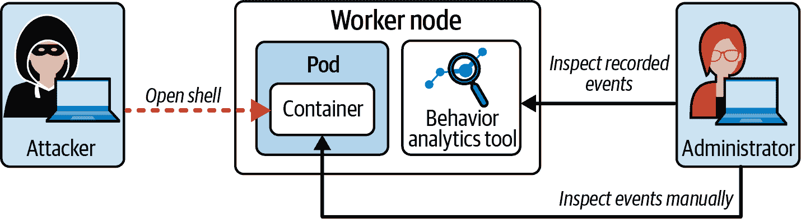
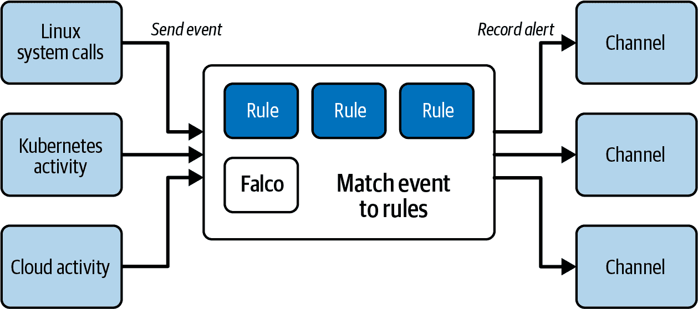
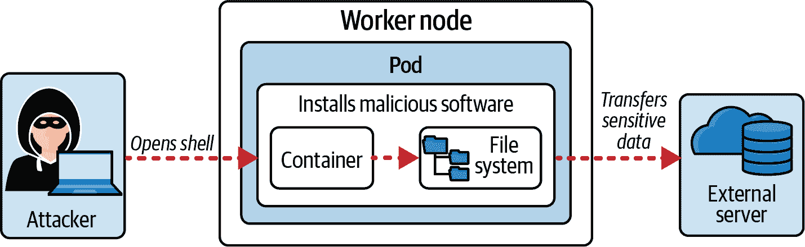
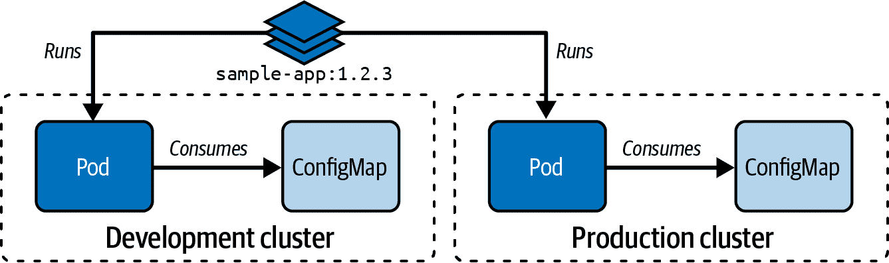
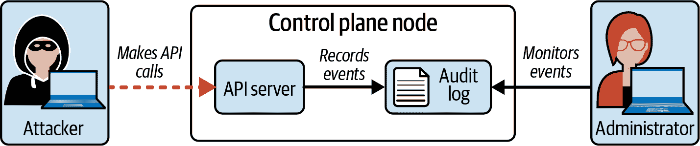
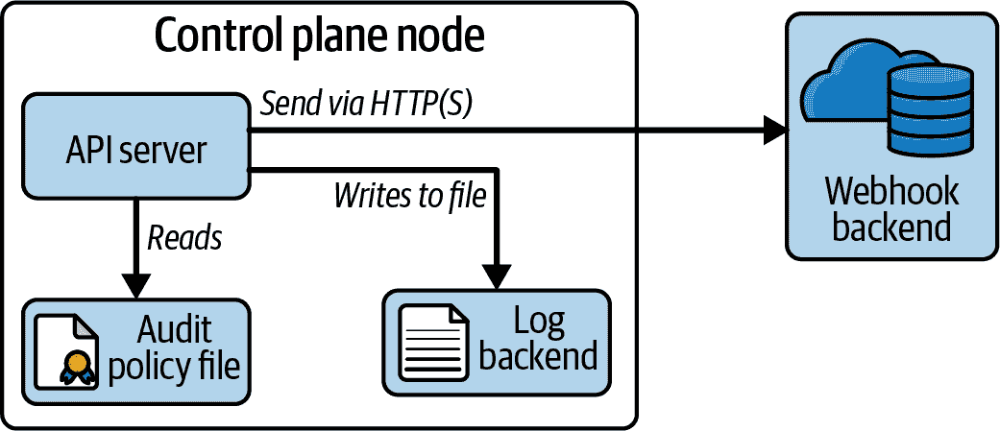

# 第七章：监控、日志和运行时安全

课程的最后一个领域主要涉及在 Kubernetes 集群中检测主机和容器级别的可疑活动。我们首先定义 *行为分析* 这个术语，并说明它如何应用于 Kubernetes 领域。理论澄清后，我们将介绍一个名为 Falco 的工具，它可以检测入侵场景。

一旦容器启动，其运行环境仍然可以修改。例如，作为操作员，您可以决定进入容器以手动安装额外工具或向容器的临时文件系统写入文件。在容器启动后修改容器可能会带来安全风险。您应该考虑创建 *不可变容器*，即启动后无法修改的容器。我们将学习如何配置 Pod 的正确设置，使其容器变为不可变。

最后，我们将讨论捕获在 Kubernetes 集群中发生事件的日志。这些日志可用于集群级别的故障排除，以重建集群配置何时以及如何发生变化，导致不希望或破损的运行时行为。日志条目还可用于跟踪正在发生的攻击，作为实施对策的手段。

在高层次上，本章涵盖以下概念：

+   进行行为分析以检测恶意活动

+   进行深入的分析调查和识别

+   在运行时确保容器的不可变性

+   使用审计日志监控访问

# 进行行为分析

除了管理和升级 Kubernetes 集群外，管理员还负责监视潜在的恶意活动。虽然您可以通过登录到集群节点并观察主机和容器级别的进程来手动执行此任务，但这是一项效率极低的工作。

*行为分析* 是观察集群节点是否存在异常活动的过程。自动化过程有助于过滤、记录和警报特定感兴趣的事件。

## 情景：Kubernetes 管理员可以观察攻击者采取的行动

攻击者通过在工作节点上运行的 shell 打开容器获得访问权，以在整个 Kubernetes 集群中启动额外的攻击。管理员不能轻易地通过手动检查每个容器来检测此事件。图 7-1 描述了这种情况。



###### 图 7-1。行为分析工具记录的恶意事件

管理员决定自行安装行为分析工具。该工具将持续监视特定事件并几乎即时记录它们。管理员现在拥有有效的机制来检测入侵并采取行动。

与考试相关的行为分析工具中包括[Falco](https://falco.org)，[Tracee](https://oreil.ly/ibXcO)和[Tetragon](https://oreil.ly/q15oU)。在本书中，我们将只关注 Falco，因为它是考试期间可用文档页面链接之一。

## 理解 Falco

Falco 通过观察主机和容器级活动来帮助检测威胁。以下是 Falco 可能监控的一些事件示例：

+   在文件系统中特定位置读取或写入文件

+   打开容器的 shell 二进制文件，例如`/bin/bash`打开 bash shell

+   尝试向不良 URL 进行网络调用

Falco 部署了一组传感器来监听配置的事件和条件。每个传感器由一组规则组成，将事件映射到数据源。当规则匹配特定事件时会产生警报。警报将发送到输出通道以记录事件，例如标准输出、文件或 HTTPS 端点。Falco 允许同时启用多个输出通道。图 7-2 展示了 Falco 的高级架构。



###### 图 7-2\. Falco 的高级架构

Falco 是一个功能丰富且有多种配置选项的工具。在本书中我们无法讨论所有功能，但我建议您花些时间了解 Falco 的高级概念。

关于 Falco 的另一个很好的学习资源可以在 Sysdig 培训门户网页上找到。[“Falco 101”](https://oreil.ly/PwGWx)是一个免费的视频课程，详细解释了产品的所有细节。要开始学习，您只需注册一个账户。此外，我建议您阅读[*Practical Cloud Native Security with Falco*](https://oreil.ly/0WHIR)，这本由 Loris Degioanni 和 Leonardo Grasso（O’Reilly 出版）合著的书籍采用了面向初学者的友好方法来学习 Falco。

## 安装 Falco

Falco 可以作为主机系统上的二进制文件或 Kubernetes 中的 DaemonSet 对象安装。您可以放心地假设 Falco 已经预安装在考试环境中。有关安装过程的更多信息，请查看[Falco 文档的相关部分](https://oreil.ly/MB6wU)。以下步骤简要说明了在 Ubuntu 机器上安装二进制文件的过程。Falco 需要安装在 Kubernetes 集群的所有工作节点上。请注意，这些说明可能会随着 Falco 的未来版本而更改。

首先，您需要信任 Falco 的 GPG 密钥，配置特定于 Falco 的 apt 存储库，并更新软件包列表：

```
$ curl -s https://falco.org/repo/falcosecurity-packages.asc | apt-key add -
$ echo "deb https://download.falco.org/packages/deb stable main" | tee -a \
  /etc/apt/sources.list.d/falcosecurity.list
$ apt-get update -y
```

然后，您可以使用以下命令安装内核头文件：

```
$ apt-get -y install linux-headers-$(uname -r)
```

最后，您需要安装版本为 0.33.1 的 Falco apt 包：

```
$ apt-get install -y falco=0.33.1
```

Falco 已成功安装，并作为一个后台的 systemd 服务运行。运行以下命令检查 Falco 服务的状态：

```
$ sudo systemctl status falco
● falco.service - Falco: Container Native Runtime Security
     Loaded: loaded (/lib/systemd/system/falco.service; enabled; vendor preset: \
             enabled)
     Active: active (running) since Tue 2023-01-24 15:42:31 UTC; 43min ago
       Docs: https://falco.org/docs/
   Main PID: 8718 (falco)
      Tasks: 12 (limit: 1131)
     Memory: 30.2M
     CGroup: /system.slice/falco.service
             └─8718 /usr/bin/falco --pidfile=/var/run/falco.pid
```

Falco 服务应该处于“active”状态。它已经在监视系统中的事件。

## 配置 Falco

Falco 服务提供了一个操作环境，用于监视系统并带有一组默认规则。这些规则存储在 `/etc/falco` 目录中的 YAML 文件中。`/etc/falco` 中的文件和子目录列表如下：

```
$ tree /etc/falco
/etc/falco
├── aws_cloudtrail_rules.yaml
├── falco.yaml
├── falco_rules.local.yaml
├── falco_rules.yaml
├── k8s_audit_rules.yaml
├── rules.available
│   └── application_rules.yaml
└── rules.d
```

我想描述其中最重要文件的高级目的。

### Falco 配置文件

名为 `falco.yaml` 的文件是 Falco 进程的配置文件。它控制在发生警报时将通知的通道。通道可以是标准输出或文件。此外，该文件定义了在日志中包含的警报的最低日志级别，以及如何配置用于实现 Falco 进程健康检查的嵌入式 Web 服务器。请参考 [“Falco 配置选项”](https://oreil.ly/sfHW9) 获取所有可用选项的完整参考。

### 默认规则

名为 `falco_rules.yaml` 的文件定义了一组预安装规则。Falco 认为这些规则是默认应用的。其中包括检查当打开容器的 shell 或执行写操作到系统目录时创建警报的规则。您可以在 [“规则示例”页面](https://oreil.ly/fxHQm) 上找到其他示例及其相应的规则定义。

### 自定义规则

名为 `falco_rules.local.yaml` 的文件允许您定义自定义规则并覆盖默认规则。在安装 Falco 时，该文件仅包含注释掉的规则，为您提供添加自己规则的起点。您可以在 Falco 文档中找到 [编写自定义规则的指导](https://oreil.ly/mJnPo)。

### Kubernetes 特定规则

名为 `k8s_audit_rules.yaml` 的文件定义了 [Kubernetes 特定规则](https://oreil.ly/d5FGD)，除了记录系统调用事件。典型示例是“当命名空间被删除时记录事件”或“当创建 Role 或 ClusterRole 对象时记录事件”。

### 应用配置更改

修改配置文件的内容不会自动传播到 Falco 进程。您需要重新启动 Falco 服务，如下所示：

```
$ sudo systemctl restart falco
```

接下来，我们将触发 Falco 默认规则涵盖的一些事件。每个事件都会创建一个写入配置通道的警报。Falco 的初始设置将消息路由到标准输出。

## 生成事件并检查 Falco 日志

让我们看看 Falco 警报是如何工作的。Falco 默认规则之一会在用户尝试打开容器的 shell 时创建一个警报。我们需要执行这个活动来查看其日志条目。为了实现这一点，创建一个名为 `nginx` 的新 Pod，打开容器的 bash shell，然后退出容器：

```
$ kubectl run nginx --image=nginx:1.23.3
pod/nginx created
$ kubectl exec -it nginx -- bash
root@nginx:/# exit
```

通过检查其运行时详细信息来确定 Pod 运行在哪个集群节点上：

```
$ kubectl get pod nginx -o jsonpath='{.spec.nodeName}'
kube-worker-1
```

此 Pod 正在名为`kube-worker-1`的集群节点上运行。您需要检查该机器上的 Falco 日志以找到相关的日志条目。您可以直接在`kube-worker-1`集群节点上使用`journalctl`命令检查记录的事件。以下命令搜索包含关键字`falco`的条目：

```
$ sudo journalctl -fu falco
...
Jan 24 18:03:37 kube-worker-1 falco[8718]: 18:03:14.632368639: Notice A shell \
was spawned in a container with an attached terminal (user=root user_loginuid=0 \
nginx (id=18b247adb3ca) shell=bash parent=runc cmdline=bash pid=47773 \
terminal=34816 container_id=18b247adb3ca image=docker.io/library/nginx)
```

如果您尝试修改容器状态，将会发现会引入额外的规则。比如说，您在`nginx`容器中使用`apt`安装了 Git 包：

```
root@nginx:/# apt update
root@nginx:/# apt install git
```

Falco 为这些系统级操作添加了日志条目。以下输出呈现了警报：

```
$ sudo journalctl -fu falco
Jan 24 18:55:48 ubuntu-focal falco[8718]: 18:55:05.173895727: Error Package \
management process launched in container (user=root user_loginuid=0 \
command=apt update pid=60538 container_id=18b247adb3ca container_name=nginx \
image=docker.io/library/nginx:1.23.3)
Jan 24 18:55:48 ubuntu-focal falco[8718]: 18:55:11.050925982: Error Package \
management process launched in container (user=root user_loginuid=0 \
command=apt install git-all pid=60823 container_id=18b247adb3ca \
container_name=nginx image=docker.io/library/nginx:1.23.3)
...
```

在下一节中，我们将检查触发警报创建的 Falco 规则及其语法。

## 理解 Falco 规则文件基础知识

Falco 规则文件通常由 YAML 中定义的三个元素组成：规则、宏和列表。您需要在高层次上理解这些元素，并知道如何修改它们以达到特定的目标。

# 编写您自己的 Falco 规则

考试期间，您可能不需要自己编写 Falco 规则。您将获得一组现有的规则。如果您想更深入地了解 Falco 规则，请查看相关的[文档页面](https://oreil.ly/PD1ro)。

### 规则

*规则*是生成警报的条件。它还定义了警报的输出消息。输出消息可以包含硬编码的消息并结合内置变量。警报记录在`WARNING`日志级别上。示例 7-1 展示了一个规则的 YAML，监听试图从除了传统视频会议软件（如 Skype 或 Webex）之外的进程访问机器摄像头的事件。

##### 示例 7-1\. 监控摄像头访问的 Falco 规则

```
- rule: access_camera
  desc: a process other than skype/webex tries to access the camera
  condition: evt.type = open and fd.name = /dev/video0 and not proc.name in \
             (skype, webex)
  output: Unexpected process opening camera video device (command=%proc.cmdline)
  priority: WARNING
```

### 宏

*宏*是可重复使用的规则条件，有助于避免在多个规则之间复制粘贴类似的逻辑。如果规则文件变得很长，并且您希望提高可维护性，宏非常有用。

假设您正在简化一个规则文件的过程中。您注意到多个规则使用相同的条件监听摄像头访问。示例 7-2 展示了如何将逻辑分解为宏。

##### 示例 7-2\. 定义可重复条件的 Falco 宏

```
- macro: camera_process_access
  condition: evt.type = open and fd.name = /dev/video0 and not proc.name in \
             (skype, webex)
```

现在可以通过名称在规则定义中引用宏，如示例 7-3 所示。

##### 示例 7-3\. 包含宏的 Falco 规则

```
- rule: access_camera
  desc: a process other than skype/webex tries to access the camera
  condition: camera_process_access
  output: Unexpected process opening camera video device (command=%proc.cmdline)
  priority: WARNING
```

### 列表

*列表*是可以包含在规则、宏和其他列表中的项目集合。将列表视为传统编程语言中的数组。示例 7-4 创建了一个与视频会议软件关联的进程名称列表。

##### 示例 7-4\. Falco 列表

```
- list: video_conferencing_software
  items: [skype, webex]
```

示例 7-5 展示了如何在宏中使用列表。

##### 示例 7-5\. 使用列表的 Falco 宏

```
- macro: camera_process_access
  condition: evt.type = open and fd.name = /dev/video0 and not proc.name in \
             (video_conferencing_software)
```

### 解析现有规则

Falco 预装默认规则的原因是为了缩短生产集群启动时间。与其自己定义规则和正确的语法，您可以简单地安装 Falco，并从一开始就受益于最佳实践。

让我们回到我们在 “生成事件并检查 Falco 日志” 中触发的事件之一。撰写时，我正在使用 Falco 版本 0.33.1。随附的规则文件 `/etc/falco/falco_rules.yaml` 包含一个名为 “Terminal shell in container” 的规则。它观察打开容器的 shell 事件。您可以通过搜索日志消息的一部分，例如 “在容器中生成了一个 shell” 来轻松找到该规则。示例 7-6 展示了规则定义的语法，以及 YAML 注释部分。

##### 示例 7-6。监视 shell 活动到容器的 Falco 规则

```
- macro: spawned_process 
  condition: (evt.type in (execve, execveat) and evt.dir=<)

- macro: container 
  condition: (container.id != host)

- macro: container_entrypoint 
  condition: (not proc.pname exists or proc.pname in (runc:[0:PARENT], \
              runc:[1:CHILD], runc, docker-runc, exe, docker-runc-cur))

- macro: user_expected_terminal_shell_in_container_conditions 
  condition: (never_true)

- rule: Terminal shell in container 
  desc: A shell was used as the entrypoint/exec point into a container with an \
        attached terminal.
  condition: > 
    spawned_process and container
    and shell_procs and proc.tty != 0
    and container_entrypoint
    and not user_expected_terminal_shell_in_container_conditions
  output: > 
    A shell was spawned in a container with an attached terminal (user=%user.name \
    user_loginuid=%user.loginuid %container.info
    shell=%proc.name parent=%proc.pname cmdline=%proc.cmdline pid=%proc.pid \
    terminal=%proc.tty container_id=%container.id image=%container.image.repository)
  priority: NOTICE 
  tags: [container, shell, mitre_execution] 
```


定义宏，一种可在多个规则中重复使用的条件，通过名称引用。


指定规则的名称。


由多个宏组成的聚合条件。


如果发生事件，警报消息应该。消息可能使用内置字段引用运行时值。


指示规则违反的严重程度。


将规则集分为相关规则组，以便管理。

有时候您可能希望更改现有的规则。下一节将解释如何最好地覆盖默认规则。

## 覆盖现有规则

不要直接修改 `/etc/falco/falco_rules.yaml` 中的规则定义，我建议您在 `/etc/falco/falco_rules.local.yaml` 中重新定义规则。这样做可以帮助您在想要消除修改或在过程中出现任何错误时回退到原始规则定义。规则定义需要在集群的所有工作节点上进行更改。

在 示例 7-7 中展示的规则定义通过将优先级更改为 `ALERT` 并将输出格式更改为通过 [内置字段](https://oreil.ly/z5oAk) 来包含新格式来覆盖名为 “Terminal shell in container” 的规则。

##### 示例 7-7。修改后的监视 shell 活动到容器的规则

```
- rule: Terminal shell in container
  desc: A shell was used as the entrypoint/exec point into a container with an \
        attached terminal.
  condition: >
    spawned_process and container
    and shell_procs and proc.tty != 0
    and container_entrypoint
    and not user_expected_terminal_shell_in_container_conditions
  output: >
    Opened shell: %evt.time,%user.name,%container.name 
  priority: ALERT 
  tags: [container, shell, mitre_execution]
```


简化违规时生成的日志输出。


以 `ALERT` 优先级处理违反规则。

在向 `falco_rules.local.yaml` 添加规则后，我们需要让 Falco 获取这些更改。请使用以下命令重启 Falco 服务：

```
$ sudo systemctl restart falco
```

因此，任何尝试 shell 进入容器的行为都将以不同的输出格式和优先级记录，如下所示：

```
$ sudo journalctl -fu falco
...
Jan 24 21:19:13 kube-worker-1 falco[100017]: 21:19:13.961970887: Alert Opened \
shell: 21:19:13.961970887,<NA>,nginx
```

除了覆盖现有的 Falco 规则，您还可以在 `/etc/falco/falco_rules.local.yaml` 中定义自己的自定义规则。编写自定义规则不在本书的讨论范围内，但您可以在 Falco 文档中找到大量相关信息。

# 确保容器的不可变性

容器默认是可变的。在容器启动后，您可以打开一个 shell 连接到它，安装现有软件的补丁，修改文件或更改其配置。可变的容器允许攻击者通过下载或安装恶意软件来获取对容器的访问权限。

要对抗这种情况，请确保容器处于不可变状态。这意味着防止对容器文件系统的写操作，甚至禁止对容器进行 shell 访问。如果需要对容器进行任何重大更改，比如更新依赖项或集成新的应用功能，应该发布容器镜像的新标签，而不是手动修改容器本身。然后，您可以将容器镜像的新标签分配给 Pod，而无需直接修改其内部。

## 情景：攻击者安装恶意软件

图 7-3 描述了一个情景，攻击者利用窃取的凭据访问容器。攻击者下载并安装了恶意软件，因为容器允许对根文件系统进行写操作。恶意软件继续监视容器中的活动，例如可以解析应用程序日志以获取敏感信息，然后将信息发送到 Kubernetes 集群外的服务器。因此，数据被用作登录系统其他部分的手段。



###### 图 7-3\. 攻击者 shell 进入容器并安装恶意软件

在下一节中，您将学习如何通过使用 Distroless 容器镜像、通过 ConfigMap 或 Secret 注入配置数据以及配置只读容器文件系统来防止这种情况的发生。这些设置将使容器真正成为不可变的。

## 使用 Distroless 容器镜像

Distroless 容器镜像在容器的世界中越来越受欢迎。它们仅捆绑了您的应用程序及其运行时依赖项，同时尽可能地去除操作系统的大部分内容，例如 shell、软件包管理器和库。Distroless 容器镜像不仅尺寸更小，而且更安全。攻击者无法进入容器，因此文件系统无法被滥用安装恶意软件。使用 Distroless 容器镜像是创建不可变容器的第一防线。我们已经在“选择尺寸小的基础镜像”中介绍了 Distroless 容器镜像。更多信息请参阅该部分。

## 配置容器使用 ConfigMap 或 Secret

最佳实践是在不同的部署环境中使用相同的容器镜像，即使它们的运行时配置可能不同。任何特定于环境的配置，如凭据和系统其他部分的连接 URL，都应该是外部化的。在 Kubernetes 中，您可以通过 ConfigMap 或 Secret 将配置数据作为环境变量或通过 Volumes 挂载为文件注入到容器中。图 7-4 展示了在开发和生产集群中配置 Pod 时重用相同的容器镜像。环境特定的配置数据由 ConfigMap 提供。



###### 图 7-4\. 在多个环境中使用相同的容器镜像

避免创建特定于环境的容器镜像简化了创建过程，减少了引入意外安全风险的风险，并使功能测试更加容易。在容器启动后注入运行时值无需更改容器，因此是使其不可变的关键。

当在容器中将 Secret 作为环境变量使用时，请确保避免意外将值记录到标准输出，例如在编写日志消息时作为明文值。任何可以访问容器日志的人都可以解析其中的 Secret 值。作为抽查，识别应用程序代码中使用 Secret 的位置，并评估其暴露风险。

要了解创建、配置和使用 ConfigMaps 和 Secrets 的最新信息，请查阅[Kubernetes 文档](https://oreil.ly/RjxjE)。

## 配置只读容器根文件系统

容器不可变性的另一个方面是防止对容器文件系统的写访问。您可以通过将值`true`分配给属性`spec.containers[].securityContext.readOnlyRootFilesystem`来配置此运行时行为。

仍然有一些应用程序需要写入权限以满足其功能需求。例如，[nginx](https://www.nginx.com) 需要写入到 `/var/run`、`/var/cache/nginx` 和 `/usr/local/nginx` 目录。与设置 `readOnlyRootFilesystem` 为 `true` 结合使用，您可以声明卷使这些目录可写。Example 7-8 展示了运行 nginx 的不可变容器的 YAML 清单。

##### Example 7-8\. 一个禁止对根文件系统进行写入访问的容器

```
apiVersion: v1
kind: Pod
metadata:
  name: nginx
spec:
  containers:
  - name: nginx
    image: nginx:1.21.6
    securityContext:
      readOnlyRootFilesystem: true
    volumeMounts:
    - name: nginx-run
      mountPath: /var/run
    - name: nginx-cache
      mountPath: /var/cache/nginx
    - name: nginx-data
      mountPath: /usr/local/nginx
  volumes:
  - name: nginx-run
    emptyDir: {}
  - name: nginx-data
    emptyDir: {}
  - name: nginx-cache
    emptyDir: {}
```

在创建 Pod 之前，确定应用程序的文件系统读/写需求。使用卷来配置写入挂载路径。任何其他文件系统路径应设为只读。

# 使用审计日志监控访问

对于 Kubernetes 管理员来说，记录集群中发生的事件是非常重要的。这些记录可以帮助实时检测入侵，或者用于跟踪配置更改以进行故障排除。*审计日志* 提供了 API 服务器接收到的事件的时间顺序视图。

## 情景：管理员可以实时监控恶意事件

Figure 7-5 展示了监控 Kubernetes API 事件的好处。在这种情况下，攻击者试图调用 API 服务器。审计日志机制已捕获到感兴趣的事件。管理员可以随时查看这些事件，识别入侵尝试，并采取对策。



###### 图 7-5\. 通过观察审计日志监控的攻击者

我们只在这里回顾了一个用例，即适用于安全问题的用例。不能低估跟踪公司内部 API 请求的能力。通过审查审计日志，管理员可以为试图创建 Kubernetes 对象的应用程序开发人员提供指导，或者重建可能导致集群行为故障的配置更改。

## 理解审计日志

Kubernetes 可以存储由最终用户触发的对 API 服务器的任何请求或由控制平面本身发出的事件的记录。审计日志中的条目以 [JSON Lines](https://jsonlines.org) 格式存在，可能包括但不限于以下信息：

+   发生了什么事件？

+   是谁触发了这个事件？

+   它是什么时候触发的？

+   哪个 Kubernetes 组件处理了该请求？

事件类型及其对应的请求数据由 *审计策略* 定义。审计策略是一个指定这些规则的 YAML 清单，并且必须提供给 API 服务器进程。

*审计后端* 负责存储根据审计策略定义的记录的审计事件。对于后端，您有两个可配置的选项：

+   一个日志后端，将事件写入文件。

+   Webhook 后端通过 HTTP(S) 将事件发送到外部服务，例如集中式日志记录和监控系统集成的目的。 这样的后端可以帮助调试运行时问题，例如应用程序崩溃。

图 7-6 汇总了配置审计日志所需的所有要素。 下面的章节将解释配置它们的详细信息。



###### 图 7-6\. 高级审计日志架构

让我们深入了解审计策略文件及其配置选项。

## 创建审计策略文件

审计策略文件实际上是用于 `Policy` 资源的 YAML 清单。 API 服务器接收到的任何事件都会按照策略文件中定义的顺序匹配规则。 如果能找到匹配的规则，则记录事件及其声明的审计级别。 表 7-1 列出了所有可用的审计级别。

表 7-1\. 审计级别

| Level | Effect |
| --- | --- |
| `None` | 不记录与此规则匹配的事件。 |
| `Metadata` | 仅记录事件的请求元数据。 |
| `Request` | 记录事件的元数据和请求体。 |
| `RequestResponse` | 记录事件的元数据、请求和响应体。 |

示例 7-9 展示了一个示例审计策略。 规则被指定为具有名为 `rules` 的属性的项目数组。 每个规则声明一个级别，适用于的资源类型和 API 组，以及一个可选的命名空间。

##### 示例 7-9\. 审计策略文件的内容

```
apiVersion: audit.k8s.io/v1
kind: Policy
omitStages:
  - "RequestReceived" 
rules:
  - level: RequestResponse 
    resources:
    - group: ""
      resources: ["pods"]
  - level: Metadata 
    resources:
    - group: ""
      resources: ["pods/log", "pods/status"]
```


阻止在 `RequestReceived` 阶段为所有请求生成日志


记录 `RequestResponse` 级别的 Pod 变更


记录特定的 Pod 事件，例如日志和状态请求，在 `Metadata` 级别

先前的审计策略并不是很详细，但应该让您对其格式有所了解。 有关更多示例和详细信息，请参阅 [Kubernetes 文档](https://oreil.ly/Zozkf)。

一旦创建了审计策略文件，它就可以被 API 服务器进程消费。 在文件 `/etc/kubernetes/manifests/kube-apiserver.yaml` 中的 API 服务器进程中添加标志 `--audit-policy-file`。 参数分配的值是审计策略文件的完全限定路径。

接下来，我们将详细介绍配置 API 服务器的审计日志记录所需的设置，包括文件日志后端和 Webhook 后端。

## 配置日志后端

要设置基于文件的日志后端，您需要向文件 `/etc/kubernetes/manifests/kube-apiserver.yaml` 添加三个配置项。 以下列表总结了配置内容：

1.  向 API 服务器进程提供两个标志：标志`--audit-policy-file`指向审计策略文件；标志`--audit-log-path`指向日志输出文件。

1.  为审计日志策略文件和日志输出目录添加卷挂载路径。

1.  为审计日志策略文件和日志输出目录在主机路径上添加卷定义。

示例 7-10 显示了 API 服务器配置文件的修改内容。

##### 示例 7-10。配置审计策略文件和审计日志文件

```
...
spec:
  containers:
  - command:
    - kube-apiserver
    - --audit-policy-file=/etc/kubernetes/audit-policy.yaml 
    - --audit-log-path=/var/log/kubernetes/audit/audit.log 
    ...
    volumeMounts:
    - mountPath: /etc/kubernetes/audit-policy.yaml 
      name: audit
      readOnly: true
    - mountPath: /var/log/kubernetes/audit/ 
      name: audit-log
      readOnly: false
  ...
  volumes:
  - name: audit 
    hostPath:
      path: /etc/kubernetes/audit-policy.yaml
      type: File
  - name: audit-log 
    hostPath:
      path: /var/log/kubernetes/audit/
      type: DirectoryOrCreate
```


将策略文件和日志文件的位置提供给 API 服务器进程。


将策略文件和审计日志目录挂载到给定路径。


定义策略文件和审计日志目录的卷。

通过向 API 服务器进程传递附加标志，可以进一步自定义日志后端的运行时行为。例如，您可以通过提供标志`--audit-log-maxage`指定保留旧审计日志文件的最大天数。请参考[Kubernetes 文档](https://oreil.ly/L-63d)查看完整的标志列表。

现在是产生一些日志条目的时候了。以下`kubectl`命令向 API 服务器发送一个请求，以创建名为`nginx`的 Pod：

```
$ kubectl run nginx --image=nginx:1.21.6
pod/nginx created
```

在上一步中，我们配置了审计日志文件位于`/var/log/kubernetes/audit/audit.log`。根据审计策略中的规则，条目数量可能会非常庞大，这使得查找特定事件变得困难。过滤已配置事件的简单方法是搜索分配给`apiVersion`属性的值`audit.k8s.io/v1`。以下命令查找相关的日志条目，一个是`RequestResponse`级别的，另一个是`Metadata`级别的：

```
$ sudo grep 'audit.k8s.io/v1' /var/log/kubernetes/audit/audit.log
...
{"kind":"Event","apiVersion":"audit.k8s.io/v1","level":"RequestResponse", \
"auditID":"285f4b99-951e-405b-b5de-6b66295074f4","stage":"ResponseComplete", \
"requestURI":"/api/v1/namespaces/default/pods/nginx","verb":"get", \
"user":{"username":"system:node:node01","groups":["system:nodes", \
"system:authenticated"]},"sourceIPs":["172.28.116.6"],"userAgent": \
"kubelet/v1.26.0 (linux/amd64) kubernetes/b46a3f8","objectRef": \
{"resource":"pods","namespace":"default","name":"nginx","apiVersion":"v1"}, \
"responseStatus":{"metadata":{},"code":200},"responseObject":{"kind":"Pod", \
"apiVersion":"v1","metadata":{"name":"nginx","namespace":"default", \
...
{"kind":"Event","apiVersion":"audit.k8s.io/v1","level":"Metadata","auditID": \
"5c8e5ecc-0ce0-49e0-8ab2-368284f2f785","stage":"ResponseComplete", \
"requestURI":"/api/v1/namespaces/default/pods/nginx/status","verb":"patch", \
"user":{"username":"system:node:node01","groups":["system:nodes", \
"system:authenticated"]},"sourceIPs":["172.28.116.6"],"userAgent": \
"kubelet/v1.26.0 (linux/amd64) kubernetes/b46a3f8","objectRef": \
{"resource":"pods","namespace":"default","name":"nginx","apiVersion":"v1", \
"subresource":"status"},"responseStatus":{"metadata":{},"code":200}, \
...

```

## 配置 Webhook 后端

配置 Webhook 后端与配置日志后端有所不同。我们需要告诉 API 服务器向外部服务发送 HTTP(S)请求，而不是文件。与我们在“配置 ImagePolicyWebhook Admission Controller 插件”中所做的类似，将配置到外部服务的配置、Webhook 和用于认证的凭据定义在一个[kubeconfig 文件](https://oreil.ly/bUnmO)中。

在文件`/etc/kubernetes/manifests/kube-apiserver.yaml`中向 API 服务器进程添加标志`--audit-webhook-config-file`，并指向 kubeconfig 文件的位置。标志`--audit-webhook-initial-backoff`定义了在初始请求后等待外部服务重试之前的时间。您仍然需要分配标志`--audit-policy-file`来指向审计策略文件。

# 总结

在 Kubernetes 集群中监视和记录事件是每个管理员的重要职责。我们使用 Falco 来识别和过滤与安全相关的事件。您了解了不同配置文件的目的和语法，以及如何在日志中找到相关警报。

除了使用行为分析工具外，您还需要为到达 API 服务器的请求设置审计日志记录。审计日志记录配置的事件到后端，可以是控制平面节点上的文件，也可以通过 HTTP(S)调用发送到外部服务。我们已经完成了为 API 服务器进程启用审计日志记录的过程。

朝向更安全容器的明智步骤是使其不可变。不可变容器仅支持只读文件系统，因此潜在攻击者无法安装恶意软件。如果容器内运行的应用程序需要写入数据，则挂载一个卷。使用 distroless 容器镜像阻止攻击者能够进入容器的 shell。

# 考试要点

练习如何配置和操作 Falco。

Falco 肯定会成为考试中的一个主题。您需要了解如何读取和修改配置文件中的规则。我建议您详细浏览语法和选项，以防需要自己编写规则。运行 Falco 的主要入口点是命令行工具。可以合理地假设它已经预装在考试环境中。

知道如何识别不可变容器。

不可变容器是本考试领域的核心主题。了解如何为 Pod 设置`spec.containers[].securityContext.readOnlyRootFilesystem`属性，以及如何挂载卷到特定路径，以防容器进程需要写操作。

深入了解审计日志配置选项。

设置审计日志记录包括两个步骤。首先，您需要了解审计策略文件的语法和结构。另一个方面是如何配置 API 服务器以消耗审计策略文件，提供到后端的引用，并挂载相关的文件系统卷。确保进行所有这些方面的实际操作练习。

# 示例练习

1.  导航到已检出的 GitHub 存储库[*bmuschko/cks-study-guide*](https://oreil.ly/sImXZ)的*app-a/ch07/falco*目录。使用命令`vagrant up`启动运行集群的虚拟机（VMs）。该集群包括一个名为`kube-control-plane`的单个控制平面节点和一个名为`kube-worker-1`的工作节点。完成后，使用`vagrant destroy -f`关闭集群。Falco 已作为一个 systemd 服务正在运行。

    检查运行在名为`malicious`的现有 Pod 中的进程。查看 Falco 日志，看看是否有规则为该进程创建了日志。

    通过更改输出为`<timestamp>,<username>,<container-id>`来重新配置创建事件日志的现有规则。在 Falco 日志中找到已更改的日志条目。

    重新配置 Falco，使其将日志写入到文件 `/var/logs/falco.log`。禁用标准输出通道。确保 Falco 将新消息追加到日志文件中。

    *先决条件：* 这项练习需要安装工具 [Vagrant](https://oreil.ly/FiyeH) 和 [VirtualBox](https://oreil.ly/WW8IK)。

1.  转到已检出的 GitHub 仓库 [*bmuschko/cks-study-guide*](https://oreil.ly/sImXZ) 的目录 *app-a/ch07/immutable-container*。使用命令 `kubectl apply -f setup.yaml` 执行操作。

    检查 YAML 清单在 `default` 命名空间中创建的 Pod。对 Pod 进行相关更改，以便其容器被视为不可变。

1.  转到已检出的 GitHub 仓库 [*bmuschko/cks-study-guide*](https://oreil.ly/sImXZ) 的目录 *app-a/ch07/audit-log*。使用命令 `vagrant up` 启动运行集群的虚拟机。该集群包括一个名为 `kube-control-plane` 的单控制平面节点和一个名为 `kube-worker-1` 的工作节点。完成后，使用 `vagrant destroy -f` 停止集群。

    编辑位于 `/etc/kubernetes/audit/rules/audit-policy.yaml` 的现有审计策略文件。添加一个规则，以 `Metadata` 级别记录 ConfigMaps 和 Secrets 的事件。添加另一个规则，以 `Request` 级别记录 Services 的事件。

    配置 API 服务器以消耗审计策略文件。日志应写入到文件 `/var/log/kubernetes/audit/logs/apiserver.log`。定义最多保留审计日志文件五天。

    确保已创建日志文件并包含至少一个与配置的事件匹配的条目。

    *先决条件：* 这项练习需要安装工具 [Vagrant](https://oreil.ly/FiyeH) 和 [VirtualBox](https://oreil.ly/WW8IK)。
