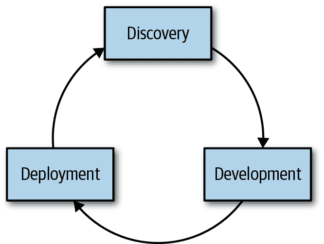

# 第二章\. 实际中的协作

尽管 DevOps 是一种文化运动，而不是可以通过特定工具创建或购买的东西，但可以在软件开发生命周期中实施协作原则，这可以以具体方式帮助工程效率。

开发管道是产品从设计到交付经历的阶段进展。没有一种管道能描述每个开发环境，但许多环境确实共享常见模式。

一般来说，产品开发分阶段进行。无论团队选择什么样的方法论，人们都会建立一套阶段或门控，以确定软件是否准备好进入管道下一阶段。在现代环境中，这些阶段可能看起来像是图 2-1 中展示的模型。

###### 图 2-1\. 软件开发生命周期中的各个阶段

让我们更详细地看一看每个阶段：

1.  在第一阶段，我们有发现。协作发现可能看起来像是团队讨论在一定时间内必须交付的最小要求集，比如一周或两周，这取决于交付工作特性的频率。

1.  在第二阶段，我们有开发。协作开发可以涉及成对编码和测试开发，代码审查，以及将工作分段处理为可以在设定时间内完成，并在项目看板上可视化的小块。代码提交进行审查，并运行额外的测试。测试可能是手动的或自动化的，并根据特定的测试目标（例如性能、安全性、合规性或产品功能）从不同的角度进行。如果测试成功，代码将合并到主分支中。此时可以构建来自合并代码的工件。

1.  在我们示例开发管道的第三阶段，我们有部署。部署发生在代码通过测试之后。我们可能有一个手动或定期的门控，将工件推进到我们的生产环境或释放给客户。

在您的环境中，您可以有更多的阶段，并且每个阶段都有机会让个人进行协作。本章提供了关于如何在不同阶段更有效地进行协作的实用建议。让我们从发现阶段开始。

# 协作式发现

协作过程早在工程师开始在他们选择的编辑器中编写代码之前就已经开始了。我们如何确定我们现在应该做什么来进一步增加业务价值？在维护当前产品和处理进入的请求之间进行优先级排序可能是具有挑战性的——特别是在来自组织内其他团队的期望压力下。我们需要在环境中持续维护各种不同的关系，以确保成功交付期望的结果。

在组织内产品发现阶段，流程和活动包括设计、需求收集、架构审查和项目规划。这些流程在不同行业之间可能有所不同，甚至在同一组织的不同部门之间也可能定义不同。这些流程被正式化的程度也会有所不同。

###### 注意

任何规模的组织都可能存在“孤岛”——公司内部某些部门之间沟通不畅的现象。组织越大，这种情况发生的可能性就越大。一个组织内部的一个小组，他们提出一个产品或项目并独自做出所有决策，而不与其他利益相关者协商，可能表明组织内存在孤岛。如果你在你的环境中识别出这些孤岛，可能需要更多的关注和时间来建立桥梁以促进变革。

## 角色与责任

许多较大的组织将有一个负责制定产品策略、路线图或其他类似文档的产品团队或部门。产品团队专注于产品的用户体验（UX）、扩展用户群体以及优先考虑为竞争优势而修改或新增功能。拥有明确的策略对于打造成功的产品至关重要——这一策略随后将决定产品的开发方向和限制条件。一个过于模糊的策略，比如“我们想成为我们领域最好的产品”，提供的指导不足，可能导致个人在缝隙中建设，从而造成不一致性。

单凭产品策略和设计并不能保证成功。一个没有实施和执行的想法仅仅是一个想法。你的产品团队不应该在“孤岛”内工作，他们制定产品需求然后“丢给”工程部门去实施，就像开发人员不应该把软件“丢给”运维部门去维护一样。在整个组织内部培养和维护协作关系至关重要。

## 产品与工程协作

一些可以帮助不同部门之间协作的策略包括以下几点：

+   *在部门之间共享工具。* 如果产品团队使用 Jira，工程师在 GitHub 项目中跟踪工作，并且两个组没有访问或视野到对方工具的情况下，这会减少共享背景。 如果共享工具不起作用，请确保通过提供充分的培训来保证透明性，以便不同团队能够轻松使用彼此的产品。

+   *鼓励各组之间的沟通途径。* 工程部门的代表应受邀参加定期产品规划会议，产品代表应受邀参加工程状态更新。

+   *定义和分享决策制定过程及可接受的批评形式。* 如前所述，每个希望如何表达他们对决策的看法的人都有机会以最能传达他们所拥有信息的方式分享。

+   *确保工作人员参与制定时间表。* 设计和工程负责他们工作的实施，并将对时间表是否可行提供宝贵意见。 产品有关客户需求和对业务价值影响的关键信息。 当每个人在产品计划最终确定前参与创建并签署产品计划时，这消除了由于错过不可能的截止日期而伤害团队之间关系的惊讶。

与工程的不同部分之间的协作至关重要，对组织中的其他部门进行沟通和信任的维护对于健康的组织是必要的。

###### 注意

每个组织都定义了需要不同协作策略的团队结构和流程。 将流程*显式*而不是*隐式*使得它们更容易推理，向团队的新成员传达，并在必要时进行更改。 文档化流程并保持文档更新！

## 组织各部门的要求

要求收集通常以考虑用户需求的形式出现。 在采用敏捷实践的组织中，这可能看起来像用户故事：形如*作为用户，我希望<某个目标>以便<某个理由或动机>*的陈述。 用户故事是从用户角度描述所需功能的简要描述。 单个故事描述了用户的期望体验，使用了业务和技术专家都能理解的共享语言。 讲述关于我们用户的不同故事帮助我们验证我们正在进行的工作，并以团队每个人都能理解的语言进行计划工作。 这些故事帮助我们规划与项目相关的工作并指导我们的工作，但它们并不指定任何实现方式。

在发现阶段内，我们探索我们对正在构建的东西的假设，确保我们获得足够的观点。我们需要与个人和团队的工作保持一致，以确保我们在工作时具有相同的目标。通过探索用户故事，我们还可以识别出将确定我们的工作是否完成或我们的验收标准的关键领域。如果我们不做这项工作，并讨论不同角色及其故事，我们可能会在最终将被抛弃的工作上花费大量精力和时间。

产品团队需要确保他们理解为新产品或功能的实现而提出的工程要求。工作也需要根据正在进行的工作及其对组织价值以及工程师的可用性进行优先排序，特别是具有专业知识的工程师。这可能意味着需要问一些类似的问题：

+   工程部门还在做什么，其他项目或截止日期会如何影响他们的工作能力和可用性？

+   新产品或功能是否需要对现有代码或基础设施进行重大更改？如果需要进行重大代码重构、新基础设施组件或主要架构变更，这可能会对时间框架产生重大影响。

+   团队是否具备开发和维护新功能所需的必要专业知识，或者是否需要考虑培训或招聘？例如，如果产品团队希望在一段时间后仅支持 iOS 的情况下增加对 Android 应用的支持，很可能需要雇佣 Android 工程师或者给现有工程师一些时间来快速适应新平台。

+   当前产品的整体稳定性如何？一个工程组织如果花费大量时间在解决问题上，将不太能够承担新项目。

工程部门并非唯一需要考虑其需求的部门。支持团队在公司的成功中发挥着至关重要的作用，但他们的需求往往被忽视。您需要对支持组织及其能力提出类似的问题。它是否具备支持新功能或产品、回答用户问题和帮助客户解决问题所需的专业知识？当前的平均支持量是多少？

尽可能地，维持设计、产品、工程和支持部门之间的关系至关重要，以确保每个人都能理解彼此的需求和要求，从而使团队能够共同解决客户问题。确保部门之间不要形成信息孤岛，正如你们在部门内部消除信息孤岛一样。

## 架构与规划

而设计和需求收集往往涉及产品或功能开发的“什么”和“为什么”，架构和项目规划则关注“如何”。一般来说，具体的实施细节和细节应由具有必要领域专业知识的人员来决定（通常是将大部分工作的工程师），但这并不意味着在这个过程的整个部分中没有合作的机会。

架构和项目规划的目标之一应该是找出如何以可持续的方式构建和测试产品。正如我们之前讨论过的那样，避免把工作丢过象征性的墙壁是很重要的。产品或功能构建完成后，会发生什么？工程过程的一部分是确保了解产品在投放到客户前将如何运行。它将如何进行监控？有哪些调试和故障排除过程？它将以多频率进行更新，这些维护工作流程会是什么样子？产品的整个生命周期是否被理解？

### 定义项目

我们需要在项目周围设定明确的边界，并确保所有参与者对这些边界有共同的理解。在项目开始时清晰定义和记录项目范围的各个方面可以减少项目期间的误解和浪费的工作量。在规划新产品或功能时需要定义以下内容：

+   “完成”是什么意思？团队何时可以宣称他们已经完成了一个阶段的工作，并转而进行其他工作？

+   是按照某个日期发布具有较少功能的产品更重要，还是按时发布功能完整的产品更重要？

+   当问题出现时，谁将做出决策？参与原始设计或想法的利益相关者是否与将负责修改的人员相同？

+   产品或功能发货后，谁将拥有它？谁将负责维护和运行它，以及这些责任将包括哪些内容？

同样，这些问题和定义很可能涉及多个部门的人员，因为新产品并非孤立存在。如果某个工程团队将负责维护新产品、服务或支持基础设施组件，那么他们有机会帮助澄清工作范围是至关重要的。从一开始就像这样涉及关键利益相关者可以帮助防止未来出现不愉快的惊喜，特别是当很可能已经为改变方向而来不及时。您不希望在开发几个月后发现，您将无法适当地支持产品的发布后的带宽不足。

###### 注意

在公共共享位置为项目提案、设计文档、决策记录或您组织选择的规划文档建立模板，有助于保持多个团队的一致性。当团队共享项目提案模板时，协作变得更容易，因为所有团队都能获取到他们计划或做决策所需的信息。

### 计划和审查流程

在适当的地方明确定义流程（并记录在人们能够轻松找到的地方）对规模化协作非常重要。流程并不一定意味着“过多的官僚主义”，或者组织处理如此之多的繁文缛节以至于无法推动任何事情。适量的流程可以确保不同团队知道彼此需要提供什么，以及如何最好地合作，以最大化集体利益。

我们建议组织，特别是在企业级别，将架构和可操作性审查过程作为其产品规划和开发周期的一部分。

当计划对产品的架构或基础设施进行重大更改时，需要进行架构审查。重大变更不应该让人感到意外，因为这可能会影响信任和工作方式。在他们心目中新的最爱语言重写应用程序的核心部分，以及类似的影响深远的变更，表明沟通已经严重破裂。提前思考这些变更的后果并不是“过多的流程”，而是成熟工程实践的表现。

###### 注意

查看约翰·奥尔斯波在 Etsy 的架构审查博文¹，了解更多有关您的规划和审查流程中应包含哪些元素的想法。

在规划过程中应考虑可操作性审查，以帮助发现可能影响在生产环境中管理和监控应用程序的架构问题。这些审查确保每个人都理解在生产中操作某物的含义，谁将负责，如何进行故障排除和维护，以及类似的主题。目标不是任意的门槛。通过在规划早期而不是在生产前进行可操作性审查，我们可以减少浪费的工作，并将变更纳入产品设计中，以促进所有人更好地理解和操作产品。

###### 注意

除了加强工程团队内部的团队关系外，还要注意工程与其他部门的关系。销售和产品部门经常提出新产品和功能的想法，但他们需要确保所提出的建议基于当前团队的工程约束是现实的。例如，销售团队不应在未经工程团队参与并了解正在进行的任何功能、维护或技术更新的影响情况下，就对新功能或发布作出具体承诺。

谁应该参与的具体细节因公司而异；然而，重要的是确保找到方法让感兴趣的各方有机会参与讨论，同时不使讨论过程过长或过于苛刻。以下是一些实现这一目标的方法：

+   让感兴趣的团队指定代表参与；例如，让一两位工程经理或高级工程师参加与产品团队的计划会议，而不是整个开发或运营团队。记录每个步骤参与的人员及其原因。

+   尽可能广泛地分享讨论和计划会议的笔记或记录。通常，人们会感激能够了解正在发生的事情，这种可见性可以使他们放心，知道他们的利益将得到代表，并且他们不需要亲自参与。

+   清楚地告诉人们在讨论过程中如有评论、问题或其他顾虑应该与谁交流。

+   提供讨论模板时，尽可能让相关团队有机会共同合作这些模板。例如，如果工程团队在产品组提出新功能时经常提出一些问题，可以将这些问题提前列入产品讨论模板中。其中一个目标是尽量减少意外。

+   当向不同团队征求反馈意见时，尽可能具体地说明您处于进程的哪个阶段。这是产品正在进行头脑风暴的想法的开端，还是有一个大客户交易依赖此功能必须在特定日期之前实施？

### 设计成果物

拥有来自项目规划、头脑风暴和设计会议等过程的具体、可搜索的成果物非常有帮助，不仅有助于建立长期的组织记忆，还有助于使这些过程更具协作性。在较大的组织或跨多个时区分布的组织中，要将所有必要的利益相关者或参与者聚集在同一地点同时参与可能变得更具挑战性。

寻找团队可以生成具体成果物的方式，其他团队和个人可以异步阅读和贡献。例如：

+   讨论模板、会议格式等可以保存在 Google Docs 中，允许计划讨论实例的团体根据需要制作其自己的文档副本。

+   如果您的组织有内部文档存储库（无论是 Google Docs、Dropbox、内部协作 wiki 或类似的），请确保有一个标准位置来存放所有模板和其他文档。

+   在可能的情况下，尽量在设计为可搜索和异步的媒体中进行交流：使用电子邮件或 GitHub 问题，而不是 Slack 或其他聊天软件。

# 协作开发

协作开发始于版本控制。试图在没有源代码控制和共享集成过程的环境中一起编写代码是导致挫折和增加摩擦的原因。在开发阶段，团队合作编写代码和测试，审查代码，²^,³ 并集成代码。⁴ 在本节中，我们专注于测试驱动开发和持续集成，尽管协作不限于这些具体实践。

## 测试驱动开发

常常在发现阶段建立验收标准的协作性质导致了驱动测试驱动开发（TDD）的第一批测试。正式地说，TDD 指的是一个涉及红色、绿色、重构开发周期的特定软件开发方法：

1.  编写新的测试。在编写任何属于新功能的代码之前完成此操作。在这一点上，新测试应该失败，因为它所测试的功能尚未编写。这是“红色”阶段。

1.  为新功能编写代码。此阶段的重点是编写允许测试通过的代码，而不仅仅是这些。这是“绿色”阶段。

1.  现在应运行所有测试，它们应该全部通过——包括新代码的新测试和所有现有测试（不应有任何降级）。

1.  如有必要，此时可以对代码进行重构、优化或其他清理，但要注意不要在此过程中引起任何测试降级。这是“重构”阶段。

虽然不必严格遵循 TDD，但在整个开发过程中将测试与编写代码同时进行而不是最后一切一起进行被广泛认为是一个好策略。测试不应该是事后的考虑，等到开发周期的最后看新代码是否导致了任何回归可能会浪费大量的开发和测试时间。

当开发人员配对或以其他方式合作编写代码时，还应编写并运行测试。考虑包括以下策略：

+   在代码需要合并到上游之前，验证本地是否有运行测试的方法，例如在开发人员的笔记本上。确保您的测试环境允许开发人员运行存在的完整测试的子集，例如仅测试他们正在工作的类或模块。工程师运行测试的速度越快，他们实际上进行测试的可能性就越大！质量测试可以改善提交到共享存储库的代码质量，提高个人之间的信任。

+   内部记录您的测试模式。如果使用特定的测试框架或库，请确认工程师知道它是什么，以及在编写测试时应遵循什么约定。

+   测试不应仅适用于名为软件开发人员的人员。如果您的站点可靠性工程师、系统管理员或运维工程师编写代码，那么该代码也应具有测试。甚至确保在提交和部署之前通过 linter 运行 bash 脚本，随着时间的推移也能有所帮助。

+   并非所有测试都可以或应该自动化。开发探索性测试是一项重要的技能。

## 持续集成

持续集成（CI）是将新的代码更改持续（或尽可能频繁地）合并到主或主干分支的做法，而不是等到长时间的开发周期结束才这样做。在现代开发环境中，这可能意味着每天向主分支合并数十次。在较大的组织中，CI 实践可能因团队而异。这是一个团队应该在流程上标准化的领域，以便可以形成临时团队并快速遵循已建立的流程。

CI（持续集成）是能够快速、有效和协作工作的关键。当工程师工作时，他们将测试、提交和合并小的工作单元，例如添加新方法并为该方法编写测试，而不是等到整个新的客户端功能完成。其他开发人员可以拉取这些更改并将它们合并到自己的开发分支中，确保每个人都在可能的最新代码库版本上进行工作。

这可以防止“集成地狱”的问题，即在项目结束时一次性集成数十甚至数百（甚至数千）个更改，然后人们才运行集成测试。当一次实施数百个更改时，很难确定哪个更改引入了问题（甚至很难确定是否存在问题！）。另一方面，如果在测试通过和开始失败之间只有一个小的提交，那么很容易确定哪个提交包含了导致失败的更改。

CI 允许开发人员、测试人员和运维人员协作，通过减少每次更改的大小来降低风险并实施变更。

### 协作的 CI 实践

以下是您可以在组织内实施的一些改进措施，以提升 CI 协作实践水平：

+   *使用单一的 CI 平台。* 无论是基于云的 CI 服务还是自托管的本地服务，所有人使用相同的工具可以极大地改善团队之间的协作。当不同团队使用不同的 CI 工具时，个人在跨团队有效使用工具时会变得更加困难。在构建复杂软件时，尤其重要的是尽可能减少我们使用的工具的复杂性（例如，由许多微服务组成的服务）。这样，当服务的某一部分存在问题时，我们可以快速查看状态，而不是试图在不同工具之间弄清楚状态。

+   *定义基础设施即代码（IaC）。* 减少本地、测试和生产环境之间的差异。基础设施配置应进行测试。

+   *尽可能将手动测试转换为脚本测试。* 自动化脚本测试。当代码提交并推送回共享存储库时，应自动触发该存储库的测试运行。不要依赖人们记住在计算机可以为他们记住的情况下运行测试。

+   *通过在集成中实施自动化的 linting 来消除样式选择的摩擦。* 这种方式可以去个人化的样式选择，并通过发现潜在逻辑缺陷来提高代码质量。

+   *在重构或删除易错测试上投入时间。* 大多数测试都是代码，应像代码一样维护，以减少摩擦。如果测试拖慢了功能开发和发布速度，或者担心修改测试套件以包含新测试，可能会导致构建功能和实施错误修复的进展缓慢，从而影响构建客户价值的能力。

# 协作生产

在部署阶段，我们使用手动或定期的门控部署产品，并监视和观察产品的使用情况。请记住，在按下部署按钮后工作并未结束。在代码实时部署到生产环境后，必须监控其以确保正常运行，并且如果出现问题，需要观察和调试。在本节中，我们特别关注代码进入生产后的情况：值班职责、回顾和组织学习。

## 协作部署流程

使部署过程协作化并不意味着一个人看着另一个人运行部署。相反，它是确保在过程之前、期间和之后都有可见性。以下是增加可见性的几个建议：

+   聊天是团队鼓励协作文化的工具。它在部署过程中也很有用。你可以选择完全基于聊天的流程，使用在#deploy 频道中的聊天机器人，以便频道中的任何人都能看到正在部署的内容及其时间。如果不这样做，你应考虑进行聊天集成，例如一个聊天机器人，宣布由其他部署工具执行的部署，以便人们知道正在发生什么变化。

+   确保你的部署在监控和可观察性工具中可见。在 Graphite 图中能够看到一个视觉标记，显示部署何时进行，将有助于在应用行为有显著变化时提供背景信息。

+   对于高风险的部署，采用伙伴制度，团队成员在部署过程中配对，允许个人分离部署的不同方面，观察影响与执行。这可以减少发现问题的时间，并提供解决问题所需的支持，其中一人负责传达必要的变更和影响，而另一人则回滚升级或部署修复。

    虽然通常不应要求每次部署都进行“图表观察”（毕竟这是自动化监控和警报工具的功能），但确实有时人们会因为知道有人关注最重要的指标而感到更安心，例如在大型迁移项目结束时切换开关时。

协作部署的目标是告知个人预期的变化，以最小化意外。意外会侵蚀信任，可能影响同理心的实践。

## 创建可持续的值班环境

几乎每个组织今天都有某种需要值班的要求，工程师们预期在非工作时间内可随时响应问题。历史上，值班是一个非常孤立的实践，只有系统管理员承担值班责任。这导致人们感到被不公平对待时产生了怨恨和对抗性关系，并因长期的睡眠剥夺而导致疲劳、健康问题和工作成果不佳。同理心使我们能打破这些模式，创造人性化和可持续的值班环境。

## 人性化的人员配置和资源

DevOps 的推动因素是历史软件开发实践对操作软件或运行在其上的服务器的不利影响。诸如持续集成和基础设施即代码的实践已经改善了这一点，但仍需考虑其他因素。

### 可用性和维护

当我们运行那些用户期望始终可用的网站时，常常会考虑进行需要停机或会影响部分服务的维护的时间问题。从纯用户界面的角度来看，最好在影响用户最少的时间进行维护。因此，一个美国公司，其高流量时间通常在美国白天，可能希望在美国时区的深夜或清晨进行维护，但对于主要用户在亚洲的公司来说，情况可能并非如此。

然而，从进行维护的人员的角度来看，这可能并不理想。这不仅仅是人们不愿意熬夜或早起的问题；更重要的是，如果他们没有充分休息，他们在警觉、反应和工作效率上会受到影响。从运营者的角度来看，应在他们最警觉和清醒的时候进行关键的维护操作。如果基于用户需求这是不可能的，例如维护任务需要太长时间，造成的财务损失太大，仍然有方法可以减轻维护者的成本。

员工应该公平地获得加班补偿。如果加班是他们工作的正常部分，这一期望应该在工作描述中明确说明，以便人们评估这个职位是否合适他们。允许并鼓励员工关注自己的健康，例如，让他们在进行深夜维护后休息一天。确保如果可能的话，维护任务分散或团队规模足够大，以便人们在这些加班轮班之间有足够的恢复时间。根据情况，支付这些活动的交通或餐饮费用也是很好的做法。如果工作角色发生变化，导致有人需要承担加班工作责任，他们的补偿应相应调整。

### 工作与生活的平衡

在规划明年的人员编制时，保持工作与生活的平衡至关重要。对人员的容量规划与对服务器的规划同样重要。如果您的团队成员需要定期在晚上和周末工作，以满足期望，这将导致工作质量低下、士气低落和倦怠。Devops 是关于创建可持续的工作实践，个人如何处理他们的工作与生活平衡预期是其中的关键部分。

尽管运营相关领域的许多工作传统上需要在非工作时间进行——无论是维护、值班还是为了提供全天候覆盖的非标准班次——但重要的是要记住，这些要求可能会无意中对有重大工作外责任的人造成偏见。年轻、单身且没有孩子（或需要大量照料的宠物）的人会发现，他们更容易把空闲时间用于工作，而有伴侣、孩子或其他家庭责任的人则不然。通勤时间较长或有健康考虑的人也会更受这些要求的不利影响。培养和维护多样化和包容性团队的一部分工作就是考虑到这些因素，并考虑如何调整工作要求以更具包容性。

### 团队规模考虑

有足够的人员负责快速响应警报和事故，无论是参与值班呼机轮换还是有多个班次的人员全天候工作，这也是一个考虑因素。在这一点上，大型公司往往更容易——大公司更有可能在全球不同办公室拥有多个团队，从而比较容易实施“日夜追随”轮换。

在这种设置中，多个团队（通常是三个）分布在全球各地，每个团队在其正常的白天工作时间内工作，彼此的物理距离足够远，以至于一个班次结束时正好与下一个班次的工作时间开始时重叠。这使得团队能够提供全天候的覆盖，而不需要人们在他们当地的夜间工作。

即使中型公司很可能拥有一个完整的运营工程师或系统管理员团队可以参与值班轮换，但在较小或较年轻的公司，这种情况可能不太可能发生。尽管您可能认为您没有足够的运营工作来组建一个完整的运营团队，您应该避免只有一个人负责值班职责。这可能意味着在尽可能多的人员之间分享值班责任，以便个人有机会恢复并补充睡眠。

###### 注意

即使在短期内，睡眠不足也可能导致难以集中注意力或表现良好、易怒或焦虑，以及高血压或心脏病风险增加——这些影响在长期保持睡眠不足时会叠加。

总体健康，特别是燃尽，是理解您组织整体健康状况的一个非常真实的考虑因素。优先考虑公司的短期财务或物质收益，而不是其内部人员的长期健康，将导致长期损失。

## 可持续和协作值班的模式

In this section, we share specific practices to build up a collaborative and sustainable on-call rotation. It’s critical to avoid having any single individual or group feel like they are shouldering an unfair burden, because that can affect the relationships we want to build between individuals and across the teams that support a specific product or feature.

### On-call onboarding

从一开始，以一种富有同情心和心理安全的方式介绍值班责任非常重要。如果你将新团队成员引入现有轮换中，让他们知道他们不必立即对每个警报做出响应。创造一个能够让他们提问的环境。

新人在像值班这样的情况中可能非常有价值，警报疲劳可能会累积，人们可能会习惯事情一直以来的方式。如果你创造一个安全的环境，你可以让新团队成员提出像“我们为什么要这个警报，但似乎从未对其做出响应？”或“为什么没有 X 的图表？”等问题，以及其他无数问题，这些问题可以启发改进你的监控、可观测性和警报方式，造福每个人。

关于你的值班流程，包括如何获取所需的任何设备、人员可能需要访问的任何工具/系统/仪表板，以及响应时间的预期，保持有关的实时文档是个好主意。理想情况下，新成员在第一次拿到响铃之前就能获取所需的所有信息，但如果没有这样的文档，新成员在学习过程中也可以帮助创建。如果你不是将新团队成员添加到现有的值班轮换中，而是第一次创建值班轮换，你可以利用入职文件的概念帮助你定义值班服务的参数。

### On-call buddies

如果你要将新人引入值班轮换或从零开始创建一个新的轮换，你可能想利用伙伴系统。对于现有的轮换来说，这可以是一种特定的指导，其中熟悉流程和责任的人可以与新人分享他们的知识。这可以通过为新人提供后援（如果你遇到不知道如何处理的警报，首先转给这个具体的人）来减少新人的压力，并明确一个可以提问的地方。

### Defining ownership

With any on-call rotation, it’s important to explicitly define roles and responsibilities. You don’t want multiple people responding to the same alert and potentially stepping on each other’s progress!

如果你的组织是每个团队都有足够人员维持自己独立轮班的组织，你可以开始说每个团队都要负责自己的产品和服务的值班。然而，当团队人数太少以至于无法可持续时，比如每四人以下的团队，可能无法持续或人道地每四周 24/7 值班一周（而不是每八周或每十周），尤其是对于在工作之外承担更多责任的人来说。

思考特定服务所需的经验和专业知识非常重要。理想情况下，我们不希望有个别领域专家，因为我们总是需要他们随时可用，这可能会导致他们过度疲劳。

### 创建支持性环境

在接班时感受到承担重要服务责任的巨大压力而缺乏他人支持可能会让人感到极度紧张。在前文提到的网站可靠性工程精神中，重要的是创造一种人们能够积极而乐意支持彼此的文化。你希望有一种环境，人们在面对逐步升级的事件时的反应是“我能帮什么忙？”而不是“你做错了什么？”每个工程师在某个时候都会遇到自己无法单独处理的问题，而能够寻求帮助对于鼓励和维持一个心理上安全的团队至关重要，这对我们做的所有其他非接班工作都产生影响。

## 协作回顾

无论你称其为回顾、事后分析、学习回顾还是其他什么名称，中期的跟进过程都对创建一个可持续的接班经验至关重要，而不是导致疲劳的经历。如果没有任何有效的后续跟进，事件很可能会不断重复，给负责响应的人员带来不必要的负担。有效的回顾包括事件的书面时间轴和一次会议回顾，在其中进行重要的讨论和学习。

### 创建事件时间轴

在立即应对措施已经采取完毕后，进行回顾的第一步是创建事件发生的时间轴。这将涉及汇集来自 PagerDuty 的警报、相关事件响应或运维工程 Slack 频道的聊天记录，以及任何其他必要的书面内容，以清晰描述事件发生的时序。通常情况下，担任当班工程师的人将负责整理时间轴，因为大部分协作讨论将在回顾会议期间进行。

### 促进事故回顾

事故回顾的主要部分是一个经过引导的会议（通常称为事后分析或回顾，尽管准备时间轴是一个不应被忽视的重要步骤）。会议的主要部分包括以下内容：

+   *审查时间线。* 一个有经验的促进者会提出旨在扩展对发生的事情及其原因理解的问题。无责任是一个关键概念。假设人们没有故意犯错，我们希望了解他们为什么采取了他们采取的行动，无论是为什么他们认为特定的变更安全部署还是为什么在故障排除时查看特定的仪表板。一个成功的时间线审查将更多地是一次团体讨论，而不是由值班人员的独白。

+   *指出令人意外的事物。* 如果在事件中没有发生令人意外或困惑的事情，那将被称为计划内维护。我们可以从令人惊讶的事情中学到东西。这些事件可以在时间线审查期间讨论，但应在之后明确记录和指出，因为它们通常会引入...

+   *规划补救事项。* 可以讨论下一步具体措施的意外事件。例如，如果你对特定服务的错误率图表感到意外，创建一个可能是一个好的补救事项。（不是每个意外事件都需要单独的补救事项。）重要的是不要在事件审查之前就计划好补救措施，利用审查来证明那项工作是必要的。也不需要创造一定数量的事项来使审查看起来更“有成效”。请记住，为了补救事项有效，你需要优先考虑这项工作。如果人们习惯于忽略补救事项，那将削弱整个事件审查过程，并且很可能导致事件重复发生。

理想情况下，所有参与事件响应的人员都应参加该事件的审查会议。如果日历的可用性或时区不允许及时进行（最好在一周内进行，这样时间线还新鲜在人们的记忆中），那么最好是尽早进行较小规模的审查，而不是等待数周或数月以便安排日历，因为人们可能会忘记上下文，而事件可能会在此期间再次发生。

###### 注

本书不涉及事件审查或事后分析会议的促进过程。这是一项重要的技能，你不应忽视以最大化事后分析过程的效用，而 Etsy 的指南⁵是一个很好的起点。

## 组织学习

每个组织都有其自己的机构知识库——组织中的人们共同知道和理解的事物。事故审查等过程的主要目标之一是增加组织知识体系，帮助组织学习。没有组织学习，相同的问题可能会一再发生。这可能看起来像一个生产事故以相同方式持续发生，因为没有人能够采取解决措施，或者一个团队在另一个团队已经经历和解决的问题上挣扎。

心理安全在创建学习环境中非常重要。考虑一下工作场所，员工因犯错或揭示问题而被责骂、解雇或受到其他惩罚。如果人们在犯错时不感到安全，他们可能会故意隐藏问题，肯定不会安全地寻求帮助来解决问题。这显然无助于提升系统的表现或增强其韧性。

值班轮换和事故审查的目标不是惩罚任何人或增加额外工作：而是促进组织学习。当系统发生故障或以意外方式运行时，这提供了机会使其更加健壮，改进工具或围绕其编写文档，并在更多需要知识的人中分享知识。健康和可持续的值班文化在不断改进和学习，要求所有参与者视彼此为同伴学习者和合作者，而不是对抗性思维。

### 机构记忆

机构记忆描述组织整体如何记得其从过去经验中学到的东西。在机构记忆较差的组织中，很容易陷入“这是我们一直做事情的方式”的情况，但没有人真正记得*为什么*。机构记忆差会使系统和组织变得脆弱，因为理解历史背景和权衡有助于建立韧性。

建立和维护组织的机构记忆是一个协作的过程。主要目标是确保相关知识广泛共享到整个组织，而不是仅限于一个团队或更糟的是一个人。为了促进这种学习，确保文物以一种使它们在整个组织中可访问、可搜索并长期可用的方式存储。这些文物可以包括以下内容：

+   时间表、会议记录以及事后总结和回顾的录音。

+   警报配置。如果可能的话，这些应该在源代码控制中，这样提交消息可以解释为什么添加了特定的警报。

+   决策记录、项目提案、设计文档以及类似的规划工件。理想情况下，这些将包括讨论考虑过的替代方案和其他能帮助未来工程师了解为什么做出特定决定的上下文信息。

# 摘要

我们分享了一些具体的协作实践，以强化和支持协作的基石：信任、共情和心理安全。这些协作原则不仅仅是理论上的；它们旨在应用于现实世界，并且是行之有效的。深入思考软件开发过程中的不同阶段，回顾沿途的每一步。识别那些妨碍您关系和成长的最痛苦的互动，并开始应用您现在可以融入工作的实践。这只是鼓励协作的一部分实践代表性子集；寻找其他促进团队信任、共情和心理安全的机会。

¹ 约翰·奥尔斯波（John Allspaw）。“技术问题和解决方案的多重视角。” *Kitchen Soap*，2017 年 8 月 12 日。[*http://bit.ly/2L9j13f*](http://bit.ly/2L9j13f)。

² 比利·克利克（Billie Cleek）。“如何进行有效的代码审查。” *Digital Ocean 博客*，2018 年 3 月 28 日。[*https://do.co/2LdU86q*](https://do.co/2LdU86q)。

³ 特雷西·卢姆（Tracy Lum）。“如何进行更好的代码审查。” *Medium/Hacker Noon*，2018 年 7 月 3 日。[*http://bit.ly/2XJWfAC*](http://bit.ly/2XJWfAC)。

⁴ 凯维·麦克明（Keavy McMinn）。“如何撰写完美的拉取请求。” *GitHub 博客*，2015 年 1 月 21 日。[*http://bit.ly/2xHxDxG*](http://bit.ly/2xHxDxG)。

⁵ 约翰·奥尔斯波（John Allspaw）。“Etsy 的无责任事后分析会指南。” Etsy/Code as Craft，2016 年 11 月 17 日。[*http://bit.ly/2j6YEq2*](http://bit.ly/2j6YEq2)。
