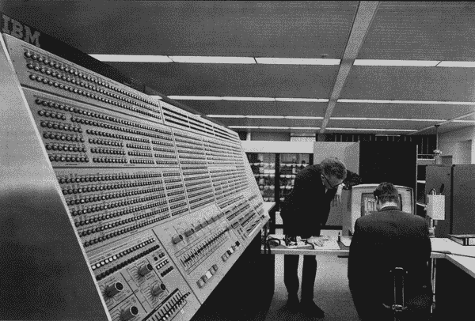
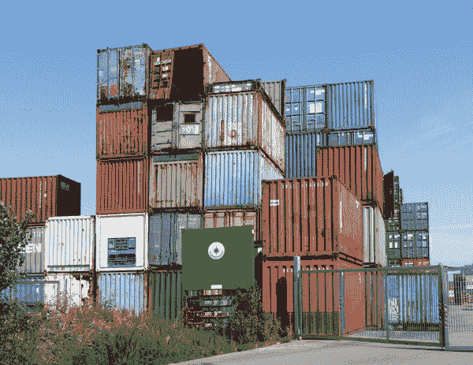

# 第一章\. 云中的革命

> 从未有过一个世界从何开始的时候，因为它像圆圈一样不断地旋转，而在圆圈上没有任何一个地方是它开始的地方。
> 
> 艾伦·沃茨

正在发生一场革命。实际上，是三场革命。

第一场革命是*云*的诞生，我们将解释它是什么，以及为什么它如此重要。第二场是*DevOps*的黎明，您将了解它涉及的内容以及它如何改变运营。第三场革命是*容器*的广泛采用。这三波变革共同创建了一个新的软件世界：*云原生*世界。这个世界的操作系统被称为*Kubernetes*。

在本章中，我们将简要回顾这些革命的历史和意义，并探讨这些变化如何影响我们所有人部署和操作软件的方式。我们将概述云原生的含义，以及如果您从事软件开发、运维、部署、工程、网络或安全工作，您可以期待在这个新世界中看到的变化。

由于这些相互关联革命的影响，我们认为计算的未来在于基于云的、容器化的、分布式系统，由自动化动态管理，在 Kubernetes 平台上（或类似的平台）运行。开发和运行这些应用程序的艺术 —— *云原生 DevOps* —— 将在本书的其余部分探讨。

如果您已经熟悉所有这些背景资料，只想开始享受 Kubernetes 的乐趣，请随意跳到第二章。如果没有，请舒服地坐下来，拿着您喜爱的饮料，我们开始吧。

# 云的诞生

起初（好吧，无论如何是在 1960 年代），计算机填满了遥远、大规模、空调机房中的机架，用户从未直接看到它们或与其直接交互。开发者远程提交任务到机器上，并等待结果。成百上千的用户共享同一套计算基础设施，每个人只需支付他们使用的处理器时间或资源的费用。

对每个公司或组织来说，购买和维护自己的计算硬件是不划算的，因此出现了一种商业模式，用户共享第三方拥有和运行的远程机器的计算能力。

如果这听起来像是现在，而不是上个世纪，那并非巧合。*革命*这个词意味着“循环运动”，而计算机在某种程度上回到了它的起点。虽然多年来计算机变得更加强大 —— 今天的苹果手表相当于图 1-1 中展示的主机计算机的三倍 —— 对计算资源的共享、按使用量付费的访问却是一个非常古老的概念。现在我们称之为云，以及从分时共享主机开始的革命已经走了一整圈。

###### 图 1-1\. 早期云计算机：IBM System/360 Model 91，位于 NASA 的 Goddard 太空飞行中心

## 购买时间

云的核心理念是这样的：不再购买*计算机*，而是购买*计算*。也就是说，不再将大量资本投入到容易扩展、机械故障和迅速过时的物理设备中，而是简单地购买他人计算机上的时间，并让他们负责扩展、维护和升级。在裸金属机器时代——如果你喜欢的话，可以称之为“铁器时代”——计算能力是资本支出。现在它是运营支出，这造成了巨大的不同。

云不仅仅是关于远程租用的计算能力。它还涉及分布式系统。您可以购买原始计算资源（例如 Google Compute *实例* 或 AWS Lambda *函数*）并使用它来运行自己的软件，但您也越来越多地租用*云服务*：基本上是使用他人的软件。例如，如果您使用 PagerDuty 监控系统并在某些情况下提醒您，您正在使用云服务（有时称为*软件即服务*或 SaaS）。这些 SaaS 服务的成功部分归功于云的这一最新革命。现在几乎任何人都可以创建新的应用程序或网站，在公共云提供商上托管它，并在找到一些成功时将其扩展到全球观众。

## 基础设施即服务

当您使用云基础架构来运行自己的服务时，您购买的是*基础设施即服务*（IaaS）。您不必消耗资本去购买它，也不必去建造它，也不必去升级它。它就像电力或水一样是一种商品。云计算是企业与其 IT 基础设施之间关系的革命。

外包硬件只是故事的一部分；云还允许您外包您没有编写的*软件*：操作系统、数据库、集群、复制、网络、监控、高可用性、队列和流处理，以及连接您的代码和 CPU 之间的各种软件层和配置。托管服务可以为您处理几乎所有这些*无差别的重活*（您将在第三章中了解到更多关于托管服务优势的内容）。

云革命还引发了使用它的人们的另一场革命：DevOps 运动。

# DevOps 的黎明

在 DevOps 出现之前，开发和操作软件基本上是两个由不同人群执行的独立工作。*开发人员*编写软件，然后将其传递给*运维*人员，在*生产环境*中运行和维护软件（也就是说，为真实用户提供服务，而不仅仅是内部测试或功能开发目的的运行）。就像大型主机计算机需要建筑物内自己的一层一样，这种分离根源于上个世纪中期。*软件开发*是一个非常专业的工作，*计算机操作*也是如此，这两种角色之间的重叠很少。

这两个部门有着完全不同的目标和激励，经常彼此冲突。开发人员倾向于快速推出新功能，而运维团队则更关心在长期内使服务稳定可靠。在某些情况下，可能会制定安全政策，阻止软件开发人员甚至访问其应用程序在生产环境中的日志或指标。他们需要征得运维团队的许可才能调试应用程序并部署任何修复。无论原因如何，通常出现应用程序问题时都会责备运维团队。

随着云计算的普及，行业发生了变化。分布式系统复杂，互联网非常庞大。在处理这些分布式系统的技术细节时，如何从故障中恢复、处理超时、平滑升级版本等，与系统的设计、架构和实施密不可分。

此外，“系统”不再仅限于您的软件：它包括内部软件、云服务、网络资源、负载均衡器、监控、内容分发网络、防火墙、DNS 等。所有这些东西都密切相连，相互依赖。编写软件的人必须了解其与系统其余部分的关系，而操作系统的人必须了解软件的工作方式和故障情况。

## 改进反馈循环

DevOps 运动的起源在于试图让这两个群体合作，共享理解，共同承担系统可靠性和软件正确性的责任，并改进构建这些系统和团队的可伸缩性。

DevOps 旨在改进各团队在编写代码、构建应用程序、运行测试和部署更改时存在的反馈循环和交接点，以确保事物运行顺畅和高效。

## 什么是 DevOps？

*DevOps*偶尔会被用来定义，这个术语有时会引起争议，一些人认为它不过是软件开发中现有良好实践的现代标签，还有人拒绝在开发和运营之间需要更多协作的必要性。

对于 DevOps 实际是什么也存在广泛的误解：一个职位？一个团队？一种方法论？一种技能？有影响力的 DevOps 作家约翰·威利斯确定了四个关键支柱，他称之为*文化、自动化、测量和共享*（CAMS）。实践 DevOps 的组织具有鼓励协作、拒绝将知识隔离在团队之间以及寻找持续改进方法的文化。另一种分解方法是布莱恩·道森所说的 DevOps 三位一体：*人与文化*、*过程与实践*、*工具与技术*。

有些人认为云和容器意味着我们不再需要 DevOps——有时被称为*NoOps*。这种观点的核心是，由于所有 IT 运营都外包给云提供商或其他第三方服务，企业不再需要全职运营人员。

NoOps 的谬误基于对 DevOps 工作实际涉及的误解：

> 在 DevOps 中，大部分传统的 IT 运营工作发生在代码进入生产之前。每个发布都包括监控、日志记录和 A/B 测试。CI/CD 管道会自动运行单元测试、安全扫描器和策略检查。部署是自动化的。控制、任务和非功能性需求现在在发布之前实施，而不是在关键故障的紧张和后果中进行。
> 
> Jordan Bach ([AppDynamics](https://oreil.ly/HlKK3))

目前，您会发现很多关于 DevOps 工程师职称的招聘信息，以及这种角色在不同组织中预期的广泛范围。有时它看起来更像是传统的“系统管理员”角色，与软件工程师的互动很少。有时，这种角色会与开发人员并肩工作，构建和部署他们自己的应用程序。重要的是考虑 DevOps 对您意味着什么，以及您希望在组织中如何实现它。

关于 DevOps 最重要的一点是，它主要是一个组织和人的问题，而不是技术问题。这符合杰瑞·温伯格的咨询第二定律：

> 不管一开始看起来如何，它总是一个人的问题。
> 
> 杰拉尔德·M·温伯格，《咨询的秘密》

而 DevOps 确实有效。研究经常表明，采纳 DevOps 原则的公司发布更好的软件速度更快，对失败和问题的反应更好更快，在市场上更具敏捷性，并显著提高产品质量：

> DevOps 不是一时的风尚；相反，它是成功组织今天工业化交付质量软件的方式，也将成为未来和未来多年的新基线。
> 
> Brian Dawson，[*CloudBees*](https://oreil.ly/rzb3D)

## 基础设施即代码

曾几何时，开发人员处理软件，而运维团队则处理硬件及其运行的操作系统。

现在硬件在云中，从某种意义上说，一切都是软件。DevOps 运动将软件开发技能引入运维：快速、敏捷、协作地构建复杂系统的工具和工作流程。这通常被称为*基础设施即代码*（IaC）。

与其物理安装和连接计算机和交换机，云基础设施可以通过软件自动配置。运维工程师们不再手动部署和升级硬件，而是成为编写自动化云服务的软件的人。

流量不仅仅是单向的。开发人员从运维团队那里学习如何预测分布式、基于云的系统中固有的故障和问题，如何减轻其后果，以及如何设计能够优雅降级和安全失败的软件。

## 共同学习

开发团队和运维团队都在学习如何共同工作。他们学习如何设计和构建系统，如何在生产环境中监控和获得反馈，并如何利用这些信息改进系统。更重要的是，他们学习如何为用户提供更好的体验，为资助他们的业务提供更好的价值。

云的大规模和 DevOps 运动中的协作、以代码为中心的性质，已将运维转变为一个软件问题。同时，它们也将软件转变为一个运维问题。所有这些都引发了以下问题：

+   如何在不同服务器架构和操作系统的大型、多样化网络上部署和升级软件？

+   如何在可靠且可重复的方式中部署到分布式环境中，使用大部分标准化的组件？

进入第三次革命：*容器*。

# 容器时代的到来

要部署一段软件，你不仅需要软件本身，还需要其*依赖项*。这包括库、解释器、子包、编译器、扩展等等。

你还需要它的*配置*：设置、特定于站点的详细信息、许可密钥、数据库密码——所有能使原始软件成为可用服务的东西。

## 技术的现状

早期解决这个问题的尝试包括使用*配置管理*系统，比如 Puppet 或 Ansible，这些系统由代码组成，用于安装、运行、配置和更新软件。

另一种解决方案是*综合包*，顾名思义，试图将应用程序所需的一切都塞进一个文件中。综合包包含软件、其配置、其依赖的软件组件、*它们*的配置、*它们*的依赖等等。（例如，Java 综合包将包含 Java 运行时以及应用程序的所有 Java 存档[JAR]文件。）

一些供应商甚至走得更远，将运行所需的整个计算机系统包括为*虚拟机镜像*（VM 镜像），但这些镜像体积庞大、难以操作、构建和维护耗时，下载和部署速度慢，并在性能和资源占用效率上极为低效。

从运营角度来看，不仅需要管理这些不同类型的软件包，还需要管理一整群的服务器来运行它们。

服务器需要进行配置、网络连接、部署、配置、保持最新的安全补丁、监控、管理等。

这一切需要大量的时间、技能和努力，只是为了提供一个运行软件的平台。难道没有更好的方法吗？

## 盒子内思考

为了解决这些问题，技术行业从运输行业借鉴了一个想法：*集装箱*。在 1950 年代，一名名叫[马尔科姆·麦克莱恩](https://oreil.ly/IEM1p)的卡车司机提出，不必费力地从把货物单独从把它们带到港口的卡车拖车上卸下来，并装载到船上，可以直接将卡车本身——或者说卡车箱体——装上船。

一个卡车拖车本质上是一个有轮子的大金属箱子。如果你能把箱子——也就是集装箱——与用来运输它的轮子和底盘分开，那么你就有了一个非常容易提升、装载、堆叠和卸载的东西，可以直接装上船或另一辆卡车，就在航行终点的另一头。集装箱还使用标准尺寸，这使得整个航运行业，包括船只、火车和卡车，在移动它们时知道可以期待什么。（图 1-2）

McLean 的集装箱运输公司 Sea-Land 通过使用这个系统更便宜地运输货物而变得非常成功，而且[集装箱迅速流行开来](https://oreil.ly/or0Vm)。今天，每年运输数亿个集装箱，携带价值数万亿美元的货物。

###### 图 1-2\. 标准化集装箱大大降低了批量货物运输成本（照片由[Lucarelli](https://oreil.ly/cUnw0)拍摄，根据知识共享许可证使用）

## 把软件放入容器中

软件容器正是相同的理念：一个标准的打包和分发格式，通用且广泛，能够大大增加运载能力、降低成本、实现规模经济并便于处理。容器格式包含应用程序运行所需的一切，都融入到一个 *镜像文件* 中，可以由 *容器运行时* 执行。

这与虚拟机镜像有何不同？虚拟机镜像也包含应用程序运行所需的一切，但还包括更多其他内容。一个典型的 VM 镜像大约为 1 GiB。[¹] 另一方面，设计良好的容器镜像可能小上百倍。

因为虚拟机包含许多无关的程序、库和应用程序永远不会使用的内容，它的大部分空间都被浪费了。通过网络传输 VM 镜像比优化的容器慢得多。

更糟糕的是，虚拟机是 *虚拟* 的：底层物理 CPU 实际上实现了一个 *仿真* CPU，虚拟机在其上运行。虚拟化层对 [性能](https://oreil.ly/OY0GB) 有显著且负面的影响：在测试中，虚拟化的工作负载比等效的容器慢大约 30%。

相比之下，容器直接在实际 CPU 上运行，没有虚拟化开销，就像普通的二进制可执行文件一样。

并且由于容器只包含它们需要的文件，它们比 VM 镜像小得多。它们还使用可寻址的文件系统 *层* 的巧妙技术，这些层可以在容器之间共享和重用。

例如，如果你有两个容器，每个都是从相同的 Debian Linux 基础镜像派生的，那么基础镜像只需下载一次，每个容器可以简单地引用它。

容器运行时将组装所有必要的层，并且仅在本地缓存中不存在时下载层。这使得磁盘空间和网络带宽的使用非常高效。

## 插拔式应用程序

容器不仅是部署的单位和打包的单位；它还是 *重用* 的单位（相同的容器镜像可以作为许多不同服务的组成部分使用）、*扩展* 的单位和 *资源分配* 的单位（容器可以在满足其特定需求的任何地方运行，只要有足够的资源可用）。

开发者不再需要担心维护不同版本的软件以运行在不同的 Linux 发行版上，针对不同的库和语言版本等。容器唯一依赖的是操作系统内核（例如 Linux）。

只需提供一个容器镜像中的应用程序，它就可以在支持标准容器格式并且有兼容内核的任何平台上运行。

Kubernetes 开发者 Brendan Burns 和 David Oppenheimer 在他们的论文 [“基于容器的分布式系统设计模式”](https://oreil.ly/dAjqF) 中这样描述：

> 通过密封，携带它们的依赖关系，并提供原子部署信号（“成功”/“失败”），[容器]在数据中心或云中部署软件方面显著改进了以往的技术水平。但容器有可能不仅仅是一个更好的部署工具——我们相信它们注定将成为面向对象软件系统中的对象的类比，从而促进分布式系统设计模式的发展。

# 进行容器乐队

运维团队也发现容器大大简化了他们的工作负载。他们不再需要维护各种类型、架构和操作系统的庞大机器群，他们只需运行一个*容器编排器*：一种软件，旨在将许多不同的机器集合成一个*集群*。容器编排器是一种统一的计算基础设施，对用户来说就像是一台非常强大的单一计算机，可以在上面运行容器。

“编排”和“调度”这两个术语常常被宽泛地作为同义词使用。严格来说，在这个背景下，“编排”意味着协调和安排不同的活动以达成共同的目标（就像管弦乐团中的音乐家们）。而“调度”意味着管理现有的资源，并将工作负载分配到最高效的地方运行。（不要与“预定作业”中的调度概念混淆，后者是在预设的时间执行。）

第三个重要活动是*集群管理*：将多个物理或虚拟服务器连接成一个统一、可靠、容错的、表面上无缝的群组。

“容器编排器”这个术语通常指的是一个单一的服务，负责调度、编排和集群管理。

*容器化*（使用容器作为标准的软件部署和运行方法）提供了明显的优势，而事实上的标准容器格式使各种规模经济成为可能。但是，广泛采用容器还面临一个问题：缺乏标准的容器编排系统。

只要市场上存在多种不同的调度和编排容器的工具，企业就不愿意押注于使用哪种技术。但这一切即将改变。

# Kubernetes

Google 在其他人之前很长一段时间就已经开始大规模生产负载的容器化运行。几乎所有 Google 的服务都在容器中运行：Gmail、Google 搜索、Google 地图、Google 应用引擎等等。由于当时没有合适的容器编排系统，Google 被迫发明了一个。

## 从 Borg 到 Kubernetes

为了解决在数百万台服务器上全球范围内运行大量服务的问题，Google 开发了一个名为[Borg](https://oreil.ly/JT8iv)的私有内部容器编排系统。

Borg 实质上是一个集中式管理系统，用于分配和调度容器在一组服务器上运行。虽然非常强大，但 Borg 紧密耦合于谷歌自有的内部专有技术，难以扩展且无法公开发布。

2014 年，谷歌成立了一个名为 Kubernetes 的开源项目（来自希腊语单词κυβερνήτης，意为“舵手，领航员”），旨在开发一个容器编排器，供所有人使用，基于从 Borg 及其后继项目[Omega](https://oreil.ly/cQhjw)中汲取的经验教训。

Kubernetes 的崛起迅猛。虽然在 Kubernetes 之前存在其他容器编排系统，但没有一个像 Kubernetes 一样被广泛采用。随着一个真正自由开放源码的容器编排器的出现，容器和 Kubernetes 的采用率以惊人的速度增长。

Kubernetes 继续在流行中增长，并正在成为运行容器化应用程序的标准。根据[*Datadog*](https://www.datadoghq.com/container-report/)发布的一份报告：

> Kubernetes 已成为容器编排的事实标准。如今，一半的运行容器的组织使用 Kubernetes，无论是在自管理的集群中，还是通过云服务提供商的服务……自 2017 年以来，Kubernetes 的采用率已经翻了一番，并且稳步增长，没有任何放缓的迹象。

就像容器标准化了软件打包和部署的方式一样，Kubernetes 正在标准化运行这些容器的平台。

## 为什么选择 Kubernetes？

Kelsey Hightower，谷歌的一名高级开发者倡导者，[*Kubernetes Up & Running*](https://learning.oreilly.com/library/view/kubernetes-up-and/9781492046523/)（O’Reilly）的合著者，以及 Kubernetes 社区的传奇人物，这样描述：

> Kubernetes 实现了最优秀的系统管理员所能做的事情：自动化、故障转移、集中式日志记录、监控。它将我们在 DevOps 社区中学到的知识变成了默认设置。
> 
> Kelsey Hightower

云原生世界中，许多传统的系统管理员任务，如升级服务器、安装安全补丁、配置网络和运行备份，已不再成为问题。Kubernetes 可以自动化这些任务，使您的团队可以集中精力做核心工作。

一些功能，如*负载均衡*和*自动扩展*，已经集成到 Kubernetes 的核心中；其他功能则由插件、扩展和使用 Kubernetes API 的第三方工具提供。Kubernetes 生态系统庞大且不断增长。

### Kubernetes 使部署变得简单

运维人员喜爱 Kubernetes 的原因在于这些功能，但对开发人员来说也有一些显著优势。Kubernetes 大大减少了部署所需的时间和精力。零停机部署很常见，因为 Kubernetes 默认执行滚动更新（启动带有新版本的容器，等待它们变为健康状态，然后关闭旧版本的容器）。

Kubernetes 还提供了帮助您实施持续部署实践的设施，例如*金丝雀部署*：逐步在每台服务器上发布更新以尽早发现问题（参见“金丝雀部署”）。另一个常见的做法是*蓝绿部署*：在并行中启动系统的新版本，并在完全运行后将流量切换到它（参见“蓝绿部署”）。

需求峰值将不再导致服务崩溃，因为 Kubernetes 支持自动扩展。例如，如果容器的 CPU 利用率达到某个水平，Kubernetes 可以持续添加新的容器副本，直到利用率降到阈值以下。需求下降时，Kubernetes 会再次缩减副本，释放集群容量以运行其他工作负载。

因为 Kubernetes 内置了冗余和故障转移，所以您的应用程序将更加可靠和弹性。一些托管服务甚至可以根据需求调整 Kubernetes 集群的大小，这样您在任何时刻都不会为超出需要的更大的集群付费（参见“自动扩展”）。这确实意味着您的应用程序需要设计成能够在动态环境中运行，但 Kubernetes 提供了标准方式来利用这种基础设施。

企业也会喜欢 Kubernetes，因为它降低了基础设施成本，并更好地利用给定资源。传统的服务器，甚至云服务器，大部分时间都处于空闲状态。在正常情况下，您需要处理需求峰值的多余容量基本上是浪费的。

Kubernetes 利用这些浪费的容量来运行工作负载，因此您可以更高效地利用机器，而且您还可以免费获得扩展、负载平衡和故障转移。

虽然一些功能，如自动扩展，在 Kubernetes 之前就已经存在，但它们总是与特定的云提供商或服务绑定在一起。Kubernetes 是*供应商无关*的：一旦您定义了使用的资源，您可以在任何 Kubernetes 集群上运行它们，无论底层的云提供商是什么。

这并不意味着 Kubernetes 会限制你到最低公分母。Kubernetes 将你的资源映射到适当的供应商特定功能上：例如，在谷歌云上的负载均衡 Kubernetes 服务将创建一个谷歌云负载均衡器；在亚马逊上，它将创建一个亚马逊网络服务（AWS）负载均衡器。Kubernetes 抽象掉云特定的细节，让你专注于定义应用程序的行为。

就像容器是定义软件的便携方式一样，Kubernetes 资源提供了软件应该如何运行的便携定义。

## Kubernetes 会消失吗？

令人奇怪的是，尽管当前对 Kubernetes 的兴奋，我们在未来可能不会再多谈论它。许多曾经新颖革命的东西现在已经成为计算的一部分，我们并不真正去思考它们：微处理器、鼠标、互联网。

Kubernetes 也可能会逐渐淡出视线，成为基础设施的一部分。这很无聊，但也很好！一旦你学会了在 Kubernetes 上部署应用程序所需的知识，你就可以把时间集中在为应用程序添加功能上了。

管理 Kubernetes 的托管服务很可能会在 Kubernetes 自身的运行背后做更多的重活。2021 年，谷歌云平台（GCP）推出了名为 Autopilot 的新服务，用于其现有的 Kubernetes 服务，它负责集群升级、网络以及根据需求自动缩放虚拟机。其他云服务提供商也朝着这个方向发展，并提供基于 Kubernetes 的平台，开发人员只需关注应用程序的运行，而不用担心底层基础设施。

## Kubernetes 不是万能药

所有未来的软件基础设施都会完全基于 Kubernetes 吗？可能不会。运行任何类型的工作负载是否非常简单明了？还不完全是。

例如，在分布式系统上运行数据库需要仔细考虑重新启动时发生的事情，以及如何确保数据保持一致。

> 在容器中编排软件涉及启动新的可互换实例，而无需它们之间的协调。但是数据库副本并非可互换；它们各自具有唯一的状态，并且部署数据库副本需要与其他节点协调，以确保诸如模式更改同时发生在所有地方。
> 
> [肯尼思·洛伊瑟尔，蟑螂实验室](https://oreil.ly/ZY3qj)

尽管可以在 Kubernetes 中运行像数据库这样的有状态工作负载，并具有企业级可靠性，但这需要大量的时间和工程投入，也许并不适合你的公司（见“少运行软件”）。通常来说，使用托管数据库服务更加经济高效。

其次，有些事物实际上可能并不需要 Kubernetes，并且可以在有时被称为*无服务器*平台，更好地称为*函数即服务*（FaaS）平台上运行。

### 云函数

例如，AWS Lambda 是一个 FaaS 平台，允许你运行用 Go、Python、Java、Node.js、C# 和其他语言编写的代码，而你根本不需要编译或部署你的应用程序。亚马逊会为你完成所有这些工作。Google Cloud 的 Cloud Run 和 Functions 也提供类似的服务，微软也提供 Azure Functions。

因为你按毫秒执行时间计费，FaaS 模型非常适合仅在需要时运行的计算，而不是为了一个云服务器付费，不管你是否在使用它。

这些云函数在某些方面比容器更方便（尽管一些 FaaS 平台也可以运行容器）。但它们最适合短期的独立作业（例如，AWS Lambda 限制函数运行时间为 15 分钟），特别是那些与现有的云计算服务集成的作业，如 Azure Cognitive Services 或 Google Cloud Vision API。

这些类型的事件驱动平台通常被称为“无服务器”模型。从技术上讲，仍然涉及到服务器：只不过是别人的服务器。关键在于你不必为其提供和维护服务器；云服务提供商为你处理这一切。

并不是每种工作负载都适合在 FaaS 平台上运行，但它仍然有可能成为将来云原生应用的关键技术之一。

云函数并不仅限于像 Lambda Functions 或 Azure Functions 这样的公共 FaaS 平台：如果你已经拥有 Kubernetes 集群并希望在其上运行 FaaS 应用程序，像 [OpenFaaS](https://www.openfaas.com) 和 [Knative](https://knative.dev/docs) 这样的开源项目使这成为可能。

一些 Kubernetes 无服务器平台包含长期运行的容器和事件驱动的短期函数，这可能意味着将来这些计算类型之间的区别可能会变得模糊或完全消失。

# 云原生

*云原生*这个术语已经成为越来越流行的简化方式，用来讨论利用云、容器和编排的现代应用和服务，通常基于开源软件。

确实，[Cloud Native Computing Foundation (CNCF)](https://www.cncf.io) 成立于 2015 年，他们的话是为了“促进围绕微服务架构中的容器进行编排的高质量项目的社区”。

作为 Linux 基金会的一部分，CNCF 致力于汇集开发人员、最终用户和供应商，包括主要的公共云提供商。在 CNCF 伞下最著名的项目是 Kubernetes 本身，但基金会还孵化和推广云原生生态系统的其他关键组件：Prometheus、Envoy、Helm、Fluentd、gRPC 等等。

那么我们究竟指的是什么*云原生*？像大多数类似的事物一样，它对不同的人可能意味着不同的东西，但或许存在一些共同点。

首先，*云*并不一定意味着像 AWS 或 Azure 这样的公共云提供商。许多组织在同时使用一个或多个公共提供商为不同工作负载提供服务的同时，也在内部运行自己的“云”平台。术语*云*宽泛地意味着用于运行软件基础设施的服务器平台，可以采用多种形式。

那么是什么使得一个应用程序成为云原生？仅仅将现有的应用程序在云计算实例上运行并不会使其成为云原生。它也不仅仅是在容器中运行，或者使用云服务，如 Azure 的 Cosmos DB 或 Google 的 Pub/Sub，尽管这些可能是云原生应用程序的重要方面之一。

那么让我们来看看大多数人都能认同的云原生系统的一些特性：

自动化

如果应用程序要由机器而不是人类部署和管理，它们需要遵守共同的标准、格式和接口。Kubernetes 提供了这些标准接口，这意味着应用程序开发人员甚至不需要担心它们。

普遍和灵活

因为它们与诸如磁盘或任何特定计算节点的物理资源解耦，容器化的微服务可以轻松地从一个节点移动到另一个节点，甚至从一个集群移动到另一个集群。

具有弹性和可伸缩性

传统应用程序往往存在单点故障：如果其主进程崩溃、底层机器发生硬件故障或网络资源拥塞，应用程序将停止工作。由于云原生应用程序本质上是分布式的，通过冗余和优雅降级可以实现高可用性。

动态的

诸如 Kubernetes 之类的容器编排器可以安排容器以充分利用可用资源。它可以运行许多容器的副本以实现高可用性，并执行滚动更新以平稳升级服务，而无需停止流量。

可观察的

由于云原生应用程序的性质，它们更难以检查和调试。因此，分布式系统的一个关键要求是*可观察性*：监控、日志记录、追踪和度量都有助于工程师了解其系统正在做什么（以及它们做错了什么）。

分布式

云原生是一种利用云的分布式和去中心化特性来构建和运行应用程序的方法。它关注的是你的应用程序如何工作，而不是它在哪里运行。与将代码部署为单个实体（称为*单体*）不同，云原生应用程序往往由多个协作的分布式*微服务*组成。微服务只是一个自包含的执行单一任务的服务。如果将足够多的微服务放在一起，你就会得到一个应用程序。

### 不仅仅是关于微服务

然而，微服务也不是万能药。单体更容易理解，因为一切都在一个地方，你可以追踪不同部分之间的交互。但是单体应用在代码本身和维护它的开发团队方面都很难扩展。随着代码的增长，其各个部分之间的交互呈指数级增长，整个系统超出了单个大脑理解的能力。

一个设计良好的云原生应用程序由微服务组成，但决定这些微服务应该是什么，边界在哪里，以及不同服务如何交互是一个不容易解决的问题。良好的云原生服务设计包括如何明智地选择如何分离架构的不同部分。然而，即使是设计良好的云原生应用程序仍然是一个分布式系统，这使它本质上复杂，难以观察和推理，并且容易以令人惊讶的方式失败。

虽然云原生系统往往是分布式的，但仍然有可能在云中运行单体应用程序，使用容器，并从中获得相当大的商业价值。这可能是逐步将单体的部分迁移到现代化的微服务的过程中的一步，或者是在重新设计系统以完全符合云原生要求之前的一个权宜之计。

# 运维的未来

运维、基础设施工程和系统管理是高技能的工作。它们在云原生的未来是否面临风险？我们认为不会。

相反，这些技能只会变得更加重要。设计和推理分布式系统是困难的。网络和容器编排器是复杂的。每个开发云原生应用程序的团队都需要运维技能和知识。自动化使员工从无聊、重复、手动的工作中解脱出来，去处理计算机尚无法自行解决的更复杂、有趣和有趣的问题。

这并不意味着所有当前的运维工作都是保证的。系统管理员过去可以不需要编码技能，除了可能会编写一些简单的 shell 脚本。在云原生的世界中，这将不足以成功。

在软件定义的世界中，编写、理解和维护软件的能力变得至关重要。如果你不想学习新技能，行业会把你抛在后面——这一直是如此。

## 分布式 DevOps

运维专业知识不再集中在一个为其他团队提供服务的运维团队中，而是分布在许多团队中。

每个开发团队至少需要一个运维专家，负责团队提供的系统或服务的健康状况。他们也会是开发者，但他们还将是网络，Kubernetes，性能，弹性以及其他开发者提供其代码到云端的工具和系统的领域专家。

由于 DevOps 革命，大多数组织将不再容纳那些不能运维的开发者，或者不会开发的运维人员。这两个学科之间的区分已经过时，正在迅速消失。开发和运营软件只是同一事物的两个方面。

## 有些事情将保持集中化

DevOps 是否有限制？或者传统的中央 IT 和运营团队会完全消失，分解成一群流动的内部顾问，教练，教授和解决运维问题？

我们认为不会，或者至少不完全是这样。有些事情仍然受益于集中化。例如，每个应用程序或服务团队拥有自己检测和沟通生产事故的方式，或者自己的票务系统或部署工具，这是没有意义的。没有必要让每个人都重新发明自己的轮子。

## 开发者生产力工程

关键在于自助服务有其局限性，而 DevOps 的目标是加速开发团队，而不是通过不必要和多余的工作减慢它们的速度。

是的，传统运营的大部分工作可以并且应该下放给其他团队，主要是那些部署代码并响应与代码相关事件的团队。但要使这种情况发生，就需要一个强大的中央团队来构建和支持 DevOps 生态系统，其他所有团队都在这个生态系统中运作。

我们不称呼这个团队为*团队运维*，我们喜欢称之为*开发者生产力工程*。一些组织可能称这个角色为*平台工程师*，甚至是*DevOps 工程师*。关键是这些团队会做任何必要的事情，帮助其他软件工程团队更好，更快地完成他们的工作：操作基础设施，构建工具，解决问题。

尽管开发者生产力工程仍然是一种专业技能，工程师们本身可能会向组织外部移动，将专业知识带到需要的地方。

Lyft 工程师 Matt Klein 建议，尽管纯粹的 DevOps 模型对初创公司和小公司是有意义的，但随着组织的增长，基础设施和可靠性专家自然倾向于集中团队。但他说这个团队不能无限扩展：

> 当一个工程组织达到大约 75 人的规模时，几乎肯定会有一个中央基础设施团队开始构建产品团队所需的共同基础特性。但是在某一点上，中央基础设施团队不再能够继续建设和运营对业务成功至关重要的基础设施，同时还要维护帮助产品团队处理操作任务的支持负担。
> 
> [马特·克莱因](https://oreil.ly/ETAHy)

在这一点上，并非每个开发人员都能成为基础设施专家，就像一个基础设施专家团队无法为日益增长的开发人员数量提供服务一样。对于较大的组织来说，虽然仍然需要一个中央基础设施团队，但在每个开发或产品团队中嵌入*站点可靠性工程师*（SREs）也是有道理的。他们作为顾问向每个团队提供他们的专业知识，同时在产品开发和基础设施运营之间构建桥梁。

## 你就是未来。

如果你正在阅读本书，这意味着你是云原生未来的一部分。在剩下的章节中，我们将涵盖作为开发人员或运维工程师在云基础设施、容器和 Kubernetes 上工作所需的所有知识和技能。

其中一些事物可能会很熟悉，而另一些则可能是新的，但我们希望当您完成本书时，您对自己能力获得和掌握云原生技能会更有信心。是的，有很多东西需要学习，但这并非您无法应对。您能做到！

现在继续阅读吧。

# 摘要

我们在本书中对这一领域的概况进行了相对快速的介绍，包括 DevOps 的历史、云计算以及使用容器和 Kubernetes 来运行云原生应用程序的新兴标准。我们希望这足以让您了解这个领域的一些挑战以及它们如何可能改变 IT 行业。

在我们亲自见识 Kubernetes 之前，让我们快速回顾一下主要观点：

+   云计算使您摆脱了管理自己硬件的费用和开销，使您能够构建具有弹性、灵活性、可伸缩性的分布式系统。

+   DevOps 是一种认识，现代软件开发不止于交付代码：它是关于缩小编写代码与使用代码之间反馈环路的差距。

+   DevOps 也将代码为中心的方法和良好的软件工程实践带入了基础设施和运维领域。

+   容器允许您以小型、标准化、自包含的单元部署和运行软件。通过连接容器化的微服务，这使得构建大型、多样化、分布式系统变得更加容易和便宜。

+   编排系统负责部署您的容器、调度、扩展、网络以及所有一个优秀系统管理员需要做的事情，但以自动化、可编程的方式进行。

+   Kubernetes 是事实上的标准容器编排系统，您可以立即在生产环境中使用它。这仍然是一个快速发展的项目，所有主要的云服务提供商都提供更多的托管服务，自动处理核心 Kubernetes 组件的底层操作。

+   “无服务器”事件驱动计算也越来越受到云原生应用的欢迎，通常使用容器作为运行时。现在已有工具可在 Kubernetes 集群上运行这些类型的函数。

+   云原生是一个有用的简写术语，用于描述基于云、容器化、分布式系统，由合作的微服务组成，通过自动化的基础设施即代码动态管理。

+   远非云原生革命所废除的运维和基础设施技能将变得比以往任何时候都更加重要。

+   将会消失的是软件工程师和运维工程师之间的鲜明界限。现在一切都只是软件，我们都是工程师。

¹ *Gibibyte*（GiB）是国际电工委员会（IEC）定义的数据单位，等于 1,024 *Mebibytes*（MiB），而 *Kibibyte*（KiB）则定义为 1,024 字节。我们在本书中将使用 IEC 单位（GiB、MiB、KiB），以避免任何歧义。
